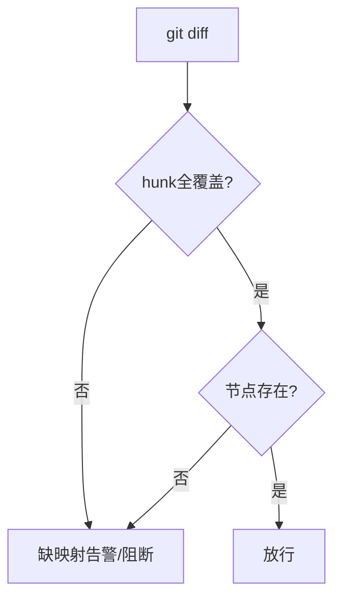
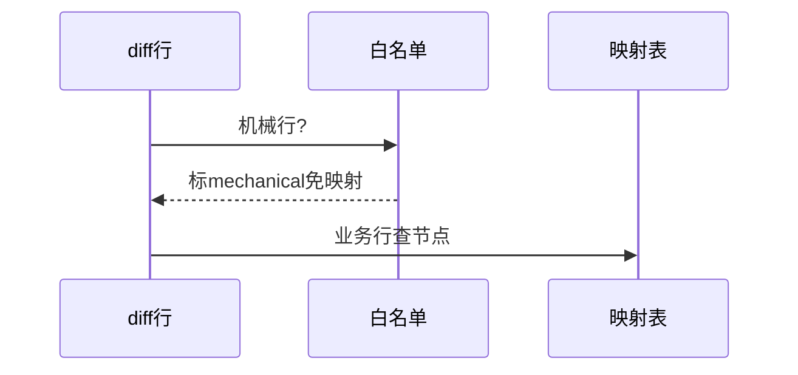
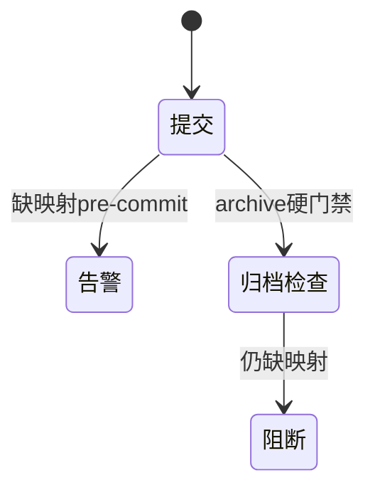

# Research Report — 行级映射可行性速查（T2112）

## 调研目标
确认hunk映射表在git侧可实现：diff解析、机械行识别、分级卡点接线。

## 方法
抽查git diff结构与现有manifest/digest机制，评估映射表校验成本。

## 发现
hunk头自带文件与行段，可机检存在性；机械行可用白名单+标mechanical；archive门禁复用disposition校验链，pre-commit告警不阻断日常提交。

### 映射校验流程（mermaid）

Source: scripts/register-evidence.py:83与125行

### 豁免分支时序（mermaid）

Source: scripts/pdca_core.py 先调研门禁段

### 分级状态机（mermaid）

Source: https://lean.org/lexicon-terms/pdca

## 结论与建议
可行，进Do做双方案对比。

## 术语表
- hunk：diff行段单元

## 参考资料
- Source: https://lean.org/lexicon-terms/pdca
- Source: https://www.researchgate.net/publication/349440276_PDCA_Cycle_Method_implementation_in_Industries_A_Systematic_Literature_Review
