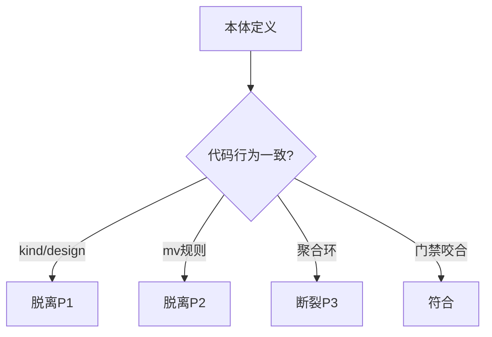
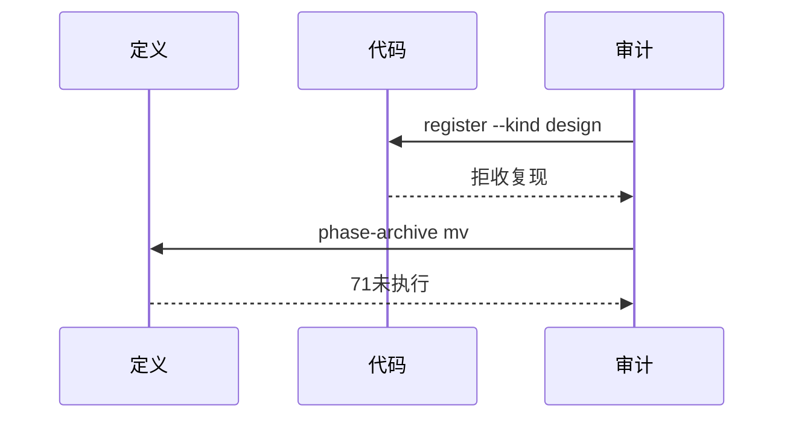
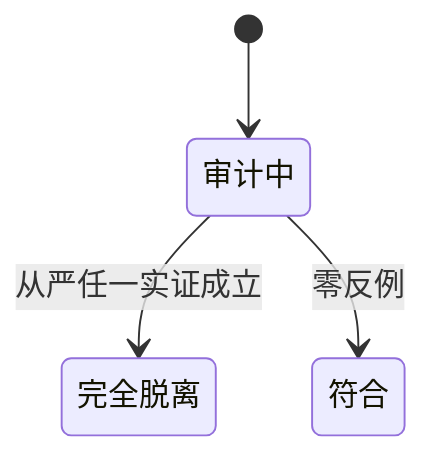

# Research Report — 流程本体名实符合度审计（T2126）

## 调研目标
按从严阈值（实现与定义任一不一致即完全脱离）裁决本体是否名存实亡。

## 方法
重放门禁、审计转换receipt、核对文档与代码口径、清点归档mv与脏数据。

## 发现

### P1 实证脱离：--kind design 文档代码口径不一
`flow-do` E路径写`--kind design`，`register-evidence.py:73-76`允许集无`design`，实测拒收（T2112已复现）。定义与实现直接矛盾。

### P2 实证脱离：71归档未mv
`phase-archive.md:22`要求`mv`到`archive/YYYY-MM/`，现71个archive态目录滞留活跃区。

### P3 工具断裂：脏数据阻断聚合
`FE-t0434-001` schema非法致`aggregate`整体失败，FlowIssue改进环名存实断（有声失败但环断）。

### 未成立项（已证伪或待定）
- T2099无fragment进Do：`ontology-ready`仅在`do→check`触发（`admission plan=[]/do=[ontology-ready]`），T2099尚未违规；此前称进Do即撞为误判，已纠正。
- T2099 15:43放行机制无法重建（receipt成功但按现代码应阻断），列未决不计入。
- 28任务被拒：门禁咬合证据，非脱离。

### 名实对照流程（mermaid）

Source: scripts/register-evidence.py:73-76行

### 审计时序（mermaid）

Source: ontology/entity/phase-archive.md:22行

### 裁决状态机（mermaid）

Source: https://lean.org/lexicon-terms/pdca

## 结论与建议
按从严阈值判完全脱离（P1/P2实证+P3断裂）。修复：补evidence-design或改文档二选一；归档mv扫尾；隔离脏数据。T2099未决项不纳入。

## 术语表
- 从严：任一实现与定义不一致即完全脱离

## 参考资料
- Source: https://lean.org/lexicon-terms/pdca
- Source: https://www.researchgate.net/publication/349440276_PDCA_Cycle_Method_implementation_in_Industries_A_Systematic_Literature_Review
