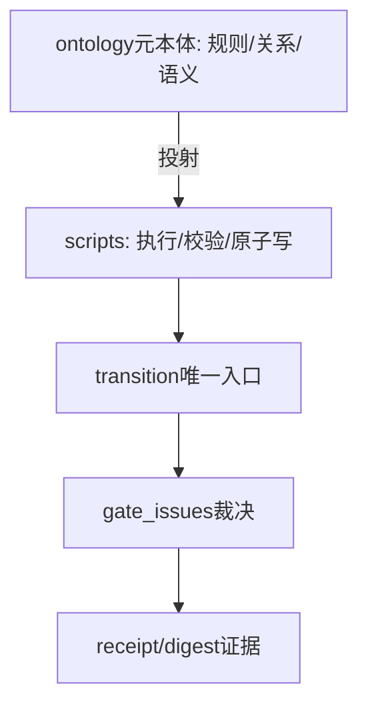
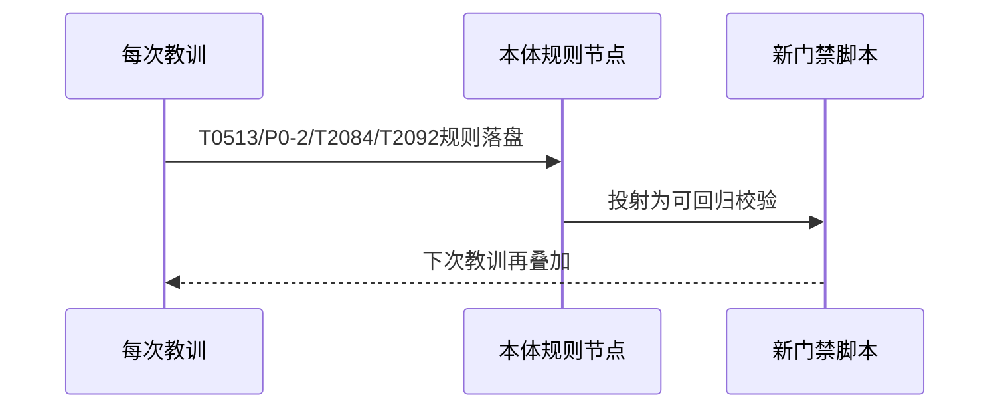
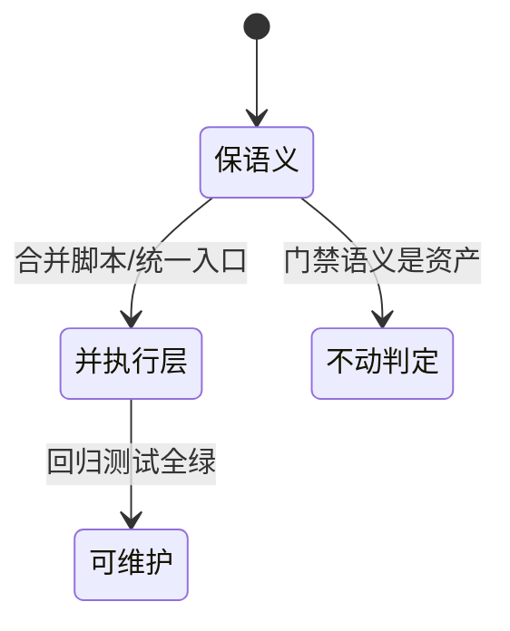

# Research Report — PDCA流程复杂度与简化调研（T2111）

## 调研目标
判定流程是否太复杂、能否简化；解释本体承载下为何仍有75个py脚本。

## 方法
全量普查scripts/职责分类，核验本体投射标记覆盖率，对比本体/脚本体量，追踪门禁调用收敛点。

## 发现

### 量化
- 脚本75个约1.6M，本体553节点约3.2M，测试64个；本体内容量约为脚本2倍，知识主体仍在本体。
- 43/75脚本带本体投射头（T2053），44带本体是源声明；剩余多为路由/脚手架杂项。
- 职责大类：门禁判定约20、本体校验推理约26、FlowIssue改进约14、证据收敛约5、路由杂项约10。
- 调用收敛：全部阶段转换经`transition-phase.py:142`唯一`gate_issues`入口，脚本是叶执行器而非迷宫。

### 本体脚本分层（mermaid）

Source: scripts/transition-phase.py:18与142行

### 复杂度来源时序（mermaid）

Source: scripts/pdca_core.py 先调研与叶豁免门禁段

### 简化杠杆状态机（mermaid）

Source: https://lean.org/lexicon-terms/pdca

## 结论与建议
1. 不以数量判复杂：75脚本是43条以上本体规则的可回归投射，无脚本则门禁退化为文档呼吁；判据应为可测试性与职责可定位，两者当前成立（validate OK/64测试）。
2. 真复杂度在门禁数量而非脚本体量：每轮教训加硬门禁是刻意选择，简化应并执行层（统一入口如flow_issues共享原语、合并check-*契约脚本），不动判定语义。
3. 建议后继：先给scripts做职责清单与调用图，再并重复校验逻辑；本任务只调研不定案。

## 术语表
- 投射：本体规则到代码的确定性实现，头注T2053
- 收敛点：transition唯一门禁入口

## 参考资料
- Source: https://lean.org/lexicon-terms/pdca
- Source: https://www.researchgate.net/publication/349440276_PDCA_Cycle_Method_implementation_in_Industries_A_Systematic_Literature_Review
