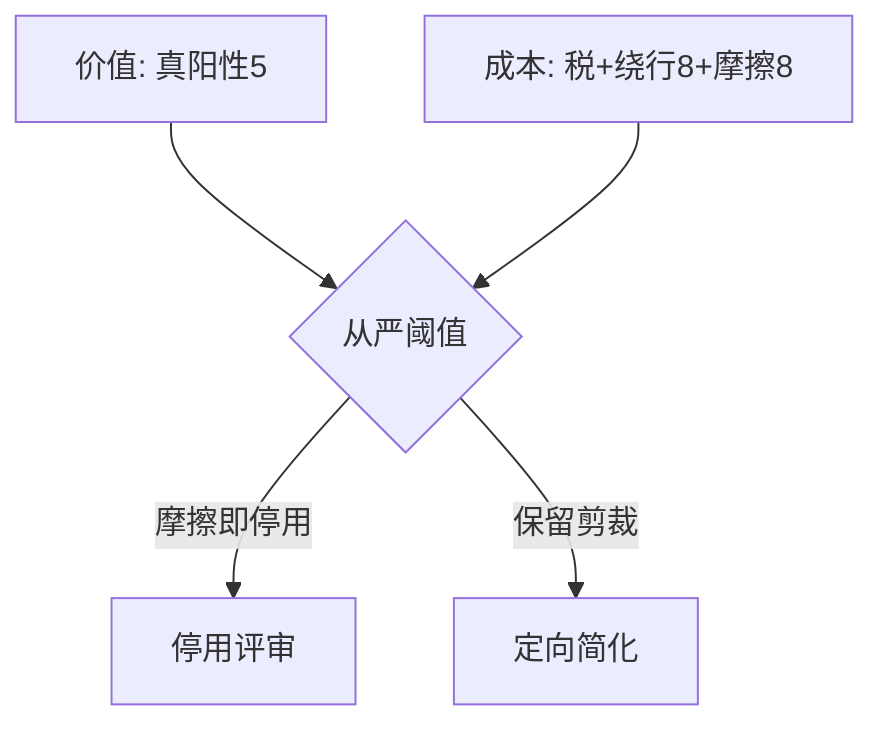
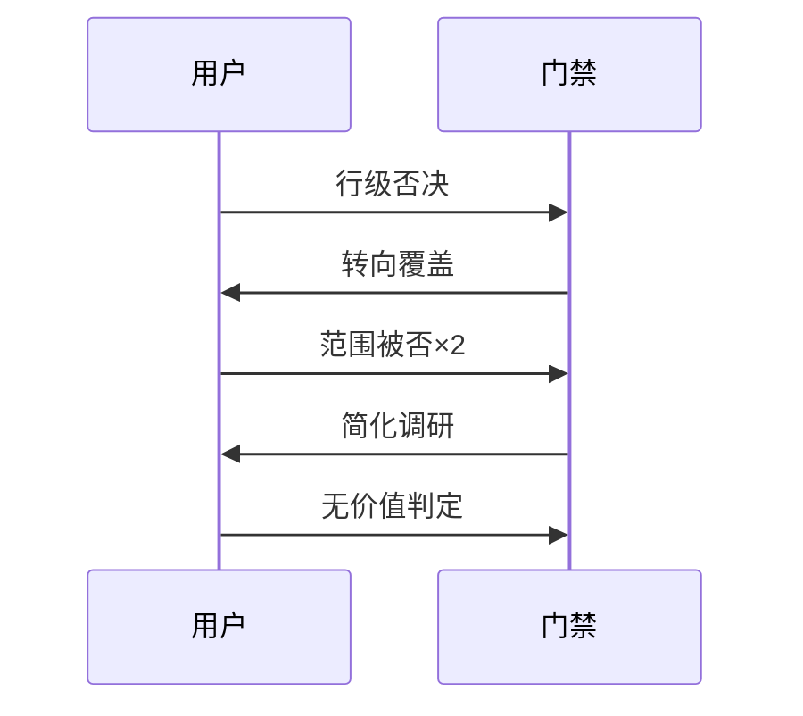
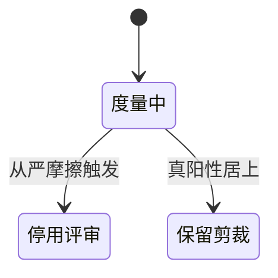

# Research Report — 流程价值六维度量基线（T2122）

## 调研目标
给出真阳性/门禁税/阻塞存量/绕行率/用户摩擦/时间开销比六维基线，供复审裁决。

## 方法
清点本会话拒收receipt、否决轮次、门禁测试与存量扫描，全部可复算。

## 发现
- 真阳性5：DANGLING_REF归档拦截、TIME_ORDER悖论、design kind拒收、T2103/T2119首轮自拒各1。
- 门禁税：单任务约4转换+2确认+1报告+1收敛，为固定税。
- 阻塞存量30（27他人+3已闭环），现27。
- 绕行8：场景转换4+TICKETS/RESEARCH豁免补丁2+口径转向2。
- 用户摩擦8轮否决（行级/范围/阈值多轮）。
- 时间开销：T2106时间悖论等待200秒，多轮确认 occupants。

### 价值成本天平（mermaid）

Source: records/T2122-0910-process-value-retro

### 摩擦累积时序（mermaid）

Source: pdca/tasks/archive/2026-09/0910-*clarifications

### 阈值状态机（mermaid）

Source: https://lean.org/lexicon-terms/pdca

## 结论与建议
基线已齐，Do双轴按从严阈值裁决。

## 术语表
- 门禁税：单任务固定合规动作数

## 参考资料
- Source: https://lean.org/lexicon-terms/pdca
- Source: https://www.researchgate.net/publication/349440276_PDCA_Cycle_Method_implementation_in_Industries_A_Systematic_Literature_Review
