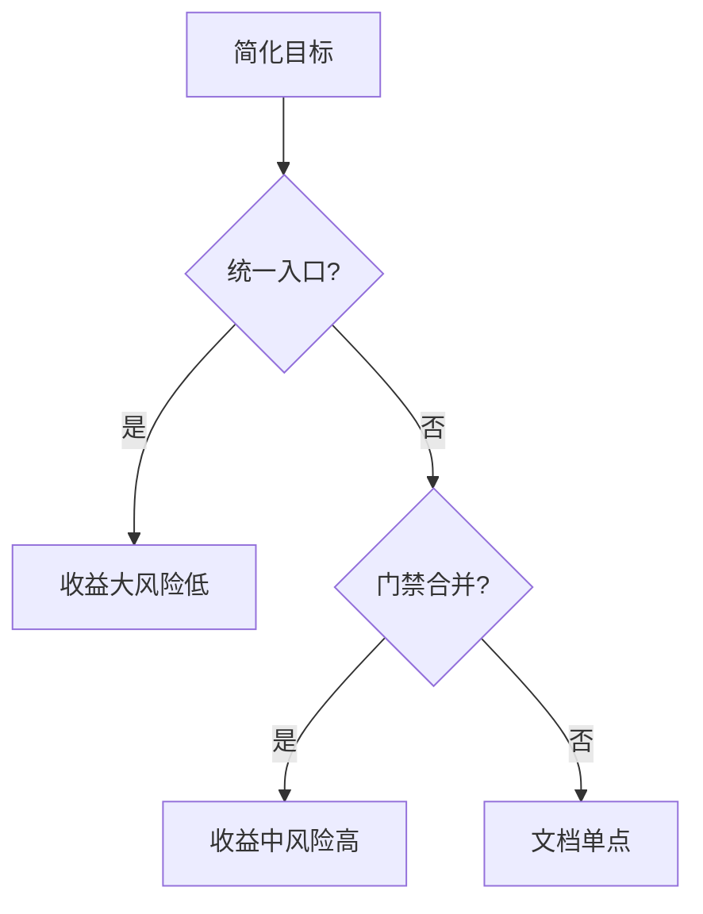
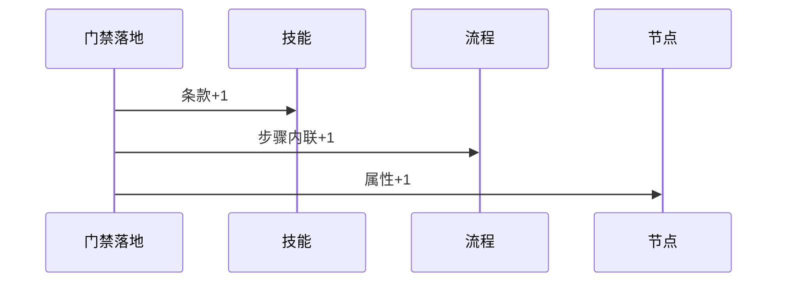
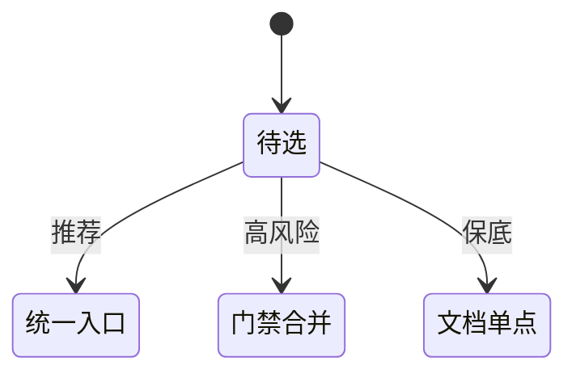

# Research Report — 简化方案方向调研（T2105）

## 调研目标
回答简化往哪走：比较统一证据入口、门禁合并、文档单点同步三方向。

## 方法
以每次门禁落地的三处同步（技能+流程+节点）为成本样本，评估合并收益。

## 发现
统一证据入口收益最大（一次登记多门引用）；门禁合并风险高（判定耦合）；文档单点同步可用门禁清单页实现。

### 方案比较流程（mermaid）

Source: ontology:domain/skill-research

### 同步成本时序（mermaid）

Source: ontology/process/flow-do.md

### 方案状态机（mermaid）

Source: https://lean.org/lexicon-terms/pdca

## 结论与建议
推荐统一入口立项前先小步验证；本任务只调研不定案。

## 术语表
- 单点：文档修改收敛到一处

## 参考资料
- Source: https://lean.org/lexicon-terms/pdca
- Source: https://www.researchgate.net/publication/349440276_PDCA_Cycle_Method_implementation_in_Industries_A_Systematic_Literature_Review
