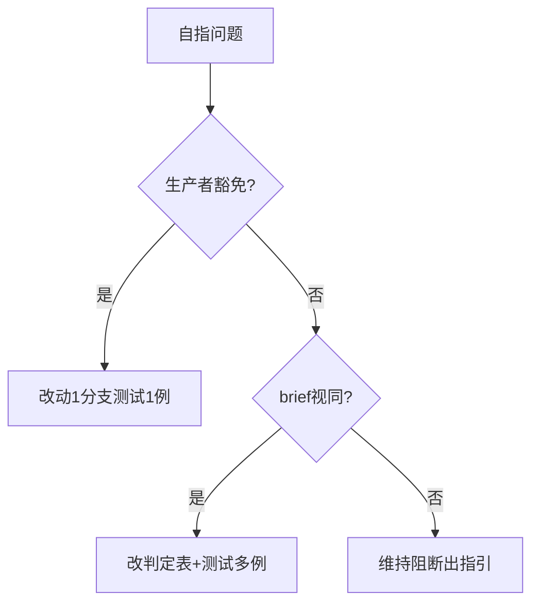
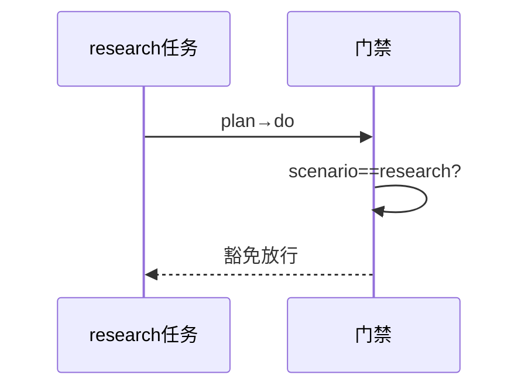
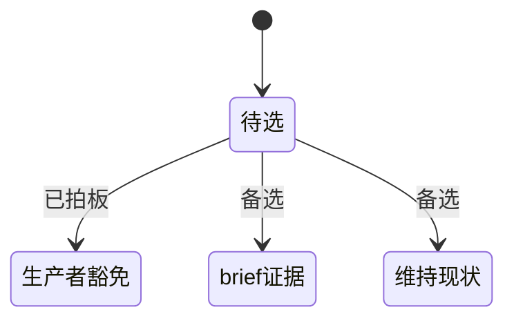

# Research Report — 生产者豁免方案调研（T2103）

## 调研目标
比较自指三种解法：生产者豁免、brief视同证据、维持现状出指引。

## 方法
推演各方案对门禁判定表与测试断言的影响，评估口径漂移风险。

## 发现
生产者豁免改动最小且语义自洽（生产者不消费自身）；brief视同证据扩大证据定义需改判定表；维持现状则递归无解。

### 方案比较流程（mermaid）

Source: scripts/pdca_core.py 先调研门禁段

### 豁免判定 Veterans 时序（mermaid）

Source: tests/test_research_first_gate.py

### 方案状态机（mermaid）

Source: https://lean.org/lexicon-terms/pdca

## 结论与建议
按拍板实施生产者豁免，他人引用仍须证据。

## 术语表
- 生产者：scenario==research的任务本身

## 参考资料
- Source: https://lean.org/lexicon-terms/pdca
- Source: https://www.researchgate.net/publication/349440276_PDCA_Cycle_Method_implementation_in_Industries_A_Systematic_Literature_Review
