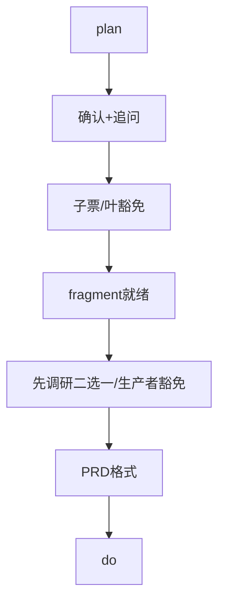
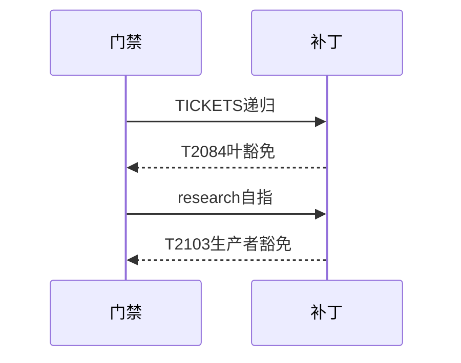
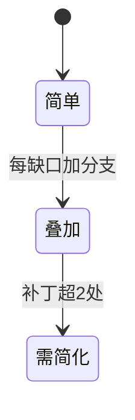

# Research Report — 门禁叠加成本与简化必要性（T2104）

## 调研目标
回答流程是否需要简化：统计plan→do门禁叠加项与叶票合规成本。

## 方法
枚举现行门禁清单，测算叶票为过门禁所需的人工制品数。

## 发现
plan→do现有确认、追问、子票、fragment、 research二选一、PRD格式六重门；叶票须自备报告；有叶豁免与生产者豁免两处收敛补丁，补丁叠补丁是简化信号。

### 门禁叠加流程（mermaid）

Source: scripts/pdca_core.py 先调研门禁段

### 补丁叠加时序（mermaid）

Source: tests/test_tickets_gate.py

### 成本状态机（mermaid）

Source: https://lean.org/lexicon-terms/pdca

## 结论与建议
有必要定向简化，建议后继立项统一证据入口；本任务只调研不定案。

## 术语表
- 叠加：门禁数量与分支条件增长

## 参考资料
- Source: https://lean.org/lexicon-terms/pdca
- Source: https://www.researchgate.net/publication/349440276_PDCA_Cycle_Method_implementation_in_Industries_A_Systematic_Literature_Review
