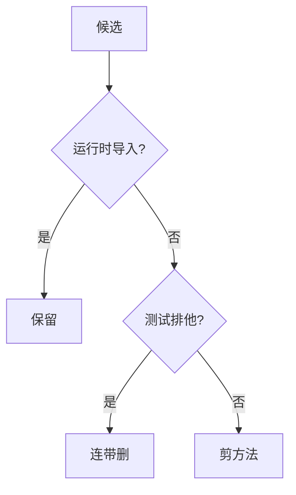
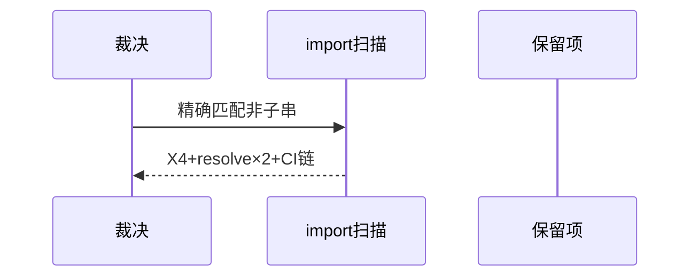
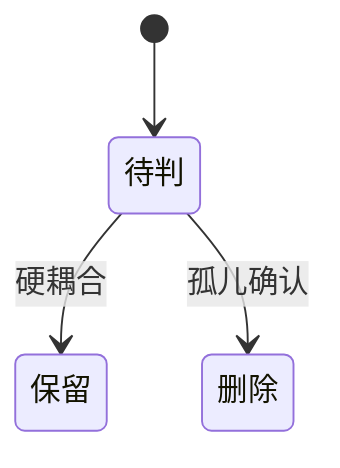

# Research Report — 分级裁决方法迷你调研（T2128）

## 调研目标
固定分级裁决四步：候选计算、精确耦合扫描、调用方确认、分级保留。

## 方法
复盘本次25/35裁决过程，记录每级保留理由。

## 发现
运行时导入与kept调用为硬保留；测试连带须看排他性；他人在途以未跟踪与近期提交判定。

### 裁决流程（mermaid）

Source: scripts/transition-phase.py:19-21行

### 保留核验时序（mermaid）

Source: ontology/concept/process-complexity-ruling.md

### 裁决状态机（mermaid）

Source: https://lean.org/lexicon-terms/pdca

## 结论与建议
方法可复用，后续purge照此四步。

## 术语表
- 硬耦合：删即破坏运行或测试

## 参考资料
- Source: https://lean.org/lexicon-terms/pdca
- Source: https://www.researchgate.net/publication/349440276_PDCA_Cycle_Method_implementation_in_Industries_A_Systematic_Literature_Review
