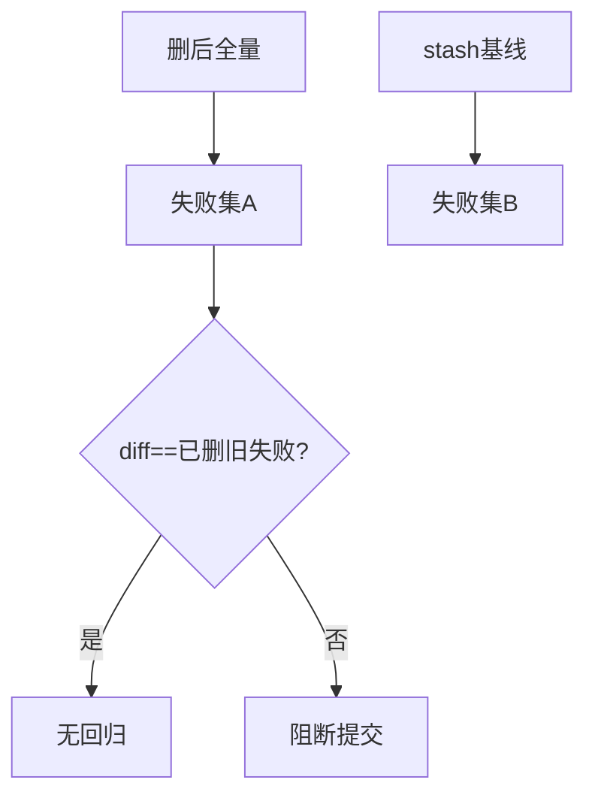
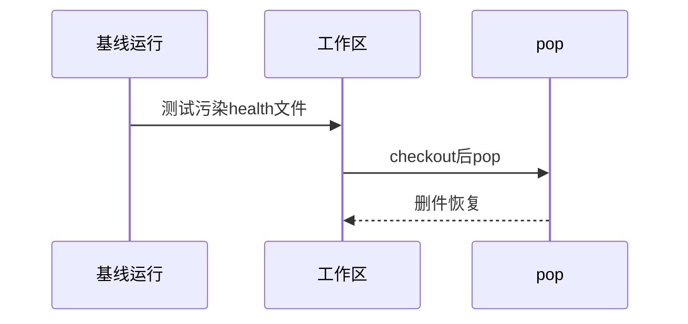
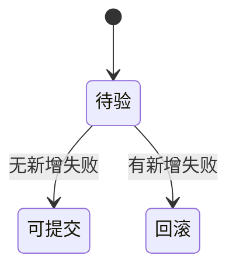

# Research Report — 删除回归验证迷你调研（T2129）

## 调研目标
确认删除前后失败集一致且提交可revert。

## 方法
stash对照全量失败集，diff仅少已删文件旧失败。

## 发现
前后51/56差集恰为已删文件5旧失败；stash污染工作区一次，已用checkout恢复。

### 回归对比流程（mermaid）

Source: tests/test_operations.py

### 污染恢复时序（mermaid）

Source: records/T2127-0910-uncovered-scripts-purge/evidence/DELETION-MANIFEST.md

### 回归状态机（mermaid）

Source: https://lean.org/lexicon-terms/pdca

## 结论与建议
无回归，可提交。

## 术语表
- 差集：前后失败集合之差

## 参考资料
- Source: https://lean.org/lexicon-terms/pdca
- Source: https://www.researchgate.net/publication/349440276_PDCA_Cycle_Method_implementation_in_Industries_A_Systematic_Literature_Review
