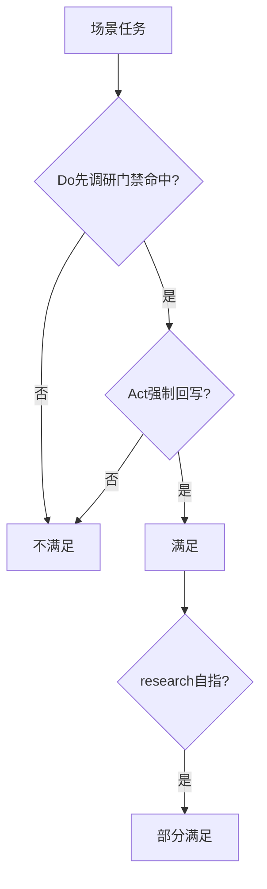
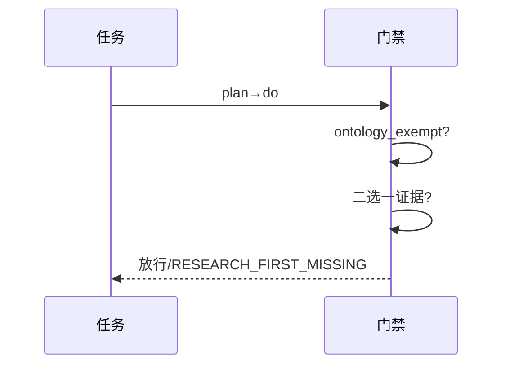
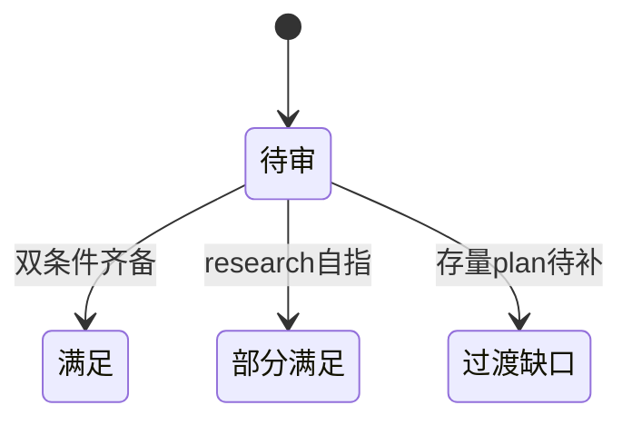

# Research Report — 全场景先调研产本体满足度预扫描（T2096）

## 调研目标
预扫描六场景相对 dual 条件的满足度：Do有先调研门禁且Act强制回写本体。

## 方法
核验门禁代码落点、适用场景枚举、豁免条款与回写门禁，全量扫描plan任务影响。

## 发现
development/bugfix/documentation/design/review五场景双条件齐备；research因生产者自指记partial；30存量plan任务待补调研属过渡期缺口。

### 双条件核验流程（mermaid）

Source: scripts/pdca_core.py 先调研门禁段

### 豁免与自指时序（mermaid）

Source: ontology:concept/research-first-gate

### 满足度状态机（mermaid）

Source: https://lean.org/lexicon-terms/pdca

## 结论与建议
机制层五满足一partial；执行层30任务待补；Do双轴复核后下 verdict。

## 术语表
- dual：先调研与产本体双条件

## 参考资料
- Source: https://lean.org/lexicon-terms/pdca
- Source: https://www.researchgate.net/publication/349440276_PDCA_Cycle_Method_implementation_in_Industries_A_Systematic_Literature_Review
