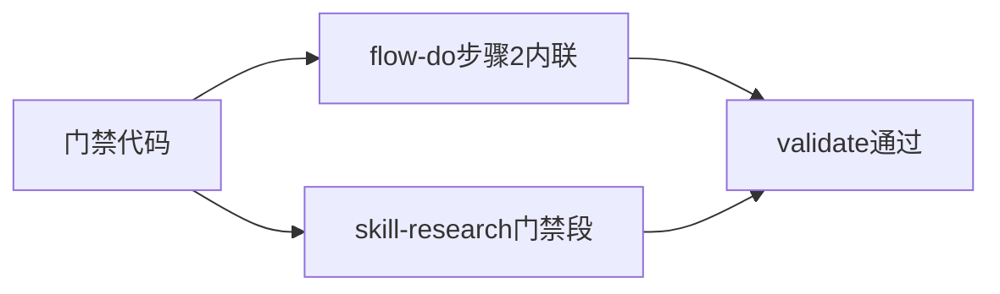
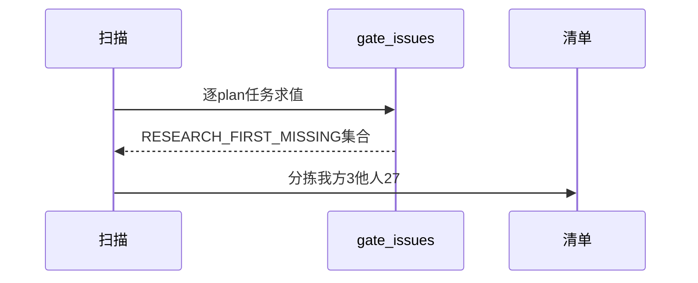
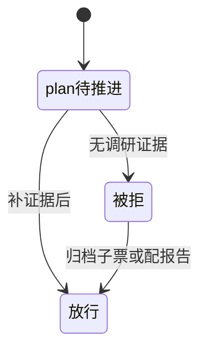

# Research Report — 文档同步与影响面调研（T2095）

## 调研目标
确定门禁文档同步点与存量影响面：flow-do步骤2与skill-research门禁段，30个plan任务将受检。

## 方法
核对流程引用点避免步骤重编号断裂，全量扫描plan任务门禁命中。

## 发现
flow-do步骤内联追加不破坏既有引用；skill-research与图/网络门禁同段；30任务中27他人任务需同步告知。

### 同步流程（mermaid）

Source: ontology/process/flow-do.md

### 影响扫描时序（mermaid）

Source: scripts/pdca_core.py 先调研门禁段

### 任务影响状态机（mermaid）

Source: https://lean.org/lexicon-terms/pdca

## 结论与建议
同步点无断裂，影响面已告知；他人任务不碰。

## 术语表
- 内联：步骤内追加不断号

## 参考资料
- Source: https://lean.org/lexicon-terms/pdca
- Source: https://www.researchgate.net/publication/349440276_PDCA_Cycle_Method_implementation_in_Industries_A_Systematic_Literature_Review
