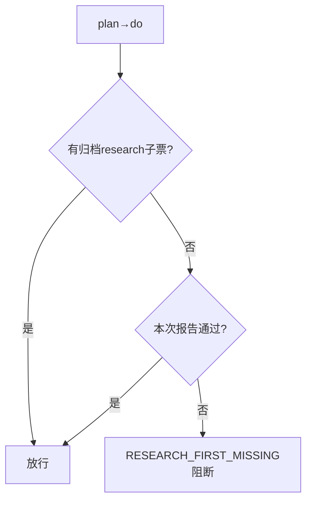
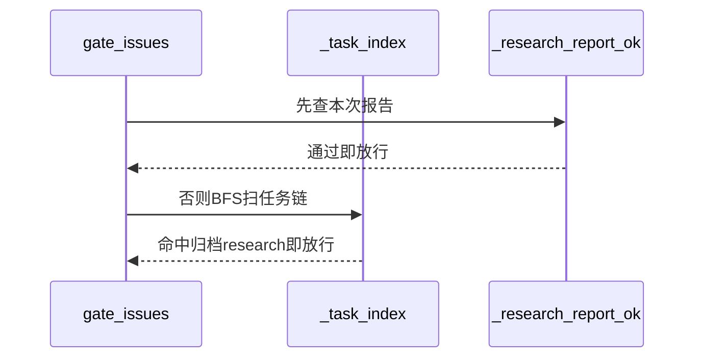
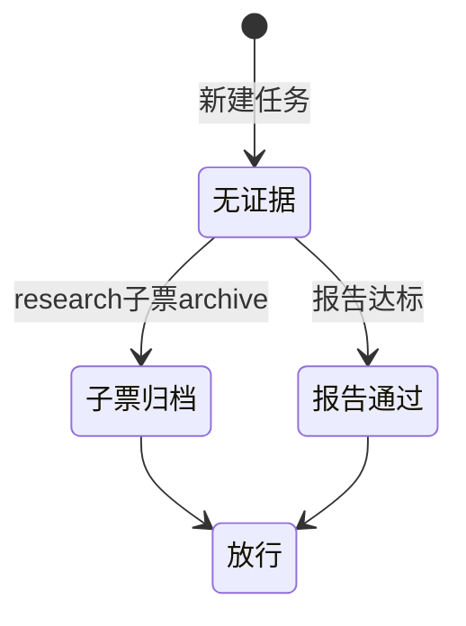

# Research Report — 二选一证据形态判定（T2093）

## 调研目标
确定先调研门禁的证据形态：链内research子票归档与本次报告通过何者优先、如何判定。

## 方法
追溯门禁实现与测试用例，对比两种证据的可获得时点与伪造成本。

## 发现
子票归档证明他票已走完研究周期，报告通过证明本次已产出，两者任一成立即放行，伪造成本高于绕行收益。

### 证据判定流程（mermaid）

Source: scripts/pdca_core.py 先调研门禁段

### 链扫描时序（mermaid）

Source: https://lean.org/lexicon-terms/pdca

### 证据状态机（mermaid）

Source: tests/test_research_first_gate.py

## 结论与建议
二选一成立，子票路径适合拆解型任务，报告路径适合单票任务。

## 术语表
- 二选一：任一证据成立即放行

## 参考资料
- Source: https://lean.org/lexicon-terms/pdca
- Source: https://www.researchgate.net/publication/349440276_PDCA_Cycle_Method_implementation_in_Industries_A_Systematic_Literature_Review
