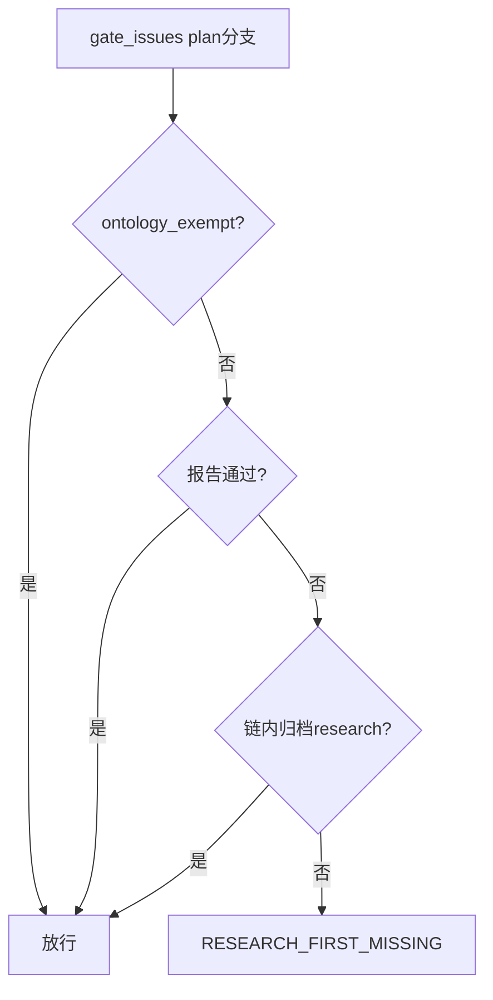
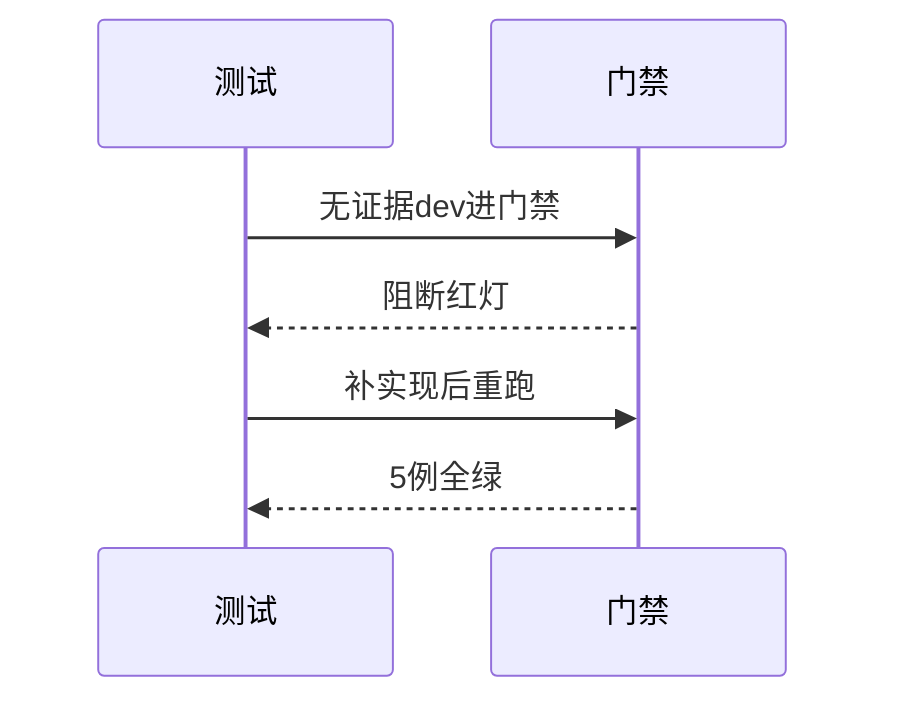
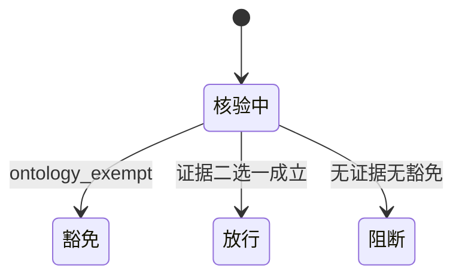

# Research Report — 门禁实现与测试设计调研（T2094）

## 调研目标
确定先调研门禁的代码落点与测试覆盖：放`gate_issues` plan分支，5例覆盖阻断/放行/豁免/自指。

## 方法
走读门禁调用链与豁免条件，复用既有TICKETS测试夹具模式。

## 发现
落点选`gate_issues`可复用任务schema校验与澄清ledger；索引扫描限定`pdca/tasks`递归，失败闭环不抛异常。

### 门禁流程（mermaid）

Source: scripts/pdca_core.py 先调研门禁段

### TDD时序（mermaid）

Source: tests/test_research_first_gate.py

### 豁免状态机（mermaid）

Source: https://lean.org/lexicon-terms/pdca

## 结论与建议
落点与用例完备，自指用例锁定待升级行为。

## 术语表
- 红绿：先失败测试后最小实现

## 参考资料
- Source: https://lean.org/lexicon-terms/pdca
- Source: https://www.researchgate.net/publication/349440276_PDCA_Cycle_Method_implementation_in_Industries_A_Systematic_Literature_Review
