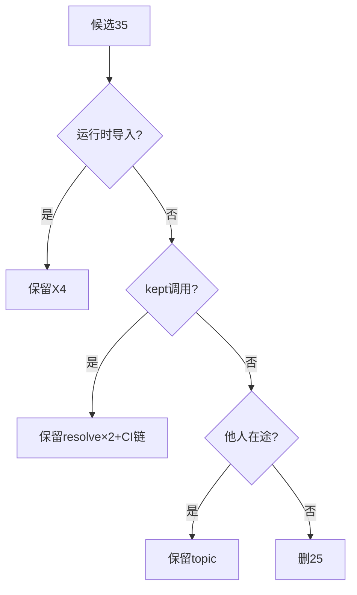
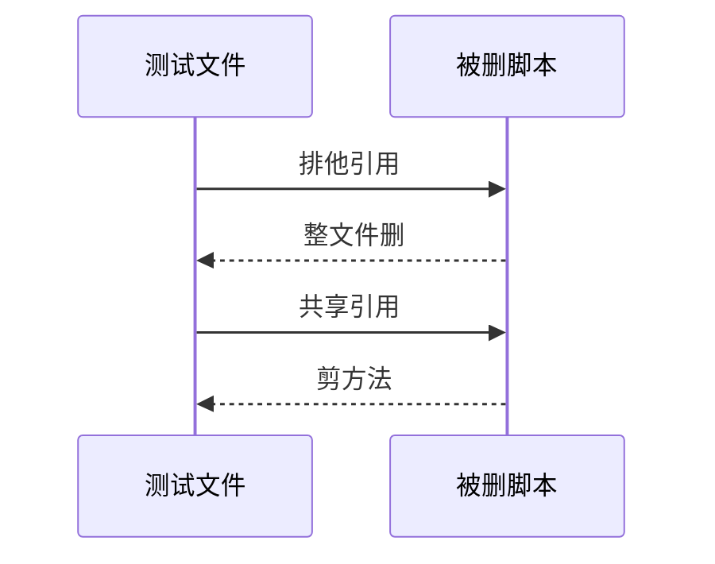
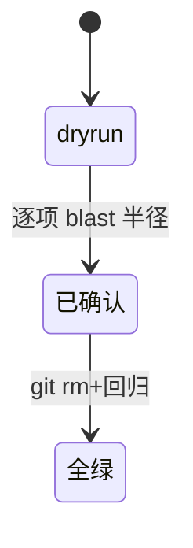

# Research Report — purge爆破半径调研（T2127）

## 调研目标
确定25删件的精确 blast 半径：运行时导入、测试耦合、CI调用、并发在途。

## 方法
精确import扫描、子进程调用扫描、skills与workflow引用扫描、git近期使用核查。

## 发现
删25留10：X4运行时导入保留；resolve×2被kept脚本调用保留；ci/production/scenario-mismatch为CI链保留；topic-coverage他人在途保留；test_flow_issues整文件删（链式依赖已断），test_operations剪6法，test_remediate整文件删。

### 耦合判定流程（mermaid）

Source: scripts/transition-phase.py:19-21行

### 测试连带时序（mermaid）

Source: tests/test_flow_issues.py:342行链式依赖

### 删除状态机（mermaid）

Source: https://lean.org/lexicon-terms/pdca

## 结论与建议
清单可执行，进Do删除。

## 术语表
- blast半径：删除影响的调用方集合

## 参考资料
- Source: https://lean.org/lexicon-terms/pdca
- Source: https://www.researchgate.net/publication/349440276_PDCA_Cycle_Method_implementation_in_Industries_A_Systematic_Literature_Review
