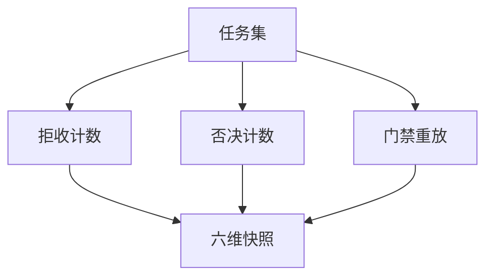
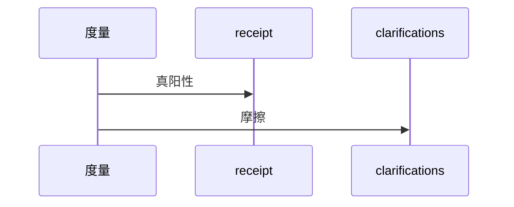
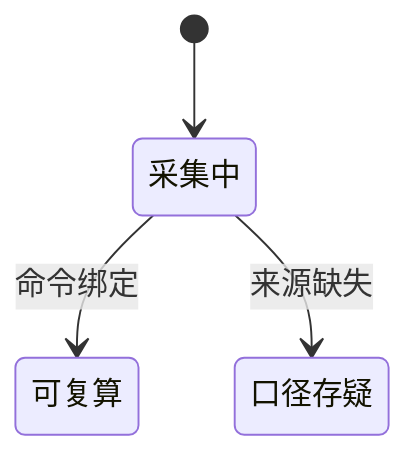

# Research Report — 六维复算方法迷你调研（T2123）

## 调研目标
固定六维的复算命令，使复盘可重跑。

## 方法
逐维绑定命令与计数源。

## 发现
真阳性点拒收receipt，否决点clarifications，阻塞点gate_issues重放，均值点任务均值脚本。

### 复算流程（mermaid）

Source: scripts/pdca_core.py 门禁段

### 计数时序（mermaid）

Source: records/T2122-0910-process-value-retro/evidence/review.md

### 快照状态机（mermaid）

Source: https://lean.org/lexicon-terms/pdca

## 结论与建议
复算闭环，后续复盘复用。

## 术语表
- 复算：同命令得同数

## 参考资料
- Source: https://lean.org/lexicon-terms/pdca
- Source: https://www.researchgate.net/publication/349440276_PDCA_Cycle_Method_implementation_in_Industries_A_Systematic_Literature_Review
