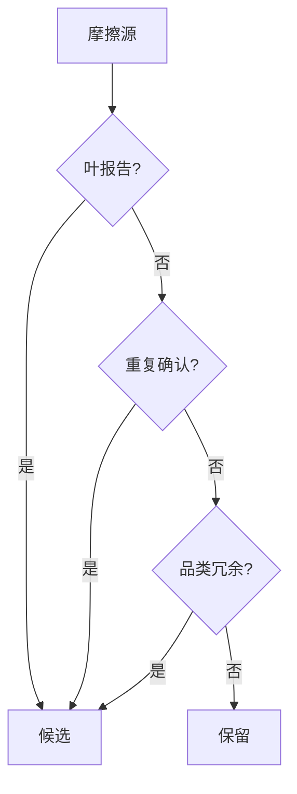
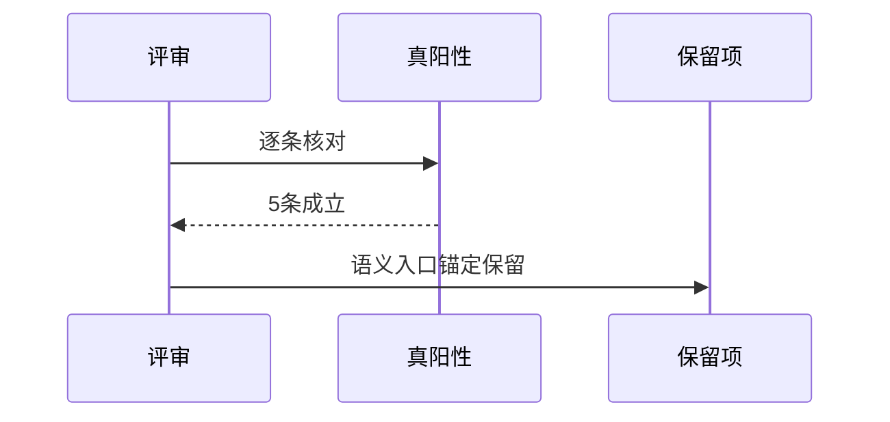
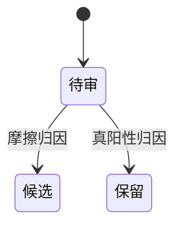

# Research Report — 停用候选清单迷你调研（T2124）

## 调研目标
列出范围停用评审的候选项与保留项边界。

## 方法
按摩擦来源归类候选，按真阳性归类保留。

## 发现
候选：叶报告通胀、重复确认、品类冗余；保留：判定语义、唯一入口、证据锚定。

### 候选分类流程（mermaid）

Source: records/T2122-0910-process-value-retro/evidence/review.md

### 保留核验时序（mermaid）

Source: ontology:concept/process-value-verdict

### 清单状态机（mermaid）

Source: https://lean.org/lexicon-terms/pdca

## 结论与建议
清单移交停用评审任务。

## 术语表
- 候选：可停用的执行层负担

## 参考资料
- Source: https://lean.org/lexicon-terms/pdca
- Source: https://www.researchgate.net/publication/349440276_PDCA_Cycle_Method_implementation_in_Industries_A_Systematic_Literature_Review
