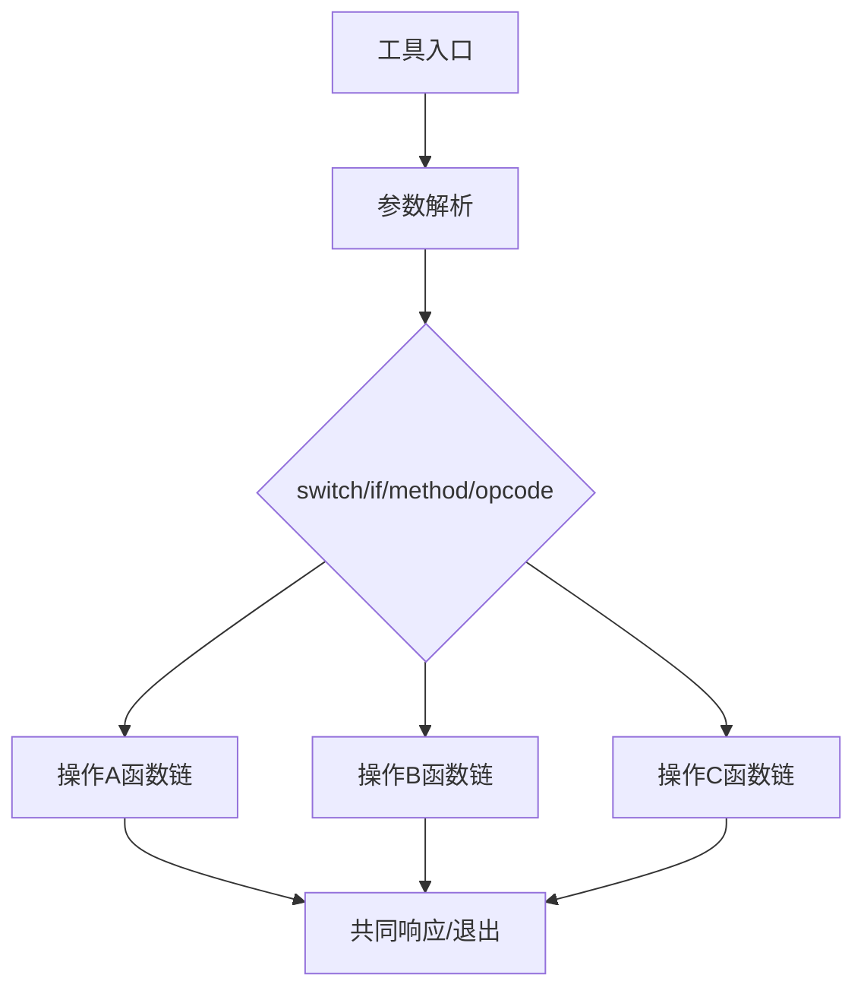
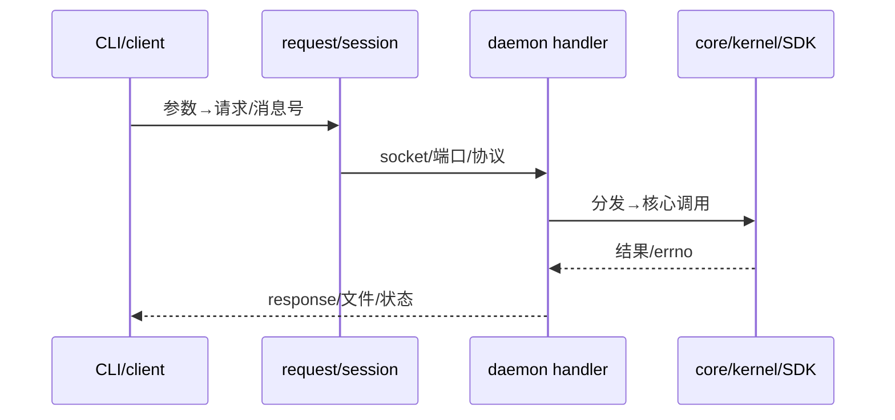

# T2180 Research-first：调用链颗粒度校准

## 问题

用户要求 `rdb-tools-design` 的调用链达到 `rdb-feature-design` 的表达颗粒度。需要识别参照物真正有效的结构，而非机械复制其篇幅。

## 参照实证

`rdb-feature-design` 使用短 `SKILL.md`、总索引和版本化知识地图。其 6.2.0.0 CDM 地图先规定统一阶段，再对每个数据库的添加、检测、备份、挂载、恢复、回写等操作给出从 API 到 service/model、分发和 Airflow 出口的多层代码块；复杂机制另写分支、隐式契约和现行性。`rdb-tools-design` 当前 23 工具表主要为单行“入口→核心→输出”，因此差距是链路深度与操作覆盖，而不是缺少通用设计栏目。

Source: `/home/black/Public/aio/rdb-skills/skills/rdb-feature-design/SKILL.md`

Source: `/home/black/Public/aio/rdb-skills/skills/rdb-feature-design/references/03-aio-cdm-knowledge-map/6.2.0.0.md`

Source: `/home/black/Public/aio/rdb-skills/skills/rdb-tools-design/`

Source: `/home/black/Public/aio/aio-tools/6200/release/`

Source: https://developers.openai.com/api/docs/guides/latest-model

Source: https://learn.chatgpt.com/use-cases

## 颗粒度结论

调用链的最小完整单位是“一个外部可触发操作”，不是“一个工具”。同一工具有多个 subcommand、method 或 opcode 时必须逐支建链；公共前缀可以复用，但分支去向不能合并隐藏。

跨进程链必须越过传输边界：发送函数和常量、socket/端口、对端 handler、结果构造都要出现。只写一侧不能证明调用链闭合。

## 推荐落点

沿用 `rdb-feature-design` 的入口、索引、版本地图结构：在现有 01–04 分册内按工具和操作扩链，00 提供双维路由，05 连接构建 target 与运行链。不强制拆成 23 个页面，不以 Mermaid 或通用栏目作为完成条件。

## 边界

外部官方资料只支持“指令应清晰、知识工作应可验证”的一般原则；所有函数、分支、协议和状态结论必须来自 6200/release 源码。静态链路不替代运行环境测试。
