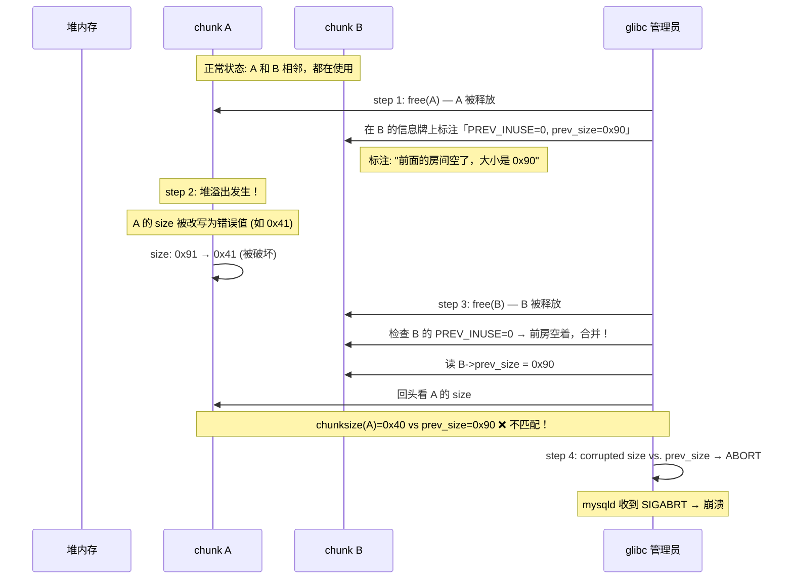
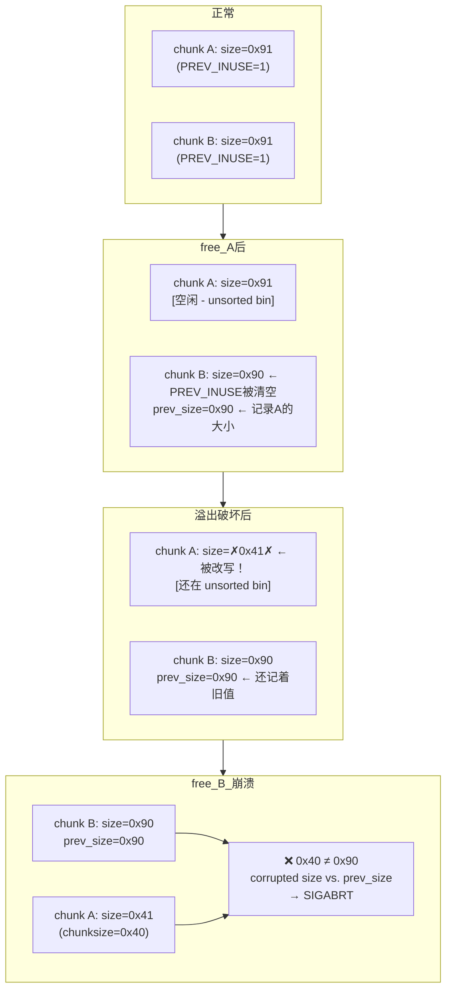

# 结论: malloc_consolidate(): invalid chunk size 复现

## 问题描述

MySQL (mysqld) 在 xtrabackup 备份完成后触发 `malloc_consolidate(): invalid chunk size` 错误，信号 6 (SIGABRT) 终止。

## 根因图解

### 场景：堆就像一栋宿舍楼

```
内存地址递增 ──────────────────────────────────────────────────────────►

┌──────────────────┬──────────────────┬──────────────────┬─────────────┐
│  prev_size │size │  用户数据区      │  prev_size │size │  用户数据   │
│  (8字节)   │8字节│                  │  (8字节)   │8字节│             │
├──────────────────┴──────────────────┴──────────────────┴─────────────┤
│  chunk A (共 0x90 字节)        │  chunk B (共 0x90 字节)             │
└─────────────────────────────────┴────────────────────────────────────┘
```

每个 malloc 出来的内存块就像一个**房间**，门口贴着**信息牌**（chunk header）：

- **size**: "本房间大小"
- **prev_size / PREV_INUSE**: "前一个房间是否住人"

### 崩溃四步曲



### 更形象的生活比喻

```
你住在「A 房间」，隔壁是「B 房间」。

管理员登记：
  A 房间 = 0x90 平米  [✓ 正常]
  B 房间 = 0x90 平米  [✓ 正常]

STEP 1 — 你搬走了：
  管理员在 B 房间门上写字：
  「你隔壁的 A 房间已空，面积 0x90，可打通合并」

STEP 2 — 有人改了 A 门牌：
  A 的「size」牌被人从 0x90 改成了 0x40（堆溢出）

STEP 3 — B 也要搬走：
  管理员看到 B 门上的标记：
  "前房空着，打通合并！"

STEP 4 — 管理员核实时傻眼了：
  B 门上写着「前房 0x90 平米」
  A 门上却写着「本房 0x40 平米」
  ── 这不对啊！哪个是真的？！
  → 报错崩溃
```



## 复现结果

| 项目 | 内容 |
|------|------|
| 系统 | glibc 2.44 (Arch Linux) |
| 实际报错 | `corrupted size vs. prev_size while consolidating` |
| 原报错 | `malloc_consolidate(): invalid chunk size` (旧版 glibc) |
| 复现方式 | 填满 tcache → free(A) → corrupt A->size → free(B) |

## 消息差异说明

- **旧版 glibc (< 2.44)**: 报错 `malloc_consolidate(): invalid chunk size`
- **glibc 2.44+**: 报错 `corrupted size vs. prev_size while consolidating`
- 本质相同：均为堆合并时 size 字段一致性校验失败

## 修复方向

- 检查所有堆操作边界，确保无缓冲区溢出
- 检查 use-after-free 场景（特别是在 MySQL 插件/xtrabackup 交互中）
- 使用 **AddressSanitizer (ASan)** 运行 `mysqld + xtrabackup` 定位溢出源
- 升级 glibc 版本得到更清晰的错误诊断信息
