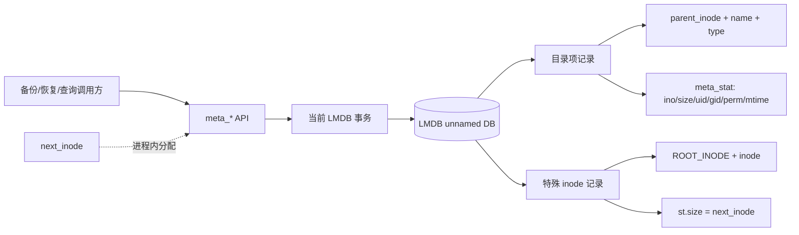
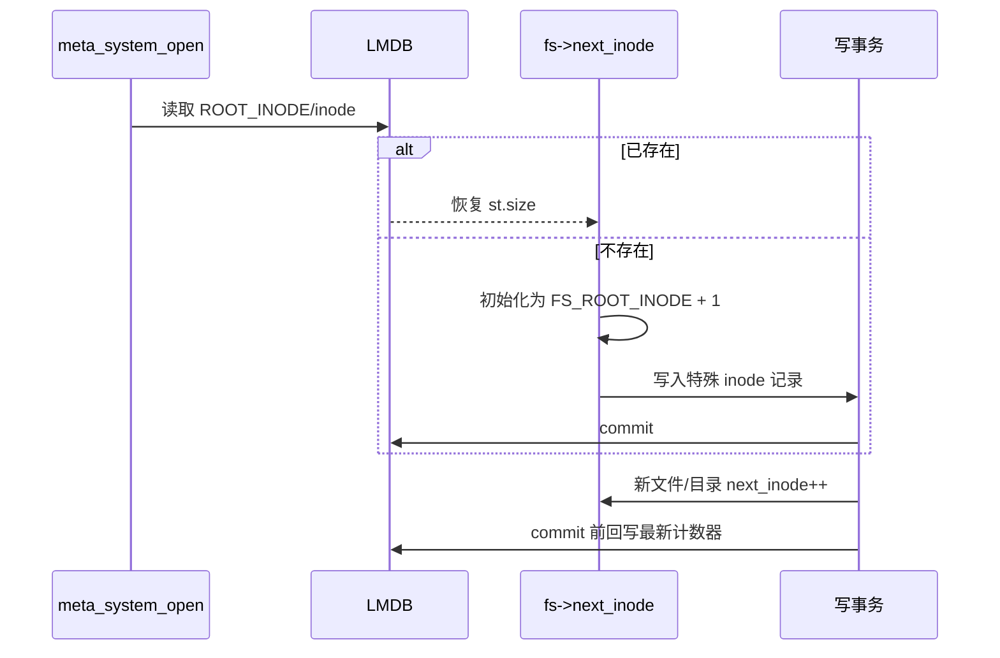
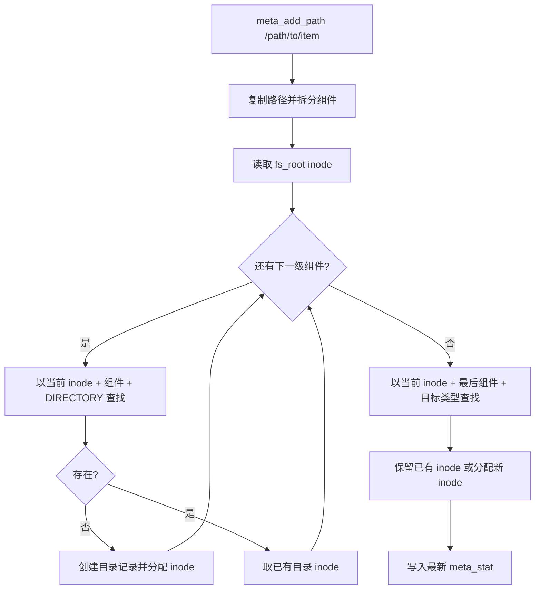
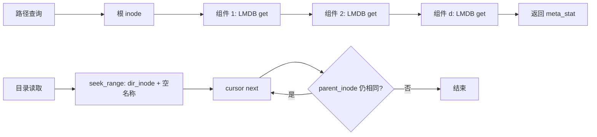
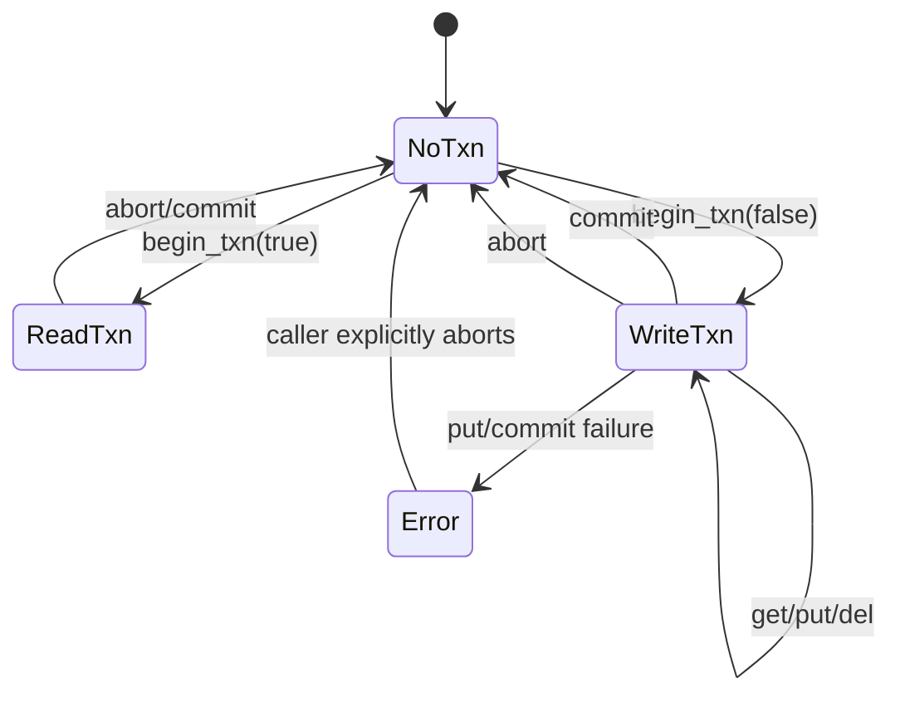

# `rpc/rpc-metadata.c` 海量文件元数据管理分析

## 调研目标

回答三个问题：元数据以什么结构落库、海量文件下各类操作如何扩展、当前实现的容量/一致性/边界风险是什么。分析对象以 `rpc/rpc-metadata.c` 为中心，补充其头文件、LMDB 封装、备份调用方和现有测试。

## 方法

采用源码静态分析，逐项追踪键值布局、inode 生命周期、路径操作、目录游标、事务封装和容量配置。源码行号以本次工作区版本为准。未进行百万/千万文件基准测试，因此文中性能数字均为复杂度推断，不是实测承诺。

## 发现

### 1. 总体模型：单库、单表、目录项即索引



这张图概括了一个重要边界：实现没有把全量文件元数据加载到内存，而是让 LMDB 负责持久化排序和查找；内存中只保留数据库句柄和 inode 分配游标。

`meta_system_t` 只持有一个 `lmdb_dict_t` 和进程内 `next_inode`；没有按目录拆分的子库，也没有全量内存索引（`rpc/rpc-metadata.c:12-15`）。LMDB 封装打开一个 unnamed DB，并安装自定义比较器（`libs/lmdb_dict.c:91-177`）。

每个文件或目录是一条 LMDB 记录：

```text
key   = { parent_inode, type, name_length, name }
value = { meta_stat_t { ino, size, uid, gid, perm, mtime } }
```

键的实际长度是 `offsetof(dirent_key_t, name) + namelen + 1`，只写入有效名称和结尾 NUL，不写满 256 字节数组（`rpc/rpc-metadata.h:30-39`、`rpc/rpc-metadata.c:46-63`）。父 inode 因而同时承担目录节点 ID 和键的分区前缀。值保存 inode、文件大小、属主、权限和修改时间（`rpc/rpc-metadata.h:21-28`）。

LMDB 比较顺序是：父 inode → 名称字节序 → 名称长度 → 类型（`rpc/rpc-metadata.c:17-44`）。因此同一目录的条目物理上相邻，可以通过 `MDB_SET_RANGE` 从目录前缀附近开始顺序读取；它不是对完整路径做单键查找。

```mermaid
block-beta
  columns 4
  A[父 inode] B[名称字节] C[名称长度] D[类型]
  space:4
  E[同一父 inode 的记录连续排列]
  F[seek_range 后可用 next 扫描目录]
  E --> F
```

### 2. inode 分配和持久化



- 根目录固定为 inode 2，保留父 inode 0 下的 `fs_root` 记录；启动时读取该记录。
- 下一个 inode 保存在父 inode 0、名称 `inode` 的特殊记录中，借用 `meta_value.st.size` 存储计数器（`rpc/rpc-metadata.c:105-177`）。
- 新目录/文件发现时直接执行 `fs->next_inode++`；已有记录更新元数据但保留原 inode（`rpc/rpc-metadata.c:253-286`、`394-509`）。
- `meta_system_commit_txn` 在提交前回写计数器（`rpc/rpc-metadata.c:224-235`）。因此 inode 分配是单进程内递增、重启后从最近一次成功提交恢复；事务中止后已消耗的内存计数不会回退，可能产生 inode 空洞，但下次打开会以持久化值为准。

这套设计避免了单独的 inode 表和路径反向索引，但 inode 计数器更新与业务记录依赖同一写事务；若调用方绕过事务或提交失败后的状态处理不完整，计数器与记录可能出现恢复语义差异。

### 3. 写入路径：按路径深度逐级查找/创建



`meta_add_path` 复制路径后用 `strtok_r` 拆分组件。对于中间组件，它只按“目录类型”查找；找不到则创建目录记录并分配 inode；最后一个组件按调用者给定类型写入文件或目录记录（`rpc/rpc-metadata.c:394-509`）。因此路径深度为 `d` 时，逻辑上需要 O(d) 次 LMDB 查找，新增路径还可能有 O(d) 次写入。

`meta_add_dirent` 是已知父 inode 场景的更短写入路径，仍然先查后写，以保留已有 inode（`rpc/rpc-metadata.c:253-286`）。备份调用方把一批遍历工作放在写事务中，并按 checkpoint 提交（`rpc/backup-client.cpp:1117-1207`），所以吞吐和恢复粒度取决于 checkpoint，而不是每个文件一次提交。

### 4. 读取、精确查询和目录遍历



- `meta_lookup_dirent`：已知父 inode、名称、类型时是一次 LMDB `get`，近似 O(log N) 的 B+ 树定位成本。
- `meta_get_path` / `meta_path_to_inode`：从根 inode 开始逐组件查找，成本为 O(d × lookup)，不会扫描全库（`rpc/rpc-metadata.c:524-588`、`683-749`）。
- `meta_read_directory_callback`：构造 `{dir_inode, "", META_TYPE_NULL}` 起始键，`seek_range` 后沿 cursor `next` 读取，直到父 inode 变化；读取一个目录包含 k 个条目时为 O(log N + k)，只保留当前 LMDB value 指针和回调参数，不把整个目录装进数组（`rpc/rpc-metadata.c:854-929`）。
- `meta_find_directory_entries`：同样先范围定位，再正向或反向游标扫描，并由 `find_count` 限制返回数量；分页/反向逻辑通过调整起始 inode 和跳过相同名称实现（`rpc/rpc-metadata.c:751-852`）。

因此，海量“总文件数”本身不会让单路径查询变成全表扫描；但单个超大目录的遍历仍与该目录条目数线性相关。全量备份/恢复若逐目录读取，累计成本仍近似 O(记录数)，优势在于流式 cursor 而非复杂度下降。

### 5. 删除语义

`meta_remove_path` 沿父目录链查找，最后只删除目标目录项（`rpc/rpc-metadata.c:607-681`）。它没有递归删除子项、回收 inode 或维护父目录计数。因此删除目录前必须由上层保证为空，删除后 inode 不复用；这有利于 inode 稳定性，但会留下 inode 空洞，长期运行时 inode 只增不减。

### 6. 事务和并发边界



`lmdb_dict` 只允许一个 `current_txn`，读写 API 必须先有事务；写事务中 `put/del` 直接操作当前事务，读事务提交时实际执行 abort（`libs/lmdb_dict.c:23-84`、`194-294`）。LMDB 本身提供单写者和 MVCC 读视图，但本封装对象内的事务指针不是多线程安全抽象：同一个 `meta_system_t` 不应被多个线程并发操作。

`meta_system_begin_txn` 会委托封装重新开始事务；元数据 API 本身不会自动创建事务。调用方必须保证整个遍历/批处理的 begin、commit、abort 配对。读操作保持长事务会固定快照并延迟 LMDB 资源回收，超大目录或全量恢复时应关注事务持续时间。

### 7. 海量规模下的空间模型

```mermaid
flowchart TD
    N[文件/目录总数 N] --> K[变长 key: 名称长度影响]
    N --> V[固定 value: meta_stat]
    N --> P[LMDB B+树页、节点和空闲页]
    K --> S[实际空间与写放大]
    V --> S
    P --> S
    S --> G[map_size / 地址空间上限]
    D[单目录条目数 k] --> T[目录遍历 O(log N + k)]
    H[路径深度 d] --> Q[路径查询 O(d × lookup)]
```

海量规模的关系可以概括为：总记录数 N 决定存储基线，名称长度和 LMDB 页结构决定实际放大；单目录扇出 k 决定遍历成本，路径深度 d 决定逐级查询成本。图中的复杂度是静态推断，尚未通过大规模基准测量。

每条记录的实际占用不是简单的 `sizeof(key)+sizeof(value)`：至少包括变长键、固定大小的 `meta_value_t`、LMDB 页内节点/页分裂、空闲页和数据库环境开销。目录名越长，键越大；条目越多，B+ 树页和维护写放大越明显。当前实现没有按数量自动扩容逻辑。

调用方将 `META_MAX_SIZE` 定义为 `UINT64_MAX`（`rpc/rpc.h:21-24`），并传给 `mdb_env_set_mapsize`（`libs/lmdb_dict.c:123-129`）。这表示“尽量放大地址空间”，不是可验证的磁盘容量保证；实际可用上限仍受 LMDB、进程地址空间、文件系统和平台实现约束。生产容量应基于真实 key/value 分布、LMDB page stats 和增长余量压测确定，而不能据此宣称无限容量。

### 8. 已发现的风险与边界


图中位置是基于代码风险的定性排序，不是线上事故概率统计。

按优先级分组：

| 优先级 | 风险 | 证据/影响 |
|---|---|---|
| P0 | `meta_system_open` 的失败路径释放 `fs` 后仍返回它 | `rpc/rpc-metadata.c:198-203`。`load_metadata` 失败时释放对象但缺少 `return NULL`，调用者可能拿到悬空指针。应先修复并补充失败注入测试。 |
| P0 | 名称长度没有边界校验 | `create_dirent_key` 将 `strlen` 转成 `uint8_t`，随后按原始 `size_t` `memcpy` 到 256 字节数组（`rpc/rpc-metadata.c:53-63`）。超过 255 字节可能截断长度并发生栈缓冲区越界；应在 API 入口拒绝超长名称。 |
| P1 | `map_size = UINT64_MAX` 缺乏可操作容量策略 | 可能在特定平台打开失败，也无法反映磁盘配额或增长告警。应增加容量计算、使用率监控和可演练的扩容策略。 |
| P1 | 提交失败/写入失败后的事务状态处理不统一 | `meta_system_commit_txn` 在回写计数器失败时直接返回，未显式 abort（`rpc/rpc-metadata.c:224-235`）；上层需确保失败路径最终 abort，否则会保留活动事务。 |
| P1 | 删除不递归、不回收 inode | 可避免误删和 inode 复用，但要求上层做空目录校验；长期增删会造成 inode 空洞。 |
| P2 | 路径组件和名称语义依赖 `strtok_r` | 连续 `/` 会被折叠，尾部 `/` 不参与名称；这适合规范化路径，但 API 未明确说明。`meta_get_path("/")` 的组件为空，初始化的 `err` 保持错误值，根路径读取可能返回 `META_ERROR`（`rpc/rpc-metadata.c:524-587`）。 |
| P2 | 现有测试规模很小且目录读取测试被注释 | `rpc/tests/metadata.cpp:10-63` 仅构造少量路径，读取测试代码为注释（65-90），不能证明海量目录、重启、异常提交或长名称安全。 |

## 结论与建议

当前实现是一个“LMDB 有序目录项索引”，适合以路径逐级定位、以 inode 前缀遍历目录，并通过 cursor 将全量处理保持为流式。其核心扩展性来自不缓存全量元数据和 O(log N) 的单项定位；其主要瓶颈是记录总空间、深路径查找次数、超大目录的线性遍历、写事务持续时间以及单个 LMDB map 的容量边界。

建议按以下顺序推进：

1. 立即修复 `meta_system_open` 悬空返回和名称长度越界，并增加回归测试。
2. 明确根路径、重复斜杠、目录删除和事务失败后的 API 合约；让所有失败路径显式 abort。
3. 用代表性名称长度、目录扇出、路径深度和增删比例建立容量/吞吐基准，记录 `mdb_stat`、map 使用率、事务大小和恢复时间。
4. 将容量配置从 `UINT64_MAX` 改成可审计的初始值/扩容策略，并在接近上限时提前告警。
5. 对超大目录提供稳定分页游标或按名称 token 的接口，避免调用方依赖当前比较器的隐含排序细节。

## 参考资料

- [rpc/rpc-metadata.c](rpc/rpc-metadata.c)
- [rpc/rpc-metadata.h](rpc/rpc-metadata.h)
- [libs/lmdb_dict.c](libs/lmdb_dict.c)
- [libs/lmdb_dict.h](libs/lmdb_dict.h)
- [rpc/rpc.h](rpc/rpc.h)
- [rpc/backup-client.cpp](rpc/backup-client.cpp)
- [rpc/tests/metadata.cpp](rpc/tests/metadata.cpp)
