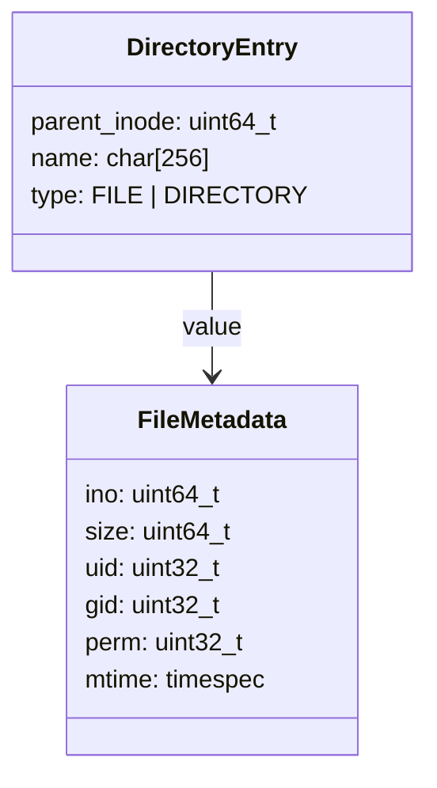
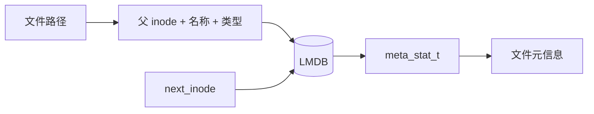
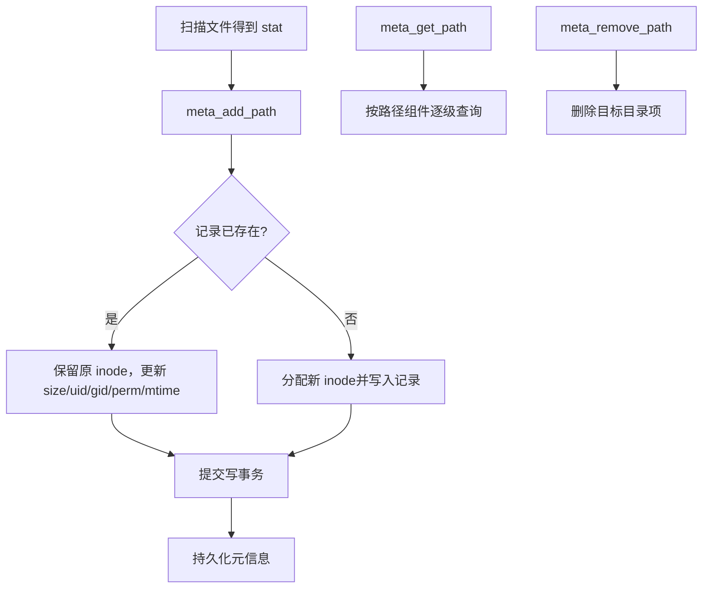

# `rpc/rpc-metadata.c`：文件元信息如何管理

## 一句话结论

系统把每个文件/目录的元信息作为一条 LMDB 记录保存：用“父目录 inode + 文件名 + 类型”定位，用 `meta_stat_t` 保存文件属性，用事务保证批量更新的一致性。

## 1. 文件元信息包含什么

`meta_stat_t` 保存文件 inode、大小、属主 UID/GID、权限/文件类型和修改时间；`dirent_key_t` 保存父目录 inode、名称和类型（`rpc/rpc-metadata.h:21-39`）。

其中：

- `ino`：文件或目录的稳定标识。
- `size`：文件大小；对目录由调用方维护目录项数量等语义。
- `uid/gid/perm/mtime`：从 `struct stat` 转换而来的属性。
- `type`：区分普通文件和目录，参与键定位。

## 2. 元信息存在哪里

系统不直接用完整路径作为数据库键，也不把所有文件元信息加载到内存。路径会被拆成组件，每一级目录都有自己的 inode；文件记录挂在父目录 inode 下。

LMDB 按“父 inode → 名称 → 类型”排序，因此同一目录的文件记录相邻，适合按目录连续读取（`rpc/rpc-metadata.c:17-50`）。

特殊记录 `ROOT_INODE/inode` 的 `st.size` 用来保存下一个可分配 inode；根目录固定使用 inode 2（`rpc/rpc-metadata.c:105-177`）。

## 3. 元信息如何变化

- 新增或更新：`meta_add_path` 按路径逐级查找目录，最后写入文件元信息；已有记录保留原 inode（`rpc/rpc-metadata.c:394-509`）。
- 查询：`meta_get_path` 或 `meta_lookup_dirent` 读取 `meta_stat_t`（`rpc/rpc-metadata.c:288-313`、`524-588`）。
- 目录读取：以父 inode 为范围，通过 LMDB cursor 连续读取该目录下的文件/目录元信息（`rpc/rpc-metadata.c:854-929`）。
- 删除：`meta_remove_path` 删除目标目录项，但不回收 inode，也不递归删除子项（`rpc/rpc-metadata.c:607-681`）。

所有修改必须在写事务中完成；事务提交时同时回写最新 inode 游标（`rpc/rpc-metadata.c:214-244`）。

## 4. 海量文件下最重要的影响

- 文件数增加时，数据库记录数和 LMDB 页空间同步增加；实际占用还包括键长度、页管理和写放大。
- 深层路径需要逐级查询，成本随路径深度增加。
- 单个目录的读取是“定位后顺序扫描”，目录中文件越多，读取时间越长，但不会把整个目录一次性加载到内存。
- 当前 `META_MAX_SIZE` 为 `UINT64_MAX`，它不是无限容量保证；实际容量仍受 LMDB、地址空间和文件系统限制（`rpc/rpc.h:21-24`）。

## 5. 需要优先关注的边界

1. `meta_system_open` 的失败分支释放 `fs` 后仍返回它，可能产生悬空指针（`rpc/rpc-metadata.c:198-203`）。
2. 文件名长度没有严格校验；超过 255 字节时，`uint8_t namelen` 和 `memcpy` 存在越界风险（`rpc/rpc-metadata.c:53-63`）。
3. 现有测试只覆盖少量路径，不能证明海量文件、长文件名和异常事务场景（`rpc/tests/metadata.cpp:10-63`）。

## 参考资料

- [rpc/rpc-metadata.c](rpc/rpc-metadata.c)
- [rpc/rpc-metadata.h](rpc/rpc-metadata.h)
- [libs/lmdb_dict.c](libs/lmdb_dict.c)
- [rpc/rpc.h](rpc/rpc.h)
- [rpc/tests/metadata.cpp](rpc/tests/metadata.cpp)
