# aio-tools 各类数据库备份传输加密支持国密的实现

| 项 | 值 |
|----|----|
| 任务 | T0246-0810-backup-gm-transport-encryption |
| 日期 | 2026-08-10 |
| 依据 | `/home/black/Public/aio/aio-tools/6200/release` 源码组件梳理 + `/home/black/Documents/database_国密/` 调研结论 |
| 范围 | PG 系列 / MySQL 系列 / 文件系统 / SBT 系列（Oracle + DM）/ OB / gaussDB / 独立场景：备份卷 ZFS→S3 |
| 约定 | 架构+链路级（组件/协议/端口/配置开关）；图均为 Mermaid |

> 本文档回答一个问题：**各类数据库的备份数据在"传输"与"存储"两个维度上如何实现国密支持**。
> 全文遵循两条主线：
> 1. **传输国密**（数据在网络上搬运）——统一靠 aio-tools 自身加密链路（tls_cert 双后端 / RPC 协商升级 / SBT 协商头 / backUpAgent 通道）或链路叠加国密网关实现；
> 2. **存储国密**（备份集落盘）——分两类存储资源：**ZFS 资源**走 ZFS 自身存储加密；**S3 资源**由 s3file 以 SM4 密文上传。

**角色约定（备份方向为 Worker → 数据源，Worker 主动发起）**：
- **Worker（备份服务端 / 管理端）**承载：`aio-speed`（rpc-**client**，主动连接数据源侧 aio-speedd）、`fsdeamon（:8901）`与 `fs-cli`（**仅 PG 系列**数据源管理/快照调度）、`FileTransferAgent（:12000）`、`dm-ftp（:1255）`、`backUpAgent`（GaussDB，加载 xbsa 库）、`s3file`（备份卷 ZFS→S3 复制）、以及备份存储 **ZFS 池/卷**；
- **Agent（数据源侧）**部署：`aio-speedd`（rpc-**server**，承载文件/文件块下载服务）、`fsbackup.ko` 内核文件监控、`libobk.so`、`libdmsbtex.so`、GaussDB `roach agent`；
- **备份卷 ZFS→S3 是独立场景**：与数据库备份无关，是**备份完成后的备份卷复制逻辑**——s3file 把 ZFS 卷快照（zfs send）发送到 S3。

---

## 一、总体备份架构总览

aio-tools 6200 release 备份体系为 **Worker（备份服务端） ⇄ Agent（数据源）** 双平面结构，**备份由 Worker 侧客户端主动连接数据源侧服务端发起**。数据面分为三类链路：

- **RPC 数据面**：Worker 侧 `aio-speed`（客户端）⇄ 数据源侧 `aio-speedd`（服务端），承载文件级 / 文件块级 / 流式传输，是 PG、MySQL（含 xtrabackup）、文件系统备份的统一传输通道；
- **SBT / XBSA 数据面**：数据库原生备份接口——Oracle：libobk ⇄ FileTransferAgent；DM：dmsbtex ⇄ dm-ftp；GaussDB：roach agent ⇄ backUpAgent（加载 xbsa 库，直接写 ZFS）；
- **存储数据面**：Worker 侧 ZFS 卷作为备份存储；**独立场景**：备份完成后的卷通过 s3file 将 ZFS 快照复制到 S3。

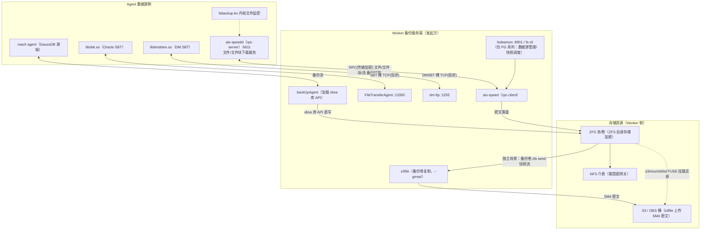

### 各类对象链路对比表

| 数据源 | 备份形态 | 客户端组件（Worker，发起方） | 服务端组件（数据源/Worker） | 协议/端口 | 现状传输加密 | 存储加密 | 国密现状与缺口 |
|--------|---------|-----------|-----------|-----------|------------|---------|---------------|
| PG 系列 | 文件级（数据目录快照） | aio-speed（Worker）+ fsdeamon :8901 / fs-cli（调度，仅 PG） | aio-speedd（数据源）:6611 + fsbackup.ko | RPC-TLS | OpenSSL 国际套件 | ZFS（Worker 侧，自身加密可选） | 传输未启用国密套件 |
| MySQL 系列 | ① 文件级（fsbackup）② xtrabackup→xbstream 流 | aio-speed（Worker，`--nc`） | aio-speedd（数据源）:6611 + fsbackup / xtrabackup | RPC-TLS / 流式 | 流明文或 OpenSSL TLS | ZFS（Worker 侧，自身加密） | 流式传输未加密；国密需 aio-speed 链路升级 |
| 文件系统 | 目录文件级（fs-backup） | aio-speed（Worker，主动连接） | aio-speedd（数据源）:6611 + fsbackup.ko | RPC-TLS | OpenSSL TLS | ZFS（Worker 侧）自身加密 | 传输未国密 |
| 备份卷 ZFS→S3（独立场景） | 备份后卷复制到 S3 | s3file（Worker，读 zfs 快照流） | S3 / OBS | S3 HTTPS | 标准 HTTPS | s3file `--gmssl` SM4 密文 | S3 落盘已国密；传输需介质国密网关 |
| Oracle（SBT） | RMAN SBT 备份流 | FileTransferAgent（Worker，:12000） | libobk.so（数据源） | SBT(activeio) 裸 TCP | **无加密** | 由存储侧承担 | 裸 TCP 明文，等保缺口，无协商/无 TLS |
| DM（SBT） | DM SBT/DMS API 备份流 | dm-ftp（Worker，:1255） | libdmsbtex.so（数据源） | DMSBT 裸 TCP | **无加密** | 由存储侧承担 | 裸 TCP 明文，无协商/无 TLS |
| OB OceanBase | OB 原生备份到 S3/OSS | OB / 介质网关 | S3/OSS（标准 TLS） | HTTPS | 标准 TLS，不发起国密 | 源 TDE SM4 透明沿袭；s3file SM4 | 无独立 SM4 备份开关；传输需介质网关 |
| gaussDB | gs_roach 物理备份（XBSA） | backUpAgent（Worker，加载 xbsa 库） | roach agent（数据源） | XBSA 备份流 | 工具 SSL 硬编码 AES | 引擎 TDE SM4_CTR（源沿袭）；xbsa 直写 ZFS | 备份工具不支持国密；靠引擎沿袭 + 链路网关 |

---

## 二、PG 系列

### 现状

PG 备份走**文件级备份**，由 **Worker 侧 fsdeamon（:8901，fs-cli 管理，仅用于 PG 系列）**负责数据源管理与快照调度；数据拉取走 RPC 链路：**Worker 侧 aio-speed 主动连接数据源侧 aio-speedd（:6611）**，以"文件 / 文件块下载"方式把 PG 数据目录拉到 Worker，落盘到 Worker 侧 **ZFS 卷**。

- 传输层：aio-speed ⇄ aio-speedd 已具备 TLS（OpenSSL，国际算法套件）；`--encrypt` 选项为 XOR 混淆，非真加密；
- 存储层：Worker 侧 ZFS 卷支持 ZFS 自身存储加密，算法为 ZFS 可选项（默认国际算法，SM4 需扩展）；
- 缺口：传输 TLS 套件为国际算法，不满足等保三级 L3-CES7-25 对国密密码技术的要求。

### 国密落地方案

1. **传输国密**：aio-speed ⇄ aio-speedd 链路的 tls_cert 库升级为 **OpenSSL + GMSSL 双后端**，开启传输加密时加载 **SM2 证书链**并协商 **RFC 8998 国密套件（TLS_SM4_GCM_SM3）**；关闭时走存量路径，行为不变。
2. **存储国密**：备份集落 Worker 侧 ZFS 卷，启用 ZFS 自身存储加密（信创平台选 SM4 算法）；若 ZFS 原生不支持 SM4，在 ZFS ICP 加密框架扩展注册 `sm4-gcm`。
3. **开关语义**：配置 security 节传输加密开关（0=关 1=开），作业发起时读取，新作业按新配置协商，存量连接不受影响；开启后失败不静默降级明文。

### 实现国密加密架构图

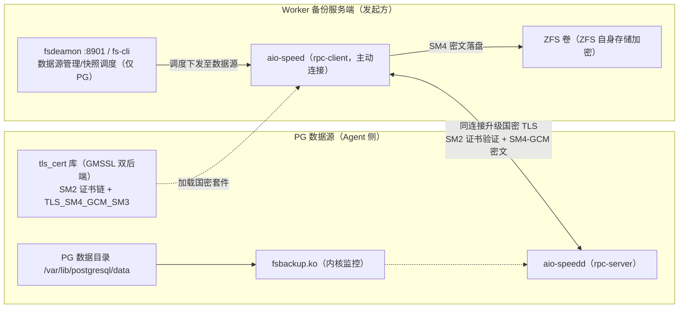

### 数据流图（PG 国密备份流程）

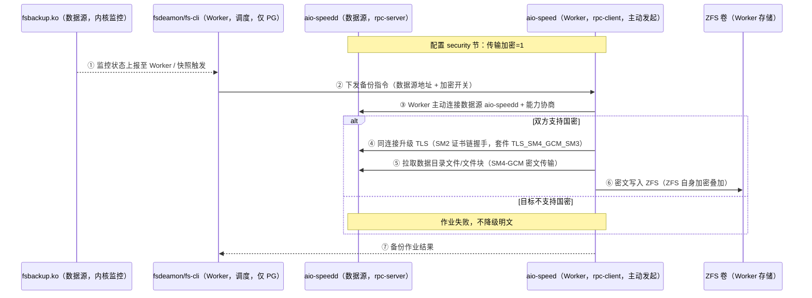

---

## 三、MySQL 系列

### 现状

MySQL 备份有两条路径，传输均以 **RPC 链路**承载，方向同为 **Worker 侧 aio-speed 主动连接数据源侧 aio-speedd**：

1. **文件级备份**：数据源侧 fsbackup 内核监控 MySQL 数据目录，Worker 侧 aio-speed 连接数据源 aio-speedd 文件级拉取；
2. **xtrabackup 备份**：Percona xtrabackup 在数据源产出 **xbstream 流**，经 aio-speed 的 **`--nc` 功能**拉到 Worker 端以远程流→本地流方式解包落盘（`--nc "lz4 -d -B4 | sudo xbstream -x -C /backup/mysql"`），落盘到 Worker 侧 ZFS 卷，ZFS 自身加密承担存储加密。

- 传输层：流式传输现状为明文（`--nc` 管道）；文件级走 OpenSSL TLS；
- 存储层：Worker 侧 ZFS 自身加密；
- 缺口：xtrabackup 流式路径无加密；文件级 TLS 为国际套件。

### 国密落地方案

1. **传输国密**：aio-speed 链路统一升级国密——文件级走 tls_cert GMSSL 双后端 + RFC 8998 套件；流式（`--nc`）在同一通道内传输，升级为国密 TLS 密文流后再执行解包命令；
2. **存储国密**：落 Worker 侧 ZFS 卷启用 ZFS 自身 SM4 加密；
3. 国产化 MySQL 系（goldendb 等）走同一路径。

### 实现国密加密架构图

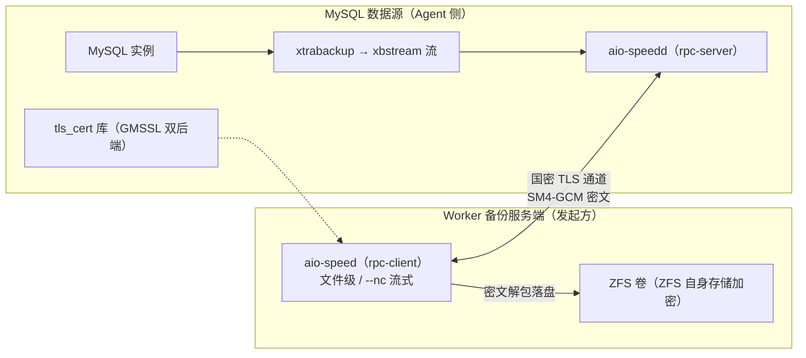

### 数据流图（xtrabackup 国密备份流程）

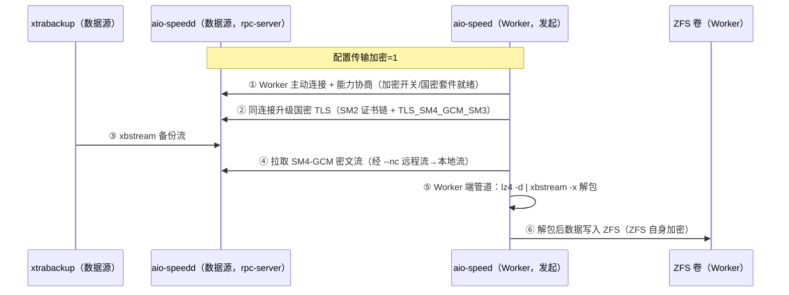

---

## 四、文件系统（fs-backup）

### 现状

文件系统备份（fs-backup）为**目录文件级备份**，与 PG/MySQL 同一 RPC 链路模型，**Worker 侧 aio-speed 主动连接数据源侧 aio-speedd（:6611）**，把数据源目录中的文件/文件块拉到 Worker，落 Worker 侧 ZFS：

- 数据源侧：`aio-speedd`（rpc-server）承载文件/文件块下载服务，`fsbackup.ko` 内核模块在数据源本地监控文件变更（文件块级差分）；
- Worker 侧：`aio-speed`（rpc-client）作为备份发起方主动连接数据源 aio-speedd；
- 调度与存储：数据源由 Worker 侧统一调度，备份集落 Worker 侧 ZFS；
- 传输层：OpenSSL TLS（国际套件）；存储层：Worker 侧 ZFS 自身加密。

### 独立场景：备份卷 ZFS→S3 复制（与数据库备份无关）

备份完成后，Worker 侧 ZFS 卷（zvol）如需复制/归档，走**备份卷复制逻辑**：`s3file` 读取 ZFS 卷快照（zfs send 流），经华为云 S3 SDK **以 SM4 密文**发送到 S3 / OBS。该场景与数据库备份本身无关，仅为"备份完成后的卷复制到 S3"。

`afsd`（my-fuse）/`s3mount` 可将 S3 中的块挂载为本地，`mount -o nouuid` 还原数据库文件。

### 国密落地方案

1. **传输国密**：aio-speed 文件级传输升级 GMSSL 双后端 + RFC 8998 套件；
2. **ZFS→S3 存储国密（已实现，独立场景）**：s3file 的 `--gmssl=1` 开启 SM4-CBC 加密上传，S3 中仅存密文块；
3. **ZFS 存储国密**：Worker 侧 ZFS 数据集/卷开启加密，信创平台选 SM4 算法（无原生 SM4 时在 ICP 框架扩展注册 `sm4-gcm`）；
4. 密钥管理：现状内置常量密钥，建议演进为 KMS/密钥管理系统托管（DEK/KEK 分层）。

### 实现国密加密架构图

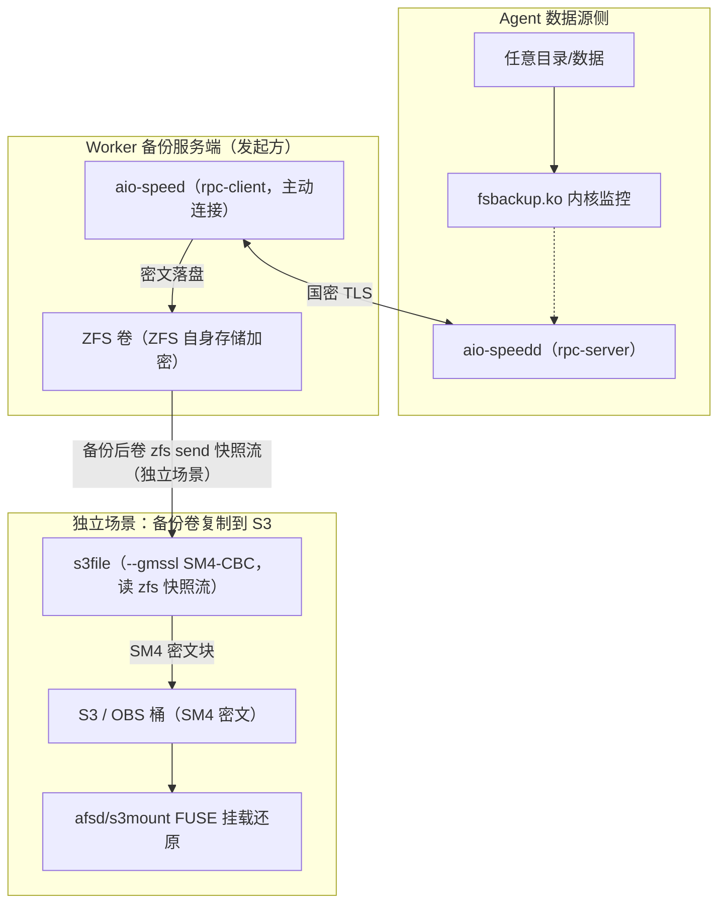

### 数据流图（文件系统备份 + 备份卷复制到 S3）

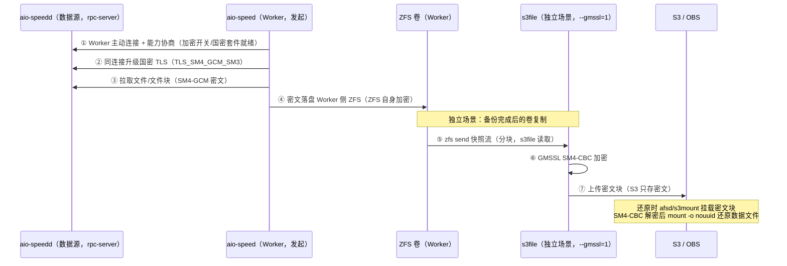

---

## 五、SBT 系列（Oracle + DM）

> Oracle（RMAN SBT）与 DM（DM SBT/DMS API）的备份接入形态、裸 TCP 明文现状、国密改造模型**完全一致**，合并叙述；差异仅在具体 SBT 插件与其对接的传输服务端组件。

### 现状

| 维度 | Oracle | DM 达梦 |
|------|--------|---------|
| 数据库备份接口 | RMAN SBT API | DM SBT / DMS API |
| SBT 插件（数据源侧） | libobk.so | libdmsbtex.so |
| 传输服务端（Worker 侧） | FileTransferAgent :12000 | dm-ftp :1255 |
| 线缆协议 | 私有 activeio（activeioHeader：版本/命令/长度/校验和） | 私有 DMSBT（network_header_t：命令/长度/校验和） |
| 现状传输 | **裸 TCP 明文，无任何加密基础设施** | **裸 TCP 明文，无任何加密基础设施** |
| 等保 | 不满足 L3-CES7-25 | 不满足 L3-CES7-25 |

### 国密落地方案

SBT 链路统一新增"**协商头 + 同连接升级国密 TLS**"模型（服务端默认兼容无协商头的存量客户端）：

1. 客户端（libobk / libdmsbtex）连接后先发**明文协商头**（ack 头 + 能力宣告：加密开关/国密套件就绪）；
2. 服务端（FileTransferAgent / dm-ftp）返回能力响应（加密模式 + 套件支持）；
3. 配置开启且双方支持时，**同一 TCP 连接内升级 TLS**，用 SM2 证书链握手，协商 RFC 8998 国密套件（TLS_SM4_GCM_SM3）；
4. 配置开启但目标不支持 → **作业失败**，不降级明文；配置关闭 → 明文存量路径。

### 实现国密加密架构图

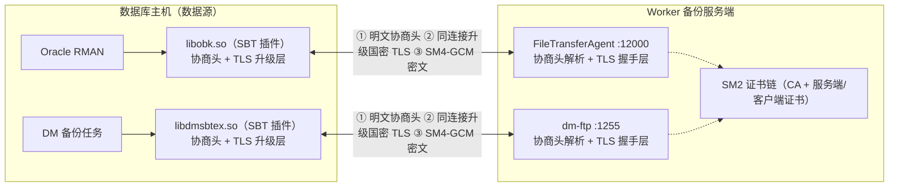

### 数据流图（SBT 国密协商升级，Oracle 与 DM 同款）

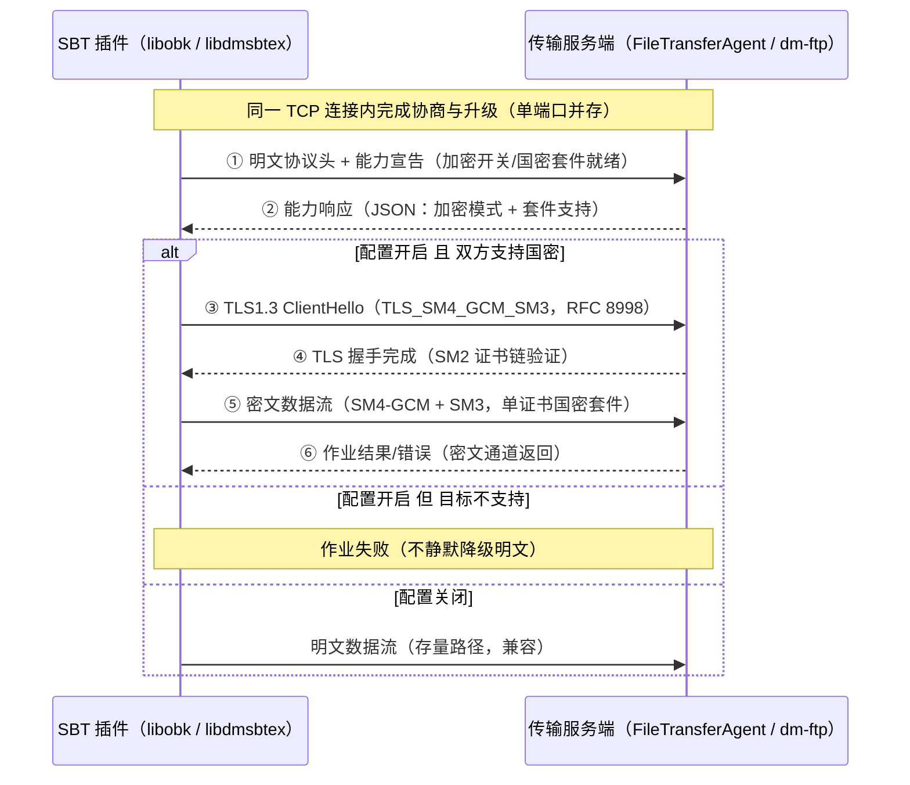

---

## 六、OceanBase

### 现状

OceanBase（4.2.1.1 验证基线）备份链路两个维度的结论：

- **备份存储加密维度**：备份加密逻辑存在（`PASSWORD`/`PASSWORD_ENCRYPTION`/`TRANSPARENT_ENCRYPTION`/`DUAL_MODE_ENCRYPTION`），但**无用户可选 SM4 的开关**——`PASSWORD_ENCRYPTION` 只落 AES 族；SM4 只能经**源表 TDE 透明沿袭**（Oracle 租户表空间 `ENCRYPTION='SM4-CBC'/'SM4-GCM'` → 备份宏块原样拷贝 SM4 密文）；
- **备份传输加密维度**：OB 自身不发起国密握手——备份介质（S3/OSS）走标准 HTTPS/TLS（国际套件）；OB 内部 TLS 的国密套件仅限 BabaSSL 商业构建，且非备份介质链路。

aio-tools 侧：OB 备份集经 S3 资源落盘，s3file `--gmssl` 上传 SM4 密文。

### 国密落地方案

1. **数据正文国密（源沿袭）**：Oracle 租户开启 SM4 TDE → 备份集即 SM4 密文（透明沿袭，不动源则无法独立选 SM4）；
2. **存储国密**：备份集落 S3 由 s3file 以 SM4 密文上传；
3. **传输国密**：OB→介质链路为标准 HTTPS，需在**介质侧前置国密网关/负载均衡**做 SM2/SM3/SM4 TLS 终止（OB→网关仍走标准 TLS，网关→介质走国密），属部署层改造。

### 实现国密加密架构图

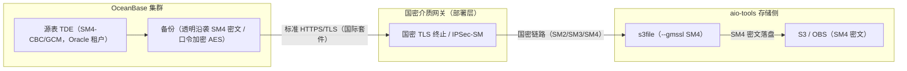

### 数据流图（OB 备份国密落盘）

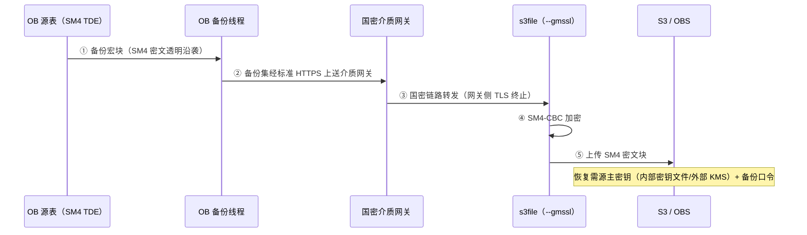

---

## 七、gaussDB

### 现状

GaussDB 备份链路分三层（现场 505.2.1 / gs_roach 调研基线），**xbsa 库部署在 Worker 侧，由 backUpAgent 进程加载**：

- **备份工具层（gs_roach）**：源端 **roach agent** 连接 **Worker 上的 backUpAgent**，backUpAgent 把收到的备份数据交给其**加载的 xbsa 库 API**，由 xbsa 库**直接写入 ZFS**。gs_roach 自身**不支持国密**——传输 SSL 默认开启但套件硬编码 AES（`ECDHE-ECDSA-AES*-GCM-SHA256` 等）；备份集透明加密 AK/SK 为 AES-128-CBC；
- **引擎层（gaussdb）**：TDE 支持国密 `SM4_CTR` / `SM4_CTR_SM3_HMAC`（`encrypt_algo` 可选）——物理备份（gs_roach）直接拷贝数据文件，能**带出引擎 SM4 密文**；
- **客户端层**：gsql/JDBC 支持国密 SSL/TLCP（`ECC-SM4-SM3`、`ECDHE-SM4-GCM-SM3` 等）。

### 国密落地方案

1. **数据正文国密（源沿袭）**：引擎 `enable_tde=on, encrypt_algo='sm4_ctr'` + gs_roach 物理备份（不开 AK/SK）→ 备份集数据为 SM4 密文（不开 AK/SK 避免叠加 AES 双层）；
2. **传输国密**：roach agent ⇄ backUpAgent 通道由 gs_roach 控制，工具层不可国密，采用链路叠加——备份链路前置国密 TLS 隧道/网关（SM2 证书 + SM4-SM3）；
3. **存储国密**：backUpAgent 经 xbsa 库直写 Worker 侧 ZFS，ZFS 自身 SM4 加密。

### 实现国密加密架构图

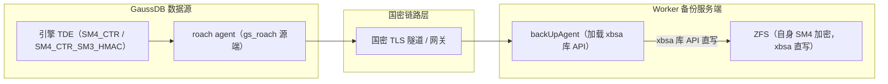

### 数据流图（gaussDB 国密备份）

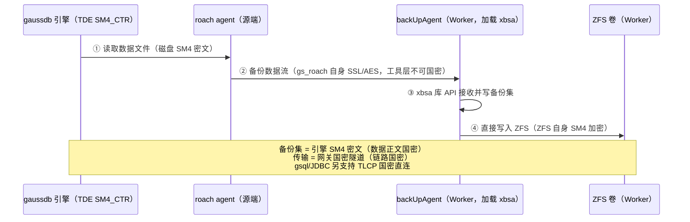

---

## 八、统一国密落地手段

各对象背后是**同一套可复用的国密能力面**，按层级分四类手段：

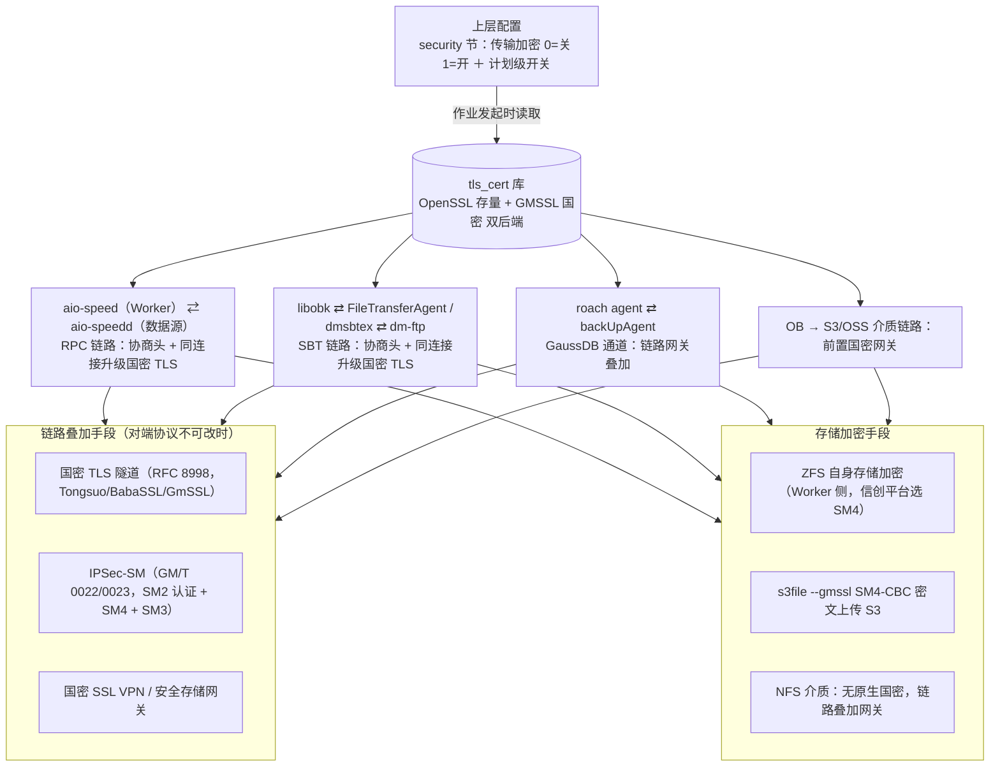

| 手段 | 适用链路 | 说明 |
|------|---------|------|
| tls_cert GMSSL 双后端 | RPC / SBT 统一 | OpenSSL 存量路径不变，国密路径加载 SM2 证书链 + TLS_SM4_GCM_SM3（RFC 8998）；单证书降低维护成本 |
| RPC 协商头 + 同连接升级 | 文件系统 / PG / MySQL | Worker 侧 aio-speed 主动连接数据源侧 aio-speedd；协商升级为同连接国密 TLS |
| SBT 协商头 + 同连接升级 | Oracle / DM | 明文协商 → 能力判定 → 同连接升级 TLS；开启强制、失败即作业失败，服务端兼容存量客户端 |
| backUpAgent + xbsa 直写 | gaussDB | 数据由 roach agent 传入 Worker backUpAgent，经 xbsa 库 API 直写 ZFS；工具层不可国密，靠网关叠加 |
| 国密 TLS 隧道 / IPSec-SM / 安全网关 | OB→介质、ZFS→S3、NFS、gs_roach 等协议不可改场景 | 链路旁路叠加，工具/协议零改动；持商用密码产品认证证书 |
| ZFS 自身加密 | 本地备份存储（Worker） | 数据集/卷级透明加密，信创平台选 SM4；SM4 需 ICP 框架扩展 |
| s3file `--gmssl` | S3 备份存储 | 备份卷复制（独立场景）SM4-CBC 密文上传，S3 只存密文；建议密钥演进为 KMS 托管 |
| 引擎 TDE 沿袭 | OB / gaussDB | 源表 SM4 TDE → 物理备份/透明沿袭带出 SM4 密文，零额外成本 |

---

## 九、介质 / 存储侧安全总结

### 9.1 备份卷 ZFS→S3 复制（独立场景）

- 与数据库备份无关：**备份完成后的卷复制**——s3file 读取 ZFS 卷快照（zfs send 流）发送到 S3，`--gmssl` 以 SM4-CBC（GMSSL）加密，S3/对象存储侧只存密文块；
- 现状为内置常量密钥/IV；生产建议演进为 **DEK/KEK 分层密钥管理（KMS）**，满足密评密钥管理要求。

### 9.2 NFS 备份介质

- NFS 自带传输加密仅标准 **RPCSEC_GSS / Kerberos**（`sec=krb5p` 全包加密），其 enctype 注册表（IANA）**无任何 SM 条目**，加密强度上限 AES-256 族——**NFS 协议层不能原生国密**；
- 主流厂商 NFS 传输加密（阿里 NAS/CPFS、腾讯 CFS、NetApp、Synology）均为国际算法，且阿里云官方明示不支持 SM4；
- 可行路径：**链路层叠加**——国密 TLS 隧道（RFC 8998）包裹 NFS 挂载、国密 IPsec、或商密安全存储网关。

### 9.3 存储静态加密

- **ZFS（Worker 侧）**：原生加密算法为国际默认，SM4 需在 ICP 加密框架注册 `sm4-gcm`（纯软件 SM4 顺序大块 IO 损耗 ~90%，需硬件加速承载，信创 CPU 提供 SM4 指令）；
- **华为 OceanStor**：静态加密 AES-256 与 SM4-128 可配（介质侧），NFS 数据面未见国密开关。

---

## 附：术语表

| 术语 | 含义 |
|------|------|
| SM2 / SM3 / SM4 | 国密算法：SM2 非对称（签名/密钥交换）、SM3 杂凑、SM4 分组对称（CBC/GCM/CCM） |
| RFC 8998 | TLS 1.3 国密套件规范（`TLS_SM4_GCM_SM3` / `TLS_SM4_CCM_SM3`、curveSM2、sm2sig_sm3） |
| TLCP | 国密传输层密码协议（GB/T 38636，SM2 双证书：签名证书 + 加密证书） |
| GMSSL | 国密 SSL 库（GmSSL/Tongsuo/BabaSSL 一类），承载国密套件与 SM2 证书 |
| SBT / XBSA | 备份标准接口（Oracle SBT、DM SBT、GaussDB XBSA），数据库原生备份接入备份软件 |
| aio-speed / aio-speedd | RPC 传输组件：aio-speed 为客户端（Worker 侧，主动发起），aio-speedd 为服务端（数据源侧，承载文件拉取服务） |
| fsdeamon / fs-cli | Worker 侧 PG 系列备份调度服务与管理命令行客户端（fs-cli 连接 fsdeamon :8901） |
| backUpAgent | gaussDB/gs_roach 备份服务端进程（Worker），加载 xbsa 库并将备份集写入 ZFS |
| TDE | 透明数据加密（源表级），可经物理备份/透明沿袭保留密文 |
| 等保 L3-CES7-25 | 等级保护三级对国密密码技术保护数据链路的要求项 |