# aio-tools 各类数据库备份传输加密支持国密的实现

## 一、总体备份架构总览

aio-tools 6200 release 备份体系为 **Worker（备份服务端） ⇄ Agent（数据源）** 双平面结构。连接方向分两类：**PG / 文件系统**由 Worker 侧客户端主动连接数据源侧服务端；**MySQL** 由数据源侧客户端（aio-speed）主动连接 Worker 侧服务端（aio-speedd）推送备份流。数据面分为三类链路：

- **RPC 数据面**：`aio-speed` ⇄ `aio-speedd`、`fs-cli` ⇄ `aio-speedd`，承载文件级 / 文件块级 / 流式传输——PG（fs-cli Worker ⇄ aio-speedd 数据源）、文件系统（aio-speed Worker ⇄ aio-speedd 数据源）、MySQL（xtrabackup＋aio-speed 数据源 → aio-speedd＋xbstream Worker）；
- **SBT / XBSA 数据面**：数据库原生备份接口——Oracle：libobk ⇄ FileTransferAgent；DM：dmsbtex ⇄ dm-ftp；GaussDB：roach agent ⇄ backUpAgent（加载 xbsa 库，直接写 ZFS）；
- **存储数据面**：Worker 侧 ZFS 卷作为备份存储；**独立场景**见第五/六章。

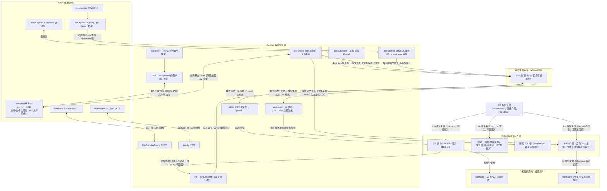

### 各类对象链路对比表

| 数据源 | 备份形态 | 备份发起组件 | 备份接收组件（对端） | 协议/端口 | 现状传输加密 | 存储加密 | 国密现状与缺口 |
|--------|---------|-----------|-----------|-----------|------------|---------|---------------|
| PG 系列 | 文件级（数据目录快照） | fs-cli（Worker，aio-speedd 的客户端）+ fsdeamon（调度，仅 PG） | aio-speedd（数据源）:6611 | RPC-TLS | OpenSSL 国际套件 | ZFS（Worker 侧，自身加密可选） | 传输未启用国密套件 |
| MySQL 系列 | xtrabackup→xbstream 流 | xtrabackup＋aio-speed（数据源，tcp 推送） | aio-speedd＋xbstream 解包（Worker）:6611 | RPC-TLS / 流式 | 流明文或 OpenSSL TLS | ZFS（Worker 侧，自身加密） | 流式传输未加密；国密需 aio-speed 链路升级 |
| 文件系统 → ZFS | 目录文件级 | aio-speed（Worker，主动连接，tcp） | aio-speedd（数据源）:6611 | RPC-TLS | OpenSSL TLS | ZFS（Worker 侧）自身加密 | 传输未国密 |
| 文件系统 → NFS | 目录文件级 | aio-speed（Worker，主动连接，tcp） | aio-speedd（数据源）:6611 | RPC-TLS | OpenSSL TLS | NFS 介质（SM4 密文写入） | 传输可升级国密；先国密加密再写 NFS |
| 备份卷 ZFS→S3（独立场景） | 备份后卷复制到 S3 | s3file（Worker，读 zfs 快照流） | S3 / OBS | S3 HTTPS | 标准 HTTPS | s3file `--gmssl` SM4 密文 | S3 落盘已国密；传输不启用国密 |
| 备份卷 ZFS→ZFS（独立场景） | 备份后卷快照发送 | aio-speed **nc 模式**（Worker，zfs send 推送） | aio-speedd＋zfs receive（远端 ZFS） | RPC-TLS | OpenSSL TLS | 远端 ZFS 自身加密 | 传输可升级国密套件；目标 ZFS 自身加密 |
| S3 系列资源备份（独立场景） | S3 对象资源下拉到 ZFS | mc（MinIO Client，Worker） | Worker 侧 ZFS 卷 | S3 HTTPS | 标准 HTTPS，不国密 | ZFS（Worker 侧）自身加密 | 传输不国密；存储靠 ZFS 自身加密 |
| Oracle（SBT） | RMAN SBT 备份流 | FileTransferAgent（Worker，:12000） | libobk.so（数据源） | SBT(activeio) 裸 TCP | **无加密** | 由存储侧承担 | 裸 TCP 明文，等保缺口，无协商/无 TLS |
| DM（SBT） | DM SBT/DMS API 备份流 | dm-ftp（Worker，:1255） | libdmsbtex.so（数据源） | DMSBT 裸 TCP | **无加密** | 由存储侧承担 | 裸 TCP 明文，无协商/无 TLS |
| OB OceanBase → S3 | OB 原生备份到 S3 | OB 独立备份工具（→介质） | S3 对象存储（标准 TLS） | HTTPS | 标准 TLS，不发起国密 | S3 介质侧静态加密可配 | 无独立 SM4 备份开关；传输不可国密；与 s3file 无关 |
| OB OceanBase → OSS | OB 原生备份到 OSS | OB 独立备份工具（→介质） | OSS（后端 ZFS 承载） | HTTP | **HTTP 明文，未启用 TLS** | ZFS 自身存储加密（信创平台选 SM4） | 无独立 SM4 备份开关；OSS 链路 HTTP 明文、不可国密；与 s3file 无关 |
| OB OceanBase → NFS | OB 原生备份到 NFS | OB 备份工具（本机挂载 NFS，写/读挂载目录） | NFS（后端 ZFS 承载，OB 服务器本机挂载） | NFS | NFS 无原生国密 | 后端 ZFS 自身存储加密（信创平台选 SM4） | 无独立 SM4 备份开关；NFS 无原生国密；与 s3file 无关 |
| gaussDB | gs_roach 物理备份（XBSA） | backUpAgent（Worker，加载 xbsa 库） | roach agent（数据源） | XBSA 备份流 | 工具 SSL 硬编码 AES | xbsa 直写 ZFS（自身加密可选） | 备份工具不支持国密 |

---

## 二、PG 系列

### 现状

PG 备份走**文件级备份**，由 **Worker 侧 fsdeamon（仅用于 PG 系列备份）**负责数据源管理与快照调度，**fs-cli 作为 aio-speedd 的客户端**发起/管理备份；数据拉取走 RPC 链路：**fs-cli 主动连接数据源侧 aio-speedd（:6611）**，以"文件 / 文件块下载"方式把 PG 数据目录拉到 Worker，落盘到 Worker 侧 **ZFS 卷**。PG 备份**不会使用 aio-speed 工具**。

- 数据源侧：`aio-speedd` 直接承载 PG 数据目录的文件/文件块下载服务（不使用内核监控模块）；
- 传输层：fs-cli ⇄ aio-speedd 已具备 TLS（OpenSSL，国际算法套件）；`--encrypt` 选项为 XOR 混淆，非真加密；
- 存储层：Worker 侧 ZFS 卷支持 ZFS 自身存储加密，算法为 ZFS 可选项（默认国际算法，SM4 需扩展）；
- 缺口：传输 TLS 套件为国际算法，不满足等保三级 L3-CES7-25 对国密密码技术的要求。

### 国密落地方案

1. **传输国密**：fs-cli ⇄ aio-speedd 链路在开启传输加密时加载 **SM2 证书链**并协商 **RFC 8998 国密套件（TLS_SM4_GCM_SM3）**；关闭时走存量路径，行为不变。
2. **存储国密**：备份集落 Worker 侧 ZFS 卷，启用 ZFS 自身存储加密（信创平台选 SM4 算法）；若 ZFS 原生不支持 SM4，在 ZFS ICP 加密框架扩展注册 `sm4-gcm`。

### 实现国密加密架构图

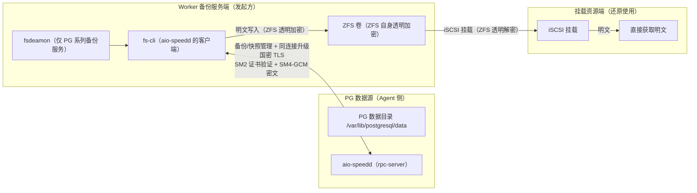

---

## 三、MySQL 系列

### 现状

MySQL 备份走 **xtrabackup → xbstream 流**，连接方向与 PG/文件系统相反：**Percona xtrabackup 与 aio-speed 都在数据源 Agent 侧**——数据源产出 **xbstream 流**后，由数据源侧 **aio-speed** 主动 tcp 连接 **Worker 侧 aio-speedd** 推送备份流；**Worker 上运行 xbstream**，收到流后以远程流→本地流方式解包落盘（`--nc "lz4 -d -B4 | sudo xbstream -x -C /backup/mysql"`），落盘到 Worker 侧 ZFS 卷，ZFS 自身加密承担存储加密。

- 传输层：流式传输现状为明文（`--nc` 管道）或 OpenSSL TLS；
- 存储层：Worker 侧 ZFS 自身加密；
- 缺口：xtrabackup 流式路径无加密；TLS 为国际套件。

### 国密落地方案

1. **传输国密**：aio-speed ⇄ aio-speedd 链路升级国密——流式（`--nc`）在同一通道内传输，升级为国密 TLS（SM2 证书链 + RFC 8998 套件），密文传输到 Worker 后再执行解包命令；
2. **存储国密**：落 Worker 侧 ZFS 卷启用 ZFS 自身 SM4 加密；
3. 国产化 MySQL 系（goldendb 等）走同一路径。

### 实现国密加密架构图

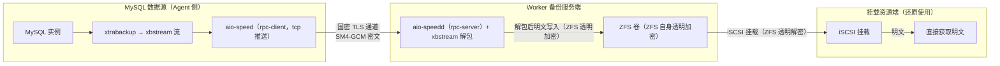

---

## 四、文件系统

### 现状

文件系统备份为**目录文件级备份**，**Worker 侧 aio-speed（rpc-client）主动 tcp 连接数据源侧 aio-speedd（:6611）**，把数据源目录中的文件/文件块拉到 Worker。备份目标支持两种存储：**落 Worker 侧 ZFS 卷**或**直接写 NFS 介质**。

- 数据源侧：`aio-speedd`（rpc-server）承载文件/文件块下载服务；
- Worker 侧：`aio-speed`（rpc-client）作为备份发起方主动 tcp 连接数据源 aio-speedd；
- 调度与存储：数据源由 Worker 侧统一调度，备份集默认落 Worker 侧 ZFS；**支持直接备份到 NFS**（Worker 将拉取的文件先做 SM4 国密加密再写入 NFS 挂载目录，NFS 只存密文）；
- 传输层：OpenSSL TLS（国际套件）为现状，国密升级见 4.1/4.2；存储层：Worker 侧 ZFS 自身加密，或 NFS 介质（Worker 侧 SM4 先加密再写入）。

### 4.1 备份到 Worker 侧 ZFS

#### 国密落地方案

1. **传输国密**：aio-speed 文件级传输升级国密 TLS（SM2 证书链 + RFC 8998 套件）；
2. **存储国密**：Worker 侧 ZFS 数据集/卷开启加密，信创平台选 SM4 算法（无原生 SM4 时在 ICP 框架扩展注册 `sm4-gcm`）。

#### 实现国密加密架构图

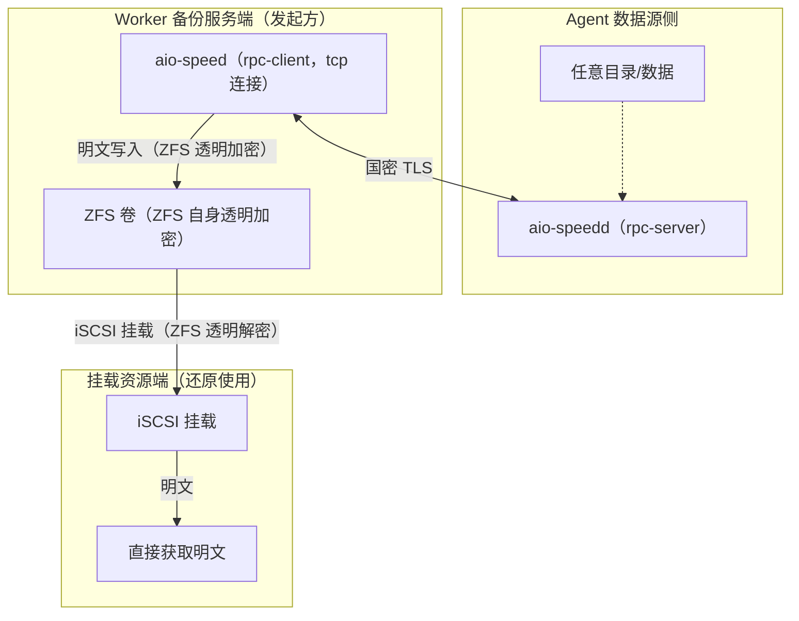

### 4.2 直接备份到 NFS 介质

NFS 备份目标场景：Worker 把数据源拉取的文件直接写入 **NFS 挂载目录**（不走 ZFS）。NFS 协议层**无原生国密**（10.2 详述），因此该场景的国密通过 **Worker 侧应用层加密 + 传输国密**实现。

#### 国密落地方案

1. **传输国密**：aio-speed 文件级传输升级国密 TLS（SM2 证书链 + RFC 8998 套件），数据从数据源到 Worker 全程密文；
2. **存储国密（先加密再写 NFS）**：Worker 侧应用层先对备份数据做 **SM4 国密加密**，以密文写入 NFS 挂载目录，NFS 中只存密文；还原时挂载资源端用 **filemount 挂载解密**（取密文块解密后还原）。

#### 实现国密加密架构图

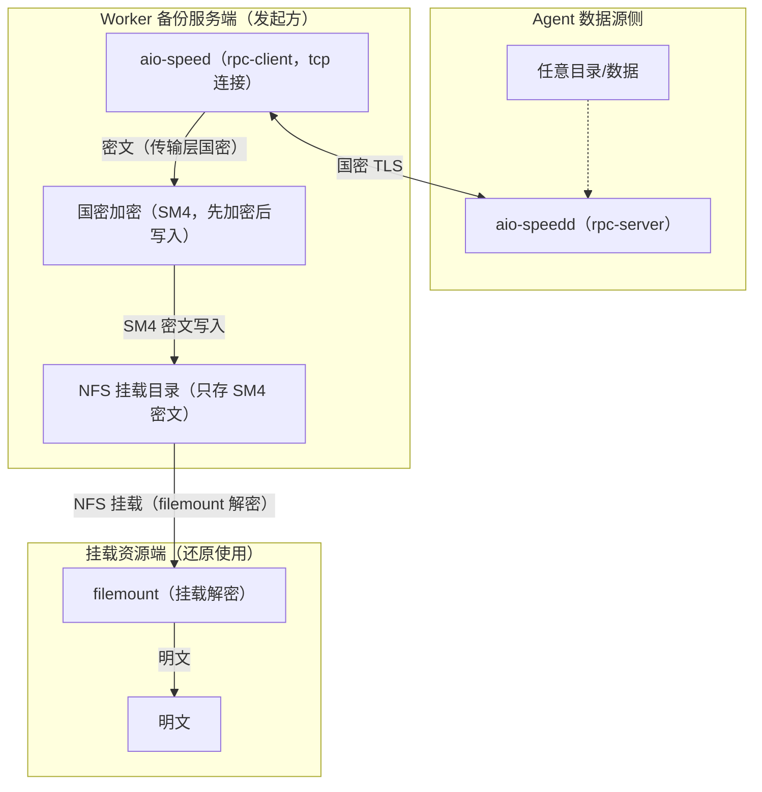

---

## 五、独立场景：备份卷复制（ZFS→S3 / ZFS→ZFS 快照发送）

> 与数据库备份无关的独立场景：
> ①**ZFS→S3**：把 Worker 侧 ZFS 卷（zvol）快照通过 s3file 复制到 S3 资源，并支持在挂载资源端还原，S3 只存密文块；
> ②**ZFS→ZFS**：把 Worker 侧 ZFS 卷快照通过 **aio-speed 的 nc 模式**发送到远端 ZFS（zfs receive），用于备份卷异地容灾。

### 5.1 ZFS→S3（s3file）

#### 现状

- Worker 侧 `s3file` 读取 ZFS 卷快照（zfs send 流），经华为云 S3 SDK **以 SM4 密文**发送到 S3 / OBS；
- **挂载资源端**（还原侧）用 `s3mount` 将 S3 中的密文块挂载为本地，`mount -o nouuid` 还原数据库文件；
- 现状传输为标准 HTTPS（国际套件）；S3 落盘已由 s3file `--gmssl=1` 以 SM4-CBC 密文写入。

### 国密落地方案

1. **S3 存储国密（已实现）**：s3file 的 `--gmssl=1` 开启 SM4-CBC 加密上传，S3 中仅存密文块；
2. **挂载还原（挂载资源端）**：s3mount 在挂载资源端读取密文块，SM4-CBC 解密后挂载还原；
3. **传输现状**：s3file ⇄ S3 走标准 HTTP，传输层不启用国密；

### 实现国密加密架构图

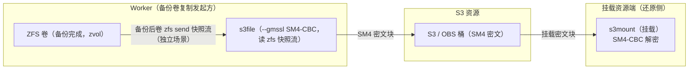

### 5.2 ZFS→ZFS（aio-speed nc 模式）

备份卷异地容灾：把 Worker 侧 ZFS 卷快照发送到远端 ZFS，走 **aio-speed 的 nc 模式**——**Worker 侧 aio-speed 主动 tcp 连接远端侧 aio-speedd（:6611）**，把本地 `zfs send` 快照流推送到远端，远端侧 `zfs receive` 落盘到目标 ZFS 卷。传输链路与 RPC 数据面复用同一套 aio-speed ⇄ aio-speedd 加密能力。

#### 现状

- Worker 侧：`zfs send` 产出快照流，`aio-speed` 以 **nc 模式**推送（`--nc` 指定远端接收命令 `zfs receive`）；
- 远端侧：`aio-speedd` 接收快照流，交由 `zfs receive` 落盘到目标 ZFS 卷；
- 传输层：aio-speed ⇄ aio-speedd 具备 TLS（OpenSSL，国际套件）；存储层：目标 ZFS 卷自身存储加密；
- 缺口：TLS 为国际套件，不满足等保三级对国密密码技术的要求。

#### 国密落地方案

1. **传输国密**：aio-speed ⇄ aio-speedd 链路升级国密——nc 模式在同一通道内传输，升级为国密 TLS（SM2 证书链 + RFC 8998 套件），快照流密文传输到远端后再执行 `zfs receive`；
2. **存储国密**：目标 ZFS 卷启用 ZFS 自身存储加密（信创平台选 SM4）；
3. **开关语义**：与 PG/文件系统一致，开启后失败不静默降级明文。

#### 实现国密加密架构图

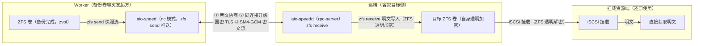

---

## 六、S3 系列资源备份（mc → ZFS）

> 与数据库备份无关的独立场景：使用 **mc**（MinIO Client）把 **S3 对象存储中的资源/备份卷**（对象 / 备份卷）**下拉到 Worker 侧 ZFS 卷**，作为本地备份落盘，落盘复用 ZFS 自身存储加密。

### 现状

- 使用 **mc**（MinIO Client）作为 S3 客户端，Worker 侧通过**标准 S3 API（HTTPS）**从 S3 / OBS 拉取对象，写入 Worker 侧 ZFS 卷；
- 现状传输为标准 HTTPS（国际套件），mc 自身不发起国密握手；
- 落盘走 Worker 侧 **ZFS 卷**，ZFS 自身存储加密兜底。

### 国密落地方案

1. **传输现状**：mc ⇄ S3 走标准 HTTPS（国际套件）为现状，传输层不支持国密；
2. **存储国密**：目标 ZFS 卷启用 **ZFS 自身存储加密**（信创平台选 SM4）——mc 下拉的对象写入 ZFS 即密文，S3 侧原有对象不变，不依赖 S3 静态加密；
3. **挂载还原**：挂载资源端 iSCSI 挂载 Worker 侧 ZFS 卷，ZFS 透明解密后直接获取明文。

### 实现国密加密架构图

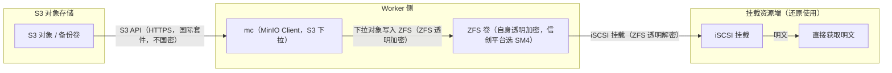

---

## 七、SBT 系列（Oracle + DM）

> Oracle（RMAN SBT）与 DM（DM SBT/DMS API）的备份接入形态、裸 TCP 明文现状、国密改造模型**完全一致**，合并叙述；差异仅在具体 SBT 插件与其对接的传输服务端组件。

### 现状

| 维度 | Oracle | DM 达梦 |
|------|--------|---------|
| 数据库备份接口 | RMAN SBT API | DM SBT / DMS API |
| SBT 插件（数据源侧） | libobk.so | libdmsbtex.so |
| 传输服务端（Worker 侧） | FileTransferAgent :12000 | dm-ftp :1255 |
| 线缆协议 | 私有 activeio（activeioHeader：版本/命令/长度/校验和） | 私有 DMSBT（network_header_t：命令/长度/校验和） |
| 现状传输 | **裸 TCP 明文，无任何加密基础设施** | **裸 TCP 明文，无任何加密基础设施** |
| 等保 | 不满足 L3-CES7-25 | 不满足 L3-CES7-25 |

### 国密落地方案

SBT 链路统一新增"**协商头 + 同连接升级国密 TLS**"模型（服务端默认兼容无协商头的存量客户端）：

1. 客户端（libobk / libdmsbtex）连接后先发**明文协商头**（ack 头 + 能力宣告：加密开关/国密套件就绪）；
2. 服务端（FileTransferAgent / dm-ftp）返回能力响应（加密模式 + 套件支持）；
3. 配置开启且双方支持时，**同一 TCP 连接内升级 TLS**，用 SM2 证书链握手，协商 RFC 8998 国密套件（TLS_SM4_GCM_SM3）；

### 实现国密加密架构图

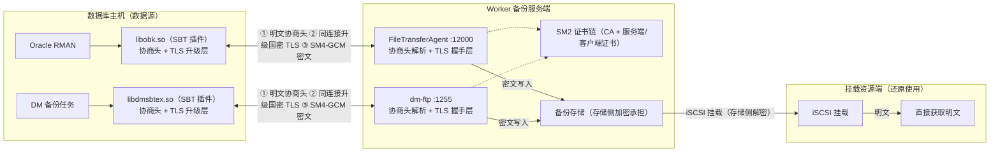

---

## 八、OceanBase

### 现状

OceanBase（4.2.1.1 验证基线）备份链路两个维度的结论：

- **备份存储加密维度**：备份加密逻辑存在（`PASSWORD`/`PASSWORD_ENCRYPTION`/`TRANSPARENT_ENCRYPTION`/`DUAL_MODE_ENCRYPTION`），但**无用户可选 SM4 的开关**——`PASSWORD_ENCRYPTION` 只落 AES 族；源码依据：`ob_config.cpp` 备份加密算法取值表为空占位，SM4 仅出现在合法性校验白名单，实际不可选（调研基线 4.2.1.1）；
- **备份传输加密维度**：OB 自身不发起国密握手——备份到 **S3** 走标准 HTTPS/TLS（国际套件），备份到 **OSS** 走 **HTTP**（未启用 TLS），备份到 **NFS** 走 NFS 协议（无原生国密）；OB 内部 TLS 的国密套件仅限 BabaSSL 商业构建，且非备份介质链路。

**OB 备份落盘与 s3file 无关**：OB 原生备份到 S3 / OSS / NFS 介质，介质链路由 OB 独立备份工具直连 S3（HTTPS）/ OSS（HTTP），或 **NFS 由 OB 服务器本机挂载后直接写读挂载目录**（NFS），不经过 s3file 的 SM4 加解密。

### 国密支持现状

1. **传输现状**：OB→S3 链路为标准 HTTPS（国际套件），OB→OSS 链路为 **HTTP**（明文，未启用 TLS），OB→NFS 链路为 NFS 协议（无原生国密）；OB 自身不发起国密握手，传输层不启用国密；
2. **介质静态加密（S3）**：S3 对象存储介质侧静态加密策略可配（如 AES-256 或 SM4-128），不依赖备份工具；
3. **介质静态加密（OSS / NFS）**：**OSS 与 NFS 后端均由 ZFS 承载实现**，因此可直接启用 **ZFS 自身存储加密**（信创平台选 SM4 算法），存储国密能力复用 ZFS。

### 8.1 备份到 S3 对象存储

#### 当前架构图

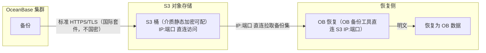

### 8.2 备份到 OSS（后端 ZFS）

- **传输**：OB→OSS 链路为 **HTTP**（明文，未启用 TLS，不国密）；
- **存储**：OSS 后端由 ZFS 承载，直接启用 **ZFS 自身存储加密**（信创平台选 SM4），存储国密能力复用 ZFS。

#### 当前架构图

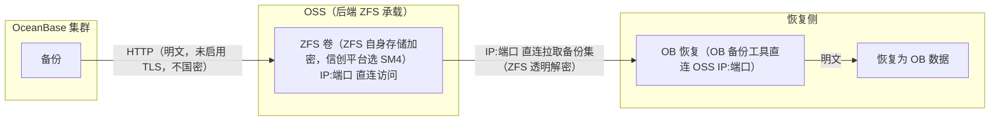

### 8.3 备份到 NFS（后端 ZFS）

- **访问方式**：OB 服务器**本机挂载 NFS 目录**，OB 备份工具把备份集作为本地文件直接写入/读取该挂载目录（本机文件操作，不涉及 OB 向远端介质发起的网络拉取）；
- **传输**：挂载目录经 NFS 协议访问，NFS 无原生国密（10.2 详述），OB 自身不发起国密握手；
- **存储**：NFS 后端存储由 **ZFS 承载**提供，因此可直接启用 **ZFS 自身存储加密**（信创平台选 SM4），存储国密能力复用 ZFS——NFS 中的备份集实际落于 ZFS 卷。

#### 当前架构图

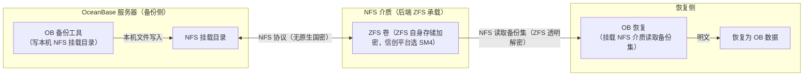

---

## 九、gaussDB

### 现状

GaussDB 备份链路分两层（现场 505.2.1 / gs_roach 调研基线），**xbsa 库部署在 Worker 侧，由 backUpAgent 进程加载**：

- **备份工具层（gs_roach）**：源端 **roach agent** 连接 **Worker 上的 backUpAgent**，backUpAgent 把收到的备份数据交给其**加载的 xbsa 库 API**，由 xbsa 库**直接写入 ZFS**。gs_roach 自身**不支持国密**——传输 SSL 默认开启但套件硬编码 AES（`ECDHE-ECDSA-AES*-GCM-SHA256` 等），cipher 列表为编译期宏；源码证据 `nm -D` 仅可见 `EVP_aes_128_cbc`，无 `EVP_sm*` / `EVP_CIPHER_fetch`；备份集透明加密 AK/SK 为 AES-128-CBC（`roach_aes128_decrypt` / `DecryptAes128Cbc`）；
- **客户端层**：gsql/JDBC 支持国密 SSL/TLCP（`ECC-SM4-SM3`、`ECDHE-SM4-GCM-SM3` 等）——客户端访问侧可国密，但**不作用于备份链路**。

### 国密支持现状

1. **传输现状**：roach agent ⇄ backUpAgent 通道由 gs_roach 控制，工具层不可国密（`nm -D` 无 SM 符号），传输层不启用国密；
2. **存储国密**：backUpAgent 经 xbsa 库直写 Worker 侧 ZFS，ZFS 自身 SM4 加密；
3. **客户端层国密**：gsql/JDBC 经国密 TLS/TLCP 访问数据源，属管理/访问面，非备份传输链路。

### 当前架构图

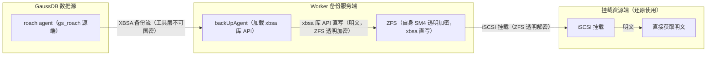

---

## 十、介质 / 存储侧安全总结

### 10.1 备份卷复制（独立场景）

- 与数据库备份无关：**备份完成后的卷复制**，两条路径：
  - **ZFS→S3**：s3file 读取 ZFS 卷快照（zfs send 流）发送到 S3，`--gmssl` 以 SM4-CBC（GMSSL）加密，S3/对象存储侧只存密文块；挂载资源端用 s3mount 挂载 S3 密文块，SM4-CBC 解密后还原；
  - **ZFS→ZFS**：aio-speed 的 **nc 模式**把 ZFS 卷快照（zfs send）发送到远端 ZFS（zfs receive），目标 ZFS 卷自身存储加密；
- 现状为内置常量密钥/IV；生产建议演进为 **DEK/KEK 分层密钥管理（KMS）**，满足密评密钥管理要求。

### 10.2 NFS 备份介质

- NFS 自带传输加密仅标准 **RPCSEC_GSS / Kerberos**（`sec=krb5p` 全包加密），其 enctype 注册表（IANA）**无任何 SM 条目**，加密强度上限 AES-256 族——**NFS 协议层不能原生国密**；
- **Linux 定制版本内核证据**：内核 crypto 层已注册国密（`crypto/sm4.c`、sm3、架构级 SM4 硬件加速模板），但 NFS 的 RPCSEC_GSS/krb5 实现（`gss_krb5`）在 enctype 算法名**白名单仅含国际算法**（`cts(cbc(aes))`、`cts(cbc(camellia))`、`hmac(sha1/sha256/sha384)`），从不请求 `sm4`/`sm3`——即"内核 crypto 层注册了国密、NFS 不调用"，仅改内核模板无法使 NFS 协商出国密；
- 主流厂商 NFS 传输加密（阿里 NAS/CPFS、腾讯 CFS、NetApp、Synology）均为国际算法，且阿里云官方明示不支持 SM4；
- 华为 OceanStor 国密集中在**管理面（DeviceManager TLS 含 ECC-SM4-SM3）**、**块复制链路（IPsec 可 SM4）**、**静态介质加密（AES-256/SM4-128）**，**NFS 数据面（Kerberos/TLS 套件）无国密开关**；
- **文件系统备份支持直接写 NFS 介质**，国密由 Worker 侧承担：**传输国密**——aio-speed 文件级传输升级国密 TLS（SM2 证书链 + RFC 8998）；**存储国密**——Worker 先对备份数据做 **SM4 国密加密**再写入 NFS，NFS 中只存 SM4 密文（还原时挂载资源端用 **filemount 挂载解密**）。NFS 协议层本身无原生国密，国密能力全部落在 Worker 应用层；
- **OceanBase 备份支持直接写 NFS 介质**：**访问方式**——OB 服务器本机挂载 NFS 目录，备份工具把备份集作为本地文件直接写读挂载目录；**存储国密**——NFS 后端存储由 **ZFS 承载**，直接启用 **ZFS 自身存储加密**（信创平台选 SM4），NFS 中的备份集实际落于 ZFS 卷（8.3）；传输侧 NFS 协议无原生国密，OB 自身不发起国密握手；
- **NFS 国密落地路径**（与 gs_roach/OB 备份链路同套方案）：① 国密 TLS 隧道封装（RFC 8998 `TLS_SM4_GCM_SM3`，SM2 证书，Tongsuo/BabaSSL/GmSSL 栈，客户端与服务端各挂代理）；② 底层国密 IPsec（IKE/ESP 用 SM2/SM3/SM4）；③ 商密 VPN / 安全存储网关置于链路中间。私有 `sec=` 定制（给 gss_krb5 插 SM4 enctype）为非标准、两端都要改，不建议。

### 10.3 存储静态加密

- **ZFS（Worker 侧）**：原生加密算法为国际默认，SM4 需在 ICP 加密框架注册 `sm4-gcm`；
- **S3 对象存储**：静态加密策略可配（AES-256 或 SM4-128），不依赖备份工具；
- **OSS / NFS（后端 ZFS 承载）**：OSS 与 NFS 存储后端均由 ZFS 实现，可直接启用 **ZFS 自身存储加密**（信创平台选 SM4），存储国密复用 ZFS 能力。

### 10.4 国密硬件加速支持

国密算法的硬件加速依赖 **CPU 指令集**，但覆盖范围 Split 为对称/杂凑与非对称两类：

- **SM4/SM3（对称/杂凑）**：信创 CPU（鲲鹏 KAE、兆芯 GMI 等）内置 **SM4/SM3 指令**，BabaSSL/GmSSL/Tongsuo 编译期检测后自动启用，SM4-CBC/GCM 走指令路径，零额外集成成本；x86 通用平台无 SM4 指令则回退软件实现（纯软件 SM4 顺序大块 IO 损耗 ~90%，10.3）；
- **SM2（非对称/签名）**：当前主流信创 CPU **无原生 SM2 指令**（鲲鹏 920 无 SM2 指令/加速引擎，兆芯 GMI 现有 SM3/SM4、SM2 待下一代），SM2 运算经 GmSSL 等软件实现，或由密码模块引擎承载。

---

## 附：术语表

| 术语 | 含义 |
|------|------|
| SM2 / SM3 / SM4 | 国密算法：SM2 非对称（签名/密钥交换）、SM3 杂凑、SM4 分组对称（CBC/GCM/CCM） |
| RFC 8998 | TLS 1.3 国密套件规范（`TLS_SM4_GCM_SM3` / `TLS_SM4_CCM_SM3`、curveSM2、sm2sig_sm3） |
| TLCP | 国密传输层密码协议（GB/T 38636，SM2 双证书：签名证书 + 加密证书） |
| GMSSL | 国密 SSL 库（GmSSL/Tongsuo/BabaSSL 一类），承载国密套件与 SM2 证书 |
| SBT / XBSA | 备份标准接口（Oracle SBT、DM SBT、GaussDB XBSA），数据库原生备份接入备份软件 |
| aio-speed / aio-speedd | RPC 传输组件：aio-speed 为客户端、aio-speedd 为服务端；部署位置随场景——PG/文件系统：Worker 侧 aio-speed / fs-cli 主动连接数据源侧 aio-speedd；MySQL：数据源侧 xtrabackup＋aio-speed 推送 Worker 侧 aio-speedd＋xbstream；ZFS→ZFS：Worker 侧 aio-speed 以 nc 模式推送快照流到远端 aio-speedd |
| fs-cli | aio-speedd 的客户端命令行工具（Worker 侧，PG 备份发起/管理） |
| fsdeamon | Worker 侧 PG 系列备份服务（数据源管理/快照调度） |
| s3file | Worker 侧组件：读取 ZFS 卷快照（zfs send）以 SM4 密文上传 S3（仅独立场景"备份卷 ZFS→S3 复制"） |
| s3mount | 挂载资源端组件：把 S3 中 SM4 密文块挂载为本地并还原（ZFS→S3 场景）；OB 恢复不经挂载，由 OB 备份工具直连 S3/OSS IP:端口 拉取备份集恢复 |
| filemount | 挂载资源端组件：把 NFS 中 SM4 密文块挂载为本地并解密还原（文件系统→NFS 场景，4.2） |
| mc | MinIO Client：独立场景"S3 系列资源备份"的 S3 客户端工具（Worker 侧），通过标准 S3 API（HTTPS）把 S3/OBS 对象下拉到 Worker 侧 ZFS 卷 |
| ZFS→ZFS 快照发送 | 独立场景"备份卷复制"路径之一：aio-speed 以 **nc 模式**把 Worker 侧 ZFS 卷快照（zfs send）发送到远端 ZFS（zfs receive），目标 ZFS 自身存储加密 |
| NFS 介质 | 备份目标之一：文件系统备份由 Worker 先对备份数据做 SM4 国密加密再写入 NFS 挂载目录（只存密文）、传输层 aio-speed 升级国密 TLS；OceanBase 备份直接写 NFS，后端存储由 ZFS 承载、启用 ZFS 自身存储加密（8.3）。NFS 协议层本身无原生国密，国密能力由 Worker 应用层或后端 ZFS 承担 |
| iSCSI 挂载 | 挂载资源端使用手段：通过 iSCSI 挂载 ZFS 卷，ZFS 透明加密自动解密，挂载资源端直接获取明文（PG / MySQL / 文件系统→ZFS / gaussDB / ZFS→ZFS 目标） |
| backUpAgent | gaussDB/gs_roach 备份服务端进程（Worker），加载 xbsa 库并将备份集写入 ZFS |
| 等保 L3-CES7-25 | 等级保护三级对国密密码技术保护数据链路的要求项 |
