# BackupStream 171.0.0 全貌图文分析

> 本文档以源码为唯一事实来源，系统绘制 backupstream 171.0.0 的整体架构图与关键流程时序图。
> 图表使用 Mermaid（flowchart / sequenceDiagram / stateDiagram-v2），正文为中文，术语首次出现含英文原名。
> 每个关键函数均标注源码引用（`src/*.cpp`），可 grep 复核。

## 目录

1. [系统总览](#1-系统总览)
2. [RSP/6 协议层](#2-rsp6-协议层)
3. [客户端 backupctl](#3-客户端-backupctl)
4. [Agent 服务端网络层](#4-agent-服务端网络层)
5. [Agent 执行运行时](#5-agent-执行运行时)
6. [事件与执行域](#6-事件与执行域)
7. [观测与审计](#7-观测与审计)
8. [backup-dirtyd](#8-backup-dirtyd)
9. [backup-observe](#9-backup-observe)
10. [持久化与数据流](#10-持久化与数据流)

---

# 1. 系统总览

## 1.1 四二进制部署拓扑

backupstream 由四个二进制组成，职责边界以「Client 控制面拥有备份语义 / Agent 拥有无状态文件系统与进程执行」为核心不变量（`README.md`、`docs/ARCHITECTURE.md`）。

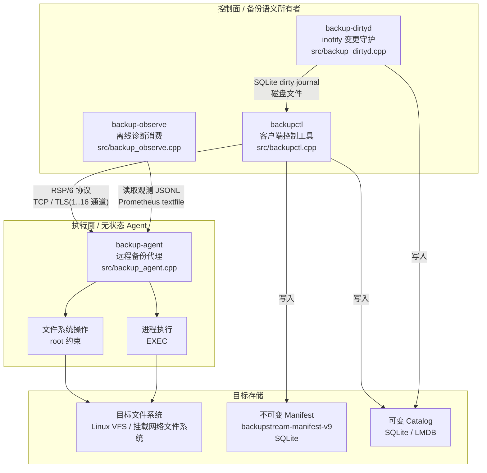
```mermaid
flowchart TB
    subgraph CTLZ["控制面 / 备份语义所有者"]
        CTL[backupctl<br/>客户端控制工具<br/>src/backupctl.cpp]
        DIRTY[backup-dirtyd<br/>inotify 变更守护<br/>src/backup_dirtyd.cpp]
        OBS[backup-observe<br/>离线诊断消费<br/>src/backup_observe.cpp]
    end

    subgraph EXECZ["执行面 / 无状态 Agent"]
        AGT[backup-agent<br/>远程备份代理<br/>src/backup_agent.cpp]
        A1[文件系统操作<br/>root 约束]
        A2[进程执行<br/>EXEC]
    end

    subgraph STOR["目标存储"]
        FS[目标文件系统<br/>Linux VFS / 挂载网络文件系统]
        M[不可变 Manifest<br/>backupstream-manifest-v9<br/>SQLite]
        C[可变 Catalog<br/>SQLite / LMDB]
    end

    CTL -- "RSP/6 协议<br/>TCP / TLS(1..16 通道)" --> AGT
    DIRTY -- "SQLite dirty journal<br/>磁盘文件" --> CTL
    OBS -- "读取观测 JSONL<br/>Prometheus textfile" --> AGT
    AGT --> A1
    AGT --> A2
    A1 --> FS
    A2 --> FS
    CTL -- "写入" --> M
    CTL -- "写入" --> C
    DIRTY -- "写入" --> C
```

**图例**：`subgraph` 表示分组，`-->` 表示数据/控制流向，`1..16 通道` 表示多数据通道并行。

**关键边界**：Agent 持久化备份语义状态为零（Agent Durable Backup Semantic State = 0），Manifest 与 BackupResult 的语义由 Client 持有（`README.md`「Core invariants」）。

## 1.2 进程与线程拓扑

从 `backup_agent.cpp` 的 `backup_agent_run`（`src/backup_agent.cpp:516`）可看到 Agent 的线程构成随 TLS 开关分化：非 TLS 路径为单 Reactor + 弹性会话池；TLS 路径为 Reactor Group 分片 + 有界工作池。

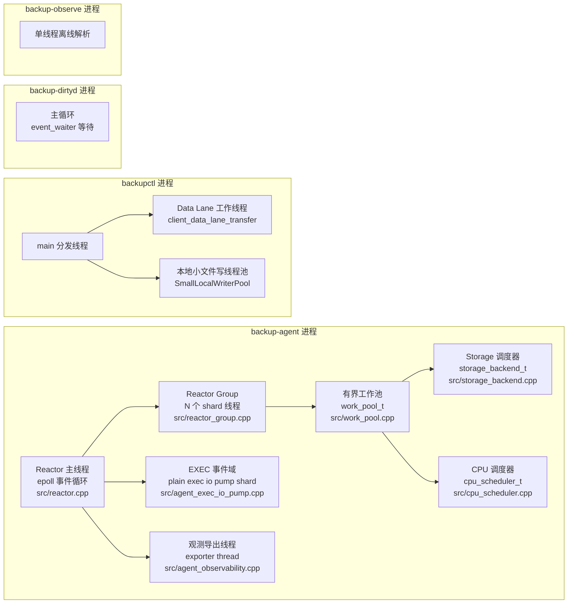
```mermaid
flowchart LR
    subgraph AGENT[backup-agent 进程]
        R0["Reactor 主线程<br/>epoll 事件循环<br/>src/reactor.cpp"]
        RG["Reactor Group<br/>N 个 shard 线程<br/>src/reactor_group.cpp"]
        WP["有界工作池<br/>work_pool_t<br/>src/work_pool.cpp"]
        SS["Storage 调度器<br/>storage_backend_t<br/>src/storage_backend.cpp"]
        CS["CPU 调度器<br/>cpu_scheduler_t<br/>src/cpu_scheduler.cpp"]
        EO["EXEC 事件域<br/>plain exec io pump shard<br/>src/agent_exec_io_pump.cpp"]
        EXP["观测导出线程<br/>exporter thread<br/>src/agent_observability.cpp"]
    end

    subgraph CLIENT[backupctl 进程]
        CM[main 分发线程]
        DL["Data Lane 工作线程<br/>client_data_lane_transfer"]
        SW["本地小文件写线程池<br/>SmallLocalWriterPool"]
    end

    subgraph DIRTYP[backup-dirtyd 进程]
        DM["主循环<br/>event_waiter 等待"]
    end

    subgraph OBSP[backup-observe 进程]
        OM["单线程离线解析"]
    end

    AGENT --- R0
    R0 --> RG
    RG --> WP
    WP --> SS
    WP --> CS
    R0 --> EO
    R0 --> EXP
    CLIENT --- CM
    CM --> DL
    CM --> SW
    DIRTYP --- DM
    OBSP --- OM
```

**图例**：`subgraph` 表示进程边界，`---` 表示包含关系，`-->` 表示组件间交互。

## 1.3 核心不变量：Agent 零状态

`docs/ARCHITECTURE.md` 明确 Agent 不得持久化的内容清单，这是判断任何功能是否越界的仲裁标准。

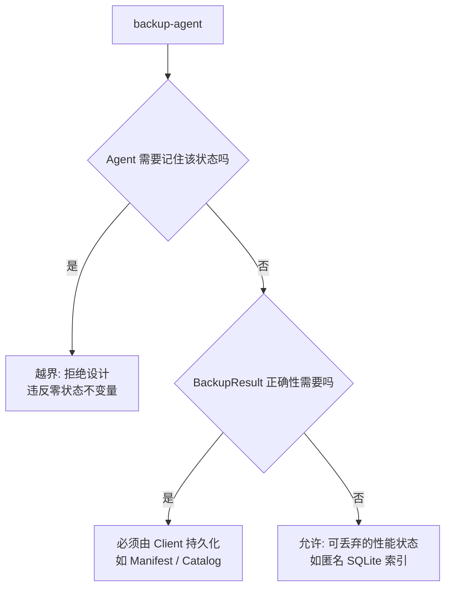
```mermaid
flowchart TD
    AG[backup-agent] --> Q{Agent 需要记住该状态吗}
    Q -- 是 --> X[越界: 拒绝设计<br/>违反零状态不变量]
    Q -- 否 --> Q2{BackupResult 正确性需要吗}
    Q2 -- 是 --> Y[必须由 Client 持久化<br/>如 Manifest / Catalog]
    Q2 -- 否 --> Z[允许: 可丢弃的性能状态<br/>如匿名 SQLite 索引]
```

**图例**：`{}` 为判断节点，`-- 是/否 -->` 为分支路径。

## 1.4 BackupResult 生命周期（双事实对象）

一个已提交的不可变 BackupResult 由两个调用方拥有的「事实」组成：目标文件系统上的最终 payload 路径 + Client/控制面存储上的最终 manifest（`docs/ARCHITECTURE.md`「Immutable BackupResult」）。

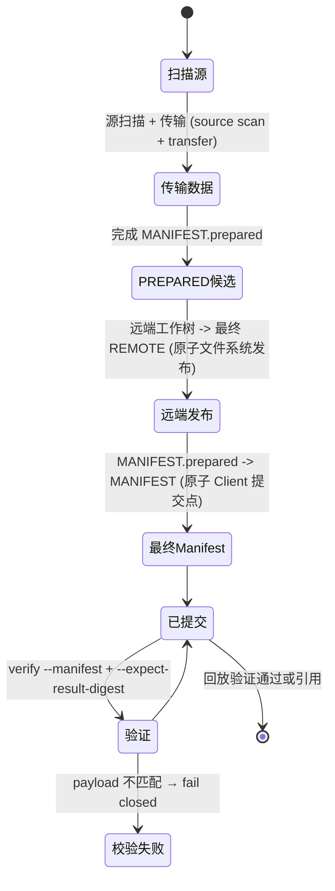
```mermaid
stateDiagram-v2
    [*] --> 扫描源
    扫描源 --> 传输数据: 源扫描 + 传输 (source scan + transfer)
    传输数据 --> PREPARED候选: 完成 MANIFEST.prepared
    PREPARED候选 --> 远端发布: 远端工作树 -> 最终 REMOTE (原子文件系统发布)
    远端发布 --> 最终Manifest: MANIFEST.prepared -> MANIFEST (原子 Client 提交点)
    最终Manifest --> 已提交
    已提交 --> 验证: verify --manifest + --expect-result-digest
    验证 --> 校验失败: payload 不匹配 → fail closed
    验证 --> 已提交
    已提交 --> [*]: 回放验证通过或引用
```

**图例**：`stateDiagram-v2` 为状态机图，`-->` 为状态转移，`:后` 为转移触发条件。

> 源码参考：`src/client_backup_manifest_runtime.cpp`（发布/回放）、`src/backup_manifest.cpp`（v9 导出）、`README.md`「Publication order」。

---

# 2. RSP/6 协议层

RSP/6 为当前线缆协议（wire contract）。协议版本 1-5 在操作打开前即被拒绝，无兼容垫片（`docs/PROTOCOL.md`）。

## 2.1 帧格式（WireFrameHeader）

每个帧为 16 字节定长头 + 变长负载（`src/protocol.hpp:203-212`）。

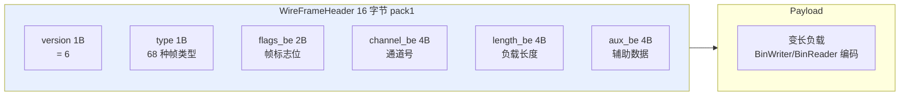
```mermaid
flowchart LR
    subgraph FH["WireFrameHeader 16 字节 pack1"]
        V[version 1B<br/>= 6]
        T[type 1B<br/>68 种帧类型]
        F[flags_be 2B<br/>帧标志位]
        CH[channel_be 4B<br/>通道号]
        L[length_be 4B<br/>负载长度]
        A[aux_be 4B<br/>辅助数据]
    end
    subgraph PL["Payload"]
        P[变长负载<br/>BinWriter/BinReader 编码]
    end
    FH --> PL
    style FH fill:#e8f0fe
```

**图例**：`subgraph` 分组，`-->` 表示头后跟随负载，字段名后的 `1B/2B/4B` 为字节宽度。

> 源码参考：`src/protocol.hpp:203`（`WireFrameHeader`）、`src/wire_codec.hpp`（BinWriter/BinReader）、`src/common.cpp`（编码实现）。

## 2.2 帧类型分组

68 种帧类型（`src/protocol.hpp:29-94`）按用途分为 8 组。

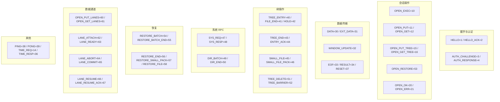
```mermaid
flowchart TB
    subgraph G_HANDSHAKE["握手与认证"]
        H[HELLO=1 / HELLO_ACK=2]
        A[AUTH_CHALLENGE=3 / AUTH_RESPONSE=4]
    end
    subgraph G_SESSION["会话操作"]
        E[OPEN_EXEC=10]
        P[OPEN_PUT=11 / OPEN_GET=12]
        PT[OPEN_PUT_TREE=15 / OPEN_GET_TREE=16]
        R[OPEN_RESTORE=53]
        OK[OPEN_OK=20 / OPEN_ERR=21]
    end
    subgraph G_DATA["数据传输"]
        D[DATA=30 / EXT_DATA=31]
        W[WINDOW_UPDATE=32]
        F[EOF=33 / RESULT=34 / RESET=37]
    end
    subgraph G_TREE["树操作"]
        T[TREE_ENTRY=40 / FILE_END=41 / HOLE=42]
        TE[TREE_END=43 / ENTRY_ACK=44]
        SM[SMALL_FILE=45 / SMALL_FILE_PACK=46]
        TD[TREE_DELETE=51 / TREE_BARRIER=52]
    end
    subgraph G_SYS["系统 RPC"]
        S[SYS_REQ=47 / SYS_RESP=48]
        DB[DIR_BATCH=49 / DIR_END=50]
    end
    subgraph G_RESTORE["恢复"]
        RB[RESTORE_BATCH=54 / RESTORE_BATCH_END=55]
        RE[RESTORE_END=56 / RESTORE_SMALL_PACK=57 / RESTORE_FILE=58]
    end
    subgraph G_LANE["数据通道"]
        L[OPEN_PUT_LANES=60 / OPEN_GET_LANES=61]
        LA[LANE_ATTACH=62 / LANE_READY=63]
        LB[LANE_ABORT=64 / LANE_COMMIT=65]
        LR[LANE_RESUME=66 / LANE_RESUME_ACK=67]
    end
    subgraph G_OTHER["其他"]
        O[PING=38 / PONG=39 / TIME_REQ=14 / TIME_RESP=36]
    end
```

**图例**：`subgraph` 为帧类型分组，`A/B=编号` 表示帧名与其枚举值，`X=数字` 中数字为 `FrameType` 枚举值。

## 2.3 会话握手与认证

RSP/6 HELLO 携带显式认证方法。Plain 共享密钥认证使用 HMAC-SHA256 挑战/应答，密钥永不经 Plain 连接传输（`docs/PROTOCOL.md`「Session」）。

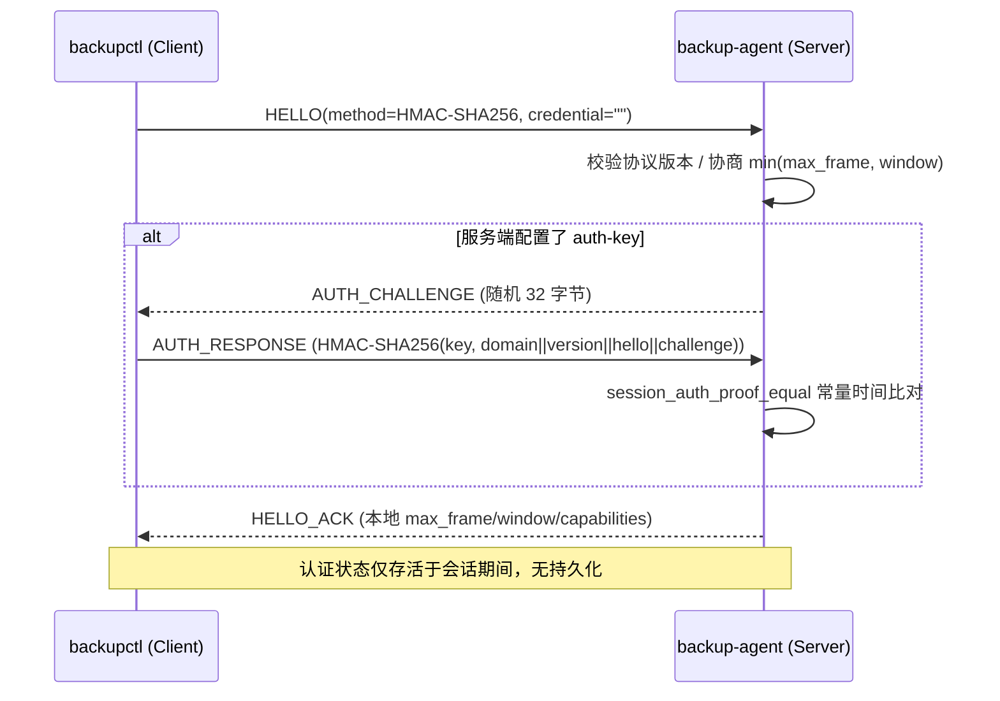
```mermaid
sequenceDiagram
    participant C as backupctl (Client)
    participant S as backup-agent (Server)
    C->>S: HELLO(method=HMAC-SHA256, credential="")
    S->>S: 校验协议版本 / 协商 min(max_frame, window)
    alt 服务端配置了 auth-key
        S-->>C: AUTH_CHALLENGE (随机 32 字节)
        C->>S: AUTH_RESPONSE (HMAC-SHA256(key, domain||version||hello||challenge))
        S->>S: session_auth_proof_equal 常量时间比对
    end
    S-->>C: HELLO_ACK (本地 max_frame/window/capabilities)
    Note over C,S: 认证状态仅存活于会话期间，无持久化
```

**图例**：`sequenceDiagram` 为时序图，`->>` 为同步消息，`-->>` 为返回/应答，`alt` 为条件分支，`Note over` 为旁注。

> 源码参考：`src/session_auth.cpp`（HMAC 域分离）、`src/agent_plain_ingress.cpp`（ingress_handle_hello/auth_response/send_hello_ack）、`src/backupctl.cpp`（hello 函数）。

## 2.4 能力位协商

40 位能力位（`src/protocol.hpp:122` Capability）让旧客户端与支持扩展的 Agent 兼容，而无需改协议版本（`docs/PROTOCOL.md`「Capability examples」）。

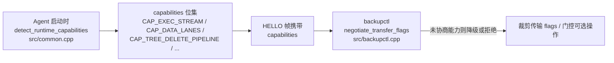
```mermaid
flowchart LR
    AG[Agent 启动时<br/>detect_runtime_capabilities<br/>src/common.cpp] --> CAP[capabilities 位集<br/>CAP_EXEC_STREAM / CAP_DATA_LANES /<br/>CAP_TREE_DELETE_PIPELINE / ...]
    CAP --> HELLO[HELLO 帧携带<br/>capabilities]
    HELLO --> CTL[backupctl<br/>negotiate_transfer_flags<br/>src/backupctl.cpp]
    CTL -- 未协商能力则降级或拒绝 --> OPS[裁剪传输 flags / 门控可选操作]
```

**图例**：`flowchart LR` 从左到右流程，`-->` 表示数据流向，`/` 分隔多项能力名。

## 2.5 操作族帧流

五类主操作的帧序列（`docs/PROTOCOL.md`「Main operation families」）。

```mermaid
flowchart TB
    subgraph TREE[不可变 TREE PUT]
        t1[OPEN_PUT_TREE<br/>work_root/flags/seed_root/seed_staging/publish]
        t2[TREE_ENTRY / DATA / HOLE / FILE_END / metadata]
        t3[TREE_BARRIER 按需]
        t4[TREE_END<br/>远程发布边界]
        t5[RESULT]
        t1-->t2-->t3-->t4-->t5
    end
    subgraph RESTORE[RESTORE]
        r1[OPEN_RESTORE]
        r2[RESTORE_BATCH / RESTORE_SMALL_PACK / RESTORE_FILE]
        r3[RESTORE_END]
        r4[RESULT]
        r1-->r2-->r3-->r4
    end
    subgraph EXEC[EXEC]
        e1[OPEN_EXEC<br/>cwd/argv/timeout]
        e2[OPEN_OK]
        e3[DATA/EXT_DATA 双向流<br/>WINDOW_UPDATE 信用]
        e4[EOF / RESULT]
        e1-->e2-->e3-->e4
    end
    subgraph LANE[Data Lanes]
        l1[OPEN_PUT_LANES]
        l2[LANE_ATTACH 每通道]
        l3[DATA 分片传输]
        l4[LANE_COMMIT / LANE_ABORT]
        l1-->l2-->l3-->l4
    end
```

**图例**：`subgraph` 为操作族，`-->` 为帧序列方向。

> 源码参考：`src/agent_plain_ingress.cpp`（ingress_dispatch_open_frame 分派）、`src/agent_tree_runtime.cpp`、`src/agent_data_lane.cpp`、`src/agent_exec_runtime.cpp`。

---

# 3. 客户端 backupctl

backupctl 是 Client 侧 CLI，负责建立会话、驱动备份/恢复/执行操作，并在本地生成 Manifest 与 Catalog（`src/backupctl.cpp:2176 backupctl_run`）。

## 3.1 命令分发树

`backupctl_run` 依据命令名与 TLS 开关选择执行路径：本地查询、Data Lane 多通道运行时、TLS Reactor 树运行时、控制 Reactor、或阻塞式会话（`src/backupctl.cpp:2176-2245`）。

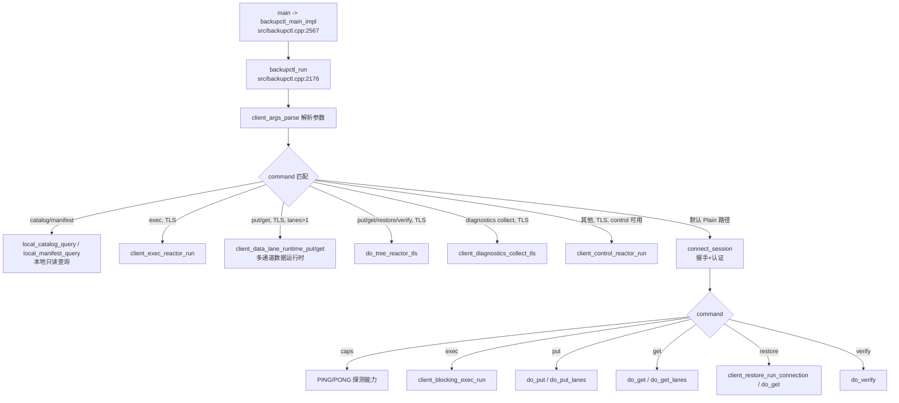
```mermaid
flowchart TD
    M[main -> backupctl_main_impl<br/>src/backupctl.cpp:2567] --> R[backupctl_run<br/>src/backupctl.cpp:2176]
    R --> P[client_args_parse 解析参数]
    P --> D{command 匹配}
    D -- catalog/manifest --> L[local_catalog_query / local_manifest_query<br/>本地只读查询]
    D -- exec, TLS --> TE[client_exec_reactor_run]
    D -- put/get, TLS, lanes>1 --> DL[client_data_lane_runtime_put/get<br/>多通道数据运行时]
    D -- put/get/restore/verify, TLS --> TR[do_tree_reactor_tls]
    D -- diagnostics collect, TLS --> DC[client_diagnostics_collect_tls]
    D -- 其他, TLS, control 可用 --> CR[client_control_reactor_run]
    D -- 默认 Plain 路径 --> S[connect_session<br/>握手+认证]
    S --> C2{command}
    C2 -- caps --> CAP[PING/PONG 探测能力]
    C2 -- exec --> BEX[client_blocking_exec_run]
    C2 -- put --> PUT[do_put / do_put_lanes]
    C2 -- get --> GET[do_get / do_get_lanes]
    C2 -- restore --> REST[client_restore_run_connection / do_get]
    C2 -- verify --> VER[do_verify]
```

**图例**：`flowchart TD` 自上而下流程，`{}` 为判断节点，`-->` 为转移路径，`/` 分隔同层替代。

## 3.2 会话建立（Plain）

阻塞式 Plain 路径通过 `connect_session` 完成 RSP/6 握手与 HMAC 认证（`src/backupctl.cpp:2246-2248`）。

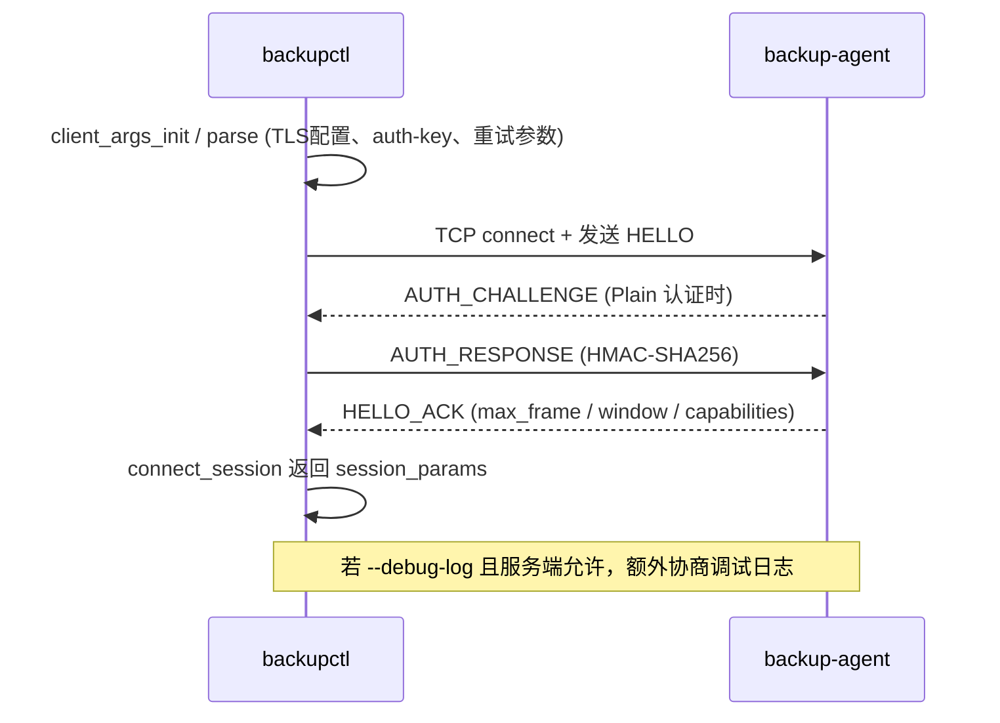
```mermaid
sequenceDiagram
    participant C as backupctl
    participant S as backup-agent
    C->>C: client_args_init / parse (TLS配置、auth-key、重试参数)
    C->>S: TCP connect + 发送 HELLO
    S-->>C: AUTH_CHALLENGE (Plain 认证时)
    C->>S: AUTH_RESPONSE (HMAC-SHA256)
    S-->>C: HELLO_ACK (max_frame / window / capabilities)
    C->>C: connect_session 返回 session_params
    Note over C,S: 若 --debug-log 且服务端允许，额外协商调试日志
```

**图例**：`sequenceDiagram` 时序图，`->>` 请求，`-->>` 应答，`Note over` 旁注。

## 3.3 PUT 主流程（不可变 TREE）

`do_put` 走 `do_put_stream` → `do_put_resumable_tree_stream`，驱动不可变 TREE PUT 的 13 个阶段（`src/backupctl.cpp:935`、`src/backupctl.cpp:747`）。

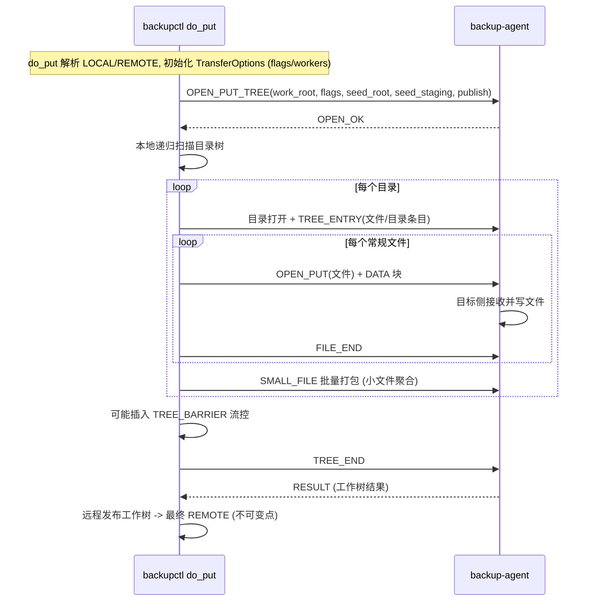
```mermaid
sequenceDiagram
    participant C as backupctl do_put
    participant S as backup-agent
    Note over C: do_put 解析 LOCAL/REMOTE, 初始化 TransferOptions (flags/workers)
    C->>S: OPEN_PUT_TREE(work_root, flags, seed_root, seed_staging, publish)
    S-->>C: OPEN_OK
    C->>C: 本地递归扫描目录树
    loop 每个目录
        C->>S: 目录打开 + TREE_ENTRY(文件/目录条目)
        loop 每个常规文件
            C->>S: OPEN_PUT(文件) + DATA 块
            S->>S: 目标侧接收并写文件
            C->>S: FILE_END
        end
        C->>S: SMALL_FILE 批量打包 (小文件聚合)
    end
    C->>C: 可能插入 TREE_BARRIER 流控
    C->>S: TREE_END
    S-->>C: RESULT (工作树结果)
    C->>C: 远程发布工作树 -> 最终 REMOTE (不可变点)
```

**图例**：`loop` 为循环块，`->>` 请求帧，`-->>` 应答帧，`Note over` 阶段说明。

> 源码参考：`do_put` (`src/backupctl.cpp:935`)、`do_put_stream` (`:747`)、`do_put_resumable_tree_stream` (`:793`)、目录处理在 `src/client_backup_directory_runtime.cpp`。

## 3.4 目录处理流水线

不可变 TREE 的目录条目由 `client_dir_processor` 流水线消费，将本地目录树转为帧流（`src/client_backup_directory_runtime.cpp`）。

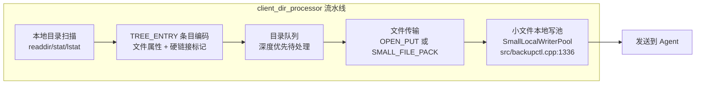
```mermaid
flowchart LR
    subgraph PIPELINE["client_dir_processor 流水线"]
        SC[本地目录扫描<br/>readdir/stat/lstat]
        EN[TREE_ENTRY 条目编码<br/>文件属性 + 硬链接标记]
        Q[目录队列<br/>深度优先待处理]
        WF[文件传输<br/>OPEN_PUT 或 SMALL_FILE_PACK]
        SW[小文件本地写池<br/>SmallLocalWriterPool<br/>src/backupctl.cpp:1336]
    end
    SC --> EN --> Q
    Q --> WF
    WF --> SW
    SW --> SND[发送到 Agent]
```

**图例**：`flowchart LR` 左到右流程，`subgraph` 为流水线阶段，`-->` 为数据流向。

> 源码参考：`src/client_backup_directory_runtime.cpp`、`SmallLocalWriterPool` (`src/backupctl.cpp:1336`)、小文件写线程 `small_local_writer_thread_main` (`:1452`)。

## 3.5 Manifest 两阶段发布

Manifest 发布采用 prepared → final 原子两阶段，保证崩溃安全（`docs/ARCHITECTURE.md`「Publication order」）。

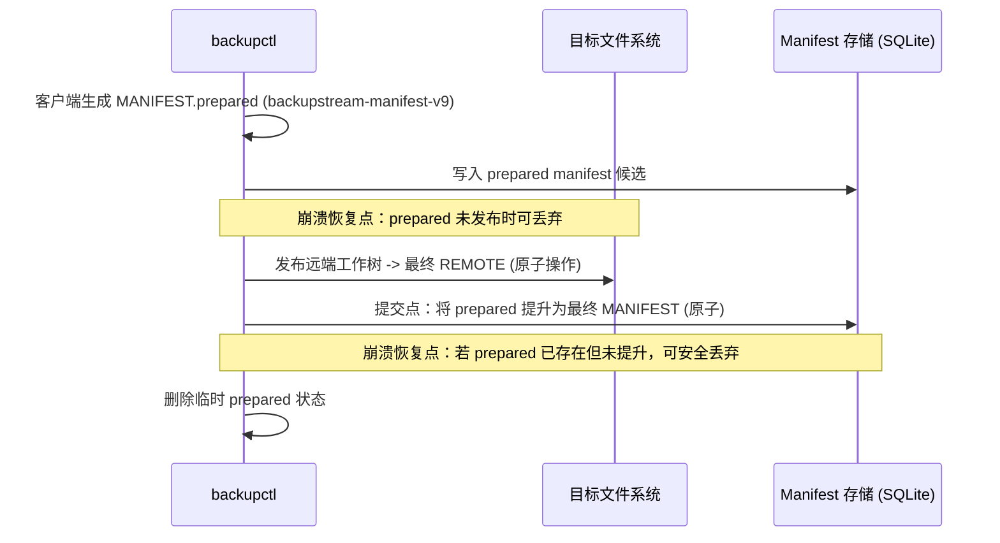
```mermaid
sequenceDiagram
    participant C as backupctl
    participant FS as 目标文件系统
    participant M as Manifest 存储 (SQLite)
    C->>C: 客户端生成 MANIFEST.prepared (backupstream-manifest-v9)
    C->>M: 写入 prepared manifest 候选
    Note over C,FS: 崩溃恢复点：prepared 未发布时可丢弃
    C->>FS: 发布远端工作树 -> 最终 REMOTE (原子操作)
    C->>M: 提交点：将 prepared 提升为最终 MANIFEST (原子)
    Note over C,M: 崩溃恢复点：若 prepared 已存在但未提升，可安全丢弃
    C->>C: 删除临时 prepared 状态
```

**图例**：`sequenceDiagram` 时序图，`Note over` 标注崩溃恢复点。

## 3.6 Manifest 生命周期

Manifest 从扫描到发布再到回放验证的完整生命周期（用户指定对象之一）。

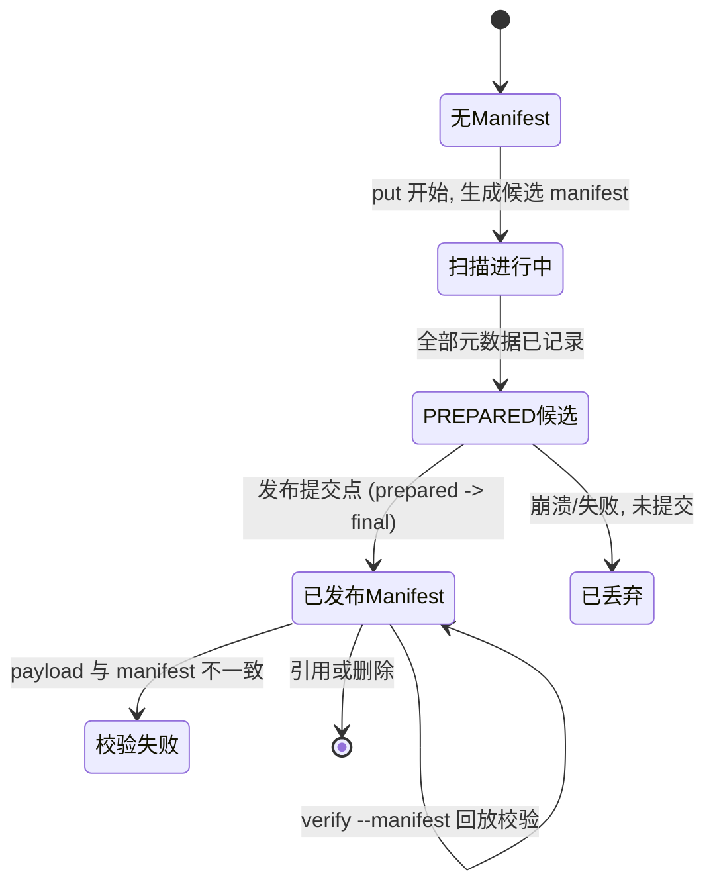
```mermaid
stateDiagram-v2
    [*] --> 无Manifest
    无Manifest --> 扫描进行中: put 开始, 生成候选 manifest
    扫描进行中 --> PREPARED候选: 全部元数据已记录
    PREPARED候选 --> 已发布Manifest: 发布提交点 (prepared -> final)
    PREPARED候选 --> 已丢弃: 崩溃/失败, 未提交
    已发布Manifest --> 已发布Manifest: verify --manifest 回放校验
    已发布Manifest --> 校验失败: payload 与 manifest 不一致
    已发布Manifest --> [*]: 引用或删除
```

**图例**：`stateDiagram-v2` 状态机，`-->` 状态转移，`:后` 为触发条件。

> 源码参考：`src/backup_manifest.cpp`（v9 导出/校验）、`src/client_backup_manifest_runtime.cpp`（发布/回放分支）。

## 3.7 GET / RESTORE 时序

`do_get` 从远端 TREE GET 读取（`src/backupctl.cpp:1840`）；`restore` 有 catalog 时走 `client_restore_run_connection`（`src/backupctl.cpp:2292-2303`）。

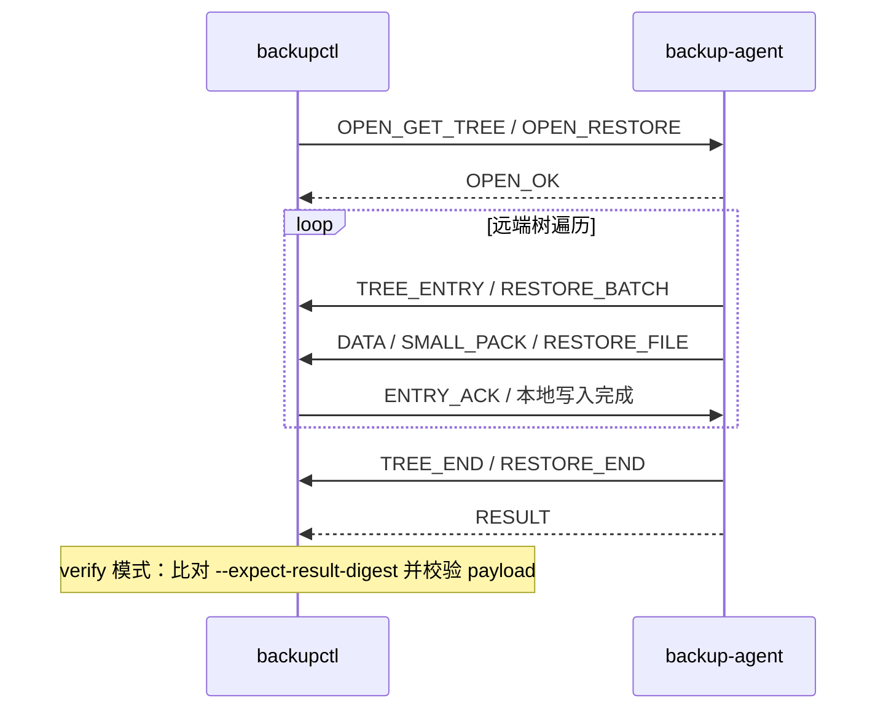
```mermaid
sequenceDiagram
    participant C as backupctl
    participant S as backup-agent
    C->>S: OPEN_GET_TREE / OPEN_RESTORE
    S-->>C: OPEN_OK
    loop 远端树遍历
        S->>C: TREE_ENTRY / RESTORE_BATCH
        S->>C: DATA / SMALL_PACK / RESTORE_FILE
        C->>S: ENTRY_ACK / 本地写入完成
    end
    S->>C: TREE_END / RESTORE_END
    S-->>C: RESULT
    Note over C: verify 模式：比对 --expect-result-digest 并校验 payload
```

**图例**：`sequenceDiagram` 时序图，`loop` 循环遍历块。

## 3.8 Data Lane 客户端状态机

TLS 启用且 lanes>1 时，多数据通道传输由 `client_data_lane_runtime` 驱动（`src/backupctl.cpp:2197-2202`）。

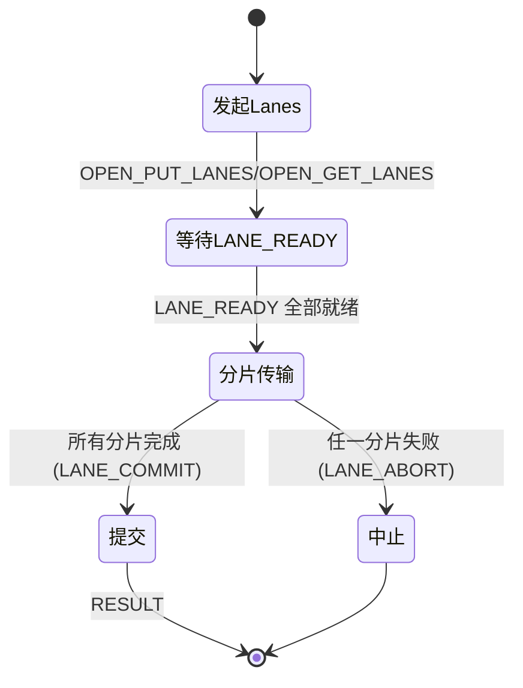
```mermaid
stateDiagram-v2
    [*] --> 发起Lanes
    发起Lanes --> 等待LANE_READY: OPEN_PUT_LANES/OPEN_GET_LANES
    等待LANE_READY --> 分片传输: LANE_READY 全部就绪
    分片传输 --> 提交: 所有分片完成 (LANE_COMMIT)
    分片传输 --> 中止: 任一分片失败 (LANE_ABORT)
    提交 --> [*]: RESULT
    中止 --> [*]
```

**图例**：`stateDiagram-v2` 状态机，`-->` 状态转移，`:后` 为触发事件。

> 源码参考：`src/client_data_lane_runtime.cpp`（put/get 与分片分配）、`src/client_data_lane_transfer.cpp`（单通道传输执行）。

## 3.9 客户端 TLS Reactor 接线

TLS 模式下 put/get/restore/verify 统一走 `do_tree_reactor_tls`，内部拆分为 tree reactor + exec reactor + control reactor 三条 epoll 事件域（`src/backupctl.cpp:2226-2228`）。

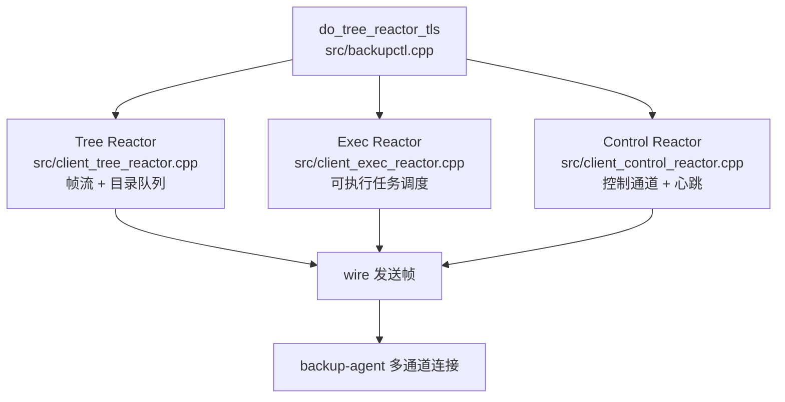
```mermaid
flowchart TB
    T[do_tree_reactor_tls<br/>src/backupctl.cpp] --> TREE_R["Tree Reactor<br/>src/client_tree_reactor.cpp<br/>帧流 + 目录队列"]
    T --> EXEC_R["Exec Reactor<br/>src/client_exec_reactor.cpp<br/>可执行任务调度"]
    T --> CTL_R["Control Reactor<br/>src/client_control_reactor.cpp<br/>控制通道 + 心跳"]
    TREE_R --> SEND[wire 发送帧]
    EXEC_R --> SEND
    CTL_R --> SEND
    SEND --> AGT[backup-agent 多通道连接]
```

**图例**：`flowchart TB` 自顶向下，`subgraph` 为三条 reactor 事件域，`-->` 为数据/控制流。

> 源码参考：`src/client_tree_reactor.cpp`、`src/client_exec_reactor.cpp`、`src/client_control_reactor.cpp`、`src/client_data_lane_runtime.cpp`。

## 3.10 VERIFY 时序

`verify` 走 `client_restore_verify_connection`，校验远端 payload 与期望结果摘要的一致性（`src/backupctl.cpp:2304-2310`）。

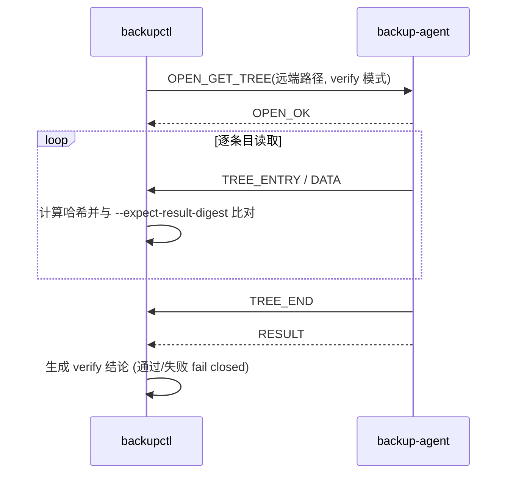
```mermaid
sequenceDiagram
    participant C as backupctl
    participant S as backup-agent
    C->>S: OPEN_GET_TREE(远端路径, verify 模式)
    S-->>C: OPEN_OK
    loop 逐条目读取
        S->>C: TREE_ENTRY / DATA
        C->>C: 计算哈希并与 --expect-result-digest 比对
    end
    S->>C: TREE_END
    S-->>C: RESULT
    C->>C: 生成 verify 结论 (通过/失败 fail closed)
```

**图例**：`sequenceDiagram` 时序图，`loop` 循环校验块。

> 源码参考：`client_restore_verify_connection` (`src/backupctl.cpp:2307`)、`src/client_restore_runtime.cpp`（校验实现）。

## 3.11 GET 会话生命周期

GET/restore 客户端侧会话从打开到校验的完整生命周期（用户指定对象之一）。

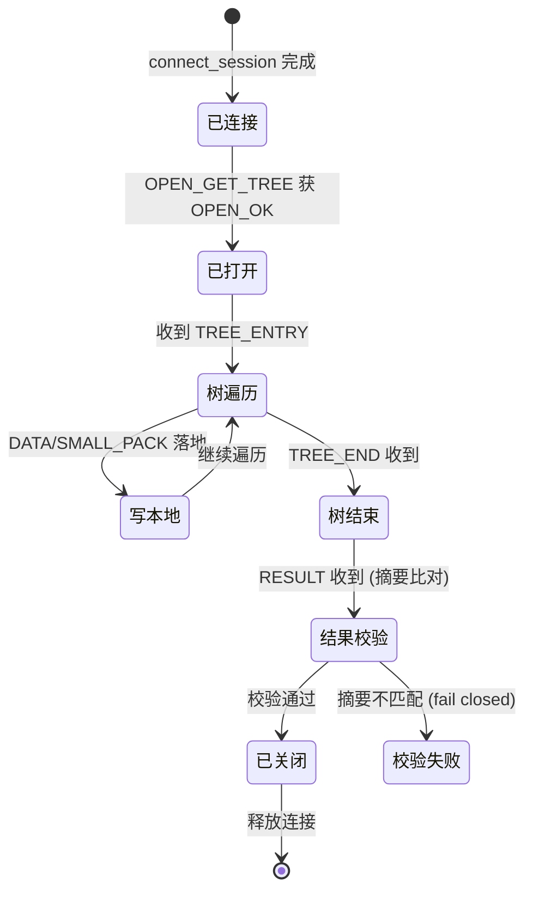
```mermaid
stateDiagram-v2
    [*] --> 已连接: connect_session 完成
    已连接 --> 已打开: OPEN_GET_TREE 获 OPEN_OK
    已打开 --> 树遍历: 收到 TREE_ENTRY
    树遍历 --> 写本地: DATA/SMALL_PACK 落地
    写本地 --> 树遍历: 继续遍历
    树遍历 --> 树结束: TREE_END 收到
    树结束 --> 结果校验: RESULT 收到 (摘要比对)
    结果校验 --> 已关闭: 校验通过
    结果校验 --> 校验失败: 摘要不匹配 (fail closed)
    已关闭 --> [*]: 释放连接
```

**图例**：`stateDiagram-v2` 状态机，`-->` 转移，`:后` 为触发事件。

## 3.12 海量小文件备份并发机制

backupstream 处理数十万小文件的核心策略：**客户端单线程生产者 + 流水线帧 + Agent 异步批量消费 + 累积栅栏**（`src/client_backup_runtime.cpp`、`src/agent_tree_runtime.cpp`）。

```mermaid
flowchart TB
    subgraph C["客户端: 生产者, 串行推进"]
        Q["目录队列 SQLite<br/>BFS 广度优先<br/>kDirectoryClaimBatch=64 个/批<br/>src/client_backup_runtime.cpp:1034"]
        SCAN["目录扫描<br/>client_directory_collect_batch<br/>src/client_backup_directory_runtime.cpp:791"]
        META["元数据扫描<br/>client_metadata_scan_batch<br/>最多 4 线程并行 fstatat<br/>src/client_metadata_scan.cpp:16"]
        PACK["小文件打包<br/>≤512KB 判定<br/>≤1024 文件/包<br/>FF_PIPELINED 不等待 ACK<br/>src/client_backup_runtime.cpp:172-192"]
    end

    subgraph A["Agent: 消费者, 异步并行"]
        RX["RX 接收<br/>high_water 流控<br/>src/agent_tree_runtime.cpp:2480-2501"]
        SUB["任务打包<br/>8 文件 / 256KB 每 task<br/>src/agent_tree_runtime.cpp:177-178"]
        WP["tree_workers 池<br/>fair_limit 限流<br/>src/work_pool.cpp:720-734"]
        WRITE["worker 写入<br/>每 8 文件 sync 一次<br/>src/agent_tree_runtime.cpp:498-500"]
    end

    Q --> SCAN --> META --> PACK
    PACK -->|FF_PIPELINED 帧流| RX
    RX --> SUB --> WP --> WRITE
    WRITE --> BAR["TREE_BARRIER 累积栅栏<br/>ACK 代表此前全部帧已落盘<br/>src/agent_tree_runtime.cpp:2539-2553"]
```

**图例**：`subgraph` 客户端/Agent 边界，`-->` 数据流，`:后` 为源码引用，` ` 为节点内换行。

**并发关键点**（用户关注点）：

| 环节 | 机制 | 源码 |
|------|------|------|
| 目录遍历 | BFS 队列（FIFO），64 目录/批，客户端仅 1 个目录 fd 串行 | `src/client_backup_state.cpp:389,519` |
| 元数据扫描 | 惰性启动最多 4 线程并行 fstatat | `src/client_metadata_scan.cpp:74-106` |
| 小文件判定 | ≤512KB（kSmallBlobTarget）；fast 路径 ≤8MB | `src/transfer.hpp:188,16` |
| 客户端打包 | ≤1024 文件或接近 max_frame 即 flush 成 FT_SMALL_FILE_PACK | `src/client_backup_runtime.cpp:185-199` |
| Agent 再打包 | 8 文件/256KB 聚合成 work task 提交池 | `src/agent_tree_runtime.cpp:177-178,1458-1501` |
| Agent 流控 | small.limit 并发上限 + high_water=max(8, limit×8) 暂停 RX | `src/agent_tree_runtime.cpp:2710-2712` |
| 落盘节奏 | 每 8 文件 durable_dir_batch_sync 一次 | `src/agent_tree_runtime.cpp:498-500` |
| 全局栅栏 | TREE_BARRIER 累积 fence（非末批后/64 目录批后/删除后） | `src/client_tree_barrier` (`src/client_backup_directory_runtime.cpp:57`) |
| 控制通道水位 | inflight_high=128 / inflight_low=64 滞回 | `src/agent_tls_runtime.cpp:55-56` |
| 接收端并发（get） | SmallLocalWriterPool N 线程（--small-file-workers 0-64，默认 0 禁用），有界队列 max(8, 8N) 背压 | `src/backupctl.cpp:1362,1457` |

**发送端本质是单线程生产者**：扫描 → 元数据（可并行）→ 发帧全部串行推进；并发压力通过 FF_PIPELINED 流水线帧转移给 Agent 异步消费（`src/client_backup_runtime.cpp:268`）。接收端（get）则用 SmallLocalWriterPool 把本地小文件写入分摊到 N 线程（`src/backupctl.cpp:1394-1432`）。

> 源码参考：`SmallFilePackSender::enqueue/flush` (`src/client_backup_runtime.cpp:172-199`)、`agent_tree_small_submit_pending` (`src/agent_tree_runtime.cpp:1458`)、`agent_tree_small_task_run` (`:506`)。

---

# 4. Agent 服务端网络层

Agent 服务端按 TLS 开关分化：Plain 路径走单 Reactor + `agent_plain_ingress` 的 11 态 FSM；TLS 路径走 Reactor Group 分片 + `agent_tls_runtime` 的 9 态 FSM（`src/backup_agent.cpp` 中 `backup_agent_run` 的布线）。

## 4.1 Agent 网络接入拓扑

```mermaid
flowchart TB
    MAIN[backup_agent_run<br/>src/backup_agent.cpp] --> WIRING{配置了 TLS?}
    WIRING -- 否 --> PLAIN[reactor 单线程<br/>agent_plain_ingress_submit_fd]
    WIRING -- 是 --> TLS[reactor_group_t<br/>N shard]
    PLAIN --> ING[plain ingress FSM<br/>src/agent_plain_ingress.cpp]
    TLS --> TLSR[agent_tls_runtime<br/>src/agent_tls_runtime.cpp]
    TLSR --> LWS[lane_workers / tree_workers /<br/>control_workers 有界池]
    TLSR --> CS[lane_cpu_scheduler]
    TLSR --> SS[lane_storage]
```

**图例**：`flowchart TB` 自顶向下，`{}` 判断节点，`-->` 组件关系。

> 源码参考：`src/backup_agent.cpp`（wiring）、`src/reactor.cpp`、`src/reactor_group.cpp`、`src/agent_plain_ingress.cpp`、`src/agent_tls_runtime.cpp`。

## 4.2 Plain Ingress 11 态握手状态机

`ingress_phase_t` 枚举 0-10 定义完整握手/工作状态机（`src/agent_plain_ingress.cpp:34-46`）。

```mermaid
stateDiagram-v2
    [*] --> WAIT_HELLO
    WAIT_HELLO --> SEND_HELLO_ACK: ingress_handle_hello 校验协议版本
    WAIT_HELLO --> SEND_ERROR: 版本/帧格式错误
    SEND_HELLO_ACK --> SEND_AUTH_CHALLENGE: 服务端配置了认证
    SEND_HELLO_ACK --> WAIT_OPEN: 无认证需求
    SEND_AUTH_CHALLENGE --> WAIT_AUTH_RESPONSE
    WAIT_AUTH_RESPONSE --> WAIT_OPEN: ingress_handle_auth_response 校验通过
    WAIT_AUTH_RESPONSE --> SEND_ERROR: HMAC 校验失败
    SEND_ERROR --> [*]: 关闭连接
    WAIT_OPEN --> CONTROL_WORK: 收到 OPEN_EXEC/OPEN_PUT_TREE/... (ingress_dispatch_open_frame)
    WAIT_OPEN --> EXEC_WORK: OPEN_EXEC 分配
    CONTROL_WORK --> SEND_CONTROL: 控制响应
    SEND_CONTROL --> CONTROL_WORK: 多轮控制作业
    EXEC_WORK --> EXEC_OPEN_OK: 发送 OPEN_OK
    EXEC_OPEN_OK --> CONTROL_WORK: exec 完成后回控制
    WAIT_OPEN --> TREE: 树/文件/通道作业
    TREE --> [*]: 作业结束/关闭
```

**图例**：`stateDiagram-v2` 状态机，`-->` 状态转移，`:后` 为触发事件，`[*]` 为初始/终止。

> 源码参考：`ingress_phase_t` (`src/agent_plain_ingress.cpp:34`)、`ingress_handle_hello` (`:1902`)、`ingress_handle_auth_response`、`ingress_dispatch_open_frame` (`:2053-2055`)。

## 4.3 Plain 会话生命周期

会话从 accept 到关闭的完整生命周期（用户指定对象之一）。

```mermaid
stateDiagram-v2
    [*] --> 已接受: agent_accept_submit 完成 accept
    已接受 --> 握手阶段: 分配 ingress 会话 (WAIT_HELLO)
    握手阶段 --> 认证阶段: HELLO 协商完成
    认证阶段 --> 打开阶段: AUTH_RESPONSE 校验通过 (WAIT_OPEN)
    打开阶段 --> 作业阶段: OPEN_OK 已发送
    打开阶段 --> 已关闭: 超时/对端 RESET
    作业阶段 --> 已关闭: 作业完成 (RESULT) 或对端关闭
    作业阶段 --> 作业阶段: 多轮控制作业/新 OPEN
    已关闭 --> [*]: 回收会话资源
```

**图例**：`stateDiagram-v2` 状态机，`-->` 状态转移，`:后` 为触发条件。

> 源码参考：`src/agent_acceptor.cpp`（accept 流程）、`src/agent_plain_ingress.cpp`（会话结构 `ingress_session_t`）、超时与重置处理 (`:2037-2055`)。

## 4.4 OPEN 分派中枢

`ingress_dispatch_open_frame` 按帧类型把已打开会话分派到对应运行时（`src/agent_plain_ingress.cpp`）。

```mermaid
flowchart TD
    W[WAIT_OPEN 收到帧] --> D{帧类型}
    D -- OPEN_PUT_TREE / OPEN_GET_TREE --> TREE[agent_tree_runtime<br/>PUT/GET 作业]
    D -- OPEN_PUT / OPEN_GET --> FILE[agent_file_runtime<br/>单文件读写]
    D -- OPEN_EXEC --> EXEC[agent_exec_runtime<br/>进程执行]
    D -- OPEN_RESTORE --> REST[agent_restore_reactor<br/>恢复批次]
    D -- OPEN_PUT_LANES / OPEN_GET_LANES --> LANE[agent_data_lane<br/>多通道]
    D -- SYS_REQ / TIME_REQ / PING --> SYS[系统服务响应]
    TREE --> RESULT[发送 RESULT 帧]
    EXEC --> RESULT
    REST --> RESULT
```

**图例**：`flowchart TD` 自上而下，`{}` 帧类型判断，`-->` 分派路径。

## 4.5 TLS 会话分发（9 态 FSM）

`agent_tls_phase_t` 枚举 0-8（`src/agent_tls_runtime.cpp:27-37`）。

```mermaid
stateDiagram-v2
    [*] --> WAIT_HELLO
    WAIT_HELLO --> READY: agent_tls_handle_hello 校验
    WAIT_HELLO --> CLOSING: 校验失败
    READY --> LANE: OPEN_PUT_LANES/OPEN_GET_LANES 附着
    READY --> GROUP: LANE 组协调
    READY --> EXEC: OPEN_EXEC
    READY --> TREE: OPEN_PUT_TREE/OPEN_GET_TREE
    READY --> FILE: OPEN_PUT/OPEN_GET
    READY --> RESTORE: OPEN_RESTORE
    LANE --> CLOSING: LANE_ABORT / 关闭
    GROUP --> CLOSING: 组中止
    EXEC --> CLOSING: exec 结束/超时
    TREE --> CLOSING: 树作业结束
    FILE --> CLOSING: 文件作业结束
    RESTORE --> CLOSING: 恢复结束
    CLOSING --> [*]: 排空并回收
```

**图例**：`stateDiagram-v2` 状态机，`-->` 状态转移，`:后` 为触发事件。

> 源码参考：`agent_tls_phase_t` (`src/agent_tls_runtime.cpp:27`)、`agent_tls_handle_hello` (`:922`)、TLS 会话结构 `agent_tls_session_t` (`:39`)。

## 4.6 TLS 控制通道与多轮作业

TLS 会话的 READY 态支持控制通道上的多轮作业，受 `inflight_high`/`inflight_low` 水位约束（`src/agent_tls_runtime.cpp:55-56`）。

```mermaid
flowchart LR
    RD[READY 态] --> OP{收到控制帧}
    OP -- OPEN_EXEC --> EX[EXEC 运行时]
    OP -- OPEN_PUT_TREE --> TR[TREE 运行时]
    OP -- 数据帧 --> LW[lane/tree/file 工作池执行]
    EX --> R2[RESULT 帧]
    TR --> R2
    R2 -->|多轮作业循环| RD
    RD --> INF{inflight 计数}
    INF -->|计数高于 inflight_high| PAUSE[暂停新作业]
    INF -->|计数低于 inflight_low| RESUME[恢复新作业]
```

**图例**：`flowchart LR` 左到右，`{}` 判断，`-->` 流转，`subgraph` 水位门控。

> 源码参考：`src/agent_tls_runtime.cpp`（inflight 高/低水位）、`src/bounded_admission.hpp`（两层准入）。

---

# 5. Agent 执行运行时

Agent 的作业执行层由六个运行时组成，各自以 FSM 驱动，全部执行在可耗尽的工作线程域（work_pool / storage_backend / cpu_scheduler 三层调度）之上。

## 5.1 运行时全景

```mermaid
flowchart TB
    subgraph NW["网络层"]
        PLAIN[plain ingress 分派]
        TLS[agent_tls_runtime 分派]
    end
    subgraph RT["执行运行时"]
        TR[agent_tree_runtime<br/>src/agent_tree_runtime.cpp]
        FR[agent_file_runtime<br/>src/agent_file_runtime.cpp]
        RR[agent_restore_runtime<br/>src/agent_restore_reactor.cpp]
        LR[agent_data_lane + lane_group<br/>src/agent_data_lane.cpp / lane_group.cpp]
        ER[agent_exec_runtime<br/>src/agent_exec_runtime.cpp]
    end
    subgraph EXECPOOL["执行域"]
        WP[work_pool_t]
        SB[storage_backend_t]
        CS[cpu_scheduler_t]
    end
    PLAIN --> TR
    PLAIN --> FR
    PLAIN --> RR
    PLAIN --> LR
    PLAIN --> ER
    TLS --> TR
    TLS --> LR
    TLS --> ER
    TR --> WP
    FR --> WP
    RR --> WP
    LR --> WP
    ER --> WP
    WP --> SB
    WP --> CS
```

**图例**：`flowchart TB` 自顶向下，`subgraph` 分层，`-->` 依赖关系。

## 5.2 TREE 运行时 PUT/GET 双模式

`agent_tree_mode_t` 区分 PUT_NATIVE / GET_NATIVE（`src/agent_tree_runtime.cpp:104-107`），作业以 `agent_tree_work_kind_t` 分派（PREPARE/SMALL_FILE/SMALL_PACK/ENTRY_META/COMMIT/GET_PREPARE/GET_SCAN/REG_PUT_OPEN/REG_PUT_HASH_PREFIX/REG_PUT_WRITE 等，`src/agent_tree_runtime.cpp:109-120`）。

```mermaid
stateDiagram-v2
    [*] --> 等待OPEN
    等待OPEN --> PUT工作树: OPEN_PUT_TREE 打开
    等待OPEN --> GET工作树: OPEN_GET_TREE 打开
    PUT工作树 --> PREPARE: AGENT_TREE_WORK_PREPARE
    PREPARE --> 条目处理: TREE_ENTRY 元数据
    条目处理 --> 小文件打包: AGENT_TREE_WORK_SMALL_FILE / SMALL_PACK
    条目处理 --> 常规文件: AGENT_TREE_WORK_REG_PUT_OPEN → REG_PUT_HASH_PREFIX → REG_PUT_WRITE
    小文件打包 --> COMMIT: AGENT_TREE_WORK_COMMIT
    常规文件 --> COMMIT
    COMMIT --> 等待TREE_END
    等待TREE_END --> 已发布: 收到 TREE_END, 远程发布
    GET工作树 --> GET_PREPARE: AGENT_TREE_WORK_GET_PREPARE
    GET_PREPARE --> GET_SCAN: AGENT_TREE_WORK_GET_SCAN
    GET_SCAN --> 回传条目: 发送 TREE_ENTRY/DATA
    回传条目 --> 已发布: TREE_END 完成
    已发布 --> [*]: RESULT
```

**图例**：`stateDiagram-v2` 状态机，`:后` 为触发工作类型，`→` 为状态/工作转移。

## 5.3 FILE 运行时 FSM

单文件 OPEN_PUT/OPEN_GET 由 `agent_file_runtime` 处理，支持哈希前缀（hash-prefix）校验与稀疏洞（hole）写入。

```mermaid
stateDiagram-v2
    [*] --> 等待OPEN
    等待OPEN --> PUT传输: OPEN_PUT
    等待OPEN --> GET传输: OPEN_GET
    PUT传输 --> 写数据: DATA/EXT_DATA 到达
    写数据 --> 洞写入: HOLE 标记 (稀疏)
    写数据 --> 哈希前缀: AGENT_LANE_IO_HASH_PREFIX 校验
    哈希前缀 --> 写数据
    写数据 --> EOF确认: FT_EOF
    GET传输 --> 读数据: 源文件读取
    读数据 --> 发送窗口: WINDOW_UPDATE 信用管理
    EOF确认 --> 已完成: FT_RESULT
    发送窗口 --> 已发送: FT_EOF
    已发送 --> 已完成
    已完成 --> [*]
```

**图例**：`stateDiagram-v2` 状态机，`:后` 为事件/IO 类型。

> 源码参考：`src/agent_file_runtime.cpp`、`src/regular_file_io.cpp`（轮次式大文件 IO）。

## 5.4 DATA LANE 单通道 FSM（10 态）

`agent_lane_state_t` 定义单条数据通道的完整状态（`src/agent_data_lane.cpp:15-26`）。

```mermaid
stateDiagram-v2
    [*] --> INIT
    INIT --> PUT_WAIT_FRAME: 附着为 PUT 通道
    INIT --> GET_READY: 附着为 GET 通道
    PUT_WAIT_FRAME --> PUT_IO: 收到 DATA (AGENT_LANE_IO_PUT_WRITE)
    PUT_IO --> PUT_WAIT_FRAME: 写完成, 等下一帧
    GET_READY --> GET_IO: 授权读取 (AGENT_LANE_IO_GET_READ)
    GET_IO --> GET_WAIT_CREDIT: 已读, 等待 WINDOW_UPDATE 信用
    GET_WAIT_CREDIT --> GET_WAIT_TX: 信用恢复
    GET_WAIT_TX --> GET_IO: 可继续发送
    PUT_WAIT_FRAME --> WAIT_FINAL_DRAIN: FT_EOF 到达
    GET_WAIT_TX --> WAIT_FINAL_DRAIN: 发送完成
    WAIT_FINAL_DRAIN --> DONE: 排空完成
    WAIT_FINAL_DRAIN --> FAILED: 传输错误
    PUT_IO --> FAILED: IO 失败
    GET_IO --> FAILED
    DONE --> [*]
    FAILED --> [*]
```

**图例**：`stateDiagram-v2` 状态机，`-->` 状态转移，`:后` 为触发事件/IO 类型。

> 源码参考：`agent_lane_state_t` (`src/agent_data_lane.cpp:15`)、`agent_lane_io_kind_t` (`:28`)、状态推进函数 `agent_lane_handle_*`。

## 5.5 DATA LANE 通道生命周期

单条数据通道从分配到回收的生命周期（用户指定对象之一）。

```mermaid
stateDiagram-v2
    [*] --> 已创建: 接受 LANE_ATTACH
    已创建 --> 激活: 收到 LANE_READY
    激活 --> 传输中: DATA 双向流动
    传输中 --> 完成: LANE_COMMIT / FT_EOF 排空
    传输中 --> 中止: LANE_ABORT / 传输错误
    激活 --> 中止: 组中止
    完成 --> 已释放: 回收通道资源
    中止 --> 已释放
    已释放 --> [*]
```

**图例**：`stateDiagram-v2` 状态机，`-->` 状态转移，`:后` 为触发事件。

## 5.6 LANE 组协调 FSM（8 态）

`agent_lane_group_state_t` 管理一组数据通道的协调生命周期（`src/agent_lane_group.cpp:27-36`）。

```mermaid
stateDiagram-v2
    [*] --> GROUP_INIT
    GROUP_INIT --> GROUP_PREPARING: AGENT_LANE_GROUP_WORK_PREPARE (准备阶段)
    GROUP_PREPARING --> GROUP_WAIT_RESUME: 等待 LANE_RESUME
    GROUP_WAIT_RESUME --> GROUP_WAIT_LANES: 所有通道附着
    GROUP_WAIT_LANES --> GROUP_WAIT_COMMIT: 传输完成
    GROUP_WAIT_COMMIT --> GROUP_COMMITTING: AGENT_LANE_GROUP_WORK_COMMIT (提交阶段)
    GROUP_COMMITTING --> GROUP_CLEANING: AGENT_LANE_GROUP_WORK_CLEANUP (清理)
    GROUP_CLEANING --> GROUP_DONE: 清理完成
    GROUP_COMMITTING --> GROUP_CLEANING: 提交失败也走清理
    GROUP_DONE --> [*]
```

**图例**：`stateDiagram-v2` 状态机，`:后` 为触发工作类型（`agent_lane_group_work_t` `src/agent_lane_group.cpp:38-43`）。

## 5.7 EXEC 双模式 FSM

EXEC 在 Plain 路径走 `agent_exec_runtime` 3 态（`src/agent_exec_runtime.cpp:348-351`），在 TLS 路径走 `agent_exec_runtime` + exec IO 泵（`src/agent_exec_io_pump.cpp`）。

```mermaid
stateDiagram-v2
    [*] --> SPAWNING: OPEN_EXEC 收到 (cwd/argv/timeout)
    SPAWNING --> RUNNING: 子进程 fork/exec 成功
    SPAWNING --> RESULT: spawn 失败
    RUNNING --> RUNNING: stdin/stdout/stderr 流泵送 (exec io pump)
    RUNNING --> RESULT: 子进程退出 / 超时 / 关闭
    RESULT --> [*]: 发送 RESULT (exit code / signal / timeout)
```

**图例**：`stateDiagram-v2` 状态机，`:后` 为触发事件，`-->` 状态转移。

> 源码参考：`agent_exec_phase_t` (`src/agent_exec_runtime.cpp:348`)、`src/agent_exec_io_pump.cpp`（IO 泵事件域）、`src/client_exec_reactor.cpp`（客户端侧对应）。

## 5.8 EXEC 子进程生命周期

EXEC 子进程从 spawn 到 reap 的完整生命周期（用户指定对象之一）。

```mermaid
stateDiagram-v2
    [*] --> 已排队: OPEN_EXEC 等待执行槽
    已排队 --> 已spawn: fork+exec (AGENT_EXEC_SPAWNING)
    已spawn --> 运行中: AGENT_EXEC_RUNNING
    运行中 --> 流泵送: stdin/stdout/stderr 通道读写
    流泵送 --> 运行中: 继续读写
    运行中 --> 已退出: 子进程退出 (exit/signal)
    运行中 --> 已超时: 超时触发
    已退出 --> 已回收: reap (AGENT_EXEC_RESULT)
    已超时 --> 已回收: 强制终止后 reap
    已回收 --> [*]: 发送 RESULT 并释放资源
```

**图例**：`stateDiagram-v2` 状态机，`-->` 状态转移，`:后` 为触发条件。

> 源码参考：`src/agent_exec_runtime.cpp`（spawn/terminate/reap 函数）、`src/agent_exec_io_pump.cpp`（管道事件源）。

## 5.9 资源元抽象：Lane ↔ Socket 映射

**关键事实：每条 lane = 一条独立 TCP/TLS 连接，而非共享 socket。** 协议明文定义 "Large regular files may use 1..16 physical TCP/TLS lanes"（`docs/PROTOCOL.md:89`），且 `lane_count + 1 ≤ max_sessions` 校验（`src/agent_lane_group.cpp:189,349`）证明每条 lane 消耗一个独立会话/连接。

```mermaid
flowchart TB
    subgraph CL["客户端 reactor_lane_manager_t<br/>src/client_data_lane_runtime_internal.hpp"]
        CTRL["reactor_lane_control_t<br/>控制连接<br/>:205"]
        subgraph LANES["reactor_lane_t lanes[16]<br/>每条 lane 独立 transport + connector<br/>:206"]
            L0["lane 0<br/>transport(fd+SSL) :139<br/>connector :156"]
            L1["lane 1<br/>transport(fd+SSL)"]
            LN["lane N-1"]
        end
    end

    subgraph NW["网络层 N+1 条 TCP/TLS 连接"]
        C0["控制连接 channel=1<br/>OPEN_PUT_LANES/OPEN_GET_LANES<br/>LANE_RESUME/COMMIT/ABORT<br/>src/client_data_lane_runtime.cpp:196"]
        S0["lane 0 连接 channel=1<br/>LANE_ATTACH + DATA 帧<br/>src/client_data_lane_transfer.cpp:421"]
        S1["lane 1 连接 channel=1"]
        SN["lane N-1 连接"]
    end

    subgraph AG["服务端 agent_tls_session_t / agent_plain_ingress_session_t"]
        AGR["group 控制会话<br/>lane_group 协调<br/>src/agent_tls_runtime.cpp:140"]
        AG0["lane 会话 0<br/>单 lane 指针 :139<br/>单 group 指针 :140"]
        AG1["lane 会话 1"]
        AGN["lane 会话 N-1"]
    end

    CTRL --> C0
    L0 --> S0
    L1 --> S1
    LN --> SN
    C0 --> AGR
    S0 --> AG0
    S1 --> AG1
    SN --> AGN
    AGR --> RG["lane_group_t 注册表<br/>512 槽<br/>src/agent_lane_registry.cpp:14-18"]
    AG0 --> RG
    AG1 --> RG
    AGN --> RG
    RG --> FDS["g->lane_fds[kMaxDataLanes]<br/>按 lane_index 登记各连接 fd<br/>src/agent_lane_registry.cpp:315"]
```

**图例**：`subgraph` 为进程/结构边界，`-->` 为连接建立/登记关系，`channel=1` 表示该连接上数据帧的固定通道号（`src/agent_data_lane.cpp:1094`）。

> 源码参考：`reactor_lane_manager_t` (`src/client_data_lane_runtime_internal.hpp:192-276`)、`reactor_lane_connect_done` (每次独立 `SSL_new`+`tls_reactor_conn_start`，`src/client_data_lane_runtime.cpp:574-648`)、`kMaxDataLanes=16` (`src/data_lane.hpp:12`)。

## 5.10 会话 → 通道 → Lane → Socket 资源层级链

四层资源从逻辑到物理的完整映射（用户要求资源元抽象关系）。

```mermaid
flowchart TB
    SESS["会话 session<br/>一条已认证 TCP/TLS 连接<br/>agent_tls_session_t / ingress_session_t"] --> CH["通道 channel<br/>帧级路由标识<br/>channel 0 保留控制<br/>业务帧 channel 恒为 1<br/>src/protocol.hpp:203-217"]
    CH --> LANE["lane<br/>承载一段文件区间<br/>data_lane_range_make_from 均分<br/>src/data_lane.cpp:23-44"]
    LANE --> SOCK["socket<br/>连接 fd<br/>tls_reactor_conn_t.fd / s->fd<br/>src/agent_tls_runtime.cpp:436-439"]
    SOCK --> EPOLL["epoll 分片<br/>reactor_t.epfd<br/>src/reactor.hpp:79"]
    LANE --> IO["IO/CPU 分片<br/>storage_backend / cpu_scheduler<br/>work_fair_key 公平调度<br/>src/client_data_lane_transfer.cpp:148-152"]
```

**图例**：`flowchart TB` 自顶向下，`-->` 为「逻辑层 → 物理层」逐层映射，`:后` 为源码引用。

> 资源分用三层面：连接级并行（N+1 条 TCP/TLS）、网络 epoll 分片（控制连接 shard 0 + lane round-robin，`src/client_data_lane_runtime.cpp:1291-1308`）、IO/CPU 分片（共享池 + 公平键）。

## 5.11 Lane 并发分用模型

由于每条 lane 是独立连接，并发分用发生在三个层面，缺一不可（`src/client_data_lane_runtime.cpp`、`src/agent_data_lane.cpp`）。

```mermaid
flowchart LR
    subgraph L1["① 连接级并行"]
        c1["控制连接<br/>lane_group 协调"]
        c2["lane 1 连接<br/>独立 TCP+TLS 握手"]
        c3["lane N 连接<br/>独立流控窗口 WINDOW_UPDATE"]
    end
    subgraph L2["② 网络 epoll 分片"]
        e1["shard 0<br/>控制连接<br/>src:1284"]
        e2["shard 1..N<br/>lane 连接 round-robin<br/>src:1300-1301"]
    end
    subgraph L3["③ IO/CPU 资源分片"]
        i1["storage_backend<br/>磁盘 IO 读写/哈希前缀<br/>src/agent_data_lane.cpp:394"]
        i2["cpu_scheduler<br/>哈希/源分析<br/>src:330-345"]
        i3["work_fair_key<br/>每 lane 公平键<br/>src/client_data_lane_transfer.cpp:148-152"]
    end
    c1 --> e1
    c2 --> e2
    c3 --> e2
    e2 --> i1
    e2 --> i2
    i1 --> i3
    i2 --> i3
```

**图例**：`subgraph` 为三层分用级别，`-->` 为资源归属/调度关系。

> 服务端同构：`agent_tls_runtime` 的 `lane_workers`/`lane_storage`/`lane_cpu_scheduler` 全链路共享（`src/agent_tls_runtime_internal.hpp:20-22`）；plain 路径等价物 `ingress_lane_pool_ensure` (`src/agent_plain_ingress.cpp:905-969`)。

---

# 6. 事件与执行域

事件与执行域是 Agent/Client 共用的异步底座：Reactor 提供单线程事件循环，工作池/存储调度器/CPU 调度器提供三层可耗尽执行域。

## 6.1 Reactor 事件循环

Reactor 使用 epoll + token 防失效 + 双优先级 post 队列 + 共享 timerfd（`src/reactor.cpp`）。

```mermaid
flowchart LR
    subgraph SRC["事件源"]
        FD[已注册 fd<br/>socket / timerfd / pipe]
        POST[post 队列<br/>post_high_q / post_q<br/>src/reactor.cpp:196-197]
        TMR[timerfd<br/>timer_heap + registry<br/>src/reactor.cpp:241]
    end
    subgraph LOOP["epoll_wait 主循环"]
        EPOLL[epoll_wait<br/>r->epfd]
        LOOKUP[token 查找<br/>reactor_lookup_token<br/>src/reactor.cpp:394<br/>slot = token & 0xffffffff<br/>gen = token >> 32]
        DISPATCH[dispatch 回调<br/>兴趣合并 dispatch_mod_deferred<br/>src/reactor.cpp:187-191]
        POSTD[批量 flush post_batch<br/>src/reactor.cpp:198]
    end
    FD --> EPOLL
    POST --> POSTD
    TMR --> EPOLL
    EPOLL --> LOOKUP
    LOOKUP --> DISPATCH
    POSTD --> DISPATCH
```

**图例**：`flowchart LR` 左到右，`subgraph` 分组，`-->` 数据/控制流，`:行号` 为源码引用。

> 源码参考：`src/reactor.cpp`（`reactor_create` `:110` token/generation、`reactor_source_token` `:360`、`reactor_lookup_token` `:394`、`reactor_apply_mod` `:434`、`reactor_timer_source_callback` `:23`）。

## 6.2 Token / Generation 防失效机制

事件源复用 fd 时，token 携带 generation 防止迟到事件命中已回收源（`src/reactor.cpp:360-412`）。

```mermaid
flowchart TD
    A[事件源注册<br/>reactor_source_register<br/>src/reactor.cpp:412] --> B["token = (generation << 32) | slot<br/>src/reactor.cpp:360-362"]
    B --> C[ev.data.u64 = token<br/>epoll_ctl ADD<br/>src/reactor.cpp:423]
    D[事件到达] --> E{lookup_token 比对 generation}
    E -- 匹配 --> F[派发回调]
    E -- 不匹配/已失效 --> G[丢弃事件<br/>源已回收/复用]
```

**图例**：`flowchart TD` 自顶向下，`{}` 判断，`-->` 流程，`:后` 为源码引用。

## 6.3 双优先级 Post 队列与兴趣合并

跨线程投递经 post 队列，兴趣修改可延迟合并到下一次 dispatch（`src/reactor.cpp:187-199`）。

```mermaid
flowchart TB
    T1[工作线程 A] -- post item --> PQ[post_mu 保护<br/>post_high_q 优先]
    T2[工作线程 B] -- post item --> PQ
    PQ --> POSTD[post 批量 flush]
    C[回调内请求 mod interest] --> DEFER{dispatch_mod_deferred_count 预算内?}
    DEFER -- 是 --> MERGE[合并 dispatch_mod_fd/events<br/>一次 epoll_ctl MOD<br/>src/reactor.cpp:434]
    DEFER -- 否 --> IMM[立即 epoll_ctl MOD]
    POSTD --> EPOLL[epoll_wait]
    MERGE --> EPOLL
    IMM --> EPOLL
```

**图例**：`flowchart TB` 自顶向下，`{}` 判断，`-->` 流程，`:后` 为源码引用。

## 6.4 定时器堆

共享 timerfd 由最小堆驱动，每次醒来重设下一个截止时间（`src/reactor.cpp:202-206`）。

```mermaid
flowchart TD
    ADD[注册定时器] --> HEAP[timer_heap 最小堆<br/>按到期时间排序]
    HEAP --> PEEK[取堆顶到期时间]
    PEEK --> TFD[重置 timerfd 截止时间]
    TFD --> WAIT[epoll_wait 返回 TIMER]
    WAIT --> FIRE[调度到期回调<br/>reactor_timer_source_callback<br/>src/reactor.cpp:23]
    FIRE --> HEAP
```

**图例**：`flowchart TD` 自顶向下，`-->` 流程，`:后` 为源码引用。

## 6.5 Reactor Group 分片

TLS 路径用 reactor_group 把多个 reactor 分片到一个 group，按源分片选择（`src/reactor_group.cpp`）。

```mermaid
flowchart TB
    IN[新连接/事件源] --> SEL[分片选择<br/>按 fd 哈希取模]
    SEL --> R0[Reactor shard 0]
    SEL --> R1[Reactor shard 1]
    SEL --> RN[Reactor shard N]
    R0 --> L0[epoll 循环 0]
    R1 --> L1[epoll 循环 1]
    RN --> LN[epoll 循环 N]
```

**图例**：`flowchart TB` 自顶向下，`-->` 分派关系，`N` 表示多个分片。

## 6.6 工作池公平调度

work_pool 以 fair_key 公平分派、按延迟桶统计（`src/work_pool.cpp:89-169`）。

```mermaid
flowchart TB
    SUB[提交工作项<br/>含 fair_key] --> Q[有界队列]
    Q --> FB[fair 调度<br/>选择 dispatched 最少的 fair_key<br/>src/work_pool.cpp:123-131]
    FB --> W[工作线程执行]
    W --> REL[release 递减 outstanding<br/>src/work_pool.cpp:112]
    REL --> Q
    W --> MET[指标: queue_wait_hist<br/>latency bucket<br/>src/work_pool.cpp:159]
```

**图例**：`flowchart TB` 自顶向下，`-->` 流程，`:后` 为源码引用。

## 6.7 三层执行域调度链

从工作池到存储/CPU 调度器的分派链（`src/work_pool.cpp`、`src/storage_backend.cpp`、`src/cpu_scheduler.cpp`）。

```mermaid
flowchart LR
    W[work_pool_t<br/>有界公平队列] --> SB[storage_backend_t<br/>存储压力感知<br/>三层分派]
    W --> CS[cpu_scheduler_t<br/>两级准入<br/>cpu 密集作业]
    SB --> IO[磁盘 IO 作业<br/>regular_file_io 轮次]
    CS --> PROC[CPU 密集作业<br/>hash/压缩]
    SB --> WAIT[事件等待<br/>event_waiter 双后端<br/>src/event_wait.cpp]
```

**图例**：`flowchart LR` 左到右，`-->` 调度关系，`:后` 为源码引用。

## 6.8 事件等待双后端

event_waiter 提供可替换的事件等待后端（如 poll/其它），供事件驱动组件共用（`src/event_wait.cpp`）。

```mermaid
flowchart TB
    API[event_waiter 统一接口] --> B1[后端 A: epoll]
    API --> B2[后端 B: poll / 可扩展]
    B1 --> RET[事件就绪集返回]
    B2 --> RET
    RET --> DISP[回调分发]
```

**图例**：`flowchart TB` 自顶向下，`-->` 后端选择，双后端可替换。

> 源码参考：`src/event_wait.cpp`、`src/reactor_group.cpp`、`src/work_pool.cpp`、`src/storage_backend.cpp`、`src/cpu_scheduler.cpp`、`src/bounded_admission.hpp`（两层准入）、`src/adaptive_window.cpp`（窗口自适应）。

## 6.9 两层准入（Bounded Admission）

会话级与作业级两层准入防止资源耗尽（`src/bounded_admission.hpp`）。

```mermaid
flowchart TD
    C[新连接/新会话] --> L1{第一层: max_sessions}
    L1 -- 未满 --> L2{第二层: session_queue / workers 槽位}
    L1 -- 已满 --> REJ[拒绝/排队]
    L2 -- 有槽 --> ACC[接受进入会话]
    L2 -- 满 --> REJ
    REJ --> RET[返回 OPEN_ERR / 关闭]
```

**图例**：`flowchart TD` 自顶向下，`{}` 判断节点，`-->` 决策路径。

---

# 7. 观测与审计

观测子系统为 exporter 线程 + 采样判定 + 审计链 + 系统服务四部分（`src/agent_observability.cpp`、`src/agent_server_status.cpp`、`src/agent_storage_guard.cpp`）。

## 7.1 观测导出线程模型

```mermaid
flowchart TB
    SUB[backup-agent 启动] --> E[exporter 线程<br/>agent_observability 模块]
    E --> SAMPLER{采样判定}
    SAMPLER -- 命中采样周期 --> COL[采集指标<br/>server_status / runtime 统计]
    SAMPLER -- 未命中 --> SLEEP[休眠到下一周期]
    COL --> WRITE[写 Prometheus textfile / JSONL]
    WRITE --> AUDIT[审计链<br/>append audit 事件]
    AUDIT --> STORE[观测存储]
```

**图例**：`flowchart TB` 自顶向下，`{}` 采样判定，`-->` 流程。

> 源码参考：`src/agent_observability.cpp`（exporter 线程）、`src/agent_server_status.cpp`（server_status）、`src/agent_storage_guard.cpp`（storage_guard 守护）。

## 7.2 审计链

审计记录由 Agent 事件驱动追加，供 backup-observe 离线消费（`src/agent_observability.cpp`）。

```mermaid
flowchart LR
    E[事件: 会话打开/关闭/作业完成/错误] --> A[审计链构建]
    A --> SEV[严重度分级<br/>info/warn/error]
    SEV --> JSON[结构化 JSONL 记录]
    JSON --> ROT[轮转存储<br/>结构化日志轮转策略]
```

**图例**：`flowchart LR` 左到右，`-->` 数据流。

## 7.3 Systemd 集成

Agent 支持 systemd 服务模式与监督（`src/agent_systemd_notify.cpp`）。

```mermaid
flowchart TD
    S[systemd 启动] --> NOTIFY[NOTIFY_SOCKET 就绪通知]
    NOTIFY --> W[等待信号: SIGTERM/SIGINT/SIGHUP]
    W -- SIGTERM --> GRACE[优雅关闭<br/>排空会话]
    W -- SIGHUP --> RELOAD[重载配置]
    GRACE --> EXIT[退出并通知 systemd]
```

**图例**：`flowchart TD` 自顶向下，`-->` 状态转移，`-- 信号 -->` 事件分支。

---

# 8. backup-dirtyd

backup-dirtyd 以 inotify 守护源文件系统变更，将脏路径记入 dirty journal（SQLite），供后续增量备份消费（`src/backup_dirtyd.cpp`）。

## 8.1 inotify Watch 生命周期

```mermaid
stateDiagram-v2
    [*] --> 已初始化: watcher_init 初始化
    已初始化 --> 已注册: inotify_add_watch 注册监视
    已注册 --> 监控中: 进入 event_waiter 等待
    监控中 --> 重建: watcher_rebuild 重建
    重建 --> 已初始化
    监控中 --> 已销毁: 进程退出/终止
    已销毁 --> [*]: 释放 fd 与 waiter
```

**图例**：`stateDiagram-v2` 状态机，`-->` 转移，`:后` 为触发条件与源码引用。

> 源码参考：`watcher_init` (`src/backup_dirtyd.cpp:215`)、`inotify_add_watch` (`:148`)、`watcher_rebuild` (`:255`)。

## 8.2 事件分类决策

每个 inotify 事件按掩码归类为 full_dirty / hint / observed / removed（`src/backup_dirtyd.cpp:269-283 dirtyd_event_batch_t`）。

```mermaid
flowchart TD
    EV[inotify 事件] --> C{事件类型分类<br/>dirtyd_event_batch_t}
    C -- IN_MODIFY / IN_CLOSE_WRITE / IN_CREATE --> F[full_dirty<br/>完整脏路径]
    C -- IN_ATTRIB --> H[hints<br/>属性提示]
    C -- 目录创建 --> O[observed<br/>需监控新目录]
    C -- IN_DELETE / IN_MOVED_FROM --> R[removed<br/>移除路径]
    F --> W[写入 dirty_journal]
    H --> W
    O --> ADDW[增量添加 watch]
    R --> W
    W --> READY{need_rebuild?}
    READY -- 是 --> RB[watcher_rebuild 重建 watch 集]
```

**图例**：`flowchart TD` 自顶向下，`{}` 判断，`-->` 分派路径，`:后` 为批字段名。

## 8.3 Rebuild 流程

watch 集重建会把 journal 置为 not-ready，重建后置回 ready（`src/backup_dirtyd.cpp:255-267`）。

```mermaid
sequenceDiagram
    participant D as dirtyd
    participant J as dirty_journal (SQLite)
    participant W as inotify watcher
    D->>J: set_ready(false)
    D->>J: invalidate(原因, keep_data=true)
    D->>W: watcher_destroy (释放 fd)
    D->>W: watcher_init (重建 inotify + watch 集)
    D->>J: set_ready(true)
    Note over D,J: 重建期间 journal 标记不可用, 消费方等待
```

**图例**：`sequenceDiagram` 时序图，`Note over` 旁注。

## 8.4 Dirty Journal Generation 生命周期

dirty journal 的 generation 在重建时轮换（`src/client_dirty_journal.cpp`、`src/backup_dirtyd.cpp`）。

```mermaid
stateDiagram-v2
    [*] --> 当前generation
    当前generation --> 已作废: watcher_rebuild / invalidate
    已作废 --> 新generation: 重建后创建新一代
    新generation --> 当前generation: set_ready(true)
    当前generation --> [*]: 停止守护
```

**图例**：`stateDiagram-v2` 状态机，`-->` 转移，`:后` 为触发条件。

---

# 9. backup-observe

backup-observe 离线消费观测数据与日志，提供 summary / trace / failures / check / diagnose 五个子命令（`src/backup_observe.cpp`）。

## 9.1 子命令路由

```mermaid
flowchart TD
    MAIN[backup_observe 入口] --> PARSE[解析子命令]
    PARSE -- summary --> S[输出汇总统计]
    PARSE -- trace --> T[输出事件 trace<br/>trace_filter 过滤<br/>src/backup_observe.cpp:314]
    PARSE -- failures --> F[列出失败事件]
    PARSE -- check --> C[一致性检查]
    PARSE -- diagnose --> D[诊断分析<br/>diagnose_state_t 轨迹追踪<br/>src/backup_observe.cpp:310]
```

**图例**：`flowchart TD` 自顶向下，`-- 子命令 -->` 路由分支，`:后` 为源码引用。

## 9.2 Diagnose 时序分析

diagnose 沿 trace 重建事件顺序并定位根因（`src/backup_observe.cpp:273-322`）。

```mermaid
flowchart TD
    IN[读取观测输入] --> SEV[严重度分级<br/>DIAG_INFO/WARN/ERROR]
    SEV --> TR[构建 diag_trace 轨迹<br/>trace_filter 应用]
    TR --> OP[按操作聚合<br/>op/evidence 关联]
    OP --> CONF[置信度评估<br/>confidence 字段]
    CONF --> OUT[输出诊断结论<br/>含 trace 路径]
```

**图例**：`flowchart TD` 自顶向下，`-->` 分析流水线，`:后` 为字段/源码引用。

> 源码参考：`diag_trace_t`/`diagnose_state_t` (`src/backup_observe.cpp:273`、`:310`)、JSON 解析 (`:581`、`:656`)。

---

# 10. 持久化与数据流

持久化层由三块组成：不可变 Manifest（backupstream-manifest-v9）、可变 Catalog（SQLite/LMDB 双后端）、Dirty Journal（SQLite，dirtyd 写入）。

## 10.1 Manifest v9 导出发布流程

Manifest 导出走 `backup_manifest_export`（`src/backup_manifest.cpp:922`），发布走 prepared → final 两阶段（`src/backup_manifest.cpp:559-587`）。

```mermaid
flowchart TD
    START[备份数据采集完成] --> PREP[生成 prepared manifest<br/>格式 backupstream-manifest-v9<br/>src/backup_manifest.cpp:961]
    PREP --> CHK{校验格式与内容}
    CHK -- 失败 --> ERR[报错终止]
    CHK -- 通过 --> PUB[backup_manifest_publish_prepared<br/>src/backup_manifest.cpp:559]
    PUB --> FINAL[backup_manifest_finalize_published<br/>src/backup_manifest.cpp:525<br/>置只读 + 持久化]
    FINAL --> DUR[durable 刷盘<br/>先 SQLite 字节再置只读<br/>src/backup_manifest.cpp:1095]
    DUR --> DONE[发布完成<br/>不可变 Manifest 可用]
```

**图例**：`flowchart TD` 自顶向下，`{}` 校验判断，`-->` 流程，`:后` 为源码引用。

## 10.2 Catalog 架构

Catalog 为可变备份索引，SQLite/LMDB 双后端，带 schema 校验（`src/backup_catalog.cpp:338-358`）。

```mermaid
flowchart TB
    subgraph BACKEND["双后端"]
        SQLITE[SQLite 后端<br/>sqlite_catalog_open_database<br/>src/backup_catalog.cpp:338]
        LMDB[LMDB 后端<br/>可选编译]
    end
    CAT[backup_catalog_t<br/>src/backup_catalog.cpp:153] --> SCHEMA[schema 版本<br/>src/backup_catalog.cpp:160]
    CAT --> 后端
    SCHEMA --> QUAL[qualify_schema<br/>无关 schema 拒绝<br/>src/backup_catalog.cpp:348]
    CAT --> WRITE[sqlite_begin_write / commit<br/>src/backup_catalog.cpp:264-287]
```

**图例**：`flowchart TB` 自顶向下，`subgraph` 后端分组，`-->` 依赖。

## 10.3 Catalog Compare 决策

增量备份通过 `backup_catalog_compare` 判定条目元数据是否变化（`src/backup_catalog.cpp:982-997`）。

```mermaid
flowchart TD
    E[当前源条目] --> C[backup_catalog_compare_with_id<br/>src/backup_catalog.cpp:982]
    C --> D{元数据一致?}
    D -- 一致 --> KEEP[复用已有备份<br/>不重新传输]
    D -- 不一致 --> CHANGED[标记变更<br/>进入传输]
    D -- 新条目 --> NEW[新增<br/>进入传输]
    KEEP --> LOG[记录到 catalog run]
    CHANGED --> LOG
    NEW --> LOG
```

**图例**：`flowchart TD` 自顶向下，`{}` 判断，`-->` 决策路径，`:后` 为源码引用。

## 10.4 Catalog Run 生命周期

每次备份运行以 run 为单位记录（`src/backup_catalog.hpp:61 backup_catalog_begin_run`）。

```mermaid
stateDiagram-v2
    [*] --> 未开始
    未开始 --> 运行中: backup_catalog_begin_run 生成 run_id
    运行中 --> 写入条目: 备份条目登记 (add/update)
    写入条目 --> 运行中: 继续登记
    写入条目 --> 已提交: 备份完成提交
    运行中 --> 已中止: 失败/中断
    已提交 --> 已结束
    已中止 --> 已结束
    已结束 --> [*]: 后续查询可引用 run_id
```

**图例**：`stateDiagram-v2` 状态机，`-->` 转移，`:后` 为触发与源码引用。

## 10.5 Dirty Journal 结构

dirtyd 写入的脏路径 journal 由备份端读取消费（`src/client_dirty_journal.cpp`）。

```mermaid
flowchart LR
    DW[dirty_journal_writer_t<br/>dirtyd 侧] --> DB[(SQLite journal<br/>脏路径 + hints + generation)]
    DB --> DR[dirty_journal_reader_t<br/>backupctl/备份侧]
    DR --> FILTER{按 generation 过滤}
    FILTER -- 有效 --> USE[消费脏路径<br/>纳入增量备份]
    FILTER -- 已作废 --> DROP[丢弃旧 generation]
```

**图例**：`flowchart LR` 左到右，`DB` 表示数据库节点，`-->` 数据流，`{}` 过滤判断。

## 10.6 Restore State 生命周期

恢复过程的状态记录（`src/client_restore_state.cpp`）。

```mermaid
stateDiagram-v2
    [*] --> 未开始
    未开始 --> 恢复中: 启动 restore 运行
    恢复中 --> 已创建目录: 目录树恢复
    已创建目录 --> 已写文件: 文件写入
    已写文件 --> 已设属性: 元数据(时间/权限/硬链接)恢复
    已设属性 --> 已完成: restore 成功 (RESTORE_END)
    恢复中 --> 已失败: 任一步骤出错
    已完成 --> [*]
    已失败 --> [*]: 记录失败状态供重试
```

**图例**：`stateDiagram-v2` 状态机，`-->` 转移，`:后` 为阶段/触发。

## 10.7 Hardlink Tracker

硬链接关系跨备份跟踪（`src/hardlink_tracker.cpp`）。

```mermaid
flowchart TD
    N[文件 nlink>1] --> T[hardlink_tracker<br/>登记 inode 组]
    T --> G1[组内首个文件<br/>正常传输]
    T --> G2[组内后续文件<br/>复用/引用]
    G1 --> MAN[manifest 记录硬链接关系]
    G2 --> MAN
```

**图例**：`flowchart TD` 自顶向下，`-->` 数据流。

## 10.8 Source Consistency 检查

传输前对源执行一致性检查（`src/source_consistency.cpp`）。

```mermaid
flowchart TD
    SRC[源扫描] --> SC[source_consistency 校验<br/>src/source_consistency.cpp]
    SC --> C{一致性约束}
    C -- 满足 --> OK[允许传输]
    C -- 违反 --> FAIL[拒绝并报错]
```

**图例**：`flowchart TD` 自顶向下，`{}` 判断。

---

# 附录 A：源码索引

| 章节 | 关键源码 |
|------|---------|
| 系统总览 | `src/backup_agent.cpp`、`README.md`、`docs/ARCHITECTURE.md` |
| 协议层 | `src/protocol.hpp`、`src/wire_codec.hpp`、`src/common.cpp`、`docs/PROTOCOL.md` |
| 客户端 | `src/backupctl.cpp`、`src/client_backup_directory_runtime.cpp`、`src/client_data_lane_runtime.cpp`、`src/client_tree_reactor.cpp`、`src/client_exec_reactor.cpp`、`src/client_control_reactor.cpp`、`src/client_backup_manifest_runtime.cpp` |
| Agent 网络 | `src/agent_plain_ingress.cpp`、`src/agent_tls_runtime.cpp`、`src/agent_acceptor.cpp`、`src/session_auth.cpp` |
| 执行运行时 | `src/agent_tree_runtime.cpp`、`src/agent_file_runtime.cpp`、`src/agent_restore_reactor.cpp`、`src/agent_data_lane.cpp`、`src/agent_lane_group.cpp`、`src/agent_lane_registry.cpp`、`src/agent_exec_runtime.cpp`、`src/agent_exec_io_pump.cpp` |
| 事件与执行域 | `src/reactor.cpp`、`src/reactor_group.cpp`、`src/event_wait.cpp`、`src/work_pool.cpp`、`src/storage_backend.cpp`、`src/cpu_scheduler.cpp`、`src/bounded_admission.hpp`、`src/adaptive_window.cpp`、`src/regular_file_io.cpp` |
| 观测审计 | `src/agent_observability.cpp`、`src/agent_server_status.cpp`、`src/agent_storage_guard.cpp`、`src/agent_systemd_notify.cpp` |
| dirtyd | `src/backup_dirtyd.cpp`、`src/client_dirty_journal.cpp` |
| observe | `src/backup_observe.cpp` |
| 持久化 | `src/backup_manifest.cpp`、`src/backup_catalog.cpp`、`src/client_restore_state.cpp`、`src/hardlink_tracker.cpp`、`src/source_consistency.cpp` |

> 本文档由任务 T0300（0820-backupstream-arch-diagram）产出，图表与源码引用均已对照 171.0.0 源码核验。

## 附录 B：渲染兼容性规范（Mermaid 跨版本）

本文档 64 张图均通过 **Mermaid 9.4.3 / 10.9.1 / 11.16.0** 三版本逐图渲染验证（含 SVG 产物完整性）。为保持跨环境兼容（GitHub 网页、VS Code 插件、Typora 等使用旧版 Mermaid），撰写 Mermaid 图时须遵守：

| 规则 | 说明 | 反例 → 正例 |
|------|------|-------------|
| 节点/菱形标签禁全角标点 | 全角 `：` `？` `（）` 等在 Mermaid 9 词法层解析失败 | `越界：拒绝` → `越界: 拒绝` |
| 菱形标签禁 `？` 结尾 | 问号触发词法错误 | `Q{需要吗？}` → `Q{需要吗}` |
| 节点/边标签禁 `→` 字符 | 箭头符号非 Mermaid 语法 | `A → B` → `A -> B` |
| 节点标签禁裸括号 | `(路径:行号)` 在 Mermaid 9 词法失败 | `node(spawn item)` → `node spawn item` |
| stateDiagram 转移标签禁源码路径 | `: 校验 (路径:922)` 解析失败 | 引用移入图例行 `> 源码参考：...` |
| subgraph ID 用 ASCII | 中文 ID 在旧版解析失败 | `subgraph 帧头[...]` → `subgraph FH["帧头"]` |
| 引号包裹的 label 全角标点安全 | `"..."` 内标点可保留 | 优先引号包裹含标点的 label |

> 校验方法：提取全部 mermaid 代码块，用 `mermaid.render` 在 puppeteer 中分别加载 mermaid@9.4.3 与最新版逐图渲染，断言无异常且 SVG 非空。