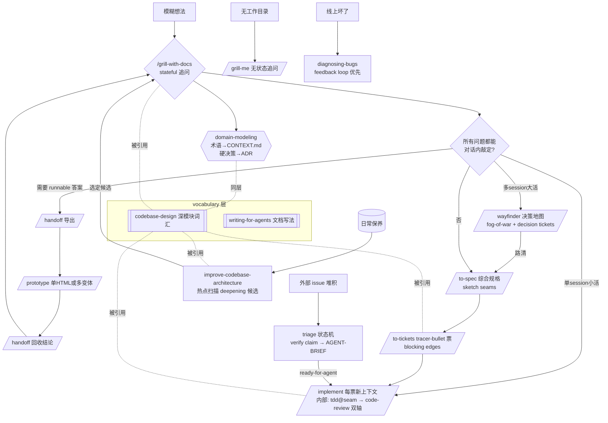

# skills 项目如何提升 AI 能力 — 深度研究报告

> 任务：T0370 | 场景：research | 分析对象：`/home/black/Documents/skills`（mattpocock/skills v1.2.3 "Skills For Real Engineers"）
> 日期：2026-08-23 | 方法：静态全量扫描 + 原文引用（`file:line`）

## 0. 执行摘要

该项目不是"提示词集合"，而是一套**以失效模式为纲的 AI 工程行为约束系统**。它把资深工程师的隐性工作纪律（先对齐再动手、测试先行、深模块设计、反馈回路优先）显式化为 36 个可被 AI 按需加载的指令模块，并用四条机制提升 AI 表现：

1. **对齐前置**：用 grilling 决策树在写码前穷尽用户决策（治"做出来的不是我想要的"）。
2. **共享语言压缩**：CONTEXT.md 术语表让 AI 少写 token、少猜语义（治冗长与歧义）。
3. **反馈回路强制**：TDD/diagnosing-bugs 把"想"变成"测"（治产出不可用代码）。
4. **设计词汇锚定**：codebase-design 的深模块词汇抑制 AI 加速的熵增（治泥球化）。

其编排哲学是"小而可改、可组合"：与 GSD/BMAD/Spec-Kit 这类接管流程的重框架相反，它刻意保持每个技能小、薄、无平台锁定（README.md:9-12）。下文按 PRD 六项验收标准逐条展开。

---

## 1. 全量清单与分类（AC-1）

### 1.1 数量统计

实测 `find skills -name SKILL.md | wc -l` = **36 个技能文件**，分布如下：

| 分类 | 数量 | 定位 | 成员 |
|------|------|------|------|
| engineering | 18 | 日常代码工程（promoted，随插件分发，含 docs 页） | ask-matt, codebase-design, code-review, diagnosing-bugs, domain-modeling, grill-with-docs, implement, improve-codebase-architecture, prototype, research, resolving-merge-conflicts, setup-matt-pocock-skills, tdd, to-spec, to-tickets, triage, wayfinder, wizard |
| productivity | 7 | 通用非代码工作流（promoted） | grilling, grill-me, handoff, teach, to-questionnaire, wait-what, writing-for-agents |
| in-progress | 7 | beta 通道，不分发 docs 页 | claude-handoff, implement-spec, loop-me, setup-ts-deep-modules, writing-beats, writing-fragments, writing-shape |
| misc | 4 | 一次性工具 | git-guardrails-claude-code, migrate-to-shoehorn, scaffold-exercises, setup-pre-commit |
| deprecated | 0 | 仅存 README 说明淘汰规则 | — |

### 1.2 调用关系图（谁调用谁）

```
                    ┌─────────────── 用户手动触发层 ───────────────┐
  on-ramp: triage   主流程: grill-me/grill-with-docs → to-spec → to-tickets → implement   on-ramp: wayfinder
       │                    │                  (handoff ⇄ prototype 支线)          │
       ▼                    ▼                                                     ▼
                    ┌─────────────── 模型自动触发纪律层 ─────────────┐
     grilling ◄──被上述全部调用      domain-modeling（与 grilling 成对）
     tdd ◄──implement               code-review ◄──implement
     research ◄──wayfinder          prototype ◄──wayfinder
                    ┌─────────────── 词汇底层（无流程，纯参考） ────────────┐
                     codebase-design（module/interface/seam/depth…）
                     writing-for-agents（如何写给 agent 读的文档）
```

调用约定（`.agents/invocation.md`）：依赖必须写成 `Call the Skill tool with "grilling"` 的显式工具调用措辞而非 `/name` 提及或跨目录链接，因为命名工具才能获得更高触发率（`.agents/invocation.md`）；需要两个技能就是两次调用（"Call the Skill tool twice, for 'grilling' and 'domain-modeling'"，见 grill-with-docs/SKILL.md:5）。**不变式**：user-invoked 技能永远不能被其他技能调用，只有人能触发（`.agents/invocation.md`）。

### 1.3 触发模型的双轨制

每个技能带两个元数据载体：Claude Code 的 frontmatter（`disable-model-invocation: true` 即仅人工触发）和 Codex 的 `agents/openai.yaml`（`policy.allow_implicit_invocation: false` 同义）。两平台必须同步标记（CHANGELOG v1.2.0 #551）。判断标准："模型能否有用地自主调用它？"——能复用才是抽成技能的理由，而不是抽取的原因（`.agents/invocation.md`）。这使编排型技能（triage/to-spec/implement）只能人来点火，纪律型技能（tdd/grilling/codebase-design）可在任务匹配时被模型自主拉起。

---

## 2. 四大失效模式 → 修复技能映射（AC-2）

README "Why These Skills Exist"（README.md:84）明确定义了四个要修的 AI 失效模式：

### 失效模式 #1：AI 没做我想要的（对齐失败）

- 原文："The most common failure mode in software development is misalignment…There is a communication gap between you and the agent."（README.md:94-96）
- 修复：grilling 追问会话 —— "getting the agent to ask you detailed questions about what you're building"（README.md:96）；入口为 grill-me（无仓库场景）与 grill-with-docs（有仓库场景，附带沉淀文档）（README.md:98-103）。
- 底层机制：grilling 把对话建模为**决策树**，以"轮次 × frontier"推进：frontier = 所有前置条件已定的当前可答问题，每轮整批询问并附推荐答案，答案重塑树形后再算下一轮 frontier（skills/productivity/grilling/SKILL.md:8,24）。退出条件是 frontier 清空、"nothing left silently assumed"（同文件 :28）。
- 提升原理：LLM 的失败多源于**过早填充未声明的假设**。批量问 frontier 迫使隐式假设显式化，且"每问必附推荐答案"把开放题降维成确认题，将用户的认知负担从"构思需求"减到"裁决选项"。

### 失效模式 #2：AI 太啰嗦（语言不对齐）

- 原文："Agents are usually dropped into a project and asked to figure out the jargon as they go. So they use 20 words where 1 will do."（README.md:111-113）
- 修复：共享语言文档 CONTEXT.md —— "a document that helps agents decode the jargon used in the project"（README.md:115），内建于 grill-with-docs（README.md:131）。
- 效果链（README.md:136-140）：命名一致 → 代码库更易导航 → **AI 思考耗 token 更少**。示例："lesson materialization cascade" 一个词替代一整段描述（README.md:122-127）。
- 执行者是 domain-modeling：挑战与词典冲突的用语（:44）、提出规范术语、用具体场景压测边界、与代码交叉验证矛盾（:56）、**当场更新 CONTEXT.md 不攒批**（:60）、ADR 三条件门槛——难逆转+无背景会惊讶+真实权衡（:66-73）。
- 补充修复 wait-what：消息没传达到位时的一句话纠正指令，用 ASD-STE100 简明英语 + CONTEXT.md 词汇重新表述。其 SKILL 全文仅三行——"Concision skills fail by growing"（CHANGELOG v1.2.0 #751）：简洁指令自身膨胀就会失效，所以只留一个精准引导词。

### 失效模式 #3：代码跑不起来（缺反馈回路）

- 原文引 Pragmatic Programmer："Always take small, deliberate steps. The rate of feedback is your speed limit."（README.md:144-146）；"Without feedback on how the code it produces actually runs, the agent will be flying blind."（README.md:148-150）
- 修复 a：tdd 红-绿循环（README.md:152-156）。关键约束是"只在预先约定的 seam 上测试"——写任何测试前先列出受测 seam 并与用户确认，未经确认的 seam 不写测试（skills/engineering/tdd/SKILL.md:22）。反模式三条：实现耦合测试、同义反复断言、水平切片（:24-28）。
- 修复 b：diagnosing-bugs 诊断循环。"Build a feedback loop. **This is the skill.** Everything else is mechanical."——有了对本 bug 变红的一次命令通过信号，二分/假设/插桩都只是消费它；没有它，盯着代码看多少都没用（skills/engineering/diagnosing-bugs/SKILL.md:18-20）。给出 10 种回路构造法（失败测试/curl/CLI 快照对比/无头浏览器/trace 重放/一次性 harness/property fuzz/bisect harness/差分/HITL bash），并要求"把回路当产品打磨"：更快、更锐、更确定（:52-58）。v1.2.3 增加 Redact 先行节防密钥泄漏（CHANGELOG #779）。
- 提升原理：LLM 生成代码的错误率无法靠"更努力地想"降低，只能靠**提高反馈频率与锐度**。seam 预约定则解决的是测试精力分配问题——落在关键路径而非每个边缘。

### 失效模式 #4：我们造了个泥球（熵增速化）

- 原文引 Kent Beck "Invest in the design of the system every day" 与 Ousterhout "The best modules are deep"（README.md:162-166）；"agents can radically speed up coding, they also accelerate software entropy"（README.md:170）。
- 修复：codebase-design 提供**强制词汇表** module/interface/implementation/depth/seam/adapter/leverage/locality，禁用 component/service/API/boundary 等松散替身（skills/engineering/codebase-design/SKILL.md:10-28）；深浅模块对照图（:30-44）；四原则含"删除测试"——想象删掉该模块：复杂度消失则是透传，在 N 个调用点重现则它在挣饭吃（:63）；"一个 adapter 意味着假想的 seam，两个才是真的"（docs/engineering/codebase-design.md）。
- 配套 survey：improve-codebase-architecture 按"近 20 条提交热点"聚焦扫描 deepening 候选——"没人动的代码里的深化机会是永远不会兑现的重构"（CHANGELOG v1.2.0 #533，YAGNI scoping filter）；to-spec 在规格期就 sketch seams 且"越少越好，理想是一条"（to-spec/SKILL.md:15）。
- 提升原理：AI 写码速度放大一切既有倾向，包括混乱。唯一对策是把"每天投资设计"变成 AI 可执行的检查动作，而**统一词汇本身即是约束**——当审查输出只能说"shallow interface / wrong seam location"时，模糊的"重构一下"就没有生存空间。

---

## 3. 核心技能机制拆解（AC-3）

以下 14 个技能按"输入 → 处理 → 输出 → 对 AI 的提升点"拆解（超过 PRD 要求的 8 个）：

### 3.1 grilling（interview 原语，28 行）

- 输入：一个计划/设计/想法。
- 处理：决策树建模 → 每轮计算 frontier → 整批提问附推荐 → 答案重塑树 → 重算。规则：事实自查不问人（派子代理查文件系统/工具），只问用户才能做的权衡决策（productivity/grilling/SKILL.md:26）。
- 输出：共享理解 + 用户确认；禁止在确认前行动（:28）。
- 提升点：把"猜需求"替换为"收敛决策树"；推荐答案机制让用户只需 yes/no+修正；事实/决策二分防止 AI 浪费用户注意力。

### 3.2 grill-me / grill-with-docs（组合器，7 行 / 3 行）

- 输入：同 grilling。处理：一行指令——调用 Skill tool with "grilling"；后者再加调 "domain-modeling"（engineering/grill-with-docs/SKILL.md:5）。
- 输出：前者无状态，后者落盘 CONTEXT.md + ADR。
- 提升点：示范了**薄组合器模式**——原语保持单一，场景差异用几行的包装表达。维护面极小，语义零漂移。

### 3.3 domain-modeling（主动建模纪律，74 行）

- 输入：会话中出现的领域用语。
- 处理：词典挑战 → 场景压测 → 代码交叉验证 → inline 更新 CONTEXT.md → ADR 三条件裁决（engineering/domain-modeling/SKILL.md:44-73）。CONTEXT.md 明确"只是词汇表，不是 spec/草稿本"（:60 附近约束）。
- 输出：持续精化的 CONTEXT.md + 稀少的 ADR。
- 提升点：术语歧义是 LLM 幻觉的高发源；"当场落盘"利用会话热上下文，避免事后补写失真。

### 3.4 codebase-design（设计词汇参考，114 行）

- 输入：模块设计/重构议题。
- 处理：无流程——纯参考（docs/engineering/codebase-design.md 开篇声明 "It is a reference, not a process"）；提供词汇表+深浅对照+四原则；DESIGN-IT-TWICE.md 支持并行子代理出 3+ 个根本不同的接口方案。
- 输出：设计对话中的统一措辞。
- 提升点：给模型一个**不可协商的术语集**，使设计批评变得可操作。已知坑（issue #449）：无停止规则的参考型技能会被 agent 当流程跑烧掉 100k token——workaround 是挂在 driver 技能之下（同 docs 页）。这条教训对 PDCA 直接适用：**参考型资产必须有明确的挂载点**。

### 3.5 tdd（测试纪律，38 行）

- 输入：要实现的特性/修复 + 预约定 seam。
- 处理：红→绿循环；垂直切片（一测一实现一重复），每片是响应上一循环教训的 tracer bullet；重构不属于循环、属于 review 阶段。
- 输出：存活于重构之外的行为测试。
- 提升点：三条反模式直指 LLM 测试坏味道高发区——mock 内部协作者/断言自算期望值/先写全部测试再写全部实现。期望值必须来自独立真理源（known-good 字面量、手算样例、spec）。

### 3.6 diagnosing-bugs（诊断循环，138 行，最长）

- 输入：难缠 bug / 性能回归。
- 处理：Phase 1 构造 tight feedback loop（10 法）→ tighten（更快/更锐/更确定）→ 非确定性 bug 提升 reproducing rate 至可调试 → 无回路则停下向用户要环境/脱敏工件/生产插桩许可。后续阶段才允许假设与修复。密钥一律 `<REDACTED>` 先行。
- 输出：回归测试 + 根因 + 修复。
- 提升点：把 debugging 从"直觉艺术"转为"回路消费"。"Be aggressive. Be creative. Refuse to give up."（:22 附近）针对 LLM 遇阻即放弃的倾向给出显式韧性指令。

### 3.7 code-review（双轴审查，87 行）

- 输入：HEAD 与固定点的 diff + spec 来源 + 标准 来源。
- 处理：钉住固定点并预验 ref 有效（:23）→ **两条并行子代理**分别审 Standards（仓库标准+Fowler 坏味基线 12 条，repo 标准覆盖基线，坏味永远是 judgement call）与 Spec（缺失/范围蔓延/疑似错实现，逐条引 spec 原文）→ 聚合时**禁止合并或重排**两轴发现（:76）。
- 输出：并排双报告 + 每轴各自的最差问题。
- 提升点：并行子代理**互不污染上下文**；双轴分离因为"合规但做错事"和"做对事但不合规范"都会发生，合并评分会让一轴掩盖另一轴（Why two axes，:80-88）。

### 3.8 research（调研委派，12 行）

- 输入：一个问题。处理：后台子代理执行；只查 primary sources（官方文档/源码/spec/第一方 API），"Follow every claim back to the source that owns it"（engineering/research/SKILL.md:10）；产出单 Markdown 并逐条注引（:11）。
- 提升点：主会话不被阅读阻塞（:6）；一手来源规则直接压制 LLM 引用二手转述时的失真累积。

### 3.9 prototype（一次性原型回答设计问题，26 行）

- 输入："这个状态模型/逻辑感觉对吗""UI 该长什么样"类问题。
- 处理：逻辑问题产单个自包含 HTML（无构建无服务器，非开发者可双击打开）；UI 问题产一条路由可切换的多个根本不同变体。**弃用≠删除**：完成后折叠有效决策进真代码，原型提交到 `prototype/<name>` 游离分支作为 primary source，并在实现 issue 留上下文指针（engineering/prototype/SKILL.md:26）。
- 提升点：把"纸上争论"换成"可运行证据"；分支留证让探索历史可回溯而不污染主线。

### 3.10 wayfinder（超大会话决策地图，128 行）

- 输入：大于单 session 容量的迷雾需求。
- 处理：定 destination（先 grill）→ 广度优先 grill 出 frontier → 建 map issue + 子 decision ticket（native blocking 边）→ fog of war 记录"还说不尖锐的问题"不强行切票（:86-91）→ 每 session 只解一张票：claim→resolve→记录 resolution comment→close→地图 Decisions-so-far 追加指针→雾毕业成新票。research 票例外：charting 时立即并行发 research 子代理烧掉（CHANGELOG v1.2.0 #763）。
- 输出：**决策而非交付物**——"Plan, don't do"（:11）；路清后交接给 to-spec 收敛成可建计划。
- 提升点：fog-or-ticket 判据（能否现在精确陈述问题）防止过度规划；HITL 票禁止 agent 代答用户侧（"a grilling agent that answers its own questions has broken this"，:75 附近）。

### 3.11 to-spec（会话→规格合成，75 行)

- 输入：已对齐的会话上下文。处理：明确**不再采访**，只综合（frontmatter description）；先 sketch seams 并与用户确认（:15）；模板含 Problem/Solution/长编号 User Stories/Implementation Decisions/**禁写文件路径与代码片段**（会过时）——例外：若原型产出比散文更精确的决策编码（状态机/reducer/schema），可内联并注明来源。
- 提升点：durability over precision——规格里不写易腐细节，延长产物寿命。

### 3.12 to-tickets（规格→tracer-bullet 票集，105 行）

- 输入：spec 或计划。处理：垂直切片规则——每片窄而完整地穿过所有层、独立可演示、**单片适配单个新鲜上下文窗口**（vertical-slice-rules，:29-36）；每票声明 blocking edges（:38）；宽重构例外走 expand–contract 序列保 CI 绿（:40)；发布前 quiz 用户粒度与边正确性；本地 tracker 一票一文件。
- 提升点："fit in one fresh context window" 把上下文极限当作一等设计约束；frontier 工作法（blockers 全完成即可抓取）天然支持并行 implement。

### 3.13 triage（issue 状态机分诊，112 行）

- 输入：原始 issue/外部 PR（"a PR is an issue with attached code"）。
- 处理：gather context（解析既往 triage notes 防重问；按**领域概念**而非请求措辞搜已有实现= redundancy 检查；读 `.out-of-scope/` 做 prior rejection surfacing）（:70）→ 推荐 category+state → **grilling 之前先 verify the claim**（bug 复现/PR checkout 跑测试；确认过的 claim 造就更强的 agent brief）（:74）→ 按结果落地：ready-for-agent 发 AGENT-BRIEF；wontfix 分"已实现"（指向位置，禁写 out-of-scope 防污染 dedup）与"拒绝"（enhancement 才写 out-of-scope KB）。
- 提升点：claim 验证前置把"听信描述"改为"实证复核"；out-of-scope 概念级聚合让重复请求在分诊早期就被拦截。

### 3.14 implement（薄执行编排，15 行）

- 输入：spec 或 tickets。处理：尽量用 tdd 于预约定 seam；定期 typecheck/单测文件，最后全量一次；完成后 code-review；提交当前分支。
- 提升点：自身几乎无逻辑，全部纪律外包给 tdd/code-review——再次示范组合器哲学。in-progress/implement-spec 则展示多子代理并发实现形态：task graph frontier 驱动 implementer 子代理（各自 worktree/branch）+ merger 子代理汇流（in-progress/implement-spec/SKILL.md）。

---

## 4. 主流程端到端推演（AC-4）

### 4.1 Mermaid 流程图



### 4.2 文字推演（一次典型旅程）

1. **对齐段**（同一不间断上下文窗口内完成）：用户抛出想法 → grill-with-docs 启动，与 domain-modeling 成对运行；每轮 frontier 批量问答，术语当场进 CONTEXT.md，难逆决策进 ADR。
2. **原型支线**（可选）：遇到"说不清但要看得见"的问题 → handoff 导出到新 session → prototype 产单 HTML → 用户把玩 → handoff 回收 verdict → 原型上 `prototype/<name>` 分支留证。
3. **规格段**：to-spec 不再采访，直接综合；先 sketch seams（理想一条）确认；产出规格发布到 issue tracker 打 ready-for-agent 标签。
4. **拆解段**：to-tickets 切 tracer-bullet 票 + blocking 边，quiz 用户后发布。
5. **实现段**（每票全新上下文）：implement 驱动 tdd 在预约定 seam 上红绿循环 → 完成后 code-review 双轴并行子代理审查 → 合规才提交。
6. **上下文卫生贯穿全程**：smart zone（~150k token 推理锐度边界）之前不 compact/clear，直到 to-tickets 完成（ask-matt/SKILL.md:28-32）；phase boundary 五选项决策树（continue/clear/handoff/subagent/compact，PHASE-BOUNDARIES.md）。
7. **双 on-ramp 汇入**：triage 产出的 agent-ready brief 与 wayfinder 收敛的决策地图都在 to-spec/implement 处并入主流程；diagnosing-bugs 的 post-mortem 若发现"没有好 seam 锁住这个 bug"则移交 improve-codebase-architecture。

---

## 5. 提升机制的横向归纳（为什么会生效）

| 机制 | 实现手段 | 对应 AI 弱点 |
|------|---------|-------------|
| 隐性知识显式化 | 36 个 SKILL.md 把专家纪律写成可加载指令 | 参数化知识泛化、缺项目特定纪律 |
| 行为空间收窄 | 状态机（triage roles）、循环规则（tdd）、门禁（claim 验证） | 自由发挥导致的漂移 |
| 上下文工程 | 共享语言压缩 token、最小相关加载、context pointers 而非复制 | 上下文窗口有限、噪声敏感 |
| 人机决策分界 | facts=agent 自查 / decisions=user 裁决；HITL 票禁代答 | 越权代答、浪费用户注意力 |
| 反馈优先 | TDD、feedback loop 10 法、verify the claim | 无实证的自信推理 |
| 隔离防污染 | 双轴并行子代理、background research、per-ticket 新窗口 | 上下文串扰、注意力稀释 |
| 组合器架构 | 薄封装（grill-with-docs 3 行）+ 单一原语（grilling） | 重复指令语义漂移、维护爆炸 |
| 双负载触发 | frontmatter 描述面向模型触发 / README 面向人类路由 | 技能发现率低 |

值得强调的两个反直觉设计：
- **简洁技能不许长大**：wait-what 只有 3 行，理由是"简洁技能因增长而失效"（CHANGELOG #751）。
- **参考型技能必须挂载在 driver 之下**：codebase-design 被 agent 当流程乱跑的事故（issue #449）催生了"词汇层/流程层"分离纪律。

---

## 6. 可迁移原则与 pdca-workflow 落地建议（AC-5）

以下 7 条原则超出 5 条底线，均标注落地路径：

### P1 决策树批量追问（frontier + 推荐答案）
- 原则：每轮把当前可答的全部决策一次性问完且每问带推荐，事实自查、决策归用户。
- pdca 现状：flow-plan P2 已引入 grilling 且 clarifications.jsonl 记录 round。
- 落地建议：**Check 阶段写 conclusion.md 前增加一轮 Do→Check viewpoints 的 frontier 追问**（grilling SKILL 已内置该 viewpoint 清单，但 flow-check 未强制调用）；把"每问必附推荐"写入 register-evidence 的验收映射生成逻辑。

### P2 共享语言即压缩
- 原则：模糊术语当场落定进 CONTEXT.md，一词替换一段描述，token 与歧义双降。
- pdca 现状：pdca/CONTEXT.md 已存在且由 domain-modeling 维护，但近期新增条目集中在 CDM 报表中心域，工程通用词（如"握手""帧"）定义良好。
- 落地建议：对 rpc/tls 高频任务族建立**子域术语块**（类似 CONTEXT-MAP 多上下文方案）；grilling 中命中新术语时强制即时更新（目前依赖自觉，可加 gate 提示）。

### P3 反馈回路优先于推理
- 原则：先构造对本问题变红的一命令信号，再允许假设/修复；把回路当产品打磨（更快/更锐/更确定）。
- pdca 现状：development/bugfix 走 TDD + 声明测试接缝（ADR-0018），已是同类思想。
- 落地建议：**research 场景补"可验证信号"要求**——调研结论须附至少一条可复核的验证途径（命令、SQL、可复现实验），否则不得登记 evidence；这与 triage-work 的边界判定规则（T0273）呼应。

### P4 事实代理化、决策人主化
- 原则：凡文件系统/工具可查的事实绝不问用户；凡权衡取舍绝不替用户决定。
- pdca 现状：门禁体系已强制 final_confirmation/check_confirmation 人审。
- 落地建议：在 flow-do 执行器容错节补充显式二分清单（哪些异常属 Blocking 需人裁、哪些可自动跳过），减少主会话临场判断。

### P5 双轴分离审查
- 周则：标准轴与规范轴并行独立、聚合时不重排，防一轴掩盖另一轴。
- pdca 现状：skills/code-review 已移植双轴（SKILLS-INDEX 第 18 行）。
- 落地建议：补齐 Fowler 坏味基线的"repo overrides"规则说明（当前版本未明确 repo 标准覆盖基线的优先级条款）。

### P6 原型作为一手证据留存
- 原则：弃用原型不上 main，但以游离分支+上下文指针形式永久可溯。
- pdca 现状：skills/prototype 存在，但 evidence 登记惯例未包含原型分支指针。
- 落地建议：register-evidence 增加 evidence kind `prototype-branch`，字段含分支名与 verdict 摘要；A1 步骤的原型产物按此登记。

### P7 上下文卫生与阶段边界
- 原则：smart zone 内不 compact；阶段边界才选择 continue/clear/handoff/subagent/compact 五选项。
- pdca 现状：handoff/write-journal 技能在，但无"何时清窗"的操作指引。
- 落地建议：flow-do 通用收尾处加一段 phase-boundary 决策树（五选项顺序与理由可直接翻译自 PHASE-BOUNDARIES.md），并把"每子任务新窗口"写入 P4 拆解后的调度约定。

### 附：结构性差异观察（供 Act 阶段知识处置）
- mattpocock/skills **轻流程重纪律**：状态外置 issue tracker，无 schema 校验；pdca-workflow **重流程强门禁**：records/evidence/receipt 内聚。两者互补——pdca 可借鉴其"薄组合器+词汇层"控制技能体积，其可借鉴 pdca 的"内容预算+确定性夹具"控制技能质量。
- 该项目的失效模式驱动开发法（先列失效再设计技能，README.md:84）与 pdca 的 Flow Issue Occurrence→Improvement Candidate 机制同构，可互相印证。

---

## 7. 引用文件清单

| 文件 | 用途 |
|------|------|
| README.md:84-232 | 四大失效模式原文、技能双轨分类 |
| skills/productivity/grilling/SKILL.md:8,24,26,28 | frontier/rounds/事实决策二分 |
| skills/engineering/domain-modeling/SKILL.md:44-73 | 建模纪律五步 |
| skills/engineering/codebase-design/SKILL.md:10-63 | 强制词汇表/深浅/删除测试 |
| docs/engineering/codebase-design.md | reference-not-process、issue #449/#458/#95 |
| skills/engineering/tdd/SKILL.md:22-38 | pre-agreed seams、反模式、循环规则 |
| skills/engineering/diagnosing-bugs/SKILL.md:18-58 | feedback loop 本体论 |
| skills/engineering/code-review/SKILL.md:11,23,76-88 | 双轴并行、不重排 |
| skills/engineering/research/SKILL.md:6-11 | 一手来源、后台代理 |
| skills/engineering/prototype/SKILL.md:26 | 原型留证分支 |
| skills/engineering/wayfinder/SKILL.md:7-99 | decision ticket、fog of war、frontier |
| skills/engineering/to-spec/SKILL.md:15 | seam sketching |
| skills/engineering/to-tickets/SKILL.md:29-40 | 垂直切片、expand–contract |
| skills/engineering/triage/SKILL.md:70-74 | claim 验证前置、dedup |
| skills/engineering/ask-matt/SKILL.md:28-32 | smart zone/context hygiene |
| .agents/invocation.md | Skill tool 调用约定、双轨不变式 |
| CHANGELOG.md (#551,#533,#751,#763,#779) | 设计演化证据 |
