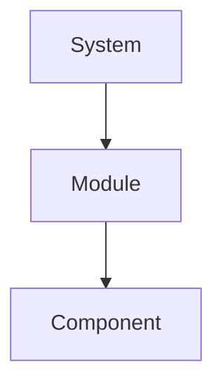
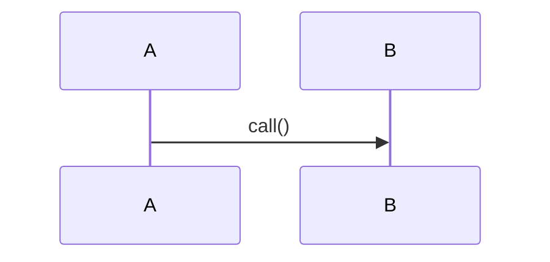
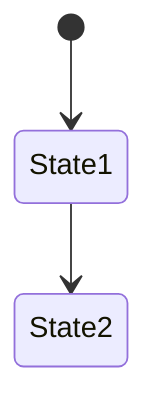
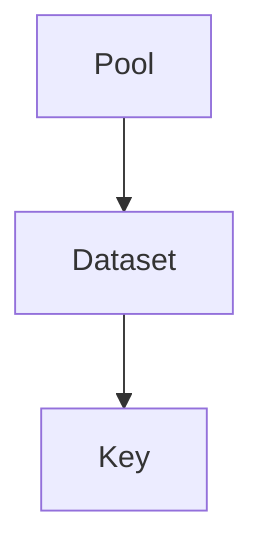
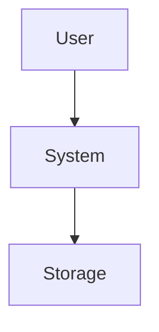

# Research Report — 通用模板（多图 mermaid，架构师为主）

> 方法论：`ontology/pattern/research-diagram-methodology.md` — 所有 `research` 必含多图 `mermaid` inline，每图附 `Source:` primary source引证（源码行/官方doc）

## 调研目标

## 方法

- Primary sources：

## 发现

### 架构图 C4 L2（mermaid）

*Source: `file:line` + `doc URL`*

### 逻辑图 时序/流程（mermaid）

*Source: `file:line`*

### 生命周期图 状态机（mermaid）

*Source: `file:line`*

### 数据流图（可选 mermaid）

*Source: `file:line`*

### 部署图（可选 mermaid）

*Source: `file:line`*

### C4 L1 上下文（可选 mermaid）

*Source: `file:line`*

## 结论与建议

## 术语表

## 参考资料

- Primary sources 列表（每图1条可复核）
