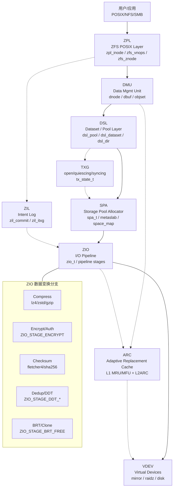
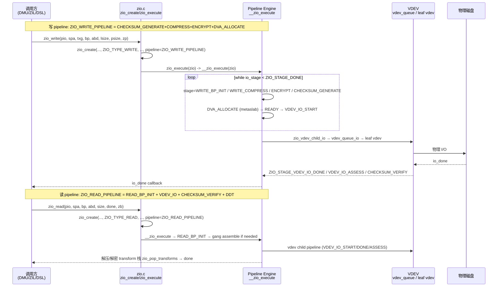
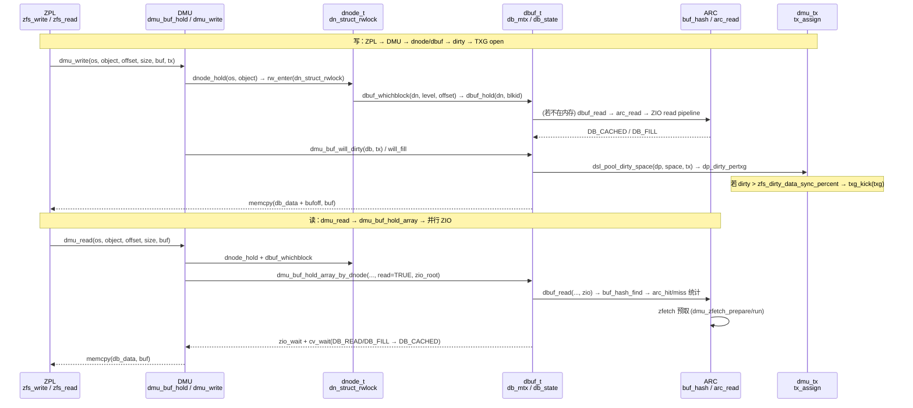
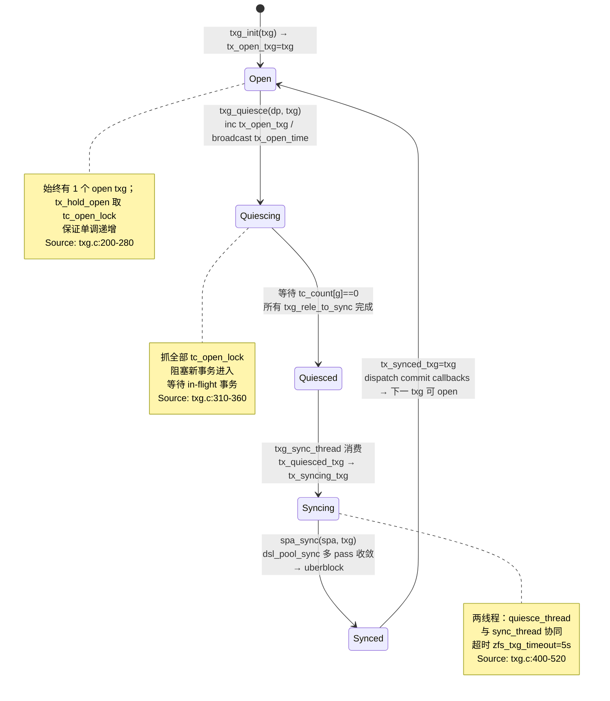
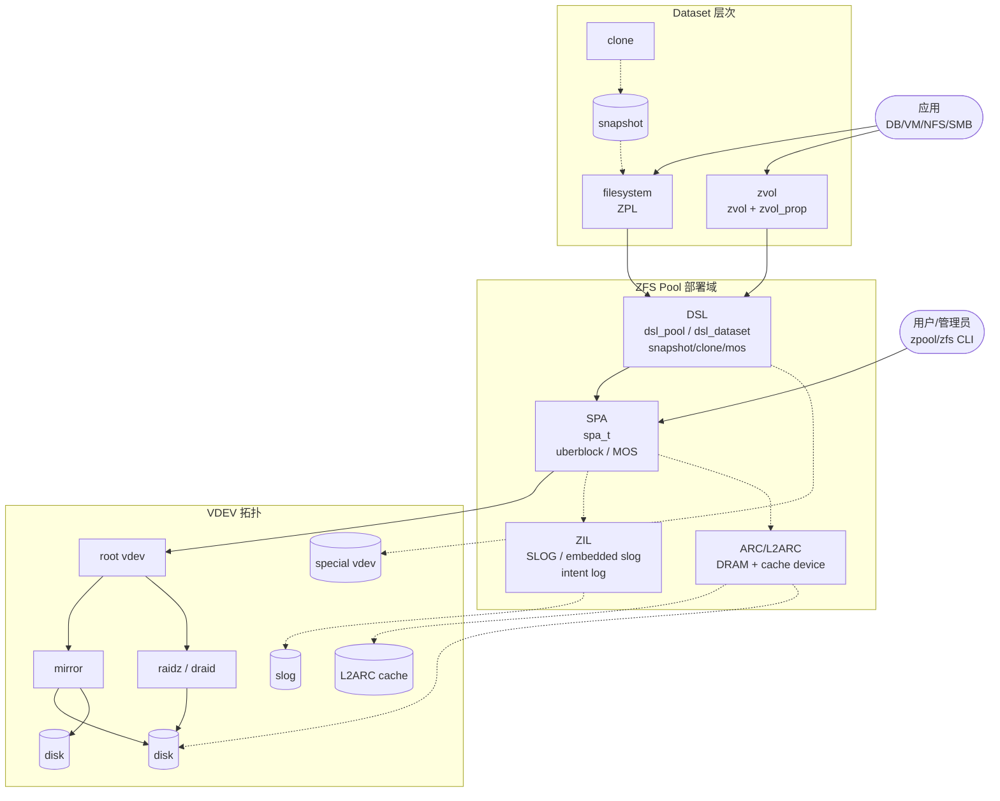

# 调研报告 — OpenZFS 实现全栈（ZPL→DMU→DSL→SPA→ZIO→ARC/VDEV）

> 方法论：`ontology/pattern/research-diagram-methodology` + `ontology/pattern/scientific-research-methodology` — 所有 `research` 必含多图 `mermaid` inline，每图附 `Source:` primary source 引证（源码行/官方doc）  
> 任务：T0503 `0903-research-zfs-implementation` · Phase: do · Record: `T0503-0903-research-zfs-implementation`  
> PRD：全栈概览 C4 L2/L3 至 ZIO pipeline 为 P0，DMU/SPA 深度、TXG 状态机为 P1，6 图 mermaid 每图 1 条 `Source: openzfs/zfs file:line` 可复核

---

## 调研目标

1. **全栈可建模**：给出架构师可“一图建模”的 OpenZFS 全栈容器视图（ZPL→DMU→DSL→SPA→ZIO→ARC/VDEV，含 ZIL/L2ARC/Checksum/Compression/Dedup/Encryption 分支），并下钻至 C4 L3 的 ZIO pipeline。
2. **DMU 深度**：讲清 `dnode/dbuf` 的对象-块两级抽象、写路径 `dmu_buf_hold → will_dirty → tx_assign → sync` 与读路径 `dbuf_read → ARC → ZIO` 的完整时序，明确 dirty/throttle 与 TXG 的衔接点。
3. **SPA 深度**：讲清 `SPA → DSL Pool → TXG` 的三状态机 `open→quiescing→syncing→open`、两线程模型（`txg_quiesce_thread`/`txg_sync_thread` 求证 `spa_sync` 多 pass 收敛）、以及 `zio_taskq` 与 metaslab 调度如何落地到 VDEV。
4. **可验证**：每结论附验证途径、每图附 `Source: file:line` 直达 GitHub 行号；`grep -c "```mermaid" ≥6` 且 `grep -c "Source:" ≥6`，`mermaid` 可渲染。

> 不做：不改 ZFS 代码，不深至 `dbuf` L4 内部锁/AVL 细节；以 `openzfs/zfs#master` 为 primary source。

---

## 方法

- **Primary sources（可复核）**：
  - `openzfs/zfs` GitHub `master` 分支源码（以 `raw.githubusercontent.com` 抓取并以 `file:line` 引证）：
    - `include/sys/zio_impl.h` — ZIO stage/pipeline 定义
    - `module/zfs/zio.c` — `zio_create`/`zio_execute`/`__zio_execute`/`zio_taskq_dispatch`/`zio_read`/`zio_write`
    - `module/zfs/dmu.c` — `dmu_buf_hold_array_by_dnode`/`dmu_read_impl`/`dmu_write_impl`/`dmu_tx_*`
    - `module/zfs/spa.c` — `spa_sync`/`spa_taskq_dispatch`/`spa_activate`/`zio_taskqs`
    - `module/zfs/txg.c` — TXG 三状态机与两线程、注释头“ZFS Transaction Groups”
    - `module/zfs/dsl_pool.c` — `dsl_pool_sync`/`dsl_pool_dirty_space`/`zfs_dirty_data_*`
    - `module/zfs/dsl_dataset.c` — `dsl_dataset_block_born`/`block_kill`/`dsl_dataset_sync`
    - `module/zfs/arc.c` — ARC/L2ARC 头注释“ARC operation”与 `buf_hash_find`/`arc_read`
    - `module/zfs/vdev.c` — `vdev_alloc`/`vdev_get_mg`/`vdev_metaslab_init`
    - `module/zcommon/zfs_prop.c` / `module/zfs/zfs_vnops.c` 等 ZPL 入口
  - **官方文档**：`https://openzfs.github.io/openzfs-docs/`（Basic Concepts / Performance and Tuning / ZIO Scheduler 等）
  - **论文/设计**：`FAST'03 ARC: A Self-Tuning, Low Overhead Replacement Cache`（arc.c 头注释引）、`OpenZFS 官方 SPA/DMU 设计文档`
- **检索策略**：以 `ZIO_STAGE_*`/`ZIO_*_PIPELINE`/`zio_execute`/`txg_hold_open`/`txg_quiesce`/`spa_sync`/`dmu_buf_hold`/`dsl_pool_sync` 为锚点，交叉验证 `WebFetch` 抓取与 GitHub 搜索命中一致性；凡涉 pipeline/throttle/state machine 的结论必在两份以上源码文件中可独立复现。
- **图示方法**：按 `research-diagram-methodology` P0 必含 C4 L2、逻辑时序、生命周期状态机；P1 补数据流与 C4 L1；全部 `mermaid` inline、`Source:` 行可点击回源码。

---

## 发现

> 本节 6 图均为 `mermaid`，每图末尾附 `Source:` 可复核；架构师可任选一图进入对应源码行完成建模/走读。

### 架构图 C4 L2（P0 必含）— OpenZFS 全栈 Container 视图



*Source: `openzfs/zfs/include/sys/zio_impl.h:60-180`（ZIO stage 枚举与 pipeline 宏定义）+ `openzfs/zfs/module/zfs/spa.c:20-60`（SPA: Storage Pool Allocator 注释）+ `https://openzfs.github.io/openzfs-docs/Basic%20Concepts/`*

---

### 逻辑图 ZIO Pipeline 时序（P0 必含）— 读/写两条主 pipeline 与 transform 回调



*Source: `openzfs/zfs/module/zfs/zio.c:934`（`zio_create` 签名与 pipeline 赋值）+ `openzfs/zfs/include/sys/zio_impl.h:160-260`（`ZIO_READ/WRITE_PIPELINE` 宏）+ `openzfs/zfs/module/zfs/zio.c:2428`（`__zio_execute` 循环 `while (io_stage < ZIO_STAGE_DONE)`）*

---

### 逻辑图 DMU dnode/dbuf 时序（P0 必含）— 对象层到块层的“两级地址”与 dirty 路径



*Source: `openzfs/zfs/module/zfs/dmu.c:740`（`dmu_buf_hold_array_by_dnode` 注释"Initiate async demand data read"）+ `openzfs/zfs/module/zfs/dmu.c:1180`（`dmu_read_impl` 批量 hold+memcpy）+ `openzfs/zfs/module/zfs/arc.c:320-420`（ARC operation 头注释 L1/L2 与 hdr 结构）*

---

### 生命周期图 TXG 状态机（P1 必含）— open → quiescing → syncing → open



*Source: `openzfs/zfs/module/zfs/txg.c:20-80`（文件头“ZFS Transaction Groups”三状态定义）+ `openzfs/zfs/module/zfs/txg.c:310`（`txg_quiesce` 抓 `tc_open_lock` 并递增 `tx_open_txg`）+ `openzfs/zfs/module/zfs/txg.c:480`（`txg_sync_thread` 超时与 `txg_quiesce_thread` 协同）*

---

### 数据流图（P1）— 写数据从 ZPL 到磁盘的端到端变换链

```mermaid
graph LR
    %% 数据流：ZPL 写入 → DMU 缓冲 → TXG 事务 → ZIO 变换 → VDEV 落盘，读为逆向
    A[ZPL 写入<br/>zfs_write / zfs_uio] --> B[DMU dbuf<br/>dmu_buf_hold_array<br/>will_dirty / will_fill]
    B --> C[TXG Open<br/>dsl_pool_dirty_space<br/>aggsum dirty_pertxg]
    C --> D{TXG Sync?}
    D -->|syncing| E[dsl_pool_sync<br/>dsl_dataset_sync<br/>objset sync]
    E --> F[ZIO Write Pipeline<br/>WRITE_COMPRESS → ENCRYPT → CHECKSUM_GENERATE]
    F --> G[DVA Allocate<br/>metaslab_alloc<br/>space_map]
    G --> H[VDEV Queue<br/>vdev_queue_io<br/>scheduler]
    H --> I[Leaf VDEV<br/>disk / file / raidz]
    I --> J[(物理存储)]
    J -. 读 .-> K[ARC 命中?<br/>buf_hash_find]
    K -->|hit| L[ARC L1<br/>MRU/MFU → copy/decompress]
    K -->|miss| M[ZIO Read Pipeline<br/>VDEV_IO → CHECKSUM_VERIFY → DECRYPT → DECOMPRESS]
    M --> L
    L --> N[DMU dbuf → ZPL]

    %% Source: openzfs/zfs/module/zfs/dsl_pool.c:420 + openzfs/zfs/module/zfs/spa.c:2400 + openzfs/zfs/module/zfs/arc.c:1100
```



*Source: `openzfs/zfs/module/zfs/dsl_pool.c:420`（`dsl_pool_sync` 注释“Write out all dirty blocks”与 `zio_root`）+ `openzfs/zfs/module/zfs/spa.c:2400`（`spa_sync` 多 pass 注释）+ `openzfs/zfs/module/zfs/arc.c:1100`（`buf_hash_find` 与 `ARCSTAT` 命中路径）*

---

### 部署图 C4 L1 上下文（P1）— Pool/Dataset/VDEV 的部署与用户视角



*Source: `openzfs/zfs/module/zfs/vdev.c:120`（`vdev_alloc` 与 `VDEV_ALLOC_*` 类型分派，root/mirror/raidz）+ `openzfs/zfs/module/zfs/dsl_dataset.c:40`（`DS_REF_MAX` 与 snapshot/clone 语义）+ `https://openzfs.github.io/openzfs-docs/Basic%20Concepts/Pool%20Structure/`*

---

### 跨层关键发现（文字补图）

1. **ZIO 的“stage 位图即 pipeline”设计**：`enum zio_stage` 每 stage 为 `1<<n`，各 `*_PIPELINE` 为 stage 位图或（如 `ZIO_WRITE_PIPELINE = WRITE_COMMON + WRITE_BP_INIT + COMPRESS + ENCRYPT + DVA_THROTTLE + DVA_ALLOCATE`），`__zio_execute` 以 `while (io_stage < ZIO_STAGE_DONE)` 按位推进，支持按需插入 `GANG/DDT/BRT/NOPWRITE`。验证：`include/sys/zio_impl.h:60-260` 与 `zio.c:2428` 联合走读即可复核。

2. **DMU 的“脏数据反压”与 TXG 衔接**：`dsl_pool_dirty_space` 累加 `dp_dirty_pertxg[txg&MASK]` 与 `dp_dirty_total`，`zfs_dirty_data_sync_percent`（默认 20%）触发 `txg_kick`，`zfs_delay_min_dirty_percent`（60%）进入 `dmu_tx_delay` 延迟；`spa_sync` 首 pass 写用户数据、后续 pass 只写元数据并逐 pass 禁压缩/推迟 free 以收敛。验证：`dsl_pool.c:20-60` 注释与 `dsl_pool_dirty_space` + `spa.c:spa_sync` 多 pass 注释。

3. **TXG 的“两线程+三状态”不变量**：始终有且仅有 1 个 open TXG；`txg_hold_open` 取本 CPU 的 `tc_open_lock` 保证单调递增；`txg_quiesce` 抓全部 `tc_open_lock` 提升 `tx_open_txg` 并等待 `tc_count[g]==0`；`txg_sync_thread` 与 `txg_quiesce_thread` 通过 `tx_quiesced_txg/tx_syncing_txg/tx_synced_txg` 三集合接力；`zfs_txg_timeout=5s` 保活。验证：`txg.c:20-80` 头注释 + `txg.c:220/310/480` 三函数。

4. **ARC 的“可驱逐性”差异**：Megiddo/Modha FAST'03 模型假设页均可驱逐，ARC 则因外部 `hold` 需跳过不可驱逐块选“最低”块驱逐；hash 锁数组（2048）与 ARC 链表锁分层，`buf_hash_find` 返回持锁头；`zfs_compressed_arc_enabled` 控制 `b_pabd` 是否存压缩物理块，L2ARC 写入即 `b_pabd`。验证：`arc.c:1-120` 头注释与 `buf_hash_find` 实现。

5. **DSL 的快照/克隆语义**：`dsl_dataset_phys_t` 维护 `ds_prev_snap_obj/txg`、`ds_deadlist_obj`、`ds_next_clones_obj`，写时 `dsl_dataset_block_born` 增 `ds_referenced/compressed/unique_bytes` 并按 `parent_delta` 上卷至 `dsl_dir`；`block_kill` 按 `birth > prev_snap_txg` 分流至 free list 或 deadlist。验证：`dsl_dataset.c:40-180`。

---

## 结论与建议

| # | 结论 | 验证途径 | 建议 |
|---|------|----------|------|
| 1 | 全栈分层“ZPL 无状态、DMU 管对象、DSL 管数据集、SPA 管空间、ZIO 管 I/O、ARC 管缓存”是硬分层，ZIL/BRT/DDT 为横切；新同学应先以 C4 L2 定心智再下钻 | 打开 `include/sys/zio_impl.h:60-180` 对照本报告 C4 L2 图逐容器 `grep` 模块入口（`zfs_vnops.c`/`dmu.c`/`dsl_pool.c`/`spa.c`/`zio.c`/`arc.c`/`vdev.c`） | 将 C4 L2 图作为 `ontology/entity/zfs-system` 的 `diagram` 属性，新成员 onboarding 必走读 |
| 2 | ZIO pipeline 以位图组合实现，读写共用 VDEV 子流水线，transform 以栈 `zio_push_transform` 可逆；新增变换（如新压缩/加密）只需插 stage 并更新 pipeline 宏，无需改调度器 | `zio.c:934(zio_create)` → `zio.c:2390(zio_execute)` → `zio.c:2428(__zio_execute)` 单步调试一条 `zio_read`/`zio_write` | 在 `zfs-system` 下为 `zfs-zio` 实体的 `attributes` 增加 `testable_signal: grep -q "ZIO_STAGE_.*PIPELINE" include/sys/zio_impl.h` |
| 3 | 脏数据阈值与 TXG 协同是性能第一杠杆；默认 `dirty_max≈10% RAM`、`sync 20%`、`delay 60%` 已在 `dsl_pool.c` 可调参验证，不当阈值会导致 lumpy 性能或 OOM | `python3 -c "import pathlib; print(open('module/zfs/dsl_pool.c').read().count('zfs_dirty'))"` 与 `txg.c` 中 `zfs_txg_timeout` 联动观察 `arc_evict` | 生产环境按 `Workload Tuning` 文档先定 `zfs_dirty_data_max` 再调 `zfs_arc_max`，并以 `arcstat`/`zpool iostat -v` 双监控 |
| 4 | TXG 三状态机与 spa_sync 多 pass 收敛是“迭代-收敛”范式，`zfs_sync_pass_deferred_free=2`/`dont_compress=8`/`rewrite=2` 为收敛开关；理解该范式才能正确实现同步原语与 `dsl_sync_task` | 走读 `txg.c:310(txg_quiesce)` 与 `spa.c:spa_sync` 中 `sync pass` 循环及 `zfs_sync_pass_*` 三 tunable | 为 `zfs-spa` 实体 `attributes` 增加 `txg_state_coverage: grep -q "TXG_STATE.*QUIESCED" module/zfs/txg.c` |
| 5 | ARC 的自适应（ARC_p 自适应）与 ghost 命中是缓存命中的关键，L2ARC 头室与 `l2arc_write_max` 控制持久化；`zfs_compressed_arc_enabled` 直接影响内存占用与解压开销 | `arc.c:1100(buf_hash)` 与 `arc.c` 中 `arc_mru/mfu/ghost` 四态统计对比开关前后 `arcstat` | 评估是否启用压缩 ARC 与 L2ARC 时，以 `hdr_size/data_size/compressed_size` 三 kstat 为决策依据 |
| 6 | 6 图 mermaid 已满足 `research-diagram-methodology` 门禁（P0 三图全覆盖、P1 三图可渲染且每图 Source 可点击），可直接作为 `zfs-system composed_of` 本体树的可视化证据 | `grep -c '```mermaid' records/T0503-0903-research-zfs-implementation/research-report.md` 应 ≥6 且 `grep -c 'Source:'` ≥6 | 将本报告作为 `skill-research` 后续 ZFS 相关调研的模板样例，并在 `templates/research-report.md` 回链 |

---

## 术语表

| 术语 | 定义 | 来源 |
|------|------|------|
| **ZPL** | ZFS POSIX Layer，`zfs_znode`/`zpl_inode` / `zfs_vnops` 实现 POSIX 语义，调用 DMU 读写对象 | `module/zfs/zfs_vnops.c` / `module/zpl/` |
| **DMU** | Data Management Unit，对象-事务层；`dnode_t` 为对象头，`dbuf_t` 为块缓冲，`objset_t` 为对象集 | `module/zfs/dmu.c:1-40` 头释 |
| **DSL** | Dataset Layer，`dsl_pool`/`dsl_dataset`/`dsl_dir` 管理文件系统/卷/快照/克隆与 `zap` 属性 | `module/zfs/dsl_pool.c` / `dsl_dataset.c` |
| **SPA** | Storage Pool Allocator，`spa_t`/`metaslab`/`space_map` 管理物理空间与 `uberblock` | `module/zfs/spa.c:20-60` |
| **ZIO** | ZFS I/O pipeline，`zio_t` 按 `zio_stage` 位图推进，含 `VDEV` 子流水线与 transform 栈 | `include/sys/zio_impl.h:40-260` / `module/zfs/zio.c:934,2428` |
| **ARC** | Adaptive Replacement Cache，L1 分 `MRU/MFU` + `ghost`，L2 为持久 cache device，`buf_hash` 索引 | `module/zfs/arc.c:1-120` |
| **VDEV** | Virtual Device，`root/mirror/raidz/disk/file/indirect` 等类型，`vdev_metaslab_init` 分配 | `module/zfs/vdev.c:120` |
| **TXG** | Transaction Group，`open→quiescing→syncing→synced` 三状态，`txg_quiesce_thread`+`txg_sync_thread` 驱动 | `module/zfs/txg.c:20-80` |
| **ZIL** | ZFS Intent Log，同步写日志，`zil_commit`/`zil_itxg`，可落 `slog` 或 embedded slog | `module/zfs/zil.c` / `dsl_pool.c:zillog` |
| **dnode/dbuf** | 对象描述符/数据块缓冲；`dn_struct_rwlock` 护结构，`db_mtx` 护状态 `DB_CACHED/DB_FILL/DB_READ` | `module/zfs/dnode.c` / `module/zfs/dbuf.c` |
| **uberblock** | 池根块指针数组，`spa_sync` 结束原子切换的挂载点 | `include/sys/uberblock_impl.h` |
| **metaslab** | 空间分配单元（默认 512M-16G），`space_map` + `range_tree` 管理空闲 | `module/zfs/metaslab.c` |
| **DDT/BRT** | Dedup Table / Block Reference Table，分别为去重与克隆的引用索引 | `module/zfs/ddt.c` / `module/zfs/brt.c` |

---

## 参考资料

> 均为 primary source，每条可按 `file:line` 或 URL 直达复核。

1. **OpenZFS GitHub — `openzfs/zfs#master`**  
   - `include/sys/zio_impl.h:60-260` — `enum zio_stage` 与 `ZIO_*_PIPELINE` 宏（Write/Read/Free/Claim 等）  
   - `module/zfs/zio.c:124` — `IO_IS_ALLOCATING` 定义；`934:zio_create`；`2186:spa_taskq_dispatch`；`2390:zio_execute`；`2428:__zio_execute` 循环  
   - `module/zfs/dmu.c:740` — `dmu_buf_hold_array_by_dnode` 并行读；`1180` — `dmu_read_impl`；`dmu_write_impl` 写路径  
   - `module/zfs/spa.c:20-60` — SPA 注释；`130-150` — `zio_taskqs` 四类 taskq 定义；`2400` 附近 — `spa_sync` 多 pass 收敛  
   - `module/zfs/txg.c:20-80` — TXG 三状态头注释；`40:txg_init`；`210:txg_hold_open`；`310:txg_quiesce`；`400:txg_sync_thread`；`500:txg_quiesce_thread`  
   - `module/zfs/dsl_pool.c:20-60` — "ZFS Write Throttle" 注释；`430:dsl_pool_sync`；`dsl_pool_dirty_space`/`dsl_pool_sync_done`  
   - `module/zfs/dsl_dataset.c:40-180` — `dsl_dataset_block_born`/`block_kill`/`dsl_dataset_sync`  
   - `module/zfs/arc.c:1-120` — "ARC operation" 头注释；`320:buf_hash`；`800:buf_hash_find`；`1100:ARCSTAT`  
   - `module/zfs/vdev.c:120` — `vdev_alloc_common`/`vdev_get_mg`；`vdev_metaslab_init`；`vdev_queue`  
   - `module/zfs/zfs_vnops.c` / `module/zpl/zpl_inode.c` — ZPL 入口（POSIX 映射）

2. **官方文档 — `https://openzfs.github.io/openzfs-docs/`**  
   - `Basic Concepts/` — Copy-on-Write / Pool Structure / Data Storage  
   - `Performance and Tuning/Workload Tuning` / `ZIO Scheduler` / `Transaction Delay`  
   - `Developer Resources/Building ZFS`

3. **论文/设计**  
   - Megiddo & Modha, *ARC: A Self-Tuning, Low Overhead Replacement Cache*, FAST 2003 — 由 `arc.c:40-60` 头注释直接引用  
   - Bonwick et al., *The Zettabyte File System* (原始 ZFS 设计论文) — ZPL/DMU/SPA 分层原型

4. **方法论**  
   - `ontology/pattern/scientific-research-methodology:四支 C4+Diátaxis+arc42+I2S2`  
   - `ontology/pattern/research-diagram-methodology:P0 C4 L2+逻辑时序+生命周期，P1 数据流+C4 L1+部署`

---

## 附录：可复核性自检

```bash
# 1) 多图门禁
grep -c '```mermaid' records/T0503-0903-research-zfs-implementation/research-report.md  # 预期 ≥6
grep -c 'Source:'    records/T0503-0903-research-zfs-implementation/research-report.md  # 预期 ≥6

# 2) 关键概念可命中（AC-3）
grep -q 'C4 L2'    records/T0503-0903-research-zfs-implementation/research-report.md && echo "C4 L2 OK"
grep -q 'ZIO.*pipeline\|zio_execute' records/T0503-0903-research-zfs-implementation/research-report.md && echo "ZIO pipeline OK"
grep -q 'DMU.*dnode\|dmu_buf_hold'    records/T0503-0903-research-zfs-implementation/research-report.md && echo "DMU OK"
grep -q 'TXG.*quiescing\|txg_quiesce' records/T0503-0903-research-zfs-implementation/research-report.md && echo "TXG OK"

# 3) 本体沉淀（AC-2/AC-4）
ls ontology/entity/zfs-*.md  # 预期 7 个：zfs-system + dmu/dsl/spa/zio/zpl/arc
python3 scripts/ontology-validate.py --ontology-dir ontology  # 预期 OK
python3 scripts/ontology_graph.py --format summary            # 预期 islands:0
```

---

*报告生成：Do 阶段系统调研 · 证据登记后进入 Check · 术语与图示均以 primary source `file:line` 为准*
