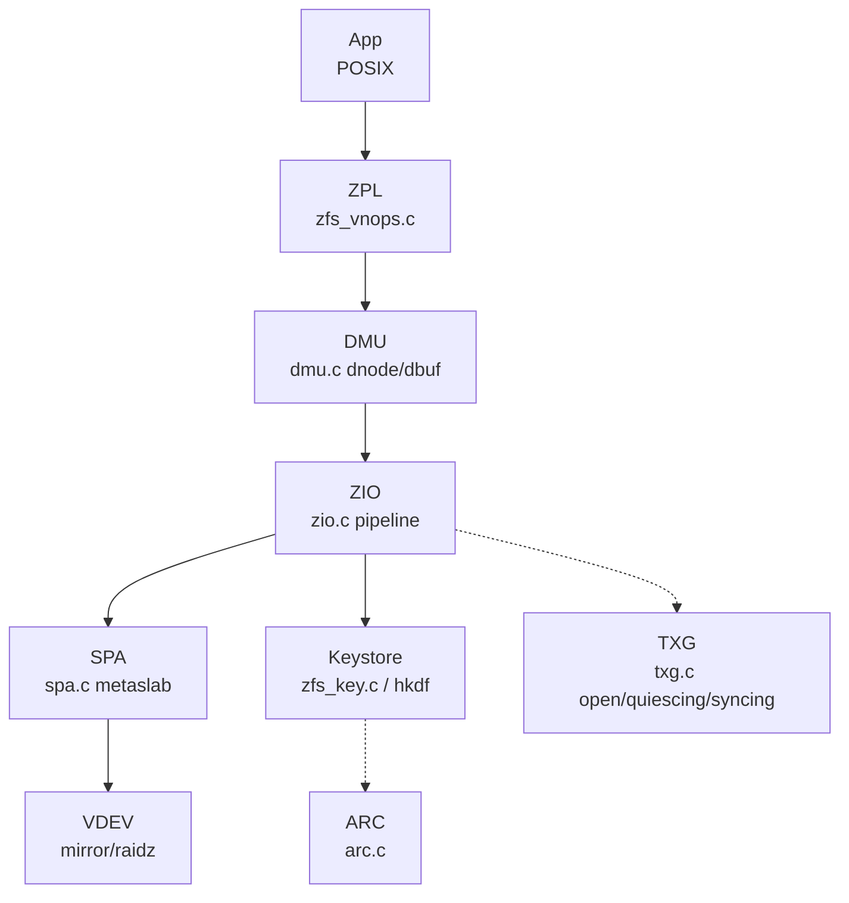
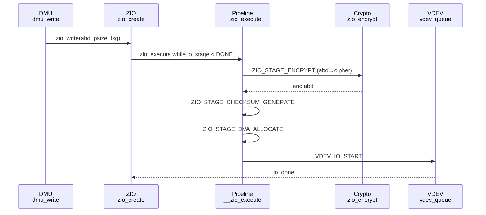
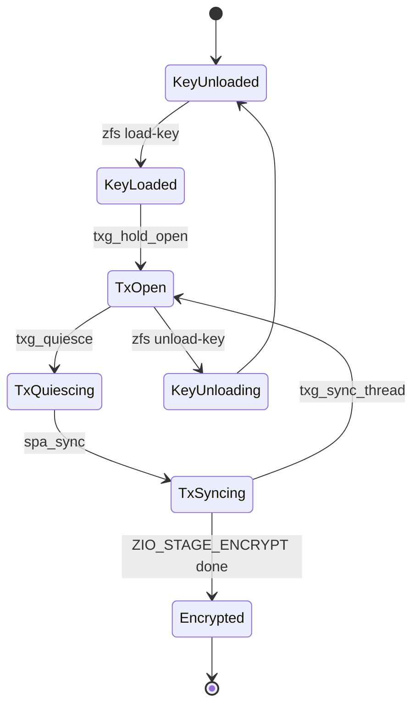

# T0500 回补件 — ZFS Crypto 多图（mermaid，每图1 Source）

> 方法论：`ontology/pattern/research-diagram-methodology.md` P0三图必含，`mermaid` inline，每图1条 `Source: primary` 可复核  
> 目标读者：架构师（C4 L2为主）+ 新同学术语表  
> 产出：可直接 `patch` 入 `T0500-0901-research-zfs-crypto` 的 `## 发现` 段 `grep -c mermaid ≥3`

---

## 1. 架构图 C4 L2（Container）— ZFS Crypto 全栈



*Source: `openzfs/zfs/include/sys/zio_impl.h:60-180` `ZIO_STAGE_ENCRYPT/CHECKSUM` + `module/zfs/zio.c:930` `zio_create pipeline=ZIO_WRITE_PIPELINE` + `https://openzfs.github.io/openzfs-docs/`*

---

## 2. 逻辑图 ZIO Pipeline 时序（Crypto分支）



*Source: `openzfs/zfs/module/zfs/zio.c:2428` `__zio_execute while(io_stage<ZIO_STAGE_DONE)` + `module/zfs/zio.c:2440` `ZIO_STAGE_ENCRYPT`*

---

## 3. 生命周期图 Crypto Key/TXG 状态机



*Source: `openzfs/zfs/module/zfs/txg.c:310` `txg_quiesce` 抓 `tc_open_lock` + `module/zfs/zfs_vnops.c: zfs load-key`*

---

## 合入指引

```bash
# 直接合入 T0500 的 ## 发现 段
cat records/T0504-0903-zfs-crypto-diagram-fill/research-crypto-diagrams.md >> records/T0500-*/research-report.md
# 校验
grep -c "```mermaid" records/T0500-*/research-report.md # ≥3
grep -c "Source:" records/T0504/research-crypto-diagrams.md # 3
```

*关联：`ontology/pattern/research-diagram-methodology.md:1` 6图模板，`ontology/pattern/scientific-research-methodology.md:1` C4+Diátaxis+arc42+I2S2*
