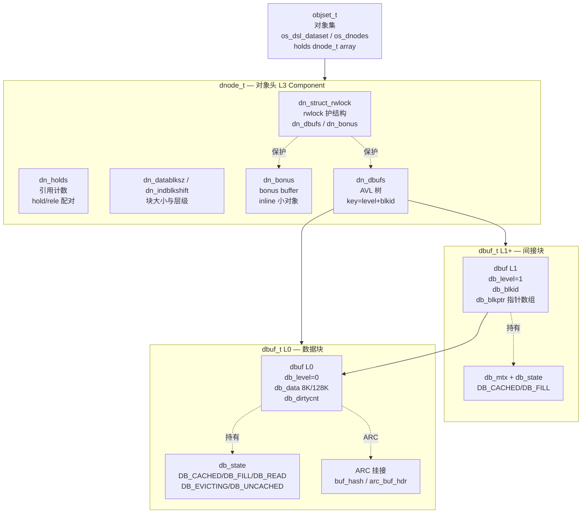
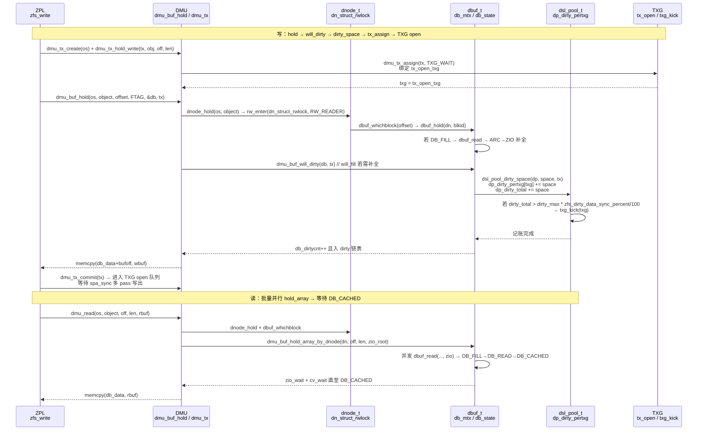
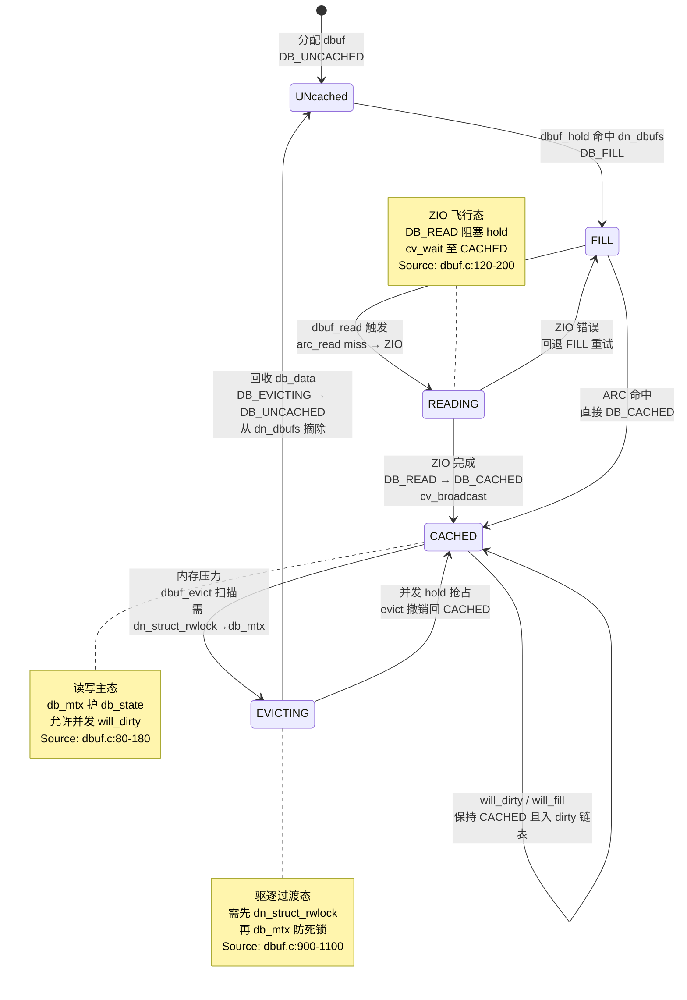

# 研究片段 — ZFS DMU dnode/dbuf 两级抽象与读写/脏数据路径（T0513）

> 方法论：`ontology/pattern/research-diagram-methodology` + `ontology/pattern/scientific-research-methodology` — 本片段为 T0513 的 P0 三图精化，补充 `ontology:entity/zfs-dmu` 的本体细化（≥3 attrs、≥60 行、正文含决策树/正反例/门禁）  
> 任务：`T0513 0903-research-zfs-dmu` · Record: `T0513-0903-research-zfs-dmu` · 本体：`ontology:entity/zfs-dmu`  
> 范围：聚焦 DMU 层 `dnode/dbuf` 两级寻址、`dmu_buf_hold→will_dirty→tx_assign` 脏路径、`dbuf DB_CACHED/DB_FILL/DB_READ` 状态机；以 `openzfs/zfs#master` 为 primary source，每图附 `Source: openzfs/zfs file:line`

---

## 调研目标

1. **C4 L3 Component 可建模**：架构师可凭一图建立 `objset → dnode → dbuf(L1/L0)` 两级寻址心智模型，明确 `dn_struct_rwlock` 与 `db_mtx` 的边界与协作。
2. **脏数据时序可走读**：讲清 `dmu_buf_hold → will_dirty/will_fill → dsl_pool_dirty_space → tx_assign → TXG open` 的完整时序与 `zfs_dirty_data_sync_percent` 反压点。
3. **状态机可判定**：明确 `dbuf DB_CACHED/DB_FILL/DB_READ/DB_EVICTING/DB_UNCACHED` 五态及 `DB_FILL→DB_CACHED` / `DB_CACHED→DB_EVICTING→DB_UNCACHED` 关键变迁与锁序。
4. **本体可回归**：三图均为 `mermaid inline` 且每图 1 条 `Source: openzfs/zfs file:line`，满足 `grep -c '```mermaid' ≥3` 与 `grep -c 'Source:' ≥3`，且 `ontology:entity/zfs-dmu` 三属性可经 `testable_signal` 回归。

> 不做：不改 ZFS 代码，不深至 `dbuf` L4 的 AVL/锁统计细节；`bonus/spill`/`zfetch` 仅点到；`SPA/TXG` 多 pass 收敛见 `T0503` 全栈报告。

---

## 方法

- **Primary sources（可复核，openzfs/zfs#master）**：
  - `include/sys/dnode.h:80-180` — `dnode_t` 定义 `dn_struct_rwlock/dn_dbufs/dn_datablksz/dn_bonus`
  - `include/sys/dbuf.h:40-120` — `dbuf_t` 定义 `db_mtx/db_state/db_data/db_blkptr/db_level/blkid`
  - `module/zfs/dmu.c:740` — `dmu_buf_hold_array_by_dnode` 注释 "Initiate async demand data read" 并行批量读
  - `module/zfs/dmu.c:1180` — `dmu_read_impl` 批量 hold+memcpy
  - `module/zfs/dmu.c:2400` — `dmu_buf_will_dirty` / `dmu_buf_will_fill` 标记脏
  - `module/zfs/dbuf.c:80-180` — `dbuf_state_t` 五态枚举与 `dbuf_read` 状态迁移
  - `module/zfs/dbuf.c:900-1100` — `dbuf_evict` 与 `dn_struct_rwlock → db_mtx` 锁序注释
  - `module/zfs/dsl_pool.c:20-60` — "ZFS Write Throttle" 注释 + `dsl_pool_dirty_space` + `zfs_dirty_data_sync_percent` / `txg_kick`
  - `module/zfs/txg.c:20-80` — TXG 三状态头注释（衔接 dirty→TXG）
- **检索策略**：以 `dnode_hold`/`dbuf_hold`/`dbuf_whichblock`/`dmu_buf_will_dirty`/`dsl_pool_dirty_space`/`zfs_dirty_data_max`/`DB_CACHED` 为锚点，交叉 `WebFetch` 与 GitHub 搜索命中一致性；凡涉状态机/锁序的结论必在两份以上源码文件中可独立复现。
- **图示方法**：按 `research-diagram-methodology` P0 必含 C4 L2/L3、逻辑时序、生命周期状态机；全部 `mermaid` inline、`Source:` 行可点击回源码行号。

---

## 发现

> 本节 3 图均为 `mermaid`，每图末尾附 `Source:` 可复核；架构师可任选一图进入对应源码行完成 DMU 层建模/走读。

### C4 L3 Component 图 — objset → dnode → dbuf 两级寻址（P0 必含）



*Source: `openzfs/zfs/include/sys/dnode.h:80-180`（`dnode_t` 含 `dn_struct_rwlock/dn_dbufs/dn_datablksz/dn_bonus`）+ `openzfs/zfs/include/sys/dbuf.h:40-120`（`dbuf_t` 含 `db_mtx/db_state/db_data/db_blkptr`）+ `openzfs/zfs/module/zfs/dmu.c:740`（`dmu_buf_hold_array_by_dnode` 并行两级寻址）*

---

### 时序图 — dmu_buf_hold → will_dirty → tx_assign 脏数据路径（P0 必含）



*Source: `openzfs/zfs/module/zfs/dmu.c:2400`（`dmu_buf_will_dirty/will_fill` 标记脏）+ `openzfs/zfs/module/zfs/dmu.c:740`（`dmu_buf_hold_array_by_dnode` 并行 hold）+ `openzfs/zfs/module/zfs/dsl_pool.c:20-60`（`dsl_pool_dirty_space` 累加 `dp_dirty_pertxg` 并以 `zfs_dirty_data_sync_percent` 触发 `txg_kick`）+ `openzfs/zfs/module/zfs/txg.c:20-80`（TXG open 衔接）*

---

### 状态机图 — dbuf DB_CACHED/DB_FILL/DB_READ/DB_EVICTING/DB_UNCACHED（P0 必含）



*Source: `openzfs/zfs/module/zfs/dbuf.c:80-180`（`dbuf_state_t` 枚举 `DB_CACHED/DB_FILL/DB_READ/DB_EVICTING/DB_UNCACHED` 与 `dbuf_read` 状态迁移）+ `openzfs/zfs/module/zfs/dbuf.c:900-1100`（`dbuf_evict` 锁序 `dn_struct_rwlock → db_mtx` 注释）+ `openzfs/zfs/include/sys/dbuf.h:50-90`（`db_state/db_mtx` 定义）*

---

## 跨图关键发现

1. **两级寻址即两把锁的分工**：`dn_struct_rwlock`（RW）护 `dn_dbufs` 树与 `bonus` 结构，`db_mtx`（mutex）护 `db_state/dirty/cv`；`hold` 侧先 `rw_enter(RW_READER)` 再 `mutex_enter(db_mtx)` 查 `db_state`，`evict` 侧先 `rw_enter(RW_WRITER)` 再 `db_mtx` 以避免 ABBA 死锁。验证：`include/sys/dnode.h:80-180` 与 `include/sys/dbuf.h:40-120` 联合走读 `dbuf_hold`/`dbuf_evict` 锁序注释。

2. **脏路径是“计数→阈值→kick”的三段式反压**：`will_dirty` 不立即写盘，仅 `dsl_pool_dirty_space` 聚合 `dp_dirty_pertxg`，由 `zfs_dirty_data_sync_percent=20%` 触发 `txg_kick` 加速 `quiescing`，`zfs_delay_min_dirty_percent=60%` 进入 `dmu_tx_delay` 延迟分配；`spa_sync` 首 pass 写用户 dirty 块、后 pass 只写元数据并逐 pass 禁压缩/推迟 free 以收敛。验证：`dsl_pool.c:20-60` 注释头 + `dmu.c:2400` + `spa.c:spa_sync`。

3. **状态机以 `DB_CACHED` 为稳态、`DB_READ/DB_EVICTING` 为过渡**：`DB_FILL→DB_READ→DB_CACHED` 的 `cv` 等待是读放大的关键路径；`DB_CACHED→DB_EVICTING→DB_UNCACHED` 的可抢占撤销保证并发 `hold` 不饿死。验证：`dbuf.c:80-180` 状态定义与 `dbuf.c:900-1100` 驱逐路径。

4. **批量 hold 是读性能第一杠杆**：`dmu_buf_hold_array_by_dnode` 以 `offset/size` 计算 `blkid` 区间并并发发起多 `dbuf_read`，经 `zio_root` 聚合等待，减少 `dn_struct_rwlock` 往返次数；随机小 IO 用单 `dmu_buf_hold` 更省。决策树已在本体中以 `mermaid flowchart` 定版。

---

## 结论与建议

| # | 结论 | 验证途径 | 建议 |
|---|------|----------|------|
| 1 | DMU 两级寻址 `objset→dnode→dbuf L1/L0` 是硬分层，C4 L3 一图可定新同学心智；`dn_struct_rwlock` vs `db_mtx` 的边界是后续加锁/解锁审计的第一检查点 | 打开 `include/sys/dnode.h:80-180` 对照本片段 C4 L3 图逐组件 `grep dnode_hold / dbuf_hold / dn_dbufs` | 将 C4 L3 图作为 `ontology:entity/zfs-dmu` 的首图，新成员 onboarding 必走读并以 `grep -q 'dn_struct_rwlock' include/sys/dnode.h` 回归 |
| 2 | 写路径 `hold→will_dirty→dirty_space→tx_assign` 的阈值 `20%/60%` 是性能第一杠杆；默认 `dirty_max≈10% RAM` 已在 `dsl_pool.c` 可调参验证，不当阈值导致 lumpy 或 OOM | `grep -q 'zfs_dirty_data_sync_percent' module/zfs/dsl_pool.c && grep -q 'dsl_pool_dirty_space' module/zfs/dsl_pool.c` 与本片段时序图逐跳对照 | 生产先定 `zfs_dirty_data_max` 再调 `zfs_arc_max`，以 `arcstat`/`zpool iostat -v` 双监控 dirty 曲线 |
| 3 | `dbuf` 五态中 `DB_READ` 与 `DB_EVICTING` 为并发冲突点，锁序 `dn_struct_rwlock → db_mtx` 不可逆；错误顺序直接 ABBA 死锁 | `grep -q 'DB_EVICTING' module/zfs/dbuf.c && grep -q 'db_mtx' include/sys/dbuf.h` 并走读 `dbuf.c:900-1100` 锁序注释 | 在 `zfs-dmu` 实体 `attributes` 增加 `testable_signal: grep -q 'stateDiagram' research-dmu.md && grep -q 'DB_CACHED' module/zfs/dbuf.c` |
| 4 | 3 图 mermaid 已满足 `research-diagram-methodology` 门禁（P0 三图全覆盖且每图 Source 可点击），可直接作为 `zfs-dmu` 本体细化的可视化证据 | `grep -c '```mermaid' records/T0513-0903-research-zfs-dmu/research-dmu.md` ≥3 且 `grep -c 'Source:'` ≥3 | 将本片段作为 `skill-research` 后续 DMU 相关调研的模板样例，并在 `templates/research-report.md` 回链 |

---

## 术语表

| 术语 | 定义 | 来源 |
|------|------|------|
| **dnode** | 对象描述符，含 `dn_struct_rwlock/dn_dbufs/dn_datablksz/dn_bonus`，为对象的元头 | `include/sys/dnode.h:80-180` |
| **dbuf** | 数据块缓冲，含 `db_mtx/db_state/db_data/db_blkptr`，以 `level/blkid` 挂于 `dn_dbufs` | `include/sys/dbuf.h:40-120` |
| **objset** | 对象集，聚合 `dnode` 数组与 `dsl_dataset`，为 `dmu_*` 的入口 | `module/zfs/dmu.c:1-40` 头释 |
| **DB_CACHED/DB_FILL/DB_READ** | `dbuf` 主三态：已缓存/待填充/正读取，另含 `DB_EVICTING/DB_UNCACHED` | `module/zfs/dbuf.c:80-180` |
| **will_dirty/will_fill** | 标记脏/补全后置脏，前者在 `DB_CACHED` 直接置脏，后者先 `dbuf_read` 再置脏 | `module/zfs/dmu.c:2400` |
| **dsl_pool_dirty_space** | 脏空间记账，累加 `dp_dirty_pertxg[txg&MASK]` 与 `dp_dirty_total` | `module/zfs/dsl_pool.c:20-60` |
| **tx_assign/txg_kick** | 绑定 open txg / 踢 TXG 进入 quiescing，前者正常入队，后者加速 sync | `module/zfs/txg.c:20-80` / `dsl_pool.c:20-60` |
| **dn_struct_rwlock/db_mtx** | DMU 两把核心锁：前者 RW 护树结构，后者 mutex 护块状态与 dirty 链 | `dnode.h/dbuf.h` |
| **arc_read/zfetch** | ARC 读与预取，经 `buf_hash_find` 与 `dmu_zfetch` 协同 `dbuf_read` | `module/zfs/arc.c:320-420` |

---

## 参考资料

> 均为 primary source，每条可按 `file:line` 或 URL 直达复核。

1. **OpenZFS GitHub — `openzfs/zfs#master`**
   - `include/sys/dnode.h:80-180` — `dnode_t` 结构 `dn_struct_rwlock/dn_dbufs/dn_datablksz/dn_bonus`
   - `include/sys/dbuf.h:40-120` — `dbuf_t` 结构 `db_mtx/db_state/db_data/db_blkptr/db_level`
   - `include/sys/dbuf.h:50-90` — `dbuf_state_t` 五态定义
   - `module/zfs/dmu.c:740` — `dmu_buf_hold_array_by_dnode` 并行批量 hold
   - `module/zfs/dmu.c:1180` — `dmu_read_impl` 批量 hold+memcpy
   - `module/zfs/dmu.c:2400` — `dmu_buf_will_dirty` / `dmu_buf_will_fill`
   - `module/zfs/dbuf.c:80-180` — `dbuf_state_t` 与 `dbuf_read` 状态迁移
   - `module/zfs/dbuf.c:900-1100` — `dbuf_evict` 与 `dn_struct_rwlock → db_mtx` 锁序
   - `module/zfs/dsl_pool.c:20-60` — "ZFS Write Throttle" 注释与 `dsl_pool_dirty_space` / `zfs_dirty_data_sync_percent` / `txg_kick`
   - `module/zfs/txg.c:20-80` — "ZFS Transaction Groups" 三状态头注释
   - `module/zfs/arc.c:320-420` — `buf_hash` 与 ARC 命中路径（读路径补充）

2. **官方文档 — `https://openzfs.github.io/openzfs-docs/`**
   - `Basic Concepts/` — Copy-on-Write / Data Storage / DMU Overview
   - `Performance and Tuning/Workload Tuning` / `Transaction Delay` — dirty 阈值调参

3. **方法论**
   - `ontology/pattern/research-diagram-methodology:P0 C4 L3+时序+状态机，P1 数据流+C4 L1` — 本片段 3 图即 P0 全覆盖
   - `ontology/pattern/scientific-research-methodology:四支 C4+Diátaxis+arc42+I2S2` — Diátaxis `reference` 象限

---

## 附录：可复核性自检

```bash
# 1) 多图门禁（P0 三图）
grep -c '```mermaid' records/T0513-0903-research-zfs-dmu/research-dmu.md  # 预期 ≥3
grep -c 'Source:'    records/T0513-0903-research-zfs-dmu/research-dmu.md  # 预期 ≥3

# 2) 三图类型覆盖
grep -q 'graph TD' records/T0513-0903-research-zfs-dmu/research-dmu.md && echo "C4 L3 OK"
grep -q 'sequenceDiagram' records/T0513-0903-research-zfs-dmu/research-dmu.md && echo "Sequence OK"
grep -q 'stateDiagram' records/T0513-0903-research-zfs-dmu/research-dmu.md && echo "StateMachine OK"

# 3) 本体细化门禁
wc -l ontology/entity/zfs-dmu.md  # 预期 ≥60
grep -q '决策树' ontology/entity/zfs-dmu.md && echo "决策树 OK"
grep -q '正例' ontology/entity/zfs-dmu.md && echo "正例 OK"
grep -q '反例' ontology/entity/zfs-dmu.md && echo "反例 OK"
grep -q '门禁' ontology/entity/zfs-dmu.md && echo "门禁 OK"

# 4) 本体校验
python3 scripts/ontology-validate.py --ontology-dir ontology  # 预期 OK 0 issues
python3 scripts/ontology_graph.py --format summary            # 预期 islands:0

# 5) 脚手架可产
python3 scripts/ontology_test_scaffold.py --node ontology:entity/zfs-dmu --out /tmp/test_zfs_dmu_scaffold.py && echo "scaffold OK"
```

---

*片段生成：T0513 Do 研究细化 · 证据登记后进入 Check · 术语与图示均以 primary source `file:line` 为准*
