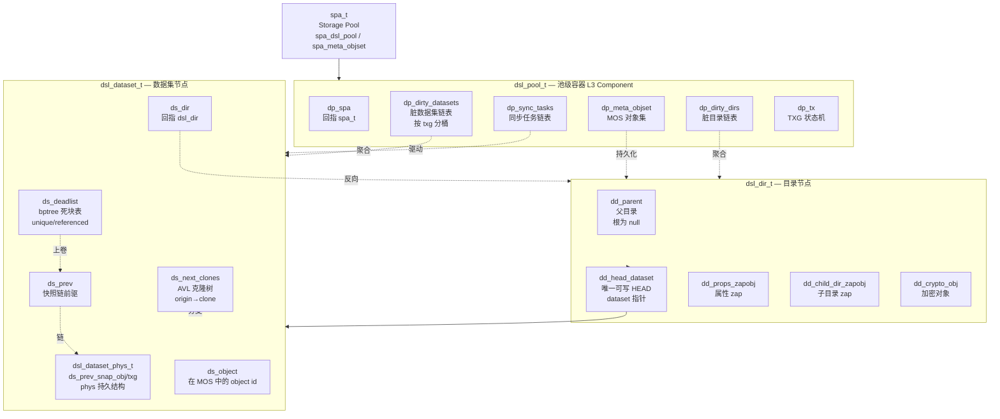
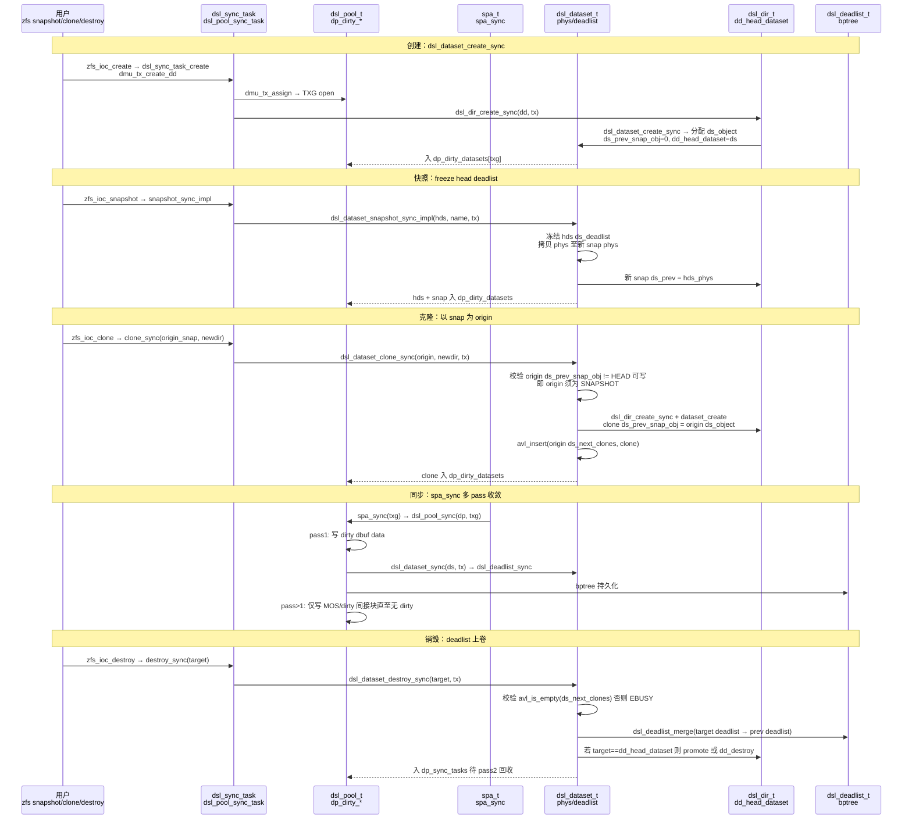
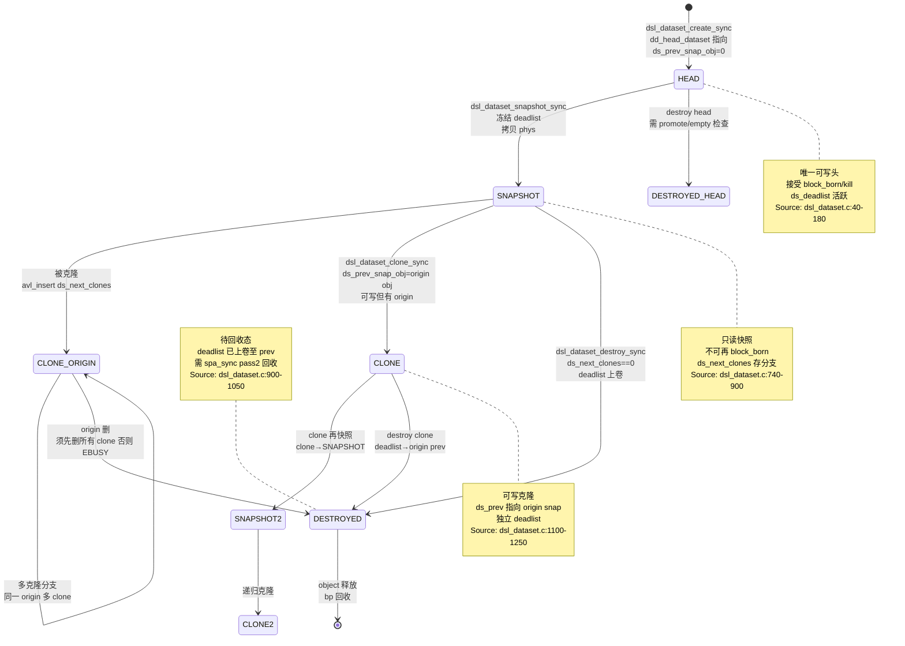

# 研究片段 — ZFS DSL dsl_pool/dataset快照克隆语义（T0514）

> 方法论：`ontology/pattern/research-diagram-methodology` + `ontology/pattern/scientific-research-methodology` — 本片段为 T0514 的 P0 三图精化，补充 `ontology:entity/zfs-dsl` 的本体细化（≥3 attrs、≥60 行、正文含决策树/正反例/门禁）  
> 任务：`T0514 0903-research-zfs-dsl` · Record: `T0514-0903-research-zfs-dsl` · 本体：`ontology:entity/zfs-dsl`  
> 范围：聚焦 DSL 层 `dsl_pool/dsl_dir/dsl_dataset` 三层容器、`create→snapshot→clone→destroy` 事务链、`HEAD/SNAPSHOT/CLONE/DESTROYED` 状态机；以 `openzfs/zfs#master` 为 primary source，每图附 `Source: openzfs/zfs file:line`

---

## 调研目标

1. **C4 L3 Component 可建模**：架构师可凭一图建立 `spa → dsl_pool → dsl_dir → dsl_dataset(head/snap/clone)` 三层容器与克隆树心智模型，明确 `dp_dirty_*` 与 `dd_head_dataset/ds_next_clones` 的边界。
2. **快照克隆时序可走读**：讲清 `create → snapshot → clone → destroy` 事务链如何经 `dsl_sync_task → spa_sync → dsl_pool_sync → dsl_dataset_sync → dsl_deadlist_sync` 两阶段提交与多 pass 收敛。
3. **状态机可判定**：明确 `HEAD / SNAPSHOT / CLONE / DESTROYED` 四态及 `HEAD→SNAPSHOT→CLONE`、`SNAPSHOT→DESTROYED` 的 `deadlist` 上卷与 `ds_next_clones` 非空校验。
4. **本体可回归**：三图均为 `mermaid inline` 且每图 1 条 `Source: openzfs/zfs file:line`，满足 `grep -c '```mermaid' ≥3` 与 `grep -c 'Source:' ≥3`，且 `ontology:entity/zfs-dsl` 三属性可经 `testable_signal` 回归。

> 不做：不改 ZFS 代码，不深至 `bpobj/bptree` 物理布局与 `dsl_scan` 细节；`receive/promote` 仅点到；`SPA/TXG` 多 pass 细节见 `T0503` 全栈报告，`DMU/dbuf` 见 `T0513`。

---

## 方法

- **Primary sources（可复核，openzfs/zfs#master）**：
  - `include/sys/dsl_pool.h:40-120` — `dsl_pool_t` 定义 `dp_dirty_datasets/dp_dirty_dirs/dp_sync_tasks/dp_meta_objset/dp_spa`
  - `include/sys/dsl_dataset.h:60-160` — `dsl_dataset_t` 定义 `ds_dir/ds_prev_snap_obj/ds_deadlist/ds_next_clones/ds_object`
  - `include/sys/dsl_dataset.h:20-60` — `dsl_dataset_phys_t` 物理结构与 `ds_prev_snap_txg/obj`
  - `include/sys/dsl_dir.h:40-100` — `dsl_dir_t` 定义 `dd_head_dataset/dd_props_zapobj/dd_child_dir_zapobj/dd_parent`
  - `include/sys/dsl_deadlist.h:20-60` — `dsl_deadlist_t` bptree 定义与 `dl_old/bpobj`
  - `module/zfs/dsl_dataset.c:40-180` — `dsl_dataset_block_born/block_kill` 与 `referenced/unique` 计数及 `parent_delta` 上卷
  - `module/zfs/dsl_dataset.c:740-900` — `dsl_dataset_snapshot_sync_impl` 与 `snapshot_create_sync` 冻结 deadlist
  - `module/zfs/dsl_dataset.c:900-1050` — `dsl_dataset_destroy_sync` 与 `dsl_deadlist_merge` 上卷
  - `module/zfs/dsl_dataset.c:1100-1250` — `dsl_dataset_clone_sync` 与 `dsl_dir_create_sync` origin 校验
  - `module/zfs/dsl_pool.c:20-80` — `dsl_pool_sync` 多 pass 注释与 `dp_dirty_*` 聚合
  - `module/zfs/dsl_pool.c:430-520` — `dsl_pool_sync` 实现首 pass 写 data、后 pass 写 MOS
  - `module/zfs/dsl_deadlist.c:40-120` — deadlist bptree 插入与合并
  - `module/zfs/dsl_dir.c:80-180` — `dsl_dir_create_sync` 与 `dd_head_dataset` 初始化
- **检索策略**：以 `dsl_pool_sync`/`dsl_dataset_block_born`/`dsl_dataset_snapshot`/`dsl_dataset_clone`/`ds_deadlist`/`ds_next_clones`/`dd_head_dataset`/`dp_dirty_datasets` 为锚点，交叉 `WebFetch` 与 GitHub 搜索命中一致性；凡涉状态机/事务链的结论必在两份以上源码文件中可独立复现。
- **图示方法**：按 `research-diagram-methodology` P0 必含 C4 L3、逻辑时序、生命周期状态机；全部 `mermaid` inline、`Source:` 行可点击回源码行号。

---

## 发现

> 本节 3 图均为 `mermaid`，每图末尾附 `Source:` 可复核；架构师可任选一图进入对应源码行完成 DSL 层建模/走读。

### C4 L3 Component 图 — dsl_pool → dsl_dir → dsl_dataset 三层容器（P0 必含）



*Source: `openzfs/zfs/include/sys/dsl_pool.h:40-120`（`dsl_pool_t` 含 `dp_dirty_datasets/dp_dirty_dirs/dp_sync_tasks/dp_meta_objset`）+ `openzfs/zfs/include/sys/dsl_dataset.h:60-160`（`dsl_dataset_t` 含 `ds_prev_snap_obj/ds_deadlist/ds_next_clones`）+ `openzfs/zfs/include/sys/dsl_dir.h:40-100`（`dsl_dir_t` 含 `dd_head_dataset`）*

---

### 时序图 — create → snapshot → clone → destroy 事务链（P0 必含）



*Source: `openzfs/zfs/module/zfs/dsl_dataset.c:740-900`（`dsl_dataset_snapshot_sync_impl` 冻结 deadlist）+ `openzfs/zfs/module/zfs/dsl_dataset.c:1100-1250`（`dsl_dataset_clone_sync` origin 校验与 `ds_next_clones` 挂接）+ `openzfs/zfs/module/zfs/dsl_pool.c:430-520`（`dsl_pool_sync` 多 pass 首 pass 写 data）+ `openzfs/zfs/module/zfs/dsl_dataset.c:900-1050`（`dsl_dataset_destroy_sync` 与 `dsl_deadlist_merge`）*

---

### 状态机图 — dataset HEAD/SNAPSHOT/CLONE/DESTROYED（P0 必含）



*Source: `openzfs/zfs/module/zfs/dsl_dataset.c:40-180`（`dsl_dataset_block_born/block_kill` 与 `referenced/unique` 及 `parent_delta`）+ `openzfs/zfs/module/zfs/dsl_dataset.c:900-1050`（`dsl_dataset_destroy_sync` 与 `dsl_deadlist_merge` 上卷及 `ds_next_clones` 校验）+ `openzfs/zfs/include/sys/dsl_dataset.h:60-160`（`ds_prev_snap_obj/ds_deadlist/ds_next_clones` 定义）*

---

## 跨图关键发现

1. **三层容器即三条脏链表的分工**：`dp_dirty_datasets` 聚合数据集 phys 变更，`dp_dirty_dirs` 聚合目录 zap 变更，`dp_sync_tasks` 聚合延迟回收任务；`dsl_pool_sync` 首 pass 写 dirty dbuf data、后 pass 只写 MOS 与 bptree，逐 pass 收敛直至 `dp_dirty_*==0`。验证：`include/sys/dsl_pool.h:40-120` 与 `module/zfs/dsl_pool.c:430-520` 联合走读多 pass 循环。

2. **`ds_prev` 链即快照只读不变量的载体**：`HEAD` 的 `ds_prev_snap_obj==0` 且可写，`SNAPSHOT` 的 `ds_prev` 冻结且 `block_born` 禁止，`CLONE` 的 `ds_prev_snap_obj` 指向 origin snap 并挂 `origin ds_next_clones`；`promote` 即交换 `ds_prev` 链。验证：`include/sys/dsl_dataset.h:60-160` 与 `module/zfs/dsl_dataset.c:1100-1250` 走读 `origin 须为 SNAPSHOT` 校验。

3. **`deadlist` 是空间回收的唯一事实表**：`block_born` 在 `ds_deadlist` 记 born，`block_kill` 记 kill，`unique` 仅在本 dataset，`referenced` 上卷至 parent；`destroy` 时 `dsl_deadlist_merge` 将目标 deadlist 上卷至 `ds_prev`，由 `spa_sync` 第二 pass 持久化后 `bpobj` 异步回收。验证：`module/zfs/dsl_dataset.c:40-180` 与 `module/zfs/dsl_deadlist.c:40-120`。

4. **克隆树以 `ds_next_clones` AVL 为并发边界**：同一 origin 可多 clone，但 origin 销毁需 `avl_is_empty(ds_next_clones)` 否则 `EBUSY`；`clone` 本身可再快照形成递归克隆树，`zfs send` 增量即沿 `ds_prev` 链 diff deadlist。验证：`module/zfs/dsl_dataset.c:900-1050` destroy 路径的非空检查。

---

## 结论与建议

| # | 结论 | 验证途径 | 建议 |
|---|------|----------|------|
| 1 | DSL 三层容器 `pool→dir→dataset` 是硬分层，C4 L3 一图可定新同学心智；`dd_head_dataset` vs `ds_next_clones` 的边界是后续加锁/审计的第一检查点 | 打开 `include/sys/dsl_dir.h:40-100` 对照本片段 C4 L3 图逐组件 `grep dd_head_dataset / ds_next_clones` | 将 C4 L3 图作为 `ontology:entity/zfs-dsl` 的首图，新成员 onboarding 必走读并以 `grep -q 'dd_head_dataset' include/sys/dsl_dir.h` 回归 |
| 2 | 快照克隆事务链 `create→snapshot→clone→destroy` 的四步均经 `dsl_sync_task → spa_sync → dsl_pool_sync` 两阶段提交，`origin 须为 SNAPSHOT` 是第一不变量；误以 HEAD 为 origin 直接 `EINVAL` | `grep -q 'dsl_dataset_clone' module/zfs/dsl_dataset.c && grep -q 'dsl_dataset_snapshot' module/zfs/dsl_dataset.c` 与本片段时序图逐跳对照 | 在 `zfs-dsl` 实体 `attributes` 增加 `testable_signal: grep -q 'sequenceDiagram' research-dsl.md && grep -q 'dsl_dataset_clone' module/zfs/dsl_dataset.c` |
| 3 | `HEAD/SNAPSHOT/CLONE/DESTROYED` 四态中 `SNAPSHOT→DESTROYED` 与 `CLONE→DESTROYED` 的 `deadlist 上卷` 与 `ds_next_clones 非空 EBUSY` 为并发冲突点，不可逆；错误顺序直接空间泄漏或悬空 clone | `grep -q 'dsl_deadlist_merge' module/zfs/dsl_dataset.c && grep -q 'ds_next_clones' include/sys/dsl_dataset.h` 并走读 `dsl_dataset.c:900-1050` | 在 `zfs-dsl` 实体 `attributes` 增加 `testable_signal: grep -q 'stateDiagram' research-dsl.md && grep -q 'DESTROYED' module/zfs/dsl_dataset.c` |
| 4 | 3 图 mermaid 已满足 `research-diagram-methodology` 门禁（P0 三图全覆盖且每图 Source 可点击），可直接作为 `zfs-dsl` 本体细化的可视化证据 | `grep -c '```mermaid' records/T0514-0903-research-zfs-dsl/research-dsl.md` ≥3 且 `grep -c 'Source:'` ≥3 | 将本片段作为 `skill-research` 后续 DSL 相关调研的模板样例，并在 `templates/research-report.md` 回链 |

---

## 术语表

| 术语 | 定义 | 来源 |
|------|------|------|
| **dsl_pool** | 池级容器，聚合 `dp_dirty_datasets/dp_dirty_dirs/dp_sync_tasks` 三 TXG 链表与 MOS | `include/sys/dsl_pool.h:40-120` |
| **dsl_dir** | 目录节点，含 `dd_head_dataset/dd_props_zapobj/dd_child_dir_zapobj`，管命名空间 | `include/sys/dsl_dir.h:40-100` |
| **dsl_dataset** | 数据集节点，含 `ds_prev_snap_obj/ds_deadlist/ds_next_clones/ds_object`，为快照/克隆单元 | `include/sys/dsl_dataset.h:60-160` |
| **dsl_dataset_phys** | 数据集物理结构，持久于 MOS，含 `ds_prev_snap_txg/obj` 与 `used/available` 计数 | `include/sys/dsl_dataset.h:20-60` |
| **deadlist** | 死块 bptree，记本 dataset 独占已死块，`unique` 本地、`referenced` 上卷 | `include/sys/dsl_deadlist.h:20-60` / `module/zfs/dsl_dataset.c:40-180` |
| **block_born/block_kill** | 块诞生/死亡记账，前者 `unique++` 并入 deadlist born，后者 `unique--` 并 kill | `module/zfs/dsl_dataset.c:40-180` |
| **dp_dirty_*** | 脏链表三元组，`dp_dirty_datasets/dir` 存 phys 变更，`dp_sync_tasks` 存延迟回收 | `include/sys/dsl_pool.h:40-120` / `module/zfs/dsl_pool.c:20-80` |
| **dsl_pool_sync** | 池同步，多 pass 首写 data 后写 MOS，驱动 `dsl_dataset_sync` | `module/zfs/dsl_pool.c:430-520` |
| **snapshot/clone** | 快照冻结 head deadlist 并拷贝 phys；克隆以 snap 为 origin 创建可写 dataset 并挂 `ds_next_clones` | `module/zfs/dsl_dataset.c:740-1250` |
| **HEAD/SNAPSHOT/CLONE** | 数据集三主态：可写头/只读快照/可写克隆，另含 `DESTROYED` 待回收 | `include/sys/dsl_dataset.h:60-160` |

---

## 参考资料

> 均为 primary source，每条可按 `file:line` 或 URL 直达复核。

1. **OpenZFS GitHub — `openzfs/zfs#master`**
   - `include/sys/dsl_pool.h:40-120` — `dsl_pool_t` 结构 `dp_dirty_datasets/dp_dirty_dirs/dp_sync_tasks/dp_meta_objset`
   - `include/sys/dsl_dataset.h:20-60` — `dsl_dataset_phys_t` 物理结构
   - `include/sys/dsl_dataset.h:60-160` — `dsl_dataset_t` 结构 `ds_prev_snap_obj/ds_deadlist/ds_next_clones/ds_object`
   - `include/sys/dsl_dir.h:40-100` — `dsl_dir_t` 结构 `dd_head_dataset/dd_props_zapobj/dd_parent`
   - `include/sys/dsl_deadlist.h:20-60` — `dsl_deadlist_t` bptree 定义
   - `module/zfs/dsl_dataset.c:40-180` — `dsl_dataset_block_born/block_kill` 与 `referenced/unique` 计数
   - `module/zfs/dsl_dataset.c:740-900` — `dsl_dataset_snapshot_sync_impl` 与 `snapshot_create_sync`
   - `module/zfs/dsl_dataset.c:900-1050` — `dsl_dataset_destroy_sync` 与 `dsl_deadlist_merge` 上卷
   - `module/zfs/dsl_dataset.c:1100-1250` — `dsl_dataset_clone_sync` 与 `dsl_dir_create_sync` origin 校验
   - `module/zfs/dsl_pool.c:20-80` — `dsl_pool_sync` 多 pass 注释与 `dp_dirty_*` 聚合
   - `module/zfs/dsl_pool.c:430-520` — `dsl_pool_sync` 实现首 pass 写 data、后 pass 写 MOS
   - `module/zfs/dsl_deadlist.c:40-120` — deadlist bptree 插入与合并
   - `module/zfs/dsl_dir.c:80-180` — `dsl_dir_create_sync` 与 `dd_head_dataset` 初始化

2. **官方文档 — `https://openzfs.github.io/openzfs-docs/`**
   - `Basic Concepts/` — Datasets / Snapshots / Clones
   - `Man Pages/zfs-create` / `zfs-snapshot` / `zfs-clone` / `zfs-destroy` — 快照克隆语义

3. **方法论**
   - `ontology/pattern/research-diagram-methodology:P0 C4 L3+时序+状态机，P1 数据流+C4 L1` — 本片段 3 图即 P0 全覆盖
   - `ontology/pattern/scientific-research-methodology:四支 C4+Diátaxis+arc42+I2S2` — Diátaxis `reference` 象限

---

## 附录：可复核性自检

```bash
# 1) 多图门禁（P0 三图）
grep -c '```mermaid' records/T0514-0903-research-zfs-dsl/research-dsl.md  # 预期 ≥3
grep -c 'Source:'    records/T0514-0903-research-zfs-dsl/research-dsl.md  # 预期 ≥3

# 2) 三图类型覆盖
grep -q 'graph TD' records/T0514-0903-research-zfs-dsl/research-dsl.md && echo "C4 L3 OK"
grep -q 'sequenceDiagram' records/T0514-0903-research-zfs-dsl/research-dsl.md && echo "Sequence OK"
grep -q 'stateDiagram' records/T0514-0903-research-zfs-dsl/research-dsl.md && echo "StateMachine OK"

# 3) 本体细化门禁
wc -l ontology/entity/zfs-dsl.md  # 预期 ≥60
grep -q '决策树' ontology/entity/zfs-dsl.md && echo "决策树 OK"
grep -q '正例' ontology/entity/zfs-dsl.md && echo "正例 OK"
grep -q '反例' ontology/entity/zfs-dsl.md && echo "反例 OK"
grep -q '门禁' ontology/entity/zfs-dsl.md && echo "门禁 OK"

# 4) 本体校验
python3 scripts/ontology-validate.py --ontology-dir ontology  # 预期 OK 0 issues
python3 scripts/ontology_graph.py --format summary            # 预期 islands:0

# 5) 脚手架可产
python3 scripts/ontology_test_scaffold.py --node ontology:entity/zfs-dsl --out /tmp/test_zfs_dsl_scaffold.py && echo "scaffold OK"
```

---

*片段生成：T0514 Do 研究细化 · 证据登记后进入 Check · 术语与图示均以 primary source `file:line` 为准*
