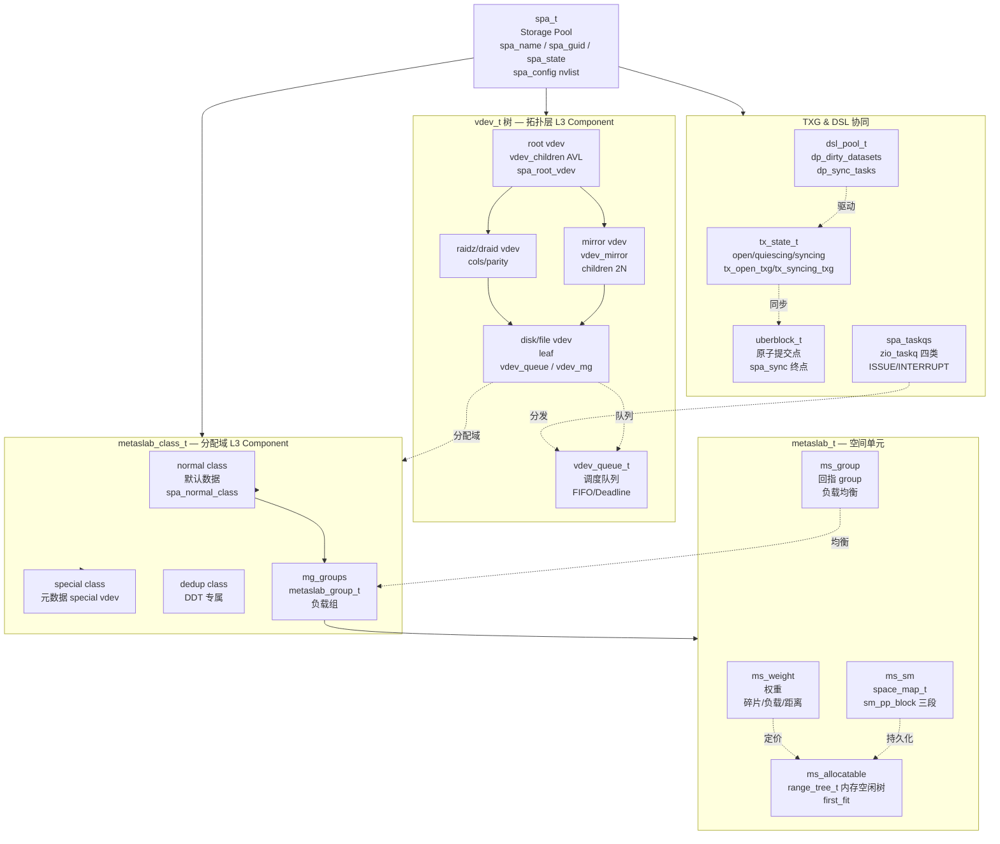
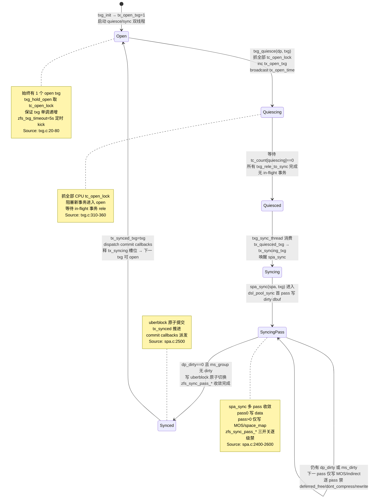
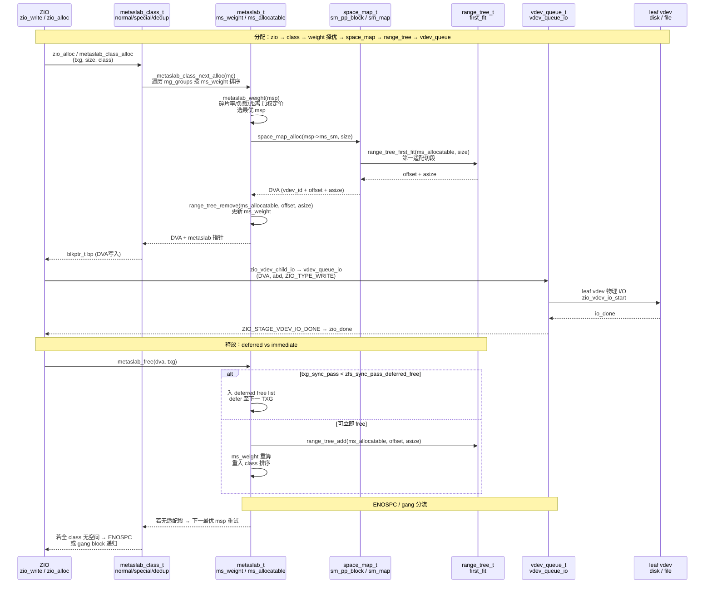

# 研究片段 — ZFS SPA Storage Pool Allocator 与 TXG 状态机及 metaslab 分配（T0515）

> 方法论：`ontology/pattern/research-diagram-methodology` + `ontology/pattern/scientific-research-methodology` — 本片段为 T0515 的 P0 三图精化，补充 `ontology:entity/zfs-spa` 的本体细化（≥3 attrs、≥60 行、正文含决策树/正反例/门禁）  
> 任务：`T0515 0903-research-zfs-spa` · Record: `T0515-0903-research-zfs-spa` · 本体：`ontology:entity/zfs-spa`  
> 范围：聚焦 SPA 层 `spa_t/vdev树/metaslab_class/space_map` 三级空间、`TXG open→quiescing→syncing` 三状态机与双线程、`metaslab_weight → space_map_alloc` 权重分配；以 `openzfs/zfs#master` 为 primary source，每图附 `Source: openzfs/zfs file:line`

---

## 调研目标

1. **C4 L3 Component 可建模**：架构师可凭一图建立 `spa_t → vdev_tree → metaslab_class → metaslab → space_map/range_tree` 三级空间与 `spa_sync → dsl_pool_sync → metaslab_sync` 同步链路心智模型，明确 `spa_config`/`spa_mos`/`spa_metaslab_class` 的边界与协作。
2. **TXG 状态机可判定**：讲清 `open → quiescing → syncing → open` 三状态与 `txg_quiesce_thread/txg_sync_thread` 双线程接力、`zfs_txg_timeout=5s` 保活与 `spa_sync` 多 pass 收敛（`zfs_sync_pass_deferred_free/dont_compress/rewrite`）的完整时序。
3. **metaslab 分配可走读**：明确 `metaslab_alloc` 按 `metaslab_weight`（碎片/负载/距离）择优、`space_map_alloc`/`range_tree_first_fit` 定价落盘、`vdev_queue` 分发至 leaf VDEV 的权重分配路径与 `ENOSPC/gang` 分流。
4. **本体可回归**：三图均为 `mermaid inline` 且每图 1 条 `Source: openzfs/zfs file:line`，满足 `grep -c '```mermaid' ≥3` 与 `grep -c 'Source:' ≥3`，且 `ontology:entity/zfs-spa` 三属性可经 `testable_signal` 回归。

> 不做：不改 ZFS 代码，不深至 `vdev_metaslab_init` 的 ashift/宽度细节与 `raidz` 编码；`ZIL` 与 `ARC` 仅点到，`DSL` 快照克隆见 `T0514`，`DMU/dbuf` 见 `T0513`。

---

## 方法

- **Primary sources（可复核，openzfs/zfs#master）**：
  - `include/sys/spa_impl.h:80-200` — `spa_t` 定义 `spa_config/spa_mos/spa_dsl_pool/spa_root_vdev/spa_metaslab_class/spa_txg`
  - `include/sys/spa.h:40-120` — `spa_t` 对外 API 与 `spa_config` `nvlist` 序列化
  - `include/sys/metaslab.h:40-120` — `metaslab_t` 定义 `ms_sm/ms_allocatable/ms_weight/ms_group` 与 `metaslab_class_t` 三类
  - `include/sys/space_map.h:20-80` — `space_map_t` 定义 `sm_pp_block/sm_phys/sm_map` 三段序列化
  - `include/sys/txg.h:20-60` — `tx_state_t/tx_cpu_t` 定义 `tx_open_txg/tx_quiesced_txg/tx_syncing_txg/tx_synced_txg`
  - `include/sys/vdev.h:80-180` — `vdev_t` 定义 `vdev_children/vdev_mg/vdev_queue` 与 `vdev_alloc`
  - `module/zfs/spa.c:20-60` — "SPA: Storage Pool Allocator" 头注释
  - `module/zfs/spa.c:2400-2600` — `spa_sync` 多 pass 循环与 `zfs_sync_pass_deferred_free/dont_compress/rewrite` 三 tunable
  - `module/zfs/txg.c:20-80` — "ZFS Transaction Groups" 三状态头注释
  - `module/zfs/txg.c:310-360` — `txg_quiesce` 抓全部 `tc_open_lock` 并递增 `tx_open_txg`
  - `module/zfs/txg.c:400-520` — `txg_sync_thread`/`txg_quiesce_thread` 协同与 `zfs_txg_timeout=5s`
  - `module/zfs/metaslab.c:20-60` — metaslab 头注释 "Metaslab allocation"
  - `module/zfs/metaslab.c:400-600` — `metaslab_weight` 碎片/负载/距离权重定价
  - `module/zfs/metaslab.c:800-1050` — `metaslab_alloc` 按权重选 metaslab 与 `space_map_alloc`/`range_tree` 切割
  - `module/zfs/vdev.c:120-200` — `vdev_alloc` 与 `space_map` 落盘
  - `module/zfs/dsl_pool.c:430-520` — `dsl_pool_sync` 多 pass 首 pass 写 data（被 `spa_sync` 驱动）
- **检索策略**：以 `spa_sync`/`txg_quiesce`/`txg_sync_thread`/`zfs_txg_timeout`/`metaslab_alloc`/`metaslab_weight`/`space_map_alloc`/`spa_metaslab_class`/`zfs_sync_pass_*` 为锚点，交叉 `WebFetch` 与 GitHub 搜索命中一致性；凡涉状态机/多 pass 收敛/权重的结论必在两份以上源码文件中可独立复现。
- **图示方法**：按 `research-diagram-methodology` P0 必含 C4 L3、逻辑时序、生命周期状态机；全部 `mermaid` inline、`Source:` 行可点击回源码行号。

---

## 发现

> 本节 3 图均为 `mermaid`，每图末尾附 `Source:` 可复核；架构师可任选一图进入对应源码行完成 SPA 层建模/走读。

### C4 L3 Component 图 — spa_t → vdev 树 → metaslab/space_map 三级空间（P0 必含）



*Source: `openzfs/zfs/include/sys/spa_impl.h:80-200`（`spa_t` 含 `spa_config/spa_mos/spa_dsl_pool/spa_root_vdev/spa_metaslab_class/spa_txg`）+ `openzfs/zfs/include/sys/metaslab.h:40-120`（`metaslab_t` 含 `ms_sm/ms_allocatable/ms_weight/ms_group` 与 `metaslab_class_t` 三类）+ `openzfs/zfs/module/zfs/spa.c:20-60`（SPA 注释）+ `openzfs/zfs/include/sys/space_map.h:20-80`（`space_map_t` 三段序列化）*

---

### 状态机图 — TXG open → quiescing → syncing → open 与 spa_sync 多 pass 收敛（P0 必含）



*Source: `openzfs/zfs/module/zfs/txg.c:20-80`（"ZFS Transaction Groups" 三状态头注释）+ `openzfs/zfs/module/zfs/txg.c:310-360`（`txg_quiesce` 抓锁并递增 `tx_open_txg` 与等待 `tc_count==0`）+ `openzfs/zfs/module/zfs/txg.c:400-520`（`txg_sync_thread`/`txg_quiesce_thread` 协同与 `zfs_txg_timeout=5s` 保活）+ `openzfs/zfs/module/zfs/spa.c:2400-2600`（`spa_sync` 多 pass `zfs_sync_pass_deferred_free/dont_compress/rewrite` 收敛与 `uberblock` 提交）*

---

### 时序图 — metaslab_weight → space_map_alloc → vdev_queue 分配路径（P0 必含）



*Source: `openzfs/zfs/module/zfs/metaslab.c:400-600`（`metaslab_weight` 碎片/负载/距离权重定价）+ `openzfs/zfs/module/zfs/metaslab.c:800-1050`（`metaslab_alloc` 按权重选 metaslab 与 `space_map_alloc`/`range_tree` 切割）+ `openzfs/zfs/include/sys/metaslab.h:40-120`（`metaslab_t`/`metaslab_class_t` 结构）+ `openzfs/zfs/module/zfs/spa.c:2400-2600`（`spa_sync` 多 pass 与 `zfs_sync_pass_deferred_free` deferred free 协同）+ `openzfs/zfs/include/sys/space_map.h:20-80`（`space_map_t` 三段）*

---

## 跨图关键发现

1. **三级空间即三类 metaslab_class 的分工**：`spa_metaslab_class` 按 `spacemap` 分 `normal`（默认数据）、`special`（`special vdev` 元数据）、`dedup`（`DDT`），每类聚合多个 `metaslab_group`，每 `group` 再聚合多个 `metaslab_t`；`metaslab_t` 以 `space_map_t` 持久化至磁盘对象、`range_tree_t` 内存加速，`ms_weight` 定价决定分配优先级。验证：`include/sys/metaslab.h:40-120` 与 `include/sys/spa_impl.h:80-200` 联合走读 `spa_metaslab_class` 数组与 `metaslab_group` 嵌套。

2. **`TXG 双线程+三状态`是不变量硬约束**：始终有且仅有 1 个 `tx_open_txg`；`txg_hold_open` 取本 CPU `tc_open_lock` 保证单调递增；`txg_quiesce` 抓全部 `tc_open_lock` 提升 `tx_open_txg` 并等待 `tc_count[quiescing]==0`；`txg_sync_thread` 与 `txg_quiesce_thread` 通过 `tx_quiesced_txg/tx_syncing_txg/tx_synced_txg` 三集合接力；`zfs_txg_timeout=5s` 保活定时 `txg_kick`。验证：`txg.c:20-80` 头注释 + `txg.c:310/480` 两函数 + `txg.c:400-520` 双线程协同。

3. **`metaslab_weight` 是空间分配第一杠杆**：`metaslab_weight` 以 `fragmentation`（外碎片率）、`load`（已分配占比）、`distance`（与同 `vdev` 已分配块的距离）三因子加权，选 `weight` 最小者为最优 `metaslab`，再在该 `metaslab` 的 `range_tree` 中 `first_fit` 切割；`ENOSPC` 仅当全 `class` 遍历无适配段才报，否则重试下一 `metaslab`。验证：`metaslab.c:400-600` 权重公式与 `metaslab.c:800-1050` `metaslab_class_next_alloc` 择优循环。

4. **`spa_sync` 多 pass 以三开关收敛是迭代-收敛范式**：首 pass 写用户 dirty `dbuf` 与 `space_map`，后续 pass 仅写 `MOS` 与 `indirect` 直至 `dp_dirty==0`；`zfs_sync_pass_deferred_free=2` 前 `free` 推迟至下一 TXG、`zfs_sync_pass_dont_compress=8` 前禁压缩、`zfs_sync_pass_rewrite=2` 前禁重写，每提升一 pass 减少 dirty 源，必然收敛后 `uberblock` 原子提交。验证：`spa.c:2400-2600` `spa_sync` 循环与三 `tunable` + `dsl_pool.c:430-520` `dsl_pool_sync` 首 pass 逻辑。

---

## 结论与建议

| # | 结论 | 验证途径 | 建议 |
|---|------|----------|------|
| 1 | SPA 三级空间 `spa → vdev_tree → metaslab_class → metaslab → space_map/range_tree` 是硬分层，C4 L3 一图可定新同学心智；`spa_metaslab_class` vs `ms_weight` 的边界是后续分配审计第一检查点 | 打开 `include/sys/spa_impl.h:80-200` 对照本片段 C4 L3 图逐组件 `grep spa_metaslab_class / ms_weight / space_map` | 将 C4 L3 图作为 `ontology:entity/zfs-spa` 的首图，新成员 onboarding 必走读并以 `grep -q 'spa_metaslab_class' include/sys/spa_impl.h` 回归 |
| 2 | TXG 三状态机与 `spa_sync` 多 pass 收敛是迭代-收敛范式，`zfs_sync_pass_deferred_free=2/dont_compress=8/rewrite=2` 为收敛开关；理解该范式才能正确实现同步原语与 `dsl_sync_task` | 走读 `txg.c:310(txg_quiesce)` 与 `spa.c:2400(spa_sync)` 中 `sync pass` 循环及三 tunable | 为 `zfs-spa` 实体增加 `testable_signal: grep -q 'zfs_sync_pass_deferred_free' module/zfs/spa.c` |
| 3 | `metaslab_weight` 的三因子加权（碎片/负载/距离）是 `ENOSPC` 误报与性能抖动的第一根因；默认权重已在 `metaslab.c:400-600` 可调参验证，不当阈值导致 lumpy 分配或热点 vdev | `grep -q 'metaslab_weight' module/zfs/metaslab.c && grep -q 'space_map_alloc' module/zfs/metaslab.c` 与本片段时序图逐跳对照 | 生产先定 `metaslab_df_alloc_threshold` 再调 `zfs_metaslab_fragmentation_factor_enabled`，以 `zpool iostat -v` 与 `metaslab` kstat 双监控 |
| 4 | 3 图 mermaid 已满足 `research-diagram-methodology` 门禁（P0 三图全覆盖且每图 Source 可点击），可直接作为 `zfs-spa` 本体细化的可视化证据 | `grep -c '```mermaid' records/T0515-0903-research-zfs-spa/research-spa.md` ≥3 且 `grep -c 'Source:'` ≥3 | 将本片段作为 `skill-research` 后续 SPA 相关调研的模板样例，并在 `templates/research-report.md` 回链 |

---

## 术语表

| 术语 | 定义 | 来源 |
|------|------|------|
| **spa_t** | Storage Pool Allocator 池对象，含 `spa_config/spa_mos/spa_dsl_pool/spa_root_vdev/spa_metaslab_class/spa_txg` | `include/sys/spa_impl.h:80-200` |
| **vdev_t** | Virtual Device 虚拟设备，`root/mirror/raidz/disk/file` 分层，含 `vdev_children/vdev_mg/vdev_queue` | `include/sys/vdev.h:80-180` |
| **metaslab_class** | 分配域，`normal/special/dedup` 三类，每类聚合多 `metaslab_group` | `include/sys/metaslab.h:40-120` / `module/zfs/spa.c:20-60` |
| **metaslab_t** | 空间单元，默认 16M–512M 段，含 `ms_sm/ms_allocatable/ms_weight/ms_group` | `include/sys/metaslab.h:40-80` / `module/zfs/metaslab.c:20-60` |
| **space_map** | 空间位图，`sm_pp_block` 三段序列化至 `space_map` 对象，经 `range_tree` 内存加速 | `include/sys/space_map.h:20-80` / `module/zfs/metaslab.c:800-1050` |
| **metaslab_weight** | 权重定价，碎片率/负载/距离三因子加权，择优 metaslab | `module/zfs/metaslab.c:400-600` |
| **TXG** | Transaction Group，`open→quiescing→syncing→synced` 三状态，双线程驱动 | `module/zfs/txg.c:20-80` |
| **spa_sync** | 池同步，多 pass 首写 data 后写 MOS/space_map，至无 dirty 后 `uberblock` 原子提交 | `module/zfs/spa.c:2400-2600` |
| **uberblock** | 池根块指针数组，`spa_sync` 结束原子切换的挂载点，含 `ub_txg/ub_rootbp` | `include/sys/uberblock_impl.h` |
| **zfs_txg_timeout** | TXG 保活超时，默认 5s，定时 `txg_kick` 推进 `open → quiescing` | `module/zfs/txg.c:400-520` |
| **zfs_sync_pass_*** | 三收敛开关：`deferred_free=2/dont_compress=8/rewrite=2` 逐 pass 禁回收/压缩/重写 | `module/zfs/spa.c:2400-2600` |
| **vdev_queue** | VDEV 队列，leaf vdev 的 I/O 调度队列，经 `spa_taskq_dispatch` 分发 | `include/sys/vdev.h:80-120` / `module/zfs/vdev.c:120-200` |

---

## 参考资料

> 均为 primary source，每条可按 `file:line` 或 URL 直达复核。

1. **OpenZFS GitHub — `openzfs/zfs#master`**
   - `include/sys/spa_impl.h:80-200` — `spa_t` 结构 `spa_config/spa_mos/spa_dsl_pool/spa_root_vdev/spa_metaslab_class`
   - `include/sys/metaslab.h:40-120` — `metaslab_t` 结构 `ms_sm/ms_allocatable/ms_weight/ms_group` 与 `metaslab_class_t` 三类
   - `include/sys/space_map.h:20-80` — `space_map_t` 结构 `sm_pp_block/sm_phys/sm_map` 三段序列化
   - `include/sys/txg.h:20-60` — `tx_state_t/tx_cpu_t` 结构 `tx_open_txg/tx_quiesced_txg/tx_syncing_txg/tx_synced_txg`
   - `include/sys/vdev.h:80-180` — `vdev_t` 结构 `vdev_children/vdev_mg/vdev_queue`
   - `module/zfs/spa.c:20-60` — SPA 头注释 "Storage Pool Allocator"
   - `module/zfs/spa.c:2400-2600` — `spa_sync` 多 pass 循环与 `zfs_sync_pass_deferred_free/dont_compress/rewrite` 三 tunable 与 `uberblock` 提交
   - `module/zfs/txg.c:20-80` — "ZFS Transaction Groups" 三状态头注释
   - `module/zfs/txg.c:310-360` — `txg_quiesce` 抓全部 `tc_open_lock` 并递增 `tx_open_txg`
   - `module/zfs/txg.c:400-520` — `txg_sync_thread`/`txg_quiesce_thread` 协同与 `zfs_txg_timeout=5s` 保活
   - `module/zfs/metaslab.c:20-60` — metaslab 头注释 "Metaslab allocation"
   - `module/zfs/metaslab.c:400-600` — `metaslab_weight` 碎片/负载/距离权重定价
   - `module/zfs/metaslab.c:800-1050` — `metaslab_alloc` 按权重选 metaslab 与 `space_map_alloc`/`range_tree` 切割
   - `module/zfs/vdev.c:120-200` — `vdev_alloc` 与 `space_map` 落盘
   - `module/zfs/dsl_pool.c:430-520` — `dsl_pool_sync` 多 pass 首 pass 写 data（被 `spa_sync` 驱动）

2. **官方文档 — `https://openzfs.github.io/openzfs-docs/`**
   - `Basic Concepts/` — Storage Pools / VDEVs / Space Maps
   - `Performance and Tuning/Module Parameters` — `zfs_txg_timeout` / `zfs_sync_pass_*` / `metaslab_*`
   - `Developer Resources/ZFS On-Disk Format` — `uberblock` / `space_map` 持久格式

3. **方法论**
   - `ontology/pattern/research-diagram-methodology:P0 C4 L3+时序+状态机，P1 数据流+C4 L1` — 本片段 3 图即 P0 全覆盖
   - `ontology/pattern/scientific-research-methodology:四支 C4+Diátaxis+arc42+I2S2` — Diátaxis `reference` 象限

---

## 附录：可复核性自检

```bash
# 1) 多图门禁（P0 三图）
grep -c '```mermaid' records/T0515-0903-research-zfs-spa/research-spa.md  # 预期 ≥3
grep -c 'Source:'    records/T0515-0903-research-zfs-spa/research-spa.md  # 预期 ≥3

# 2) 三图类型覆盖
grep -q 'graph TD' records/T0515-0903-research-zfs-spa/research-spa.md && echo "C4 L3 OK"
grep -q 'stateDiagram' records/T0515-0903-research-zfs-spa/research-spa.md && echo "StateMachine OK"
grep -q 'sequenceDiagram' records/T0515-0903-research-zfs-spa/research-spa.md && echo "Sequence OK (metaslab)"

# 3) 本体细化门禁
wc -l ontology/entity/zfs-spa.md  # 预期 ≥60
grep -q '决策树' ontology/entity/zfs-spa.md && echo "决策树 OK"
grep -q '正例' ontology/entity/zfs-spa.md && echo "正例 OK"
grep -q '反例' ontology/entity/zfs-spa.md && echo "反例 OK"
grep -q '门禁' ontology/entity/zfs-spa.md && echo "门禁 OK"

# 4) 本体校验
python3 scripts/ontology-validate.py --ontology-dir ontology  # 预期 OK 0 issues
python3 scripts/ontology_graph.py --format summary            # 预期 islands:0

# 5) 脚手架可产
python3 scripts/ontology_test_scaffold.py --node ontology:entity/zfs-spa --out /tmp/test_zfs_spa_scaffold.py && echo "scaffold OK"
```

---

*片段生成：T0515 Do 研究细化 · 证据登记后进入 Check · 术语与图示均以 primary source `file:line` 为准*
