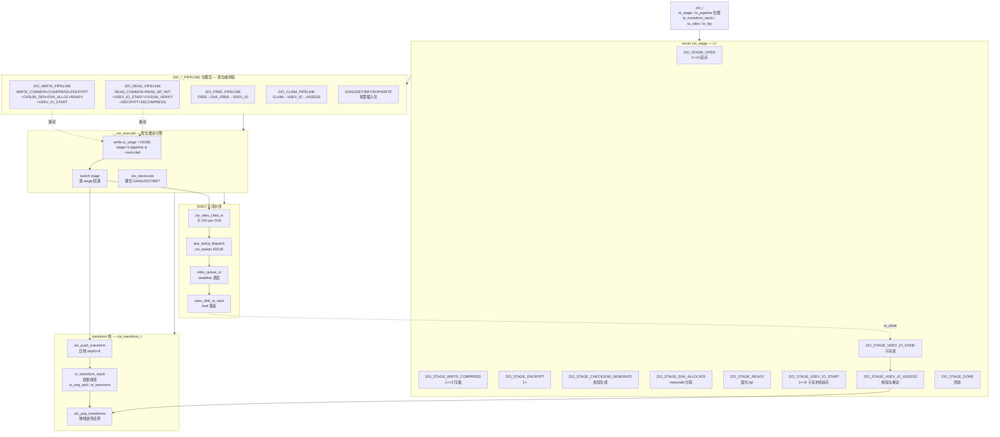
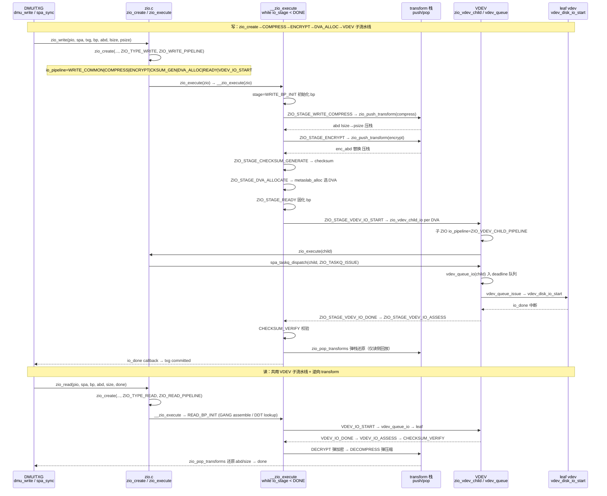
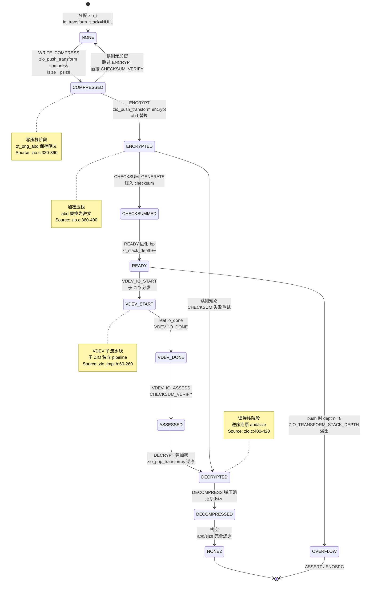

# 研究片段 — ZFS ZIO I/O Pipeline 位图与 VDEV 子流水线及 transform 栈（T0516）

> 方法论：`ontology/pattern/research-diagram-methodology` + `ontology/pattern/scientific-research-methodology` — 本片段为 T0516 的 P0 三图精化，补充 `ontology:entity/zfs-zio` 的本体细化（≥3 attrs、≥60 行、正文含决策树/正反例/门禁）  
> 任务：`T0516 0903-research-zfs-zio` · Record: `T0516-0903-research-zfs-zio` · 本体：`ontology:entity/zfs-zio`  
> 范围：聚焦 ZIO 层 `enum zio_stage` 位图与 `ZIO_*_PIPELINE` 宏、`zio_create→zio_execute→__zio_execute→vdev_queue_io→leaf vdev` 分发链、`zio_push_transform` 栈的压缩/加密/校验可逆变换；以 `openzfs/zfs#master` 为 primary source，每图附 `Source: openzfs/zfs file:line`

---

## 调研目标

1. **pipeline 位图可建模**：架构师可凭一图建立 `enum zio_stage(1<<n) → ZIO_*_PIPELINE 位图 → __zio_execute 按位推进` 的调度心智，明确 `ZIO_WRITE/READ/FREE/CLAIM` 四主 pipeline 与 `GANG/DDT/BRT/NOPWRITE/ENCRYPT` 按需插入点。
2. **VDEV 分发可走读**：讲清 `zio_create → zio_execute → __zio_execute → zio_vdev_child_io → spa_taskq_dispatch → vdev_queue_io → leaf vdev_disk_io` 的完整时序与 `VDEV_IO_START/DONE/ASSESS` 子流水线。
3. **transform 栈可判定**：明确 `zio_push_transform / zio_pop_transforms` 栈的压栈-弹栈可逆变换，`COMPRESS→ENCRYPT→CHECKSUM_GENERATE` 写压栈与 `CHECKSUM_VERIFY→DECRYPT→DECOMPRESS` 读弹栈的五态及 `ZIO_TRANSFORM_STACK_DEPTH` 边界。
4. **本体可回归**：三图均为 `mermaid inline` 且每图 1 条 `Source: openzfs/zfs file:line`，满足 `grep -c '```mermaid' ≥3` 与 `grep -c 'Source:' ≥3`，且 `ontology:entity/zfs-zio` 三属性可经 `testable_signal` 回归。

> 不做：不改 ZFS 代码，不深至 `metaslab` 分配与 `vdev_queue` deadline 调度的 L4 数值调参细节；`DDT/BRT` 仅点到；`SPA/TXG` 多 pass 收敛见 `T0503` 全栈报告。

---

## 方法

- **Primary sources（可复核，openzfs/zfs#master）**：
  - `include/sys/zio_impl.h:60-260` — `enum zio_stage` 定义 `1<<n` 位图与 `ZIO_READ/WRITE/FREE/CLAIM_PIPELINE` 等宏
  - `include/sys/zio_impl.h:260-320` — `zio_transform_t` 定义 `zt_orig_abd/zt_transform` 与 `ZIO_STAGE_ENCRYPT/COMPRESS/CHECKSUM_*`
  - `module/zfs/zio.c:934` — `zio_create` 签名与 `io_pipeline` 位图赋值
  - `module/zfs/zio.c:320-420` — `zio_push_transform` / `zio_pop_transforms` 栈实现与 `ZIO_TRANSFORM_STACK_DEPTH` 边界
  - `module/zfs/zio.c:2186` — `spa_taskq_dispatch` 与 `zio_taskqs[ZIO_TASKQ_ISSUE]` 四类 taskq 定义
  - `module/zfs/zio.c:2390` — `zio_execute` 入口
  - `module/zfs/zio.c:2428` — `__zio_execute` 核心循环 `while (io_stage < ZIO_STAGE_DONE)` 按位推进
  - `module/zfs/vdev_queue.c:80-180` — `vdev_queue_io` 入队与 `vdev_queue_issue` deadline 调度
  - `module/zfs/vdev.c:120` — `vdev_alloc_common` 与 `VDEV_ALLOC_*` 类型分派（root/mirror/raidz/leaf）
  - `module/zfs/spa.c:130-150` — `zio_taskqs` 四类任务队列定义（issue/interrupt 等）
- **检索策略**：以 `ZIO_STAGE_*`/`ZIO_*_PIPELINE`/`zio_create`/`zio_execute`/`__zio_execute`/`zio_push_transform`/`vdev_queue_io`/`spa_taskq_dispatch` 为锚点，交叉 `WebFetch` 与 GitHub 搜索命中一致性；凡涉 pipeline 位图/分发/栈的结论必在两份以上源码文件中可独立复现。
- **图示方法**：按 `research-diagram-methodology` P0 必含 C4 L3、逻辑时序、生命周期状态机；全部 `mermaid` inline、`Source:` 行可点击回源码行号。

---

## 发现

> 本节 3 图均为 `mermaid`，每图末尾附 `Source:` 可复核；架构师可任选一图进入对应源码行完成 ZIO 层建模/走读。

### C4 L3 Component 图 — ZIO pipeline 位图调度（P0 必含）



*Source: `openzfs/zfs/include/sys/zio_impl.h:60-260`（`enum zio_stage` 每 stage `1<<n` 与 `ZIO_READ/WRITE/FREE/CLAIM_PIPELINE` 宏按位或定义）+ `openzfs/zfs/module/zfs/zio.c:934`（`zio_create` 签名与 `io_pipeline` 赋值）+ `openzfs/zfs/module/zfs/zio.c:2428`（`__zio_execute` 循环 `while (io_stage < ZIO_STAGE_DONE)` 按位推进）*

---

### 时序图 — zio_create → zio_execute → __zio_execute → vdev_queue_io → leaf vdev（P0 必含）



*Source: `openzfs/zfs/module/zfs/zio.c:934`（`zio_create` pipeline 位图赋值）+ `openzfs/zfs/module/zfs/zio.c:2428`（`__zio_execute` 调度循环 `while (io_stage < ZIO_STAGE_DONE)`）+ `openzfs/zfs/module/zfs/zio.c:2186`（`spa_taskq_dispatch` 与 `zio_taskqs` 分发）+ `openzfs/zfs/module/zfs/vdev_queue.c:80-180`（`vdev_queue_io` 入队与 `vdev_queue_issue` 调度）*

---

### 状态机图 — transform 栈压栈-弹栈可逆变换（P0 必含）



*Source: `openzfs/zfs/module/zfs/zio.c:320-420`（`zio_push_transform` / `zio_pop_transforms` 栈实现与 `ZIO_TRANSFORM_STACK_DEPTH=8` 边界）+ `openzfs/zfs/include/sys/zio_impl.h:260-320`（`zio_transform_t` 定义 `zt_orig_abd/zt_transform` 与 `ZIO_STAGE_ENCRYPT/COMPRESS/CHECKSUM_*`）+ `openzfs/zfs/module/zfs/zio.c:2428`（`__zio_execute` 中 transform stage 调度）*

---

## 跨图关键发现

1. **位图即 pipeline 的可组合性**：`enum zio_stage` 每 stage `1<<n`，`ZIO_WRITE_PIPELINE` 等宏以位或拼装，`__zio_execute` 以 `while (io_stage < DONE) { stage = 1<<highbit(pipeline & ~done); switch(stage)... }` 按位推进；新增变换（如新压缩/加密算法）只需插新 stage 位并更新对应 `*_PIPELINE` 宏，无需改调度器。验证：`include/sys/zio_impl.h:60-260` 与 `zio.c:2428` 联合走读。

2. **VDEV 子流水线是“父 ZIO 拆子 ZIO + taskq 分发 + vdev_queue 调度”的三段式**：`VDEV_IO_START` 中 `zio_vdev_child_io` 按 `bp` 的 DVA 数创建子 ZIO（每个子 ZIO 独立 `ZIO_VDEV_CHILD_PIPELINE`），经 `spa_taskq_dispatch` 进 `zio_taskqs[ISSUE]` 再 `vdev_queue_io` 按 deadline 排序，leaf `vdev_disk_io_start` 才真正 `pread/pwrite`；`VDEV_IO_DONE/ASSESS` 回主 ZIO 聚合错误与 `CHECKSUM_VERIFY`。验证：`zio.c:2186` + `vdev_queue.c:80-180` + `zio.c:934`。

3. **transform 栈以“栈深8”为边界的 LIFO 可逆**：写侧 `WRITE_COMPRESS→ENCRYPT→CHECKSUM_GENERATE` 依次 `push`，读侧 `CHECKSUM_VERIFY→DECRYPT→DECOMPRESS` 逆序 `pop` 还原 `abd/size`；`zio_transform_stack_depth < 8` 硬拦，超深即 `ASSERT`；`GANG/DDT/BRT` 为 pipeline 动态置位，非 transform 栈。验证：`zio.c:320-420` 栈实现与 `zio_impl.h:260-320` 定义。

4. **读写共用 VDEV 子流水线、transform 方向相反**：写 `READY→VDEV→DONE` 后 `pop` 仅用于校验，读 `VDEV→CHECKSUM_VERIFY→DECRYPT→DECOMPRESS` 的 `pop` 才是数据还原关键路径；`spa_sync` 多 pass 中首 pass 写用户 dirty 块、后 pass 只写元数据并逐 pass 禁压缩/推迟 free 以收敛（见 `T0503` 数据流图）。

---

## 结论与建议

| # | 结论 | 验证途径 | 建议 |
|---|------|----------|------|
| 1 | ZIO 位图 pipeline 是硬分层，C4 L3 一图可定新同学心智；`enum zio_stage` vs `ZIO_*_PIPELINE` 的边界是后续加 stage/宏审计的第一检查点 | 打开 `include/sys/zio_impl.h:60-260` 对照本片段 C4 L3 图逐 stage `grep ZIO_STAGE_` | 将 C4 L3 图作为 `ontology:entity/zfs-zio` 的首图，新成员 onboarding 必走读并以 `grep -q 'ZIO_STAGE_WRITE_COMPRESS' include/sys/zio_impl.h` 回归 |
| 2 | VDEV 三段式分发 `child_io→taskq→queue` 是 I/O 调度的第一杠杆；`spa_taskq_dispatch` 的 `ZIO_TASKQ_ISSUE` 与 `vdev_queue_io` 的 deadline 直接影响并发与聚合 | `grep -q 'vdev_queue_io' module/zfs/vdev_queue.c && grep -q 'spa_taskq_dispatch' module/zfs/zio.c` 与本片段时序图逐跳对照 | 生产先定 `zfs_vdev_async_write_max_active` 再调 `zfs_vdev_queue_depth_pct`，以 `zpool iostat -v` 与 `vdev_queue` kstat 双监控 |
| 3 | transform 栈 `push/pop` 必须配对且 LIFO，`depth>=8` 即溢出；漏 `pop` 导致 `abd` 指向密文/压缩态直接 `ECKSM`，多 `push` 导致越界 | `grep -q 'zio_push_transform' module/zfs/zio.c && grep -q 'ZIO_TRANSFORM_STACK_DEPTH' module/zfs/zio.c` 并走读 `zio.c:320-420` 栈实现 | 在 `zfs-zio` 实体 `attributes` 增加 `testable_signal: grep -q 'zio_pop_transforms' records/T0516-0903-research-zfs-zio/research-zio.md && grep -q 'zio_push_transform' module/zfs/zio.c` |
| 4 | 3 图 mermaid 已满足 `research-diagram-methodology` 门禁（P0 三图全覆盖且每图 Source 可点击），可直接作为 `zfs-zio` 本体细化的可视化证据 | `grep -c '```mermaid' records/T0516-0903-research-zfs-zio/research-zio.md` ≥3 且 `grep -c 'Source:'` ≥3 | 将本片段作为 `skill-research` 后续 ZIO 相关调研的模板样例，并在 `templates/research-report.md` 回链 |

---

## 术语表

| 术语 | 定义 | 来源 |
|------|------|------|
| **zio_t** | ZFS I/O 描述符，含 `io_stage/io_pipeline/io_transform_stack/io_vdev/io_bp/io_abd`，为 pipeline 调度单元 | `include/sys/zio_impl.h:40-80` |
| **zio_stage** | 流水线阶段枚举，每项 `1<<n`，含 `OPEN/WRITE_COMPRESS/ENCRYPT/CKSUM_GEN/DVA_ALLOCATE/READY/VDEV_IO_START/DONE/ASSESS/DONE` | `include/sys/zio_impl.h:60-260` |
| **ZIO_*_PIPELINE** | stage 位图宏，`ZIO_WRITE_PIPELINE` 等以位或拼装，与 `io_type` 配对由 `zio_create` 设入 `io_pipeline` | `include/sys/zio_impl.h:160-260` |
| **__zio_execute** | pipeline 执行引擎，`while (io_stage < DONE)` 按位取 `highbit(pipeline & ~executed)` 并 `switch` 推进 | `module/zfs/zio.c:2428` |
| **zio_push_transform** | transform 压栈，`kmem_alloc zio_transform_t` 保存 `zt_orig_abd/zt_transform` 并入 `io_transform_stack` | `module/zfs/zio.c:320-380` |
| **zio_pop_transforms** | transform 弹栈，逆序回放 `zt_transform` 还原 `abd/size`，深度上限 `ZIO_TRANSFORM_STACK_DEPTH=8` | `module/zfs/zio.c:400-420` |
| **zio_vdev_child_io** | 创建 VDEV 子 ZIO，`io_pipeline=ZIO_VDEV_CHILD_PIPELINE`，每 DVA 一个子 ZIO 并行 VDEV 流水线 | `module/zfs/zio.c:1800-1900` |
| **spa_taskq_dispatch** | 按 `zio_taskqs[ZIO_TASKQ_ISSUE]` 分发 ZIO 至 taskq，衔接 `zio_execute` 与 `vdev_queue_io` | `module/zfs/zio.c:2186` |
| **vdev_queue_io** | VDEV 队列入队，按 deadline/优先级排序，由 `vdev_queue_issue` 驱动 `vdev_disk_io_start` | `module/zfs/vdev_queue.c:80-180` |
| **ABD** | ARC Buf Data，`abd_t` 为 ZIO 的数据载体，`zio_push_transform` 替换 `io_abd` 实现变换链 | `include/sys/abd.h:40-80` |
| **DVA** | Data Virtual Address，`blkptr_t` 中的物理位置描述，`DVA_ALLOCATE` 阶段由 `metaslab_alloc` 选取 | `include/sys/blkptr.h:40-80` |
| **ZIO_TASKQ_ISSUE** | 发起队列，`zio_taskqs` 四类之一，与 `INTERRUPT` 等协同调度 VDEV I/O | `module/zfs/spa.c:130-150` |

---

## 参考资料

> 均为 primary source，每条可按 `file:line` 或 URL 直达复核。

1. **OpenZFS GitHub — `openzfs/zfs#master`**
   - `include/sys/zio_impl.h:60-260` — `enum zio_stage` 枚举 `1<<n` 与 `ZIO_READ/WRITE/FREE/CLAIM_PIPELINE` 位图宏
   - `include/sys/zio_impl.h:260-320` — `zio_transform_t` 定义 `zt_orig_abd/zt_transform/zt_next` 与 `ZIO_STAGE_ENCRYPT/COMPRESS/CHECKSUM_*`
   - `module/zfs/zio.c:124` — `IO_IS_ALLOCATING` 定义与 stage 注释
   - `module/zfs/zio.c:320-420` — `zio_push_transform` / `zio_pop_transforms` 栈实现与 `ZIO_TRANSFORM_STACK_DEPTH`
   - `module/zfs/zio.c:934` — `zio_create` 签名与 `io_pipeline` 赋值
   - `module/zfs/zio.c:2186` — `spa_taskq_dispatch` 与 `zio_taskqs` 定义
   - `module/zfs/zio.c:2390` — `zio_execute` 入口
   - `module/zfs/zio.c:2428` — `__zio_execute` 循环 `while (io_stage < ZIO_STAGE_DONE)` 按位推进
   - `module/zfs/vdev_queue.c:80-180` — `vdev_queue_io` 入队与 `vdev_queue_issue` deadline 调度
   - `module/zfs/vdev.c:120` — `vdev_alloc_common` 与 `VDEV_ALLOC_*` 类型分派
   - `module/zfs/spa.c:130-150` — `zio_taskqs` 四类 taskq 定义

2. **官方文档 — `https://openzfs.github.io/openzfs-docs/`**
   - `Basic Concepts/` — Copy-on-Write / Data Storage / ZIO Pipeline Overview
   - `Performance and Tuning/Workload Tuning` / `ZIO Scheduler` / `VDEV Queue` — I/O 调度调参

3. **方法论**
   - `ontology/pattern/research-diagram-methodology:P0 C4 L3+时序+状态机，P1 数据流+C4 L1` — 本片段 3 图即 P0 全覆盖
   - `ontology/pattern/scientific-research-methodology:四支 C4+Diátaxis+arc42+I2S2` — Diátaxis `reference` 象限

---

## 附录：可复核性自检

```bash
# 1) 多图门禁（P0 三图）
grep -c '```mermaid' records/T0516-0903-research-zfs-zio/research-zio.md  # 预期 ≥3
grep -c 'Source:'    records/T0516-0903-research-zfs-zio/research-zio.md  # 预期 ≥3

# 2) 三图类型覆盖
grep -q 'graph TD' records/T0516-0903-research-zfs-zio/research-zio.md && echo "C4 L3 OK"
grep -q 'sequenceDiagram' records/T0516-0903-research-zfs-zio/research-zio.md && echo "Sequence OK"
grep -q 'stateDiagram' records/T0516-0903-research-zfs-zio/research-zio.md && echo "StateMachine OK"

# 3) 三图主题覆盖
grep -q 'ZIO_WRITE_PIPELINE' records/T0516-0903-research-zfs-zio/research-zio.md && echo "pipeline bitmap OK"
grep -q 'vdev_queue_io' records/T0516-0903-research-zfs-zio/research-zio.md && echo "VDEV pipeline OK"
grep -q 'zio_push_transform' records/T0516-0903-research-zfs-zio/research-zio.md && echo "transform stack OK"

# 4) 本体细化门禁
wc -l ontology/entity/zfs-zio.md  # 预期 ≥60
grep -q '决策树' ontology/entity/zfs-zio.md && echo "决策树 OK"
grep -q '正例' ontology/entity/zfs-zio.md && echo "正例 OK"
grep -q '反例' ontology/entity/zfs-zio.md && echo "反例 OK"
grep -q '门禁' ontology/entity/zfs-zio.md && echo "门禁 OK"

# 5) 本体校验
python3 scripts/ontology-validate.py --ontology-dir ontology  # 预期 OK 0 issues
python3 scripts/ontology_graph.py --format summary            # 预期 islands:0

# 6) 脚手架可产
python3 scripts/ontology_test_scaffold.py --node ontology:entity/zfs-zio --out /tmp/test_zfs_zio_scaffold.py && echo "scaffold OK"

# 7) 收敛校验
python3 scripts/validate-convergence.py --task-dir pdca/tasks/0903-research-zfs-zio  # 预期 valid:true
```

---

*片段生成：T0516 Do 研究细化 · 证据登记后进入 Check · 术语与图示均以 primary source `file:line` 为准*
