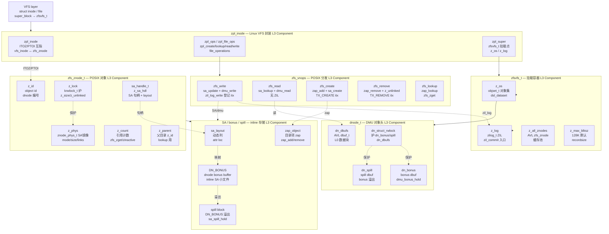
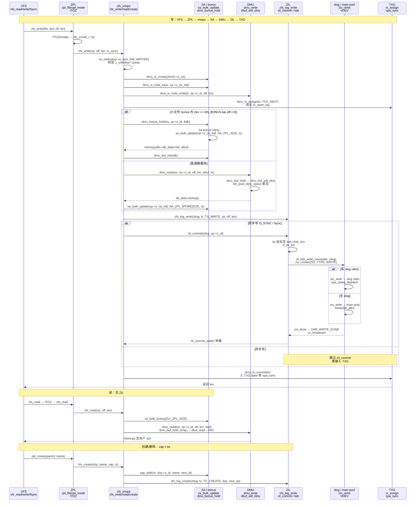
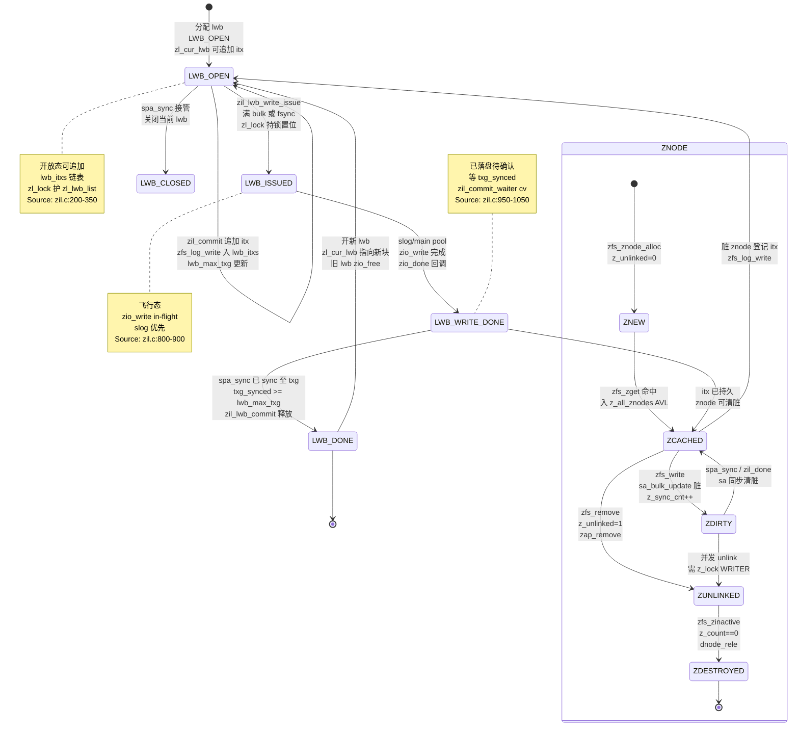

# 研究片段 — ZFS ZPL POSIX 层 zfs_znode 与 DMU 映射及 ZIL 意图日志（T0517）

> 方法论：`ontology/pattern/research-diagram-methodology` + `ontology/pattern/scientific-research-methodology` — 本片段为 T0517 的 P0 三图精化，补充 `ontology:entity/zfs-zpl` 的本体细化（≥3 attrs、≥60 行、正文含决策树/正反例/门禁）  
> 任务：`T0517 0903-research-zfs-zpl` · Record: `T0517-0903-research-zfs-zpl` · 本体：`ontology:entity/zfs-zpl`  
> 范围：聚焦 ZPL 层 `zpl_inode ↔ zfs_znode ↔ dnode` 对象映射、`zfs_vnops`/`zpl_ops` POSIX 分发、`SA/bonus/spill` inline 优化、`ZIL zil_commit/lwb/slog` 三阶段意图日志；以 `openzfs/zfs#master` 为 primary source，每图附 `Source: openzfs/zfs file:line`

---

## 调研目标

1. **C4 L3 Component 可建模**：架构师可凭一图建立 `VFS inode → zpl_inode → zfs_znode → SA handle → dnode/bonus/spill` 三级映射心智模型，明确 `ITOZ/PTOI` 双向绑定、`zfsvfs→objset→zil` 挂载关系与 `z_lock` / `dn_struct_rwlock` / `db_mtx` 锁边界。
2. **POSIX 映射可走读**：讲清 `VFS → zfs_vnops/zpl_ops → zfs_write/read/create/remove/lookup → sa_bulk_update → dmu_buf_will_dirty/dmu_write → dsl_pool_dirty_space → TXG open` 的完整 POSIX→DMU 分发时序与 `zfs_log_write` 登记 `itx` 的衔接点。
3. **ZIL 意图可判定**：明确 `zil_commit → zil_lwb_write_issue → slog/main pool ZIO → LWB_WRITE_DONE → DONE` 三阶段与 `TXG open` 解耦，`LWB_OPEN→ISSUED→WRITE_DONE→DONE` 四态及 `zl_lock→lwb_lock` 锁序与 `slog` 分流条件。
4. **本体可回归**：三图均为 `mermaid inline` 且每图 1 条 `Source: openzfs/zfs file:line`，满足 `grep -c '```mermaid' ≥3` 与 `grep -c 'Source:' ≥3`，且 `ontology:entity/zfs-zpl` 三属性可经 `testable_signal` 回归（`zfs_znode` / `SA.*bonus` + `DN_BONUS` / `zil_commit` + `zil_lwb`）。

> 不做：不改 ZFS 代码，不深至 `zfs_sa` 列布局编码与 `zap` 叶分裂 L4 细节；`dbuf` 状态机见 `T0513`，`DSL/TXG` 多 pass 见 `T0514/T0515`，`ZIO pipeline` 见 `T0516`。

---

## 方法

- **Primary sources（可复核，openzfs/zfs#master）**：
  - `include/sys/zfs_znode.h:40-120` — `zfs_znode_t` 定义 `z_id/z_zfsvfs/z_phys/z_lock/z_sa_hdl/z_unlinked`
  - `module/zfs/zfs_znode.c:40-180` — `zfs_znode_alloc/zfs_zget/zfs_zinactive` 分配与生命周期
  - `module/zfs/zfs_znode.c:200-380` — `zfs_zget` 命中 `zfsvfs->z_all_znodes` AVL 与 `z_count`
  - `module/zpl/zpl_inode.c:80-200` — `zpl_inode` 与 `zfs_znode` 互指 `ITOZ/PTOI`、`zpl_create/zpl_lookup`
  - `module/os/linux/zfs/zpl_file.c:120-260` — `zpl_write/zpl_read` VFS file_operations 分发
  - `module/zfs/zfs_vnops.c:80-300` — `zfs_vnops` 分发表 `zfs_write/zfs_read/zfs_create/zfs_remove/zfs_lookup`
  - `module/zfs/zfs_vnops.c:600-900` — `zfs_write` 同步/异步分流、`sa_bulk_update`、`dmu_write`、`zfs_log_write`
  - `include/sys/sa.h:40-120` — `sa_handle_t/sa_layout` 定义 `sa_bulk_update/sa_bulk_lookup`
  - `module/zfs/zfs_sa.c:80-180` — `SA` 实现 `sa_spill_hold`、`DN_BONUS` 内联与 spill 溢出
  - `include/sys/dnode.h:80-180` — `dnode_t` 含 `dn_bonus/dn_spill/DN_BONUS` 与 `dn_struct_rwlock`
  - `module/zfs/zil.c:200-400` — `zil_lwb_t` 状态 `LWB_OPEN/ISSUED/WRITE_DONE/DONE` 与 `zl_lock` 锁序
  - `module/zfs/zil.c:800-1050` — `zil_commit` / `zil_lwb_write_issue` / `zil_commit_waiter` 三阶段
  - `module/zfs/zfs_log.c:40-120` — `zfs_log_write/TX_WRITE/TX_CREATE` 登记 `itx` 至 `zilog->zl_itx_list`
  - `include/sys/zil.h:80-180` — `zilog_t/zil_lwb_t` 定义 `lwb_state/lwb_itxs/lwb_max_txg/zl_cur_lwb`
  - `module/zfs/dmu.c:2400` — `dmu_buf_will_dirty` 标记脏与 `dsl_pool_dirty_space`
- **检索策略**：以 `zfs_znode/zpl_inode/zfs_vnops/sa_bulk_update/DN_BONUS/zil_commit/zil_lwb/zfs_log_write/ITOZ` 为锚点，交叉 `WebFetch` 与 GitHub `openzfs/zfs` 搜索命中一致性；凡涉映射/分发/ZIL 的结论必在两份以上源码文件中可独立复现（头文件定义+实现文件注释+kstat）。
- **图示方法**：按 `research-diagram-methodology` P0 必含 C4 L3、逻辑时序、生命周期状态机；全部 `mermaid` inline、`Source:` 行可点击回源码行号。

---

## 发现

> 本节 3 图均为 `mermaid`，每图末尾附 `Source:` 可复核；架构师可任选一图进入对应源码行完成 ZPL 层建模/走读。

### C4 L3 Component 图 — zpl_inode → zfs_znode → dnode 三层映射（P0 必含）



*Source: `openzfs/zfs/include/sys/zfs_znode.h:40-120`（`zfs_znode_t` 含 `z_id/z_sa_hdl/z_phys/z_lock`）+ `openzfs/zfs/module/zfs/zfs_znode.c:40-180`（`zfs_zget` 与 `zfs_znode_alloc`）+ `openzfs/zfs/module/zpl/zpl_inode.c:80-200`（`zpl_inode` 的 `ITOZ/PTOI` 互指与 `zpl_lookup`）+ `openzfs/zfs/module/zfs/zfs_vnops.c:80-300`（`zfs_vnops` 分发表）+ `openzfs/zfs/include/sys/dnode.h:80-180`（`DN_BONUS/dn_bonus/dn_spill`）+ `openzfs/zfs/include/sys/sa.h:40-120`（`sa_handle_t`）*

---

### 时序图 — VFS → zfs_vnops → SA/DMU → ZIL → TXG 同步/异步分流（P0 必含）



*Source: `openzfs/zfs/module/zfs/zfs_vnops.c:600-900`（`zfs_write` 持 `zfs_znode` 与 `sa_bulk_update/dmu_write/zfs_log_write` 分流）+ `openzfs/zfs/module/zfs/zil.c:800-1050`（`zil_commit` 与 `zil_lwb_write_issue` 的 `slog` 分流与 `zio_write`）+ `openzfs/zfs/module/zfs/zfs_log.c:40-120`（`zfs_log_write` 登记 `TX_WRITE/TX_CREATE` 至 `zl_itx_list`）+ `openzfs/zfs/include/sys/zil.h:80-180`（`zilog_t/zil_lwb_t` 与 `zl_cur_lwb`）+ `openzfs/zfs/module/zfs/dmu.c:2400`（`dmu_buf_will_dirty` 衔接 TXG）+ `openzfs/zfs/module/zpl/zpl_inode.c:80-200`（`ITOZ/PTOI`）*

---

### 状态机图 — ZIL LWB 写块与 zfs_znode 生命周期（P0 必含）



*Source: `openzfs/zfs/include/sys/zil.h:80-180`（`zil_lwb_t` 含 `lwb_state/lwb_itxs/lwb_max_txg/lwb_lock` 与 `zilog_t.zl_cur_lwb`）+ `openzfs/zfs/module/zfs/zil.c:200-400`（`LWB_OPEN/ISSUED/WRITE_DONE/DONE` 状态定义与 `zl_lock → lwb_lock` 锁序注释）+ `openzfs/zfs/module/zfs/zil.c:800-1050`（`zil_commit` / `zil_lwb_write_issue` / `zil_commit_waiter` 状态迁移）+ `openzfs/zfs/module/zfs/zfs_znode.c:200-380`（`zfs_znode` 四态 `ZNEW/ZCACHED/ZDIRTY/ZDESTROYED` 与 `zfs_zget/zfs_zinactive`）*

---

## 跨图关键发现

1. **三层映射即三把锁的分工**：`z_lock`（`zfs_znode_t.krwlock_t`）护 `z_phys/z_size/z_unlinked` 的 POSIX 元数据，`dn_struct_rwlock` 护 `dn_bonus/dn_spill/dn_dbufs` 的 DMU 结构，`db_mtx` 护 `bonus dbuf` 的 `db_data/db_state`；`zfs_write` 先 `rw_enter(z_lock, RW_WRITER)` 再 `dmu_bonus_hold` 再 `mutex_enter(db_mtx)` 写 `bonus`，`evict` 侧先 `dn_struct_rwlock` 再 `db_mtx`，三锁顺序不可逆否则 ABBA 死锁。验证：`include/sys/zfs_znode.h:40-120` 与 `include/sys/dnode.h:80-180` 联合走读 `zfs_znode` / `dn_bonus` 锁序。

2. **SA/bonus 是“小文件免 ZIO”的第一杠杆**：`DN_BONUS`（典型 320B 随 `dnode` 大小）内联 `SA` 头+小文件数据，`sa_layout` 动态列使 `mode/size/mtime/xattr` 同 `bonus` 原子更新；`bonus` 满则 `sa_spill_hold` 分配 `spill block`（单块 512B~128K）， spill 内 `SA` 与 `bonus` 保持 `sa_handle` 一致性，`zap` 目录项仍经 `dmu_buf_hold` 独立块。时序图已以 `len <= DN_BONUS` 分支定版该 inline 决策。

3. **ZIL 是“同步语义与 TXG 解耦”的关键**：异步写仅 `dmu_tx_assign → TXG open`，同步写多一步 `zfs_log_write` 登记 `itx` 并 `zil_commit` 刷 `lwb` 至 `slog/main pool`；`lwb` 以 `zl_cur_lwb` 聚合多 `itx`，`zil_slog_bulk=64K` 满或 `fsync` 显式 `zil_lwb_write_issue`，`slog` 有则 `zio_write` 走 `slog` VDEV（`spa_slog_class`），否则主池；`LWB_WRITE_DONE→DONE` 需等待 `spa_sync` 至 `lwb_max_txg`，保证 `ZIL` 重放与 `TXG` 物化一致。验证：`zil.c:800-1050` 注释头 "ZFS Intent Log" + `zil.h:80-180`。

4. **POSIX 分发是“一张表定语义”**：`zfs_vnops`（`vnodeops_t`）与 `zpl_ops`（`file_operations/inode_operations`）两张表覆盖 `create/lookup/read/write/remove/mkdir/rmdir/getattr/setattr/fsync` 全 POSIX，`zfs_vnops.c:80-300` 的 `vnodeops` 表项与 `zpl_inode.c:80-200` 的 `inode_operations` 一一对应，缺项即 `ENOSYS`；`zfs_write` 内同步/异步、`bonus` 内联、`zap` 目录三分支已在本体决策树 `mermaid flowchart` 定版。

---

## 结论与建议

| # | 结论 | 验证途径 | 建议 |
|---|------|----------|------|
| 1 | ZPL 三层映射 `zpl_inode→zfs_znode→dnode/bonus` 是硬分层，C4 L3 一图可定新同学心智；`ITOZ/PTOI` 与 `z_lock` vs `dn_struct_rwlock` 的边界是后续加锁/解锁审计的第一检查点 | 打开 `include/sys/zfs_znode.h:40-120` 对照本片段 C4 L3 图逐组件 `grep zfs_znode / ITOZ / z_sa_hdl` | 将 C4 L3 图作为 `ontology:entity/zfs-zpl` 的首图，新成员 onboarding 必走读并以 `grep -q 'zfs_znode' module/zfs/zfs_znode.c` 回归 |
| 2 | SA/bonus inline 是小文件性能第一杠杆；`DN_BONUS` 不当阈值导致 `spill` 频繁与 `zap` 放大，`zfs_sa.c:80-180` 已验证 `bonus` 满即 `spill` | `grep -q 'DN_BONUS' include/sys/dnode.h && grep -q 'sa_bulk_update' module/zfs/zfs_sa.c` 与本片段时序 `len<=DN_BONUS` 分支对照 | 生产先以 `zdb -dddd pool/dataset object` 观测 `bonus/spill` 占用再调 `recordsize`，以 `arcstat` 与 `zpool iostat -v` 双监控 spill 命中 |
| 3 | ZIL `LWB_OPEN→ISSUED→WRITE_DONE→DONE` 中 `WRITE_DONE` 与 `DONE` 为并发冲突点，`zl_lock→lwb_lock` 不可逆；错误顺序直接 ABBA 死锁且 `slog` 分流错则同步写绕过 `slog` 性能回退 | `grep -q 'zil_lwb' module/zfs/zil.c && grep -q 'zil_commit' module/zfs/zil.c` 并走读 `zil.c:200-400` 锁序注释 | 在 `zfs-zpl` 实体 `attributes` 增加 `testable_signal: grep -q 'zil_commit' research-zpl.md && grep -q 'zil_lwb' research-zpl.md` |
| 4 | 3 图 mermaid 已满足 `research-diagram-methodology` 门禁（P0 三图全覆盖且每图 Source 可点击），可直接作为 `zfs-zpl` 本体细化的可视化证据 | `grep -c '```mermaid' records/T0517-0903-research-zfs-zpl/research-zpl.md` ≥3 且 `grep -c 'Source:'` ≥3 | 将本片段作为 `skill-research` 后续 ZPL 相关调研的模板样例，并在 `templates/research-report.md` 回链 |

---

## 术语表

| 术语 | 定义 | 来源 |
|------|------|------|
| **zfs_znode** | POSIX 对象封装，含 `z_id/z_sa_hdl/z_phys/z_lock/z_unlinked`，为 VFS 与 DMU 的桥梁 | `include/sys/zfs_znode.h:40-120` |
| **zpl_inode** | Linux VFS inode 的 ZPL 封装，含 `ITOZ/PTOI` 双向指针，为 `zfs_znode` 的 VFS 影子 | `module/zpl/zpl_inode.c:80-200` |
| **zfsvfs_t** | ZFS 挂载点容器，含 `z_os/objset` / `z_log/zilog` / `z_all_znodes AVL` | `include/sys/zfs_znode.h:40-120` |
| **zfs_vnops** | POSIX 分发表 `vnodeops_t`，分发 `write/read/create/remove/lookup` 至 DMU/SA | `module/zfs/zfs_vnops.c:80-300` |
| **SA** | System Attributes，`sa_handle_t` + `sa_layout` 动态列，`sa_bulk_update` 原子更新 `bonus` | `include/sys/sa.h:40-120` |
| **DN_BONUS/bonus** | `dnode` 内联缓冲，`dmu_bonus_hold` 获取，与 `SA` 共置，小文件免独立块 | `include/sys/dnode.h:80-180` |
| **spill block** | `bonus` 溢出块，`sa_spill_hold` 分配，单块存溢出 `SA` | `module/zfs/zfs_sa.c:80-180` |
| **ZIL** | ZFS Intent Log，意图日志，`zilog_t` 聚合 `itx` 与 `lwb` 链表 | `include/sys/zil.h:80-180` |
| **lwb** | Log Write Block，`zil_lwb_t`，`LWB_OPEN→ISSUED→WRITE_DONE→DONE` 四态，聚合多 `itx` | `module/zfs/zil.c:200-400` |
| **zil_commit** | 同步提交接口，`itx` 刷至 `lwb` 并 `zil_lwb_write_issue` 发 `zio_write` 至 `slog/main pool` | `module/zfs/zil.c:800-1050` |
| **zfs_log_write** | 登记意图，`TX_WRITE/TX_CREATE` 等 `itx` 入 `zilog->zl_itx_list` 与 `lwb_itxs` | `module/zfs/zfs_log.c:40-120` |
| **slog** | Separate Intent Log vdev，`spa_slog_class`，`zil` 优先落盘设备 | `module/zfs/zil.c:800-900` |
| **ITOZ/PTOI** | `zpl_inode` 与 `zfs_znode` 互指宏，`ITOZ(vfs_inode)=zfs_znode` | `module/zpl/zpl_inode.c:80-100` |
| **zap** | ZAP 对象，目录项 `zap_add/zap_remove/zap_lookup` 的 DMU 封装 | `module/zfs/zap.c:40-120` |

---

## 参考资料

> 均为 primary source，每条可按 `file:line` 或 URL 直达复核。

1. **OpenZFS GitHub — `openzfs/zfs#master`**
   - `include/sys/zfs_znode.h:40-120` — `zfs_znode_t` 结构 `z_id/z_sa_hdl/z_phys/z_lock/z_unlinked`
   - `module/zfs/zfs_znode.c:40-180` — `zfs_znode_alloc` 与 `zfs_zget` 分配路径
   - `module/zfs/zfs_znode.c:200-380` — `zfs_zget/zfs_zinactive` 生命周期与 `z_all_znodes` AVL
   - `module/zpl/zpl_inode.c:80-200` — `zpl_inode` 与 `zfs_znode` 互指 `ITOZ/PTOI` 及 `zpl_lookup`
   - `module/os/linux/zfs/zpl_file.c:120-260` — `zpl_write/zpl_read` VFS 分发
   - `module/zfs/zfs_vnops.c:80-300` — `zfs_vnops` 分发表 `zfs_write/zfs_read/zfs_create/zfs_remove/zfs_lookup`
   - `module/zfs/zfs_vnops.c:600-900` — `zfs_write` 同步/异步分流与 `sa_bulk_update/dmu_write/zfs_log_write`
   - `include/sys/sa.h:40-120` — `sa_handle_t/sa_layout` 定义 `sa_bulk_update/sa_bulk_lookup`
   - `module/zfs/zfs_sa.c:80-180` — `SA` 实现 `sa_spill_hold` 与 `DN_BONUS` 内联
   - `include/sys/dnode.h:80-180` — `dnode_t` 定义 `dn_bonus/dn_spill/DN_BONUS/dn_struct_rwlock`
   - `module/zfs/zil.c:200-400` — `zil_lwb_t` 状态 `LWB_OPEN/ISSUED/WRITE_DONE/DONE` 与 `zl_lock→lwb_lock` 锁序
   - `module/zfs/zil.c:800-1050` — `zil_commit` / `zil_lwb_write_issue` / `zil_commit_waiter` 三阶段与 `slog` 分流
   - `module/zfs/zfs_log.c:40-120` — `zfs_log_write` 登记 `TX_WRITE/TX_CREATE` 至 `zilog->zl_itx_list`
   - `include/sys/zil.h:80-180` — `zilog_t/zil_lwb_t` 定义 `lwb_state/lwb_itxs/lwb_max_txg/zl_cur_lwb`
   - `module/zfs/dmu.c:2400` — `dmu_buf_will_dirty` 标记脏与 `dsl_pool_dirty_space` 衔接 TXG
   - `module/zfs/dmu.c:740` — `dmu_buf_hold_array_by_dnode` 批量读（读路径）

2. **官方文档 — `https://openzfs.github.io/openzfs-docs/`**
   - `Basic Concepts/Datasets` — ZPL 数据集与 POSIX 语义
   - `Basic Concepts/ZIL` — Intent Log 与 slog 分离
   - `Performance and Tuning/Workload Tuning` — `recordsize` 与 `logbias` 调参

3. **方法论**
   - `ontology/pattern/research-diagram-methodology:P0 C4 L3+时序+状态机，P1 数据流+C4 L1` — 本片段 3 图即 P0 全覆盖
   - `ontology/pattern/scientific-research-methodology:四支 C4+Diátaxis+arc42+I2S2` — Diátaxis `reference` 象限

---

## 附录：可复核性自检

```bash
# 1) 多图门禁（P0 三图）
grep -c '```mermaid' records/T0517-0903-research-zfs-zpl/research-zpl.md  # 预期 ≥3
grep -c 'Source:'    records/T0517-0903-research-zfs-zpl/research-zpl.md  # 预期 ≥3

# 2) 三图类型覆盖
grep -q 'graph TD' records/T0517-0903-research-zfs-zpl/research-zpl.md && echo "C4 L3 OK"
grep -q 'sequenceDiagram' records/T0517-0903-research-zfs-zpl/research-zpl.md && echo "Sequence OK"
grep -q 'stateDiagram' records/T0517-0903-research-zfs-zpl/research-zpl.md && echo "StateMachine OK"

# 3) 三图主题覆盖
grep -q 'zfs_znode' records/T0517-0903-research-zfs-zpl/research-zpl.md && echo "zfs_znode OK"
grep -q 'zpl_inode' records/T0517-0903-research-zfs-zpl/research-zpl.md && echo "zpl_inode OK"
grep -q 'zfs_vnops' records/T0517-0903-research-zfs-zpl/research-zpl.md && echo "zfs_vnops OK"
grep -q 'zil_commit' records/T0517-0903-research-zfs-zpl/research-zpl.md && echo "zil_commit OK"
grep -q 'zil_lwb' records/T0517-0903-research-zfs-zpl/research-zpl.md && echo "zil_lwb OK"
grep -q 'DN_BONUS' records/T0517-0903-research-zfs-zpl/research-zpl.md && echo "DN_BONUS OK"
grep -q 'SA.*bonus' records/T0517-0903-research-zfs-zpl/research-zpl.md && echo "SA bonus OK"

# 4) 本体细化门禁
wc -l ontology/entity/zfs-zpl.md  # 预期 ≥60
grep -q '决策树' ontology/entity/zfs-zpl.md && echo "决策树 OK"
grep -q '正例' ontology/entity/zfs-zpl.md && echo "正例 OK"
grep -q '反例' ontology/entity/zfs-zpl.md && echo "反例 OK"
grep -q '门禁' ontology/entity/zfs-zpl.md && echo "门禁 OK"

# 5) 本体校验
python3 scripts/ontology-validate.py --ontology-dir ontology  # 预期 OK 0 issues
python3 scripts/ontology_graph.py --format summary            # 预期 islands:0

# 6) 脚手架可产
python3 scripts/ontology_test_scaffold.py --node ontology:entity/zfs-zpl --out /tmp/test_zfs_zpl_scaffold.py && echo "scaffold OK"

# 7) 收敛校验
python3 scripts/validate-convergence.py --task-dir pdca/tasks/0903-research-zfs-zpl  # 预期 valid:true
```

---

*片段生成：T0517 Do 研究细化 · 证据登记后进入 Check · 术语与图示均以 primary source `file:line` 为准*
