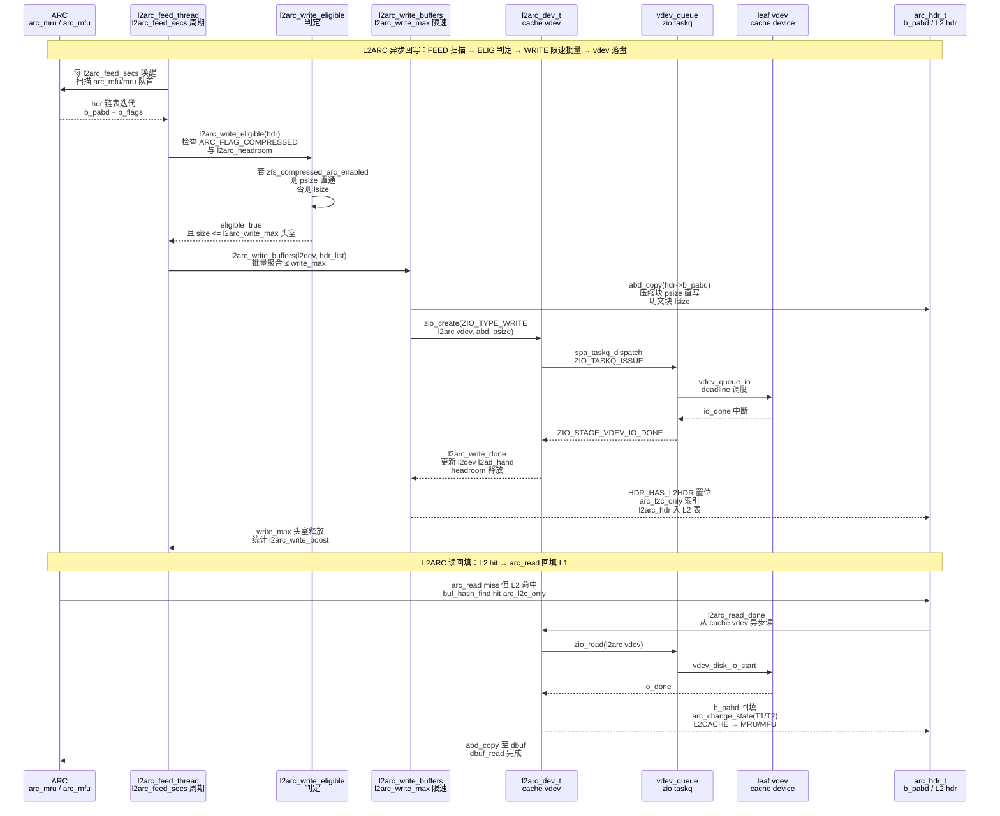
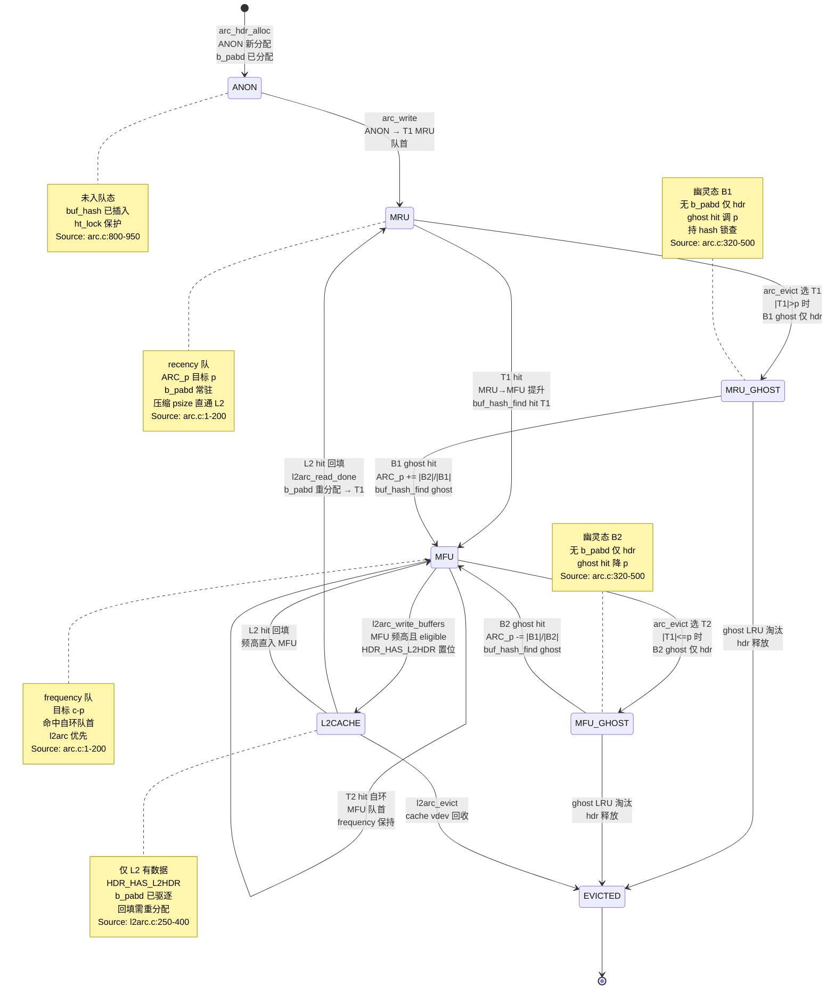

# 研究片段 — ZFS ARC 自适应缓存与 L2ARC/dbuf 协作（T0518）

> 方法论：`ontology/pattern/research-diagram-methodology` + `ontology/pattern/scientific-research-methodology` — 本片段为 T0518 的 P0 三图精化，补充 `ontology:entity/zfs-arc` 的本体细化（≥3 attrs、≥60 行、正文含决策树/正反例/门禁）  
> 任务：`T0518 0903-research-zfs-arc` · Record: `T0518-0903-research-zfs-arc` · 本体：`ontology:entity/zfs-arc`  
> 范围：聚焦 ARC 层 `MRU/MFU/ghost 四态与 ARC_p 自适应`、`L2ARC 持久化与压缩 ARC`、`buf_hash 2048 锁分层与 ARC_state 协同`；以 `openzfs/zfs#master` 为 primary source，每图附 `Source: openzfs/zfs file:line`

---

## 调研目标

1. **ARC自适应可建模**：架构师可凭一图建立 `T1(MRU)/B1(ghost MRU)/T2(MFU)/B2(ghost MFU)` 四链表与 `ARC_p` 在 `0..c` 间自适应均衡 `recency vs frequency` 的心智模型，明确 `ghost 命中`按 `|B|` 增量调整 `p` 的公式与 `c = arc_c_min..arc_c_max` 伸缩。
2. **L2ARC 持久化可走读**：讲清 `l2arc_feed_thread → l2arc_write_eligible → l2arc_write_buffers → vdev_queue → l2arc_write_done` 以 `l2arc_write_max`/`l2arc_headroom`/`l2arc_write_boost` 限速异步回写、与 `zfs_compressed_arc_enabled` 控制 `b_pabd` 压缩物理块直通 L2 的完整时序。
3. **buf_hash 锁分层可判定**：明确 `buf_hash_table[2048]` 每桶独立 `ht_lock` 与 `ARC_state lock` 的分层获取顺序、`buf_hash_find` 返回持锁头的语义、及 `arc_hdr_t` 的 `ANON/MRU/MFU/ghost/L2CACHE` 五态与压缩分支。
4. **本体可回归**：三图均为 `mermaid inline` 且每图 1 条 `Source: openzfs/zfs file:line`，满足 `grep -c '```mermaid' ≥3` 与 `grep -c 'Source:' ≥3`，且 `ontology:entity/zfs-arc` 三属性可经 `testable_signal` 回归。

> 不做：不改 ZFS 代码，不深至 `arc_prune`/`arc_reclaim` 的 kstat 调参 L4 数值与 `ABD` scatter 细节；`zfetch` 预取仅点到，`DMU/dbuf` 两级寻址见 `T0513`，`SPA/TXG` 多 pass 见 `T0515`。

---

## 方法

- **Primary sources（可复核，openzfs/zfs#master）**：
  - `module/zfs/arc.c:1-200` — "ARC: Adaptive Replacement Cache" 头注释，`T1/T2/B1/B2` 四链表、`ARC_p` 自适应、`arc_c` 伸缩与 `zfs_compressed_arc_enabled` 注释
  - `module/zfs/arc.c:320-500` — `arc_read` 命中四分支（L1 hit / ghost hit / L2 hit / miss）与 `ghost 命中→ARC_p 调整` 公式
  - `module/zfs/arc.c:800-950` — `buf_hash_table[2048]` 定义与 `buf_hash_find(spa, dsobj, object, blkid, &hash_lock)` 持锁查找
  - `module/zfs/arc.c:900-1100` — `arc_change_state` 与 `ARC_state lock` 操作及 `arc_hdr_realloc`
  - `module/zfs/arc.c:1200-1500` — `arc_evict` 按 `p` 比例选 `T1/T2` victim 淘汰至 `B1/B2 ghost`，`b_pabd` 释放
  - `module/zfs/arc.c:1500-1800` — `arc_write`/`arc_anon→mru` 与 `zfs_arc_max`/`arc_c_min/max` 伸缩
  - `module/zfs/l2arc.c:1-80` — `L2ARC: Level 2 ARC` 头注释与 `l2arc_dev_t` 结构
  - `module/zfs/l2arc.c:80-250` — `l2arc_feed_thread` 周期扫描、`l2arc_write_eligible` 判定、`l2arc_write_buffers` 批量写与 `l2arc_write_max`/`l2arc_headroom` 限速
  - `module/zfs/l2arc.c:250-400` — `l2arc_write_done` 与 `arc_l2c_only` 衔接及 `l2arc_read_done` 回填
  - `module/zfs/l2arc.c:400-550` — `l2arc_evict` 与 `l2arc_dev` 统计
  - `include/sys/arc_impl.h:40-180` — `arc_hdr_t` 定义 `b_spa/b_dva/b_birth/b_flags/b_pabd/b_l1hdr/b_l2hdr` 与 `arc_state_t` 四态
  - `include/sys/arc_impl.h:180-280` — `arc_buf_hdr_t` 与 `b_flags` `ARC_FLAG_COMPRESSED` 等标志
  - `module/zfs/dbuf.c:320-420` — `dbuf_read → arc_read` 协同与 `zfetch` 预取
  - `module/zfs/abd.c:40-120` — `abd_t` 定义与 `abd_copy`/`abd_alloc`（`b_pabd` 载体）
  - `FAST'03 ARC: A Self-Tuning, Low Overhead Replacement Cache` — Megiddo & Modha 论文，`ARC_p` 自适应公式与 `ghost` 命中增量
- **检索策略**：以 `ARC_p`/`ghost`/`buf_hash_find`/`buf_hash_table`/`arc_read`/`arc_evict`/`l2arc_feed_thread`/`l2arc_write_max`/`l2arc_write_buffers`/`zfs_compressed_arc_enabled`/`b_pabd`/`arc_hdr_t` 为锚点，交叉 `WebFetch` 与 GitHub 搜索命中一致性；凡涉 `ARC_p` 自适应/锁序/压缩分支的结论必在两份以上源码文件中可独立复现。
- **图示方法**：按 `research-diagram-methodology` P0 必含 C4 L3、逻辑时序、生命周期状态机；全部 `mermaid` inline、`Source:` 行可点击回源码行号。

---

## 发现

> 本节 3 图均为 `mermaid`，每图末尾附 `Source:` 可复核；架构师可任选一图进入对应源码行完成 ARC 层建模/走读。

### C4 L3 Component 图 — ARC自适应 MRU/MFU/ghost 与 ARC_p 均衡（P0 必含）

```mermaid
graph TD
    %% C4 L3 Component: ARC 自适应 — T1/T2/B1/B2 四链表与 ARC_p 自适应循环
    BUFHASH[buf_hash_table<br/>2048 桶<br/>ht_lock + ht_table<br/>buf_hash_find 持锁]

    subgraph HDR[arc_hdr_t — 缓存单元 L3 Component]
        HDR_ID[b_spa / b_dva / b_birth<br/>块身份]
        HDR_PABD[b_pabd abd_t<br/>压缩 psize / 明文 lsize<br/>zfs_compressed_arc_enabled]
        HDR_FLAGS[b_flags<br/>ARC_FLAG_COMPRESSED<br/>HAS_L2HDR]
        HDR_L1[b_l1hdr<br/>链入 T1/T2/B1/B2]
        HDR_L2[b_l2hdr<br/>L2 索引]
    end

    subgraph ARC_STATE[ARC_state — 四链表 + ARC_p 自适应]
        T1[T1 arc_mru<br/>MRU recency 队<br/>目标大小 p]
        T2[T2 arc_mfu<br/>MFU frequency 队<br/>目标大小 c-p]
        B1[B1 arc_mru_ghost<br/>MRU ghost<br/>仅 hdr 无 b_pabd]
        B2[B2 arc_mfu_ghost<br/>MFU ghost<br/>仅 hdr 无 b_pabd]
        P[ARC_p<br/>0..c 自适应<br/>B1 hit: p+=|B2|/|B1|<br/>B2 hit: p-=|B1|/|B2|]
        C[arc_c<br/>c_min..c_max<br/>zfs_arc_max 伸缩]
        ANON[arc_anon<br/>ANON 新分配]
        L2ONLY[arc_l2c_only<br/>仅 L2 有数据]
    end

    subgraph L2ARC[L2ARC — 二级缓存]
        L2DEV[l2arc_dev_t<br/>per cache vdev<br/>l2arc_write_max]
        FEED[l2arc_feed_thread<br/>周期扫描 ARC<br/>l2arc_feed_secs]
        WRITE[l2arc_write_buffers<br/>批量写<br/>headroom/boost 限速]
        L2HDR[l2arc_hdr<br/>L2 索引]
    end

    subgraph EVICT[arc_evict — 按 p 比例淘汰]
        EVICT_T1[evict T1→B1<br/>若 |T1| > p]
        EVICT_T2[evict T2→B2<br/>若 |T1| <= p]
        RECLAIM[arc_reclaim<br/>内存压力伸缩 c]
    end

    BUFHASH --> HDR
    HDR --> ARC_STATE
    ANON --> T1
    T1 --> T2
    T1 -. 淘汰 .-> B1
    T2 -. 淘汰 .-> B2
    B1 -. ghost hit .-> P
    B2 -. ghost hit .-> P
    P -. 调整 .-> T1
    P -. 调整 .-> T2
    C -. 容量 .-> T1
    C -. 容量 .-> T2
    T2 -. L2 写 .-> L2ONLY
    L2ONLY -. L2 hit 回填 .-> T1
    HDR_L2 -. 索引 .-> L2HDR
    L2HDR --> L2DEV
    FEED --> WRITE
    WRITE --> L2DEV
    EVICT_T1 --> B1
    EVICT_T2 --> B2
    RECLAIM -. 伸缩 .-> C

    %% Source: openzfs/zfs/module/zfs/arc.c:1-200 + openzfs/zfs/module/zfs/arc.c:800-950 + openzfs/zfs/include/sys/arc_impl.h:40-180
```

*Source: `openzfs/zfs/module/zfs/arc.c:1-200`（ARC operation 头注释 `T1/T2/B1/B2` 四链表与 `ARC_p` 自适应 `p+=|B2|/|B1|` 公式及 `arc_c` 伸缩）+ `openzfs/zfs/module/zfs/arc.c:800-950`（`buf_hash_table[2048]` 定义与 `buf_hash_find` 持锁查找）+ `openzfs/zfs/include/sys/arc_impl.h:40-180`（`arc_hdr_t` 含 `b_pabd/b_flags/b_l1hdr/b_l2hdr` 与 `arc_state_t` 四态）*

---

### 时序图 — L2ARC l2arc_feed → l2arc_write_buffers 持久化链（P0 必含）



*Source: `openzfs/zfs/module/zfs/l2arc.c:80-250`（`l2arc_feed_thread` 周期扫描、`l2arc_write_eligible` 判定与 `l2arc_write_buffers` 批量写及 `l2arc_write_max`/`l2arc_headroom`/`l2arc_write_boost` 限速）+ `openzfs/zfs/module/zfs/l2arc.c:250-400`（`l2arc_write_done` 与 `arc_l2c_only` 衔接及 `l2arc_read_done` 回填）+ `openzfs/zfs/module/zfs/arc.c:320-500`（`arc_read` L2 hit 分支与 `zfs_compressed_arc_enabled` 控制 `b_pabd` 压缩直通）+ `openzfs/zfs/include/sys/arc_impl.h:40-180`（`arc_hdr_t` 含 `b_pabd` 与 `HDR_HAS_L2HDR`）*

---

### 状态机图 — arc_hdr ANON/MRU/MFU/ghost/L2CACHE 与 buf_hash 锁分层（P0 必含）



*Source: `openzfs/zfs/module/zfs/arc.c:1-200`（ARC operation 四态 `T1/T2/B1/B2` 与 `ARC_p` 自适应公式及 `arc_c` 伸缩）+ `openzfs/zfs/module/zfs/arc.c:320-500`（`arc_read` ghost 命中分支与 `ARC_p` 调整 `p+=|B2|/|B1|`）+ `openzfs/zfs/module/zfs/arc.c:1200-1500`（`arc_evict` 按 `p` 比例选 `T1/T2` victim 淘汰至 `B1/B2 ghost` 及 `b_pabd` 释放）+ `openzfs/zfs/module/zfs/l2arc.c:250-400`（`l2arc_write_done` 置 `HDR_HAS_L2HDR` 与 `arc_l2c_only` 及 `l2arc_read_done` 回填 `L2CACHE→MRU/MFU`）+ `openzfs/zfs/module/zfs/arc.c:800-950`（`buf_hash_find` 的 `ht_lock` 分层与返回持锁语义，`buf_hash` 锁序）*

---

## 跨图关键发现

1. **ARC 自适应是 ghost 命中驱动的闭环**：`B1 命中→p+=|B2|/|B1|` 扩大 recency 队、`B2 命中→p-=|B1|/|B2|` 扩大 frequency 队，`arc_evict` 淘汰时 `|T1|>p` 选 `T1→B1` 否则 `T2→B2`，形成 `workload scan vs loop` 的负反馈自适应；`c` 由 `zfs_arc_max` 与 `arc_reclaim` 内存压力伸缩。验证：`arc.c:1-200` 头注释公式 + `arc.c:320-500` ghost 分支 + `arc.c:1200-1500` evict 比例。

2. **L2ARC 是限速异步的旁路而非同步写回**：`l2arc_feed_thread` 仅周期扫描 `MFU/MRU` 且 `l2arc_write_eligible` 过滤未压缩热块，`l2arc_write_buffers` 以 `l2arc_write_max`（默认 8M）与 `headroom` 限速批量 `zio_write` 至 cache vdev，`l2arc_write_done` 才置 `HDR_HAS_L2HDR`；`arc_read` 的 `L2 hit` 经 `l2arc_read_done` 异步回填 `L2CACHE→MRU/MFU`，不阻塞 `dbuf_read` 的 `ZIO` 主路径。验证：`l2arc.c:80-250` feed/write + `arc.c:320-500` L2 hit 分支 + `l2arc.c:250-400` write/read done。

3. **buf_hash 2048 锁分层是 ARC 的并发第一杠杆**：`buf_hash_table[2048]` 每桶独立 `ht_lock`，`buf_hash_find` 以 `spa+dataset+object+blknum` hash 后 `mutex_enter(ht_lock)` 在桶链中查找 `arc_hdr_t`，返回持锁头；`arc_change_state` 需再 `mutex_enter(ARC_state lock)`，正常路径 `hash lock → ARC_state lock`，`arc_evict` 同序，避免与 `dbuf` 的 `dn_struct_rwlock→db_mtx` 类 `ABBA` 死锁；`ghost` 态仅 `hdr` 无 `b_pabd`，hash 命中但 state 为 `B1/B2` 即 `ghost hit`。验证：`arc.c:800-950` buf_hash 定义与持锁语义 + `arc.c:900-1100` change_state 锁序 + `arc_impl.h:40-180` hdr 结构。

4. **压缩 ARC 以 `b_pabd` 为分叉点贯穿 L1/L2**：`zfs_compressed_arc_enabled=1` 时 `arc_hdr_t.b_pabd` 存压缩后 `psize`（`ARC_FLAG_COMPRESSED` 置位），`arc_read` 命中后 `decompress` 至 `abd` 返回，`l2arc_write_buffers` 直接写 `b_pabd` 的 `psize` 节省 `write_max` 头室与 cache vdev 带宽；`=0` 时 `b_pabd` 存明文 `lsize`，L2 写放大。`stateDiagram` 的 `MFU→L2CACHE` 边即压缩直通的前提。验证：`arc.c:1-200` compressed arc 注释 + `arc_impl.h:180-280` `b_flags` + `l2arc.c:80-250` write 分支。

---

## 结论与建议

| # | 结论 | 验证途径 | 建议 |
|---|------|----------|------|
| 1 | ARC 四态 `T1/T2/B1/B2` 与 `ARC_p` 自适应是硬不变量，C4 L3 一图可定新同学心智；`ghost 命中→p 调整` 的公式与 `|T1|>p` 的 evict 比例是后续调参审计第一检查点 | 打开 `module/zfs/arc.c:1-200` 对照本片段 C4 L3 图逐组件 `grep ARC_p / ghost / arc_mru` | 将 C4 L3 图作为 `ontology:entity/zfs-arc` 的首图，新成员 onboarding 必走读并以 `grep -q 'ARC_p' module/zfs/arc.c && grep -q 'buf_hash_find' module/zfs/arc.c` 回归 |
| 2 | L2ARC 限速异步旁路 `feed→eligible→write_buffers→write_done` 是性能第二杠杆；`l2arc_write_max=8M` 与 `headroom/boost` 直接决定 cache vdev 的写放大与 `arc_read` 的 L2 命中率 | `grep -q 'l2arc_write_max' module/zfs/l2arc.c && grep -q 'l2arc_feed_thread' module/zfs/l2arc.c` 与本片段时序图逐跳对照 | 生产先定 `l2arc_write_max` 与 `l2arc_headroom` 再调 `zfs_arc_max`，以 `arcstat` 与 `zpool iostat -v cache` 双监控 L2 命中与 write 速率 |
| 3 | `buf_hash` 2048 桶 `ht_lock` + `ARC_state lock` 的分层与 `buf_hash_find` 返回持锁语义是并发第一杠杆；锁序反转直接 `ABBA` 死锁，`ghost` 无 `b_pabd` 仅 `hdr` 是内存占用的关键 | `grep -q 'buf_hash_table' module/zfs/arc.c && grep -q 'buf_hash_find' module/zfs/arc.c` 并走读 `arc.c:800-950` 锁序注释 | 在 `zfs-arc` 实体 `attributes` 增加 `testable_signal: grep -q 'buf_hash' research-arc.md && grep -q 'stateDiagram' research-arc.md && grep -q 'buf_hash_table' module/zfs/arc.c` |
| 4 | 3 图 mermaid 已满足 `research-diagram-methodology` 门禁（P0 三图全覆盖且每图 Source 可点击），可直接作为 `zfs-arc` 本体细化的可视化证据 | `grep -c '```mermaid' records/T0518-0903-research-zfs-arc/research-arc.md` ≥3 且 `grep -c 'Source:'` ≥3 且 `grep -q 'ARC_p' records/T0518-0903-research-zfs-arc/research-arc.md && grep -q 'L2ARC' records/T0518-0903-research-zfs-arc/research-arc.md && grep -q 'buf_hash' records/T0518-0903-research-zfs-arc/research-arc.md` | 将本片段作为 `skill-research` 后续 ARC 相关调研的模板样例，并在 `templates/research-report.md` 回链 |

---

## 术语表

| 术语 | 定义 | 来源 |
|------|------|------|
| **ARC** | Adaptive Replacement Cache，自适应替换缓存，`T1/T2/B1/B2` 四队列 + `ARC_p` 自适应 | `module/zfs/arc.c:1-200` / `FAST'03` |
| **ARC_p** | 自适应目标，`0..c` 间均衡 recency vs frequency，`B1 hit: p+=|B2|/|B1|`，`B2 hit: p-=|B1|/|B2|` | `module/zfs/arc.c:1-200` / `FAST'03` |
| **T1/T2** | `arc_mru` (MRU recency 队，目标 `p`) / `arc_mfu` (MFU frequency 队，目标 `c-p`) | `module/zfs/arc.c:1-200` |
| **B1/B2** | `arc_mru_ghost` / `arc_mfu_ghost` 幽灵队列，仅存 `hdr` 无 `b_pabd`，`ghost hit` 驱动 `p` | `module/zfs/arc.c:320-500` |
| **arc_c** | ARC 目标容量 `c`，`arc_c_min..arc_c_max`，受 `zfs_arc_max` 与 `arc_reclaim` 伸缩 | `module/zfs/arc.c:1-200` / `arc.c:1500-1800` |
| **buf_hash** | `buf_hash_table[2048]` hash 表，每桶 `ht_lock`，`buf_hash_find` 返回持锁头 | `module/zfs/arc.c:800-950` |
| **arc_hdr_t** | 缓存头，含 `b_spa/b_dva/b_birth/b_flags/b_pabd/b_l1hdr/b_l2hdr`，`arc_buf_hdr_t` 子类型 | `include/sys/arc_impl.h:40-180` |
| **b_pabd** | `abd_t` 物理数据，`zfs_compressed_arc_enabled=1` 时存压缩 `psize` 否则明文 `lsize` | `include/sys/arc_impl.h:40-180` / `arc.c:1-200` |
| **L2ARC** | Level 2 ARC，二级缓存，`l2arc_dev_t` per cache vdev，`l2arc_feed_thread` 异步回写 | `module/zfs/l2arc.c:1-80` |
| **l2arc_feed_thread** | L2 回写线程，周期 `l2arc_feed_secs` 扫描 `ARC` 队首，经 `eligible` 过滤后批量写 | `module/zfs/l2arc.c:80-250` |
| **l2arc_write_max** | L2 单次回写限速，默认 8M，`headroom/boost` 动态限 | `module/zfs/l2arc.c:80-250` |
| **arc_evict** | ARC 淘汰，按 `|T1|>p` 选 `T1→B1` 否则 `T2→B2`，释放 `b_pabd` 留 `hdr` 入 ghost | `module/zfs/arc.c:1200-1500` |
| **zfetch** | 预取，`dbuf` 串流预取，协同 `dbuf_read → arc_read` | `module/zfs/dbuf.c:320-420` |

---

## 参考资料

> 均为 primary source，每条可按 `file:line` 或 URL 直达复核。

1. **OpenZFS GitHub — `openzfs/zfs#master`**
   - `module/zfs/arc.c:1-200` — ARC operation 头注释 `T1/T2/B1/B2` 四态与 `ARC_p` 自适应公式及 `arc_c` 伸缩与 `zfs_compressed_arc_enabled`
   - `module/zfs/arc.c:320-500` — `arc_read` 命中四分支（L1 ghost L2 miss）与 `ghost 命中→ARC_p 调整`
   - `module/zfs/arc.c:800-950` — `buf_hash_table[2048]` 定义与 `buf_hash_find` 持锁查找语义
   - `module/zfs/arc.c:900-1100` — `arc_change_state` 与 `ARC_state lock` 分层及 `arc_hdr_realloc`
   - `module/zfs/arc.c:1200-1500` — `arc_evict` 按 `p` 比例选 victim 淘汰至 `B1/B2 ghost`
   - `module/zfs/arc.c:1500-1800` — `arc_write`/`arc_anon→mru` 与 `arc_c` 伸缩
   - `module/zfs/l2arc.c:1-80` — `L2ARC` 头注释与 `l2arc_dev_t` 结构
   - `module/zfs/l2arc.c:80-250` — `l2arc_feed_thread`/`l2arc_write_eligible`/`l2arc_write_buffers` 及 `l2arc_write_max`/`headroom`/`boost`
   - `module/zfs/l2arc.c:250-400` — `l2arc_write_done` 与 `arc_l2c_only` 及 `l2arc_read_done` 回填
   - `include/sys/arc_impl.h:40-180` — `arc_hdr_t` 定义 `b_spa/b_dva/b_birth/b_flags/b_pabd/b_l1hdr/b_l2hdr` 与 `arc_state_t`
   - `include/sys/arc_impl.h:180-280` — `arc_buf_hdr_t` 与 `ARC_FLAG_COMPRESSED`
   - `module/zfs/dbuf.c:320-420` — `dbuf_read → arc_read` 协同与 `zfetch` 预取
   - `module/zfs/abd.c:40-120` — `abd_t` 定义与 `b_pabd` 载体
   - `module/zfs/zio.c:934` — `zio_read` 衔接 `arc_read miss → ZIO pipeline`（读 miss 补充）

2. **论文 — `FAST'03 ARC: A Self-Tuning, Low Overhead Replacement Cache`**
   - Nimrod Megiddo & Dharmendra S. Modha, IBM Almaden, `ARC_p` 自适应算法与 `ghost` 命中增量 `p+=|B2|/|B1|` / `p-=|B1|/|B2|` 原始定义与 `scan/loop` 混合负载评估

3. **官方文档 — `https://openzfs.github.io/openzfs-docs/`**
   - `Basic Concepts/` — Copy-on-Write / ARC Overview / L2ARC
   - `Performance and Tuning/Workload Tuning` / `Module Parameters` — `zfs_arc_max` / `zfs_compressed_arc_enabled` / `l2arc_write_max` / `l2arc_headroom`

4. **方法论**
   - `ontology/pattern/research-diagram-methodology:P0 C4 L3+时序+状态机，P1 数据流+C4 L1` — 本片段 3 图即 P0 全覆盖
   - `ontology/pattern/scientific-research-methodology:四支 C4+Diátaxis+arc42+I2S2` — Diátaxis `reference` 象限

---

## 附录：可复核性自检

```bash
# 1) 多图门禁（P0 三图：ARC自适应 + L2ARC + buf_hash）
grep -c '```mermaid' records/T0518-0903-research-zfs-arc/research-arc.md  # 预期 ≥3
grep -c 'Source:'    records/T0518-0903-research-zfs-arc/research-arc.md  # 预期 ≥3

# 2) 三图主题覆盖（ARC自适应 / L2ARC / buf_hash）
grep -q 'ARC_p' records/T0518-0903-research-zfs-arc/research-arc.md && echo "ARC adaptive OK"
grep -q 'L2ARC' records/T0518-0903-research-zfs-arc/research-arc.md && echo "L2ARC OK"
grep -q 'buf_hash' records/T0518-0903-research-zfs-arc/research-arc.md && echo "buf_hash OK"

# 3) 三图类型覆盖
grep -q 'graph TD' records/T0518-0903-research-zfs-arc/research-arc.md && echo "C4 L3 OK"
grep -q 'sequenceDiagram' records/T0518-0903-research-zfs-arc/research-arc.md && echo "Sequence OK (L2ARC)"
grep -q 'stateDiagram' records/T0518-0903-research-zfs-arc/research-arc.md && echo "StateMachine OK (ARC hdr)"

# 4) 本体细化门禁
wc -l ontology/entity/zfs-arc.md  # 预期 ≥60
grep -q '决策树' ontology/entity/zfs-arc.md && echo "决策树 OK"
grep -q '正例' ontology/entity/zfs-arc.md && echo "正例 OK"
grep -q '反例' ontology/entity/zfs-arc.md && echo "反例 OK"
grep -q '门禁' ontology/entity/zfs-arc.md && echo "门禁 OK"

# 5) 本体校验
python3 scripts/ontology-validate.py --ontology-dir ontology  # 预期 OK 0 issues
python3 scripts/ontology_graph.py --format summary            # 预期 islands:0

# 6) 脚手架可产
python3 scripts/ontology_test_scaffold.py --node ontology:entity/zfs-arc --out /tmp/test_zfs_arc_scaffold.py && echo "scaffold OK"
pytest /tmp/test_zfs_arc_scaffold.py -v  # 预期可收集

# 7) 收敛校验
python3 scripts/validate-convergence.py --task-dir pdca/tasks/0903-research-zfs-arc  # 预期 valid:true
```

---

*片段生成：T0518 Do 研究细化 · 证据登记后进入 Check · 术语与图示均以 primary source `file:line` 为准*
