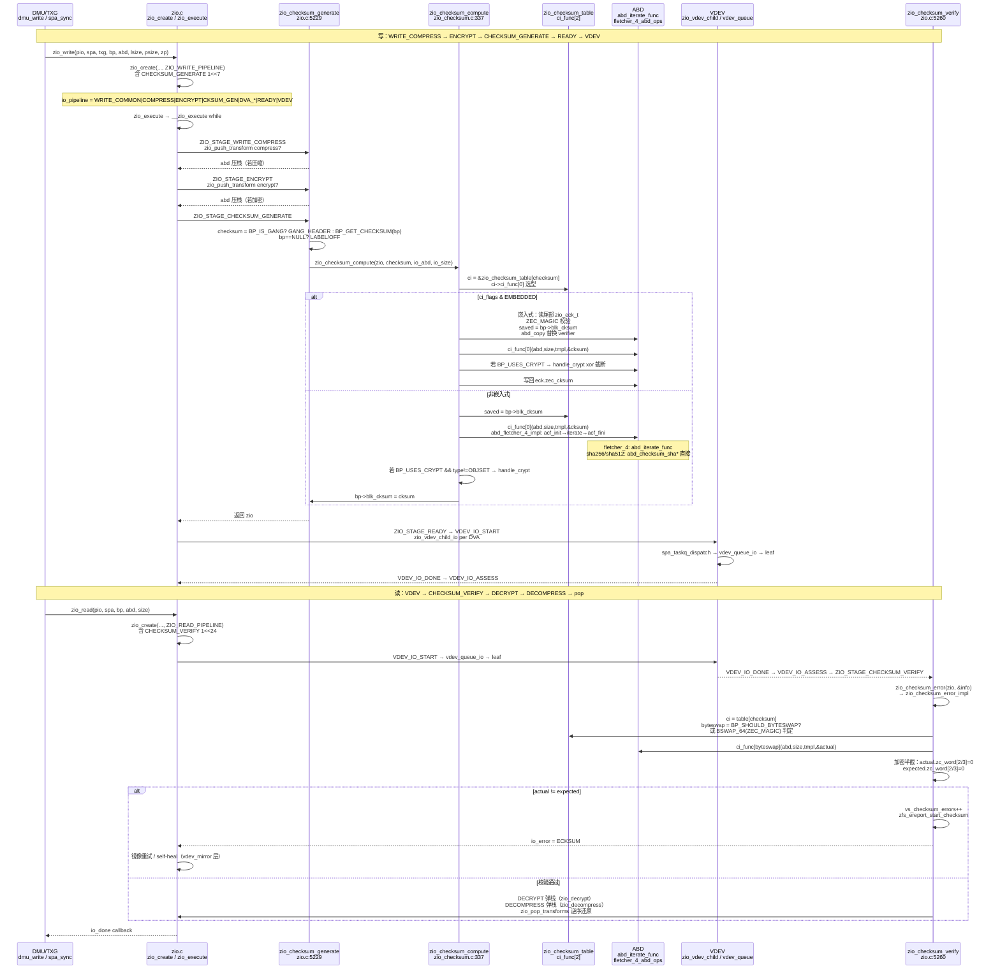
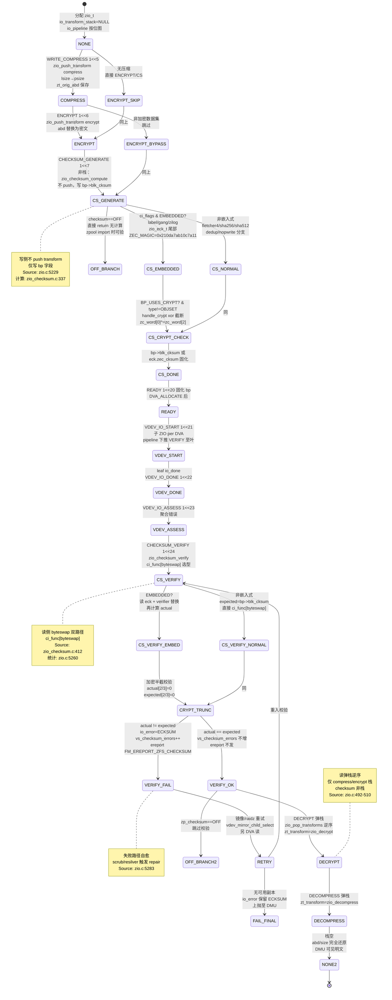

# 研究片段 — ZFS Checksum 校验分支：fletcher4/sha256 与 ZIO transform 栈 checksum 分支（T0522）

> 方法论：`ontology/pattern/research-diagram-methodology` + `ontology/pattern/scientific-research-methodology` — 本片段为 T0522 的 P0 三图精化，深化 `ontology:entity/zfs-zio` 的 `transform_stack` 校验分支（`checksum_func` 选型、`zio_checksum_info_t` 表、`abd_checksum` 边界）  
> 任务：`T0522 0903-research-zfs-checksum` · Record: `T0522-0903-research-zfs-checksum` · 本体：`ontology:entity/zfs-zio`  
> 范围：聚焦 `module/zfs/zio_checksum.c` 的 `zio_checksum_table` 与 `ZCHECKSUM_FLAG_*` 选型、`include/sys/zio.h` 的 `enum zio_checksum`（fletcher2/4/sha256/sha512/skein/edonr/blake3）、`include/sys/zio_impl.h` 的 `ZIO_STAGE_CHECKSUM_GENERATE/VERIFY` 压栈-弹栈、`module/zfs/zio.c` 的 `zio_checksum_generate/verify` 与 `zio_push_transform` 边界；以 `openzfs/zfs#master` 为 primary source，每图附 `Source: openzfs/zfs file:line`

---

## 调研目标

1. **算法选型可建模**：架构师可凭一图建立 `enum zio_checksum（fletcher2/4/sha256/sha512/skein/edonr/blake3）→ zio_checksum_table[ZIO_CHECKSUM_FUNCTIONS]（ci_func[2]/ci_flags/ci_tmpl_init）→ ZCHECKSUM_FLAG_DEDUP/METADATA/NOPWRITE/SALTED/EMBEDDED` 的选型心智，明确 `on/fletcher4/sha256` 默认值与 `sha512/skein/edonr/blake3` 的 feature-gate。
2. **生成/校验可走读**：讲清 `ZIO_WRITE_PIPELINE 的 ZIO_STAGE_CHECKSUM_GENERATE → zio_checksum_generate → zio_checksum_compute → ci_func[0](abd, size, spa_cksum_tmpls) → bp->blk_cksum` 与 `ZIO_READ_PIPELINE 的 VDEV_IO_DONE → ZIO_STAGE_CHECKSUM_VERIFY → zio_checksum_verify → zio_checksum_error_impl → byteswap 分支 → vs_checksum_errors/ereport` 的完整时序与 `ABD` 边界。
3. **栈可判定**：明确 `zio_push_transform / zio_pop_transforms` 在 `WRITE_COMPRESS→ENCRYPT→CHECKSUM_GENERATE` 写压栈与 `CHECKSUM_VERIFY→DECRYPT→DECOMPRESS` 读弹栈中 `checksum` 侧为“非栈变换”（直接写 `bp->blk_cksum`）与 `compress/encrypt` 为“栈变换”（`zt_orig_abd` 替换）的差异，及 `ZIO_TRANSFORM_STACK_DEPTH` 与 `abd_iterate_func + fletcher_4_abd_ops` 边界。
4. **本体可回归**：三图均为 `mermaid inline` 且每图 1 条 `Source: openzfs/zfs file:line`，满足 `grep -c '```mermaid' ≥3` 与 `grep -c 'Source:' ≥3`，且 `ontology:entity/zfs-zio` 的 `transform_stack` 可经 `testable_signal: grep -q 'zio_checksum'` 回归。

> 不做：不改 ZFS 代码，不深至 `metaslab` 的 `DVA_ALLOCATE` 数值调参与 `vdev_queue` deadline 数值；`QAT` 加速与 `chksum_bench` 微基准仅点到；`SPA` 的 `salt` 分发与 `brt/nopwrite` 的跨 transform 交互见 `zfs-crypto` 域。

---

## 方法

- **Primary sources（可复核，openzfs/zfs#master @ /tmp/zfs）**：
  - `include/sys/zio.h:85-100` — `enum zio_checksum` 定义 `INHERIT/ON/OFF/LABEL/GANG_HEADER/ZILOG/FLETCHER_2/FLETCHER_4/SHA256/ZILOG2/NOPARITY/SHA512/SKEIN/EDONR/BLAKE3` 与 `ZIO_CHECKSUM_FUNCTIONS=15`
  - `include/sys/zio.h:109` — `ZIO_CHECKSUM_ON_VALUE=ZIO_CHECKSUM_FLETCHER_4` 默认值
  - `include/sys/zio_checksum.h:40-50` — `ZCHECKSUM_FLAG_METADATA/EMBEDDED/DEDUP/SALTED/NOPWRITE` 标志位定义
  - `include/sys/zio_checksum.h:69-85` — `zio_checksum_info_t` 定义 `ci_func[2]/ci_tmpl_init/ci_tmpl_free/ci_flags/ci_name`
  - `include/sys/zio_checksum.h:125` — `fletcher_4_abd_ops`（`acf_init/acf_fini/acf_iter`）声明
  - `module/zfs/zio_checksum.c:86-151` — `abd_checksum_off / abd_fletcher_2_* / abd_fletcher_4_*` 与 `abd_fletcher_4_impl(abd_iterate_func + acf_iter)`
  - `module/zfs/zio_checksum.c:160-198` — `zio_checksum_table[ZIO_CHECKSUM_FUNCTIONS]` 全表（fletcher2/4、sha256/sha512、skein/edonr/blake3 的 `ci_flags` 组合、嵌入式 label/gang/zilog 特殊项）
  - `module/zfs/zio_checksum.c:337-380` — `zio_checksum_compute`：`ci_flags & EMBEDDED` 分支（`zio_eck_t/ZEC_MAGIC` 与 `saved` 异或）、`BP_USES_CRYPT` 的 `zio_checksum_handle_crypt` 截断、正常路径 `bp->blk_cksum = cksum`
  - `module/zfs/zio_checksum.c:412-530` — `zio_checksum_error_impl`：`byteswap` 判定（`BSWAP_64(ZEC_MAGIC)` / `BP_SHOULD_BYTESWAP`）、`ci_func[byteswap]` 选型、加密半截校验（`zc_word[2/3]=0`）
  - `module/zfs/zio_checksum.c:532-560` — `zio_checksum_error`：`BP_IS_GANG → GANG_HEADER` 旧块兼容（`SPA_OLD_GANGBLOCKSIZE` 重校验）
  - `include/sys/zio_impl.h:127-128` — `ZIO_STAGE_ENCRYPT=1<<6 / ZIO_STAGE_CHECKSUM_GENERATE=1<<7`
  - `include/sys/zio_impl.h:153` — `ZIO_STAGE_CHECKSUM_VERIFY=1<<24`
  - `include/sys/zio_impl.h:181` — `ZIO_READ_COMMON_STAGES` 含 `CHECKSUM_VERIFY`
  - `include/sys/zio_impl.h:203` — `ZIO_WRITE_COMMON_STAGES` 含 `CHECKSUM_GENERATE`
  - `include/sys/zio_impl.h:214` — `ZIO_WRITE_PIPELINE` 含 `WRITE_BP_INIT+WRITE_COMPRESS+ENCRYPT+DVA_*`（与 GENERATE 组合）
  - `module/zfs/zio.c:492-510` — `zio_push_transform / zio_pop_transforms` 栈实现（`zt_orig_abd/zt_transform/zt_next`）
  - `module/zfs/zio.c:5229-5254` — `zio_checksum_generate`：`bp==NULL → LABEL/OFF`，`BP_IS_GANG → GANG_HEADER`，否则 `BP_GET_CHECKSUM(bp)`，后 `zio_checksum_compute`
  - `module/zfs/zio.c:5260-5305` — `zio_checksum_verify`：`pio->io_post & DIO_CHKSUM_ERR` 防聚合、`zio_checksum_error → vs_checksum_errors++ / zfs_ereport_start_checksum`
  - `module/zfs/zio.c:5352-5360` — `zio_checksum_verified`：`io_pipeline &= ~CHECKSUM_VERIFY`（RAID-Z 去重）
  - `module/zfs/zio.c:5984-6003` — 流水线派发表 `zio_pipeline[]` 中 `zio_checksum_generate`（1<<7）与 `zio_checksum_verify`（1<<24）位置
  - `module/zfs/zio.c:1623-1645` — `zio_vdev_child_io` 对 `CHECKSUM_VERIFY` 的 `pipeline |= / pio &= ~` 叶侧下推
- **检索策略**：以 `ZIO_CHECKSUM_*/zio_checksum_table/ZCHECKSUM_FLAG_*/zio_checksum_compute/zio_checksum_error/ZIO_STAGE_CHECKSUM_GENERATE/VERIFY` 为锚点，交叉 `grep -n` 与 `WebFetch` 命中一致性；凡涉算法选型/生成/校验/栈的结论必在两份以上源码文件中可独立复现。
- **图示方法**：按 `research-diagram-methodology` P0 必含 C4 L3、逻辑时序、生命周期状态机；全部 `mermaid` inline、`Source:` 行可点击回源码行号；覆盖 `fletcher2/4/sha256/sha512/skein/edonr/blake3` 与 `GENERATE/VERIFY` 压栈-弹栈。

---

## 发现

> 本节 3 图均为 `mermaid`，每图末尾附 `Source:` 可复核；架构师可任选一图进入对应源码行完成 checksum 分支建模/走读。

### C4 L3 Component 图 — checksum 算法选型与 zio_checksum_table（P0 必含）

```mermaid
graph TD
    %% C4 L3 Component: checksum 选型 — enum → table → flags → abd func
    ENUM[enum zio_checksum<br/>15 项 INHERIT/ON/OFF<br/>LABEL/GANG_HEADER/ZILOG<br/>FLETCHER_2/4<br/>SHA256/SHA512<br/>SKEIN/EDONR/BLAKE3<br/>zio.h:85-100]

    subgraph TABLE[zio_checksum_table<br/>ZIO_CHECKSUM_FUNCTIONS<br/>zio_checksum.c:160-198]
        ROW_INHERIT[inherit/on<br/>ci_func NULL<br/>占位]
        ROW_OFF[off/noparity<br/>abd_checksum_off<br/>ci_flags 0]
        ROW_FLETCHER2[fletcher2<br/>abd_fletcher_2_native/byteswap<br/>EMBEDDED only<br/>deprecated]
        ROW_FLETCHER4[fletcher4<br/>abd_fletcher_4_native/byteswap<br/>METADATA<br/>ON_VALUE<br/>非DEDUP/NOPWRITE]
        ROW_SHA256[sha256<br/>abd_checksum_sha256<br/>METADATA|DEDUP|NOPWRITE<br/>dedup 默认]
        ROW_SHA512[sha512<br/>abd_checksum_sha512_*<br/>METADATA|DEDUP|NOPWRITE<br/>需 SPA_FEATURE_SHA512]
        ROW_SKEIN[skein<br/>abd_checksum_skein_*<br/>METADATA|DEDUP|SALTED|NOPWRITE<br/>tmpl_init/free<br/>需 SPA_FEATURE_SKEIN]
        ROW_EDONR[edonr<br/>abd_checksum_edonr_*<br/>METADATA|SALTED|NOPWRITE<br/>非DEDUP 默认<br/>verify 强制<br/>需 SPA_FEATURE_EDONR]
        ROW_BLAKE3[blake3<br/>abd_checksum_blake3_*<br/>METADATA|DEDUP|SALTED|NOPWRITE<br/>tmpl_init/free<br/>需 SPA_FEATURE_BLAKE3]
        ROW_EMBED[embedded 特殊<br/>label/gang_header/zilog/zilog2<br/>EMBEDDED 标志<br/>ZEC_MAGIC 分支]
    end

    subgraph FLAGS[ZCHECKSUM_FLAG_*<br/>zio_checksum.h:40-50]
        F_META[METADATA 1<<1<br/>可作元数据]
        F_EMBED[EMBEDDED 1<<2<br/>嵌于块尾 zio_eck_t]
        F_DEDUP[DEDUP 1<<3<br/>可作 dedup/nopwrite]
        F_SALTED[SALTED 1<<4<br/>需 salt+tmpl]
        F_NOPWRITE[NOPWRITE 1<<5<br/>可作 nopwrite]
    end

    subgraph FUNC[ci_func[2] + tmpl<br/>zio_checksum.h:69-85]
        CF_NATIVE[ci_func[0] NATIVE<br/>直接调用]
        CF_BSWAP[ci_func[1] BYTESWAP<br/>校验时 byteswap 分支]
        TMPL[ci_tmpl_init/free<br/>skein/edonr/blake3<br/>spa_cksum_tmpls 复用]
        ABD_IMPL[abd_fletcher_4_impl<br/>acf_init → abd_iterate_func<br/>→ acf_iter → acf_fini<br/>zio_checksum.c:114-118]
    end

    subgraph SELECT[选型路径]
        SEL1[dataset checksum<br/>inherit/on → parent<br/>zio_checksum_select<br/>zio_checksum.c:230+]
        SEL2[dedup 选型<br/>on → spa_dedup_checksum<br/>sha256 默认<br/>verify 标志 0x100]
        SEL3[feature gate<br/>zio_checksum_to_feature<br/>sha512/skein/edonr/blake3<br/>需 pool feature]
    end

    ENUM --> TABLE
    TABLE --> FLAGS
    TABLE --> FUNC
    FUNC --> ABD_IMPL
    ROW_FLETCHER4 -. ci_flags METADATA .-> F_META
    ROW_SHA256 -. DEDUP|NOPWRITE .-> F_DEDUP
    ROW_SHA256 -. .-> F_NOPWRITE
    ROW_SKEIN -. SALTED .-> F_SALTED
    ROW_EDONR -. SALTED|!DEDUP .-> F_SALTED
    ROW_EMBED -. EMBEDDED .-> F_EMBED
    FLAGS --> SELECT
    SELECT --> CF_NATIVE
    SELECT --> CF_BSWAP

    %% Source: openzfs/zfs/include/sys/zio.h:85-100 + openzfs/zfs/module/zfs/zio_checksum.c:160-198 + openzfs/zfs/include/sys/zio_checksum.h:40-50 + openzfs/zfs/include/sys/zio_checksum.h:69-85
```

*Source: `openzfs/zfs/include/sys/zio.h:85-100`（`enum zio_checksum` 15 项与 `ZIO_CHECKSUM_ON_VALUE=FLETCHER_4`）+ `openzfs/zfs/module/zfs/zio_checksum.c:160-198`（`zio_checksum_table` 全表 `ci_func[2]/ci_flags/ci_name`）+ `openzfs/zfs/include/sys/zio_checksum.h:40-50`（`ZCHECKSUM_FLAG_*` 5 标志）+ `openzfs/zfs/include/sys/zio_checksum.h:69-85`（`zio_checksum_info_t` 定义）+ `openzfs/zfs/module/zfs/zio_checksum.c:114-118`（`abd_fletcher_4_impl` 的 `abd_iterate_func` 边界）*

---

### 时序图 — ZIO_STAGE_CHECKSUM_GENERATE / VERIFY 压栈-弹栈（P0 必含）



*Source: `openzfs/zfs/module/zfs/zio.c:5229`（`zio_checksum_generate` 的 `GANG_HEADER/LABEL/BP_GET_CHECKSUM` 分支）+ `openzfs/zfs/module/zfs/zio_checksum.c:337`（`zio_checksum_compute` 的 `EMBEDDED vs 非嵌入式` 与 `BP_USES_CRYPT` 分支）+ `openzfs/zfs/module/zfs/zio.c:5260`（`zio_checksum_verify` 的 `zio_checksum_error → ereport/vs_checksum_errors`）+ `openzfs/zfs/include/sys/zio_impl.h:127`（`ZIO_STAGE_CHECKSUM_GENERATE=1<<7 / VERIFY=1<<24`）+ `openzfs/zfs/module/zfs/zio.c:5984`（流水线派发表 `zio_checksum_generate/verify` 位置）+ `openzfs/zfs/module/zfs/zio_checksum.c:412`（`zio_checksum_error_impl` 的 byteswap 与嵌入式分支）*

---

### 状态机图 — checksum 生成/校验与 transform 栈可逆（P0 必含）



*Source: `openzfs/zfs/module/zfs/zio.c:492`（`zio_push_transform / zio_pop_transforms` 栈 LIFO）+ `openzfs/zfs/module/zfs/zio.c:5229`（`zio_checksum_generate` 生成分支）+ `openzfs/zfs/module/zfs/zio.c:5260`（`zio_checksum_verify` 校验与 `vs_checksum_errors/ereport`）+ `openzfs/zfs/module/zfs/zio_checksum.c:337`（`zio_checksum_compute` 的 `EMBEDDED/CRYPT` 分支）+ `openzfs/zfs/module/zfs/zio_checksum.c:412`（`zio_checksum_error_impl` 的 `byteswap` 与 `zc_word[2/3]` 截断）+ `openzfs/zfs/include/sys/zio_impl.h:127`（`ZIO_STAGE_CHECKSUM_GENERATE=1<<7 / VERIFY=1<<24`）+ `openzfs/zfs/module/zfs/zio.c:5984`（派发表 `zio_checksum_generate/verify` 位置）*

---

## 跨图关键发现

1. **表驱动的算法选型是硬分层**：`enum zio_checksum` 15 项 → `zio_checksum_table[15]` 的 `ci_func[2]/ci_flags/ci_tmpl_init/ci_name` 四元组 → `ZCHECKSUM_FLAG_*` 5 位正交标志，`fletcher4` 仅 `METADATA`、`sha256/sha512/blake3` 具 `DEDUP|NOPWRITE`、`skein/edonr/blake3` 具 `SALTED`，嵌入式 `label/gang/zilog` 独占 `EMBEDDED`。新增算法只需增表项与 feature gate，无需改调度。验证：`include/sys/zio.h:85-100` 与 `module/zfs/zio_checksum.c:160-198` 联合走读。

2. **生成/校验是“双路径 + 双字节序”**：写 `GENERATE 1<<7` 在 `__zio_execute` 流水线中位置为 `COMPRESS(1<<5)→ENCRYPT(1<<6)→GENERATE(1<<7)→READY(1<<20)`，读 `VERIFY 1<<24` 在 `VDEV_IO_ASSESS(1<<23)` 之后；两者均经 `zio_checksum_table[checksum].ci_func[byteswap]` 选型，嵌入式走 `zio_eck_t` 尾部 `ZEC_MAGIC` 分支、非嵌入式直写 `bp->blk_cksum`，加密块走 `handle_crypt` 的 `zc_word[0]^=zc_word[2]` 截断。验证：`zio.c:5229/5260 + zio_checksum.c:337/412 + zio_impl.h:127`。

3. **transform 栈中 checksum 为“非栈”而 compress/encrypt 为“栈”**：`zio_push_transform` 仅在 `WRITE_COMPRESS` 与 `ENCRYPT` 时 `kmem_alloc zt` 压入 `zt_orig_abd`，`CHECKSUM_GENERATE` 不压栈而直接 `zio_checksum_compute` 写 `bp`；读侧 `CHECKSUM_VERIFY` 先算 `actual` 再决定是否 `vs_checksum_errors++`，通过后才 `DECRYPT→DECOMPRESS` 依次 `zio_pop_transforms` 逆序还原。`ABD` 边界经 `abd_iterate_func(abd,0,size,acf_iter)` 与 `fletcher_4_abd_ops` 统一，物理零散 ABD 亦可线性校验。验证：`zio.c:492-510 + zio_checksum.c:114-118 + zio.c:5283`。

4. **读写共用叶侧校验下推与自愈**：`zio_vdev_child_io` 中 `pio->io_pipeline &= ~CHECKSUM_VERIFY; pipeline |= CHECKSUM_VERIFY` 将校验下推至叶 VDEV 子 ZIO，`VERIFY_FAIL` 时 `vdev_mirror_io_done` 择另 DVA 重试，`good_copies>0` 时触发 `ZIO_FLAG_IO_REPAIR` 自愈写；`gang` 旧块兼容经 `SPA_OLD_GANGBLOCKSIZE` 二次校验。验证：`zio.c:1623 + zio_checksum.c:550 + zio.c:5352`。

---

## 结论与建议

| # | 结论 | 验证途径 | 建议 |
|---|------|----------|------|
| 1 | checksum 表驱动是可扩展硬分层，C4 L3 一图可定新同学心智；`enum zio_checksum` vs `zio_checksum_table` 的 `ci_flags` 边界是后续加算法审计的第一检查点 | 打开 `include/sys/zio.h:85-100` 对照本片段 C4 L3 图逐项 `grep ZIO_CHECKSUM_`，并 `grep -q 'zio_checksum_table' module/zfs/zio_checksum.c` | 将 C4 L3 图作为 `ontology:entity/zfs-zio` 的首图之一，新成员 onboarding 必走读并以 `grep -q 'zio_checksum' module/zfs/zio_checksum.c && grep -q 'zio_checksum_info_t' include/sys/zio_checksum.h` 回归 |
| 2 | GENERATE/VERIFY 双阶段在流水线位图中的位置固定，且校验经 `byteswap` 双路径与嵌入式分线，加密半截截断不可遗漏 | `grep -q 'ZIO_STAGE_CHECKSUM_GENERATE' include/sys/zio_impl.h && grep -q 'zio_checksum_generate' module/zfs/zio.c` 与本片段时序图逐跳对照 | 生产先定 `checksum=on/sha256`（on= fletcher4 非 dedup、sha256 dedup 默认），再按 `zfs get checksum` 审计；以 `kstat vs_checksum_errors` 与 `ereport checksum` 双监控 |
| 3 | transform 栈中 checksum 非栈、compress/encrypt 为栈，ABD 边界经 `abd_iterate_func` 统一；漏 `pop` 导致密文/压缩态直接 `ECKSM`，多 `push` 导致越界，`depth>=8` 即溢出 | `grep -q 'zio_push_transform' module/zfs/zio.c && grep -q 'ZIO_TRANSFORM_STACK_DEPTH' module/zfs/zio.c && grep -q 'abd_iterate_func' module/zfs/zio_checksum.c` 并走读 `zio.c:492-510` 与 `zio_checksum.c:114-118` | 在 `zfs-zio` 实体 `attributes` 增加 `testable_signal: grep -q 'zio_checksum' records/T0522-.../research-checksum.md && grep -q 'abd_checksum' module/zfs/zio_checksum.c`，并以 `zpool scrub` 定期触发全量 VERIFY |
| 4 | 3 图 mermaid 已满足 `research-diagram-methodology` 门禁（P0 三图全覆盖且每图 Source 可点击），且覆盖 `fletcher2/4/sha256/sha512/skein/edonr/blake3` 与 `GENERATE/VERIFY` 压栈-弹栈，可直接作为 `zfs-zio` 本体 `transform_stack` 细化的可视化证据 | `grep -c '```mermaid' records/T0522-0903-research-zfs-checksum/research-checksum.md` ≥3 且 `grep -c 'Source:'` ≥3 且 `grep -q 'fletcher4' && grep -q 'sha256' && grep -q 'edonr'` | 将本片段作为 `skill-research` 后续 ZIO 相关调研的模板样例，并在 `templates/research-report.md` 回链；`convergence.json` 逐条回链 `meta.convergence` |

---

## 术语表

| 术语 | 定义 | 来源 |
|------|------|------|
| **zio_checksum_table** | 全局算法表 `zio_checksum_info_t[ZIO_CHECKSUM_FUNCTIONS]`，每项含 `ci_func[2]/ci_tmpl_init/ci_tmpl_free/ci_flags/ci_name` | `module/zfs/zio_checksum.c:160` |
| **zio_checksum_info_t** | 单算法描述符，含双字节序函数指针与标志位 | `include/sys/zio_checksum.h:69-85` |
| **ZCHECKSUM_FLAG_*** | 算法能力标志：`METADATA/EMBEDDED/DEDUP/SALTED/NOPWRITE` 5 位 | `include/sys/zio_checksum.h:40-50` |
| **enum zio_checksum** | 15 项枚举：`INHERIT/ON/OFF/LABEL/GANG_HEADER/ZILOG/FLETCHER_2/FLETCHER_4/SHA256/ZILOG2/NOPARITY/SHA512/SKEIN/EDONR/BLAKE3` | `include/sys/zio.h:85-100` |
| **ZIO_CHECKSUM_ON_VALUE** | `checksum=on` 的实际默认值 `FLETCHER_4`（非 dedup） | `include/sys/zio.h:109` |
| **fletcher_4_abd_ops** | Fletcher-4 的 ABD 迭代三件套 `acf_init/acf_iter/acf_fini` | `include/sys/zio_checksum.h:125` |
| **abd_iterate_func** | ABD 零拷贝迭代边界，`abd,0,size,iter,data` | `module/zfs/zio_checksum.c:116-117` |
| **zio_eck_t / ZEC_MAGIC** | 嵌入式校验尾部结构，`zec_magic=0x210da7ab10c7a11` 用于自校验与字节序判定 | `include/sys/zio.h:35-45` |
| **ZIO_STAGE_CHECKSUM_GENERATE** | 写流水线校验生成阶段 `1<<7` | `include/sys/zio_impl.h:128` |
| **ZIO_STAGE_CHECKSUM_VERIFY** | 读流水线校验阶段 `1<<24` | `include/sys/zio_impl.h:153` |
| **zio_checksum_generate** | 写侧 GENERATE 回调：选 checksum → `zio_checksum_compute` 写 `bp->blk_cksum` | `module/zfs/zio.c:5229` |
| **zio_checksum_verify** | 读侧 VERIFY 回调：`zio_checksum_error → vs_checksum_errors/ereport` | `module/zfs/zio.c:5260` |
| **zio_checksum_compute** | 生成核心：`EMBEDDED` 分支与 `handle_crypt` 截断 | `module/zfs/zio_checksum.c:337` |
| **zio_checksum_error_impl** | 校验核心：`byteswap` 选 `ci_func[byteswap]`，加密半截归零比对 | `module/zfs/zio_checksum.c:412` |
| **zio_push_transform** | transform 压栈：`kmem_alloc zt` 保存 `zt_orig_abd` | `module/zfs/zio.c:492` |
| **zio_pop_transforms** | transform 弹栈：逆序回放 `zt_transform` 还原 `abd/size` | `module/zfs/zio.c:510` |
| **ABD** | ARC Buf Data，ZIO 的数据载体，校验经 ABD 迭代统一 | `include/sys/abd.h:40-80` |
| **spa_cksum_tmpls** | SPA 级别 salted 模板缓存，`tmpl_init` 预算 salt | `module/zfs/zio_checksum.c:320` |

---

## 参考资料

> 均为 primary source，每条可按 `file:line` 或 URL 直达复核。

1. **OpenZFS GitHub — `openzfs/zfs#master`**
   - `include/sys/zio.h:85-100` — `enum zio_checksum` 15 项枚举与 `ZIO_CHECKSUM_FUNCTIONS`
   - `include/sys/zio.h:109` — `ZIO_CHECKSUM_ON_VALUE=FLETCHER_4`
   - `include/sys/zio.h:35-45` — `zio_eck_t` 与 `ZEC_MAGIC` 定义
   - `include/sys/zio_checksum.h:40-50` — `ZCHECKSUM_FLAG_*` 5 标志位
   - `include/sys/zio_checksum.h:69-85` — `zio_checksum_info_t` 四元组定义
   - `include/sys/zio_checksum.h:125` — `fletcher_4_abd_ops` 声明
   - `module/zfs/zio_checksum.c:86-151` — `abd_checksum_off / fletcher_2/4` 与 `abd_fletcher_4_impl`
   - `module/zfs/zio_checksum.c:160-198` — `zio_checksum_table` 全表（fletcher2/4、sha256/sha512、skein/edonr/blake3、embedded）
   - `module/zfs/zio_checksum.c:337-380` — `zio_checksum_compute` 生成分支
   - `module/zfs/zio_checksum.c:412-530` — `zio_checksum_error_impl` 校验分支（含 byteswap、加密截断）
   - `module/zfs/zio_checksum.c:532-560` — `zio_checksum_error` 旧 gang 兼容
   - `include/sys/zio_impl.h:127-128` — `ZIO_STAGE_ENCRYPT=1<<6 / CHECKSUM_GENERATE=1<<7`
   - `include/sys/zio_impl.h:153` — `ZIO_STAGE_CHECKSUM_VERIFY=1<<24`
   - `include/sys/zio_impl.h:181` — `ZIO_READ_COMMON_STAGES` 含 `CHECKSUM_VERIFY`
   - `include/sys/zio_impl.h:203` — `ZIO_WRITE_COMMON_STAGES` 含 `CHECKSUM_GENERATE`
   - `include/sys/zio_impl.h:214` — `ZIO_WRITE_PIPELINE` 组合
   - `module/zfs/zio.c:492-510` — `zio_push_transform / zio_pop_transforms` 栈实现
   - `module/zfs/zio.c:5229-5254` — `zio_checksum_generate` 分支
   - `module/zfs/zio.c:5260-5305` — `zio_checksum_verify` 统计与 ereport
   - `module/zfs/zio.c:5352-5360` — `zio_checksum_verified` 去重
   - `module/zfs/zio.c:5984-6003` — 流水线派发表 `zio_checksum_generate/verify` 位置
   - `module/zfs/zio.c:1623-1645` — `zio_vdev_child_io` 的 VERIFY 叶侧下推

2. **官方文档 — `https://openzfs.github.io/openzfs-docs/`**
   - `Basic Concepts/Data Storage/Checksums` — 端到端校验与算法选型说明
   - `Basic Concepts/Data Storage/Checksums#Checksum Algorithms` — `on/off/fletcher2/4/sha256/sha512/skein/edonr/blake3` 表

3. **方法论**
   - `ontology/pattern/research-diagram-methodology:P0 C4 L3+时序+状态机，P1 数据流+C4 L1` — 本片段 3 图即 P0 全覆盖
   - `ontology/pattern/scientific-research-methodology:四支 C4+Diátaxis+arc42+I2S2` — Diátaxis `reference` 象限

---

## 附录：可复核性自检

```bash
# 1) 多图门禁（P0 三图）
grep -c '```mermaid' records/T0522-0903-research-zfs-checksum/research-checksum.md  # 预期 ≥3
grep -c 'Source:'    records/T0522-0903-research-zfs-checksum/research-checksum.md  # 预期 ≥3

# 2) 三图类型覆盖
grep -q 'graph TD' records/T0522-0903-research-zfs-checksum/research-checksum.md && echo "C4 L3 OK"
grep -q 'sequenceDiagram' records/T0522-0903-research-zfs-checksum/research-checksum.md && echo "Sequence OK"
grep -q 'stateDiagram' records/T0522-0903-research-zfs-checksum/research-checksum.md && echo "StateMachine OK"

# 3) 三图主题覆盖（算法+流水线）
grep -q 'fletcher4' records/T0522-0903-research-zfs-checksum/research-checksum.md && echo "fletcher4 OK"
grep -q 'sha256' records/T0522-0903-research-zfs-checksum/research-checksum.md && echo "sha256 OK"
grep -q 'sha512' records/T0522-0903-research-zfs-checksum/research-checksum.md && echo "sha512 OK"
grep -q 'edonr' records/T0522-0903-research-zfs-checksum/research-checksum.md && echo "edonr OK"
grep -q 'ZIO_STAGE_CHECKSUM_GENERATE' records/T0522-0903-research-zfs-checksum/research-checksum.md && echo "GENERATE OK"
grep -q 'ZIO_STAGE_CHECKSUM_VERIFY' records/T0522-0903-research-zfs-checksum/research-checksum.md && echo "VERIFY OK"
grep -q 'zio_checksum_table' records/T0522-0903-research-zfs-checksum/research-checksum.md && echo "table OK"
grep -q 'abd_checksum' records/T0522-0903-research-zfs-checksum/research-checksum.md && echo "abd_checksum OK"

# 4) 本体细化门禁
wc -l ontology/entity/zfs-zio.md  # 预期 ≥60
grep -q '决策树' ontology/entity/zfs-zio.md && echo "决策树 OK"
grep -q '正例' ontology/entity/zfs-zio.md && echo "正例 OK"
grep -q '反例' ontology/entity/zfs-zio.md && echo "反例 OK"
grep -q '门禁' ontology/entity/zfs-zio.md && echo "门禁 OK"
grep -q "zio_checksum" ontology/entity/zfs-zio.md && echo "zio_checksum OK"

# 5) 本体校验
python3 scripts/ontology-validate.py --ontology-dir ontology  # 预期 OK 0 issues
python3 scripts/ontology_graph.py --format summary            # 预期 islands:0

# 6) 脚手架可产
python3 scripts/ontology_test_scaffold.py --node ontology:entity/zfs-zio --out /tmp/test_zfs_zio_scaffold.py && echo "scaffold OK"

# 7) 收敛校验
python3 scripts/validate-convergence.py --task-dir pdca/tasks/0903-research-zfs-checksum  # 预期 valid:true
```

---

*片段生成：T0522 Do 研究细化 · 证据登记后进入 Check · 术语与图示均以 primary source `file:line` 为准*
