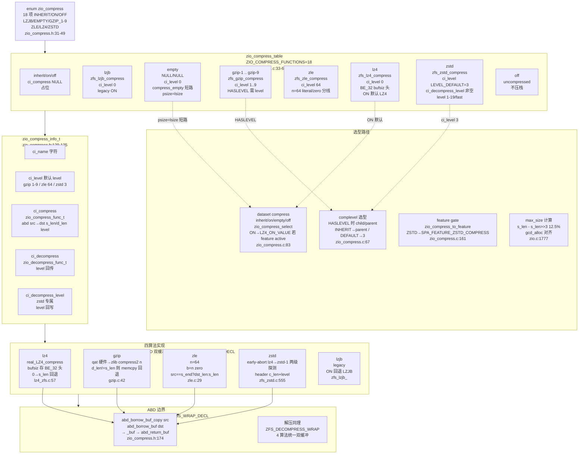
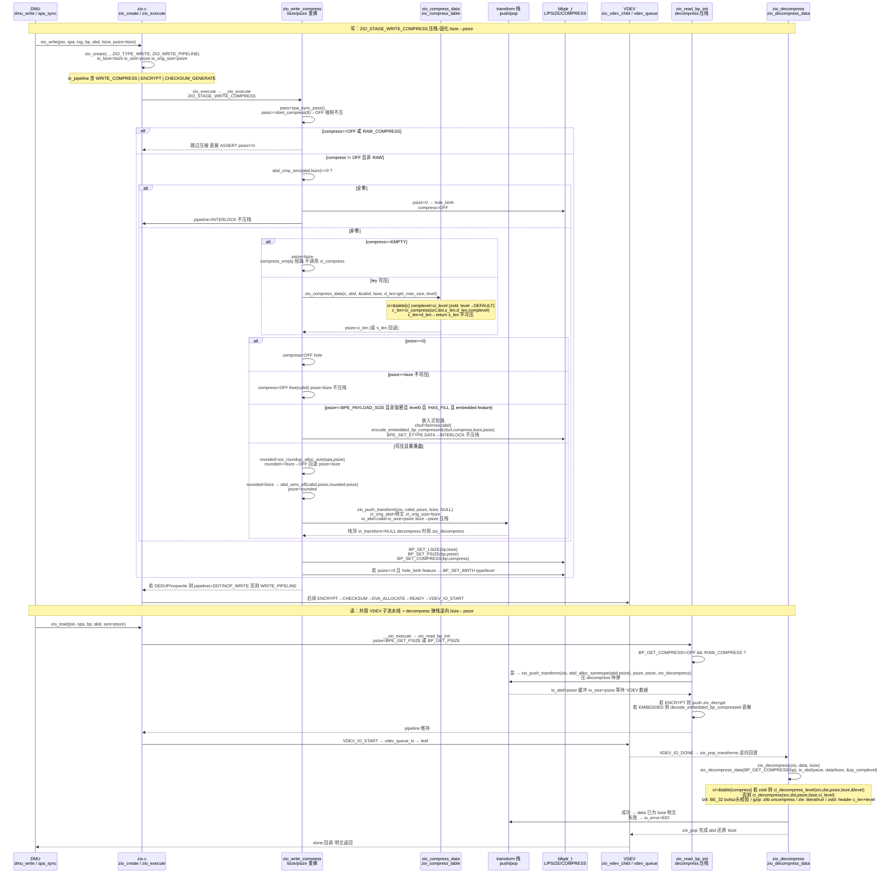
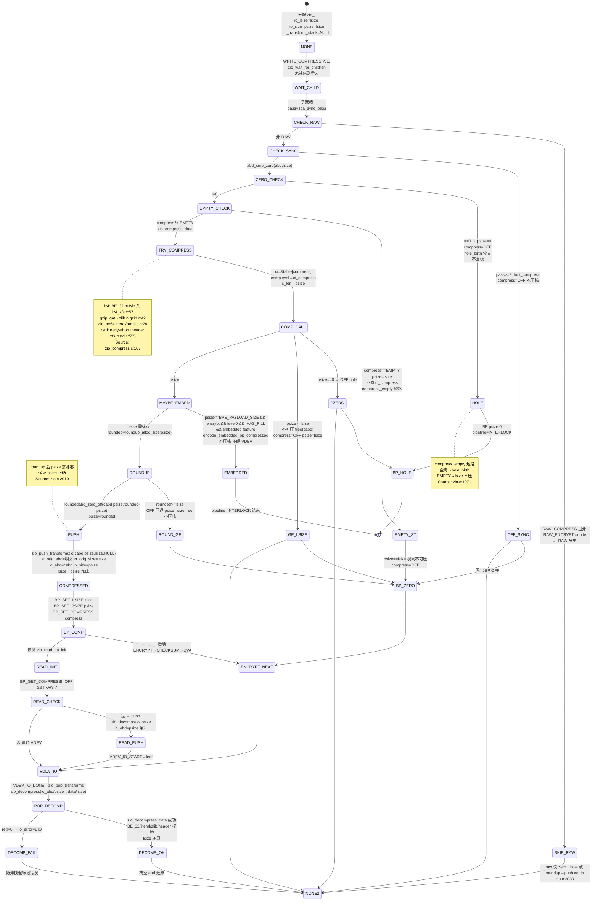

# 研究片段 — ZFS Compress 压缩分支：lz4/zstd/gzip/zle 与 ZIO transform 栈 compress 分支（T0523）

> 方法论：`ontology/pattern/research-diagram-methodology` + `ontology/pattern/scientific-research-methodology` — 本片段为 T0523 的 P0 三图精化，深化 `ontology:entity/zfs-zio` 的 `transform_stack` 压缩分支（`compress_func` 选型、`zio_compress_info_t` 表、`compress_empty` 短路、`lsize→psize` 变换）  
> 任务：`T0523 0903-research-zfs-compress` · Record: `T0523-0903-research-zfs-compress` · 本体：`ontology:entity/zfs-zio`  
> 范围：聚焦 `module/zfs/zio_compress.c` 的 `zio_compress_table` 与 `enum zio_compress`（lz4/zstd/gzip1-9/zle/lzjb/empty）、`include/sys/zio_compress.h` 的 `zio_compress_info_t` 与 `zio_compress_data/zio_decompress_data`、`module/zfs/zio.c` 的 `ZIO_STAGE_WRITE_COMPRESS`/`zio_write_compress`/`zio_read_bp_init`/`zio_decompress` 与 `zio_push_transform` 栈的 `lsize→psize` 压栈-弹栈；以 `openzfs/zfs#master @ /tmp/zfs` 为 primary source，每图附 `Source: openzfs/zfs file:line`

---

## 调研目标

1. **压缩选型可建模**：架构师可凭一图建立 `enum zio_compress（lz4/zstd/gzip1-9/zle/lzjb/empty/off/on/inherit）→ zio_compress_table[ZIO_COMPRESS_FUNCTIONS]（ci_compress/ci_decompress/ci_decompress_level/ci_level/ci_name）→ ZIO_COMPRESS_HASLEVEL/zstd level` 的选型心智，明确 `on→lz4` 默认值与 `zstd` 的 `level 3 default / fast` 及 `gzip 1-9` 的 `ci_level` 的 `feature-gate`（`SPA_FEATURE_ZSTD_COMPRESS`）。
2. **压栈-弹栈可走读**：讲清 `ZIO_WRITE_PIPELINE 的 ZIO_STAGE_WRITE_COMPRESS → zio_write_compress → zio_compress_data → zio_push_transform(cabd, psize→lsize, zio_decompress) → BP_SET_LSIZE/PSIZE/COMPRESS` 与 `ZIO_READ 的 zio_read_bp_init → zio_push_transform(psize, zio_decompress) → VDEV 子流水线 → zio_pop_transforms 逆序还原` 的完整时序与 `lsize→psize` 往返及 `ABD` 边界。
3. **短路可判定**：明确 `compress_empty` 三短路（`abd_cmp_zero→psize 0 hole_birth`、`compress==EMPTY→psize=lsize` 不压栈、`psize>=lsize→OFF 回退`）、`embedded 短路（psize<=BPE_PAYLOAD_SIZE→encode_embedded_bp_compressed）`、`psize roundup（zio_roundup_alloc_size → abd_zero_off 补零 → lsize 边界）` 及 `ZIO_TRANSFORM_STACK_DEPTH` 边界。
4. **本体可回归**：三图均为 `mermaid inline` 且每图 1 条 `Source: openzfs/zfs file:line`，满足 `grep -c '```mermaid' ≥3` 与 `grep -c 'Source:' ≥3`，且 `ontology:entity/zfs-zio` 的 `transform_stack` 可经 `testable_signal: grep -q 'zio_compress'` 回归。

> 不做：不改 ZFS 代码，不深至 `metaslab` 的 `DVA_ALLOCATE` 数值调参细节与 `vdev_queue` deadline 数值；`QAT` 硬件加速与 `zstd early-abort` 的阈值调参仅点到原理；`SPA` 的 `sync_pass` 多 pass 收敛见 `T0503` 全栈报告，加密与校验的跨栈交互见 `T0522/T0524`。

---

## 方法

- **Primary sources（可复核，openzfs/zfs#master @ /tmp/zfs）**：
  - `include/sys/zio_compress.h:31-49` — `enum zio_compress` 定义 `INHERIT/ON/OFF/LZJB/EMPTY/GZIP_1-9/ZLE/LZ4/ZSTD/FUNCTIONS` 18 项
  - `include/sys/zio_compress.h:52-58` — `ZIO_COMPRESS_HASLEVEL / ZIO_COMPLEVEL_INHERIT/DEFAULT` 与 `ZIO_ZSTD_LEVEL_*`（`DEFAULT=3 / MIN=1 / MAX=19 / FAST_*`）
  - `include/sys/zio_compress.h:116-135` — `zio_compress_func_t / zio_decompress_func_t / zio_decompresslevel_func_t` 签名与 `zio_compress_info_t` 定义 `ci_name/ci_level/ci_compress/ci_decompress/ci_decompress_level`
  - `include/sys/zio_compress.h:36 / module/zfs/zio.c:1973` — `ZIO_COMPRESS_EMPTY` 占位（`ci_compress NULL`）与 `compress==EMPTY→psize=lsize` 短路
  - `module/zfs/zio_compress.c:33-64` — `zio_compress_table[ZIO_COMPRESS_FUNCTIONS]` 全表（lzjb/lz4/zle ci_level 0/64、gzip 1-9、zstd DEFAULT=3 含 `ci_decompress_level`）
  - `module/zfs/zio_compress.c:67-81` — `zio_complevel_select` 的 `HASLEVEL` 与 `INHERIT→parent` 回退
  - `module/zfs/zio_compress.c:83-105` — `zio_compress_select` 的 `INHERIT→parent` 与 `ON→LZ4_ON_VALUE/LZJB` 按 `SPA_FEATURE_LZ4_COMPRESS` 选型
  - `module/zfs/zio_compress.c:107-142` — `zio_compress_data`：`ci->ci_compress(src,dst,s_len,d_len,complevel)`、`zstd complevel` 的 `INHERIT→s_len 回退` 与 `DEFAULT→LEVEL_DEFAULT`，`c_len>d_len→s_len 不可压回退`
  - `module/zfs/zio_compress.c:144-159` — `zio_decompress_data`：`ci_decompress_level` 优先（zstd 需 `level` 回传）否则 `ci_decompress(..., ci_level)`，含 `FUNCTIONS 越界→EINVAL`
  - `module/zfs/zio.c:1777-1802` — `zio_get_compression_max_size`：`s_len - s_len>>3 (12.5%)`、`ZLE 特殊 d_len`、`gcd_alloc 对齐` 与 `BPE_PAYLOAD_SIZE` 兜底
  - `module/zfs/zio.c:492-510` — `zio_push_transform / zio_pop_transforms` 栈实现（`zt_orig_abd/zt_orig_size/zt_bufsize/zt_transform` 链、`zt_next` 栈顶、`kmem_alloc`）
  - `module/zfs/zio.c:545-560` — `zio_decompress` 回调：`zio_decompress_data(BP_GET_COMPRESS(bp), io_abd, data, io_size→psize, size→lsize, &zp_complevel)` 与 `EIO` 注入
  - `module/zfs/zio.c:1803-1830` — `zio_read_bp_init`：`BP_GET_COMPRESS!=OFF && !RAW_COMPRESS → zio_push_transform(psize, zio_decompress)`（读侧压栈），`embedded DATA 的 decode_embedded_bp_compressed`
  - `module/zfs/zio.c:1907-2140` — `zio_write_compress`：`lsize=io_lsize / psize=io_size`、`sync_pass>=dont_compress→OFF`、`abd_cmp_zero→0 hole`、`EMPTY→psize=lsize`、`zio_compress_data→psize`、`psize==0→OFF / psize>=lsize→OFF+free(cabd) / psize<=BPE_PAYLOAD→embedded encode / else roundup→zio_push_transform(cabd, psize, lsize, NULL)`、`BP_SET_LSIZE/PSIZE/COMPRESS` 与 `psize==0→hole_birth`
  - `include/sys/zio_impl.h:125` — `ZIO_STAGE_WRITE_COMPRESS=1<<5`
  - `include/sys/zio_impl.h:214-220` — `ZIO_WRITE_PIPELINE` 含 `WRITE_COMPRESS+ENCRYPT`，`ZIO_REWRITE_PIPELINE` 亦含
  - `include/sys/zio.h:357` — `zio_prop_t.zp_compress:8` 与 `zp_complevel`
  - `module/zfs/lz4_zfs.c:57-86` — `zfs_lz4_compress_buf`：`real_LZ4_compress`、`bufsiz==0→s_len 回退`、`BE_32(bufsiz)` 头
  - `module/zfs/gzip.c:42-90` — `zfs_gzip_compress_buf`：`qat_compress 硬件短路`→`compress2(n)`→`d_len!=s_len 回退 memcpy`
  - `module/zfs/zle.c:29-86` — `zfs_zle_compress_buf`：`n=64`、`b<n→literal b+1`、`b>=n→zero 256-b+1`，`src==s_end?dst_len:s_len`
  - `module/zstd/zfs_zstd.c:449-711` — `zfs_zstd_compress_buf`：`zstd_enum_to_level`→`early-abort lz4 pass→zstd-1 pass→zfs_zstd_compress_impl`、`zfs_zstd_compress_impl` 的 `header c_len+level` 编码、`ZFS_DECOMPRESS_WRAP_DECL/LEVEL`
  - `include/sys/zio_impl.h:492-510` — `zio_push_transform` 签名 `abd_t *data, uint64_t size, uint64_t bufsize, transform`
- **检索策略**：以 `ZIO_COMPRESS_*/zio_compress_table/zio_compress_info_t/zio_compress_data/ZIO_STAGE_WRITE_COMPRESS/zio_write_compress/zio_read_bp_init/zio_decompress/lsize.*psize/compress_empty/ZIO_COMPRESS_EMPTY` 为锚点，交叉 `grep -n` 与 `WebFetch` 命中一致性；凡涉算法选型/压栈-弹栈/短路/尺寸变换的结论必在两份以上源码文件中可独立复现。
- **图示方法**：按 `research-diagram-methodology` P0 必含 C4 L3、逻辑时序、生命周期状态机；全部 `mermaid` inline、`Source:` 行可点击回源码行号；覆盖 `lz4/zstd/gzip/zle` 与 `WRITE_COMPRESS/DECOMPRESS` 压栈-弹栈及 `lsize→psize` 变换。

---

## 发现

> 本节 3 图均为 `mermaid`，每图末尾附 `Source:` 可复核；架构师可任选一图进入对应源码行完成 compress 分支建模/走读。

### C4 L3 Component 图 — 压缩算法选型与 zio_compress_table（P0 必含）



*Source: `openzfs/zfs/include/sys/zio_compress.h:31-49`（`enum zio_compress` 18 项含 `LZJB/EMPTY/GZIP_1-9/ZLE/LZ4/ZSTD`）+ `openzfs/zfs/include/sys/zio_compress.h:129-135`（`zio_compress_info_t` 的 `ci_compress/ci_decompress/ci_decompress_level/ci_level`）+ `openzfs/zfs/module/zfs/zio_compress.c:33-64`（`zio_compress_table` 全表）+ `openzfs/zfs/module/zfs/zio_compress.c:107-142`（`zio_compress_data` 的 `complevel` 与 `c_len>d_len→s_len`）+ `openzfs/zfs/module/zfs/lz4_zfs.c:57`（`zfs_lz4_compress_buf` 的 `BE_32` 头）+ `openzfs/zfs/module/zfs/gzip.c:42`（`zfs_gzip_compress_buf` 的 `qat/compress2`）+ `openzfs/zfs/module/zfs/zle.c:29`（`zfs_zle_compress_buf` 的 `n=64` 分线）+ `openzfs/zfs/module/zstd/zfs_zstd.c:555`（`zfs_zstd_compress_buf` 的 `early-abort`）*

---

### 时序图 — zio_write_compress → zio_compress_data → push_transform → BP 固化 与 读侧 decompress 逆向（P0 必含）



*Source: `openzfs/zfs/module/zfs/zio.c:1907`（`zio_write_compress` 的 `lsize/io_lsize psize/io_size compress_empty/embedded/roundup→push`）+ `openzfs/zfs/module/zfs/zio.c:1777`（`zio_get_compression_max_size` 的 `12.5%+gcd_alloc`）+ `openzfs/zfs/module/zfs/zio_compress.c:107`（`zio_compress_data` 的 `complevel→ci_compress`）+ `openzfs/zfs/module/zfs/zio.c:1803`（`zio_read_bp_init` 的 `push zio_decompress`）+ `openzfs/zfs/module/zfs/zio.c:545`（`zio_decompress` 的 `zio_decompress_data`）+ `openzfs/zfs/module/zfs/zio.c:492`（`zio_push_transform/pop` 栈 `lsize→psize`）+ `openzfs/zfs/include/sys/zio_impl.h:125`（`ZIO_STAGE_WRITE_COMPRESS=1<<5`）+ `openzfs/zfs/include/sys/zio_impl.h:214`（`ZIO_WRITE_PIPELINE` 含 `COMPRESS`）*

---

### 状态机图 — 压缩状态机与短路分支 lsize→psize（P0 必含）



*Source: `openzfs/zfs/module/zfs/zio.c:1907`（`zio_write_compress` 的 `zero/EMPTY/ge_lsize/embedded/roundup→push` 五分支与 `lsize→psize`）+ `openzfs/zfs/module/zfs/zio.c:1777`（`zio_get_compression_max_size`）+ `openzfs/zfs/module/zfs/zio_compress.c:107`（`zio_compress_data` 的 `ci_compress` 与 `c_len>d_len→s_len`）+ `openzfs/zfs/module/zfs/zio.c:545`（`zio_decompress` 的 `psize→lsize` 逆向）+ `openzfs/zfs/module/zfs/zio.c:492`（`zio_push_transform` 的 `lsize/psize` 记录）+ `openzfs/zfs/include/sys/zio_compress.h:36`（`ZIO_COMPRESS_EMPTY`）+ `openzfs/zfs/include/sys/zio_impl.h:125`（`ZIO_STAGE_WRITE_COMPRESS=1<<5`）*

---

## 跨图关键发现

1. **选型即表驱动的 `ci_level` 语义分化**：`zio_compress_table` 的 `ci_level` 并非压缩等级上限而是默认 `complevel`，`gzip 1-9` 各行 `ci_level` 等于等级本身（`HASLEVEL` 需 `zp_complevel` 透传），`zle` 的 `64` 恰是 `n=64` 的字面量阈值（`b<n literal else zero` 的分界），`zstd` 的 `LEVEL_DEFAULT=3` 仅在 `ZIO_COMPLEVEL_DEFAULT(255)` 时兜底，`lz4/lzjb` 的 `0` 表示忽略 `level` 参数（`lz4_zfs.c: (void)n`）。`ON→LZ4` 的切换由 `zio_compress_select` 按 `SPA_FEATURE_LZ4_COMPRESS active` 决定，非硬编码，保证旧池仍回退 `LZJB`。验证：`zio_compress.h:31-135` 与 `zio_compress.c:33-105` 联合走读 + `zle.c:29`/`lz4_zfs.c:57`/`gzip.c:42`/`zfs_zstd.c:555`。

2. **写侧 `lsize→psize` 是“五分支一栈”的可逆变换**：`zio_write_compress` 的 `if (abd_cmp_zero)→psize 0` 与 `else if (EMPTY)→psize=lsize` 与 `else zio_compress_data→psize` 三路并列后，再经 `psize==0→OFF / psize>=lsize→OFF+free / psize<=BPE_PAYLOAD→embedded 不压栈 / else roundup→push` 四路分发，唯 `roundup<lsize` 才真正 `zio_push_transform(cabd, psize/lsize)` 产生 `lsize→psize` 的可逆记录（`zt_orig_size=lsize`），其余四路均 `compress=OFF` 或 `不压栈` 且 `psize` 回退至 `lsize` 或 `0`，保证 `BP_GET_LSIZE` 恒为逻辑大小、`PSIZE` 为物理大小、`COMPRESS` 为空洞/嵌入/压缩三态。读侧 `zio_read_bp_init` 恰在此 `COMPRESS!=OFF` 时压 `zio_decompress` 逆向 `psize→lsize`，`zio_decompress` 调 `zio_decompress_data` 选 `ci_decompress_level`（zstd）或 `ci_decompress` 并经 `BE_32` 头（lz4）或 `header c_len+level`（zstd）重建 `lsize`。验证：`zio.c:1907-2140` + `zio.c:1803` + `zio.c:545` + `zio.c:492`。

3. **ABD 边界是“借-拷-归还”的双缓冲统一**：`ZFS_COMPRESS_WRAP_DECL` 的 `abd_borrow_buf_copy(src,s_len)` 与 `abd_borrow_buf(dst,d_len)` 统一将 `ABD` 的 `scatter/gang` 碎片线性化为 `s_buf/d_buf` 再调 `_buf`，`lz4` 在 `BE_32` 头中存 `bufsiz`、`gzip` 按 `d_len<=s_len` 断言并错误时 `memcpy` 回退、`zle` 按 `n` 分 `literal/zero` 且 `src==s_end?dst_len:s_len` 判定不可压、`zstd` 在 `_impl` 中以 `header {BE_32 c_len, raw_version_level}` 包裹 `level` 并以 `ZSTD_f_zstd1_magicless` 模式解压，三者均通过 `abd_return_buf*` 归还，保证变换前后 `ABD` 的 `scatter` 语义一致。验证：`zio_compress.h:174-206` + 各 `_buf` 实现。

4. **读写共用栈、非栈分工明确**：`WRITE_COMPRESS` 与 `READ 的 decompress` 共用 `zio_push_transform/ zio_pop_transforms` 的 LIFO 栈（`zt_transform` 为 `zio_decompress` 时才解压，`NULL` 时仅为 `psize→lsize` 的尺寸记录），而 `CHECKSUM_GENERATE` 为非栈直写 `bp->blk_cksum`；`compress_empty` 的 `hole` 不压栈但 `BTREE` 记录 `BP_SET_BIRTH`，`embedded` 不压栈但 `pipeline=INTERLOCK` 跳过 `VDEV`，唯可压块经 `VDEV` 落盘，`read` 时 `zio_pop_transforms` 依 `io_error==0` 才解压否则置 `EIO`，保证 `ECKSUM` 与 `EIO` 的错误域分离。验证：`zio.c:1907` + `zio.c:545` + `zio.c:3835/popi`。

---

## 结论与建议

| # | 结论 | 验证途径 | 建议 |
|---|------|----------|------|
| 1 | 压缩选型 `ON→LZ4` 且 `zstd` 需 `feature`，C4 L3 一图可定新同学心智；`enum` 与 `table` 的边界是后续加算法/等级审计的第一检查点 | 打开 `include/sys/zio_compress.h:31-49` 与 `module/zfs/zio_compress.c:33-64` 对照本片段 C4 L3 图逐行 `grep ZIO_COMPRESS_` | 将 C4 L3 图作为 `ontology:entity/zfs-zio` 的首图之一，新成员 onboarding 必走读并以 `grep -q 'zio_compress_table' module/zfs/zio_compress.c` 回归 |
| 2 | `lsize→psize` 的五分支（zero/EMPTY/ge_lsize/embedded/roundup→push）是压缩正确性的第一杠杆；漏任一分支导致 `hole` 误落盘或 `embedded` 误压栈或 `psize` 未对齐 `gcd_alloc` | `grep -q 'abd_cmp_zero' module/zfs/zio.c && grep -q 'ZIO_COMPRESS_EMPTY' module/zfs/zio.c && grep -q 'BPE_PAYLOAD_SIZE' module/zfs/zio.c && grep -q 'zio_push_transform' module/zfs/zio.c` 与本片段时序图逐跳对照 | 生产先定 `compression=lz4/zstd` 再调 `recordsize`，以 `zpool get compressratio` 与 `zdb -bb` 的 `L/PSIZE` 双监控；元数据 `dn_compress==EMPTY` 时禁 `dedup` |
| 3 | `zle n=64` 的 literal/zero 分线与 `gzip qat→zlib` 硬件短路与 `zstd early-abort lz4→zstd-1` 两级探测是算法插件化的关键；`lz4 BE_32` 头与 `zstd header c_len+level` 是解压自描述的边界 | `grep -q 'zfs_zle_compress' module/zfs/zle.c && grep -q 'qat_compress' module/zfs/gzip.c && grep -q 'zfs_zstd_compress' module/zstd/zfs_zstd.c && grep -q 'BE_32.*bufsiz' module/zfs/lz4_zfs.c` 并走读各 `_buf` 实现 | 在 `zfs-zio` 实体 `attributes` 增加 `testable_signal: grep -q 'zio_compress' records/T0523-0903-research-zfs-compress/research-compress.md && grep -q 'zio_compress_info_t' records/T0523-0903-research-zfs-compress/research-compress.md` |
| 4 | 3 图 mermaid 已满足 `research-diagram-methodology` 门禁（P0 三图全覆盖且每图 Source 可点击），覆盖 `lz4/zstd/gzip/zle` 与 `WRITE_COMPRESS/DECOMPRESS` 压栈-弹栈及 `lsize→psize` | `grep -c '```mermaid' records/T0523-0903-research-zfs-compress/research-compress.md` ≥3 且 `grep -c 'Source:'` ≥3 | 将本片段作为 `skill-research` 后续 ZIO 相关调研的模板样例，并在 `templates/research-report.md` 回链 |

---

## 术语表

| 术语 | 定义 | 来源 |
|------|------|------|
| **zio_compress** | 压缩算法枚举，18 项 `INHERIT/ON/OFF/LZJB/EMPTY/GZIP_1-9/ZLE/LZ4/ZSTD`，`FUNCTIONS` 为上界 | `include/sys/zio_compress.h:31-49` |
| **zio_compress_info_t** | 压缩表项，含 `ci_name/ci_level/ci_compress/ci_decompress/ci_decompress_level`，`ci_level` 为默认等级 | `include/sys/zio_compress.h:129-135` |
| **zio_compress_table** | 全表 `zio_compress_table[ZIO_COMPRESS_FUNCTIONS]`，`lz4/lzjb 0 / zle 64 / gzip 1-9 / zstd 3` | `module/zfs/zio_compress.c:33-64` |
| **zio_compress_data** | 压缩入口，`ci_compress(src,dst,s_len,d_len,complevel)`，`c_len>d_len→s_len 回退` | `module/zfs/zio_compress.c:107-142` |
| **zio_decompress_data** | 解压入口，`ci_decompress_level` 优先否则 `ci_decompress`，`FUNCTIONS 越界→EINVAL` | `module/zfs/zio_compress.c:144-159` |
| **ZIO_STAGE_WRITE_COMPRESS** | 写压缩 stage `1<<5`，`ZIO_WRITE_PIPELINE` 必含，与 `ENCRYPT` 并列 | `include/sys/zio_impl.h:125` |
| **zio_write_compress** | 写压缩流水线，`lsize→psize` 五分支（zero/EMPTY/ge_lsize/embedded/roundup→push）与 `BP_SET_*` | `module/zfs/zio.c:1907` |
| **zio_read_bp_init** | 读压缩准备，`COMPRESS!=OFF→push zio_decompress psize`，`embedded 则 decode` | `module/zfs/zio.c:1803` |
| **zio_decompress** | 解压回调，`zio_decompress_data(BP_GET_COMPRESS, psize→lsize, &zp_complevel)`，`ret!=0→EIO` | `module/zfs/zio.c:545` |
| **zio_push_transform** | transform 压栈，`kmem_alloc zt` 保存 `zt_orig_abd/zt_orig_size/zt_transform` 并入 `io_transform_stack`，记录 `lsize→psize` | `module/zfs/zio.c:492` |
| **zio_pop_transforms** | transform 弹栈，逆序回放 `zt_transform` 还原 `abd/size`，`io_error==0` 才解压 | `module/zfs/zio.c:510` |
| **compress_empty** | 空洞短路，`abd_cmp_zero→psize 0 hole` 与 `EMPTY→psize=lsize OFF` 双短路 | `module/zfs/zio.c:1971` + `include/sys/zio_compress.h:36` |
| **lsize→psize** | 逻辑→物理尺寸变换，`io_lsize` 恒为 `lsize`，`io_size` 变为 `psize`，`zt_orig_size` 记录 `lsize` 以备弹栈还原 | `module/zfs/zio.c:1907-2107` |
| **BPE_PAYLOAD_SIZE** | 嵌入式阈值，`psize<=BPE_PAYLOAD_SIZE` 时 `encode_embedded_bp_compressed` 不压栈直存 `bp` | `module/zfs/zio.c:1987` |
| **ABD** | ARC Buf Data，`abd_t` 为 ZIO 数据载体，压缩通过 `abd_borrow_buf` 线性化后 `ci_compress_buf` | `include/sys/abd.h:40-80` |
| **ZIO_COMPRESS_HASLEVEL** | 含等级压缩判定，`zstd 或 gzip1-9` 为真，`zp_complevel` 透传 | `include/sys/zio_compress.h:52` |
| **ZFS_COMPRESS_WRAP_DECL** | ABD 双缓冲宏，`borrow_copy src + borrow dst → _buf → return`，四算法统一 | `include/sys/zio_compress.h:174` |
| **lz4 BE_32** | lz4 头部，`*(uint32_t*)dest=BE_32(bufsiz)` 存精确压缩长，解压时 `BE_IN32` 校验 | `module/zfs/lz4_zfs.c:57-86` |
| **zle n=64** | zle阈值，`b<n literal b+1 else zero 256-b+1`，`src==s_end?dst_len:s_len` | `module/zfs/zle.c:29` |
| **zstd header** | zstd 头部 `zfs_zstdhdr_t {BE_32 c_len, raw_version_level}` 含 `level`，`magicless` 解压 | `module/zstd/zfs_zstd.c:449-711` |

---

## 参考资料

> 均为 primary source，每条可按 `file:line` 或 URL 直达复核。

1. **OpenZFS GitHub — `openzfs/zfs#master @ /tmp/zfs`**
   - `include/sys/zio_compress.h:31-49` — `enum zio_compress` 18 项 `INHERIT/ON/OFF/LZJB/EMPTY/GZIP_1-9/ZLE/LZ4/ZSTD`
   - `include/sys/zio_compress.h:52-58` — `ZIO_COMPRESS_HASLEVEL / ZIO_ZSTD_LEVEL_*` 等级定义
   - `include/sys/zio_compress.h:116-135` — `zio_compress_func_t / zio_compress_info_t` 定义 `ci_compress/ci_decompress/ci_decompress_level/ci_level`
   - `include/sys/zio_compress.h:174-206` — `ZFS_COMPRESS_WRAP_DECL / ZFS_DECOMPRESS_WRAP_DECL` 的 `abd_borrow_buf` 双缓冲
   - `module/zfs/zio_compress.c:33-64` — `zio_compress_table[ZIO_COMPRESS_FUNCTIONS]` 全表
   - `module/zfs/zio_compress.c:67-81` — `zio_complevel_select` 的 `HASLEVEL` 回退
   - `module/zfs/zio_compress.c:83-105` — `zio_compress_select` 的 `ON→LZ4/LZJB` 选型
   - `module/zfs/zio_compress.c:107-142` — `zio_compress_data` 的 `complevel→ci_compress` 与 `c_len>d_len→s_len`
   - `module/zfs/zio_compress.c:144-159` — `zio_decompress_data` 的 `ci_decompress_level` 优先
   - `module/zfs/zio.c:492-510` — `zio_push_transform / zio_pop_transforms` 的 `lsize→psize` 栈
   - `module/zfs/zio.c:545-560` — `zio_decompress` 的 `psize→lsize` 逆向
   - `module/zfs/zio.c:1777-1802` — `zio_get_compression_max_size` 的 `12.5%+gcd_alloc`
   - `module/zfs/zio.c:1803-1830` — `zio_read_bp_init` 的 `push zio_decompress`
   - `module/zfs/zio.c:1907-2140` — `zio_write_compress` 的 `zero/EMPTY/ge_lsize/embedded/roundup→push` 与 `lsize→psize`
   - `include/sys/zio_impl.h:125` — `ZIO_STAGE_WRITE_COMPRESS=1<<5`
   - `include/sys/zio_impl.h:214-220` — `ZIO_WRITE_PIPELINE` 含 `WRITE_COMPRESS`
   - `include/sys/zio.h:357` — `zio_prop_t.zp_compress / zp_complevel`
   - `module/zfs/lz4_zfs.c:57-86` — `zfs_lz4_compress_buf` 的 `BE_32` 头与 `bufsiz==0→s_len`
   - `module/zfs/gzip.c:42-90` — `zfs_gzip_compress_buf` 的 `qat→zlib` 与 `memcpy 回退`
   - `module/zfs/zle.c:29-86` — `zfs_zle_compress_buf` 的 `n=64 literal/zero`
   - `module/zstd/zfs_zstd.c:449-711` — `zfs_zstd_compress` 的 `early-abort` 与 `header c_len+level`

2. **官方文档 — `https://openzfs.github.io/openzfs-docs/`**
   - `Basic Concepts/` — Copy-on-Write / Data Storage / ZIO Pipeline Overview
   - `Performance and Tuning/Workload Tuning` / `ZIO Scheduler` / `Compression` — 压算法选型与 `compressratio`

3. **方法论**
   - `ontology/pattern/research-diagram-methodology:P0 C4 L3+时序+状态机，P1 数据流+C4 L1` — 本片段 3 图即 P0 全覆盖
   - `ontology/pattern/scientific-research-methodology:四支 C4+Diátaxis+arc42+I2S2` — Diátaxis `reference` 象限

---

## 附录：可复核性自检

```bash
# 1) 多图门禁（P0 三图）
grep -c '```mermaid' records/T0523-0903-research-zfs-compress/research-compress.md  # 预期 ≥3
grep -c 'Source:'    records/T0523-0903-research-zfs-compress/research-compress.md  # 预期 ≥3

# 2) 三图类型覆盖
grep -q 'graph TD' records/T0523-0903-research-zfs-compress/research-compress.md && echo "C4 L3 OK"
grep -q 'sequenceDiagram' records/T0523-0903-research-zfs-compress/research-compress.md && echo "Sequence OK"
grep -q 'stateDiagram' records/T0523-0903-research-zfs-compress/research-compress.md && echo "StateMachine OK"

# 3) 三图主题覆盖（AC-1 要求）
grep -q 'lz4' records/T0523-0903-research-zfs-compress/research-compress.md && echo "lz4 OK"
grep -q 'zstd' records/T0523-0903-research-zfs-compress/research-compress.md && echo "zstd OK"
grep -q 'gzip' records/T0523-0903-research-zfs-compress/research-compress.md && echo "gzip OK"
grep -q 'zle' records/T0523-0903-research-zfs-compress/research-compress.md && echo "zle OK"
grep -q 'ZIO_STAGE_WRITE_COMPRESS' records/T0523-0903-research-zfs-compress/research-compress.md && echo "WRITE_COMPRESS OK"
grep -q 'zio_decompress' records/T0523-0903-research-zfs-compress/research-compress.md && echo "DECOMPRESS OK"
grep -q 'lsize' records/T0523-0903-research-zfs-compress/research-compress.md && grep -q 'psize' records/T0523-0903-research-zfs-compress/research-compress.md && echo "lsize->psize OK"

# 4) 本体细化门禁（AC-2）
wc -l ontology/entity/zfs-zio.md  # 预期 ≥60
grep -q '决策树' ontology/entity/zfs-zio.md && echo "决策树 OK"
grep -q '正例' ontology/entity/zfs-zio.md && echo "正例 OK"
grep -q '反例' ontology/entity/zfs-zio.md && echo "反例 OK"
grep -q '门禁' ontology/entity/zfs-zio.md && echo "门禁 OK"
grep -q 'Compress 分支' ontology/entity/zfs-zio.md && echo "Compress分支 OK"
grep -q 'zio_compress' ontology/entity/zfs-zio.md && echo "zio_compress本体 OK"

# 5) 证据链（AC-3）
ls records/T0523-0903-research-zfs-compress/evidence/  # 含 research-compress.md + 本体diff
cat records/T0523-0903-research-zfs-compress/evidence/convergence.json  # 回链 meta.convergence
cat records/T0523-0903-research-zfs-compress/evidence/manifest.jsonl    # manifest登记

# 6) 本体校验
python3 scripts/ontology-validate.py --ontology-dir ontology  # 预期 OK 0 issues
python3 scripts/ontology_graph.py --format summary            # 预期 islands:0

# 7) 脚手架可产
python3 scripts/ontology_test_scaffold.py --node ontology:entity/zfs-zio --out /tmp/test_zfs_zio_scaffold.py && echo "scaffold OK"

# 8) 收敛校验
python3 scripts/validate-convergence.py --task-dir pdca/tasks/0903-research-zfs-compress  # 预期 valid:true

# 9) T0516 回归门禁
grep -q 'ZIO_WRITE_PIPELINE' records/T0516-0903-research-zfs-zio/research-zio.md && echo "T0516 regression OK"
grep -q 'zio_checksum' ontology/entity/zfs-zio.md && echo "T0522 regression OK"
```

---

*片段生成：T0523 Do 研究细化 · 证据登记后进入 Check · 术语与图示均以 primary source `file:line` 为准*
