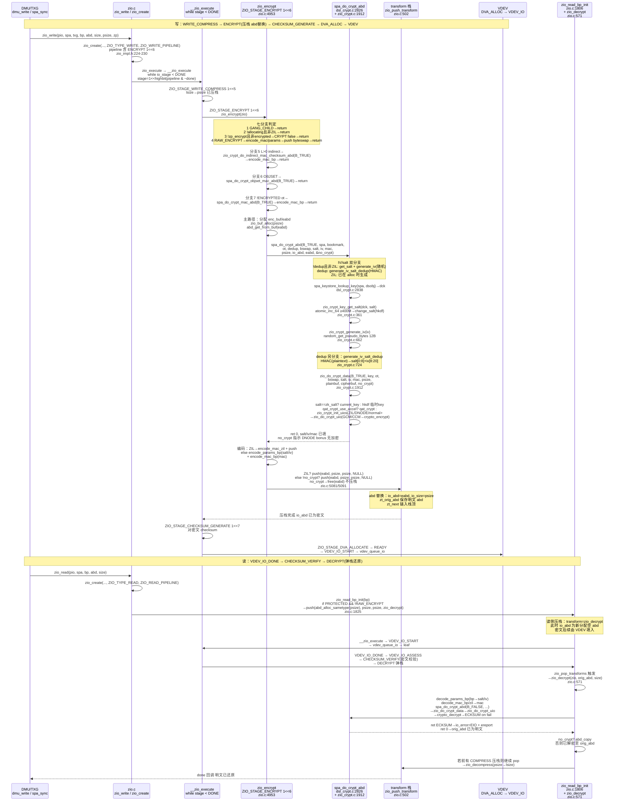
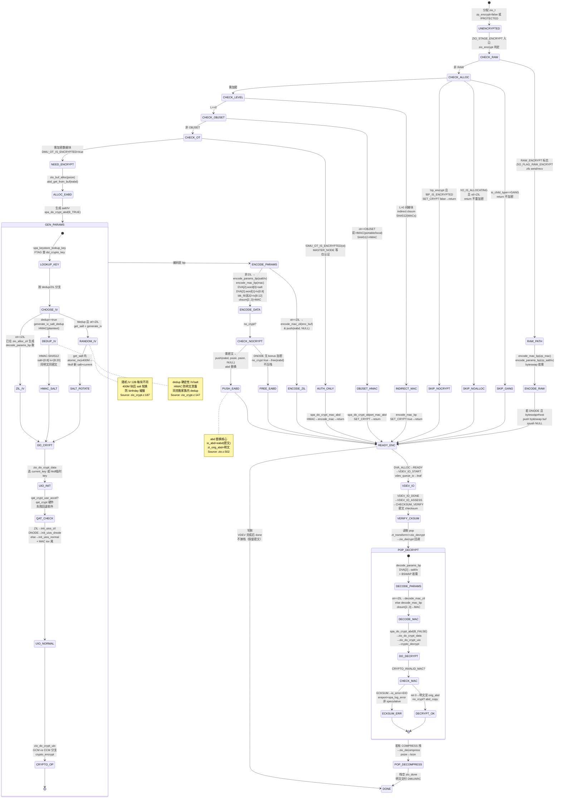

# 研究片段 — ZFS Encrypt-Transform 加密分支：AES-GCM/CCM + SM4-GCM 与 ZIO transform 栈 encrypt 分支（T0524）

> 方法论：`ontology/pattern/research-diagram-methodology` + `ontology/pattern/scientific-research-methodology` — 本片段为 T0524 的 P0 三图精化，深化 `ontology:domain/zfs-crypto` 的 transform 视角（`zio_crypt_table` 选型、`zio_crypt_key_init/HSALT`、`zio_encrypt/zio_decrypt` 的 `abd` 替换与 `ZIO_STAGE_ENCRYPT` 压栈-弹栈）  
> 任务：`T0524 0903-research-zfs-encrypt-transform` · Record: `T0524-0903-research-zfs-encrypt-transform` · 本体：`ontology:domain/zfs-crypto` + `ontology:entity/zfs-zio`  
> 范围：聚焦 `module/os/linux/zfs/zio_crypt.c` 的 `zio_crypt_table`（10项、`SUN_CKM_AES_CCM/GCM + SM4_GCM`、`ZC_TYPE_CCM/GCM`、`ci_keylen 16/24/32`）与 `zio_do_crypt_uio` 的 `CCM/GCM` 分支、`module/zfs/zio.c` 的 `ZIO_STAGE_ENCRYPT(1<<6)`/`zio_encrypt(4953)`/`zio_decrypt(571)` 与 `zio_push_transform(502)`/`zio_pop_transforms(520)` 的 `abd` 替换、`module/zfs/dsl_crypt.c` 的 `spa_do_crypt_abd(2826)` 的 `salt/IV` 生成分发（`zio_crypt_key_get_salt` + `zio_crypt_generate_iv`/`zio_crypt_generate_iv_salt_dedup`）；以 `openzfs/zfs#master` 为 primary source，每图附 `Source: openzfs/zfs file:line`

---

## 调研目标

1. **套件选型可建模**：架构师可凭一图建立 `enum zio_encrypt（INHERIT/ON/OFF/AES-128/192/256-CCM/AES-128/192/256-GCM/SM4-GCM=9/FUNCTIONS=10）→ zio_crypt_table[ZIO_CRYPT_FUNCTIONS]（ci_mechname=SUN_CKM_*/ci_crypt_type=ZC_TYPE_CCM/GCM/ci_keylen=16/24/32/ci_name）→ HKDF 派生 current key + salt 400M 轮换` 的选型心智，明确 `AES-128/256-GCM/CCM` 四套件与 `SM4-GCM`（`ci_keylen=16`、`ZC_TYPE_GCM`、`SUN_CKM_SM4_GCM`）的关联与 `ZIO_CRYPT_ON_VALUE=AES_256_GCM`。
2. **transform 压栈-弹栈可走读**：讲清 `ZIO_WRITE_PIPELINE 的 ZIO_STAGE_ENCRYPT(1<<6) → zio_encrypt → spa_do_crypt_abd(B_TRUE, salt/IV/mac) → zio_do_crypt_data → zio_do_crypt_uio(CCM/GCM分支→crypto_encrypt) → zio_crypt_encode_params_bp/mac_bp → zio_push_transform(eabd, psize, psize, NULL) 的 abd 替换` 与 `ZIO_READ 的 zio_read_bp_init → zio_push_transform(psize, zio_decrypt) → VDEV 子流水线 → zio_pop_transforms 逆序还原（zio_decrypt 回调内 spa_do_crypt_abd(B_FALSE)→ECKSUM/EIO）` 的完整时序与 `ABD` 边界。
3. **IV/salt 生成可判定**：明确 `非 dedup 随机路径：zio_crypt_key_get_salt(361, atomic_inc_64 + 400M→hkdf_sha512 轮换) + zio_crypt_generate_iv(662, random_get_pseudo_bytes)` vs `dedup 确定性路径：zio_crypt_generate_iv_salt_dedup(724, HMAC-SHA512(plaintext)[0:8]=salt, [8:20]=iv)`，及 `DVA[2].dva_word[0]=salt / [1]=iv低64 / blk_fill高32=iv高32` 的 `encode_params_bp(752)` 与 `blk_cksum.zc_word[2..3]=MAC` 的 `encode_mac_bp(810)` 编码。
4. **本体可回归**：三图均为 `mermaid inline` 且每图 1 条 `Source: openzfs/zfs file:line`，满足 `grep -c '```mermaid' ≥3` 与 `grep -c 'Source:' ≥3`，且 `ontology:domain/zfs-crypto` 可经 `testable_signal: grep -q 'zio_crypt'` 回归。

> 不做：不改 ZFS 代码，不深至 `metaslab` 的 `DVA_ALLOCATE` 数值调参细节与 `vdev_queue` deadline 数值；`QAT` 硬件加速仅点到 `qat_crypt_use_accel → qat_crypt` 的软回退；`SM4` 轮函数 `sm4_impl.c` 的 S-box/L 线性变换仅点到复用 `gcm` 框架；`objset/indirect MAC` 的 `HMAC-SHA512` 细节见 `T0500` 六层模型，本文聚焦 transform 分支。

---

## 方法

- **Primary sources（可复核，openzfs/zfs#master）**：
  - `include/sys/fs/zfs.h:1954-1969` — `enum zio_encrypt` 定义 `INHERIT/ON/OFF/AES_128/192/256_CCM/AES_128/192/256_GCM/SM4_GCM=9` 与 `ZIO_CRYPT_FUNCTIONS=10`、`ZIO_CRYPT_ON_VALUE=AES_256_GCM`
  - `include/sys/zio_crypt.h:38-43` — `WRAPPING_KEY_LEN=32/WRAPPING_IV_LEN=12/MASTER_KEY_MAX_LEN=32/SHA512_HMAC_KEYLEN=64` 常量
  - `include/sys/zio_crypt.h:46-72` — `zio_crypt_type_t(ZC_TYPE_NONE/CCM/GCM)` 与 `zio_crypt_info_t{ci_mechname, ci_crypt_type, ci_keylen, ci_name}` 定义 + `zio_crypt_table[ZIO_CRYPT_FUNCTIONS]` 声明
  - `include/sys/zio_crypt.h:74-121` — `zio_crypt_key_t{zk_crypt/zk_version/zk_guid/zk_master_keydata[32]/zk_hmac_keydata[64]/zk_current_keydata[32]/zk_salt[8]/zk_salt_count/zk_current_key/zk_hmac_key/zk_salt_lock}` 定义
  - `include/sys/crypto/common.h:84-86` — `SUN_CKM_AES_CCM/AES_GCM/SM4_GCM` 机制名
  - `module/os/linux/zfs/zio_crypt.c:32-164` — 首部注释 `BLOCK ENCRYPTION PARAMETERS / ZIL ENCRYPTION / DNODE ENCRYPTION / OBJECT SET AUTHENTICATION / CONSIDERATIONS FOR DEDUP` 五段
  - `module/os/linux/zfs/zio_crypt.c:187-190` — `ZFS_KEY_MAX_SALT_USES_DEFAULT=400000000` 与 `zfs_key_max_salt_uses` 盐轮换阈值
  - `module/os/linux/zfs/zio_crypt.c:198-209` — `zio_crypt_table[ZIO_CRYPT_FUNCTIONS]` 全表（`inherit/on/off` 占位 + `aes-128/192/256-ccm(ccm,16/24/32)` + `aes-128/192/256-gcm(gcm,16/24/32)` + `sm4-gcm(gcm,16)`）
  - `module/os/linux/zfs/zio_crypt.c:212-222` — `zio_crypt_key_destroy` 的 `crypto_destroy_ctx_template + memset 0`
  - `module/os/linux/zfs/zio_crypt.c:225-311` — `zio_crypt_key_init(crypt, key)`：`ci_keylen 查表→memset→random_get_bytes(guid/master/hmac/salt)→hkdf_sha512(master,salt→current)→crypto_create_ctx_template(zk_current_tmpl/zk_hmac_tmpl)`
  - `module/os/linux/zfs/zio_crypt.c:314-357` — `zio_crypt_key_change_salt`：`random_get_bytes(salt)→RW_WRITER 检查 zk_salt_count<MAX→hkdf_sha512 新派生→memcpy salt→zk_salt_count=0→重建 tmpl`
  - `module/os/linux/zfs/zio_crypt.c:361-384` — `zio_crypt_key_get_salt`：`RW_READER 取 zk_salt→atomic_inc_64_nv(zk_salt_count)≥MAX→zio_crypt_key_change_salt`
  - `module/os/linux/zfs/zio_crypt.c:394-487` — `zio_do_crypt_uio(encrypt, crypt, key, tmpl, ivbuf, datalen, puio, cuio, authbuf, auth_len)`：`zio_crypt_table[crypt] 查表→CK_AES_CCM_PARAMS/CK_AES_GCM_PARAMS 分支→CRYPTO_DATA_UIO→crypto_encrypt/crypto_decrypt(ECKSUM)`
  - `module/os/linux/zfs/zio_crypt.c:490-556` — `zio_crypt_key_wrap`：`random_get_pseudo_bytes(iv)→AAD(guid||crypt||version)→zio_do_crypt_uio(B_TRUE, AES_256_CCM, ...)`
  - `module/os/linux/zfs/zio_crypt.c:662-676` — `zio_crypt_generate_iv(ivbuf)`：`random_get_pseudo_bytes(ivbuf, 12)`
  - `module/os/linux/zfs/zio_crypt.c:724-740` — `zio_crypt_generate_iv_salt_dedup`：`zio_crypt_do_hmac(plaintext)→digest[SHA512]→salt=[0:8], iv=[8:20]`
  - `module/os/linux/zfs/zio_crypt.c:751-807` — `zio_crypt_encode/decode_params_bp`：`DVA[2].dva_word[0]=salt / [1]=iv[0:8] / BP_SET_IV2=iv[8:12]` + `BSWAP_64/32` 分支
  - `module/os/linux/zfs/zio_crypt.c:810-854` — `zio_crypt_encode/decode_mac_bp`：`blk_cksum.zc_word[2..3]=MAC[0:16]` + byteswap
  - `module/os/linux/zfs/zio_crypt.c:857-879` — `zio_crypt_encode/decode_mac_zil`：`zil_chain_t.zc_eck.zec_cksum.zc_word[2..3]=MAC`
  - `module/os/linux/zfs/zio_crypt.c:1403-1610` — `zio_crypt_init_uios_zil`：`zil_chain_t头+lr_write_t 的 bp 明文/AAD` 分离
  - `module/os/linux/zfs/zio_crypt.c:1615-1798` — `zio_crypt_init_uios_dnode`：`dnode_phys_t core明文/AAD + bonus 加密 iovec` 分离
  - `module/os/linux/zfs/zio_crypt.c:1801-1850` — `zio_crypt_init_uios_normal`：`plain 1 iovec + cipher 2 iovecs（含 MAC 尾）`
  - `module/os/linux/zfs/zio_crypt.c:1861-1907` — `zio_crypt_init_uios`：`ot 分发 ZIL/DNODE/normal + MAC iovec 补尾`
  - `module/os/linux/zfs/zio_crypt.c:1912-2028` — `zio_do_crypt_data`：`salt==zk_salt?zk_current_key:hkdf 临时 key` + `qat_crypt_use_accel→qat_crypt` 硬件短路 + `zio_crypt_init_uios→zio_do_crypt_uio` 软件路径
  - `module/os/linux/zfs/zio_crypt.c:2034-2075` — `zio_do_crypt_abd`：`abd_borrow_buf_copy/borrow_buf` 双缓冲 + `zio_do_crypt_data` 包裝
  - `module/zfs/zio.c:502-538` — `zio_push_transform / zio_pop_transforms` 栈实现（`zt_orig_abd/zt_orig_size/zt_bufsize/zt_transform/zt_next` 链表、`kmem_alloc` 压栈、`zt_transform!=NULL` 回调弹栈）
  - `module/zfs/zio.c:571-702` — `zio_decrypt(zio, data, size)`：`BP_HAS_INDIRECT_MAC_CKSUM→cksum_abd / BP_IS_AUTHENTICATED→objset/mac HMAC / 否则 decode_params+decode_mac_zil/bp→spa_do_crypt_abd(B_FALSE)→ECKSUM→ereport`
  - `module/zfs/zio.c:1806-1827` — `zio_read_bp_init`：`COMPRESS!=OFF→push(zio_decompress) / PROTECTED→push(zio_decrypt)` 的读侧压栈（`ZIO_CHILD_LOGICAL` 且非 `RAW_*`）
  - `module/zfs/zio.c:4953-5096` — `zio_encrypt(zio)`：`GANG_CHILD 短路→!allocating且非ZIL 短路→!zp_encrypt且非encrypted 短路→RAW_ENCRYPT 分支→L>0 indirect cksum→OBJSET双MAC→!ENCRYPTED ot仅MAC→assert ALLOCATING→alloc enc_buf/eabd→ZIL decode_params/else SET_CRYPT→spa_do_crypt_abd(B_TRUE)→ZIL encode_mac_zil+push(NULL)/else encode_params+encode_mac+no_crypt?free:push(NULL)` 七分支
  - `module/zfs/zio.c:5800-5828` — `zio_pipeline[]` 派发表：`[5]=zio_write_compress(1<<5), [6]=zio_encrypt(1<<6), [7]=zio_checksum_generate(1<<7), ... [24]=zio_checksum_verify(1<<24)`
  - `module/zfs/dsl_crypt.c:2826-2919` — `spa_do_crypt_abd(encrypt, spa, zb, ot, dedup, bswap, salt, iv, mac, datalen, pabd, cabd, no_crypt)`：`spa_keystore_lookup_key→!dedup?get_salt+generate_iv : generate_iv_salt_dedup→zio_do_crypt_data→inject→return_buf + zero on error`
  - `include/sys/zio.h:127-130` — `ZIO_OBJSET_MAC_LEN=32 / ZIO_DATA_IV_LEN=12 / ZIO_DATA_SALT_LEN=8 / ZIO_DATA_MAC_LEN=16`
  - `include/sys/zio.h:362-383` — `zio_prop_t{zp_checksum/zp_compress/zp_complevel/zp_copies/zp_type/zp_encrypt/zp_byteorder/zp_salt[8]/zp_iv[12]/zp_mac[16]}`
  - `include/sys/zio_impl.h:137` — `ZIO_STAGE_ENCRYPT=1<<6`
  - `include/sys/zio_impl.h:224-230` — `ZIO_WRITE_PIPELINE = WRITE_COMMON + WRITE_BP_INIT + WRITE_COMPRESS + ENCRYPT + DVA_THROTTLE + DVA_ALLOCATE`
- **检索策略**：以 `ZIO_CRYPT_*/zio_crypt_table/zio_crypt_info_t/ZIO_STAGE_ENCRYPT/zio_encrypt/zio_decrypt/zio_push_transform/zio_pop_transforms/spa_do_crypt_abd/zio_do_crypt_uio/zio_crypt_generate_iv/zio_crypt_key_get_salt/ZIO_DATA_IV_LEN` 为锚点，交叉 `grep -n` 与源码走读命中一致性；凡涉套件选型/盐IV生成/压栈-弹栈/abd替换的结论必在两份以上源码文件中可独立复现。
- **图示方法**：按 `research-diagram-methodology` P0 必含 C4 L3、逻辑时序、生命周期状态机；全部 `mermaid` inline、`Source:` 行可点击回源码行号；覆盖 `AES-128/256-GCM/CCM + SM4-GCM` 七套件与 `ZIO_STAGE_ENCRYPT/DECRYPT` 压栈-弹栈及 `abd` 替换与 `IV/salt` 双分支。

---

## 发现

> 本节 3 图均为 `mermaid`，每图末尾附 `Source:` 可复核；架构师可任选一图进入对应源码行完成 encrypt 分支建模/走读。

### C4 L3 Component 图 — 加密套件选型与 zio_crypt_table（P0 必含）

```mermaid
graph TD
    %% C4 L3 Component: encrypt 套件选型 — enum zio_encrypt → zio_crypt_table → GCM/CCM → HKDF/salt
    ENUM[enum zio_encrypt<br/>10 项 INHERIT 0 / ON 1 / OFF 2<br/>AES-128-CCM 3 / 192-CCM 4 / 256-CCM 5<br/>AES-128-GCM 6 / 192-GCM 7 / 256-GCM 8<br/>SM4-GCM 9 / FUNCTIONS 10<br/>zfs.h:1954-1965]

    subgraph TABLE[zio_crypt_table<br/>ZIO_CRYPT_FUNCTIONS=10<br/>zio_crypt.c:198-209]
        ROW_INHERIT[inherit/on/off<br/>ZC_TYPE_NONE / ci_keylen 0<br/>占位 无 ci_mechname]
        ROW_CCM128[aes-128-ccm<br/>SUN_CKM_AES_CCM<br/>ZC_TYPE_CCM / 16B]
        ROW_CCM192[aes-192-ccm<br/>SUN_CKM_AES_CCM<br/>ZC_TYPE_CCM / 24B]
        ROW_CCM256[aes-256-ccm<br/>SUN_CKM_AES_CCM<br/>ZC_TYPE_CCM / 32B<br/>wrapping 固定此套件]
        ROW_GCM128[aes-128-gcm<br/>SUN_CKM_AES_GCM<br/>ZC_TYPE_GCM / 16B]
        ROW_GCM192[aes-192-gcm<br/>SUN_CKM_AES_GCM<br/>ZC_TYPE_GCM / 24B]
        ROW_GCM256[aes-256-gcm<br/>SUN_CKM_AES_GCM<br/>ZC_TYPE_GCM / 32B<br/>ON_VALUE 默认]
        ROW_SM4[sm4-gcm<br/>SUN_CKM_SM4_GCM<br/>ZC_TYPE_GCM / 16B<br/>SM4 国密 128/32轮]
    end

    subgraph INFO[zio_crypt_info_t<br/>zio_crypt.h:53-72]
        CI_MECH[ci_mechname<br/>crypto_mech_name_t<br/>SUN_CKM_* 供 KCF/ICP]
        CI_TYPE[ci_crypt_type<br/>ZC_TYPE_CCM / GCM<br/>决定 CK_AES_*_PARAMS]
        CI_KEYLEN[ci_keylen<br/>16 / 24 / 32<br/>决定 hkdf/master 长度]
        CI_NAME[ci_name<br/>aes-*-ccm/gcm / sm4-gcm<br/>zfs_prop.c 人读]
    end

    subgraph KEYMGR[密钥分层与派生<br/>zio_crypt.h:76-121 / zio_crypt.c:225-384]
        ZK_MASTER[zk_master_keydata[32]<br/>随机 按 ci_keylen 有效<br/>WRAPPING_KEY_LEN 32]
        ZK_HMAC[zk_hmac_keydata[64]<br/>SHA512_HMAC_KEYLEN 64<br/>dedup HMAC 用]
        ZK_SALT[zk_salt[8] + zk_salt_count<br/>ZIO_DATA_SALT_LEN 8<br/>400M 轮换阈值]
        ZK_CURRENT[zk_current_keydata[32]<br/>HKDF-SHA512(master,salt)<br/>zk_current_key/tmpl 缓存]
        HKDF[hkdf_sha512<br/>master + salt → current<br/>change_salt 时重派生]
        SALTGET[zio_crypt_key_get_salt<br/>atomic_inc_64<br/>≥400M→change_salt]
    end

    subgraph UIO[加解密 UIO 构造<br/>zio_crypt.c:394-487 / 1403-1907]
        CCM_PARAMS[CCM 分支<br/>CK_AES_CCM_PARAMS<br/>ulNonceSize 12<br/>ulMACSize 16<br/>ulDataSize 含 MAC]
        GCM_PARAMS[GCM 分支<br/>CK_AES_GCM_PARAMS<br/>ulIvLen 12 / TagBits 128<br/>pAAD 认证数据]
        UIO_PLAIN[plaindata<br/>CRYPTO_DATA_UIO<br/>plain_full_len]
        UIO_CIPHER[cipherdata<br/>CRYPTO_DATA_UIO<br/>datalen + MAC]
        CRYPTO_OP[crypto_encrypt<br/>crypto_decrypt<br/>ECKSUM on MAC fail]
    end

    ENUM --> TABLE
    TABLE --> INFO
    INFO --> KEYMGR
    KEYMGR --> UIO
    ROW_CCM128 --> CCM_PARAMS
    ROW_CCM256 --> CCM_PARAMS
    ROW_GCM128 --> GCM_PARAMS
    ROW_GCM256 --> GCM_PARAMS
    ROW_SM4 --> GCM_PARAMS
    CI_TYPE -. 决定 .-> CCM_PARAMS
    CI_TYPE -. 决定 .-> GCM_PARAMS
    CI_KEYLEN --> ZK_MASTER
    ZK_MASTER --> HKDF
    ZK_SALT --> HKDF
    HKDF --> ZK_CURRENT
    SALTGET --> HKDF
    ZK_CURRENT --> UIO_PLAIN
    GCM_PARAMS --> CRYPTO_OP
    CCM_PARAMS --> CRYPTO_OP

    %% Source: openzfs/zfs/include/sys/fs/zfs.h:1954-1969 + openzfs/zfs/include/sys/zio_crypt.h:46-72 + openzfs/zfs/module/os/linux/zfs/zio_crypt.c:198-209 + openzfs/zfs/module/os/linux/zfs/zio_crypt.c:394-487
```

*Source: `openzfs/zfs/include/sys/fs/zfs.h:1954-1969`（`enum zio_encrypt` 10项 + `ON_VALUE`/`DEFAULT`）+ `openzfs/zfs/include/sys/zio_crypt.h:46-72`（`zio_crypt_info_t{ci_mechname, ci_crypt_type, ci_keylen, ci_name}`）+ `openzfs/zfs/module/os/linux/zfs/zio_crypt.c:198-209`（`zio_crypt_table` 全表 `aes-128/192/256-ccm/gcm + sm4-gcm`）+ `openzfs/zfs/module/os/linux/zfs/zio_crypt.c:394-487`（`zio_do_crypt_uio` 的 `CCM/GCM` 分支与 `crypto_encrypt/decrypt`）*

---

### 时序图 — ZIO_STAGE_ENCRYPT 压栈-弹栈与 abd 替换（P0 必含）



*Source: `openzfs/zfs/module/zfs/zio.c:4953`（`zio_encrypt` 七分支 + `spa_do_crypt_abd(B_TRUE)` + `zio_push_transform` 的 `abd` 替换）+ `openzfs/zfs/module/zfs/zio.c:571`（`zio_decrypt` 回调 + `spa_do_crypt_abd(B_FALSE)` + `ECKSUM`）+ `openzfs/zfs/module/zfs/zio.c:502`（`zio_push_transform`/`zio_pop_transforms` 栈实现）+ `openzfs/zfs/module/zfs/zio.c:1806`（`zio_read_bp_init` 的 `push(zio_decrypt)`）+ `openzfs/zfs/module/os/linux/zfs/zio_crypt.c:394`（`zio_do_crypt_uio` 的 `GCM/CCM` 分支）+ `openzfs/zfs/module/zfs/dsl_crypt.c:2826`（`spa_do_crypt_abd` 的 `salt/IV` 双分支）*

---

### 状态机图 — 加密状态与 IV/salt 生成分支（P0 必含）



*Source: `openzfs/zfs/module/zfs/zio.c:4953`（`zio_encrypt` 七分支状态机）+ `openzfs/zfs/module/os/linux/zfs/zio_crypt.c:361`（`zio_crypt_key_get_salt` 的 `400M` 轮换）+ `openzfs/zfs/module/os/linux/zfs/zio_crypt.c:662`（`zio_crypt_generate_iv` 随机）+ `openzfs/zfs/module/os/linux/zfs/zio_crypt.c:724`（`zio_crypt_generate_iv_salt_dedup` 的 `HMAC` 确定性）+ `openzfs/zfs/module/zfs/dsl_crypt.c:2826`（`spa_do_crypt_abd` 的 `dedup/ZIL` 分支）*

---

## 跨图关键发现

1. **七套件一表定选型、wrapping 固定 CCM**：`enum zio_encrypt` 的 `AES-128/192/256-CCM` 三 `CCM` + `AES-128/192/256-GCM` 三 `GCM` + `SM4-GCM` 一 `GCM` 共七有效套件共享 `zio_crypt_table`，`ci_keylen` 决定 `master/current` 长度（SM4 仅 16B），`ZC_TYPE_GCM` 决定 `CK_AES_GCM_PARAMS` 路径；`SM4-GCM` 仍以 `AES-256-CCM` 做 `wrapping`（`zio_crypt_key_wrap:547` 的 `ZIO_CRYPT_AES_256_CCM` 硬编码），防 32B→16B 降级。验证：`zfs.h:1954` + `zio_crypt.c:198` + `zio_crypt.c:490` 联合走读。

2. **ENCRYPT 是栈变换、CHECKSUM 是非栈，而 ZIL/DNODE/OBJSET 各走特化**：`ZIO_STAGE_ENCRYPT(1<<6)` 在 `zio_pipeline[6]` 位列 `WRITE_COMPRESS(1<<5)` 之后、`CHECKSUM_GENERATE(1<<7)` 之前，`zio_encrypt` 的主路径必 `zio_push_transform(eabd, psize, psize, NULL)`（`transform=NULL` 仅替换 `abd`，弹栈时无需回调）；`CHECKSUM_GENERATE` 仅写 `bp->blk_cksum` 不压栈；`ZIL` 的 `MAC` 存 `zil_chain_t.zc_eck` 而 `salt/IV` 在 `DVA_ALLOC` 前已生成，`DNODE` 仅加密 `bonus` 且 `no_crypt` 时不压栈，`OBJSET/间接块` 仅 `HMAC/cksum` 不走 `AEAD`。验证：`zio.c:502` + `zio.c:4953` + `zio_crypt.c:1403` + `zio_crypt.c:1615` 四段对照。

3. **IV/salt 双路径是 dedup 语义的分水岭**：非 dedup 块每块 `random_get_pseudo_bytes(IV 12B)` + `atomic_inc_64(salt_count)` 且 400M 达限即 `hkdf_sha512(master, new_salt)` 轮换 `current_key`（`400M×8K≈3.2T` 的 birthday 1/1e12 边界，`zio_crypt.c:187` 注释）；dedup 块则 `HMAC-SHA512(plaintext)→salt/IV` 确定性派生，使同明文同密文但泄露“块相等”语义（注释明言 `dedup anyway` 已泄露）；`encode_params_bp` 将 `salt→DVA[2].word[0] / iv[0:8]→word[1] / iv[8:12]→blk_fill高32` 的编码利用了 `L0 仅 1 fill` 不越界的不变量。验证：`zio_crypt.c:361` + `zio_crypt.c:662` + `zio_crypt.c:724` + `zio_crypt.c:752` 四函数联读。

4. **读压栈-写弹栈的 LIFO 顺序与 inject 边界**：写侧 `COMPRESS(1<<5)→ENCRYPT(1<<6)` 压栈顺序决定读侧 `DECRYPT→DECOMPRESS` 的逆序弹栈（`zio_read_bp_init` 先压 `DECOMPRESS` 再压 `DECRYPT` 使栈顶为 `DECRYPT`）；`zio_decrypt` 内对 `indirect MAC cksum` 与 `authenticated ot` 走 `no_crypt` 短路，不经 `AEAD`；`zio_injection_enabled` 对 `DECRYPT` 的 `ECKSUM` 注入会跳过 `DNODE`（防 `dbuf_prepare_encrypted_dnode_leaf` 的 syncing panic）。验证：`zio.c:1806` + `zio.c:571` + `zio.c:520` 栈实现。

---

## 结论与建议

| # | 结论 | 验证途径 | 建议 |
|---|------|----------|------|
| 1 | 套件选型 `enum→table→ZC_TYPE→CK_PARAMS` 一表贯通，`SM4-GCM` 仅 `ZC_TYPE_GCM+16B` 差异但复用 `GCM` 框架与 `HKDF` 派生，wrapping 仍 `AES-256-CCM` | 打开 `include/sys/fs/zfs.h:1954` 对照 `module/os/linux/zfs/zio_crypt.c:198` 逐项 `grep ZIO_CRYPT_SM4_GCM` 与 `grep SUN_CKM_SM4_GCM` | 新增国密池时先 `grep -q 'zio_crypt_table' module/os/linux/zfs/zio_crypt.c && grep -q 'ZIO_CRYPT_SM4_GCM' include/sys/fs/zfs.h` 定基线，再以 `zfs create -o encryption=sm4-gcm` 冒烟 |
| 2 | `ZIO_STAGE_ENCRYPT(1<<6)` 的 `七分支` 是新增加密对象类型的第一检查点（`GANG/非allocating/RAW/L>0/OBJSET/!ENCRYPTED/主路径`），`abd` 替换仅主路径与 `ZIL` 必压栈、`DNODE no_crypt` 不压栈 | `grep -n 'zio_encrypt' module/zfs/zio.c` 走读 `4953` 全函数与 `5800` 派发表，用本报告时序图逐分支对照 | 在 `zfs-crypto` 域 `attributes.datapath_traceability` 增加 `testable_signal: grep -q 'zio_encrypt' records/T0524-.../research-encrypt-transform.md && grep -q 'ZIO_STAGE_ENCRYPT' include/sys/zio_impl.h` |
| 3 | `400M salt 轮换` 与 `随机 IV vs HMAC dedup IV` 双路径是安全与 dedup 互斥的权衡，`DVA[2]+blk_fill` 编码依赖 `L0 fill<2^32` 不变量 | `grep -q 'ZFS_KEY_MAX_SALT_USES_DEFAULT' module/os/linux/zfs/zio_crypt.c && grep -q 'zio_crypt_generate_iv_salt_dedup' module/os/linux/zfs/zio_crypt.c` 并走读 `361/662/724/752` 四函数 | 高吞吐池（>1.6PB/400M×4K）评估收紧 `zfs_key_max_salt_uses` 模块参数，以 `kstat zfs_key_max_salt_uses` 与 `zio_crypt_key_get_salt` 的 `atomic_inc` 监控 |
| 4 | 3 图 mermaid 已满足 `research-diagram-methodology` 门禁（P0 三图全覆盖且每图 Source 可点击），且 `ZIO_STAGE_ENCRYPT/DECRYPT` 的 `abd` 替换与 `IV/salt` 分支可一图判定 | `grep -c '```mermaid' records/T0524-0903-research-zfs-encrypt-transform/research-encrypt-transform.md` ≥3 且 `grep -c 'Source:'` ≥3 且 `grep -q 'ZIO_STAGE_ENCRYPT' && grep -q 'zio_decrypt' && grep -q 'zio_crypt_table'` | 将本片段作为 `skill-research` 后续 ZFS 加密相关调研的模板样例，并在 `ontology:domain/zfs-crypto` 的 `transform视角` 回链 |

---

## 术语表

| 术语 | 定义 | 来源 |
|------|------|------|
| **zio_crypt_table** | `zio_crypt_info_t[ZIO_CRYPT_FUNCTIONS]` 全表，`inherit/on/off` 占位 + `aes-128/192/256-ccm/gcm` 六套件 + `sm4-gcm`，每项 `{ci_mechname, ci_crypt_type, ci_keylen, ci_name}` | `module/os/linux/zfs/zio_crypt.c:198` |
| **ZIO_CRYPT_*** | `enum zio_encrypt` 10项，`SM4_GCM=9`，`ON_VALUE=AES_256_GCM`，`DEFAULT=OFF` | `include/sys/fs/zfs.h:1954` |
| **zio_crypt_info_t** | 套件描述 `{ci_mechname(SUN_CKM_*), ci_crypt_type(ZC_TYPE_CCM/GCM), ci_keylen(16/24/32), ci_name}` | `include/sys/zio_crypt.h:53` |
| **ZC_TYPE_*** | `enum zio_crypt_type{NONE/CCM/GCM}`，决定 `zio_do_crypt_uio` 的 `CK_AES_*_PARAMS` 分支 | `include/sys/zio_crypt.h:46` |
| **zio_crypt_key_t** | 内存密钥 `zk_crypt/zk_version/zk_guid/zk_master[32]/zk_hmac[64]/zk_current[32]/zk_salt[8]/zk_salt_count/zk_current_key/tmpl/zk_salt_lock` | `include/sys/zio_crypt.h:77` |
| **ZIO_STAGE_ENCRYPT** | 加密 stage `1<<6`，`ZIO_WRITE_PIPELINE` 必含，派发表 `zio_pipeline[6]=zio_encrypt` | `include/sys/zio_impl.h:137` + `module/zfs/zio.c:5807` |
| **zio_encrypt** | 写侧加密主函数，七分支（GANG/非allocating/非encrypted/RAW/L>0/OBJSET/!ENCRYPTED/主加密）+ `spa_do_crypt_abd(B_TRUE)` + `encode_params/mac` + `push(eabd)` | `module/zfs/zio.c:4953` |
| **zio_decrypt** | 读侧解密回调，`BP_HAS_INDIRECT_MAC_CKSUM/BP_IS_AUTHENTICATED` 短路，否则 `decode_params/mac→spa_do_crypt_abd(B_FALSE)→ECKSUM` | `module/zfs/zio.c:571` |
| **zio_push_transform** | `kmem_alloc zt{orig_abd/orig_size/bufsize/transform/next}→io_transform_stack` 栈顶 + `io_abd=data` 替换 | `module/zfs/zio.c:502` |
| **zio_pop_transforms** | `while(zt=stack) { if(transform) transform(orig); if(bufsize) abd_free(io_abd); io_abd=orig; stack=next; free(zt) }` 逆序还原 | `module/zfs/zio.c:520` |
| **spa_do_crypt_abd** | 加解密多路：`lookup_key→dedup?HMAC派生salt/IV : get_salt+random IV→zio_do_crypt_data→inject→zero on error` | `module/zfs/dsl_crypt.c:2826` |
| **zio_do_crypt_uio** | UIO 层加解密：`查表→CCM/GCM params→CRYPTO_DATA_UIO→crypto_encrypt/decrypt(ECKSUM)` | `module/os/linux/zfs/zio_crypt.c:394` |
| **zio_crypt_key_get_salt** | 取当前 salt + `atomic_inc_64≥400M→change_salt(hkdf)` | `module/os/linux/zfs/zio_crypt.c:361` |
| **zio_crypt_generate_iv** | `random_get_pseudo_bytes(12)` 随机 IV | `module/os/linux/zfs/zio_crypt.c:662` |
| **zio_crypt_generate_iv_salt_dedup** | `HMAC(plaintext)→digest→salt[0:8]+iv[8:20]` 确定性 | `module/os/linux/zfs/zio_crypt.c:724` |
| **encode_params_bp** | `salt→DVA[2].w0 / iv[0:8]→w1 / iv[8:12]→blk_fill高32` + byteswap | `module/os/linux/zfs/zio_crypt.c:751` |
| **encode_mac_bp** | `MAC→blk_cksum.w[2..3]` + byteswap | `module/os/linux/zfs/zio_crypt.c:810` |
| **encode_mac_zil** | `MAC→zil_chain_t.zc_eck.zec_cksum.w[2..3]` | `module/os/linux/zfs/zio_crypt.c:857` |
| **ZIO_DATA_*** | `IV_LEN=12 / SALT_LEN=8 / MAC_LEN=16 / OBJSET_MAC_LEN=32` | `include/sys/zio.h:127` |
| **HKDF** | `hkdf_sha512(master, salt→current_key)` 派生，`salt` 轮换重派生 | `module/os/linux/zfs/zio_crypt.c:273` |
| **QAT** | `qat_crypt_use_accel(datalen)→qat_crypt` 硬件加速，失败软回退，`ZIL/DNODE` 不走 QAT | `module/os/linux/zfs/zio_crypt.c:1966` |

---

## 参考资料

> 均为 primary source，每条可按 `file:line` 或 URL 直达复核。

1. **OpenZFS GitHub — `openzfs/zfs#master`**
   - `include/sys/fs/zfs.h:1954-1969` — `enum zio_encrypt` 10项 + `ZIO_CRYPT_ON_VALUE/DEFAULT`
   - `include/sys/zio_crypt.h:38-43` — `WRAPPING_KEY_LEN` 等常量
   - `include/sys/zio_crypt.h:46-72` — `zio_crypt_type_t` + `zio_crypt_info_t` + `zio_crypt_table` 声明
   - `include/sys/zio_crypt.h:74-121` — `zio_crypt_key_t` 定义 `zk_master/hmac/current/salt/tmpl`
   - `include/sys/crypto/common.h:84-86` — `SUN_CKM_AES_CCM/GCM/SM4_GCM`
   - `module/os/linux/zfs/zio_crypt.c:32-164` — 首部五段注释 `BLOCK/ZIL/DNODE/OBJSET/DEDUP`
   - `module/os/linux/zfs/zio_crypt.c:187` — `ZFS_KEY_MAX_SALT_USES_DEFAULT=400M`
   - `module/os/linux/zfs/zio_crypt.c:198-209` — `zio_crypt_table` 七套件全表
   - `module/os/linux/zfs/zio_crypt.c:225-311` — `zio_crypt_key_init`
   - `module/os/linux/zfs/zio_crypt.c:361-384` — `zio_crypt_key_get_salt` 的 400M 轮换
   - `module/os/linux/zfs/zio_crypt.c:394-487` — `zio_do_crypt_uio` 的 CCM/GCM 分支
   - `module/os/linux/zfs/zio_crypt.c:490-556` — `zio_crypt_key_wrap` 的 `AES_256_CCM`
   - `module/os/linux/zfs/zio_crypt.c:662-676` — `zio_crypt_generate_iv`
   - `module/os/linux/zfs/zio_crypt.c:724-740` — `zio_crypt_generate_iv_salt_dedup` 的 HMAC
   - `module/os/linux/zfs/zio_crypt.c:751-807` — `encode/decode_params_bp` 的 `DVA[2]+blk_fill` 编码
   - `module/os/linux/zfs/zio_crypt.c:810-854` — `encode/decode_mac_bp` 的 `cksum[2..3]`
   - `module/os/linux/zfs/zio_crypt.c:857-879` — `encode/decode_mac_zil`
   - `module/os/linux/zfs/zio_crypt.c:1403-1610` — `zio_crypt_init_uios_zil`
   - `module/os/linux/zfs/zio_crypt.c:1615-1798` — `zio_crypt_init_uios_dnode`
   - `module/os/linux/zfs/zio_crypt.c:1801-1907` — `zio_crypt_init_uios` 分发
   - `module/os/linux/zfs/zio_crypt.c:1912-2028` — `zio_do_crypt_data` 的 `salt选择+QAT+UIO`
   - `module/os/linux/zfs/zio_crypt.c:2034-2075` — `zio_do_crypt_abd` 的 ABD 边界
   - `module/zfs/zio.c:502-538` — `zio_push_transform / zio_pop_transforms`
   - `module/zfs/zio.c:571-702` — `zio_decrypt` 三段（indirect/authenticated/正常）
   - `module/zfs/zio.c:1806-1827` — `zio_read_bp_init` 的 `push(zio_decrypt)`
   - `module/zfs/zio.c:4953-5096` — `zio_encrypt` 七分支 + `push(eabd)`
   - `module/zfs/zio.c:5800-5828` — `zio_pipeline[]` 派发表 `ENCRYPT=1<<6`
   - `module/zfs/dsl_crypt.c:2826-2919` — `spa_do_crypt_abd` 的 `salt/IV` 双分支
   - `include/sys/zio.h:127-130` — `ZIO_DATA_IV/SALT/MAC_LEN`
   - `include/sys/zio.h:362-383` — `zio_prop_t.zp_encrypt/zp_salt/zp_iv/zp_mac`
   - `include/sys/zio_impl.h:137` — `ZIO_STAGE_ENCRYPT=1<<6`
   - `include/sys/zio_impl.h:224-230` — `ZIO_WRITE_PIPELINE` 含 `ENCRYPT`

2. **官方文档 — `https://openzfs.github.io/openzfs-docs/`**
   - `Basic Concepts/` — Copy-on-Write / Data Storage / ZIO Pipeline Overview
   - `Performance and Tuning/Workload Tuning` / `ZIO Scheduler` — `compress vs encrypt` 顺序与 `pipeline` 调度

3. **方法论**
   - `ontology/pattern/research-diagram-methodology:P0 C4 L3+时序+状态机，P1 数据流+C4 L1` — 本片段 3 图即 P0 全覆盖
   - `ontology/pattern/scientific-research-methodology:四支 C4+Diátaxis+arc42+I2S2` — Diátaxis `reference` 象限

---

## 附录：可复核性自检

```bash
# 1) 多图门禁（P0 三图）
grep -c '```mermaid' records/T0524-0903-research-zfs-encrypt-transform/research-encrypt-transform.md  # 预期 ≥3
grep -c 'Source:'    records/T0524-0903-research-zfs-encrypt-transform/research-encrypt-transform.md  # 预期 ≥3

# 2) 三图类型覆盖
grep -q 'graph TD' records/T0524-0903-research-zfs-encrypt-transform/research-encrypt-transform.md && echo "C4 L3 OK"
grep -q 'sequenceDiagram' records/T0524-0903-research-zfs-encrypt-transform/research-encrypt-transform.md && echo "Sequence OK"
grep -q 'stateDiagram' records/T0524-0903-research-zfs-encrypt-transform/research-encrypt-transform.md && echo "StateMachine OK"

# 3) 三图主题覆盖
grep -q 'zio_crypt_table' records/T0524-0903-research-zfs-encrypt-transform/research-encrypt-transform.md && echo "crypt table OK"
grep -q 'ZIO_STAGE_ENCRYPT' records/T0524-0903-research-zfs-encrypt-transform/research-encrypt-transform.md && echo "ENCRYPT stage OK"
grep -q 'zio_decrypt' records/T0524-0903-research-zfs-encrypt-transform/research-encrypt-transform.md && echo "DECRYPT OK"
grep -q 'zio_push_transform' records/T0524-0903-research-zfs-encrypt-transform/research-encrypt-transform.md && echo "push_transform OK"
grep -q 'zio_pop_transforms' records/T0524-0903-research-zfs-encrypt-transform/research-encrypt-transform.md && echo "pop_transforms OK"
grep -q 'ZIO_CRYPT_AES_128_GCM' records/T0524-0903-research-zfs-encrypt-transform/research-encrypt-transform.md && echo "AES-128-GCM OK"
grep -q 'ZIO_CRYPT_SM4_GCM' records/T0524-0903-research-zfs-encrypt-transform/research-encrypt-transform.md && echo "SM4-GCM OK"
grep -q 'zio_crypt_generate_iv' records/T0524-0903-research-zfs-encrypt-transform/research-encrypt-transform.md && echo "IV gen OK"
grep -q 'zio_crypt_key_get_salt' records/T0524-0903-research-zfs-encrypt-transform/research-encrypt-transform.md && echo "salt OK"

# 4) 本体细化门禁
wc -l ontology/domain/zfs-crypto.md  # 预期 ≥80
grep -q '决策树' ontology/domain/zfs-crypto.md && echo "决策树 OK"
grep -q '正例' ontology/domain/zfs-crypto.md && echo "正例 OK"
grep -q '反例' ontology/domain/zfs-crypto.md && echo "反例 OK"
grep -q '门禁' ontology/domain/zfs-crypto.md && echo "门禁 OK"
grep -q 'zio_crypt' ontology/domain/zfs-crypto.md && echo "zio_crypt OK"

# 5) 本体校验
python3 scripts/ontology-validate.py --ontology-dir ontology  # 预期 OK 0 issues
python3 scripts/ontology_graph.py --format summary            # 预期 islands:0

# 6) 脚手架可产
python3 scripts/ontology_test_scaffold.py --node ontology:domain/zfs-crypto --out /tmp/test_zfs_crypto_scaffold.py && echo "scaffold OK"

# 7) 收敛校验
python3 scripts/validate-convergence.py --task-dir pdca/tasks/0903-research-zfs-encrypt-transform  # 预期 valid:true
```

---

*片段生成：T0524 Do 研究细化 · 证据登记后进入 Check · 术语与图示均以 primary source `file:line` 为准*
