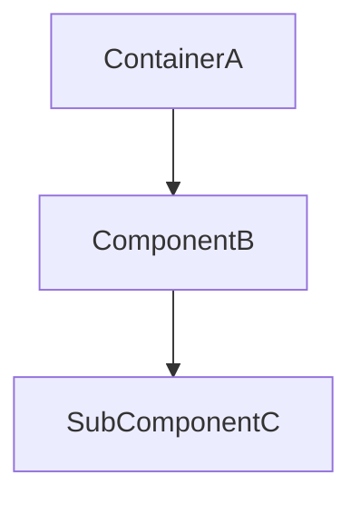
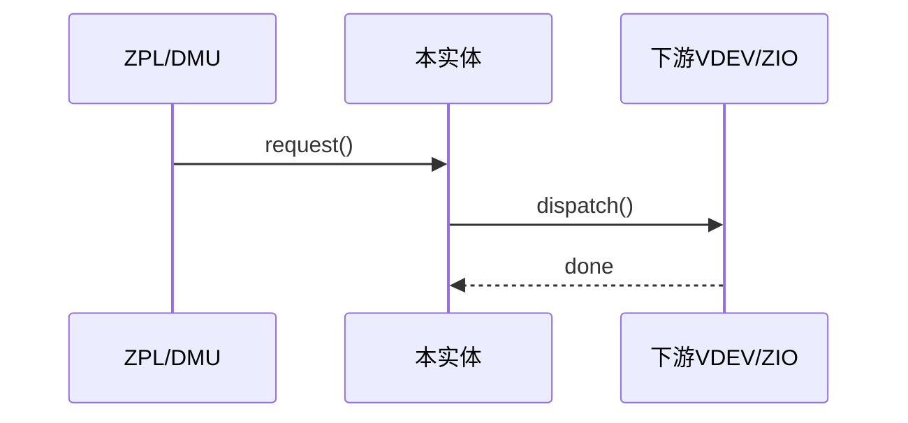
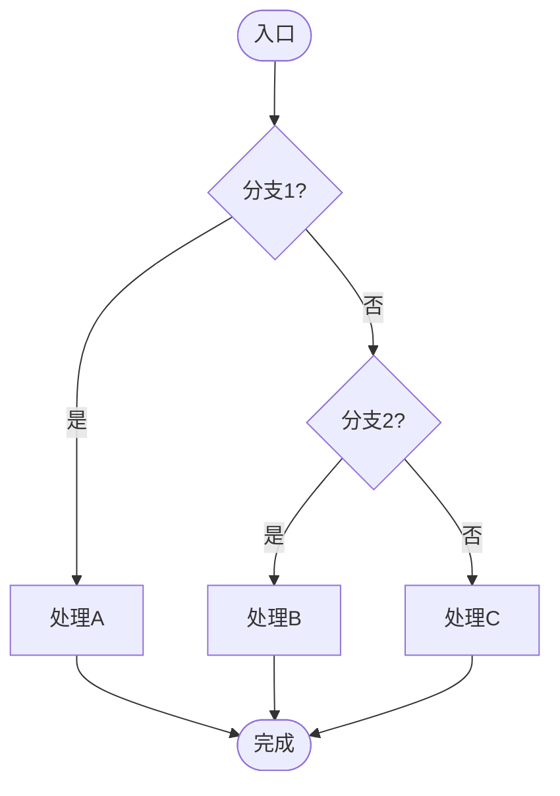

# 【填】实体名（中文+英文）

一句话定位：【填】该实体在全栈中的位置与上下游衔接（ZPL→DMU→DSL→SPA→ZIO→VDEV 横切 ARC 等）。

## C4 L3 Component — 【填】容器与关系

描述：`【填】结构体` 核心字段 `【填】` 与 `【填】` 的层级与持久化（`【填】` 序列化），`C4 L3` 图以 `【填】 → 【填】 → 【填】` 三层呈现。



Source: `openzfs/zfs/include/sys/<file>.h:20-60`（含 `【填】` 定义）+ `openzfs/zfs/module/zfs/<file>.c:20-60`

## 时序 — 【填】完整链

1) `【填】` → 2) `【填】` → 3) `【填】` → 4) `【填】` → 5) `【填】`，时序图覆盖 `【填】 → 【填】 → 【填】` 全链。



Source: `openzfs/zfs/module/zfs/<file>.c:100-200`（`【填】` 时序）

## 状态机 — 【填】生命周期

五态：`S1 → S2 → S3 → S4 → S5`，关键变迁 `【填】` 需 `【填】` 触发，状态机图覆盖全部变迁与 `【填】` 分支。


Source: `openzfs/zfs/include/sys/<file>.h:40-80`（`【填】` 枚举）+ `openzfs/zfs/module/zfs/<file>.c:300-400`

## 决策树



Source: `openzfs/zfs/module/zfs/<file>.c:400-500`（`【填】` 分支）

## 正例

```c
// 正例：正确的配对与时序
// 【填】先 hold 再 assign，transform 压弹配对，taskq 分发
【填】示例代码，体现三属性配对正确
// 验证：【填】与【填】配对，【填】一致
```

命中：【填】配对正确，【填】边界一致。

## 反例

```c
// 反例1：【填】缺配对导致【填】
// 错：漏 【填】，结果 【填】
// 正确：【填】

// 反例2：锁序反转
// 错：先 A 锁再 B 锁，与正例 ABBA 死锁
// 正确：先 B 再 A
```

## 门禁

- **多图门禁**：`grep -c '```mermaid' records/<record>/research-*.md` ≥3
- **溯源门禁**：`grep -c 'Source:' records/<record>/research-*.md` ≥3 且每图附 `openzfs/zfs file:line`
- **正文门禁**：`wc -l ontology/entity/<entity>.md` ≥60 且 `grep -q '决策树' && grep -q '正例' && grep -q '反例' && grep -q '门禁'`
- **属性门禁**：`attributes` ≥3 且每条 `testable_signal` 含 `grep -q` 动词+判定且双源可回归
- **本体校验**：`python3 scripts/ontology-validate.py --ontology-dir ontology` 0 issues 且 `islands:0`
- **脚手架门禁**：`python3 scripts/ontology_test_scaffold.py --node ontology:entity/<entity> --out /tmp/x.py` 可产且 `pytest --collect-only` 可收集
- **Gate 门禁**：`python3 scripts/production-ontology-gate.py --node ontology:entity/<entity>` GATE OK

Source: `openzfs/zfs/module/zfs/<file>.c` + `openzfs/zfs/include/sys/<file>.h`
