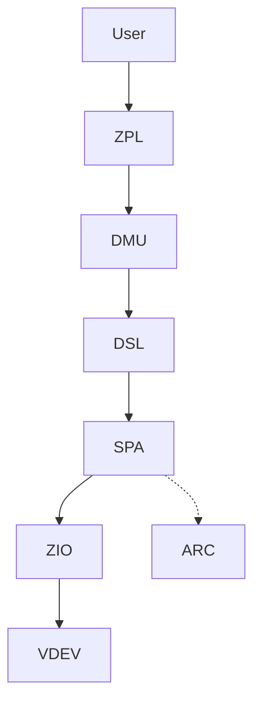
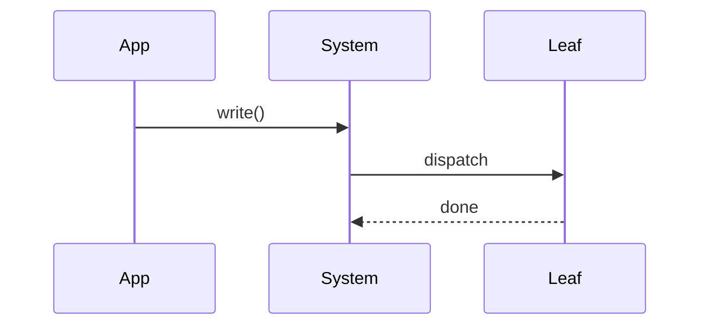
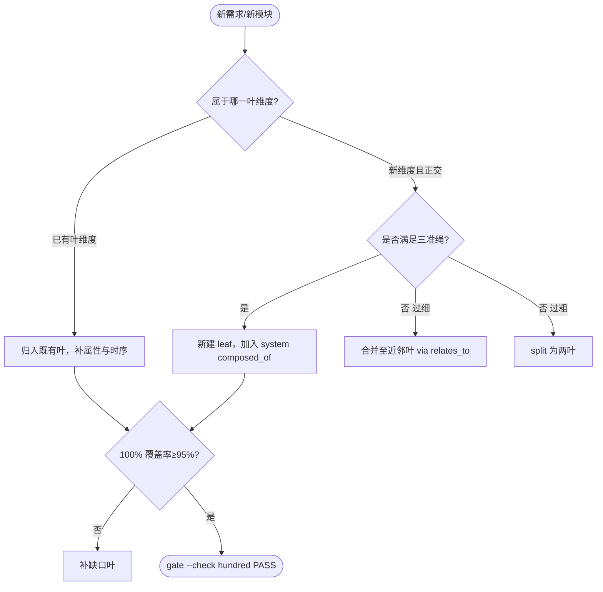

# 【填】全栈系统（System）

系统聚合：`composed_of` 【填】叶（`【填】`），以 `research-diagram-methodology` 多图 `mermaid` 为可视化证据（C4 L2 全栈 + 核心 pipeline 时序 + 聚合决策树），每图附 `Source: file:line` 直达 `openzfs/zfs#master`。

验证：`grep -c '```mermaid' records/<record>/research-report.md` ≥3 且 `python3 scripts/ontology-validate.py` 0 issue 且 `islands:0`。

Source: `records/<record>/research-report.md` + `openzfs/zfs/include/sys/<file>.h`

## C4 L2 全栈 — 【填】横切

系统 L2 容器图：【填】叶如何横切，`C4 L2` 图以 `【填】 → 【填】 → 【填】` 呈现。



Source: `openzfs/zfs/include/sys/spa_impl.h:80` + `openzfs/zfs/include/sys/zio_impl.h:60`

## 时序 — 【填】端到端

【填】端到端五步：`【填】 → 【填】 → 【填】 → 【填】 → 【填】`，时序图覆盖 `【填】 → pipeline → VDEV` 全链。



Source: `openzfs/zfs/module/zfs/spa.c:2400`

## 决策树 — 聚合维度选型

本系统聚合决策：当新需求到达时，按 100% Rule 判定维度归属。



Source: `ontology/domain/ontology-hybrid-methodology.md:47` + `ontology/pattern/production-ontology-scientific-gate.md`

## 正例

```markdown
# 正例：按三件套新增一叶并保持 100% Rule
cp templates/production-entity.md ontology/entity/new-leaf.md
# 三属性 + 八段 + Source
python3 scripts/production-ontology-gate.py --node ontology:entity/new-leaf  # PASS
# 更新 system composed_of 加入 new-leaf
python3 scripts/production-ontology-gate.py --check hundred --node ontology:entity/TEMPLATE-SYSTEM  # PASS 覆盖率≥95%
```

## 反例

```markdown
# 反例：直接在 system 内堆砌新维度描述，不建 leaf
# 错：system.md 内新增 200行 VDEV 描述，但 composed_of 仍 6叶，gate --check hundred -> FAIL 缺维度
# 正确：新建 entity/zfs-vdev.md 并加入 composed_of
```

## 门禁

- **多图门禁**：`grep -c '```mermaid' records/<record>/research-report.md` ≥3
- **溯源门禁**：`grep -c 'Source:' records/<record>/research-report.md` ≥3
- **正文门禁**：`wc -l ontology/entity/TEMPLATE-SYSTEM.md` ≥60 且 `grep -q '决策树' && grep -q '正例' && grep -q '反例'`
- **属性门禁**：`attributes` ≥3 且每条 `testable_signal` 含 `gate.py` 或 `grep -q`
- **100% 门禁**：`python3 scripts/production-ontology-gate.py --check hundred --node ontology:entity/TEMPLATE-SYSTEM` PASS
- **本体校验**：`python3 scripts/ontology-validate.py` 0 issues 且 `islands:0`
- **Gate 门禁**：`python3 scripts/production-ontology-gate.py --all` GATE OK
