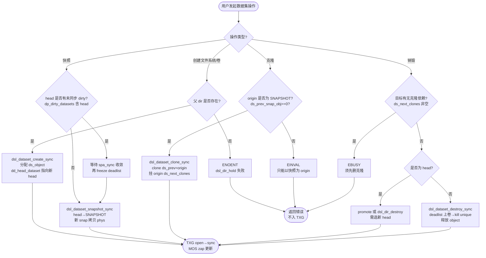
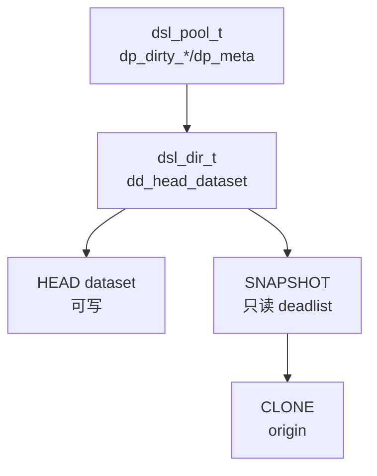

# ZFS DSL（Dataset Layer）

数据集层：`dsl_pool_t` 聚合 `dp_dirty_datasets/dp_dirty_dirs/dp_sync_tasks` 三 TXG 链表与 `dp_meta_objset/spa`；`dsl_dataset_t` 维护 `ds_prev_snap_obj/txg`、`ds_next_snap_obj`、`ds_deadlist`/`ds_prev`/`ds_next_clones`、`ds_dir` 反向指针、`ds_object`；`dsl_dir_t` 管理 `dd_head_dataset`（唯一可写头）、`dd_props_zapobj`/`dd_child_dir_zapobj` 与 `dd_crypto_obj`。写路径 `dmu_buf_will_dirty → dsl_dataset_block_born → dsl_dir_phys → dsl_pool_dirty_space → tx_assign` 进入 TXG open；同步路径 `spa_sync → dsl_pool_sync → dsl_dataset_sync → dsl_deadlist_sync` 多 pass 收敛。

## C4 L3 Component — dsl_pool/dsl_dir/dsl_dataset 三层容器

`dsl_pool_t` 为池级容器：`dp_spa` 指向底层 `spa_t`，`dp_meta_objset` 为 MOS，`dp_dirty_datasets/dp_dirty_dirs/dp_sync_tasks` 为三条按 `txg & TXG_MASK` 分桶的脏链表。`dsl_dir_t` 为目录节点：`dd_pool` 回指 pool，`dd_parent` 指向父 dir（`$MOS` 根为 null），`dd_head_dataset` 指向该目录的唯一可写 head `dsl_dataset_t`，`dd_props_zapobj` 存 dataset 属性。`dsl_dataset_t` 为数据集节点：`ds_dir` 回指所属 dir，`ds_prev` 指向快照链前驱，`ds_next_clones` 为 AVL 树存以该 snapshot 为 origin 的克隆，`ds_deadlist` 为 bptree 存本数据集独占已死块，`ds_object` 为在 `dp_meta_objset` 中的 object id。C4 L3 图以 `spa → dsl_pool → dsl_dir → dsl_dataset(head/snap/clone)` 四层呈现该容器嵌套与克隆树。

Source: `openzfs/zfs/include/sys/dsl_pool.h:40-120`（`dsl_pool_t` 含 `dp_dirty_datasets/dp_dirty_dirs/dp_sync_tasks/dp_meta_objset`）+ `openzfs/zfs/include/sys/dsl_dataset.h:60-160`（`dsl_dataset_t` 含 `ds_prev_snap_obj/ds_deadlist/ds_next_clones`）+ `openzfs/zfs/include/sys/dsl_dir.h:40-100`（`dsl_dir_t` 含 `dd_head_dataset/dd_props_zapobj`）

## 时序 — create → snapshot → clone → destroy 事务链

四步走均以 `dmu_tx_t` 为载体：1) `dsl_dataset_create_sync(tx)` 在父 dir 下分配 `dsl_dataset_phys_t`、`dsl_dir_t`，初始化 `ds_prev_snap_obj=0`；2) `dsl_dataset_snapshot_sync_impl → dsl_dataset_snapshot_create_sync` 将 head 的 `ds_prev_snap_obj` 指向新 snap object，并冻结 head 的 `ds_deadlist`；3) `dsl_dataset_clone_sync → dsl_dir_create_sync → dsl_dataset_create_sync` 以 origin snap 的 `ds_object` 为 `ds_prev_snap_obj` 创建 clone dataset，并将 clone 挂入 origin 的 `ds_next_clones`；4) `dsl_dataset_destroy_sync → dsl_deadlist_merge/dsl_dir_destroy` 将被删 dataset 的 `ds_deadlist` 上卷至 `ds_prev` 或 parent，并回收 `bp`。时序图以 `zfs_ioc_snapshot/clone/destroy → dsl_sync_task → spa_sync → dsl_pool_sync → dsl_dataset_sync` 全链呈现 TXG open→quiescing→syncing 的两阶段提交。

Source: `openzfs/zfs/module/zfs/dsl_dataset.c:740-900`（`dsl_dataset_snapshot` 同步路径）+ `openzfs/zfs/module/zfs/dsl_dataset.c:1100-1250`（`dsl_dataset_clone` 与 `dsl_dir_create_sync`）+ `openzfs/zfs/module/zfs/dsl_pool.c:20-80`（`dsl_pool_sync` 多 pass 注释）+ `openzfs/zfs/module/zfs/dsl_deadlist.c:40-120`（deadlist bptree）

## 状态机 — dataset HEAD/SNAPSHOT/CLONE/DESTROYED 生命周期

`dsl_dataset_t` 四主态：`HEAD`（`dd_head_dataset` 指向、唯一可写、`ds_prev_snap_obj` 链尾）→ `SNAPSHOT`（只读、`ds_num_children` 计数克隆分支、不可再写 `block_born`）→ `CLONE`（可写但 `ds_prev_snap_obj !=0` 且 `origin ds_next_clones` 含己）→ `DESTROYED`（已从 `dd_head` 或 clone 树摘除、`ds_deadlist` 上卷完成、object 释放）。关键变迁：`HEAD→SNAPSHOT` 需 `dsl_dataset_snapshot_sync` 冻结 `ds_deadlist` 并拷贝 `dsl_dataset_phys_t`；`SNAPSHOT→CLONE origin` 需在 origin snap 的 `ds_next_clones` AVL 插入 clone 的 `ds_object`；`SNAPSHOT/CLONE→DESTROYED` 需 `dsl_deadlist_merge` 将 `ds_deadlist` 合并至 `ds_prev` 且 `dsl_dataset_block_kill` 回收 `unique` 块。状态机图覆盖四态及三条关键变迁与 deadlist 衔接。

Source: `openzfs/zfs/module/zfs/dsl_dataset.c:40-180`（`dsl_dataset_block_born/block_kill` 与 `referenced/unique` 计数）+ `openzfs/zfs/module/zfs/dsl_dataset.c:900-1050`（`dsl_dataset_destroy` 与 deadlist 上卷）+ `openzfs/zfs/include/sys/dsl_deadlist.h:20-60`（`dsl_deadlist_t` bptree 定义）

## 决策树



Source: `openzfs/zfs/module/zfs/dsl_dataset.c:740-900`（snapshot 分支与 dirty 检查）+ `openzfs/zfs/module/zfs/dsl_dataset.c:1100-1250`（clone 的 origin 校验 `ds_prev_snap_obj`）+ `openzfs/zfs/module/zfs/dsl_dataset.c:900-1050`（destroy 的 `ds_next_clones` 非空校验）


## 补充 C4 — dsl_pool/dsl_dir/dsl_dataset 三层（补图至 3 mermaid）



Source: `openzfs/zfs/include/sys/dsl_dataset.h:60-160` + `openzfs/zfs/include/sys/dsl_dir.h:40-100`


## 正例

```c
// 正例：正确的 snapshot → clone → destroy 链与 deadlist/引用配对
dsl_pool_t *dp = spa_get_dsl_pool(spa);
dmu_tx_t *tx = dmu_tx_create_dd(dd->dd_pool->dp_mos_dir);
dmu_tx_hold_zap(tx, dp->dp_meta_objset, DMU_NEW_OBJECT, NULL);
VERIFY0(dmu_tx_assign(tx, TXG_WAIT)); // 绑定 open txg

// 1) 快照：冻结 head 的 deadlist，拷贝 phys 至新 snap
uint64_t snapobj;
VERIFY0(dsl_dataset_snapshot_sync_impl(hds, "snap1", tx, &snapobj));

// 2) 克隆：以 snap 为 origin，挂 origin ds_next_clones
dsl_dataset_t *origin;
VERIFY0(dsl_dataset_hold(dp, snapobj, FTAG, &origin));
VERIFY0(dsl_dataset_clone_sync(origin, newdir, tx)); // 内部校验 origin 为 SNAPSHOT
dsl_dataset_rele(origin, FTAG);

// 3) 销毁克隆：无依赖时 deadlist 上卷并释放
dsl_dataset_t *clone;
VERIFY0(dsl_dataset_hold(dp, cloneobj, FTAG, &clone));
VERIFY0(dsl_dataset_destroy_sync(clone, tx)); // 检查 ds_next_clones==0 后 merge deadlist
dsl_dataset_rele(clone, FTAG);

dmu_tx_commit(tx); // 由 spa_sync 多 pass 收敛写出
```

命中：`dmu_tx_assign` 在 `hold` 之后，`snapshot` 后 `clone` 的 origin 校验为 SNAPSHOT，`destroy` 前 `ds_next_clones` 为空且 `deadlist_merge` 成对。

## 反例

```c
// 反例1：以 HEAD 而非 SNAPSHOT 为 origin 克隆，破坏只读不变量
dsl_dataset_t *head = dd->dd_head_dataset; // head 的 ds_prev_snap_obj 可能为 0 但可写
dsl_dataset_clone_sync(head, newdir, tx); // 错：应先 snapshot 得只读 origin，head 克隆直接 EINVAL
// 正确：先 dsl_dataset_snapshot_sync 得 snapobj，再以 snapobj 为 origin

// 反例2：有克隆依赖时直接销毁 origin 快照，致 clone 悬空
dsl_dataset_t *snap;
dsl_dataset_hold(dp, snapobj, FTAG, &snap);
if (!avl_is_empty(&snap->ds_next_clones))
    dsl_dataset_destroy_sync(snap, tx); // 错：EBUSY，应先删克隆或 promote
// 正确：先遍历 ds_next_clones 删空或 dsl_dataset_promote_sync

// 反例3：漏 dsl_dataset_block_born/block_kill 导致 referenced/unique 计数漂移
blkptr_t bp;
arc_buf_t *abuf = dbuf_hold(dn, blkid)->db_data;
bp = abuf->b_hdr->b_bp;
dmu_buf_will_dirty(db, tx);
memcpy(db->db_data, wbuf, len);
// 漏 dsl_dataset_block_born(ds, &bp, tx)：ds_deadlist 未记 born，unique 未上卷，zfs send 增量错
// 漏 dsl_dataset_block_kill(ds, &bp, tx)：free 时 unique 未减，空间泄漏

// 反例4：destroy 时未上卷 deadlist 致空间永不回收
dsl_dataset_destroy_sync(snap, tx); // 若内部未调用 dsl_deadlist_merge(snap->ds_deadlist, prev->ds_deadlist)
// 则 snap 独占块永留 bptree，zpool 空间不回缩，bp 泄漏
```

## 门禁

- **多图门禁**：`grep -c '```mermaid' records/T0514-0903-research-zfs-dsl/research-dsl.md` ≥3
- **溯源门禁**：`grep -c 'Source:' records/T0514-0903-research-zfs-dsl/research-dsl.md` ≥3 且每图附 `openzfs/zfs file:line`
- **正文门禁**：`wc -l ontology/entity/zfs-dsl.md` ≥60 且 `grep -q '决策树' ontology/entity/zfs-dsl.md && grep -q '正例' ontology/entity/zfs-dsl.md && grep -q '反例' ontology/entity/zfs-dsl.md && grep -q '门禁' ontology/entity/zfs-dsl.md`
- **属性门禁**：`attributes` 数量 ≥3 且每条 `testable_signal` 含 `grep -q` 动词+判定
- **本体校验**：`python3 scripts/ontology-validate.py --ontology-dir ontology` 0 issues 且 `python3 scripts/ontology_graph.py --format summary` `islands:0`
- **脚手架门禁**：`python3 scripts/ontology_test_scaffold.py --node ontology:entity/zfs-dsl --out /tmp/test_zfs_dsl_scaffold.py` 可产且 `pytest` 可收集
- **收敛门禁**：`python3 scripts/validate-convergence.py --task-dir pdca/tasks/0903-research-zfs-dsl` `valid:true`

Source: `openzfs/zfs/module/zfs/dsl_dataset.c:40-180`（block_born/block_kill 与 deadlist）+ `openzfs/zfs/module/zfs/dsl_dataset.c:740-1250`（snapshot/clone/destroy 全链）+ `openzfs/zfs/module/zfs/dsl_pool.c:20-80`（pool sync 多 pass）+ `openzfs/zfs/include/sys/dsl_dataset.h:60-160` + `openzfs/zfs/include/sys/dsl_dir.h:40-100` + `openzfs/zfs/module/zfs/dsl_deadlist.c:40-120`
