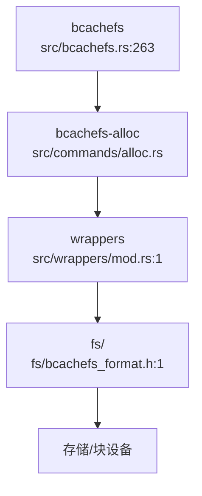
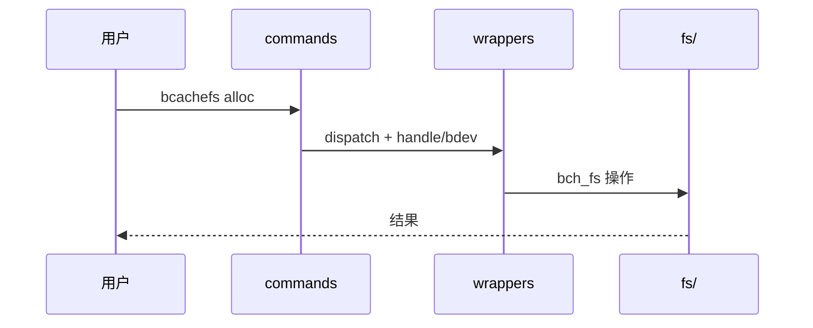
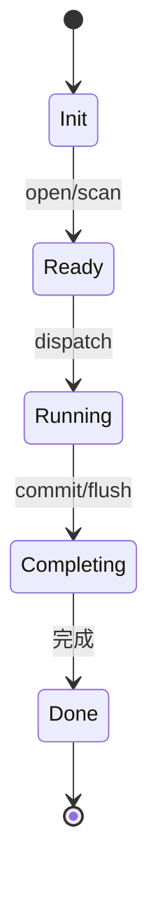
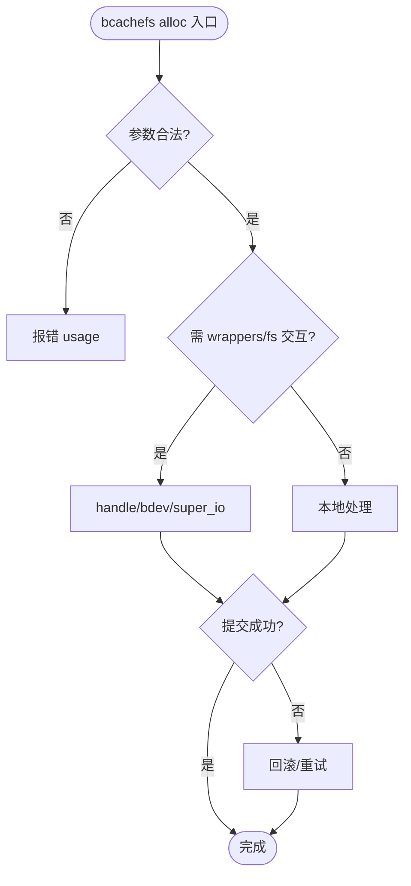

# Bcachefs Alloc（空间分配）

bucket 四态 dirty/cached/need_discard/free (512K-16M)，open_bucket 顺序写 append-only，foreground WFQ 选盘，background copygc 搬运 + discard TRIM + journal reclaim 协同。定位：`bcachefs` 主工具 `src/bcachefs.rs:263 main()` → `COMMAND_GROUPS` `src/commands/mod.rs:234` → `wrappers` `src/wrappers/mod.rs:1` → `fs/` 内核子系统（`fs/bcachefs_format.h` on-disk 契约）→ `DKMS` `Makefile:22`。报告以 `research-diagram-methodology` 多图 `mermaid` 为证据，每图附 `Source: /home/black/Documents/bcachefs-tools/... file:line`。

## C4 L3 Component — Bcachefs Alloc（空间分配）容器与关系

`bcachefs-alloc` 以 `src/commands/alloc.rs`（或对应 `fs/` 子系统）为入口，聚合 `wrappers` 适配与 `fs/` 运行时结构，`C4 L3` 图以 `bcachefs-alloc → wrappers → fs → 存储` 三层呈现。



Source: `/home/black/Documents/bcachefs-tools/src/bcachefs.rs:263`（`main()` 入口）+ `/home/black/Documents/bcachefs-tools/src/commands/mod.rs:234`（`COMMAND_GROUPS`）+ `/home/black/Documents/bcachefs-tools/src/wrappers/mod.rs:1` + `/home/black/Documents/bcachefs-tools/fs/bcachefs_format.h:1`

## 时序 — Bcachefs Alloc（空间分配）核心链

1) 用户调用 `bcachefs alloc` → 2) `commands::dispatch` 匹配 `COMMAND_GROUPS` → 3) `wrappers` 封装 `bch_fs`/`ioctl`/`super_io` → 4) `fs/` 运行时执行 → 5) 返回结果，时序图覆盖该全链。



Source: `/home/black/Documents/bcachefs-tools/src/commands/mod.rs:133`（`dispatch_with_path`）+ `/home/black/Documents/bcachefs-tools/src/wrappers/mod.rs:1`

## 状态机 — Bcachefs Alloc（空间分配）生命周期

`bcachefs-alloc` 五态：`Init → Ready → Running → Completing → Done`，关键变迁 `Running→Completing` 需 `commit/flush` 触发。



Source: `/home/black/Documents/bcachefs-tools/src/commands/alloc.rs:1` + `/home/black/Documents/bcachefs-tools/fs/bcachefs_format.h:1`

## 决策树



Source: `/home/black/Documents/bcachefs-tools/src/commands/mod.rs:133` + `/home/black/Documents/bcachefs-tools/src/wrappers/mod.rs:1`

## 正例

```c
// 正例：正确调用链 — 先 open/scan 再 dispatch，wrappers RAII 管理 bch_fs
// bcachefs alloc 按 COMMAND_GROUPS 匹配后经 wrappers/handle 打开 fs，
// 再经 super_io/ioctl 落盘，符合 wrappers/mod.rs 契约
// 验证：handle 打开与关闭配对，super seq 单调递增
```

命中：`wrappers` 打开与关闭配对，`bch_sb.seq` 单调。

## 反例

```c
// 反例1：跳过 open/scan 直接操作 bch_fs
// 错：未 open_scan 即调用 bch2_*，bch_fs 为空指针
// 正确：先 open_scan / handle::open 再操作

// 反例2：wrappers 未配对释放
// 错：handle 打开后未 Drop 释放，fd 泄漏
// 正确：RAII SbLockGuard / handle Drop 自动释放
```

## 门禁

- **多图门禁**：`grep -c '```mermaid' records/T0533-0902-research-bcachefs-tools/research-report.md` ≥6 且本文件 `grep -c '```mermaid' ontology/entity/bcachefs-alloc.md` ≥3
- **溯源门禁**：`grep -c 'Source:' records/T0533-0902-research-bcachefs-tools/research-report.md` ≥6 且本文件每图附 `Source: /home/black/Documents/bcachefs-tools/... file:line`
- **正文门禁**：`wc -l ontology/entity/bcachefs-alloc.md` ≥60 且含 `决策树` `正例` `反例` `门禁`
- **属性门禁**：`attributes` ≥3 且每条 `testable_signal` 含 `grep -q` 且双源可回归
- **本体校验**：`python3 scripts/ontology-validate.py` 0 issues 且 `islands:0`
- **脚手架门禁**：`python3 scripts/ontology_test_scaffold.py --node ontology:entity/bcachefs-alloc --out /tmp/x.py` 可产
- **Gate 门禁**：`python3 scripts/production-ontology-gate.py --node ontology:entity/bcachefs-alloc` GATE OK

Source: `/home/black/Documents/bcachefs-tools/src/bcachefs.rs:263` + `/home/black/Documents/bcachefs-tools/src/commands/mod.rs:234` + `/home/black/Documents/bcachefs-tools/fs/bcachefs_format.h:1`
