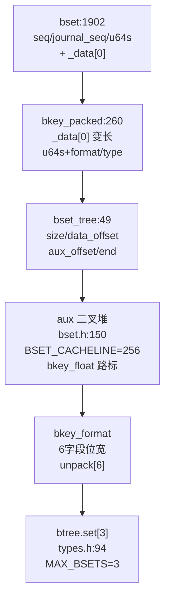
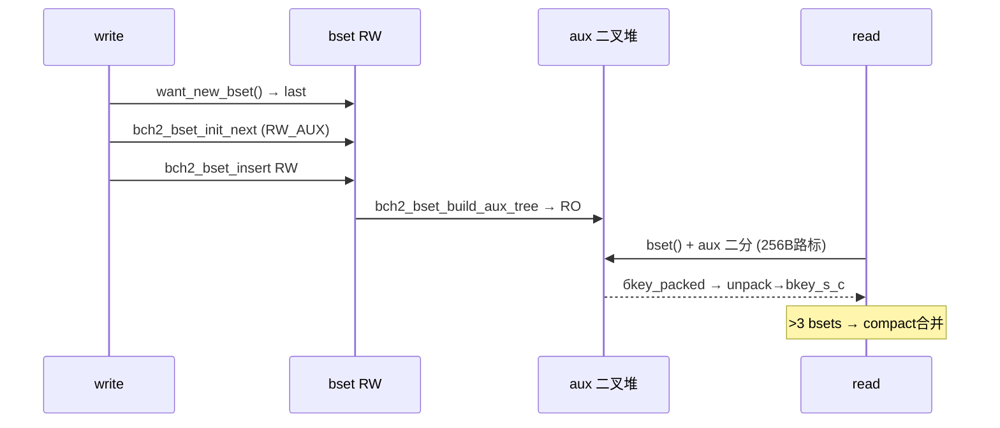
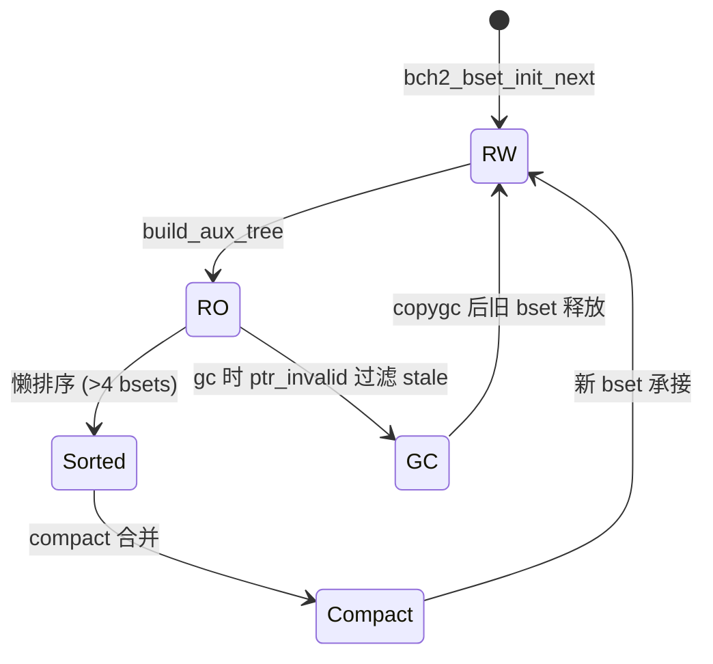
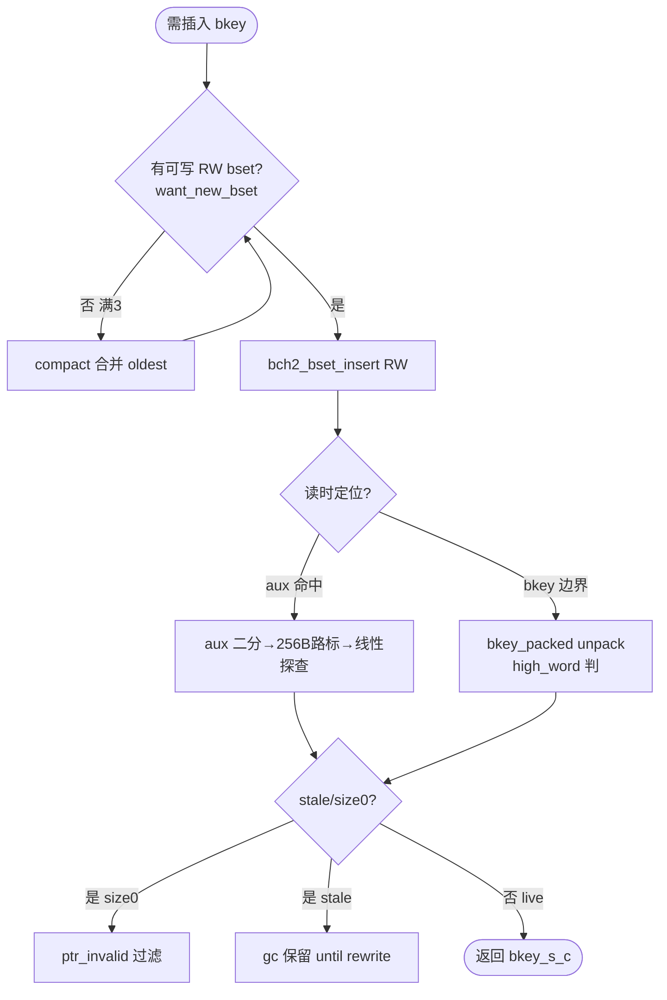

# Bcachefs Btree Bset（B 树 Bset/键格式）

`bset` 为 `btree_node` 内 `bkey` 容器：磁盘 `bset`（`bcachefs_format.h:1902`）为 `bkey_packed` 变长数组，内存 `bset_tree`（`btree/types.h:49`）以 `BSET_CACHELINE=256` 浮点路标建二叉堆 `aux`，`bkey_format` 动态压缩 `bpos` 三字段。`bkey`（`bkey_types.h:21`）以 `bkey_s_c/bkey_i` 包装访问。定位：`fs/btree/bset.h:150`（`BSET_CACHELINE`）→ `bset.c` → `fs/bcachefs_format.h:1902/260` → `fs/btree/types.h:49/94`。

## C4 L3 Component — 磁盘 bset/bkey_packed vs 内存 bset_tree/aux

磁盘：`bset { seq/journal_seq/flags/version/u64s + bkey_packed _data[0] }`（`1902`）内 `bkey_packed { _data[0] + u64s + 7b format/type/pad }`（`260`）视多词整数存 `bpos`；内存：`bset_tree { size/extra/data_offset/aux_data_offset/end_offset }`（`49`）按 `BSET_CACHELINE=256`（`bset.h:150`）每 256B 取一 `bkey_float` 为路标，`aux_data` 存二叉堆数组（`to_inorder` 索引），`btree { set[3] + bkey_format + unpack[6] }`（`94`）聚合。`bkey_format` 6 字段位宽表经 `unpack[6] { byte_offset/shift }` 解码。C4 L3 图以 `bset(磁盘) → bkey_packed(变长) → bset_tree(内存路标) → btree.set[3]` 四层呈现。



Source: `/home/black/Documents/bcachefs-tools/fs/bcachefs_format.h:1902`（`bset`）+ `/home/black/Documents/bcachefs-tools/fs/bcachefs_format.h:260`（`bkey_packed`）+ `/home/black/Documents/bcachefs-tools/fs/btree/types.h:49`（`bset_tree`）+ `/home/black/Documents/bcachefs-tools/fs/btree/types.h:94`（`btree.set[3]`）+ `/home/black/Documents/bcachefs-tools/fs/btree/bset.h:150`（`BSET_CACHELINE=256`）

## 时序 — bset 插入 → aux 构建 → 读时二分

1) `want_new_bset()取 bset_tree_last`；2) `bch2_bset_init_next` 分配新 `bset`（`RW_AUX` 可写）；3) 新 key 仅插 `未写 bset`（`bkey_to_bset`）；4) 满时 `bch2_bset_build_aux_tree` 转 `RO_AUX`（二叉堆固化）；5) 读时 `bset()` 经 `data_offset/end_offset` 定位 `vstruct_last`，`aux` 二分到 256B 路标后线性探查；6) `>MAX_BSETS` 时 `compact` 合并压缩，`ptr_invalid` 过滤 size0。时序图以 `init_next → insert(RW) → build_aux(RO) → search(aux) → compact` 全链呈现。



Source: `/home/black/Documents/bcachefs-tools/fs/btree/bset.h:279`（`keys_init/init_first/next/build_aux_tree/insert`）+ `/home/black/Documents/bcachefs-tools/fs/btree/types.h:49` + `/home/black/Documents/bcachefs-tools/fs/btree/bset.c:1`

## 状态机 — bset RW→RO→sorted→compact 循环

`bset_tree` 四态 `RW_AUX → RO_AUX → sorted → compact`：`RW` 唯一可写，写满或刷盘即 `RO`（只读+二叉堆固化），`>4 bsets` 懒 `sorted`，`MAX_BSETS=3` 时 `compact` 合并。`bkey` 二态 `packed ↔ unpacked`：写时 `pack`（高位截断），读时 `unpack`（`unpack[6]`）。`aux` 二态 `NO_AUX → RO/RW_AUX`：`RO_AUX` 预建，`RW_AUX` 增量维护。状态机图覆盖 `RW→RO→compact→RW` 往返。



Source: `/home/black/Documents/bcachefs-tools/fs/btree/bset.h:279` + `/home/black/Documents/bcachefs-tools/fs/btree/types.h:49` + `/home/black/Documents/bcachefs-tools/fs/btree/bset.c:1`

## 决策树



Source: `/home/black/Documents/bcachefs-tools/fs/btree/bset.h:348`（`want_new_bset`）+ `/home/black/Documents/bcachefs-tools/fs/btree/types.h:49`

## 正例

```c
// 正例：bkey 变长压缩 → bset 追加 → aux 加速
struct bkey_i *k = bkey_next(prev); k->k.u64s = ...; k->k.type = KEY_TYPE_extent;
bch2_bkey_to_bset(btree, k); // 仅插 RW bset
bch2_bset_build_aux_tree(btree, t); // RO 后建二叉堆
struct bkey_s_c found = bch2_bset_search(btree, pos); // aux 二分 + unpack
// 验证：u64s 含 header，type 断言 bkey_s_c_to_extent 前检查
```

命中：`RW` 唯一可写与 `RO` 只读配对，`pack/unpack` 可逆。

## 反例

```c
// 反例1：向 RO bset 插入
// 错：bch2_bset_insert 到已 RO_AUX 的 bset，aux 索引错乱
// 正确：仅 RW_AUX 的 last bset 可 insert（want_new_bset 保障）

// 反例2：裸读 bkey 不经 unpack
// 错：直接取 bkey_packed 的 _data 字段，位宽错误
// 正确：经 unpack[6] 解码后得 bpos 再 bkey_s_c 包装
```

## 门禁

- **多图门禁**：`grep -c '```mermaid' ontology/entity/bcachefs-btree-bset.md` ≥3
- **溯源门禁**：`grep -c 'Source:' ontology/entity/bcachefs-btree-bset.md` ≥3 且每图含 `Source: /home/black/Documents/bcachefs-tools/... file:line`
- **正文门禁**：`wc -l ontology/entity/bcachefs-btree-bset.md` ≥80 且含 `决策树` `正例` `反例` `门禁`
- **属性门禁**：`attributes` ≥3 且每条 `testable_signal` 含 `grep -q` 且双源可回归
- **本体校验**：`python3 scripts/ontology-validate.py` 0 issues 且 `islands:0`
- **脚手架门禁**：`python3 scripts/ontology_test_scaffold.py --node ontology:entity/bcachefs-btree-bset --out /tmp/x.py` 可产
- **Gate 门禁**：`python3 scripts/production-ontology-gate.py --node ontology:entity/bcachefs-btree-bset` GATE OK

Source: `/home/black/Documents/bcachefs-tools/fs/bcachefs_format.h:1902` + `/home/black/Documents/bcachefs-tools/fs/bcachefs_format.h:260` + `/home/black/Documents/bcachefs-tools/fs/btree/types.h:49`
