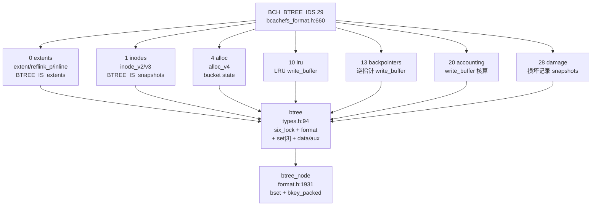
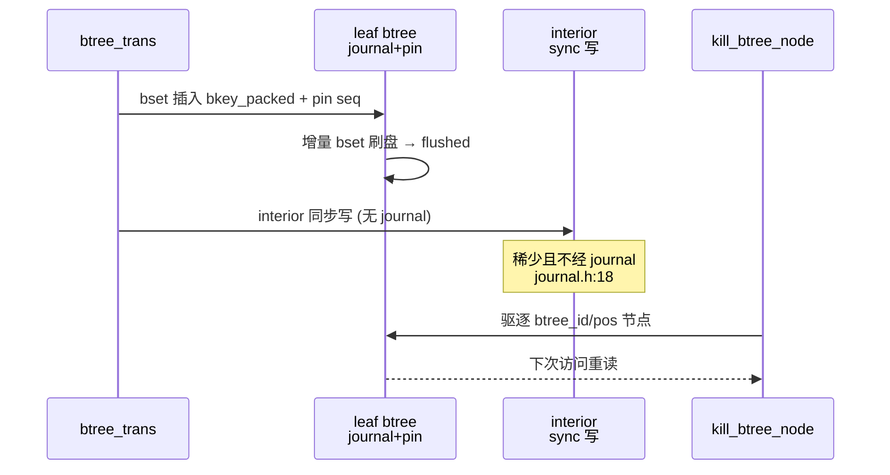
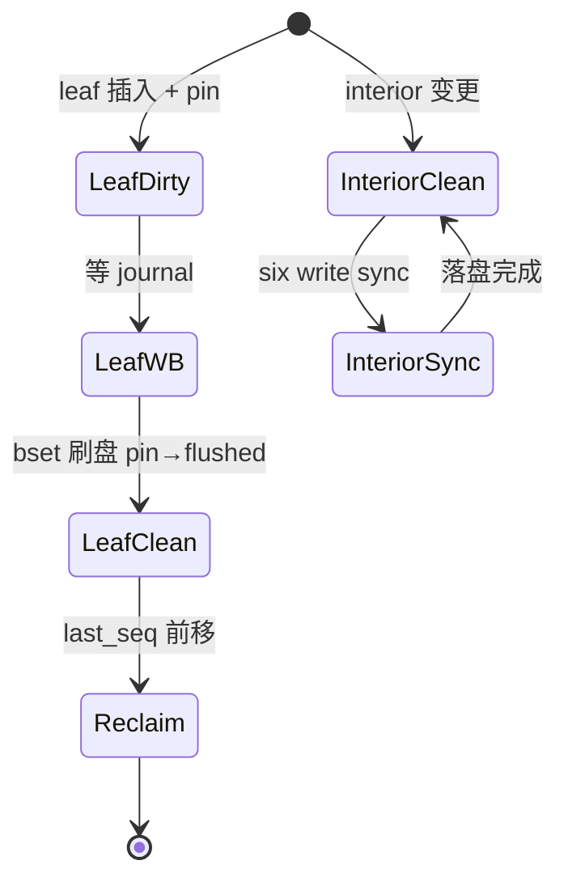
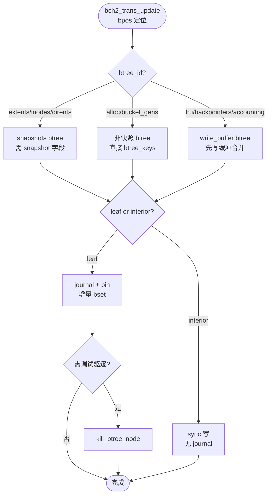

# Bcachefs Btree（B 树）

`bcachefs` 为 `COW btree 森林`：`BCH_BTREE_IDS()`（`fs/bcachefs_format.h:660`）定义 29 种 `btree_id`（`extents/inodes/dirents/xattrs/alloc/quotas/stripes/reflink/subvolumes/snapshots/lru/freespace/need_discard/backpointers/bucket_gens/accounting/reconcile_*/damage`），每种为独立 `btree` 实例，持不同 `KEY_TYPE_*` 位图。内存 `struct btree`（`fs/btree/types.h:49/94`）以 `six_lock + bkey_format + set[MAX_BSETS=3]` 组织 `btree_node`，leaf 更新经 `journal + pin`，interior 同步写（`fs/journal/journal.h:18` 稀少简化）。定位：`src/bcachefs.rs:263` → `src/commands/kill_btree_node.rs` 调试 → `wrappers` → `fs/btree/`（`types.h/bkey_types.h/bset.h/cache.c`）→ `fs/bcachefs_format.h:660` 契约。

## C4 L3 Component — 29 btree_id 森林 + btree 内存结构

`BCH_BTREE_IDS()` 29 项按 `BTREE_IS_*` 分组：`BTREE_IS_extents`（extents/reflink/freespace）、`BTREE_IS_snapshots`（extents/inodes/dirents/xattrs/damage）、`BTREE_IS_data`（extents/stripes/reflink）、`BTREE_IS_write_buffer`（lru/need_discard/backpointers/accounting/bucket_to_stripe 等 10 项经 write_buffer 合并）。`struct btree`（`types.h:94`）按 `btree_id` 实例化，含 `six_lock lock + bkey_format format + btree_node *data/aux + bset_tree set[3] + nsets`。C4 L3 图以 `forest(29 ids) → btree instance(six+format) → btree_node(bset) → bkey_packed` 四层呈现。



Source: `/home/black/Documents/bcachefs-tools/fs/bcachefs_format.h:660`（`BCH_BTREE_IDS()` 29 项，`x(extents,0,...)` 至 `x(damage,28,...)`，每项含 `BTREE_IS_*` 与 `KEY_TYPE_*` 位图）+ `/home/black/Documents/bcachefs-tools/fs/btree/types.h:94`（`struct btree { six_lock + bkey_format + set[MAX_BSETS] + btree_node *data }`）+ `/home/black/Documents/bcachefs-tools/fs/btree/types.h:49`（`struct bset_tree`）

btree_id 29 类型分工表（`BCH_BTREE_IDS()` `bcachefs_format.h:660` 节选）：

| btree_id | 名称 | BTREE_IS 标志 | 持 key type（位图） | 作用 |
|---|---|---|---|---|
| 0 | extents | extents/snapshots/data | extent/reflink_p/inline_data/whiteout | 文件数据区间指针与预留 |
| 1 | inodes | snapshots | inode/inode_v2/v3/generation | inode 元数据 |
| 2 | dirents | snapshots | dirent/hash_whiteout | 目录项 |
| 3 | xattrs | snapshots | xattr | 扩展属性 |
| 4 | alloc | - | alloc_v2/v3/v4 | bucket 分配状态 |
| 5 | quotas | - | quota | 配额计数 |
| 6 | stripes | data | stripe | EC 条带描述 |
| 7 | reflink | extents/data | reflink_v/indirect | reflink 共享区间 |
| 10 | lru | write_buffer | set | LRU 驱逐跟踪 |
| 11 | freespace | extents | set | 空闲空间索引 |
| 12 | need_discard | write_buffer | set | 待 TRIM 桶 |
| 13 | backpointers | write_buffer | backpointer | 逆指针（extent→btree） |
| 14 | bucket_gens | - | bucket_gens | 桶代数防 stale |
| 17 | logged_ops | - | truncate/finsert/stripe_update | 崩溃恢复的已 log 操作 |
| 20 | accounting | snapshot_field/write_buffer | accounting | 空间核算 |
| 28 | damage | snapshots | damage | 损坏 inode 记录 |

## 时序 — trans 提交经 btree 的 leaf/interior 分工

1) `bch2_trans_commit`（`btree/types.h:645`）预留 `journal_buf`；2) 按 `bpos` 判 btree_id，本次影响的 leaf 节点经 `bset` 插入 `bkey_packed` 并 `pin` 住对应 `journal seq`（`journal/types.h:110`）；3) leaf `btree_node` 增量 `bset` 刷盘后 `pin` 释放入 `flushed`；4) interior 节点（索引层）直接同步写盘不经 journal（`journal.h:18` 更新稀少简化，未来可改）；5) 需要时 `kill_btree_node`（`src/commands/kill_btree_node.rs`）驱逐指定 `btree_id/pos` 节点以触发重读。时序图以 `trans → leaf(journal+pin) → interior(sync) → kill/debug` 全链呈现。



Source: `/home/black/Documents/bcachefs-tools/fs/btree/types.h:645`（`btree_trans`）+ `/home/black/Documents/bcachefs-tools/fs/journal/journal.h:18`（interior sync）+ `/home/black/Documents/bcachefs-tools/src/commands/kill_btree_node.rs:1`

## 状态机 — btree 叶/枝分工与缓存态

leaf 二态 `dirty → write_blocked → clean`：`dirty` 时 `pin` 非空，`write_blocked` 等 journal 落盘。interior 二态 `clean → sync_write → clean`：无需 pin，`six_lock write` 直接落盘。`btree_node` 缓存态 `cached → reclaimable → evicted`：`kill_btree_node` 强制 `evicted`。状态机图覆盖 `leaf/branch` 差异与 `reclaim` 衔接。



Source: `/home/black/Documents/bcachefs-tools/fs/btree/types.h:94` + `/home/black/Documents/bcachefs-tools/fs/journal/journal.h:18`

## 决策树



Source: `/home/black/Documents/bcachefs-tools/fs/bcachefs_format.h:660` + `/home/black/Documents/bcachefs-tools/fs/btree/types.h:94` + `/home/black/Documents/bcachefs-tools/src/commands/kill_btree_node.rs:1`

## 正例

```c
// 正例：按 btree_id 正确分发并区分 leaf/interior
bch2_trans_update(trans, BTREE_ID_extents, &pos, &key); // data btree 快照感知
// leaf: bset 插入 + pin seq，journal 聚合 btree_keys+btree_root
// interior: 自动同步写，无需 pin
bch2_btree_and_journal_write(trans); // 统一提交
// 调试：kill_btree_node 驱逐后再读触发重建
```

命中：`BTREE_IS_*` 分组正确，`leaf/ interior` 分工遵守 `journal.h:18` 契约。

## 反例

```c
// 反例1：alloc btree 误置 snapshot 字段
// 错：alloc (BTREE_ID 4 无 snapshots 标志) 写带 snapshot 的 bpos
// 正确：仅 extents/inodes 等带 snapshots 的 btree 才含 snapshot

// 反例2：interior 误走 journal
// 错：为 interior 节点也 pin 并经 journal，浪费且违 journal.h 注释
// 正确：interior 直接 six write 同步落盘

// 反例3：kill_btree_node 误用于 interior 根
// 错：驱逐根节点导致遍历中断
// 正确：仅驱逐 leaf 节点调试
```

## 门禁

- **多图门禁**：`grep -c '```mermaid' ontology/entity/bcachefs-btree.md` ≥3
- **溯源门禁**：`grep -c 'Source:' ontology/entity/bcachefs-btree.md` ≥3 且每图含 `Source: /home/black/Documents/bcachefs-tools/... file:line`
- **正文门禁**：`wc -l ontology/entity/bcachefs-btree.md` ≥80 且含 `决策树` `正例` `反例` `门禁`
- **属性门禁**：`attributes` ≥3 且每条 `testable_signal` 含 `grep -q` 且双源可回归
- **本体校验**：`python3 scripts/ontology-validate.py` 0 issues 且 `islands:0`
- **脚手架门禁**：`python3 scripts/ontology_test_scaffold.py --node ontology:entity/bcachefs-btree --out /tmp/x.py` 可产
- **Gate 门禁**：`python3 scripts/production-ontology-gate.py --node ontology:entity/bcachefs-btree` GATE OK

Source: `/home/black/Documents/bcachefs-tools/fs/bcachefs_format.h:660` + `/home/black/Documents/bcachefs-tools/fs/btree/types.h:94` + `/home/black/Documents/bcachefs-tools/src/commands/kill_btree_node.rs:1`
