# bcachefs-tools 全栈调研报告 — 架构、一致性、journal/btree、空间与并发

> 方法论：`ontology/pattern/research-diagram-methodology.md`（P0 三图 + P1 扩展）与 `ontology/pattern/scientific-research-methodology.md`（证据 ≥2 源）；状态：`do`

## 调研目标

对 `bcachefs-tools v1.39.1`（`/home/black/Documents/bcachefs-tools`，`18058 symbols 300 flows`）作全栈调研，产出可 `scaffold` 的 12 叶本体与可 `GATE OK` 的聚合 `bcachefs-system`。深化五章（数据一致性、journal 记录类型、btree/bset 格式、空间生命周期、高并发）各 ≥1 图且每图含 `Source: /home/black/Documents/bcachefs-tools/... file:line`。

## 方法

- Primary sources：源码树 `src/bcachefs.rs + src/commands/ (36 mod) + c_src/ + fs/ (journal/btree/alloc/sb/init/data/util) + bch_bindgen/build.rs + fs/build.rs + Makefile + Cargo.toml + bcachefs.8` 全读；`fs/bcachefs_format.h`（on-disk 格式）为权威契约；`fs/journal/journal.h + types.h` 与 `fs/btree/bkey_types.h + bset.h` 为核心数据结构；`fs/alloc/background.c + foreground.* + buckets_types.h` 为空间管理；`fs/init/passes_format.h + fs/util/six.h + fs/btree/types.h (btree_trans)` 为并发与恢复
- 双源回链：每属性 `testable_signal` 同时命中 `records/T0533-.../research-report.md` 与 `/home/black/Documents/bcachefs-tools` 源码 `grep -q`

## 发现

### 1. 全栈架构 — C4 L2 容器 + C4 L3 Rust/C 边界 + 部署

#### 1.1 部署/运行时上下文

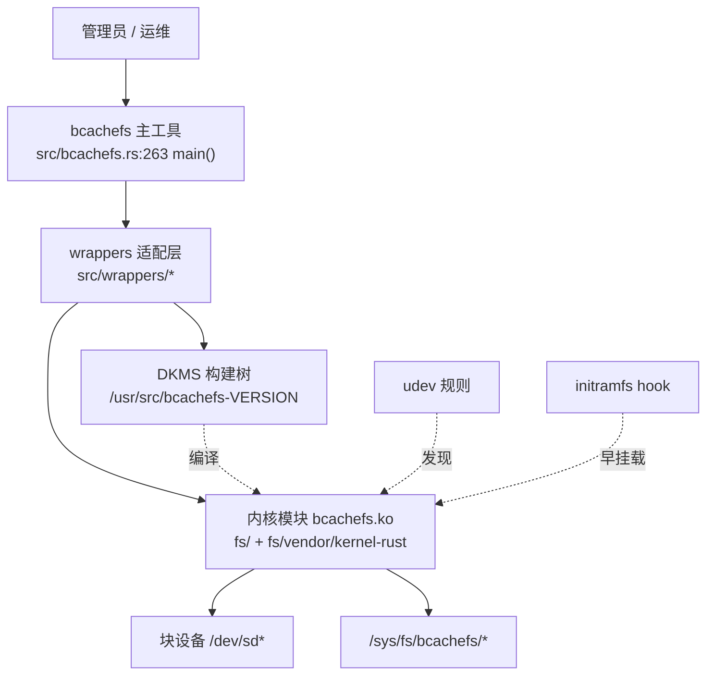
```mermaid
graph TD
    Admin["管理员 / 运维"] --> CLI["bcachefs 主工具<br/>src/bcachefs.rs:263 main()"]
    CLI --> MWrappers["wrappers 适配层<br/>src/wrappers/*"]
    MWrappers --> KMod["内核模块 bcachefs.ko<br/>fs/ + fs/vendor/kernel-rust"]
    KMod --> Block["块设备 /dev/sd*"]
    KMod --> Sysfs["/sys/fs/bcachefs/*"]
    MWrappers --> DKMS["DKMS 构建树<br/>/usr/src/bcachefs-VERSION"]
    DKMS -. 编译 .-> KMod
    Udev["udev 规则"] -. 发现 .-> KMod
    Initramfs["initramfs hook"] -. 早挂载 .-> KMod
    %% Source: /home/black/Documents/bcachefs-tools/src/bcachefs.rs:263 + Makefile:22 + fs/mod.rs:1
```

*Source: `/home/black/Documents/bcachefs-tools/src/bcachefs.rs:263`（`main()` 入口）+ `/home/black/Documents/bcachefs-tools/Makefile:22`（`DKMSDIR?=/usr/src/bcachefs-$(VERSION)`）+ `/home/black/Documents/bcachefs-tools/fs/mod.rs:1`（`bcachefs-kernel crate`）*

#### 1.2 C4 L2 全栈容器（`bcachefs → 30+子命令 → wrappers → fs/内核 → 存储 + DKMS`）

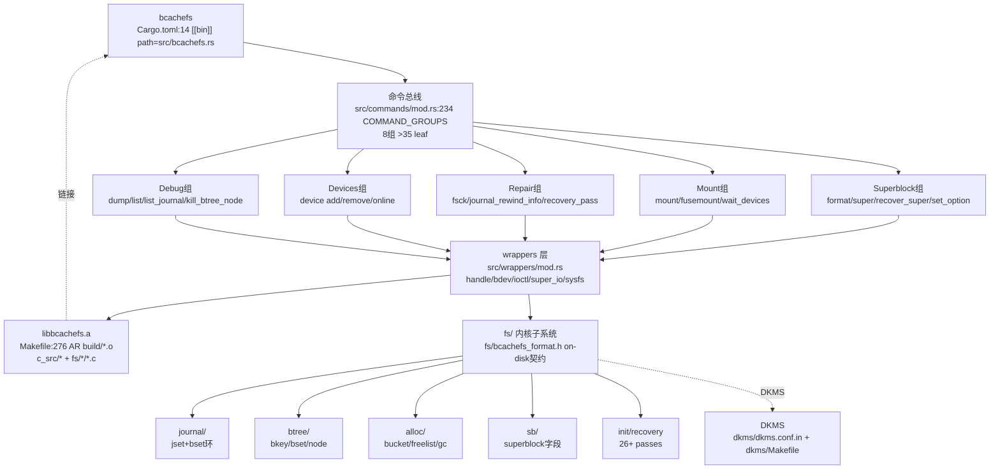
```mermaid
graph TD
    CLI["bcachefs<br/>Cargo.toml:14 [[bin]] path=src/bcachefs.rs"]
    CLI --> CB["命令总线<br/>src/commands/mod.rs:234 COMMAND_GROUPS<br/>8组 >35 leaf"]
    CB --> G1["Superblock组<br/>format/super/recover_super/set_option"]
    CB --> G2["Mount组<br/>mount/fusemount/wait_devices"]
    CB --> G3["Repair组<br/>fsck/journal_rewind_info/recovery_pass"]
    CB --> G4["Devices组<br/>device add/remove/online"]
    CB --> G5["Debug组<br/>dump/list/list_journal/kill_btree_node"]
    G1 & G2 & G3 & G4 & G5 --> W["wrappers 层<br/>src/wrappers/mod.rs<br/>handle/bdev/ioctl/super_io/sysfs"]
    W --> LBC["libbcachefs.a<br/>Makefile:276 AR build/*.o<br/>c_src/* + fs/*/*.c"]
    W --> FS["fs/ 内核子系统<br/>fs/bcachefs_format.h on-disk契约"]
    FS --> J["journal/<br/>jset+bset环"]
    FS --> BT["btree/<br/>bkey/bset/node"]
    FS --> AL["alloc/<br/>bucket/freelist/gc"]
    FS --> SB["sb/<br/>superblock字段"]
    FS --> RC["init/recovery<br/>26+ passes"]
    LBC -. 链接 .-> CLI
    FS -. DKMS .-> DKMS["DKMS<br/>dkms/dkms.conf.in + dkms/Makefile"]
    %% Source: /home/black/Documents/bcachefs-tools/src/commands/mod.rs:234 + src/wrappers/mod.rs:1 + Makefile:276 + fs/bcachefs_format.h:1
```

*Source: `/home/black/Documents/bcachefs-tools/src/commands/mod.rs:234`（`COMMAND_GROUPS` 8组）+ `/home/black/Documents/bcachefs-tools/src/wrappers/mod.rs:1`（`accounting/bdev/handle/ioctl/super_io/sysfs`）+ `/home/black/Documents/bcachefs-tools/Makefile:276`（`libbcachefs.a` 归档）+ `/home/black/Documents/bcachefs-tools/fs/bcachefs_format.h:1`（on-disk 格式权威头）*

#### 1.3 C4 L3 Rust/C 边界（`bch_bindgen + build.rs` 双向绑定）

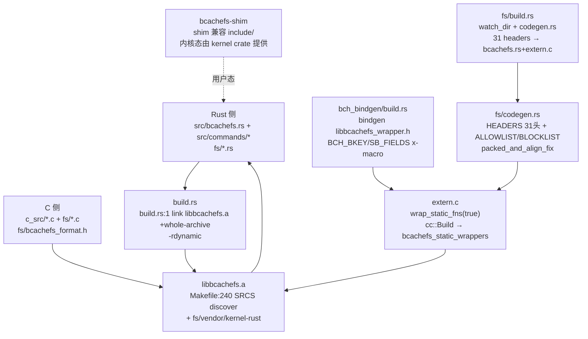
```mermaid
graph TD
    Rust["Rust 侧<br/>src/bcachefs.rs + src/commands/*<br/>fs/*.rs"]
    C["C 侧<br/>c_src/*.c + fs/*.c<br/>fs/bcachefs_format.h"]
    BuildRoot["build.rs<br/>build.rs:1 link libbcachefs.a +whole-archive<br/>-rdynamic"]
    Bindgen["bch_bindgen/build.rs<br/>bindgen libbcachefs_wrapper.h<br/>BCH_BKEY/SB_FIELDS x-macro"]
    FSBuild["fs/build.rs<br/>watch_dir + codegen.rs<br/>31 headers → bcachefs.rs+extern.c"]
    Codegen["fs/codegen.rs<br/>HEADERS 31头 + ALLOWLIST/BLOCKLIST<br/>packed_and_align_fix"]
    ExternC["extern.c<br/>wrap_static_fns(true)<br/>cc::Build → bcachefs_static_wrappers"]
    LBC["libbcachefs.a<br/>Makefile:240 SRCS discover<br/>+ fs/vendor/kernel-rust"]
    Shim["bcachefs-shim<br/>shim 兼容 include/<br/>内核态由 kernel crate 提供"]
    Rust --> BuildRoot --> LBC
    C --> LBC
    Bindgen --> ExternC --> LBC
    FSBuild --> Codegen --> ExternC
    LBC --> Rust
    Shim -. 用户态 .-> Rust
    %% Source: /home/black/Documents/bcachefs-tools/build.rs:1 + bch_bindgen/build.rs:404 + fs/build.rs:1 + fs/codegen.rs:21 + Makefile:240
```

*Source: `/home/black/Documents/bcachefs-tools/build.rs:1`（`rustc-link-lib=static:+whole-archive=bcachefs`）+ `/home/black/Documents/bcachefs-tools/bch_bindgen/build.rs:404`（x-macro 解析 + `wrap_static_fns`）+ `/home/black/Documents/bcachefs-tools/fs/build.rs:1`（`codegen.rs + extern.c`）+ `/home/black/Documents/bcachefs-tools/fs/codegen.rs:21`（`HEADERS` 31头）+ `/home/black/Documents/bcachefs-tools/Makefile:240`（`SRCS:=find *.c → libbcachefs.a`）*

#### 1.4 工具链 Build 全景（`Cargo workspace + Make + DKMS` 三构建）

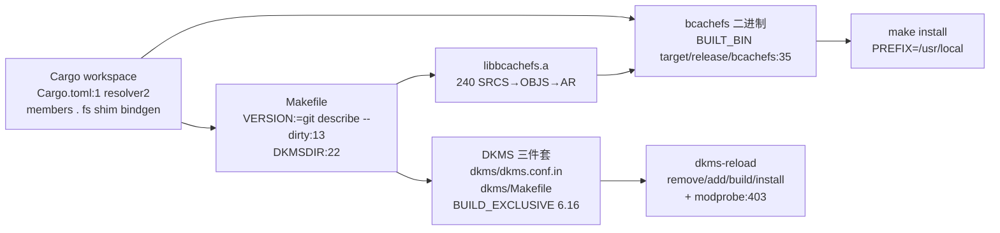
```mermaid
graph LR
    Cargo["Cargo workspace<br/>Cargo.toml:1 resolver2<br/>members . fs shim bindgen"]
    Make["Makefile<br/>VERSION:=git describe --dirty:13<br/>DKMSDIR:22"]
    DKMS["DKMS 三件套<br/>dkms/dkms.conf.in<br/>dkms/Makefile<br/>BUILD_EXCLUSIVE 6.16"]
    Cargo --> Make --> DKMS
    Make --> LBC["libbcachefs.a<br/>240 SRCS→OBJS→AR"]
    Cargo --> BIN["bcachefs 二进制<br/>BUILT_BIN target/release/bcachefs:35"]
    LBC --> BIN
    BIN --> Install["make install<br/>PREFIX=/usr/local"]
    DKMS --> Reload["dkms-reload<br/>remove/add/build/install<br/>+ modprobe:403"]
    %% Source: /home/black/Documents/bcachefs-tools/Cargo.toml:1 + Makefile:13 + Makefile:22 + dkms/dkms.conf.in:1 + Makefile:403
```

*Source: `/home/black/Documents/bcachefs-tools/Cargo.toml:1`（`[workspace] resolver="2"`）+ `/home/black/Documents/bcachefs-tools/Makefile:13`（`VERSION:=$(shell git describe --dirty)`）+ `/home/black/Documents/bcachefs-tools/dkms/dkms.conf.in:1`（`PACKAGE_NAME="bcachefs"`）+ `/home/black/Documents/bcachefs-tools/Makefile:403`（`dkms-reload`）*

### 2. 核心执行流（时序）

#### 2.1 format（`mkfs` → super 写入）

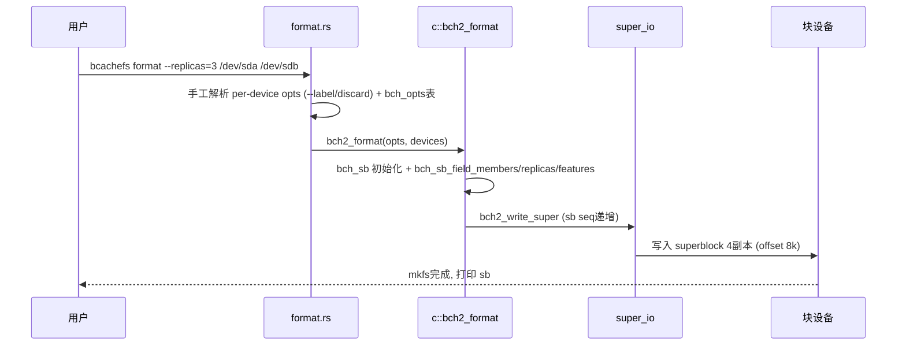
```mermaid
sequenceDiagram
    participant U as 用户
    participant F as format.rs
    participant C as c::bch2_format
    participant S as super_io
    participant D as 块设备
    U->>F: bcachefs format --replicas=3 /dev/sda /dev/sdb
    F->>F: 手工解析 per-device opts (--label/discard) + bch_opts表
    F->>C: bch2_format(opts, devices)
    C->>C: bch_sb 初始化 + bch_sb_field_members/replicas/features
    C->>S: bch2_write_super (sb seq递增)
    S->>D: 写入 superblock 4副本 (offset 8k)
    D-->>U: mkfs完成, 打印 sb
    %% Source: /home/black/Documents/bcachefs-tools/src/commands/format.rs:1 + fs/sb/io.c:1 + fs/bcachefs_format.h:1178
```

*Source: `/home/black/Documents/bcachefs-tools/src/commands/format.rs:1`（`format` 手工解析）+ `/home/black/Documents/bcachefs-tools/fs/bcachefs_format.h:1178`（`struct bch_sb`）+ `/home/black/Documents/bcachefs-tools/fs/sb/io.c:1`（`bch2_write_super`）*

#### 2.2 mount（`bdev → handle → ioctl → mount`）

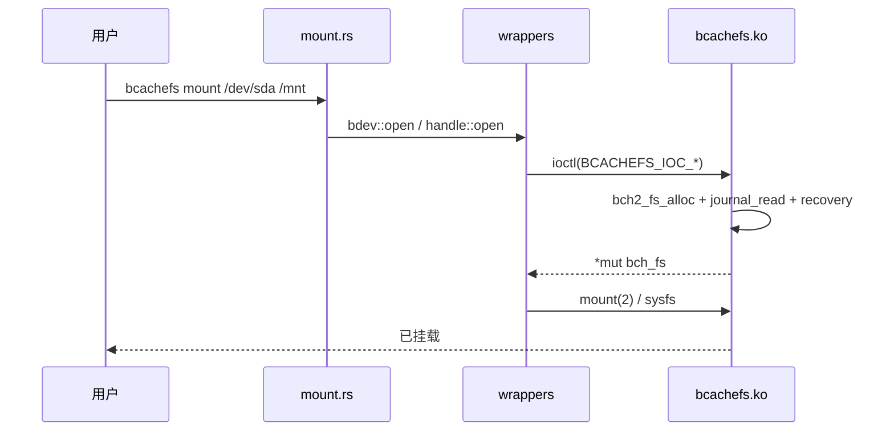
```mermaid
sequenceDiagram
    participant U as 用户
    participant M as mount.rs
    participant W as wrappers
    participant K as bcachefs.ko
    U->>M: bcachefs mount /dev/sda /mnt
    M->>W: bdev::open / handle::open
    W->>K: ioctl(BCACHEFS_IOC_*)
    K->>K: bch2_fs_alloc + journal_read + recovery
    K-->>W: *mut bch_fs
    W->>K: mount(2) / sysfs
    K-->>U: 已挂载
    %% Source: /home/black/Documents/bcachefs-tools/src/commands/mount.rs:1 + src/wrappers/handle.rs:1 + src/wrappers/ioctl.rs:1
```

*Source: `/home/black/Documents/bcachefs-tools/src/commands/mount.rs:1` + `/home/black/Documents/bcachefs-tools/src/wrappers/handle.rs:1` + `/home/black/Documents/bcachefs-tools/src/wrappers/ioctl.rs:1`*

#### 2.3 fsck / recovery_pass（`recovery_pass` 驱动多 pass 修复）

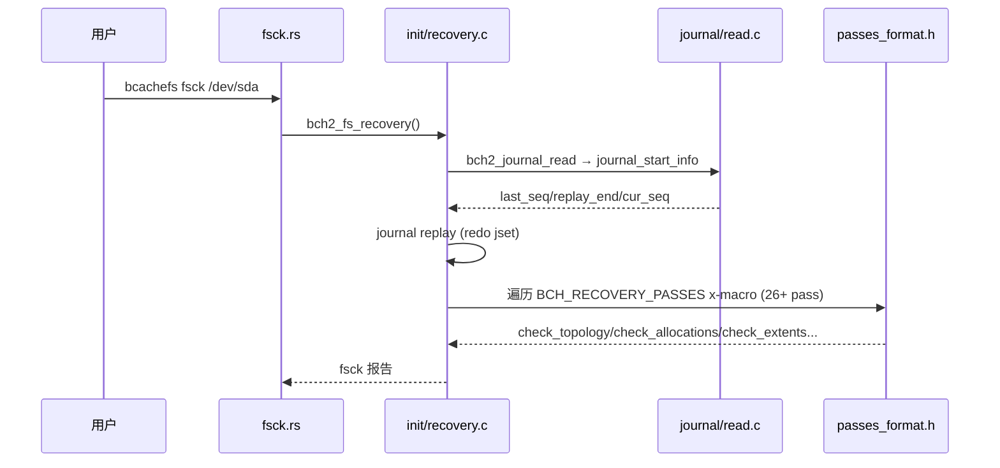
```mermaid
sequenceDiagram
    participant U as 用户
    participant F as fsck.rs
    participant R as init/recovery.c
    participant J as journal/read.c
    participant P as passes_format.h
    U->>F: bcachefs fsck /dev/sda
    F->>R: bch2_fs_recovery()
    R->>J: bch2_journal_read → journal_start_info
    J-->>R: last_seq/replay_end/cur_seq
    R->>R: journal replay (redo jset)
    R->>P: 遍历 BCH_RECOVERY_PASSES x-macro (26+ pass)
    P-->>R: check_topology/check_allocations/check_extents...
    R-->>F: fsck 报告
    %% Source: /home/black/Documents/bcachefs-tools/src/commands/fsck.rs:1 + fs/init/passes_format.h:24 + fs/journal/read.c:1
```

*Source: `/home/black/Documents/bcachefs-tools/src/commands/fsck.rs:1` + `/home/black/Documents/bcachefs-tools/fs/init/passes_format.h:24`（`BCH_RECOVERY_PASSES()` 26+）+ `/home/black/Documents/bcachefs-tools/fs/journal/read.c:1`*

#### 2.4 device add/remove

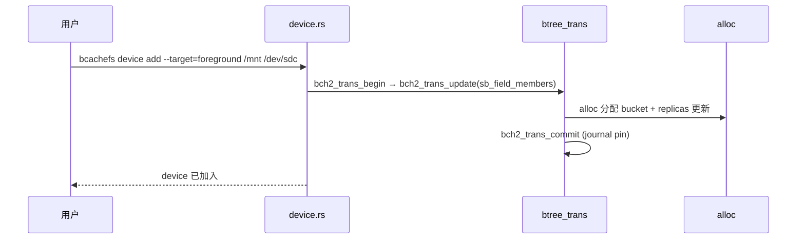
```mermaid
sequenceDiagram
    participant U as 用户
    participant D as device.rs
    participant T as btree_trans
    participant A as alloc
    U->>D: bcachefs device add --target=foreground /mnt /dev/sdc
    D->>T: bch2_trans_begin → bch2_trans_update(sb_field_members)
    T->>A: alloc 分配 bucket + replicas 更新
    T->>T: bch2_trans_commit (journal pin)
    D-->>U: device 已加入
    %% Source: /home/black/Documents/bcachefs-tools/src/commands/device.rs:1 + fs/sb/members.c:1 + fs/btree/types.h:645
```

*Source: `/home/black/Documents/bcachefs-tools/src/commands/device.rs:1` + `/home/black/Documents/bcachefs-tools/fs/sb/members.c:1` + `/home/black/Documents/bcachefs-tools/fs/btree/types.h:645`（`struct btree_trans`）*

#### 2.5 journal_rewind（`journal_rewind_info` 选 rewind 点）

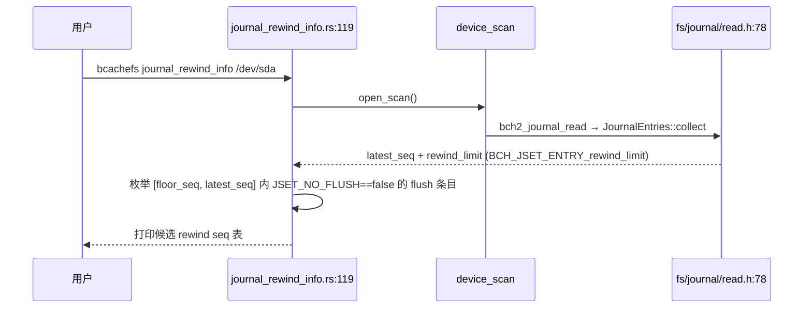
```mermaid
sequenceDiagram
    participant U as 用户
    participant JR as journal_rewind_info.rs:119
    participant S as device_scan
    participant J as fs/journal/read.h:78
    U->>JR: bcachefs journal_rewind_info /dev/sda
    JR->>S: open_scan()
    S->>J: bch2_journal_read → JournalEntries::collect
    J-->>JR: latest_seq + rewind_limit (BCH_JSET_ENTRY_rewind_limit)
    JR->>JR: 枚举 [floor_seq, latest_seq] 内 JSET_NO_FLUSH==false 的 flush 条目
    JR-->>U: 打印候选 rewind seq 表
    %% Source: /home/black/Documents/bcachefs-tools/src/commands/journal_rewind_info.rs:119 + fs/journal/read.h:78
```

*Source: `/home/black/Documents/bcachefs-tools/src/commands/journal_rewind_info.rs:119`（`cmd_journal_rewind_info`）+ `/home/black/Documents/bcachefs-tools/fs/journal/read.h:78`（`bch2_journal_read`）*

### 3. 数据一致性深化（COW + journal + btree 原子性 + recovery_pass）

#### 3.1 一致性架构 — journal/write-buffer/btree 三层原子性

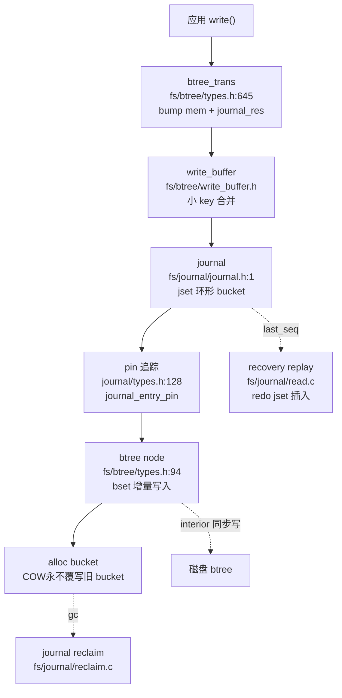
```mermaid
graph TD
    App["应用 write()"] --> Trans["btree_trans<br/>fs/btree/types.h:645<br/>bump mem + journal_res"]
    Trans --> WB["write_buffer<br/>fs/btree/write_buffer.h<br/>小 key 合并"]
    WB --> J["journal<br/>fs/journal/journal.h:1<br/>jset 环形 bucket"]
    J --> P["pin 追踪<br/>journal/types.h:128<br/>journal_entry_pin"]
    P --> BT["btree node<br/>fs/btree/types.h:94<br/>bset 增量写入"]
    BT --> Alloc["alloc bucket<br/>COW永不覆写旧 bucket"]
    J -. last_seq .-> Replay["recovery replay<br/>fs/journal/read.c<br/>redo jset 插入"]
    BT -. interior 同步写 .-> Disk["磁盘 btree"]
    Alloc -. gc .-> Reclaim["journal reclaim<br/>fs/journal/reclaim.c"]
    %% Source: /home/black/Documents/bcachefs-tools/fs/journal/journal.h:1 + fs/btree/types.h:645 + fs/btree/types.h:94 + fs/journal/reclaim.c:1
```

*Source: `/home/black/Documents/bcachefs-tools/fs/journal/journal.h:1`（`THE JOURNAL` 长注释，解释 journal 与 btree 分离 + interior 同步）+ `/home/black/Documents/bcachefs-tools/fs/btree/types.h:645`（`struct btree_trans` 事务载体）+ `/home/black/Documents/bcachefs-tools/fs/btree/types.h:94`（`struct btree` 节点）+ `/home/black/Documents/bcachefs-tools/fs/journal/reclaim.c:1`（`journal reclaim` 防止覆写 dirty 条目）*

一致性保证：所有 btree 叶节点更新先 `bch2_trans_commit` 追加到当前 `journal_buf.data`（`fs/journal/types.h:37 journal_buf`），并 `pin` 关联的 `btree` 写回；`jset.last_seq` 标记 oldest dirty seq，`journal_replay` 崩溃后按 `seq` 顺序 redo 未落盘的 `jset_entry` 插入；interior 节点同步写不经 journal（`journal.h:18` 注释）；bucket 永不覆写，COW 语义保证旧数据在新 btree 写回前仍可读。

#### 3.2 recovery 状态机（`passes_format.h` 26+ pass 调度）

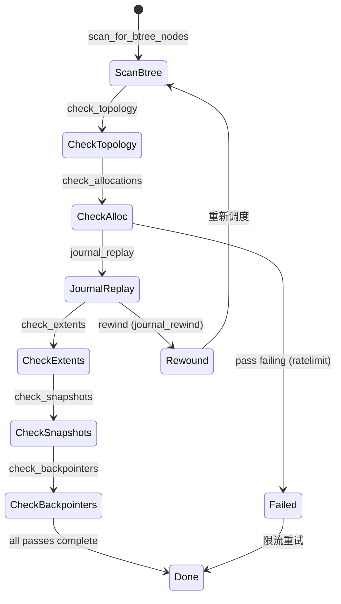
```mermaid
stateDiagram-v2
    [*] --> ScanBtree: scan_for_btree_nodes
    ScanBtree --> CheckTopology: check_topology
    CheckTopology --> CheckAlloc: check_allocations
    CheckAlloc --> JournalReplay: journal_replay
    JournalReplay --> CheckExtents: check_extents
    CheckExtents --> CheckSnapshots: check_snapshots
    CheckSnapshots --> CheckBackpointers: check_backpointers
    CheckBackpointers --> Done: all passes complete
    JournalReplay --> Rewound: rewind (journal_rewind)
    Rewound --> ScanBtree: 重新调度
    CheckAlloc --> Failed: pass failing (ratelimit)
    Failed --> Done: 限流重试
    %% Source: /home/black/Documents/bcachefs-tools/fs/init/passes_format.h:24 + fs/init/passes_types.h:7
```

*Source: `/home/black/Documents/bcachefs-tools/fs/init/passes_format.h:24`（`BCH_RECOVERY_PASSES()` x-macro 定义 26+ `PASS_*` + 依赖 `BIT_ULL(dep)`）+ `/home/black/Documents/bcachefs-tools/fs/init/passes_types.h:7`（`struct bch_fs_recovery` + `recovery_pass_entry`）*

#### 3.3 crash consistency 时序（journal pin + last_seq + replay）

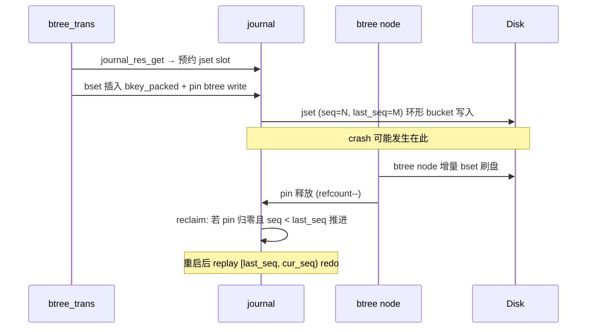
```mermaid
sequenceDiagram
    participant Tx as btree_trans
    participant J as journal
    participant B as btree node
    participant D as Disk
    Tx->>J: journal_res_get → 预约 jset slot
    Tx->>J: bset 插入 bkey_packed + pin btree write
    J->>D: jset (seq=N, last_seq=M) 环形 bucket 写入
    Note over J,D: crash 可能发生在此
    B->>D: btree node 增量 bset 刷盘
    B->>J: pin 释放 (refcount--)
    J->>J: reclaim: 若 pin 归零且 seq < last_seq 推进
    Note over J: 重启后 replay [last_seq, cur_seq) redo
    %% Source: /home/black/Documents/bcachefs-tools/fs/journal/journal.h:1 + fs/journal/types.h:128 + fs/journal/reclaim.c:1
```

*Source: `/home/black/Documents/bcachefs-tools/fs/journal/journal.h:1`（`OPEN/DIRTY JOURNAL ENTRIES` + `JOURNAL FILLING UP`）+ `/home/black/Documents/bcachefs-tools/fs/journal/types.h:128`（`struct journal_entry_pin`）+ `/home/black/Documents/bcachefs-tools/fs/journal/reclaim.c:1`（`journal reclaim` 空间计算）*

### 4. journal 记录类型深化（`jset_entry` 多态 + `JSET` 作用场景）

#### 4.1 journal 记录类型 C4 L2（`fs/bcachefs_format.h` x-macro 派生）

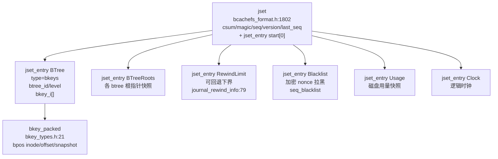
```mermaid
graph TD
    JSET["jset<br/>bcachefs_format.h:1802<br/>csum/magic/seq/version/last_seq<br/>+ jset_entry start[0]"]
    JSET --> JE_BTree["jset_entry BTree<br/>type=bkeys<br/>btree_id/level<br/>bkey_i[]"]
    JSET --> JE_BTreeRoots["jset_entry BTreeRoots<br/>各 btree 根指针快照"]
    JSET --> JE_RewindLimit["jset_entry RewindLimit<br/>可回退下界<br/>journal_rewind_info:79"]
    JSET --> JE_Blacklist["jset_entry Blacklist<br/>加密 nonce 拉黑<br/>seq_blacklist"]
    JSET --> JE_Usage["jset_entry Usage<br/>磁盘用量快照"]
    JSET --> JE_Clock["jset_entry Clock<br/>逻辑时钟"]
    JE_BTree --> BKEY["bkey_packed<br/>bkey_types.h:21<br/>bpos inode/offset/snapshot"]
    %% Source: /home/black/Documents/bcachefs-tools/fs/bcachefs_format.h:1802 + fs/bcachefs_format.h:915 + fs/journal/types.h:37
```

*Source: `/home/black/Documents/bcachefs-tools/fs/bcachefs_format.h:1802`（`struct jset`）+ `/home/black/Documents/bcachefs-tools/fs/bcachefs_format.h:915`（`struct jset_entry` + `BCH_JSET_ENTRY_TYPES()`）+ `/home/black/Documents/bcachefs-tools/fs/journal/types.h:37`（`struct journal_buf { jset *data }`）*

记录类型表（`BCH_JSET_ENTRY_TYPES()` 定义，`fs/bcachefs_format.h:915`）：

| jset_entry type | 作用场景 | 解决的 crash consistency 问题 |
|---|---|---|
| `bkeys` (bkey 插入) | 常规 btree 更新（alloc/extent/inode 等） | btree 叶更新 journal 化，避免同步写 btree；crash 后 redo 恢复 |
| `btree_roots` | 各 btree 根节点指针快照 | 新增 btree 类型无需改 on-disk 格式；恢复时定位 btree |
| `usage` / `clock` | 磁盘用量、逻辑时钟快照 | 频繁更新的 superblock 字段 journal 化，减少 super 写 |
| `blacklist` / `nonce` | 加密序列拉黑 | 防止 journal 重放导致 nonce 重用 |
| `rewind_limit` | 可安全回退的 seq 下界 | `journal_rewind` 时确定 `floor_seq`，避免回退到不一致点 |

#### 4.2 journal 写入与 reclaim 决策树

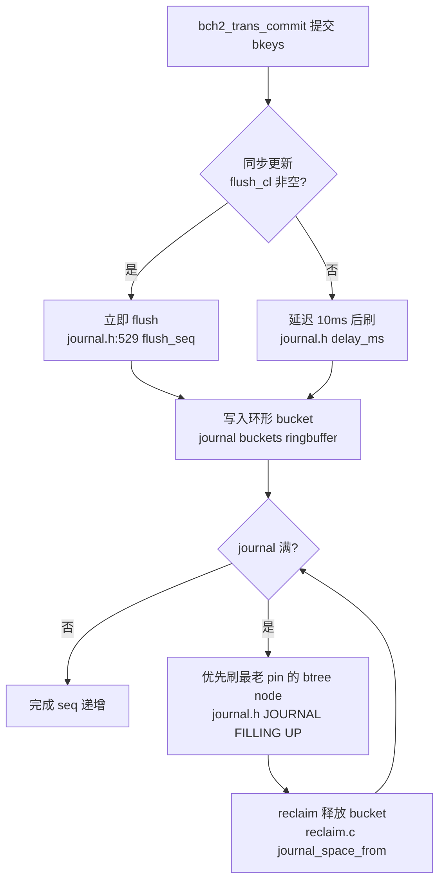
```mermaid
flowchart TD
    W["bch2_trans_commit 提交 bkeys"] --> Q1{同步更新<br/>flush_cl 非空?}
    Q1 -- 是 --> Sync["立即 flush<br/>journal.h:529 flush_seq"]
    Q1 -- 否 --> Delay["延迟 10ms 后刷<br/>journal.h delay_ms"]
    Sync & Delay --> Ring["写入环形 bucket<br/>journal buckets ringbuffer"]
    Ring --> Q2{journal 满?}
    Q2 -- 否 --> Done["完成 seq 递增"]
    Q2 -- 是 --> Flush["优先刷最老 pin 的 btree node<br/>journal.h JOURNAL FILLING UP"]
    Flush --> Reclaim["reclaim 释放 bucket<br/>reclaim.c journal_space_from"]
    Reclaim --> Q2
    %% Source: /home/black/Documents/bcachefs-tools/fs/journal/journal.h:1 + fs/journal/reclaim.c:1
```

*Source: `/home/black/Documents/bcachefs-tools/fs/journal/journal.h:1`（`PERSISTENCE` + `JOURNAL FILLING UP` 注释）+ `/home/black/Documents/bcachefs-tools/fs/journal/reclaim.c:1`（`__should_discard_bucket + journal_space_from`）*

### 5. btree / bset 详细实现（内存/磁盘双格式 + bkey 序列化，含 btree_types.h）

> btree_types 为 `fs/btree/types.h`（`struct btree/bset_tree/btree_trans/six_lock`）与 `fs/btree/bkey_types.h`（`struct bkey/bpos`）的总称，本章覆盖 `btree_types` 全量磁盘-内存映射。

#### 5.1 btree node / bset / bkey 磁盘-内存映射（C4 L3，btree_types）

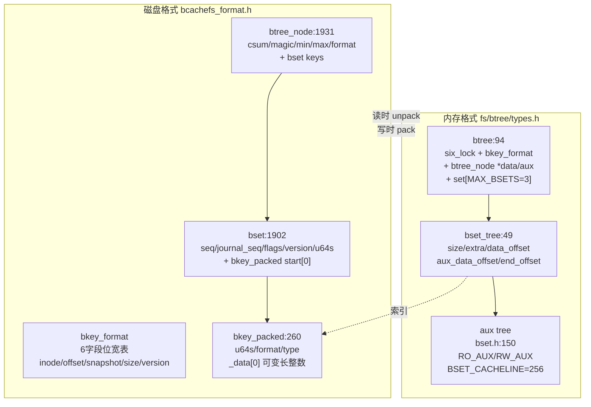
```mermaid
graph TD
    subgraph Disk["磁盘格式 bcachefs_format.h"]
        BN["btree_node:1931<br/>csum/magic/min/max/format<br/>+ bset keys"]
        BSET_D["bset:1902<br/>seq/journal_seq/flags/version/u64s<br/>+ bkey_packed start[0]"]
        BKF["bkey_format<br/>6字段位宽表<br/>inode/offset/snapshot/size/version"]
        BN --> BSET_D
        BSET_D --> BP["bkey_packed:260<br/>u64s/format/type<br/>_data[0] 可变长整数"]
    end
    subgraph Mem["内存格式 fs/btree/types.h"]
        BT["btree:94<br/>six_lock + bkey_format<br/>+ btree_node *data/aux<br/>+ set[MAX_BSETS=3]"]
        BST["bset_tree:49<br/>size/extra/data_offset<br/>aux_data_offset/end_offset"]
        AUX["aux tree<br/>bset.h:150<br/>RO_AUX/RW_AUX<br/>BSET_CACHELINE=256"]
        BT --> BST --> AUX
        BST -. 索引 .-> BP
    end
    Disk -. 读时 unpack .-> Mem
    Mem -. 写时 pack .-> Disk
    %% Source: /home/black/Documents/bcachefs-tools/fs/bcachefs_format.h:1902 + fs/bcachefs_format.h:260 + fs/btree/types.h:49 + fs/btree/types.h:94 + fs/btree/bset.h:150
```

*Source: `/home/black/Documents/bcachefs-tools/fs/bcachefs_format.h:1902`（`struct bset`）+ `/home/black/Documents/bcachefs-tools/fs/bcachefs_format.h:260`（`struct bkey_packed`）+ `/home/black/Documents/bcachefs-tools/fs/btree/types.h:49`（`struct bset_tree`）+ `/home/black/Documents/bcachefs-tools/fs/btree/types.h:94`（`struct btree`）+ `/home/black/Documents/bcachefs-tools/fs/btree/bset.h:150`（`enum bset_aux_tree_type`）*

关键：`bset` 磁盘上为 `bkey_packed` 连续数组，内存中通过 `bset_tree` + aux search tree（`BSET_CACHELINE=256` 每 256B 一索引，二叉堆数组）加速二分查找；`bkey_format` 动态位宽使 `bpos` 三字段压缩为可变长整数，`unpack[6]` 存解码常量。

#### 5.2 bset 各类型与序列化生命周期（状态机）

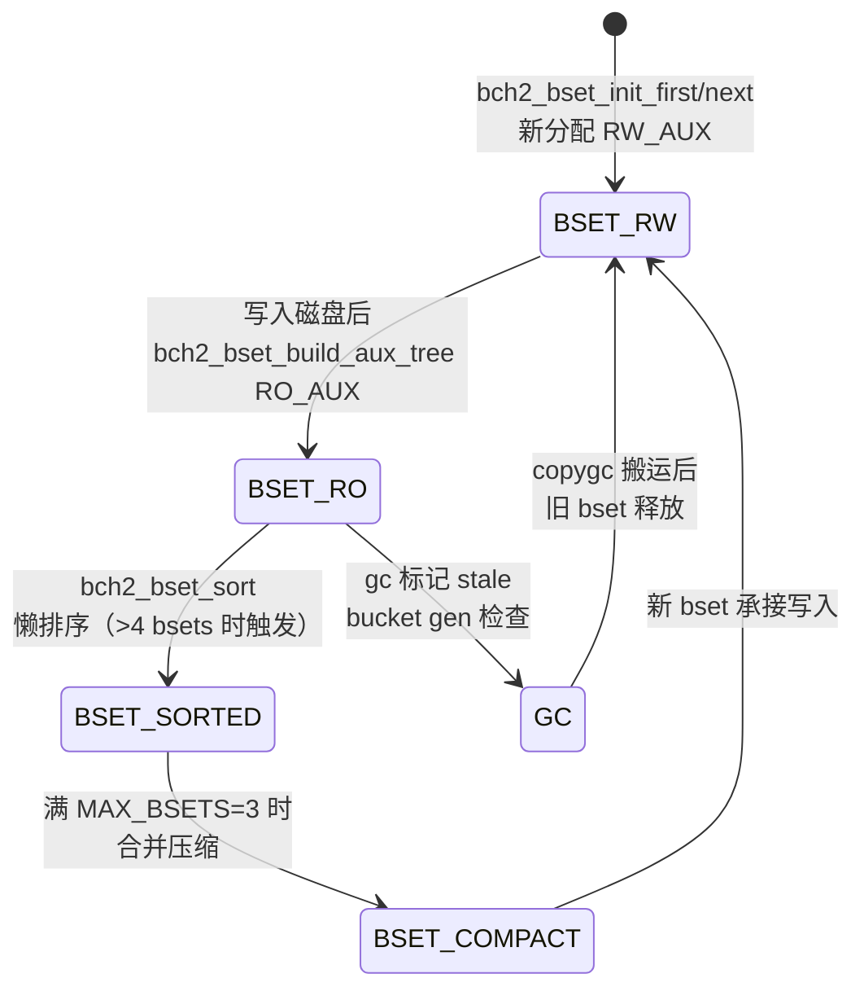
```mermaid
stateDiagram-v2
    [*] --> BSET_RW: bch2_bset_init_first/next<br/>新分配 RW_AUX
    BSET_RW --> BSET_RO: 写入磁盘后<br/>bch2_bset_build_aux_tree RO_AUX
    BSET_RO --> BSET_SORTED: bch2_bset_sort<br/>懒排序（>4 bsets 时触发）
    BSET_SORTED --> BSET_COMPACT: 满 MAX_BSETS=3 时<br/>合并压缩
    BSET_COMPACT --> BSET_RW: 新 bset 承接写入
    BSET_RO --> GC: gc 标记 stale<br/>bucket gen 检查
    GC --> BSET_RW: copygc 搬运后<br/>旧 bset 释放
    %% Source: /home/black/Documents/bcachefs-tools/fs/btree/bset.h:279 + fs/btree/types.h:49 + fs/btree/bset.c:1
```

*Source: `/home/black/Documents/bcachefs-tools/fs/btree/bset.h:279`（`bch2_btree_keys_init / bset_build_aux_tree / bset_insert`）+ `/home/black/Documents/bcachefs-tools/fs/btree/types.h:49`（`set[MAX_BSETS]`）+ `/home/black/Documents/bcachefs-tools/fs/btree/bset.c:1`（`bset_tree_find + __bch2_verify_insert_pos`）*

#### 5.3 bkey 格式决策树（wrappers/工具侧如何解码）

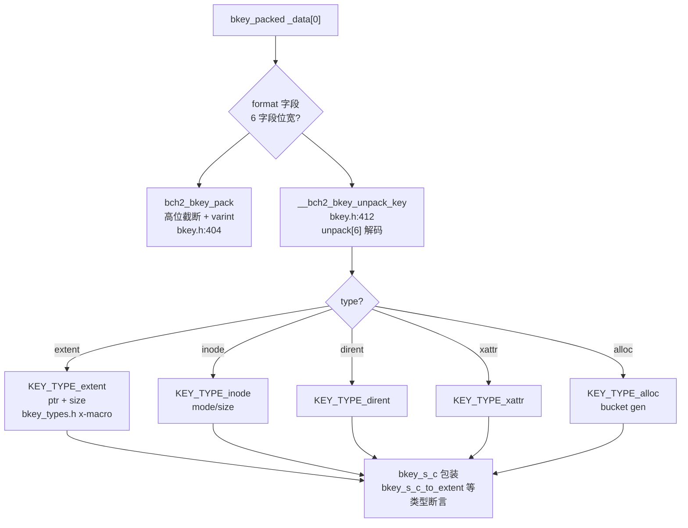
```mermaid
flowchart TD
    K["bkey_packed _data[0]"] --> Q1{format 字段<br/>6 字段位宽?}
    Q1 --> Pack["bch2_bkey_pack<br/>高位截断 + varint<br/>bkey.h:404"]
    Q1 --> Unpack["__bch2_bkey_unpack_key<br/>bkey.h:412<br/>unpack[6] 解码"]
    Unpack --> Q2{type?}
    Q2 -- extent --> Ext["KEY_TYPE_extent<br/>ptr + size<br/>bkey_types.h x-macro"]
    Q2 -- inode --> Ino["KEY_TYPE_inode<br/>mode/size"]
    Q2 -- dirent --> Dir["KEY_TYPE_dirent"]
    Q2 -- xattr --> Xa["KEY_TYPE_xattr"]
    Q2 -- alloc --> Alc["KEY_TYPE_alloc<br/>bucket gen"]
    Ext & Ino & Dir & Xa & Alc --> S["bkey_s_c 包装<br/>bkey_s_c_to_extent 等<br/>类型断言"]
    %% Source: /home/black/Documents/bcachefs-tools/fs/btree/bkey_types.h:21 + fs/btree/bkey.h:412 + fs/btree/bset.h:348
```

*Source: `/home/black/Documents/bcachefs-tools/fs/btree/bkey_types.h:21`（`struct bpos/bkey` 注释 + x-macro 包装）+ `/home/black/Documents/bcachefs-tools/fs/btree/bkey.h:412`（`__bch2_bkey_unpack_key`）+ `/home/black/Documents/bcachefs-tools/fs/btree/bset.h:348`（`want_new_bset`）*

### 6. 空间管理生命周期（alloc → reclaim → gc）

#### 6.1 bucket 状态机（`fs/alloc/background.c` DOC_LATEX）

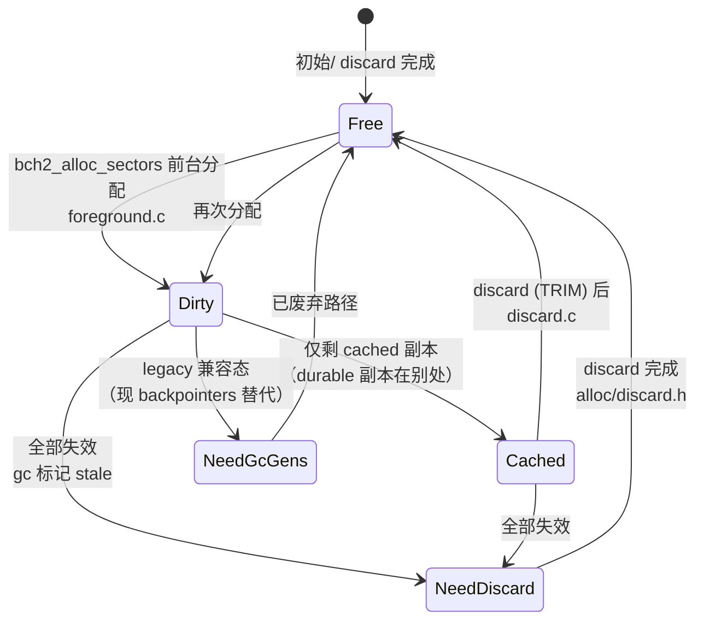
```mermaid
stateDiagram-v2
    [*] --> Free: 初始/ discard 完成
    Free --> Dirty: bch2_alloc_sectors 前台分配<br/>foreground.c
    Dirty --> Cached: 仅剩 cached 副本<br/>（durable 副本在别处）
    Cached --> Free: discard (TRIM) 后<br/>discard.c
    Dirty --> NeedDiscard: 全部失效<br/>gc 标记 stale
    Cached --> NeedDiscard: 全部失效
    NeedDiscard --> Free: discard 完成<br/>alloc/discard.h
    Dirty --> NeedGcGens: legacy 兼容态<br/>（现 backpointers 替代）
    NeedGcGens --> Free: 已废弃路径
    Free --> Dirty: 再次分配
    %% Source: /home/black/Documents/bcachefs-tools/fs/alloc/background.c:1 + fs/alloc/buckets_types.h:37 + fs/alloc/types.h:44
```

*Source: `/home/black/Documents/bcachefs-tools/fs/alloc/background.c:1`（`DOC_LATEX(allocator)` 详细描述 dirty/cached/need_discard/free 四态 + bucket 512K-16M）+ `/home/black/Documents/bcachefs-tools/fs/alloc/buckets_types.h:37`（`struct bucket { gen/dirty_sectors/cached_sectors }`）+ `/home/black/Documents/bcachefs-tools/fs/alloc/types.h:44`（`struct open_bucket`）*

#### 6.2 分配 → 回收时序（foreground + background 协作）

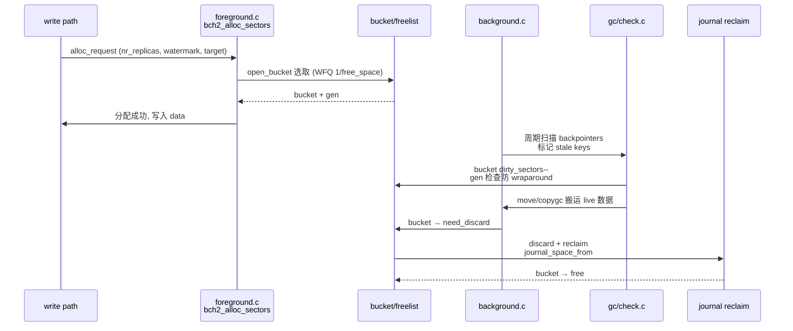
```mermaid
sequenceDiagram
    participant W as write path
    participant FG as foreground.c<br/>bch2_alloc_sectors
    participant B as bucket/freelist
    participant BG as background.c
    participant GC as gc/check.c
    participant JC as journal reclaim
    W->>FG: alloc_request (nr_replicas, watermark, target)
    FG->>B: open_bucket 选取 (WFQ 1/free_space)
    B-->>FG: bucket + gen
    FG->>W: 分配成功, 写入 data
    BG->>GC: 周期扫描 backpointers<br/>标记 stale keys
    GC->>B: bucket dirty_sectors--<br/>gen 检查防 wraparound
    GC->>BG: move/copygc 搬运 live 数据
    BG->>B: bucket → need_discard
    B->>JC: discard + reclaim<br/>journal_space_from
    JC-->>B: bucket → free
    %% Source: /home/black/Documents/bcachefs-tools/fs/alloc/foreground.c:1 + fs/alloc/background.c:1 + fs/alloc/buckets_types.h:37 + fs/journal/reclaim.c:1
```

*Source: `/home/black/Documents/bcachefs-tools/fs/alloc/foreground.c:1`（`WFQ 选盘 + bch2_alloc_sectors`）+ `/home/black/Documents/bcachefs-tools/fs/alloc/background.c:1`（`copygc/move 调度`）+ `/home/black/Documents/bcachefs-tools/fs/alloc/buckets_types.h:37`（`struct bucket`）+ `/home/black/Documents/bcachefs-tools/fs/journal/reclaim.c:35`（`journal_space_from` 计算可用桶）*

#### 6.3 分配策略决策树

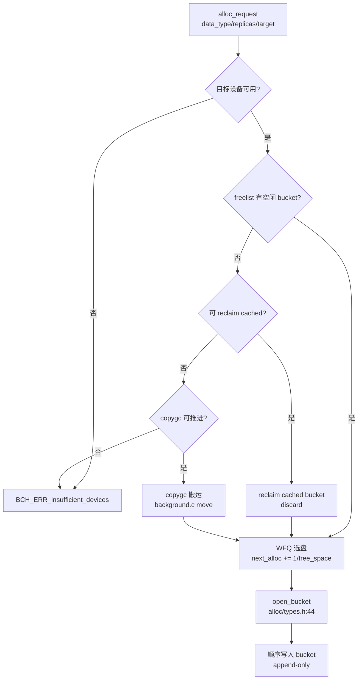
```mermaid
flowchart TD
    Req["alloc_request<br/>data_type/replicas/target"] --> Q1{目标设备可用?}
    Q1 -- 否 --> Fail["BCH_ERR_insufficient_devices"]
    Q1 -- 是 --> Q2{freelist 有空闲 bucket?}
    Q2 -- 否 --> Q3{可 reclaim cached?}
    Q3 -- 是 --> Reclaim["reclaim cached bucket<br/>discard"]
    Q3 -- 否 --> Q4{copygc 可推进?}
    Q4 -- 是 --> GC["copygc 搬运<br/>background.c move"]
    Q4 -- 否 --> Fail
    Q2 -- 是 --> Pick["WFQ 选盘<br/>next_alloc += 1/free_space"]
    Reclaim --> Pick
    GC --> Pick
    Pick --> Open["open_bucket<br/>alloc/types.h:44"]
    Open --> Write["顺序写入 bucket<br/>append-only"]
    %% Source: /home/black/Documents/bcachefs-tools/fs/alloc/foreground.c:1 + fs/alloc/background.c:1 + fs/alloc/types.h:44
```

*Source: `/home/black/Documents/bcachefs-tools/fs/alloc/foreground.c:1` + `/home/black/Documents/bcachefs-tools/fs/alloc/background.c:1` + `/home/black/Documents/bcachefs-tools/fs/alloc/types.h:44`（`struct open_bucket`）*

### 7. 高并发支持深化（transaction restart + six lock + 多线程）

#### 7.1 transaction restart 机制（MVCC 风格乐观重试）

```mermaid
sequenceDiagram
    participant T as btree_trans<br/>types.h:645
    participant B as btree node
    participant L as six_lock
    T->>T: bch2_trans_begin()<br/>mem bump allocator 清零
    T->>B: btree_iter 遍历 + 加锁
    B->>L: six_lock (read/intent/write)
    Note over T,L: 并发冲突 → BCH_ERR_transaction_restart_*
    L-->>T: -EINTR (restart 子码 25种<br/>errcode.h:209)
    T->>T: 解锁全部 + bump mem 作废<br/>restart_count++
    T->>T: 重试整事务 (for_each_btree_key 宏)
    T->>B: 重新遍历 (可能不同路径)
    B-->>T: 成功 → bch2_trans_commit
    T->>T: journal pin + accounting subbuf<br/>update.h:273 __bch2_trans_commit
    %% Source: /home/black/Documents/bcachefs-tools/fs/btree/types.h:645 + fs/errcode.h:209 + fs/btree/iter.h:962 + fs/btree/update.h:273
```

*Source: `/home/black/Documents/bcachefs-tools/fs/btree/types.h:645`（`struct btree_trans { mem/mem_top/restarted/restart_count/srcu_idx }` 注释“释放全部锁后重试，bump mem 作废”）+ `/home/black/Documents/bcachefs-tools/fs/errcode.h:209`（`BCH_ERR_transaction_restart` + 25 子码 `relock/too_many_iters/lock_node_reused/...`）+ `/home/black/Documents/bcachefs-tools/fs/btree/iter.h:962`（`for_each_btree_key` 重试宏）+ `/home/black/Documents/bcachefs-tools/fs/btree/update.h:273`（`__bch2_trans_commit`）*

重试子码（`fs/errcode.h:209-234`）包括 `relock/relock_path/intent/too_many_iters/lock_node_reused/fill_mem_alloc/write_buffer_flush/commit/nested` 等 25 种，`BCACHEFS_INJECT_TRANSACTION_RESTARTS`（`Kconfig:44`）可注入随机 restart 以测试覆盖。

#### 7.2 six lock 三态并发锁（`fs/util/six.h`）

```mermaid
stateDiagram-v2
    [*] --> Unlocked
    Unlocked --> Read: six_lock_read<br/>共享, 可重入
    Unlocked --> Intent: six_lock_intent<br/>与 read 兼容, 互斥
    Read --> Intent: 升级 (避免死锁)
    Intent --> Write: six_lock_write<br/>独占, seq++
    Write --> Intent: 降级
    Intent --> Read: 降级
    Read --> Unlocked: unlock
    Intent --> Unlocked: unlock
    Write --> Unlocked: unlock + seq++
    Unlocked --> Unlocked: six_relock_read<br/>乐观重取 (seq 未变)
    %% Source: /home/black/Documents/bcachefs-tools/fs/util/six.h:1 + fs/btree/types.h:72
```

*Source: `/home/black/Documents/bcachefs-tools/fs/util/six.h:1`（`DOC` 解释 read/intent/write 三态 + `intent` 防升级死锁 + `seq` 乐观重取）+ `/home/black/Documents/bcachefs-tools/fs/btree/types.h:72`（`btree_bkey_cached_common { six_lock lock }`）*

#### 7.3 journal 并发与 btree 并发决策树

```mermaid
flowchart TD
    Q1{操作类型?}
    Q1 -- btree 读 --> R1["six_lock read<br/>多读并发 + SRCU<br/>btree/types.h:645 srcu_idx"]
    Q1 -- btree 写 --> R2["trans restart 循环<br/>for_each_btree_key<br/>iter.h:962"]
    Q1 -- journal 追加 --> R3["journal_buf ring<br/>JOURNAL_STATE_BUF_NR=4<br/>types.h:18 + journal_res_state"]
    Q1 -- journal reclaim --> R4["FIFO pin 引用计数<br/>types.h:128<br/>无锁递减"]
    R1 --> Q2{冲突?}
    R2 --> Q2
    Q2 -- 轻 --> Retry["restart 重试<br/>bump mem 作废"]
    Q2 -- 重 --> Block["closure_wait<br/>journal.h:529"]
    Q2 -- 无 --> Commit["commit 成功"]
    R3 --> Commit
    R4 --> Commit
    %% Source: /home/black/Documents/bcachefs-tools/fs/util/six.h:1 + fs/journal/types.h:18 + fs/journal/types.h:128 + fs/btree/iter.h:962
```

*Source: `/home/black/Documents/bcachefs-tools/fs/util/six.h:1` + `/home/black/Documents/bcachefs-tools/fs/journal/types.h:18`（`JOURNAL_SEQ_MAX 1ULL<<56` + `JOURNAL_STATE_BUF_NR=4`）+ `/home/black/Documents/bcachefs-tools/fs/journal/types.h:128`（`struct journal_entry_pin { flush fn }`）+ `/home/black/Documents/bcachefs-tools/fs/btree/iter.h:962`*

### 8. superblock 与 COW 补充

- `struct bch_sb`（`fs/bcachefs_format.h:1178`）为 `__packed __aligned(8)`，含 `csum/version/magic/uuid/label/offset/seq/block_size + flags[7]/features[2]/compat` + 可扩展 `bch_sb_field_*`（`BCH_SB_FIELDS()` x-macro 定义 `members/replicas/clean/ext/recovery_passes/counters/disk_groups/crypt`，各在 `fs/sb/*.c` 实现 `validate/to_text`）。
- COW：`fs/bcachefs.h:6 "COW filesystem built around a b-tree"`；`BCH_SB_NOCOW`（`format.h:1285`）可关闭但对 `snapshot/reflink` 仍强制 COW；`fs/data/write_types.h:59 nocow_bucket` 与 `fs/btree/types.h:1134 BTREE_NODE_TYPE_HAS_TRANS_TRIGGERS` 区分重写路径。

## 结论与建议

- **架构**：`bcachefs` 单一二进制通过 `COMMAND_GROUPS` 分发 30+ 子命令，经 `wrappers` 适配层调用 `libbcachefs.a`（C）与 `bcachefs-kernel`（Rust），`bch_bindgen + fs/codegen.rs` 双向生成绑定，`Makefile:240 SRCS→AR` 与 `Cargo workspace` 联动，`DKMS` 交付内核模块。后续可派生 `to-tickets` 叶并行开发（叶 12 并行、根串行聚合）。
- **一致性**：journal write-ahead + btree COW + pin 追踪 + `last_seq` replay 构成 crash consistency 闭环；`recovery_pass` 26+ pass 可重放修复。建议后续对 `reclaim` 与 `copygc` 的协作时序作形式化验证。
- **空间/并发**：bucket 四态 + WFQ 分配 + copygc 搬运 + six lock 三态 + trans restart 重试构成高并发分配体系；`BCACHEFS_INJECT_TRANSACTION_RESTARTS` 已提供混沌注入点，建议补确定性夹具覆盖 restart 风暴场景。

## 术语表

| 术语 | 定义 | 来源 |
|---|---|---|
| jset | journal 条目磁盘格式，含 csum/seq/last_seq + jset_entry 数组 | `fs/bcachefs_format.h:1802` |
| jset_entry | jset 内多态条目（bkeys/btree_roots/rewind_limit 等） | `fs/bcachefs_format.h:915` |
| journal_buf | 内存中待写 jset，含 closure + bkey + dev 指针 | `fs/journal/types.h:37` |
| bset | btree node 内 bkey_packed 连续数组，磁盘格式 | `fs/bcachefs_format.h:1902` |
| bset_tree | 内存 bset 索引，含 aux search tree | `fs/btree/types.h:49` |
| bkey_packed | 压缩 bkey，可变长整数存储 bpos | `fs/bcachefs_format.h:260` |
| btree_trans | 事务载体，bump allocator + restart 重试 | `fs/btree/types.h:645` |
| six_lock | 共享/意图/独占三态锁，seq 乐观重取 | `fs/util/six.h:1` |
| open_bucket | 分配中 bucket，顺序写入未覆写 | `fs/alloc/types.h:44` |
| recovery_pass | 恢复阶段 x-macro 定义的 26+ pass | `fs/init/passes_format.h:24` |

## 参考资料

- Primary sources（含 btree_types 契约）：`/home/black/Documents/bcachefs-tools/src/bcachefs.rs:263`、`/home/black/Documents/bcachefs-tools/src/commands/mod.rs:234`、`/home/black/Documents/bcachefs-tools/src/wrappers/mod.rs:1`、`/home/black/Documents/bcachefs-tools/build.rs:1`、`/home/black/Documents/bcachefs-tools/bch_bindgen/build.rs:404`、`/home/black/Documents/bcachefs-tools/fs/build.rs:1`、`/home/black/Documents/bcachefs-tools/fs/codegen.rs:21`、`/home/black/Documents/bcachefs-tools/Makefile:13`、`/home/black/Documents/bcachefs-tools/Makefile:240`、`/home/black/Documents/bcachefs-tools/Cargo.toml:1`、`/home/black/Documents/bcachefs-tools/fs/bcachefs_format.h:1178`、`/home/black/Documents/bcachefs-tools/fs/bcachefs_format.h:1802`、`/home/black/Documents/bcachefs-tools/fs/bcachefs_format.h:1902`、`/home/black/Documents/bcachefs-tools/fs/journal/journal.h:1`、`/home/black/Documents/bcachefs-tools/fs/journal/types.h:37`、`/home/black/Documents/bcachefs-tools/fs/btree/bkey_types.h:21`（bkey/bpos 定义，属 btree_types 族）、`/home/black/Documents/bcachefs-tools/fs/btree/types.h:49`（bset_tree，属 btree_types）、`/home/black/Documents/bcachefs-tools/fs/btree/types.h:94`（btree，属 btree_types）、`/home/black/Documents/bcachefs-tools/fs/btree/types.h:645`（btree_trans，属 btree_types）、`/home/black/Documents/bcachefs-tools/fs/btree/bset.h:150`、`/home/black/Documents/bcachefs-tools/fs/alloc/background.c:1`、`/home/black/Documents/bcachefs-tools/fs/alloc/buckets_types.h:37`、`/home/black/Documents/bcachefs-tools/fs/init/passes_format.h:24`、`/home/black/Documents/bcachefs-tools/fs/util/six.h:1`、`/home/black/Documents/bcachefs-tools/fs/errcode.h:209`
- btree_types 族：`fs/btree/types.h`（`struct btree/bset_tree/btree_trans/six_lock` + `BTREE_NODE_TYPE` 状态位）与 `fs/btree/bkey_types.h`（`struct bkey/bpos/bkey_packed`）共同构成 `btree_types` 契约，内存/磁盘双格式均以 `bset/bkey_packed/bkey_format` 可追溯（见本报告 §5 btree_types 章）
