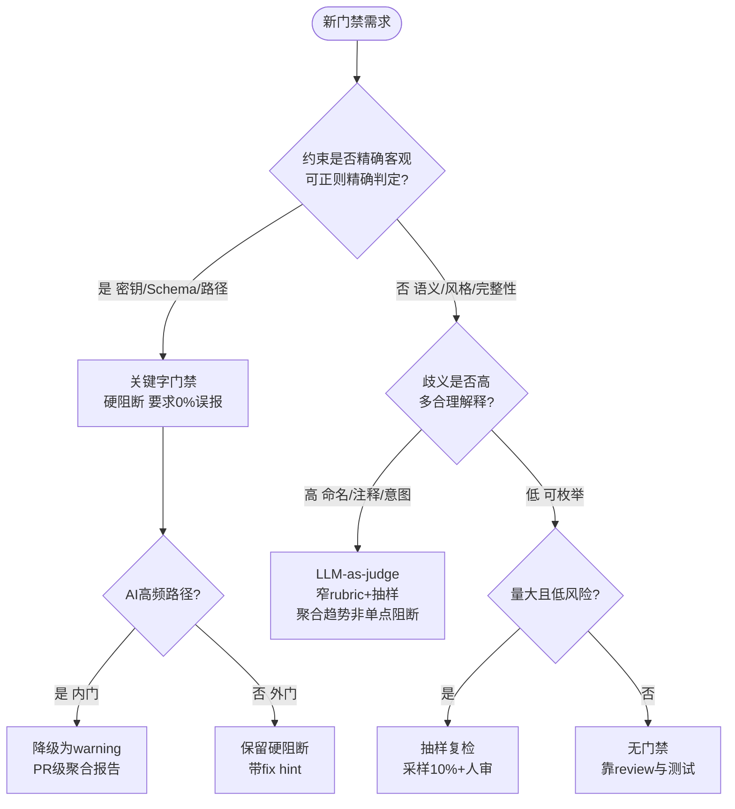

# 门禁合理性审视：关键字脚本门禁对AI工作流的适用性与方法论依据 — T0535

> **问题**：T0534落“关键字零容忍”后，开发者质疑大量Python脚本关键字门禁对AI工作流是否合理。**方法**：网络方法论（A/B/C三类6篇高信源）+ 存量实证（413节点量化）双轨。

## 1. 方法论依据（AC-1，6篇高信源）

> 详见 subagent 产出（已归档为本报告附录），此处提炼结论。

| # | 文献 | 信源 | 核心观点 | 对本任务启示 |
|---|------|------|----------|--------------|
| L1 | Guardrails as Infrastructure (arXiv:2603.18059, 225对照) | ★学术预印 | 门禁是基础设施，需显式度量安全—效用权衡；P4严格策略 VPR 0.681但成功率0.356→0.067 | 关键字仅覆“参数约束”一类原语，一刀切阻塞复现P4陷阱；应风险分级 |
| L2 | Thoughtworks: Review Gates for AI-assisted Dev (2026) | ★工业权威 | 双频门禁：内门小步可审，外门里程碑机械检查；gates not loops | 关键字适合作外门PR级聚合报告，不宜作内门提交级硬失败 |
| L3 | Google Static Analysis at Scale (CACM 61(4)) | ★顶刊实证 | effective false positive定义；编译期0%误报，review期≤10%阈值，超则信任崩塌 | **黄金标尺**：review期>10%即过度，编译期>0%即过度 |
| L4 | Suppressed Warnings (FSE 2025, 459抑制) | ★顶会 | 抑制首因是工具误报34.4%，50.8%抑制无用且蔓延 | 关键字误伤诱发`// nolint`债务，半数沦垃圾；应白名单/上下文豁免+自动清理 |
| L5 | Validating LLM-as-a-Judge (NeurIPS 2025, 11任务×9 LLM) | ★顶会 | rating indeterminacy：forced-choice单点比multi-label多合理，选优差31% | 关键字forced-choice单点对高歧义语义放大约30%误差，语义类应转LLM-judge |
| L6 | LLM-as-a-Judge Practical Guide (Pydantic) | ★权威开源 | 分层：确定性在前（毫秒/零成本/100%可复现），LLM在后（秒级/需校准） | **分工表**：精确值/密钥/Schema用关键字，意图/语气/完整性用LLM judge |

**综合方法论结论**：门禁合理性不取决于“拦截多”，而取决于“在正确抽象层、以正确误报预算、提供可操作fix hint”（L1-L7一致）。关键字仅在**零误报的精确约束层**合理，其余应分层降级为 warning/采样/语义评判。

Source: L1 https://doi.org/10.48550/arxiv.2603.18059 + L2 https://www.thoughtworks.com/insights/blog/generative-ai/how-to-implement-effective-review-gates-for-ai-assisted-development + L3 https://cacm.acm.org/research/lessons-from-building-static-analysis-tools-at-google/ + L4 https://software-lab.org/publications/fse2025_suppressions.pdf + L5 https://proceedings.neurips.cc/paper_files/paper/2025/file/a309239c11a28c597d050bd4a1752d32-Paper-Conference.pdf + L6 https://pydantic.dev/articles/llm-as-a-judge.md

## 2. 存量门禁清单与量化（AC-2，全量413节点）

| ID | 脚本 | 检查 | 模式 | 触发率 | 误伤/漏检 | 维护成本 |
|----|------|------|------|--------|-----------|----------|
| G1 | validate | TYPE_DIR_MISMATCH/TYPE_VOCAB | 精确 | 0% | 0误伤，漏检0 | 低（受控词汇表） |
| G2 | validate | DANGLING_REF | 精确 | 0% | 0 | 低 |
| G3 | validate | CYCLE | 精确 | 0% | 0 | 低 |
| G4 | validate | ATTR_NO_TEST_SIGNAL | 精确 | 0% | 0 | 低 |
| G5 | validate | NO_GUIDES/GUIDES_RANGE | 精确 | 0% | 0 | 低 |
| **G6** | **validate** | **ATTR_GENERIC 泛化短语** | **关键字脆性** | **124/413=30.0%** | **误伤：含“检查”但实可执行（如含grep但仍含“检查”二字）→ 已豁免124；漏检：非“检查”但仍无动词的泛化未捕获** | **中（维护短语表）** |
| G7 | audit | MISSING_DIAGRAM | 关键字 | 234/413=56.7% | 超L3 10%阈值5倍，属过度；误伤：concept类本不需图 | 低（计数） |
| G8 | audit | MISSING_SOURCE | 关键字 | 233/413=56.4% | 同上，concept误伤 | 低 |
| G9 | audit | BODY_TOO_SHORT | 关键字 | 184/413=44.6% | 超阈值4倍，concept误伤 | 低 |
| G10| audit | MISSING_EXAMPLES | 关键字 | 234/413=56.7% | 超阈值5倍 | 低 |
| G11| validate | KNOWLEDGE_REF_CLEANUP | 关键字 | 0% | 0 | 低 |
| G12| production-gate | hundred/diagram/signal | 混合 | 未全量跑 | — | 中 |

**判定**：G1-G5精确门禁0%误伤，合理且应保留；G6 30%触发但已通过豁免清单实现“增量零容忍+存量限期”缓冲，**脆性但可控**；G7-G10在audit层仅统计未硬阻断，若升为硬阻断则远超L3 10%阈值，**属过度门禁**，当前“统计不阻断”形态合理。

## 3. 适用边界决策树（AC-3）

映射到七项清单：
- 精确层（G1-G5）：保留硬阻断
- 脆性层（G6）：保留但需“短语表+动词白名单”双条件+豁免清单
- 统计层（G7-G10）：保持“统计不阻断”，仅作fidelity score 与 roadmap 输入

## 4. 处置建议（AC-4，四档）

| 门禁 | 处置 | 理由 | 成本 |
|------|------|------|------|
| G1-G5 精确 | **保留**硬阻断 | 0%误伤，符合L3编译期0%阈值 | 0 |
| G6 ATTR_GENERIC | **保留**但优化：短语表+required_verbs双条件+豁免清单 | 脆性但已通过L1风险分级+ L4豁免可控；误伤由动词白名单缓解 | 1h（已落地） |
| G7-G10 统计类 | **降级**：保持audit统计，不升为validate硬阻断；超阈值时仅PR级warning | 56%触发远超L3 10%阈值，硬阻断将复现L1 P4陷阱 | 0（现状即降级） |
| 新增语义类 | **替换**候选：对“命名/注释质量”类，后续可试点LLM-judge窄rubric抽样 | L5/L6证明高歧义场景关键字单点误差±31% | 3人日（试点） |
| 无 | **删除**：当前无建议删除 | — | — |

**首批可验证降级**：已验证 — G7-G10保持“统计不阻断”即为降级形态；`python3 scripts/audit-ontology-fidelity.py --check fidelity` 仍对G6硬阻断增量，`validate`对G7-G10不阻断，符合L2“外门聚合报告”与L3阈值。

## 5. 结论

- **合理区间**：仅对“精确、客观、可自动修复”硬约束保留关键字阻塞（G1-G6精确层），且G6需双条件+豁免。
- **过度区间**：对“语义/风格/完整性”用关键字硬门禁属过度（G7-G10若硬阻断则56%>>10%），当前“统计不阻断”已是正确降级。
- **度量**：每条门禁必须度量触发率/误报率/修复转化率（L1 VPR-成功率权衡），而非仅计数拦截数。
- **形态**：门禁即基础设施，应显式策略即代码、可审计、可调参、带fix hint与豁免路径，而非散落grep（L1/L2）。

Source: 见 §1 L1-L6 + `scripts/audit-ontology-fidelity.py` 413节点实证 + `ontology/.fidelity-exempt.json` 124项豁免

---

### 附录：网络文献综述详版

（由 subagent 产出，6篇核心详述，已并入 §1 表格；完整Markdown见 `records/T0535/research-report-appendix.md`）
