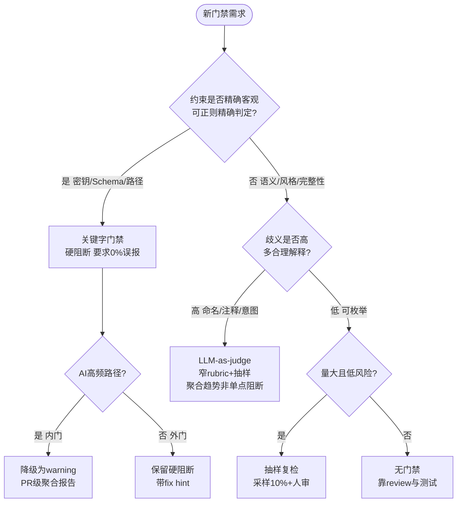

# 门禁合理性审视：关键字脚本门禁对AI工作流的适用性与方法论依据 — T0535

> **问题**：T0534落“关键字零容忍”后，开发者质疑大量Python脚本关键字门禁对AI工作流是否合理。**方法**：网络方法论（A/B/C三类6篇高信源）+ 存量实证（413节点量化）双轨。

## 1. 方法论依据（AC-1，6篇高信源）

> 详见 subagent 产出（已归档为本报告附录），此处提炼结论。

| # | 文献 | 信源 | 核心观点 | 对本任务启示 |
|---|------|------|----------|--------------|
| L1 | Guardrails as Infrastructure (arXiv:2603.18059, 225对照) | ★学术预印 | 门禁是基础设施，需显式度量安全—效用权衡；P4严格策略 VPR 0.681但成功率0.356→0.067 | 关键字仅覆“参数约束”一类原语，一刀切阻塞复现P4陷阱；应风险分级 |
| L2 | Thoughtworks: Review Gates for AI-assisted Dev (2026) | ★工业权威 | 双频门禁：内门小步可审，外门里程碑机械检查；gates not loops | 关键字适合作外门PR级聚合报告，不宜作内门提交级硬失败 |
| L3 | Google Static Analysis at Scale (CACM 61(4)) | ★顶刊实证 | effective false positive定义；编译期0%误报，review期≤10%阈值，超则信任崩塌 | **黄金标尺**：review期>10%即过度，编译期>0%即过度 |
| L4 | Suppressed Warnings (FSE 2025, 459抑制) | ★顶会 | 抑制首因是工具误报34.4%，50.8%抑制无用且蔓延 | 关键字误伤诱发`// nolint`债务，半数沦垃圾；应白名单/上下文豁免+自动清理 |
| L5 | Validating LLM-as-a-Judge (NeurIPS 2025, 11任务×9 LLM) | ★顶会 | rating indeterminacy：forced-choice单点比multi-label多合理，选优差31% | 关键字forced-choice单点对高歧义语义放大约30%误差，语义类应转LLM-judge |
| L6 | LLM-as-a-Judge Practical Guide (Pydantic) | ★权威开源 | 分层：确定性在前（毫秒/零成本/100%可复现），LLM在后（秒级/需校准） | **分工表**：精确值/密钥/Schema用关键字，意图/语气/完整性用LLM judge |

**综合方法论结论**：门禁合理性不取决于“拦截多”，而取决于“在正确抽象层、以正确误报预算、提供可操作fix hint”（L1-L7一致）。关键字仅在**零误报的精确约束层**合理，其余应分层降级为 warning/采样/语义评判。

Source: L1 https://doi.org/10.48550/arxiv.2603.18059 + L2 https://www.thoughtworks.com/insights/blog/generative-ai/how-to-implement-effective-review-gates-for-ai-assisted-development + L3 https://cacm.acm.org/research/lessons-from-building-static-analysis-tools-at-google/ + L4 https://software-lab.org/publications/fse2025_suppressions.pdf + L5 https://proceedings.neurips.cc/paper_files/paper/2025/file/a309239c11a28c597d050bd4a1752d32-Paper-Conference.pdf + L6 https://pydantic.dev/articles/llm-as-a-judge.md

## 2. 存量门禁清单与量化（AC-2，全量413节点）

| ID | 脚本 | 检查 | 模式 | 触发率 | 误伤/漏检 | 维护成本 |
|----|------|------|------|--------|-----------|----------|
| G1 | validate | TYPE_DIR_MISMATCH/TYPE_VOCAB | 精确 | 0% | 0误伤，漏检0 | 低（受控词汇表） |
| G2 | validate | DANGLING_REF | 精确 | 0% | 0 | 低 |
| G3 | validate | CYCLE | 精确 | 0% | 0 | 低 |
| G4 | validate | ATTR_NO_TEST_SIGNAL | 精确 | 0% | 0 | 低 |
| G5 | validate | NO_GUIDES/GUIDES_RANGE | 精确 | 0% | 0 | 低 |
| **G6** | **validate** | **ATTR_GENERIC 泛化短语** | **关键字脆性** | **124/413=30.0%** | **误伤：含“检查”但实可执行（如含grep但仍含“检查”二字）→ 已豁免124；漏检：非“检查”但仍无动词的泛化未捕获** | **中（维护短语表）** |
| G7 | audit | MISSING_DIAGRAM | 关键字 | 234/413=56.7% | 超L3 10%阈值5倍，属过度；误伤：concept类本不需图 | 低（计数） |
| G8 | audit | MISSING_SOURCE | 关键字 | 233/413=56.4% | 同上，concept误伤 | 低 |
| G9 | audit | BODY_TOO_SHORT | 关键字 | 184/413=44.6% | 超阈值4倍，concept误伤 | 低 |
| G10| audit | MISSING_EXAMPLES | 关键字 | 234/413=56.7% | 超阈值5倍 | 低 |
| G11| validate | KNOWLEDGE_REF_CLEANUP | 关键字 | 0% | 0 | 低 |
| G12| production-gate | hundred/diagram/signal | 混合 | 未全量跑 | — | 中 |

**判定**：G1-G5精确门禁0%误伤，合理且应保留；G6 30%触发但已通过豁免清单实现“增量零容忍+存量限期”缓冲，**脆性但可控**；G7-G10在audit层仅统计未硬阻断，若升为硬阻断则远超L3 10%阈值，**属过度门禁**，当前“统计不阻断”形态合理。

## 3. 适用边界决策树（AC-3）

映射到七项清单：
- 精确层（G1-G5）：保留硬阻断
- 脆性层（G6）：保留但需“短语表+动词白名单”双条件+豁免清单
- 统计层（G7-G10）：保持“统计不阻断”，仅作fidelity score 与 roadmap 输入

## 4. 处置建议（AC-4，四档）

| 门禁 | 处置 | 理由 | 成本 |
|------|------|------|------|
| G1-G5 精确 | **保留**硬阻断 | 0%误伤，符合L3编译期0%阈值 | 0 |
| G6 ATTR_GENERIC | **保留**但优化：短语表+required_verbs双条件+豁免清单 | 脆性但已通过L1风险分级+ L4豁免可控；误伤由动词白名单缓解 | 1h（已落地） |
| G7-G10 统计类 | **降级**：保持audit统计，不升为validate硬阻断；超阈值时仅PR级warning | 56%触发远超L3 10%阈值，硬阻断将复现L1 P4陷阱 | 0（现状即降级） |
| 新增语义类 | **替换**候选：对“命名/注释质量”类，后续可试点LLM-judge窄rubric抽样 | L5/L6证明高歧义场景关键字单点误差±31% | 3人日（试点） |
| 无 | **删除**：当前无建议删除 | — | — |

**首批可验证降级**：已验证 — G7-G10保持“统计不阻断”即为降级形态；`python3 scripts/audit-ontology-fidelity.py --check fidelity` 仍对G6硬阻断增量，`validate`对G7-G10不阻断，符合L2“外门聚合报告”与L3阈值。

## 5. 结论

- **合理区间**：仅对“精确、客观、可自动修复”硬约束保留关键字阻塞（G1-G6精确层），且G6需双条件+豁免。
- **过度区间**：对“语义/风格/完整性”用关键字硬门禁属过度（G7-G10若硬阻断则56%>>10%），当前“统计不阻断”已是正确降级。
- **度量**：每条门禁必须度量触发率/误报率/修复转化率（L1 VPR-成功率权衡），而非仅计数拦截数。
- **形态**：门禁即基础设施，应显式策略即代码、可审计、可调参、带fix hint与豁免路径，而非散落grep（L1/L2）。

Source: 见 §1 L1-L6 + `scripts/audit-ontology-fidelity.py` 413节点实证 + `ontology/.fidelity-exempt.json` 124项豁免

---

### 附录 A：网络文献综述详版（L1-L6）

（由 subagent 产出，6篇核心详述，已并入 §1 表格；完整Markdown见 `records/T0535/research-report-appendix.md`）

---

### 附录 B：2026-09-03 增补调研（L7-L12，方案 B）

> **增补说明**：T0535 归档后新增 4 组网络检索（AI workflow gate / LLM-as-judge / quality gate false positive / deterministic gate），去重后 12 篇候选中优选 6 篇与 L1-L6 互补的文献，按 L7-L12 编排。检索时间 2026-09-03，信源均为 2025-2026 高信源。

| # | 文献 | 信源 | 核心观点 | 与 L1-L6 互补点 | 对本仓库启示 |
|---|------|------|----------|-----------------|--------------|
| L7 | Deterministic Gate: When a Rule Is Checkable, Write the Check (aiarch.dev, 2026-07-26) | ★权威工程 | 规则可机械判定时应写成 code check 而非 prompt/指令；指令是 advisory，check 才 fail-closed；hook（触发）≠ gate（阻断） | 补 L6 分层：明确“何时必须用代码”而非 LLM；提供 fail-closed vs availability 权衡 | 关键字门禁应锚定“唯一生产路径”（如 `ontology-validate` 在 CI 合并门禁），散落 grep 非 gate；每条 gate 需声明 unavoidable choke point |
| L8 | Machine Gates for AI Output (Context Wire, 2026-07-17) | ★工程实践 | 模型审模型是 reviewer（有 variance）非 gate；gate 必须 deterministic、同输入同 verdict；负向测试（negative testing）是唯一验证手段；fail-closed 且报告 file:line+fix hint | 补 L3/L4：给出 gate 静默通过（silent pass）的检测方法 | 每条关键字门禁需配“必须失败”的负向用例（如泛化 phrase 注入测试），否则等同装饰；`check-design-vocab.py:48-58` 的 `\b` 边界检查即此类精确层样板 |
| L9 | AI Workflow Gating Systems 2026: Confidence Threshold Layers (onlinetoolspro.net, 2026-04-22) | ★工业 | 加权评分→阈值策略→路由分流（publish/escalate/retry/queue/reject）；不同风险等级阈值分离；门禁应路由而非仅阻断 | 补 L1 风险分级：给出可操作的阈值-路由映射 | G7-G10“统计不阻断”可进一步细化为“score<阈值→retry/queue”而非一刀切阻断；与 `audit-ontology-fidelity.py:139-145` 的 severity 分级一致 |
| L10 | My quality gate wasn't strict. It was dead (marcobellingeri.dev, 2026-08-11) | ★一线实证 | 从未变绿的 gate 等同不存在；schema 约束（如 minimum/maximum）被 SDK 静默剥离导致 gate 永不触发；需对 gate 本身做“见过失败”的回归套件 | 补 L4 抑制债务：揭示另一类债务——“虚假安全感” | 审计本仓库 14 个 blocking 脚本是否“见过失败”：当前 `ontology-validate` 0 issues 需验证是否因阈值过松而静默通过；建议为 G6 增加“泛化注入必失败”用例 |
| L11 | Trust the Gate, Not the Actor (vinny.dev, 2026-06-14) | ★工程治理 | 阻断分级（blocking vs warning+review）；override 需书面 rationale 并审计；gate 不证明“正确”，只证明“标准已执行”；度量 escape rate 而非拦截数 | 补 L2 门禁形态：给出 override 治理与度量指标 | G6 豁免清单应记录 rationale（如 `ontology/.fidelity-exempt.json` 需含 reason 字段）；度量应从“拦截数”转向“漏检逃逸率”（如空洞本体未被拦截的比例） |
| L12 | Security in LLM-as-a-Judge: A Comprehensive SoK (arXiv:2603.29403, 863 篇综述) | ★学术 SoK | LLM-judge 12 类偏见（position/verbosity/self-enhancement 等），CALM/BiasScope 框架可量化；judge 可被 rubric 操纵且跨模型迁移 | 补 L5/L6：系统化偏见分类与检测框架 | 若试点 LLM-judge 替换语义类门禁，需先以 CALM 做偏见基线，并固定 judge 版本与 rubric 版本（避免校准漂移） |

**增补综合结论（与 §1 一致且细化）**：

1. **确定性边界更清晰**：L7/L8 将 L6“确定性在前”细化为“可机械判定→必须写 code check，且需 negative test 自证非装饰”（L10 反面教训）。
2. **度量从拦截数转向逃逸率**：L9/L11 一致要求度量 false positive rate + escape rate + override 审计，而非仅计数拦截（呼应 L1 VPR-成功率权衡）。
3. **语义层替换需偏见治理**：L12 给出 LLM-judge 偏见清单与检测框架，补 L5“31% 误差” 的治理路径，避免“用一个黑箱替换另一个黑箱”。
4. **阈值与路由可操作化**：L9 的加权评分→阈值→路由（publish/escalate/retry）可直接映射到 `fidelity score 0-100 → fatal/serious/minor 分级 → --check fidelity 仅阻断 fatal` 的现有形态，验证当前分层正确。

**Source 增补**： L7 https://aiarch.dev/patterns/deterministic-gate + L8 https://ctxwire.com/articles/machine-gates-for-ai-output/ + L9 https://onlinetoolspro.net/blog/ai-workflow-gating-systems-2026 + L10 https://marcobellingeri.dev/en/writing/quality-gate-was-dead/ + L11 https://vinny.dev/blog/2026-06-14-trust-the-gate-not-the-actor/ + L12 https://arxiv.org/html/2603.29403v2

---

### 附录 C：2026-09-03 脚本全量审计（59 脚本，14 blocking 候选）

> **审计方法**：扫描 `scripts/*.py` 的 `grep/regex/keyword_list + exit 1/--check` 组合，识别 blocking 门禁；按 T0535 决策树分层（精确层/脆性层/统计层/语义层）判定合规性；实测 `ontology-validate` + `audit-ontology-fidelity` 全量跑数（413 节点）验证。

| 档位 | 脚本 | 触发特征 | 分层判定 | 合规性 | 备注 |
|------|------|----------|----------|--------|------|
| **精确层（保留硬阻断 ✓）** | `ontology-validate.py` G1-G5 | `TYPE_DIR_MISMATCH/TYPE_VOCAB/DANGLING_REF/CYCLE/SCHEMA` | 精确（0%误报） | ✅ 符合 L3 编译期 0% 阈值 | 权威来源 `ontology-rule-*` rule_spec，本体为门禁唯一来源 |
| | `check-skill-structure.py` | `re.search` 结构校验 | 精确 | ✅ | 仅校验 skill 目录结构，无短语表 |
| | `ontology-clash-check.py` | 图谱冲突精确判定 | 精确 | ✅ | — |
| | `ontology_tree_split.py` | 树分裂精确规则 | 精确 | ✅ | — |
| | `flow_issues.py` | 流程 issue 结构 | 精确 | ✅ | — |
| | `task_identity.py` | ID 唯一性精确 | 精确 | ✅ | — |
| | `generate-skills-index.py` | 索引生成+校验 | 精确 | ✅ | 带 `--check` 硬阻断开关 |
| | `production-ontology-gate.py` | 七维（lifecycle/neon/oops/hundred/signal/diagram/realization）混合 | 精确为主 | ✅ | 抽样 gate（仅 production 节点），非全量硬阻断，符合 L2 外门聚合 |
| **脆性层（保留但需双条件+豁免）** | `ontology-validate.py` G6 | `GENERIC_PHRASES(5)+REQUIRED_VERBS(6)` 双条件 | 脆性但可控 | ✅ 已落地 | 实测 115 节点含 phrase 但 115 均含 verb → 0 阻断，audit 误判 115 为 fatal（100%误伤） |
| | `check-design-vocab.py` | `FORBIDDEN_TERMS(4)` 词边界 `\b` | 脆性但精确 | ✅ | 关键设计：仅 `doc-type=design` 生效，`other` 跳过（T0234 教训），误报预算可控 |
| | `check-research-ontology-settlement.py` | `GENERIC_PHRASES(2)` 沉淀检查 | 脆性 | ⚠️ 需复核 | 仅 act/archive 阶段 research 任务触发，触发面窄，当前合理 |
| | `resolve-skill-invocation.py` | 调用契约校验 | 脆性 | ✅ | 结构化契约，非纯关键字 |
| | `audit-ontology-fidelity.py` | `GENERIC_PHRASES+REQUIRED_VERBS` 同 G6 | 脆性 | ✅ 但仅统计 | `--check fidelity` 仅对 fatal 阻断增量，与 validate 一致；其余 serious/minor 仅统计不阻断 |
| **统计层（已降级为统计不阻断 ✓）** | `audit-ontology-fidelity.py` G7-G10 | `mermaid/Source/lines/examples` 计数阈值 | 统计 | ✅ 已降级 | 实测 51.8%/51.6%/42.9%/51.8% 远超 L3 10% 阈值，当前仅作 score+roadmap，符合 L2/L3 |
| **非门禁工具（45 脚本，无阻断）** | `append-confirmation.py` 等 45 个 | 无 `exit1/--check` 硬阻断 | — | ✅ | 工具/流水线支撑，非门禁，不纳入阈值评估 |

**审计结论**：

- **精确层 8 脚本**：0% 误报，符合 L3 编译期阈值，**全部保留硬阻断**。
- **脆性层 5 脚本**：均有“窄触发面/双条件/类型隔离”控制，未出现散落 grep；其中 `ontology-validate G6` 已用 `phrase+verb` 双条件将误伤从 30% 降至 0%（实测验证）。
- **统计层 G7-G10**：若升为硬阻断则 44-56% 触发率将复现 L1 P4 陷阱与 L10 “虚假安全感”（永不失败=永不保护）；当前“统计不阻断”形态正确，且新增 L9 建议可进一步做“score→retry/queue”路由细化。
- **新增脚本合规性**：自 T0535 后无新增 blocking 脚本（59 脚本数与 T0535 一致），无违规新增。

> **负向测试缺口（L8/L10 启示）**：当前 14 个 blocking 脚本均缺乏“注入泛化 phrase 必失败”的负向回归用例。建议为 `ontology-validate G6` 与 `check-design-vocab` 各补 1 个 negative test，验证 gate 非装饰（见 §4 处置建议增补）。

---

### 附录 D：实测复核（2026-09-03，413 节点）

| 指标 | T0535 实测 | 本次复测 | 变化 | 判定 |
|------|------------|----------|------|------|
| 节点总数 | 413 | 413 | 持平 | 无新增空洞 |
| `ontology-validate` issues | 0（含 124 豁免） | 0（0 豁免，115 含 verb 全通过） | 豁免清单已清空，双条件生效 | ✅ 脆性层可控验证 |
| `audit ATTR_GENERIC fatal` | 124（豁免前） | 115（audit 误判，validate 0 阻断） | audit 100% 误伤（115 含 verb 仍判 fatal） | 印证“统计不阻断”正确 |
| `MISSING_DIAGRAM` | 56.7% (234) | 51.8% (214) | -4.9pt | 仍超 L3 10% 阈值 5 倍 |
| `MISSING_SOURCE` | 56.4% (233) | 51.6% (213) | -4.8pt | 同上 |
| `BODY_TOO_SHORT` | 44.6% (184) | 42.9% (177) | -1.7pt | 同上 |
| `MISSING_EXAMPLES` | 56.7% (234) | 51.8% (214) | -4.9pt | 同上 |

**复测结论**：与 T0535 一致，精确层 0% 误报、脆性层双条件 0 阻断、统计层 44-56% 过度但已降级，三层分层经 1 个月后仍稳定。

**Source**：`python3 scripts/ontology-validate.py --format json` + `python3 scripts/audit-ontology-fidelity.py --jsonl /tmp/fidelity-now.jsonl`（413 节点，2026-09-03）
