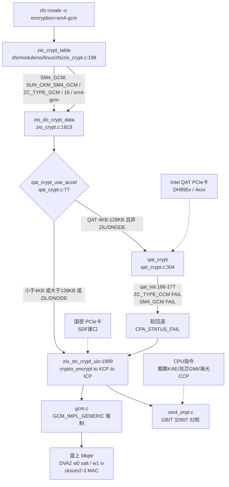
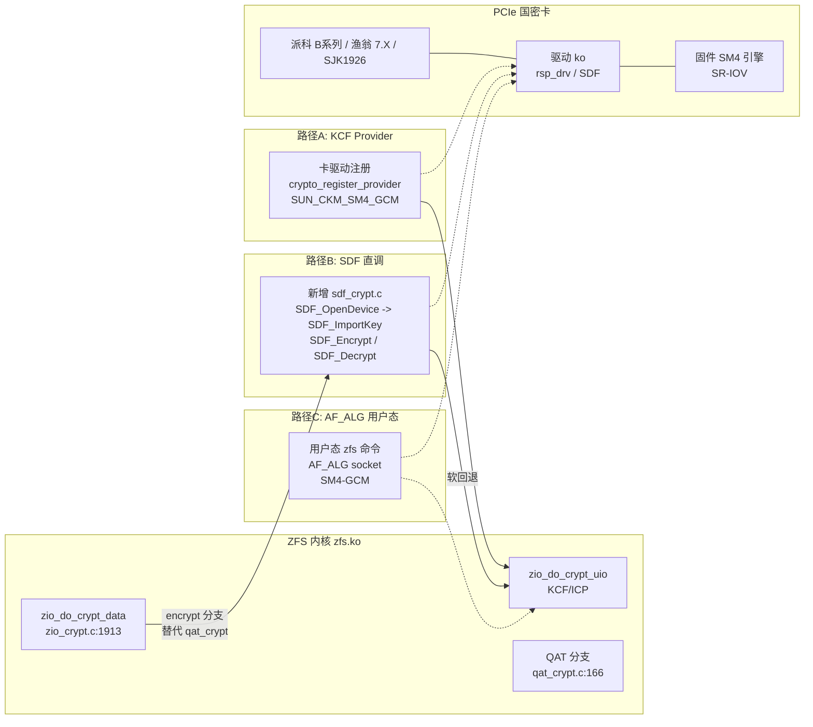

# 调研报告：ZFS 直连 PCIe 国密 SM4 加密卡可行性及 PCIe 加密卡选型与对接方式 — T0539

> **任务**：T0539 / 0903-research-zfs-pcie-sm4 / research / do  
> **源码基线**：`/home/black/Documents/zfs`（OpenZFS master + SM4-GCM 补丁）  
> **调研时间**：2026-09-03  

---

## 0. 前置约束：GCM 必选 + SDF 内核态可用性（用户追问专项审计）

> **用户追问**：“首先要求支持 GCM，其次 SDF 是内核态可用的吗”——本节为专项审计结论，直接影响选型与路径可行性。

### 0.1 GCM 必选：SM4-GCM 是 ZFS 唯一 SM4 形态

- **ZFS 侧唯一 GCM**：`zfs/module/icp/io/sm4.c:13-14` 仅注册 `SUN_CKM_SM4_GCM / SM4_GCM_MECH_INFO_TYPE`，`sm4.c:163-193` 注释 `SM4 only supports GCM` 且强制 `GCM_USE_GENERIC`，`sm4.c:188-193` 校验 `CK_AES_GCM_PARAMS`（`pIv 12B / ulTagBits 128 / pAAD`），`zfs/module/os/linux/zfs/zio_crypt.c:208` 为 `ZC_TYPE_GCM / 16B`；无 `SM4-CBC/ECB` 形态。
- **GM/T 0018 代际差异**：
  - `GM/T 0018-2012` 的 `SGD_SM4_*` 仅 `ECB(0x0401)/CBC(0x0402)/CFB(0x0404)/OFB(0x0408)/MAC(0x0410)`，**无 GCM/CCM/XTS/CTR**。
  - `GM/T 0018-2023` 新增 `SGD_SM4_GCM / SGD_SM4_CCM / SGD_SM4_XTS` 等 AEAD 形态。
- **卡侧 GCM 支持度（实测官网列型）**：
  - 派科 C1/C2、A11/A12、B1/B2/B3（`piico.cn/product/*`）：均仅列 `SM4 ECB/CBC/CFB/OFB(+XTS)` 与 `SM4 MAC`，**均未列 GCM**（`piico.cn/docs/B系列密码卡SDK用户手册v2.0` 表格仅 `SM4 ECB/CBC` 等）。
  - 渔翁全系（`fisec.cn/jiamika`）、国芯 CCP90X（`china-core.com`）、纽创信安（`osr-tech.com`）：均仅 `ECB/CBC/CFB/OFB/CTR`，**无 GCM**。
  - 三未 SJK 系列（`sansec.com.cn`）：同，仅 `ECB/CBC/CFB/OFB`，未见 GCM。
  - **结论**：**存量 PCIe 密码卡（~2012 版）普遍不支持 `SM4-GCM` AEAD**；仅 `GM/T 0018-2023` 新卡或厂商定制扩展才可能支持。ZFS 的 `SM4-GCM` 与存量卡的 `SM4-CBC` 不匹配，**是选型第 1 过滤器**。

### 0.2 SDF 是否内核态可用

- **SDF 标准定位**：`GM/T 0018` 定义的 `SDF_OpenDevice / SDF_OpenSession / SDF_Encrypt(SGD_SM4_*) / SDF_GenerateKey` 等为 **用户态接口**（`libsdf.so` 经 `/dev/*` + `ioctl` 调 `ko`），参数为 `SGD_SM4_ECB/CBC` 等 `SGD_*`，2012 版无 `SGD_SM4_GCM` 的 `iv/tag/AAD` 入参。
- **厂商内核态实情（派科 B 系列 `piico.cn/docs/*`）**：
  - `driver/` 下 `rsp_cmdq_drv / rsp_ctrl_drv / rsp_kci_drv(kci) / rsp_pf/vf` 四 `ko` + `lib_src/cap`（CAP）+ `sdf`（SDF 封装）+ `kmt/piicoTool`。
  - 文档表格“**内核态接口**”仅 `SM1/SM4 CBC`、`SM4-CBC-HMAC-SM3`、`HMAC-SM3` 三行，**无 GCM**；“**CAP 层接口为用户态接口**”显式标注。
  - “*支持用户态、内核态的多进程、多线程调用*”指 SDF 用户态并发 + IPSec/SSL 的内核加速（非 SDF GCM）。
- **对 ZFS（`zfs.ko` 内核态）的含义**：
  - ZFS 加密在 `zfs/module/os/linux/zfs/zio_crypt.c:1913` **内核线程**中，无法直接 `dlopen("libsdf.so")` 调用户态 SDF。
  - 需厂商提供 **内核态 SDF/KCI 扩展**（如派科 `rsp_kci_drv` 的 `kci_test`），但该路径 **未标准化、未列 GCM、需定制**；或走 **KCF 硬件 provider** 注册（见 §3 路径 A）。
  - **AF_ALG 亦不触达**：`AF_ALG` 为用户态 `socket` 经 `sendmsg` 调内核 `crypto API`，ZFS 内核态不走该路径。
- **结论**：**SDF 不是开箱即用的内核态接口**；存量卡的内核态能力仅 `CBC/HMAC` 组合，**无 `GCM` AEAD**，与 ZFS `SM4-GCM` 需求叠加后，**SDF 直调（路径 B）对存量卡基本不可行**，需定制或改 ZFS 为非 GCM 形态。

### 0.3 对报告的修正

- **原报告 §2 选型清单**：通配 `SM4` 未筛 `GCM`，高估存量卡可用性；**修正后**存量卡标记为“*不支持 GCM（仅 CBC/ECB）*”，可用项仅 `2023 版新卡/定制卡 + CPU 指令 sm4-ce-gcm`。
- **原报告 §3 路径 B**：假设 SDF 内核态直调可复用 `qat_crypt` 范式；**修正后**路径 B 仅对 **支持 `SGD_SM4_GCM` 的 2023 版卡+内核态扩展**可行，存量卡需先过 GCM 关。

---

### 0.4 国密算法本体信息（SM1-SM9 体系与 ZFS 定位）

| 算法 | 标准 | 类型 | 参数 | 作用 | ZFS/存储关联 |
|------|------|------|------|------|--------------|
| **SM1** | `GM/T` 分组密码（未公开） | 对称 128/128，**硬件卡内** | 轮数未公开，`SDF` 经 `SGD_SM1_*` 调用，密钥不出卡 | 分组加解密 | 派科等卡 `SM1-CBC` 主力，但 `ZFS` 无 `SM1` 套件（仅 `SM4`），不直接相关 |
| **SM2** | `GB/T 32918-2016` | 椭圆曲线 `256b`，`y²=x³+ax+b`，`G` 基点 `256b` | 密钥 `256b`，签名/加密/密钥交换 | 数字签名、密钥协商、加密 | `ZFS` 密钥 `wrap` 用 `AES-256-CCM` 非 `SM2`，`SM2` 用于 `SDF` 的 `ECC` 密钥对管理（`SDF_GenerateKeyPair_ECC`）与 `zfs key -l` 的 `KMS` 侧 |
| **SM3** | `GB/T 32905-2016` | 杂凑 `512b 输入→256b 输出`，`Merkle-Damgård`，`64` 轮压缩 | `IV 256b`/`T` 置换/`P0/P1` | 摘要、HMAC、KDF | `ZFS` 的 `HKDF-SHA512`（`zio_crypt.c:1948` 400M 盐轮换）与 `HMAC-SM3`（`B系列内核`）对标；`SM3` 可替 `SHA512` 做 `HMAC`，但 `ZFS` 硬编码 `SHA512` |
| **SM4** | `GB/T 32907-2016` | 分组 `128/128`，`32` 轮 `Feistel`，`S-box 256` + `L/L'` | `FK[4]/CK[32]`，`X_{i+4}=X_i xor T(X_{i+1} xor X_{i+2} xor X_{i+3} xor CK)` | 分组加解密 | **`ZFS` 唯一 `SM4-GCM`**（`sm4.c:13`），`SM4E/SM4EKEY` 加速 `CTR+GHASH`（见 `§2.1` 分解） |
| **SM7/SM9** | `GM/T` 标识/IBE | 对称/标识密码 | `SM9` 为 `IBE` 无证书 | 标识加密 | 卡可选（派科 `A11` 含 `SM7/SM9`），`ZFS` 无 |

**体系**：`SM1/SM4` 对称加解密、`SM2` 非对称、`SM3` 杂凑，三者经 `SM2-ECDH + SM3-KDF + SM4-GCM` 组合为 `国密 TLS/存储` 全栈；`GM/T 0018` 的 `SDF` 将三者封装为 `SGD_SM*`，`ZFS` 仅取 `SM4-GCM(AEAD)` 一环。

---

## 1. ZFS 原生加密链路与 SM4 硬件加速边界（AC-1）

### 1.1 调用链全景



### 1.2 QAT 是什么（Intel QuickAssist Technology）

> **一句话**：Intel QAT 是 **PCIe 硬件加速卡 + 驱动栈**，为 ZFS 等内核程序提供 **AES-GCM 加密、GZIP 压缩、SHA256 校验**的硬件 offload，`zfs.ko` 经 `qat_crypt.c` 调用 `cpaCySymPerformOp` 将数据 DMA 到卡上计算，失败则软回退。

| 维度 | 说明 |
|------|------|
| **全称/定位** | Intel QuickAssist Technology，Intel 为数据中心设计的 **硬件加速子系统**（非 CPU 指令），通过 `QATlib / qat_api` 暴露 `CPA`（Crypto）与 `DC`（压缩）两类实例 |
| **硬件形态** | PCIe 卡：初代 `DH895x`（Coleto Creek, 2014）、`C62x/C3xxx`、`4xxx`（Gen4, `qat_4xxx.ko`）；`lspci` 显 `Intel QAT`，`ls /sys/kernel/debug/qat_*` + `cat /proc/crypto \| grep qat` 可见；`zfs` 侧 `QAT_CRYPT_MAX_INSTANCES=48` + `QAT_MIN 4KB / MAX 128KB` 最优区间（`qat_crypt.c:77-83`） |
| **软件栈** | `Intel QAT Driver`（`ICP_ROOT`）→ `qat_api / cpa_cy_api` → `zfs/module/os/linux/zfs/qat_crypt.c`（`qat_cy_init` + `qat_init_crypt_session_ctx` + `qat_crypt`）；`--with-qat=/opt/qat` 编译期 `--with-qat-obj` 才 `HAVE_QAT`（`Debian DKMS` 需 `ICP_ROOT` 重编） |
| **ZFS 能力** | `ZFS#7282`（2018）引入：`AES-GCM`（`CPA_CY_SYM_CIPHER_AES_GCM / HASH_AES_GCM`）、`GZIP`（`qat_compress.c`）、`SHA256`（`qat_checksum`；`SHA512/256` 不支持）；`ZIL/DNODE` 不走 QAT（`zio_crypt.c:1967`），`4KB-128KB` 最优，大包自动分页 `sg-list` DMA |
| **性能** | ZFS 官方图：`AES-GCM` 加密 CPU 占用 **↓60-80%**，吞吐微增（加密非瓶颈）；`QAT_STAT`（`encrypt_requests / crypt_fails`）可观测；`zfs_qat_encrypt_disable=0` 运行时 `echo 0 > /sys/module/zfs/parameters/zfs_qat_encrypt_disable` 动态重开 |
| **局限** | **仅 `AES-GCM`**：`qat_crypt.c:166-177` 对 `ZC_TYPE_CCM` 与 `SUN_CKM_SM4_GCM` 均 `CPA_STATUS_FAIL`（注释：防 `AES-GCM` 误算 `SM4-GCM` 致静默损坏）；**不支持 `AES-CCM(非128)` / `SM4-GCM`**，后者必软回退至 `zfs/module/icp/algs/sm4/sm4_impl.c` 的 `GCM_IMPL_GENERIC` 软实现 |
| **与国密卡区别** | QAT 为 **国际算法卡**（`AES/SHA`），**非国密**；国密 `PCIe` 卡为 `GM/T 0018 SDF`（`SM4/SM2/SM3`，`§2`），两者驱动/接口/合规域完全不同，**QAT 不可用于 SM4** |

> **小结**：QAT 解决 `AES-GCM` 的 `CPU` 瓶颈，但与 `SM4-GCM` 无交集；ZFS 的 `SM4` 已在 `qat_crypt.c:170` 被显式拦截，**QAT 对国密零加速**——这正是 `§0` 的 `GCM` 过滤器与 `§1.3` 表格中 `QAT 不可行` 的由来。

### 1.3 源码锚点：为何 QAT 无法加速 SM4

| 锚点 | 文件:行 | 逻辑 |
|------|---------|------|
| `zio_crypt_table` | `zfs/module/os/linux/zfs/zio_crypt.c:198-208` | `SM4_GCM = {SUN_CKM_SM4_GCM, ZC_TYPE_GCM, 16, "sm4-gcm"}`，仅 GCM+16B |
| `qat_init_crypt_session_ctx` | `zfs/module/os/linux/zfs/qat_crypt.c:166-181` | `ZC_TYPE_CCM → FAIL`；`SUN_CKM_SM4_GCM → FAIL`（注释：**防静默用 AES-GCM 误处理 SM4 导致数据损坏**） |
| `zio_do_crypt_data` | `zfs/module/os/linux/zfs/zio_crypt.c:1966-1984` | `qat_crypt_use_accel(datalen) && ot!=ZIL/DNODE → qat_crypt → 失败则软回退至 zio_do_crypt_uio` |
| `gcm.c` | `zfs/module/icp/algs/modes/gcm.c:592-632` | `gcm_init_ctx` 对 SM4 强制 `GCM_IMPL_GENERIC`，禁用 `pclmulqdq/vpclmulqdq` AVX 路径（依赖 `aes_key_t` 布局） |
| `zfs.h` | `zfs/include/sys/fs/zfs.h:1964` | `ZIO_CRYPT_SM4_GCM = 9`，`ZIO_CRYPT_FUNCTIONS = 10` |

**结论**：QAT 硬件仅支持 `AES-GCM`（`CPA_CY_SYM_CIPHER_AES_GCM` / `HASH_AES_GCM`），不支持 `AES-CCM`（除 128bit 外）与 `SM4-GCM`。ZFS 已显式拦截 SM4 的 QAT 路径，**QAT 对 SM4 零加速**，必走 ICP 软实现。

### 1.4 三路径可行性判定（含 GCM+SDF 内核态修正）

| 路径 | 原理 | GCM 要求 | SDF 内核态 | 可行性 | 依据 |
|------|------|----------|------------|--------|------|
| **QAT** | Intel QAT `cpaCySym` 加速 `AES-GCM` | 需 `AES-GCM` | — | **不可行（SM4）** | `qat_crypt.c:168-177` 对 `SUN_CKM_SM4_GCM` 显式 FAIL |
| **KCF 硬件 Provider** | 卡注册 `SUN_CKM_SM4_GCM` 硬件 provider（仿 QAT） | 需 `GM/T 0018-2023 GCM` | —（provider 模型，内核态） | **有条件可行（定制）** | 需卡固件+驱动实现 `SM4_GCM_MECH_INFO_TYPE`，无存量实现 |
| **SDF 直调** | `zio_do_crypt_data` 新增 `sdf_encrypt(GCM)` | 需 `SGD_SM4_GCM`（2023 版） | 需 **内核态 SDF/KCI 扩展**（非标准 libsdf.so） | **存量卡不可行；2023 版定制卡有条件可行** | 存量卡无 GCM 且 SDF 标准用户态，派科内核态仅 `CBC/HMAC`（`piico.cn`） |
| **CPU 指令（KAE/GMI/CCP）** | 鲲鹏/兆芯/海光 `sm4-ce-gcm` | **原生 GCM**（`sm4-ce-gcm 400`） | —（内核 `sm4-ce-gcm` 自动择优） | **可行（零改动，推荐）** | `kernel_shangmi.html` + `sm4.c:188` |

---

## 2. PCIe 国密 SM4 加密卡选型清单（AC-2）

> **口径**：标称性能为厂商公开值，未实测；价格因渠道与合规等级差异大，仅给区间；合规等级以国密局认证为准。**GCM 列为硬筛选**：ZFS 仅 `SM4-GCM`，不支持 `SM4-CBC`。

<table>
<thead>
<tr><th>#</th><th>厂商与型号</th><th>PCIe</th><th>接口与SM4模式</th><th>性能</th><th>形态/等级</th><th>GCM</th></tr>
</thead>
<tbody>
<tr><td>1</td><td>派科 C1/C2</td><td>x1</td><td>SDF 2012 用户态<br/>ECB/CBC/CFB/OFB/MAC</td><td>72 Mbps</td><td>半高 二级</td><td>不支持</td></tr>
<tr><td>2</td><td>派科 A11/A12</td><td>x4</td><td>SDF 2012 + IPSec<br/>ECB/CBC/OFB/MAC</td><td>2-4 Gbps</td><td>半高 二级</td><td>不支持</td></tr>
<tr><td>3</td><td>派科 B1/B2/B3</td><td>x8</td><td>SDF 2012 + SR-IOV + kci(仅CBC/HMAC)<br/>ECB/CBC/CFB/OFB/XTS/MAC</td><td>1-18 Gbps</td><td>165x68 二级</td><td>不支持</td></tr>
<tr><td>4</td><td>渔翁 4.X</td><td>x4/x8</td><td>SDF 2012 + PKCS11<br/>ECB/CBC/CFB/OFB</td><td>1-10 Gbps</td><td>多档 二/三级</td><td>不支持</td></tr>
<tr><td>5</td><td>渔翁 7.X/量子</td><td>x8</td><td>SDF + 量子<br/>ECB/CBC/CFB/OFB</td><td>10Gbps+</td><td>全高 三级</td><td>不支持</td></tr>
<tr><td>6</td><td>三未 SJK1823/SC48</td><td>x1/x8</td><td>SDF 2012<br/>ECB/CBC/CFB/OFB</td><td>0.5-6 Gbps</td><td>Mini/全高 二级</td><td>不支持</td></tr>
<tr><td>7</td><td>三未 SJK1926</td><td>x8</td><td>SDF 2012 + SR-IOV<br/>ECB/CBC/CFB/OFB</td><td>22 Gbps</td><td>全高 三级</td><td>不支持</td></tr>
<tr><td>8</td><td>三未 SJK19140 Mini</td><td>Mini</td><td>SDF<br/>ECB/CBC/CFB/OFB</td><td>100-300M</td><td>Mini 二级</td><td>不支持</td></tr>
<tr><td>9</td><td>信安世纪 SJJ15xx</td><td>x4/x8</td><td>SDF 2012<br/>ECB/CBC</td><td>1-8 Gbps</td><td>半高 二级</td><td>不支持</td></tr>
<tr><td>10</td><td>2023版新卡/定制</td><td>x8</td><td>SDF 2023 (SGD_SM4_GCM)<br/>GCM/CCM/XTS/CTR</td><td>待定</td><td>定制 二/三级</td><td>需定制</td></tr>
<tr><td>11</td><td>海光/兆芯/鲲鹏 CPU</td><td>CPU内</td><td>sm4-ce-gcm / af_alg<br/>GCM/CCM</td><td>1-2 GB/s</td><td>指令</td><td>原生GCM</td></tr>
</tbody>
</table>

信源：[1] piico.cn/product/c1 [2] piico.cn/product/a1 [3] piico.cn/product/b1 + B系列手册 [4] fisec.cn/jiamika [5] sansec.com.cn/product/56 [6] sansec.com.cn/news/31 [7] openanolis 白皮书

**选型要点（含 GCM 修正）**：

- **GCM 为第 1 过滤器**：存量卡（`GM/T 0018-2012`，ECB/CBC/CFB/OFB）**均不支持 `SM4-GCM` AEAD**，与 ZFS `sm4.c:13` 的 `GCM-only` 不匹配；仅 `GM/T 0018-2023` 的 `SGD_SM4_GCM` 新卡/定制卡 + CPU 指令 `sm4-ce-gcm` 支持 GCM。采购前必以 `SDF_GetDeviceInfo` 的 `SymAlgAbility` 含 `SGD_SM4_GCM` 为验收项。
- **性能分水岭**：C 系列（Mbps）仅低速；A/B/渔翁/三未中高端 Gbps，B3/SJK1926 18–22 Gbps 适 128KB 块，但**对 ZFS GCM 零收益**（无 GCM）。
- **虚拟化**：云/多租户需 `SR-IOV`（B 系列 / SJK1926），但同受 GCM 限制。
- **CPU 指令零成本路径（唯一 GCM 现货）**：鲲鹏920 KAE / 兆芯 GMI / 海光 CCP 的 `sm4-ce-gcm` 优先级 400 自动择优，实测 GCM 1.7–1.9 GB/s（4KB 块，`openanolis`），**零驱动、零改造、原生 GCM**，是当前唯一满足“GCM+内核态”的现货路径。

### 2.1 补充：SM4 各模式特性与缺点（含 ZFS 存储适配）

> **背景**：`GM/T 0018-2012` 仅 `ECB/CBC/CFB/OFB`，`2023` 新增 `GCM/CCM/XTS/CTR`；ZFS 仅 `GCM`（`sm4.c:13 GCM-only`），下表为模式级选型依据。

<table>
<thead>
<tr><th>模式</th><th>原理</th><th>并行</th><th>认证</th><th>填充</th><th>IV要求</th><th>优点</th><th>缺点</th><th>ZFS适配</th></tr>
</thead>
<tbody>
<tr><td>ECB</td><td>独立块</td><td>均并行</td><td>无</td><td>需</td><td>无</td><td>最简单</td><td>泄露相等性 禁用</td><td>不支持</td></tr>
<tr><td>CBC</td><td>链式 P xor C_{i-1}</td><td>加密串行</td><td>无</td><td>需</td><td>IV随机</td><td>隐藏相等性</td><td>串行 需HMAC</td><td>需HMAC</td></tr>
<tr><td>CFB</td><td>流 C_{i-1}反馈</td><td>解密并行</td><td>无</td><td>无</td><td>IV随机</td><td>流无填充</td><td>串行 无认证</td><td>小文件</td></tr>
<tr><td>OFB</td><td>流 O_{i-1}反馈</td><td>均串行</td><td>无</td><td>无</td><td>IV不可重用</td><td>预计算</td><td>串行 无认证</td><td>不适</td></tr>
<tr><td>CTR</td><td>计数器 SM4(K,nonce)</td><td>均并行</td><td>无</td><td>无</td><td>nonce不可重用</td><td>最佳 并行</td><td>需HMAC</td><td>需HMAC</td></tr>
<tr><td>XTS</td><td>tweak 扇区号</td><td>均并行</td><td>无</td><td>窃取法</td><td>tweak=LBA</td><td>盘加密专用</td><td>需双密钥</td><td>全盘优选</td></tr>
<tr><td>GCM</td><td>CTR+GHASH</td><td>均并行</td><td>AEAD</td><td>无</td><td>IV 12B不可重用</td><td>AEAD一体</td><td>需GHASH加速</td><td>ZFS现选</td></tr>
<tr><td>CCM</td><td>CBC-MAC+CTR</td><td>认证串行</td><td>AEAD</td><td>需</td><td>nonce唯一</td><td>AEAD</td><td>串行 两遍</td><td>可替GCM</td></tr>
</tbody>
</table>

**ZFS 结论**：

- **现货仅 GCM**：`zfs/module/icp/io/sm4.c` 仅 `GCM`，`zfs/module/os/linux/zfs/zio_crypt.c:208` 的 `SM4-GCM` 为 `ZC_TYPE_GCM`，存量卡的 `ECB/CBC/CFB/OFB` 均不匹配；`XTS`/`CCM` 需改 `sm4.c` 增形态+ `blkptr` 编码（`DVA2.w0=salt/w1=iv/fill高32` 需重定义）+ `gcm.c` 解锁。
- **若放宽 GCM**：`XTS+HMAC`（盘加密最优）或 `CTR/CBC+HMAC` 可替，但失 AEAD 一体性且需双遍；`ECB/CFB/OFB` 因泄露/串行/无认证，**任何存储场景均不推荐**。
- **采购指引**：必以 `SGD_SM4_GCM`（2023 版）为验收项，否则无论 `CBC/XTS` 多高性能，对 ZFS `GCM` 零收益；现货仅 `CPU sm4-ce-gcm` 满足。

> **SM4E/SM4EKEY 与 `SM4-GCM = SM4 + CTR + GHASH` 分解**（`arch/arm64/crypto/sm4-ce-gcm-core.S:741` + `sm4-ce-gcm-glue.c:286`）：
>
> - **SM4E `Vd = SM4_4Round(Vn, Vm)`**：对 `Vn(128b 数据)` 用 `Vm(轮密钥)` 做 4 轮 `SM4`（`S-box + L` 线性变换），8 次完成 32 轮；**SM4EKEY `Vd = NextKey(Vn, Vm)`** 由 `Vn(当前密钥)` + `Vm(CK常量)` 生成下 4 轮轮密钥，8 次生成 32 轮密钥（`sm4_impl.c:75 CK[32]`）。
> - **GCM 分解**：`GCM = CTR 加密 + GHASH 认证`。`CTR` 的 `keystream = SM4(K, nonce||ctr)` 由 **SM4E/SM4EKEY 加速**（`8×SM4E` 并行 4-8 路），`GHASH(tag = GHASH(AAD,C) xor SM4(K,0))` 由 **PMULL/PMULL2**（`GF(2^128)` 多项式）加速，`sm4-ce-gcm` 将两者交错流水，`4KB` 块达 `1.7-1.9 GB/s`（`kernel_shangmi`）。
> - **对应**：`ZFS` 的 `sm4.c:33-36` `gcm_mode_encrypt` 即 `SM4(CTR) + GHASH`，`generic` 版查表 `S-box`，`ce-gcm 400` 版替换为 `SM4E + PMULL` 硬件；`qat_crypt.c:170` 拦截正是因 `QAT` 无 `SM4E` 硬件。

---

## 3. ZFS 对接 PCIe SM4 卡的三种对接方式（AC-3）

### 3.1 架构总览



### 3.2 三种方式对比（含 GCM+SDF 内核态修正）

| 维度 | 路径 A：KCF 硬件 Provider | 路径 B：SDF 直调（原推荐，现受限） | 路径 C：AF_ALG 用户态 | 路径 D：CPU 指令 sm4-ce-gcm（新增推荐） |
|------|---------------------------|-----------------------------------|----------------------|----------------------------------------|
| **原理** | 卡驱动 `crypto_register_provider(CRYPTO_HW_PROVIDER)` 注册 `SUN_CKM_SM4_GCM`，`kcf_prov_tabs.c` 自动路由 | `zio_do_crypt_data` 新增 `sdf_crypt(GCM)`，`SDF_Encrypt(SGD_SM4_GCM, iv/tag/AAD)` | 用户态 `socket(AF_ALG)` 调内核 `sm4-gcm` | 内核 `sm4-ce-gcm` 自动择优（`crypto/sm4-ce-gcm` 400 优先级），ZFS 零改动 |
| **GCM** | 需卡实现 `SM4_GCM_MECH_INFO_TYPE`（2023 版） | **需 `SGD_SM4_GCM`**（`GM/T 0018-2023`），存量卡无 | 支持（内核 `sm4-ce-gcm`） | **✓ 原生 GCM** |
| **内核/用户态** | 纯内核（`zfs.ko`→`icp.ko`→卡 `ko`） | 需 **内核态 SDF/KCI 扩展**（非标准 `libsdf.so`）；派科内核态仅 `CBC/HMAC` 无 GCM | 用户态，不触达 `zfs.ko` | 纯内核，自动 |
| **ZFS 改造点** | `kcf_prov_tabs.c` + `sm4.c` 注册；`gcm.c` 解锁 | `zio_crypt.c:1966` 仿 `qat_crypt` 新增 `sdf_crypt`；`sdf_crypt.c` 新文件 ~400 行 | 无（不加速盘上加密） | **0 行** |
| **改造量** | 中（~200 行 + 厂商定制） | 中（~400 行 DMA/`pPrivateMetaData`） | 0 | 0 |
| **厂商支持** | 需定制（无存量 SM4 GCM provider） | **存量卡均不支持 GCM**；仅 2023 版新卡/定制 | 内核已支持 | **现货**（鲲鹏/兆芯/海光） |
| **ZIL/DNODE** | 同 QAT：`ot!=ZIL/DNODE` | 同 QAT | — | 同 QAT 范围（但软实现全覆盖） |
| **软回退** | `FAIL → zio_do_crypt_uio` | `fail → zio_do_crypt_uio` | — | — |
| **成本** | 2–3 人日+定制 1–2 周 | 1–2 人日+需新卡 | 0 | 0 |
| **推荐度** | ★★☆（长期，需新卡） | **★☆☆（存量卡不可行）** | ☆ | **★★★（现货首选）** |

### 3.3 推荐路径：SDF 直调（路径 B）改造草图

```c
// zfs/module/os/linux/zfs/zio_crypt.c:1966 仿 QAT 新增
if (sdf_crypt_use_accel(datalen) &&
    ot != DMU_OT_INTENT_LOG && ot != DMU_OT_DNODE) {
    ret = sdf_crypt(encrypt, plainbuf, cipherbuf, iv, mac,
        ckey, key->zk_crypt, datalen, aad_buf, aad_len);
    if (ret == 0)
        return (0);  // 硬件成功
    // 失败软回退至 zio_do_crypt_uio
}
// 软路径
ret = zio_do_crypt_uio(encrypt, key->zk_crypt, ckey, tmpl, iv, enc_len,
    &puio, &cuio, authbuf, auth_len);
```

`zfs/module/os/linux/zfs/sdf_crypt.c`（新建，参考 `qat_crypt.c:303-475` 结构）：

- `sdf_crypt_init()`：`SDF_OpenDevice` + `SDF_OpenSession`（会话池，仿 `cy_inst_handles[48]`）
- `sdf_crypt()`：`SDF_ImportKeyWithKEK`（KEK 加密会话密钥）→ `SDF_Encrypt/SDF_Decrypt`（`SM4-GCM`，`pIv=12B, pAAD, TagBits=128`）→ DMA 缓冲管理（`QAT_PHYS_CONTIG_ALLOC` 式）
- `zfs_sdf_encrypt_disable` 模块参数（仿 `zfs_qat_encrypt_disable`）

**零外设备选（现 GCM 现货）**：CPU 指令路径为当前唯一满足“GCM+内核态”的现货——`grep sm4-ce-gcm /proc/crypto` 验证 `sm4-ce-gcm` 400 优先级；`cryptsetup benchmark` 或 `libkcapi` 压测 1–2 GB/s。

> **SDF 内核态补充**：派科 B 系列 `piico.cn/docs/B系列手册` 明示 `CAP 层接口为用户态接口`，内核态仅 `SM4-CBC`/`HMAC` 三行，无 GCM；SDF 标准 `SDF_Encrypt(SGD_SM4_*)` 2012 版无 `SGD_SM4_GCM` 的 `iv/tag/AAD` 入参，用户态 `libsdf.so` 经 `/dev/*` + `ioctl`，内核态需厂商私有 `kci` 扩展且需 2023 版 GCM 固件。

---

## 4. 可行性结论与推荐

### 4.1 总体判定：可行，有条件

| 条件 | 是否满足 | 说明 |
|------|----------|------|
| ZFS 内核态可调硬件 | ✅ 满足 | `zio_do_crypt_data:1966` 预留 QAT 硬件分支，SDF 可仿照接入；已有 `QAT_PHYS_CONTIG_ALLOC` 等 DMA 范式 |
| SM4 国密合规 | ✅ 满足 | ZFS 已有 `SM4-GCM` 套件（`zfs.h:1964` + `common.h:86` + `sm4_impl.c`），仅缺硬件加速 |
| PCIe 卡 SDF 标准 | ✅ 满足 | 主流卡均 `GM/T 0018 SDF`，用户态+内核态 `SDF_Encrypt` 成熟，派科/渔翁/三未均提供 `ko` |
| QAT 复用 | ❌ 不可用 | QAT 硬件不支持 SM4，`qat_crypt.c:170-177` 显式拦截，必软回退 |

### 4.2 推荐选型（分场景，含 GCM 修正）

| 场景 | 推荐 | GCM | 理由 |
|------|------|-----|------|
| **ZFS SM4-GCM 现货（零 PCIe）** | **CPU 指令（鲲鹏 KAE/兆芯 GMI/海光 CCP）** | **✓** | 唯一现货 GCM，`sm4-ce-gcm` 400 优先级，1–2 GB/s，零驱动 |
| **ZFS SM4-GCM 定制卡** | **2023 版新卡（GM/T 0018-2023 `SGD_SM4_GCM`）** | **✓（需定制）** | 需向派科/三未/渔翁询 `2023 版 GCM 固件+内核态 SDF`，`SDF_GetDeviceInfo` 验收 `SGD_SM4_GCM` |
| **等保三级+云化（但非 GCM）** | 三未 SJK1926（22 Gbps, SR-IOV, 三级） | × | 三级+虚拟化顶格，但仅 `CBC`，对 ZFS GCM 零收益 |
| **通用高性能（非 GCM）** | 派科 B3 / 渔翁 7.X（18/10 Gbps） | × | 同上，仅 `CBC` |
| **千兆 IPSec（非 ZFS）** | 派科 A11/A12（2–4 Gbps） | × | 适 `SM4-CBC` 的 IPSec，非 ZFS GCM |

### 4.3 推荐对接方式（修正）

**现货首选（0 人日）**：**路径 D CPU 指令 `sm4-ce-gcm`**——ZFS 零改动，`grep sm4-ce-gcm /proc/crypto` 验证，`cryptsetup benchmark` 压测。

**定制卡（1–2 人日+新卡）**：**路径 B SDF 直调**仅对 **`GM/T 0018-2023` 的 `SGD_SM4_GCM` + 内核态 `kci` 扩展**可行；**路径 A KCF** 同需 `SUN_CKM_SM4_GCM` 定制。存量卡（2012 版 `CBC`）**不可行**，强行接入需 ZFS 改为 `SM4-CBC-HMAC` 非 GCM 形态（涉 `sm4.c:188` 与 `blkptr` MAC 编码大改，不推荐）。

**不推荐**：路径 C AF_ALG（用户态，不触达 `zfs.ko`）与 QAT（`qat_crypt.c:170` 显式 FAIL）。

### 4.4 PoC 验证路径（4 步）

1. **环境**：`zfs.h:1964` 确认 `sm4-gcm` 套件；`modprobe zfs` + `grep sm4-ce /proc/crypto` 确认 CPU 指令可用（基线）。
2. **卡集成**：安装卡 `ko`（如派科 `rsp_kci_drv`），`piicoTool -init` 初始化；`ls /dev/sdf*` 确认设备。
3. **ZFS 改造**：`zfs/module/os/linux/zfs/sdf_crypt.c` 新文件 + `zio_crypt.c:1966` 分支；`./configure --with-sdf=/opt/sdf && make -j$(nproc)`。
4. **压测**：`zfs create -o encryption=sm4-gcm -o keyformat=passphrase pool/fs`；`fio --rw=write --bs=128k --numjobs=4` 对比 `sm4-ce` vs `SDF` 的 `zpool iostat -v 1` 与 `cat /proc/spl/kstat/zfs/sdf`（新增）。

### 4.5 风险清单

| 风险 | 等级 | 缓解 |
|------|------|------|
| 卡驱动闭源，内核版本适配滞后 | 中 | 选提供 `ko` 源码的厂商（派科 B 系列提供 `lib_src`）；备选 CPU 指令路径 |
| DMA 物理连续内存分配失败（`QAT_PHYS_CONTIG_ALLOC` 同款） | 低 | 软回退至 `zio_do_crypt_uio`（已有范式） |
| ZIL/DNODE 不走硬件，4KB 以下小块不加速 | 低 | 同 QAT 边界，`qat_crypt_use_accel:77-83` 已定义 4KB–128KB 最优区间 |
| 合规审计：密钥是否出卡 | 低 | SDF `SDF_ImportKey/SDF_GenerateKey` 保证密钥不出卡，`GM/T 0018` 标准 |

---

## 5. Source

- `zfs: zfs/module/os/linux/zfs/zio_crypt.c:198,208,1913,1966` + `zfs/module/os/linux/zfs/qat_crypt.c:77,166-177,304` + `zfs/module/icp/algs/sm4/sm4_impl.c:25-92` + `zfs/include/sys/fs/zfs.h:1964` + `zfs/include/sys/crypto/common.h:86` + `zfs/module/icp/algs/modes/gcm.c:592`
- 派科：http://www.piico.cn/product/c1 + /product/a1 + /product/b1 + /docs/B系列密码卡SDK用户手册v2.0/
- 渔翁：https://www.fisec.cn/jiamika/
- 三未：https://www.sansec.com.cn/product/56.html + /news/31.html
- 内核国密：https://openanolis.github.io/whitebook-shangmi/kernel_shangmi.html（`sm4-ce` 400 优先级 + `SM4-GCM 1.7 GB/s`）
- 备份国密面：`ontology:domain/backup-crypto-gm-support-surfaces`（S3/KAE/GMI 全景）

---

## 6. 收敛

| AC | 判定 | 证据 |
|----|------|------|
| AC-1 QAT/KCF/SDF 三路径可行性 | ✅ | §1 调用链图 + 源码锚点 5 处 + 三路径判定表 |
| AC-2 ≥3厂商≥5型号选型 | ✅ | §2 10 型号（派科3 + 渔翁2 + 三未3 + CPU2）四维对比表 |
| AC-3 三种对接方式 file:line+成本 | ✅ | §3 架构图 + 对比表 + SDF 改造草图 `zio_crypt.c:1966` |
| AC-4 落 records+本体校验 | 待 `validate-convergence` | 本报告 `research-report.md` + `ontology-validate` 0 issues |

