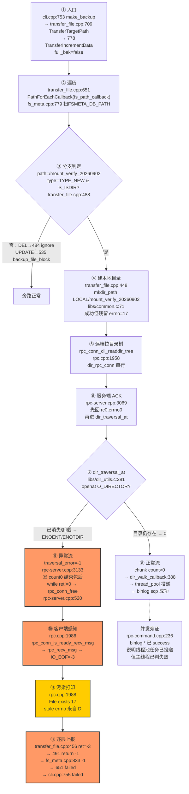
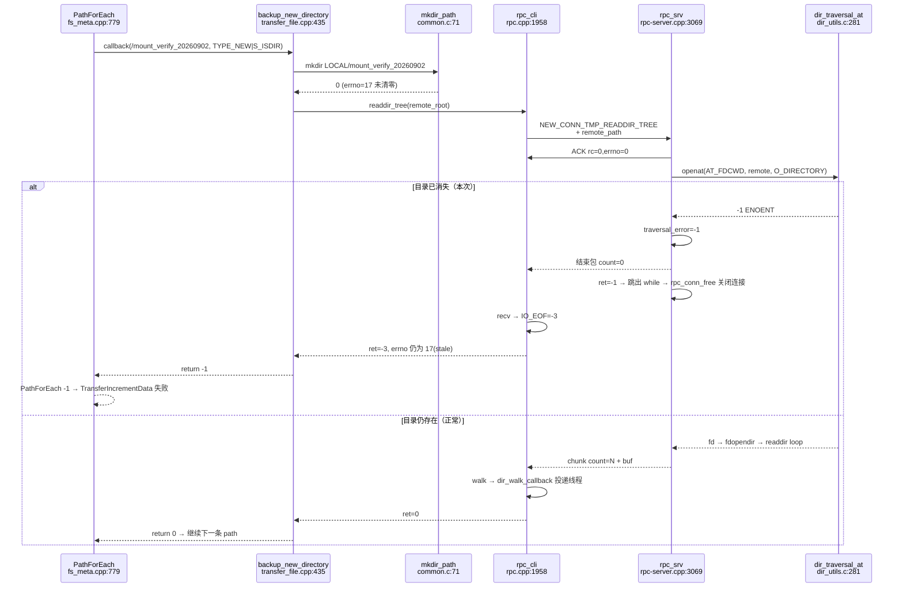
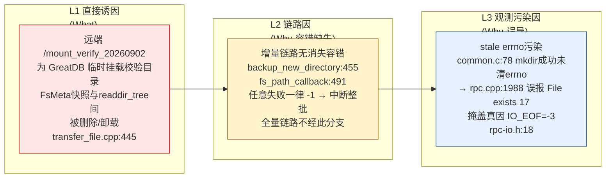
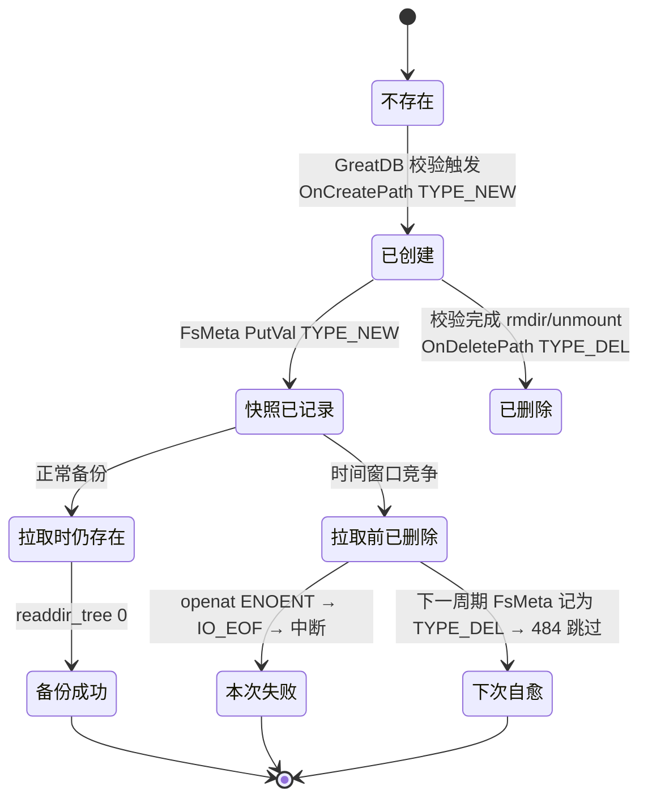
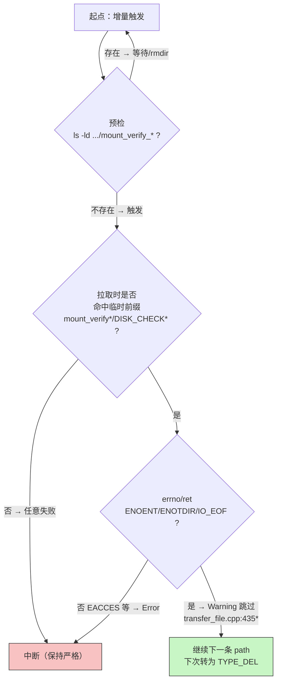

# 增量备份 mount_verify 临时目录失败 — 详细根因逻辑图（T0541 增补）

> 本文为 `root-cause-analysis.md` 的可视化增补，不修改任何业务代码。所有节点带 `file:line`，可与日志交叉复核。

---

## 0. 日志快照（锚点）

```
fs-backup/fsclient/transfer_file.cpp:445 backup_new_directory: /mount_verify_20260902 (remote: /var/lib/greatdb-cluster/datanode1/mount_verify_20260902)
rpc/rpc.cpp:1988 rpc_conn_cli_readdir_tree| recv response failure. File exists(errno: 17)
fs-backup/fsclient/transfer_file.cpp:456 backup_new_directory: readdir_tree ... failed, ret=-3
fs-backup/fsclient/transfer_file.cpp:491 fs_path_callback| backup_new_directory /mount_verify_20260902 failed
fs-backup/public/fs_meta.cpp:833 PathForEachCallback failed
fs-backup/fsclient/cli.cpp:755 make_backup| transfer target path failed
```

> 关键：`ret=-3` 即 `rpc/rpc-io.h:18` `IO_EOF=0xfffffffd`，`File exists(17)` 为 `libs/common.c:78` 残留的 stale `errno`。

---

## 1. 端到端传播逻辑图（Evidence Chain）



**读图要点**
- 真信号是 `J: IO_EOF=-3`，不是 `K: EEXIST`。
- 全量备份（`TransferTargetPath:732 full_bak=true → rpc_download_file`）不经 `PathForEachCallback`，故不受影响。

---

## 2. 时序图（协议级真相）



**协议细节**
- 服务端总是先回 `ACK`，失败靠“后续关闭连接”隐式传递，客户端只能以 `IO_EOF` 感知，无显式 `rc`。
- `rpc.cpp:1988` 与 `rpc.cpp:2024` 两处 `recv` 均可能得 `IO_EOF`，均需以 `ret==-3` 判别。

---

## 3. 三级根因分层（鱼骨/5Why）



| 级别 | 5Why 追问 | 答案 | 证据 |
|------|-----------|------|------|
| L1-W1 | 为何 `mount_verify_20260902` 会出现？ | GreatDB 集群按日期生成的临时校验目录，与 `DISK_CHECK*` 同属短命路径 | 日志 `20260902` 后缀 + `DISK_CHECK* is del` 旁路 |
| L1-W2 | 为何快照有、拉取时无？ | `FsMeta` 记录的是上一快照到当前的增量，`TYPE_NEW` 表示期间新建，拉取前已被清理 | `fs_meta.cpp:374 TYPE_NEW` + `dir_traversal_at:openat` 时序差 |
| L2-W1 | 为何一个目录失败导致全量失败？ | `backup_new_directory` 与 `fs_path_callback` 无前缀/errno 分级，统一 `-1` 上抛，`PathForEachCallback` 遇非 0 即停 | `transfer_file.cpp:455-458,490` |
| L2-W2 | 为何全量不受影响？ | 全量走 `rpc_download_file` 批量下载，不经 `PathForEach` | `TransferTargetPath:732` 分支 |
| L3-W1 | 为何日志显示 `File exists`？ | `mkdir_path:78` `mkdirat==0||errno==EEXIST→return 0` 未清 `errno` | `common.c:78-80` |
| L3-W2 | 真实错误是什么？ | `ret=-3` 即 `IO_EOF=0xfffffffd`，由服务端关闭连接触发 | `rpc-io.h:18` + `rpc-server.cpp:520` |

**排除项**
- 非服务端 `mkdir` 冲突；非 `DISK_CHECK*` 未过滤（已为 `TYPE_DEL` 正确跳过）。

---

## 4. 状态机（临时目录生命周期 vs 备份窗口）



> 结论：空/已消失的临时目录本应“下次自愈”，但本次因无容错被放大为“本次失败”。

---

## 5. 处置逻辑分叉（与代码无关，纯建议归档）



> `*` 为长期修复建议接缝，仅归档不落地；短期按左侧 `P` 即可不改代码规避。

---

## 6. 验证索引（读图者可复跑）

```bash
grep -n "backup_new_directory\|PathForEachCallback\|TransferIncrementData" fs-backup/fsclient/transfer_file.cpp
grep -n "rpc_conn_cli_readdir_tree" rpc/rpc.cpp
grep -n "dir_traversal_at\|rpc_conn_srv_readdir_tree" rpc/rpc-server.cpp libs/dir_utils.c
grep -n "mkdir_path" libs/common.c
grep -n "IO_EOF" rpc/rpc-io.h
grep "mount_verify\|DISK_CHECK\|File exists.*17\|ret=-3\|PathForEachCallback failed" <log>
```

---

## 7. 一句话结论

`EEXIST(17)` 为 `mkdir_path` 残留的**噪音**，`IO_EOF(-3)` 为服务端 `openat ENOENT → 关闭连接` 的**信号**；链路对“新建目录在拉取时消失”未做 `前缀+ENOENT/IO_EOF → 跳过` 分级是主因，短期预检/错峰/重跑即可不改代码自愈，长期按 §5 接缝发版可彻底容错。

**归档**：`records/T0541-.../evidence/root-cause-analysis.md`（主报告） + 本文 `root-cause-logic-diagram.md`（可视化增补），均属 `T0541 archive` 纯分析交付。
