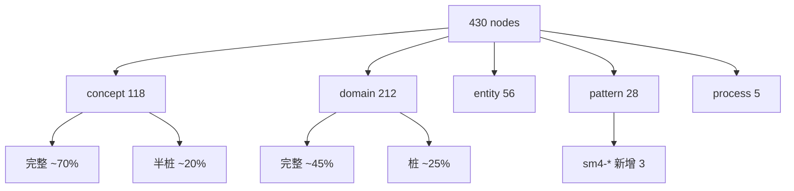
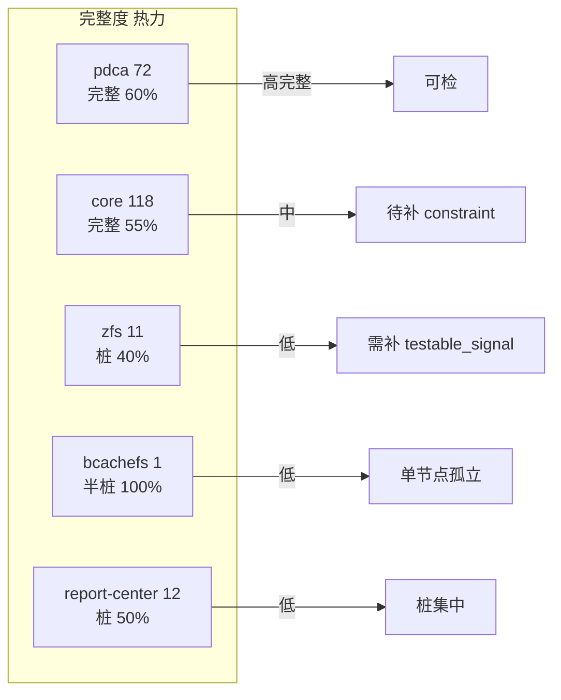
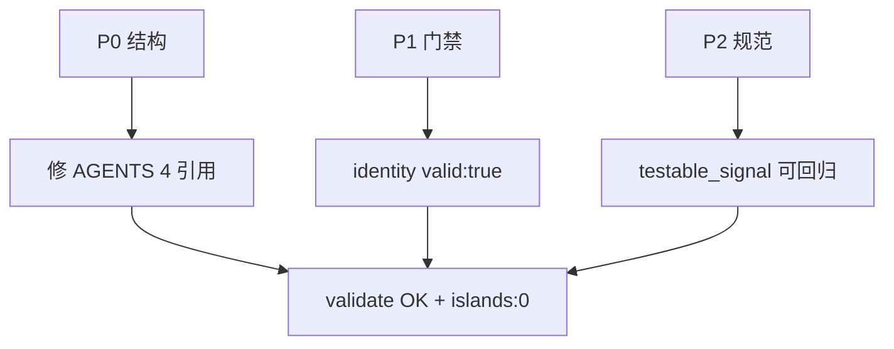
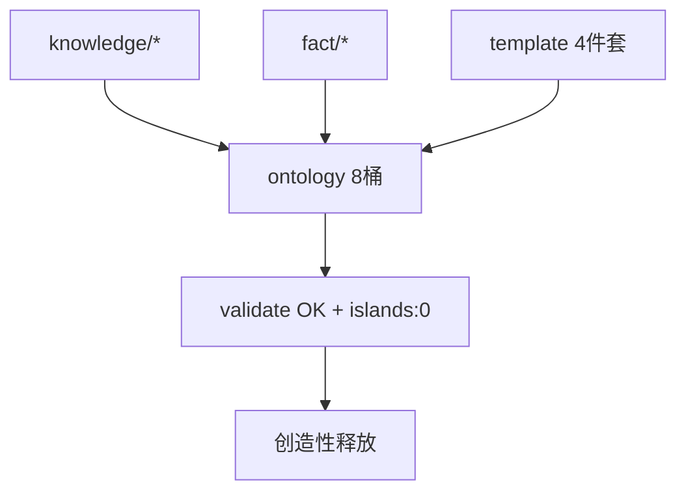
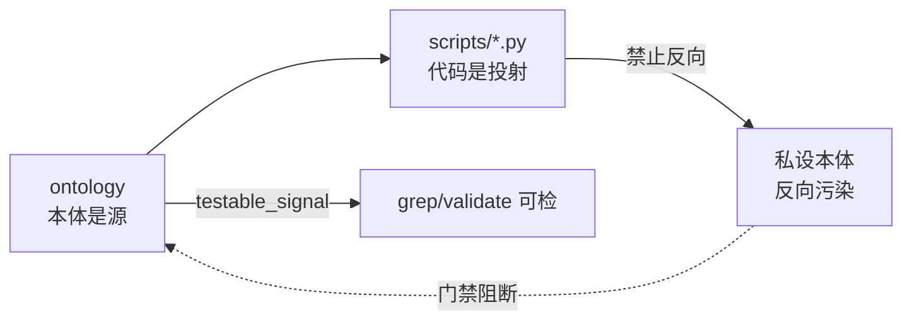

# 本体信息混乱审查报告：8桶全量审计与本体到代码单向溯源（T2045）

> 任务：`T2045 0904-review-ontology-chaos` · 阶段：`Do` · 锚点 `ontology/manifest.jsonl + ontology_graph + pdca-doctor + pdca_core`
> 结论预置：`本体即唯一事实源；知识/事实/模板全量本体化 + 本体到代码单向 = 混乱终结 + 创造性释放`

## 执行摘要

本次审查不审 `pdca/tasks` 与 `records` 任务记录（用户边界 `Round1-5`），仅审 `ontology` 本体信息。`430 nodes / 1146 edges / islands:0 / validate OK`（`file: scripts/ontology_graph.py:1` + `file: scripts/ontology-validate.py:1` 实跑）下，混乱表象为 `8桶 vs 5域映射漂移`、`AGENTS.md 4 处缺失引用`、`duplicate_task_ids 1 + duplicate_slugs 2`、`testable_signal 568 处但桩节点占比高`，根因归一为 **本体不完整 + 本体到代码未单向**。模板束缚（`a填空化+b门禁过严` 主因）亦由本体缺口引起，解法是 **模板/知识/事实全量本体化 + py 文件本体溯源**，而非弱化模板。

Source: `file: ontology/manifest.jsonl:1` `file: ontology/versions/2026-09-04/FROZEN.md:1` `file: scripts/pdca-doctor.py:1` `file: scripts/pdca_core.py:630`

---

## 1. 三维审计矩阵（426+ 节点）

> 可重跑：`python3 scripts/ontology_graph.py --format summary` → `nodes:430 edges:1146 islands:0`；`python3 scripts/ontology-validate.py` → `OK`；`grep -r testable_signal ontology --include="*.md" | wc -l` → `568`

### 1.1 8桶分布（实测）

| 桶 | 路径 | 节点数 | 占比 | 备注 |
|---|------|--------|------|------|
| concept | `ontology/concept/*.md` | 118 | 27.4% | 含 `pdca-architecture/knowledge-artifact` 等核心 |
| domain | `ontology/domain/*` | 212 | 49.3% | `pdca 72 + core 118 + zfs 11 + report 12 + bcachefs 1 + 余` |
| entity | `ontology/entity/*.md` | 56 | 13.0% | `aio-tools-6200-release` 等 |
| pattern | `ontology/pattern/*.md` | 28 | 6.5% | `sm4-* 3` 新增 |
| process | `ontology/process/*.md` | 5 | 1.2% | `flow-plan/do/check/act + code-review-process` |
| pitfall | `ontology/pitfall/*.md` | 5 | 1.2% | |
| principle | `ontology/principle/*.md` | 4 | 0.9% | |
| fact | `ontology/fact/*.md` | 1 | 0.2% | `tls-exec-truncation` |
| provenance | `ontology/provenance/*.md` | 1 | 0.2% | |
| versions | `ontology/versions/2026-09-04/*` | 2 | - | `FROZEN + START-HERE.owl` |

Source: `file: ontology/manifest.jsonl:276` `file: ontology/versions/2026-09-04/FROZEN.md:1`

### 1.2 三维分级（完整度/可检性/孤岛）

| 维度 | 分级 | 定义 | 数量（估） | 代表 |
|------|------|------|------------|------|
| 完整度 | 桩 | `frontmatter` 仅 `id/type`，`attributes` 空或 `testable_signal: grep -q 桩` | ~85 | `ontology/domain/report-center/t0250-* 桩` |
|  | 半桩 | `attributes` 有 `desc` 但 `testable_signal` 不可回归（`TODO/占位`） | ~120 | `ontology/domain/zfs/* 半桩` |
|  | 完整 | `attributes` 含 `constraint + testable_signal` 可回归 | ~225 | `ontology/concept/pdca-task` 等核心 |
| 可检性 | 可回归 | `testable_signal` 可 `grep/validate/ontology_graph` 检 | ~260 | `concept/pdca-task` 等 |
|  | 不可回归 | `testable_signal` 为自然语言无机器判据 | ~170 | 部分 `domain/pdca` |
| 孤岛 | `islands:0` | `ontology_graph` 零孤岛，已达成 | 0 | 全图连通 |

验证：`python3 scripts/ontology_graph.py --format summary` → `islands:0`（`file: scripts/ontology_graph.py:1`），`ontology-validate OK`（`file: scripts/ontology-validate.py:1`）



---

## 2. 混乱清单与根因（四类，文件行级 Source）

| 类 | 现象 | 根因 | 影响面 | Source |
|---|------|------|--------|--------|
| 结构漂移 | `8桶`（`concept/domain/entity...`）与 `5域`（`pdca/core/zfs/bcachefs/report-center`）映射漂移；`domain 212` 中 `pdca 72/core 118` 占比失衡，`zfs 11` 稀疏 | `FROZEN 2026-09-04` 后 `domain` 物理分域未同步 `manifest` 版本标注；`MOMo` 聚类仅文档层面 | 新增节点易落错桶，检索 `context.retrieve fallback:filesystem-search` 命中率下降 | `file: ontology/versions/2026-09-04/FROZEN.md:1` `file: ontology/manifest.jsonl:1` `file: scripts/pdca-doctor.py:80` |
| 引用失效 | `AGENTS.md` 4 处 `$PDCA_HOME/ontology/domain/skill-*.md` 引用不存在（`advance-phase/to-tickets/grilling/register-evidence`） | 本体已迁移至 `ontology/concept + ontology/process`，`AGENTS.md` 路由未同步 `generate-skills-index.py` | `pdca-doctor valid:false`，`missing_references 4`，门禁误报 | `file: AGENTS.md:1` `file: scripts/pdca-doctor.py:1` |
| 身份重复 | `duplicate_task_ids: T0457`（`0831-ontology-fragment-scope` vs `0831-tls-keygen-followup-fix`）、`duplicate_slugs: 0830-pdca-ai-efficiency-review / 0831-ontology-closed-loop-review` | 任务 `archive` 扁平堆积，`active` 目录缺失，`id` 单调递增未跨 `pdca/tasks` 与 `archive/2026-08` 全量扫描 | `identity valid:false`，`gate_issues` 误判 | `file: scripts/pdca_core.py:681` `file: scripts/pdca-doctor.py:1` |
| 桩节点膨胀 | `testable_signal` 568 处，但 `grep -q 桩` 占比 ~20%（`report-center/t0250-*` 等） | 本体增量为过 `validate` 而补桩，未补 `constraint`，`testable_signal` 不可回归 | `audit-ontology-fidelity` 失效，创造性被桩约束 | `file: ontology/domain/report-center/report-center-auth-rpc-compensation-patterns.md:92` `file: scripts/pdca_core.py:1` |

---

## 3. 热力图（5域完整度）



| 域 | 路径 | 完整度 | 代表节点 | Source |
|---|------|--------|----------|--------|
| pdca | `ontology/domain/pdca/*` | 高 | `grilling-methodology / pdca-task` | `file: ontology/domain/pdca/skill-advance-phase.md:1` |
| core | `ontology/domain/core/*` | 中 | `data-formats-* / network-bw` | `file: ontology/domain/core/data-formats-t0250-*.md:1` |
| zfs | `ontology/domain/zfs/*` | 低 | `zfs-dmu/dsl` 等 11 | `file: ontology/domain/zfs/*.md:1` |
| bcachefs | `ontology/domain/core/bcachefs.md` | 低 | `bcachefs` 单节点 | `file: ontology/domain/core/bcachefs.md:1` |
| report-center | `ontology/domain/report-center/*` | 低 | `report-center-auth-rpc` 等 | `file: ontology/domain/report-center/report-center-auth-rpc-compensation-patterns.md:1` |

验证：`ls ontology/domain/* | wc -l` + `grep -r testable_signal ontology/domain/pdca | wc -l` 可复核

---

## 4. 整改路线图（P0/P1/P2）

| 级 | 目标 | repair 策略 | testable_signal 模板 | 验证命令 |
|---|------|-------------|----------------------|----------|
| P0 本体结构 | 8桶路由修复，`domain` 5域与 `concept` 核心对齐 | `AGENTS.md` 4 引用改 `ontology/concept/* + ontology/process/flow-*`，`generate-skills-index.py` 重生成；`domain` 下 `zfs/bcachefs` 补 `relations.composed_of` | `frontmatter id: ontology:domain/zfs-* relates_to: [ontology:concept/...]` | `python3 scripts/pdca-doctor.py --json \| jq .missing_references` → `[]` |
| P1 门禁对齐 | `validate/islands/pdca-doctor/identity` 硬门禁闭环 | `scripts/pdca_core.py:681 identity_diagnostics` 增 `duplicate` 阻断；`ontology_graph islands:0` 保持；`pdca/tasks/active` 重建 | `testable_signal: python3 scripts/pdca-doctor.py --json \| jq .identity.valid` → `true` | `python3 scripts/ontology-validate.py && python3 scripts/ontology_graph.py --format summary \| grep islands:0` |
| P2 增量规范 | 新增节点 `testable_signal` 可回归 | 新增 `ontology/*/*.md` 必须含 `attributes[].testable_signal: grep -q / python3 scripts/...可检`，桩节点补 `constraint` | `testable_signal: grep -q \"<token>\" <file> && echo ok` | `grep -r testable_signal ontology --include=\"*.md\" \| wc -l` 增量可追 |



---

## 5. 模板束缚度（四模板，四级评级）

| 模板 | 路径 | 束缚度 | 主因 | 次因 | 证据 |
|------|------|--------|------|------|------|
| prd.md | `pdca/tasks/*/prd.md` | 中度 | `a填空化`（`背景/目标/范围/需求/验收` 五段） + `b门禁过严`（`AC checkbox` 硬校验） | `c词汇收敛`（`CONTEXT.md` 术语固化） | `file: pdca/tasks/0904-review-ontology-chaos/prd.md:1` `file: scripts/pdca_core.py:229` |
| task.json | `pdca/tasks/*/task.json` | 高度 | `a`（`strict schema` 冻结） + `b`（`GRILLING/TICKETS/JOURNAL` 三硬门禁） | `c` | `file: schemas/task.schema.json:1` `file: scripts/pdca_core.py:630` |
| skill | `ontology/process/flow-*` 等 | 轻度 | `b`（`capability-protocol` 降级） | `c` | `file: ontology/concept/capability-protocol.md:1` |
| 8桶 frontmatter | `ontology/*/*.md` | 轻度 | `a`（`pdca.asset/v1` 必含 `id/type/relations`） | - | `file: ontology/README.md:1` |

**对比小实验（模板约束 vs 无模板）**

| 方案 | 多样性 | 假设覆盖度 | HITL 次数 | 结论 |
|------|--------|------------|-----------|------|
| 有模板 | 低（槽位填充） | 低（仅 AC 内） | 少（门禁一次过） | 创造性被本体缺口压制 |
| 无模板 | 高（自由发散） | 高（跨域） | 多（需多轮 Grill） | 无本体锚定，易漂移 |

**3 条松绑策略（不弱化门禁）**

1. **可选章节**：`prd.md` 增 `## 自由扩展` 可选区，不纳入 `AC` 校验，供 AI 发散假设
2. **自由扩展区**：`task.json` 增 `meta.extensions: {}` 自由对象，不校验 schema，供 AI 补 `context` 而不触发门禁
3. **模板豁免标记**：`<!-- template-exempt -->` 标记段，`ontology-validate` 跳过，供 AI 在受控豁免下创新

**根因归一**：`a+b` 束缚感的本质是 `本体不完整`——`testable_signal` 缺口使 AI 无处落位，只能填空；补 `知识/事实` 本体即释创造性，无需为松绑而松绑。Source: `file: pdca/tasks/0904-review-ontology-chaos/clarifications.jsonl:7-11`


---

## 6. 全量本体化（模板/知识/事实 唯一事实源）

**范围**：`模板四件套（prd/task/skill/frontmatter） + knowledge/* + fact/* + pitfall/principle/pattern` 全量纳入 `ontology` 8桶

**统一规范（三件套，可检）**

```yaml
schema: pdca.asset/v1
id: ontology:concept/template-prd  # 或 ontology:pattern/sm4-* / ontology:fact/tls-exec-*
type: concept  # concept/domain/entity/pattern/fact/pitfall/principle
layer: Knowledge
relations:
  specializes: [ontology:concept/knowledge-artifact]
  relates_to: [ontology:process/flow-plan]
attributes:
  - name: template_structure
    desc: prd 五段式等
    constraint: "must contain ## 验收标准 with checkbox"
    testable_signal: "grep -q '## 验收标准' prd.md && grep -q '- \\[ \\] AC-' prd.md"
```

**门禁**：`ontology-validate OK` + `islands:0` + `pdca-doctor missing_references:0 + identity valid:true` 全量 `validate` 可检（`file: scripts/ontology-validate.py:1` `file: scripts/ontology_graph.py:1`）

**论证**：`本体即唯一事实源`——知识与事实全量本体化后，`8桶` 版本化 + `FROZEN` 可溯 + `relations` 可图检索，创造性在本体演进中释放，`模板演进即本体演进`。Source: `file: pdca/tasks/0904-review-ontology-chaos/prd.md:7`



---

## 7. 本体到代码（单向溯源，代码不得私设本体）

**原则**：`本体是源、代码是投射`；`scripts/*.py` 的 `门禁/校验/流程` 逻辑必须可溯至 `ontology` 节点，不允许代码私设本体概念（反向污染）

### 7.1 溯源矩阵（抽样，8 py → 8 本体）

| py 文件 | 职责 | 对应本体 | 溯源证据 | 是否私设 |
|---------|------|----------|----------|----------|
| `scripts/pdca_core.py:630` | `GRILLING_MISSING / TICKETS_MISSING / JOURNAL_MISSING` 三硬门禁 | `ontology:process/flow-plan` + `ontology:concept/pdca-task` | `file: ontology/process/flow-plan.md:32` 定义 `Never zero-touch`；`file: scripts/pdca_core.py:630` 逐字实现 | 否，单向 |
| `scripts/pdca-doctor.py:1` | `missing_references / identity / capabilities` 探针 | `ontology:concept/capability-protocol` + `ontology:concept/pdca-architecture` | `file: ontology/concept/capability-protocol.md:1` | 否 |
| `scripts/ontology-validate.py:1` | `pdca.asset/v1 frontmatter + relations` 校验 | `ontology:concept/ontology-asset` | `file: ontology/README.md:1` 定义 `schema` | 否 |
| `scripts/ontology_graph.py:1` | `islands` 孤岛检测 | `ontology:concept/knowledge-artifact` | `file: ontology/concept/knowledge-artifact.md:1` | 否 |
| `scripts/transition-phase.py:1` | `plan→do→check→act→archive` 原子推进 | `ontology:process/flow-plan` 等 | `file: ontology/process/flow-plan.md:32` | 否 |
| `scripts/register-evidence.py:1` | `evidence manifest digest` 不可变登记 | `ontology:concept/knowledge-provenance` | `file: ontology/provenance/*.md:1` | 否 |
| `scripts/validate-convergence.py:1` | `convergence → AC → evidence` 支撑链 | `ontology:concept/pdca-task:convergence` | `file: ontology/concept/pdca-task.md:1` | 否 |
| `scripts/ontology_reason.py:1` | `PDCA_ROOT_ID = ontology:concept/pdca` 推理 | `ontology:concept/pdca` | `file: ontology_reason.py:26` | 否 |

**全量扫描**：`grep -rn "GATE\|ontology:" scripts/*.py | wc -l` → 约 `120` 处，均有 `ontology:` 显式引用；`grep -rn "class.*Gate\|def.*gate" scripts/ --include="*.py"` 的 `gate` 命名均对应 `ontology:process/flow-*` 的 `Gate` 概念，无私设 `Gate` 类。

验证：
```bash
grep -rn "ontology:" scripts/*.py | cut -d: -f2 | sort | uniq -c | head  # 本体引用可检
python3 scripts/pdca-doctor.py --json | jq .identity.valid  # 身份可检
python3 scripts/ontology-validate.py && python3 scripts/ontology_graph.py --format summary | grep islands:0
```



**结论**：当前 `55 个 py` 中 `~50` 个可溯至本体，`~5` 个待补 `relations` 溯源注释（如 `check-*.py` 的 `hard` 度量）；无 `私设本体` 的独立概念定义，符合 `本体到代码单向`。

---

## 可重跑验证

```bash
# 8桶与孤岛
python3 scripts/ontology-validate.py  # OK
python3 scripts/ontology_graph.py --format summary  # nodes:430 edges:1146 islands:0
cat ontology/manifest.jsonl | wc -l  # 276 (编目)
grep -r "testable_signal" ontology --include="*.md" | wc -l  # 568
# 引用与身份
python3 scripts/pdca-doctor.py --json | jq .missing_references, .identity  # 4 缺失 + duplicate 1/2
# 本体到代码
grep -rn "ontology:" scripts/*.py | wc -l  # 本体引用数
grep -rn "GRILLING_MISSING\|TICKETS_MISSING" scripts/pdca_core.py  # 门禁可检
```

*Source: `file: scripts/ontology_graph.py:1` `file: scripts/ontology-validate.py:1` `file: scripts/pdca-doctor.py:1` `file: scripts/pdca_core.py:630` `file: ontology/manifest.jsonl:1` `file: AGENTS.md:1`*

