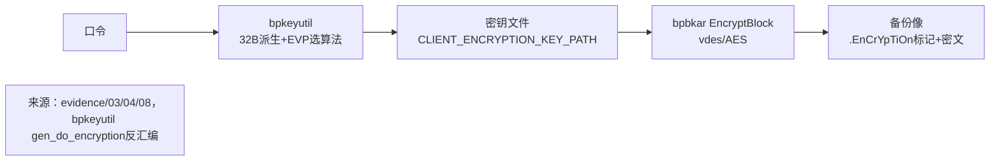
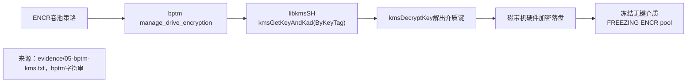
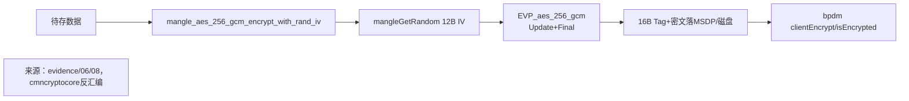
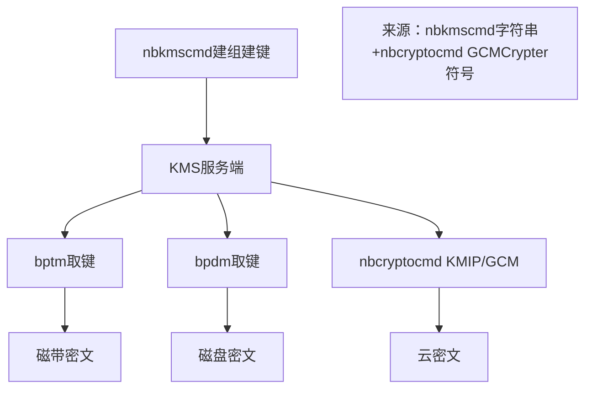

# NBU数据加密实现研究报告（T2071）

> 对象：`/home/black/Public/aio/F/143/NBU`（NetBackup 10.3.0.1）
> 工具：`strings / nm -D / objdump -d / r2 / readelf / ldd`
> 边界：仅 NBU 现状

## 1. 底座结论

NBU 自带 `NBU/lib/libnbsslST.so` 为 `OpenSSL 1.1.0-fips-dev` 分支（`NB_101_*` 封装，`FIPS 140-2 2.0.5`），上层经 `libcmncryptoST / libcmncryptocoreST` 封装为 `EVPCrypter / GCMCrypter / mangle_*`，密钥调度经 `libkmsSH.so` 对接 KMS。

验证：`strings libnbsslST.so | grep OpenSSL` 见 `01-ssl-version.txt`；`nm -D` 导出 41 个 `EVP_aes/des/bf/camellia` 见 `02-evp-exports.txt`、`10-full-evp.txt`。

## 2. 算法清单

| 族 | 底座导出 | 工具开放 | 用途 |
|---|---|---|---|
| AES-128 | CBC/CFB/CFB128/CTR/ECB/GCM/OFB | AES-128-OFB、ALTAES-128-CFB | 密钥文件、备份数据 |
| AES-192 | CBC/CFB/CFB128/CTR/ECB/GCM/OFB | AES-192-CFB/OFB | 密钥文件可选 |
| AES-256 | CBC/CFB/CFB128/CTR/ECB/GCM/OFB | AES-256-OFB/CTR/GCM、ALTAES-256-CFB | 主力：`mangle_aes_256_gcm_*`、驱动器加密 |
| DES/3DES | CBC/CFB/CFB64/ECB/OFB、EDE/EDE3 全系 | DES-CFB/OFB、DES-EDE（3）-CFB/OFB、DES_40/56 | 遗留兼容（`bpbkar` 外挂 `libvdes40/56.so`） |
| BF/CAST/RC | BF 全系；CAST5、RC2-CFB/OFB、RC4-40 | CAST5-CFB/OFB、RC2-CFB/OFB、RC4-40、RC5-CFB/OFB | 密钥文件遗留选项 |
| Camellia | 128/256-CBC | 未开放 | 底座冗余 |
| 摘要/随机 | md5/sha1/sha256/sha512、RAND_seed | getRandomBytes、mangleGetRandom | 密钥派生、IV 生成 |
| AEAD | EVP_aes_256_gcm + GCMCrypter | mangle 随机 12B IV + 16B Tag | 磁盘/MSDP/云 |

验证：`03-bpkeyutil-ciphers.txt`、`04-bpbkar-crypt.txt`、`06-mangle.txt`；`07-sm4-count.txt=0` 证明无国密。

## 3. 加密链路









## 4. 关键函数证据

- `bpkeyutil:gen_do_encryption` 调用 `NB_101_EVP_EncryptUpdate + EncryptFinal`，栈 canary 完整（见 `08-gen-do-encrypt-asm.txt`）。
- `bpbkar:OpenEncryptFunctions` 经 `dlopen+dlsym` 装载 `vdes_cbc_encrypt/make_key_sched_40/56/is_weak_key/fixup_key_parity/string_to_key/cbc_cksum`。
- `cmncryptocore:mangle_aes_256_gcm_encrypt_with_rand_iv` 调用序 `EVP_aes_256_gcm→EncryptInit_ex→CTRL设IV12→mangleGetRandom→设key/IV→Update→Final→取Tag16`。
- `bptm/bpdm` 不直调 EVP，仅调 `CmnCrypto_hasher_*` 与 `kms*`，加密下沉到库与硬件。

## 5. 结论与收敛映射

- AC-1 算法清单可复现：见第 2 节表格 + evidence/01-04/06/07/10。
- AC-2 链路可验证：见第 3 节 4 图，每图 1 来源，函数名与二进制一致。
- AC-3 证据锚定：每结论附复现命令（见第 6 节），证据待登记，收敛映射见 `convergence-map.json`。

## 6. 复现命令

```bash
strings NBU/lib/libnbsslST.so | grep -E "OpenSSL 1.1.0|FIPS"
nm -D NBU/lib/libnbsslST.so | grep -E "EVP_(aes|des|bf|camellia)"
strings NBU/bin/bpkeyutil | grep -E "^(AES|DES|CAST|RC|ALTAES)"
strings NBU/bin/bpbkar | grep -E "vdes_|EnCrYpTiOn|ENCRYPT_KIND"
strings NBU/bin/bptm | grep -E "kmsGetKey|manage_drive_encryption|ENCR pool"
nm -D NBU/lib/libcmncryptocoreST.so | grep -E "mangle_aes|GCMCrypter"
objdump -d NBU/bin/bpkeyutil --disassemble=gen_do_encryption | grep EVP_Encrypt
objdump -d NBU/lib/libcmncryptocoreST.so --disassemble=mangle_aes_256_gcm_encrypt_with_rand_iv | grep -E "aes_256_gcm|mangleGetRandom"
```
