# 存储国密加密技术方案

> **文档性质**：汇报决策型 | **依据来源**：项目下四个源文件综合编写
>
> - `国密SM4全流程数据加密方案调研.md`——算法选型、性能基准、ZFS/S3/NFS 技术路径（本文全部性能数字与算法结论的来源）
> - `备份传输存储加密.md`——备份体系全链路现状、各类介质落盘方式、还原路径（本文全部备份流时序与接入图的来源）
> - `备份传输存储国密SM4全流程加密方案.md`——面向决策层的存储加密图集与实施建议
> - `NBU数据加密算法使用总结.md`——NBU 逆向实测（AES-256-GCM 主力、KMS 管钥、无国密），参考产品对照与“存储侧承担国密、NBU 零改造”衔接结论的来源
>
> **方案边界**：本方案仅覆盖**存储落盘加密（静态数据）**，不含传输链路改造。传输层国密（RPC-TLS、国密套件协商等）见《备份传输存储加密》。
>
> **显式非目标（non-goals）**：不改造上层应用（数据库、备份工具、业务系统）；不对存量 CBC 链做全量重写转模式；不在 S3/NFS 服务端存放密钥；不承诺纯软件 SM4 上生产（必须 SM4 指令，见 2.2）；不覆盖传输链路国密；**不含容量规划**——S3 对象规模、ZFS 池水位等容量事项由存储容量专项承担，与本加密机制无关（见 3.8）。

# 一、背景与目标

依据关键信息基础设施密码应用合规要求，所有存储介质中的数据（含主存储与备份存储）须采用国密算法加密。本方案围绕 **SM4 分组对称密码算法**，按**三种存储类型**组织：

- **ZFS（内核级透明加密，核心底座）**——含四种形态：Worker 侧本地 ZFS 卷、远端 ZFS 容灾卷、**ZFS 模拟出的 OSS**（OB 备份到 OSS，后端 ZFS 承载）、**ZFS 模拟出的 NFS**（OB 备份到 NFS，OB 本机挂载，后端 ZFS 承载）
- **S3 对象存储（外部存储资源）**（写模式只由 `--gmssl` 配置控制，未指定默认明文，服务端只存密文）
- **NFS 文件存储（外部存储资源）**（原生 NFS 服务端不可改，客户端先加密后写入，恢复时解密写回）

**核心目标**：在不改变上层应用（数据库、备份工具、业务系统）的前提下，实现数据落盘即密文，确保静态数据安全合规；还原时自动解密，对使用者透明。

### 需求差异表（ZFS / S3 / NFS 为何三种写法）

三类划分的根因是**约束与部署形态不同**，不是规模不同：

| 存储类型 | 数据规模与形态 | 决定性约束（根因） | 部署形态 | 加密责任点 |
| --- | --- | --- | --- | --- |
| ZFS（含模拟 OSS/NFS） | 全量备份主链路，高频核心业务 | 内核与后端 ZFS 均可控，可一次改造长期复用 | Worker 侧本地卷 / 远端容灾卷 / OSS-NFS 接入壳 | 内核透明加密，上层零改造 |
| S3 对象存储 | 快照流对象序列，存量已有 CBC 对象 | 外部存储资源，服务端不可信但可用；写模式由配置显式控制 | 外部桶，s3file 写、s3mount 读 | 写端按 `--gmssl` 配置加密，服务端只存密文 |
| NFS 文件存储 | 低频冷数据归档 | 原生 NFS 服务端不可更改、不可装软件 | 外部 NFS 服务，Worker 侧挂载读写 | 客户端先加密后写入，恢复作业解密写回 |

### 参考产品架构对比与不照抄说明

核心参考对象是 **NBU 数据加密实现**（依据 `NBU数据加密算法使用总结.md`，`NBU/bin/`、`NBU/lib/` 二进制逆向实测，`OpenSSL 1.1.0-fips-dev` + `NB_101_*` 封装）：

| NBU 做法（实测） | 本方案借鉴 | 不照抄的坑 |
| --- | --- | --- |
| 磁盘/MSDP 主力 `AES-256-GCM`：`mangle_aes_256_gcm_encrypt_with_rand_iv` 每次调用独立随机 12B IV + 16B Tag，多块多组 `(IV,Tag)` 落盘 | S3 新链 SM4-GCM 每对象随机 `sm4-nonce`（12B），一对象一随机数，思路同源 | NBU 是 AES，本方案是 SM4；算法不同，随机数做法可学，算法实现不可搬 |
| 备份像内嵌 `.EnCrYpTiOn_CiPhEr` 标记 + 密文，版本/算法标识随数据走 | S3 对象元数据 `gmssl`（0/1/2）+ `sm4-nonce` 随对象走，读端按标识自适应，思路同源 | NBU 标记内嵌像内，本方案 S3 用对象元数据、ZFS 用数据集属性，各按介质选承载，不硬套 |
| 服务端 KMS 按密钥组管理，`bptm` 按 `kmsKeyTag/KAD` 取键，`ENCR` 卷池无钥冻结介质；客户端密钥文件口令派生、`bpkeyutil -ct` 选算法 | 密钥与密文分离、收发同钥、密钥备份与密文分离存放、轮换按卷/桶粒度（见四） | NBU 底座是封闭 `NB_101_*`，动不了也不动；本方案密钥体系建在存储侧（ZFS keyformat / S3 收发 DEK），与 NBU 零耦合 |
| 遗留兼容：`bpbkar` 保留 DES 40/56 路径只读旧备份，新建选不到 CBC（`bpkeyutil` 可选表无 CBC，`mangle` 固定 GCM） | 写模式由配置显式控制、升级顺序门禁（读端先行），策略同源 | NBU 遗留弱算法（`DES_40/56`、`RC4-40`、BF）绝不引入；SM4 S 盒在 NBU 底座中 0 命中、无国密实现，必须外挂 |

衔接结论（引自 NBU 总结第 5 节）：NBU 现状无法直接满足 SM4-GCM 落盘要求，必须外挂——Worker 侧 ZFS 做统一透明底座、S3 新写 GCM、原生 NFS 客户端预加密，NBU 保持国际算法不变，避免改动其 `NB_101` 底座。这正是本方案“存储侧承担国密、NBU 零改造”立场的直接依据。

其他架构对照（次要）：OpenZFS 原生加密仅 AES-CCM/GCM、无 SM4，必须 ICP 新增第 9 号套件，且其 `keylocation=file` 实践有密钥落盘隐患，本方案要求密钥与密文分离；S3 服务端加密（SSE-S3/SSE-KMS 类）由服务端持钥，不符合密钥分离姿态，本方案 S3 侧无密钥；NFSv4 Kerberos 只保传输不保落盘，不能当存储加密用。

以上三源文件加 NBU 总结是方案依据；参考产品仅用于架构对照，决策以合规与约束为准。

### 被否决备选与量化否决理由

| 备选 | 否决理由（量化优先） |
| --- | --- |
| S3 网关统一加密（新增加密网关接管全部 S3/NFS 写） | 新增单点与改链成本：全部备份链路改道网关，网关吞吐成为全局瓶颈；ZFS 主链路本可零改造成本复用内核加密，网关方案反而扩大改动面 |
| 存量全量重写（存量 CBC 链全部重传为 GCM） | 重传成本：存量对象 100% 重读-解密-加密-上传，流量与时间翻倍，且重写窗口内链状态复杂；改用按 `--gmssl` 配置逐步启用 GCM，零强制重传达到合规 |
| ZFS 改用卷级外部加密（如 LUKS 包在 ZFS 之下） | 失去数据集粒度与 `zfs send/recv` 加密集成，还原与容灾流程全部重写；ICP 套件接入一次合入长期复用，改动面更小 |

### 风险假设集中清单

| # | 假设 | 若不成立的影响 | 缓解与门禁 |
| --- | --- | --- | --- |
| R1 | 生产与容灾 CPU 均带 SM4 指令或加速卡 | 纯软 SM4 写损耗约 90%、读约 86%，不可生产（见 2.2） | 上线前验指令，纯软禁入产线；见五、验收标准 |
| R2 | 密钥有异地备份，生产与容灾端同步纳入变更流程 | 丢密钥即丢数据，不可恢复 | 密钥与密文分离存放，轮换按卷/桶粒度另立项；见四 |
| R3 | 读端先行升级到双模式版本，再允许写端产出 GCM | 老版本把 `gmssl=2` 误按 CBC 解密失败；关闭解密的旧挂载点把 GCM 当明文静默透出 | 升级顺序门禁，升级前清理关闭解密的旧挂载点；见 3.2 |
| R4 | ZFS 数据集开启加密不可逆已纳入灰度策略 | 灰度超出内部测试环境则无法原地回退 | 灰度只在内部测试环境，新写承接、读端双读；见 3.5 |
| R5 | S3 外部存储选址同域优先，跨域时密钥不同通道同步 | 跨域存放引入主权合规与密钥同步问题 | 同域优先，跨域方案见 3.2；密钥不随密文出域 |
| R6 | 读端（挂载/恢复作业）与写端持有同一密钥 | 跨端密钥不一致即解密失败 fail-closed | 收发同钥纳入变更与巡检；见 3.7、四 |

---

## 二、算法选型与性能依据

选型结论：**SM4-GCM（AEAD 认证加密）与 SM4-CBC 均支持，写模式不设默认、只由 `--gmssl` 配置控制，未指定默认明文**。存量对象读端按版本自适应解密。SM4 对标 AES-128，安全性满足合规；性能关键不在算法本身，而在有无硬件指令。

### 2.1 算法原始吞吐（同机 OpenSSL 实测，16KB 块）

| 对比项 | 吞吐  | 相对 SM4 | 结论  |
| --- | --- | --- | --- |
| AES-128-GCM + AES-NI 硬件加速 | 4,249 MB/s | 27.4x | 纯软件下 AES 与 SM4 差距仅约 6%，当前 20 倍鸿沟是**硬件指令 vs 纯软件**的差距 |
| AES-128-GCM 纯软件（关 AES-NI） | 165 MB/s | 1.06x | —   |
| **SM4-GCM 纯软件** | **155 MB/s** | **1x** | **生产必须依赖国产 CPU 内置 SM4 指令或加速卡** |

### 2.2 ZFS 端到端影响（fio direct=1 实测）

| 场景  | 硬件加速下表现 | 纯软件 SM4 表现 |
| --- | --- | --- |
| 顺序写（1M） | AES-NI 下损耗约 20%，可接受 | 损耗约 90%（仅 ~31 MiB/s）❌ 不可生产 |
| 顺序读（1M） | 损耗约 1.5%，几乎无感 | 损耗约 86%（仅 ~80 MiB/s）❌ 不可生产 |
| 随机小 IO（4K） | 在噪声范围内 | 写 ~10%、读 ~30%，仍不可忽视 |

> **决策点**：SM4 存储加密能否上生产，取决于 CPU 是否带 SM4 指令，与算法选择无关。

---

## 三、各存储场景方案（三种类型）

### 3.1 ZFS 类型（一次国密改造实现内核透明加密，含模拟 OSS/NFS）

本节描述使 ZFS 支持 SM4 国密的一次性内核改造：ZFS 原生仅支持 AES 系加密，不支持 SM4；改造在 ICP 加密框架中注册 SM4-GCM 为第 9 号密码套件，涉及算法层、注册层、套件层、属性层四处（见下图右侧接入链），一次合入长期复用。改造完成后，新建数据集/卷只需指定 `encryption=sm4-gcm`，读写自动加解密，上层完全无感。本类型下四种形态**共享同一套改造后的内核加密底座**，差异仅在接入方式：

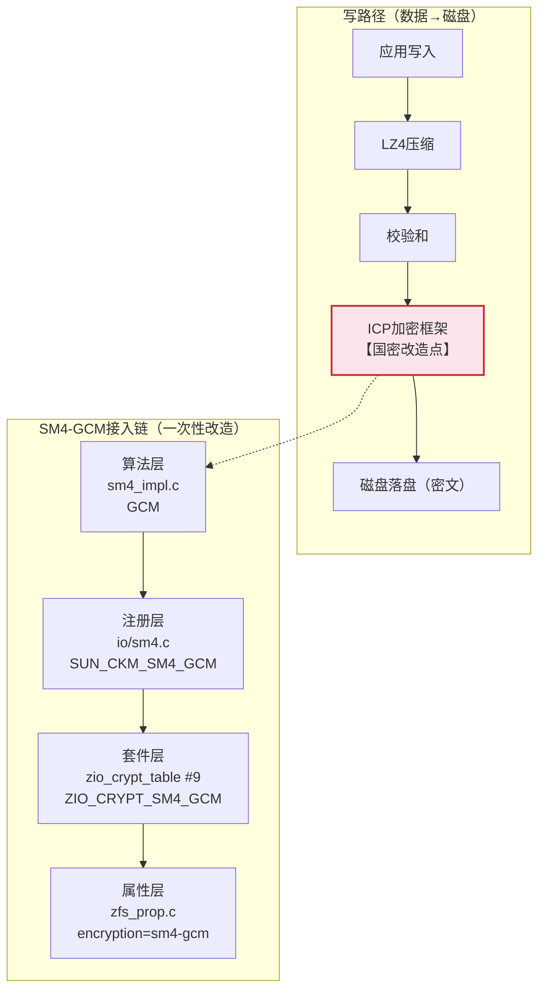

使用方式（SM4 集成后仅算法名不同）：

```bash
# 创建 SM4 加密卷
zfs create -V 10G -o encryption=sm4-gcm -o keyformat=passphrase -o volblocksize=16K pool/vol

# 加载密钥后设备出现，读写自动加解密
zfs load-key pool/vol

# 卸载密钥后设备彻底消失，读写均不可用（防窃取关键行为）
zfs unload-key pool/vol
```

关键行为：`unload-key` 后块设备彻底消失而非只读；`load-key` 后即时恢复，无需重新挂载。fio、数据库等直接操作 `/dev/zvol/` 路径，无需感知加密层。

#### 3.1.1 原生 ZFS（本地卷 + 远端容灾卷）

以下各数据库场景共享同一内核加密底座（写路径见上图），差异仅在备份流如何到达 ZFS；还原统一经 iSCSI 挂载自动解密。

##### PG 系列 → ZFS

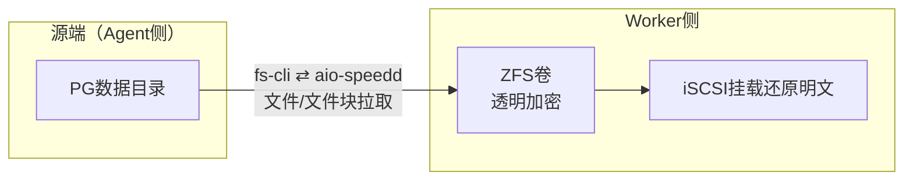

fsdeamon 调度、fs-cli 主动连接数据源 aio-speedd（:6611），明文写入 ZFS 即自动加密。

##### MySQL 系列 → ZFS

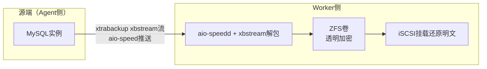

##### 文件系统 → ZFS

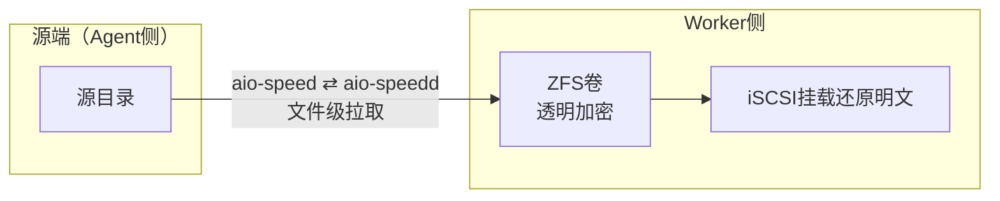

##### Oracle / DM（SBT）→ ZFS

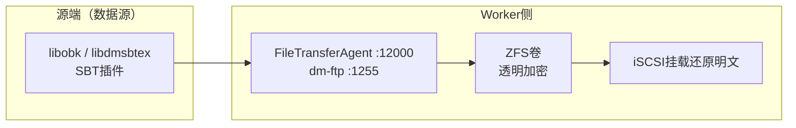

SBT 备份流的存储加密由 ZFS 侧承担，插件侧零改造。

##### GaussDB → ZFS

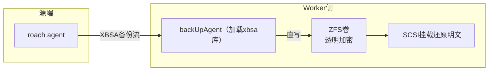

##### 远端容灾卷（ZFS→ZFS）

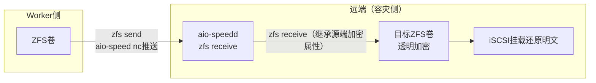

容灾端沿用复制的加密属性：`zfs send | zfs receive` 复制流携带源端加密属性，目标卷继承源端算法与密钥体系，不考虑两端加密不一致场景。

#### 3.1.2 ZFS 模拟 OSS（OB 备份到 OSS）

- **接入**：OB 直连 OSS（HTTP，明文，未启用 TLS，不国密），OSS 后端由 ZFS 承载。
- **加密**：OB 侧零改造，落盘即后端 ZFS 透明加密；恢复时 OB 直连 OSS 拉取，后端透明解密。
- **决策依据**：OB 4.2.1.1 基线无用户可选 SM4 开关，存储国密只能由介质侧（后端 ZFS）承担。

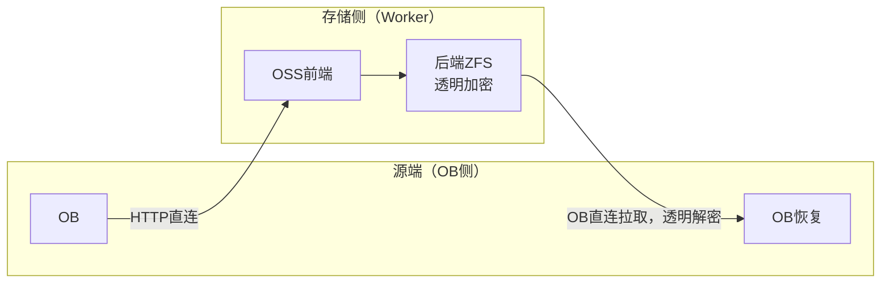

#### 3.1.3 ZFS 模拟 NFS（OB 备份到 NFS）

- **接入**：OB 服务器本机挂载 NFS 目录，备份工具按本地文件写入/读取挂载目录（NFS 协议无原生国密）。
- **加密**：NFS 后端由 ZFS 承载，落盘即后端 ZFS 透明加密；OB 侧零改造，恢复时经 NFS 读取、后端透明解密。
- **与原生 NFS 的区别**：本形态的 NFS 只是 ZFS 的接入壳，加密在后端 ZFS 内核完成；原生 NFS（3.3）后端不可控，必须在客户端先加密（见下）。

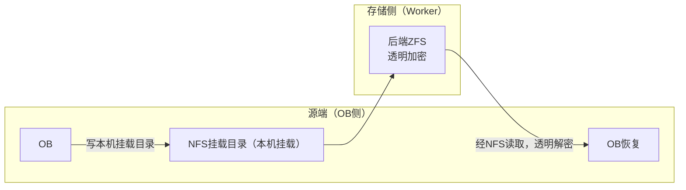

#### 3.1.4 内核改动重叠比对与存量行为影响清单

四层改动与上游 OpenZFS 的重叠关系（只增不改原则）：

| 层 | 改动点 | 与上游重叠比对 |
| --- | --- | --- |
| 算法层 | `sm4_impl.c` 新增 GCM 模式 | 新增文件，不动现有 AES 实现 |
| 注册层 | `io/sm4.c` 注册 `SUN_CKM_SM4_GCM` | 新增注册，不动已有算法注册 |
| 套件层 | `zio_crypt_table` 新增 #9 `ZIO_CRYPT_SM4_GCM` | 只追加表项，不改 0–8 号 AES 系套件行为 |
| 属性层 | `zfs_prop.c` 新增 `encryption=sm4-gcm` 取值 | 只扩展取值枚举，不改属性框架 |

存量行为影响清单：未指定 `encryption` 的数据集行为不变；已用 AES 加密的数据集读写不受影响（套件号不变）；容灾复制继承源端加密属性（见 3.1.1 远端容灾）；`unload-key` 后设备消失行为对新旧算法一致。

#### 3.1.5 实现后形态（ZFS：属性与呈现真实示例）

改造落地后，SM4 数据集的加密形态直接表达在 ZFS 属性上。下为 OpenZFS 官方生态中的真实终端输出（Ars Technica 实测，`aes-256-gcm` 为上游现行默认算法）：

```bash
root@banshee:~# zfs get encryption banshee/encrypted/child1
NAME                      PROPERTY    VALUE        SOURCE
banshee/encrypted/child1  encryption  aes-256-gcm  -

root@banshee:~# zfs get keystatus banshee/encrypted
NAME               PROPERTY   VALUE        SOURCE
banshee/encrypted  keystatus  unavailable  -

root@banshee:~# zfs get keystatus banshee/encrypted/child2
NAME                      PROPERTY   VALUE        SOURCE
banshee/encrypted/child2  keystatus  available    -
```

来源：https://arstechnica.com/gadgets/2021/06/a-quick-start-guide-to-openzfs-native-encryption/ ；`keystatus` 语义另见 Oracle `zfs_encrypt(1M)`（`available/unavailable`，未加密数据集显示空）。

注记：SM4 集成后输出同格式，仅 `encryption` 列显示 `sm4-gcm`（第 9 号套件，见 3.1）。运维/审计认定的 ZFS 加密表达三要素：`encryption` 算法值、`keystatus=available`（密钥已加载）、设备路径存在性。`unload-key` 后密钥状态转 `unavailable` 且设备消失，即防盗盘姿态。

### 3.2 S3 类型（外部存储资源，写模式由 `--gmssl` 配置控制）

现状锚点（代码实测）：`s3file` 现状为 SM4-CBC（固定 IV + padding），对象元数据 `gmssl=0/1` 标识是否加密、`file-size` 存原文长度；`s3mount` 现状按卷配置 `enableGmssl` 决定是否 CBC 解密（现状如此；本方案将读策略改为按对象元数据自适应，见下文读写策略）。本方案在此基础上新增 GCM 写能力，均由 `--gmssl` 显式控制，不推倒重来。

决策：**写端模式只由 `--gmssl` 配置控制——指定 GCM 则写 SM4-GCM，指定 CBC（`1`）则写 SM4-CBC，未指定默认明文（不加密）；读端按对象版本自适应（GCM/CBC/明文）**。

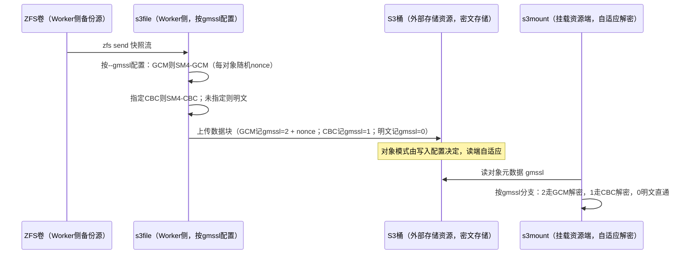

#### 算法版本标识（兼容关键）

复用现有元数据键名 `gmssl`，仅扩展值域，保证老对象无需改写：

| `gmssl` 值 | 含义  | 写端  | 读端  |
| --- | --- | --- | --- |
| 0   | 明文  | `--gmssl` 未指定默认明文 | 直通  |
| 1   | SM4-CBC | `--gmssl` 指定 CBC 时写入 | 必须支持解密 |
| 2   | SM4-GCM | `--gmssl` 指定 GCM 时写入 | 必须支持 GCM 解密 |

GCM 对象新增元数据 `sm4-nonce`（每对象随机 12 字节，hex/base64）；`file-size` 语义不变（仍存原文长度）。CBC 逻辑（固定 IV / padding）完整保留读写能力：按 `--gmssl` 配置分别写入，读端自适应。

#### S3 实现后形态（对象元数据呈现示例）

加密落地后，S3 侧每个对象用元数据表达加密形态（`sm4-nonce` 每对象随机，此处略写）：

| 对象 | `gmssl` | `sm4-nonce` | `file-size` | 说明 |
| --- | --- | --- | --- | --- |
| GCM 对象 | `2` | `9f3a…c1`（12B 随机，hex） | 原文长度 | `--gmssl` 配置 GCM 时写入，读端走 GCM 分支 |
| CBC 对象 | `1` | —（固定 IV，不存 nonce） | 原文长度 | `--gmssl` 配置 CBC 时写入，读端走 CBC 分支 |
| 明文对象 | `0` | — | 原文长度 | `--gmssl` 未指定默认明文，读端直通 |

S3 服务端只存密文块 + 上表元数据，无密钥、无明文；`HeadObject` 即可审计任一对象的加密表达。

#### 读写策略

- **写（s3file，只由配置控制）：** 写模式完全由 `--gmssl` 配置决定（GCM/CBC/明文），不按快照链自动判定、不设默认加密；未指定 `--gmssl` 即明文上传。增量发送与父块合并保持原对象模式，合并后按本次 `--gmssl` 配置加密上传。
- **读（s3file 合并读 + s3mount 挂载读）：** 不依赖本地配置，一律按对象元数据 `gmssl` 值选择分支；解密失败则 fail-closed 报错，不跨模式降级重试（如 GCM 对象不重试 CBC）。
- **升级顺序门禁：** 先升级全部读端（s3mount/s3file）到双模式版本，再允许配置 GCM。老版本读到 `gmssl=2` 会误按 CBC 解密失败——此为预期明确报错，不得静默跳过；另须排查解密关闭的旧挂载点：关闭解密的旧版本会把 GCM 对象当明文静默透出，升级前必须先行清理。

关键参数：`s3file --gmssl=1` 为 CBC；GCM 挡位名以实现为准（如 `--gmssl=2` 或 `--sm4-gcm`，意为显式启用 GCM）；未指定 `--gmssl` 默认明文。

#### S3 跨域存放与密钥同步

S3 为外部存储资源，选址同域优先；确需跨域存放时：密文对象可跨域，密钥不得随密文同通道出域，生产与容灾端密钥同步走变更流程线下/专线同步并登记版本，收发两端持同一密钥（见四）。跨域不改变“服务端只存密文、S3 侧无密钥”的基本姿态。

### 3.3 NFS 类型（外部存储资源，原生 NFS，客户端加密，服务端零改造）

约束：原生 NFS 服务端不可更改、不可装软件（与 3.1.3 后端可控的模拟 NFS 本质不同）。方案在 Worker 侧应用层做 SM4-GCM 预加密后写入 NFS 目录；恢复时由恢复作业读取密文、GCM 解密后写回目标。

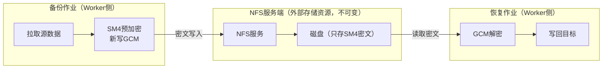

文件系统直接备份到 NFS 适用归档、低频冷数据；应用层加解密叠加 NFS 传输开销，性能不及 ZFS 内核加密，不宜作核心高频业务底座。

写入原子性要求：加密后先写 `<原文件名>.tmp.*` 临时文件与 sidecar，落盘完整后再 rename 为正式文件名；rename 前 `.tmp.*` 与 `.meta.json` 对恢复作业不可见，避免半写文件被恢复作业可见；残留临时文件由下次作业清理后重跑收敛（见 3.6）。

#### NFS 实现后形态（文件布局示例）

加密后文件保持原文件名不变，加密表达由同目录 sidecar meta 文件承载（`<原文件名>.meta.json`）：

```text
/mnt/nfs/<备份集>/               # NFS 服务端所见：原文件名，内容为密文，无密钥
  snap-20260901/

    data-00001                  # 原文件名，SM4-GCM 密文内容（新写）
    data-00001.meta.json        # sidecar：算法=SM4-GCM、nonce、原文长度/校验和
    data-00002.tmp.*            # 未完成的临时文件，rename 前对恢复作业不可见
```

恢复作业只认正式文件 + 同名 `.meta.json`，按清单解密后按原文件名写回目标。

### 3.4 异常故障矩阵（fail-closed 总则）

解密失败一律 fail-closed 报错，不跨模式降级重试：

| 故障点 | 现象 | 策略 | RTO 说明 |
| --- | --- | --- | --- |
| 采集挂（源端 Agent/备份作业异常） | 无新数据到达存储侧 | 作业失败告警，重试由调度发起（见 3.7） | 取决于源端恢复，不在存储加密侧收敛 |
| 半写（NFS 临时文件 / S3 未完成对象 / 断电） | 残留不完整文件或对象 | NFS `.tmp.*`/`.meta.json` 清理后重跑；S3 未完成对象不被引用，下次重传覆盖；ZFS 继承事务组语义 | 下次作业窗口内收敛 |
| 解密失败（密钥错 / 模式错 / nonce 缺失） | 读端报错 | fail-closed，不重试其他模式；GCM 认证失败即判篡改或钥错 | 人工介入（核对密钥与 `gmssl` 版本） |
| 密钥丢失 | 数据彻底不可访问 | 不可恢复，只能从密钥备份恢复（见四） | 取决于密钥备份可用性 |
| CPU 无 SM4 指令 | 性能不可接受 | 升级门禁拦截，禁止上线（见 2.2、五） | 硬件到位前不交付 |

### 3.5 灰度与回滚边界

ZFS 数据集开启加密后不可逆，回滚边界必须事先声明：

- **灰度策略**：灰度与回滚边界只有内部测试环境——首批在内部测试环境验证 `load-key`/`unload-key`、备份还原全链路，不涉及生产池；验证通过后再推广。存量数据不原地加密，通过新建 SM4 数据集承接新写、读端双读过渡。
- **炸了怎么退**：ZFS 侧回退即切回原数据集承接新写（已加密数据不回迁，保留到保留期结束）；S3 侧回退即去掉 GCM 配置（恢复原 `--gmssl` 值或缺省明文），读端保持双模式，已产出 GCM 对象继续可读；NFS 侧回退即停写新密文，存量密文由恢复作业继续可解。
- **回滚边界表**：可逆——S3 写模式配置变更、NFS 启停；不可逆——ZFS 数据集加密开启（只能前滚，不能原地撤销）。

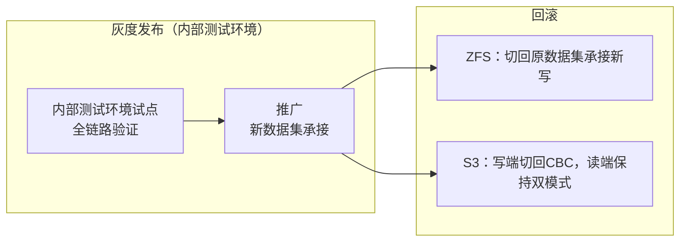

*图源：灰度流程为本方案实施方法综合，约束依据见 3.1.1 与 3.2 升级门禁。*

### 3.6 一致性与重试/断电收敛

写配置决定对象模式、读端按 `gmssl` 自适应，保证重放一致：同一配置重发结果一致，读端按 `gmssl` 值选择分支，重试不改变结果。断电收敛：ZFS 靠事务组语义；S3 未完成对象不被引用、下次重传收敛；NFS 残留临时文件清理后重跑收敛。`zfs receive` 重放同一快照幂等。

### 3.7 可观测性（告警与巡检）

- **加密失败告警**：备份作业失败事件、s3file/s3mount 解密失败（fail-closed 错误码）经 Worker 侧日志采集触发告警；GCM 认证失败按疑似篡改或钥错升级。
- **密钥丢失监控**：定期巡检 `zfs get keystatus`（未加载/加载失败告警）、S3/NFS 收发两端密钥一致性校验任务；密钥备份可用性纳入巡检。
- **运维第一入口**：备份作业日志 → Worker 侧（s3file/恢复作业）→ 存储侧（ZFS 池/桶策略）三段定位，加密失败先查密钥状态与 `gmssl` 版本，再查链路。

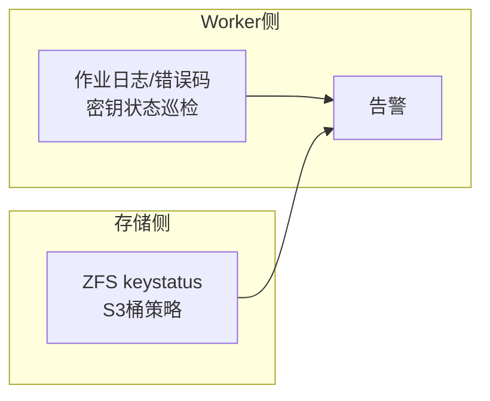

*图源：运维链路为本方案新增，采集对象依据 3.2–3.4 与四。*

### 3.8 容量与本方案无关（显式非目标）

加密机制的正确性与容量无关：S3 对象规模、ZFS 池水位等容量规划事项由存储容量专项承担，不属本方案范围，追问回应：容量与本技术方案无关，不设上线门禁。

### 3.9 实现后清单与加密表达（运维/审计统一视图）

实现完成后，任一备份集的加密表达汇总为一条清单记录，字段与来源如下：

| 清单字段 | ZFS 来源 | S3 来源 | NFS 来源 |
| --- | --- | --- | --- |
| 算法 | `zfs get encryption`（`sm4-gcm`） | `gmssl` 值域映射（0=明文 / 1=CBC / 2=GCM） | sidecar `.meta.json` 算法项 |
| 随机数 | 内核管理（不对用户呈现） | `sm4-nonce` | sidecar nonce 项 |
| 密钥版本/标签 | `keyformat` + 密钥版本登记（见四） | 收发 DEK 版本登记（见四） | 写入端与恢复作业密钥版本登记（见四） |
| 密钥状态 | `keystatus`（3.7 巡检） | 两端一致性校验（3.7 巡检） | 两端一致性校验（3.7 巡检） |
| 完整性 | ZFS 校验和链 | GCM Tag / `file-size` | sidecar 原文长度/校验和 |

审计时按“清单 → 介质表达 → 密钥登记”三段核对：清单有记录、介质表达一致、密钥版本可登记追溯，即认定该备份集加密合规。

---

## 四、密钥与算法版本管理

| 介质  | 密钥/版本形态 | 生命周期要点 |
| --- | --- | --- |
| ZFS 类型（含原生卷/远端卷/模拟 OSS/模拟 NFS） | passphrase / keyformat 密钥（SM4-GCM） | `load-key` 设备出现、`unload-key` 设备消失；密钥剥离后数据彻底不可访问，满足防盗盘要求；模拟 OSS/NFS 复用同一套后端密钥体系 |
| S3 类型（外部存储资源，s3file/s3mount） | 收发同钥的 DEK 体系 + `gmssl` 版本（0=明文 / 1=CBC / 2=GCM，由 `--gmssl` 配置决定）+ `sm4-nonce`（GCM 每对象随机） | 上传与挂载端须持同一密钥；S3 侧无密钥、仅密文，丢密钥即丢数据，需纳入备份 |
| NFS 类型（外部存储资源，原生预加密，恢复作业解密） | SM4-GCM | 写入端与恢复作业持有同一密钥；NFS 服务端不接触密钥 |

管理要求：密钥与密文分离存放；生产与容灾端密钥同步纳入变更流程；模式切换与密钥轮换解耦——本次只换模式不换钥，轮换按卷/桶粒度另立项，避免全量重加密。

密钥备份与同步细则：S3/NFS 收发同钥，丢密钥即丢数据，密钥备份（含版本登记）与密文分离存放，备份可用性纳入 3.7 巡检；生产与容灾端密钥同步走变更流程，跨域时密钥不随密文同通道出域；数据主权合规目标下 S3 选址同域优先，跨域存放方案见 3.2。

---

## 五、验收标准（编号可测）

| 编号 | 验收项 | 方法与通过阈 |
| --- | --- | --- |
| Y1 | fio 基线（硬件加速） | `fio direct=1` 复测 2.2：顺序写损耗约 20%以内、顺序读约 1.5%左右；纯软 SM4 不得上线 |
| Y2 | gmssl 三态互通矩阵 | `gmssl=0/1/2` 对象 × 新老读端 × 写端模式全组合：读端自适应正确，解密失败 fail-closed 且不跨模式重试 |
| Y3 | S3 写模式配置 | `--gmssl` 指定 GCM/CBC 分别写对，未指定默认明文；读端自适应正确 |
| Y4 | ZFS 密钥行为 | `load-key` 后设备出现即时可用、`unload-key` 后设备消失不可读写；iSCSI 还原自动解密 |
| Y5 | 容灾继承 | receive 目标继承源端加密属性，与源端一致 |
| Y6 | NFS 往返 | 预加密写入 → 恢复作业解密写回一致；半写临时文件不可见 |
| Y7 | 升级门禁演练 | 先升全部读端再产 GCM；关闭解密的旧挂载点已清理（见 3.2） |
| Y8 | 监控告警可达 | 加密失败与 `keystatus` 异常可触发告警并定位到三段入口（见 3.7） |

## 附录 A：评审追问回应索引

| 追问 | 回应位置 |
| --- | --- |
| 1. ZFS 加密不可逆，灰度策略与回退 | 3.5（内部测试环境试点、切回承接、回滚边界表） |
| 2. 加密失败与密钥丢失的监控告警链路 | 3.7（三段定位、巡检与告警） |
| 3. 被否决备选与量化理由 | 一、被否决备选（网关/全量重写/LUKS） |
| 4. S3 10 倍对象增长与 ZFS 池水位拐点 | 3.8（容量与本方案无关，显式非目标） |
| 5. S3 跨域与密钥跨域同步 | 3.2 跨域小节、四同步细则 |
| 6. 验收标准编号可测 | 五、Y1–Y8 |

*本方案聚焦存储落盘国密合规。*